# SmartPBX AI - API Specification
## OpenAPI 3.0 Complete Reference

**Version**: 2.0.0  
**Base URL**: `https://api.smartpbx.ai`  
**Protocol**: HTTPS, WebSocket (WSS)

---

## Authentication

All API requests require JWT Bearer token in the Authorization header:

```http
Authorization: Bearer <JWT_TOKEN>
```

**Get Token**:
```http
POST /api/v1/auth/login
Content-Type: application/json

{
  "email": "user@example.com",
  "password": "password123"
}

Response:
{
  "access_token": "eyJhbGciOiJIUzI1NiIs...",
  "token_type": "bearer",
  "expires_in": 3600
}
```

---

## API Endpoints

### 1. Call Management

#### GET /api/v1/calls
Get list of calls with filters

**Request**:
```http
GET /api/v1/calls?skip=0&limit=100&date_from=2026-01-01&date_to=2026-01-31&status=completed
Authorization: Bearer <token>
```

**Query Parameters**:
| Parameter | Type | Required | Description |
|-----------|------|----------|-------------|
| skip | integer | No | Offset (default: 0) |
| limit | integer | No | Max results (default: 100, max: 1000) |
| date_from | datetime | No | Start date (ISO 8601) |
| date_to | datetime | No | End date (ISO 8601) |
| status | string | No | Filter by status (active, completed, failed) |
| caller | string | No | Filter by caller |
| callee | string | No | Filter by callee |

**Response**: `200 OK`
```json
{
  "total": 1543,
  "skip": 0,
  "limit": 100,
  "data": [
    {
      "call_id": "abc123",
      "caller": "1003",
      "callee": "1004",
      "start_time": "2026-01-30T10:00:00Z",
      "end_time": "2026-01-30T10:05:30Z",
      "duration": 330,
      "status": "completed",
      "call_type": "sip_call",
      "has_transcript": true,
      "has_recording": true
    }
  ]
}
```

---

#### GET /api/v1/calls/{call_id}
Get call details

**Request**:
```http
GET /api/v1/calls/abc123
Authorization: Bearer <token>
```

**Response**: `200 OK`
```json
{
  "call_id": "abc123",
  "caller": "1003",
  "callee": "1004",
  "start_time": "2026-01-30T10:00:00Z",
  "end_time": "2026-01-30T10:05:30Z",
  "duration": 330,
  "status": "completed",
  "call_type": "sip_call",
  "metadata": {
    "caller_ip": "10.153.195.11",
    "callee_ip": "10.153.195.83",
    "codec": "PCMU",
    "sample_rate": 8000
  },
  "recordings": [
    {
      "type": "caller",
      "url": "/api/v1/calls/abc123/recording?type=caller",
      "size": 198796,
      "duration": 330
    },
    {
      "type": "callee",
      "url": "/api/v1/calls/abc123/recording?type=callee",
      "size": 182156,
      "duration": 330
    },
    {
      "type": "mixed",
      "url": "/api/v1/calls/abc123/recording?type=mixed",
      "size": 198796,
      "duration": 330
    }
  ],
  "transcript": {
    "url": "/api/v1/calls/abc123/transcript",
    "word_count": 152,
    "quality_score": 0.92
  }
}
```

---

#### GET /api/v1/calls/{call_id}/transcript
Get call transcript

**Request**:
```http
GET /api/v1/calls/abc123/transcript
Authorization: Bearer <token>
```

**Response**: `200 OK`
```json
{
  "call_id": "abc123",
  "content": "발신자: 안녕하세요, 주문 조회하려고 합니다\n수신자: 주문번호 알려주시겠어요?...",
  "speaker_timeline": [
    {
      "timestamp": "00:00:01",
      "speaker": "Caller",
      "text": "안녕하세요, 주문 조회하려고 합니다"
    },
    {
      "timestamp": "00:00:03",
      "speaker": "Callee",
      "text": "주문번호 알려주시겠어요?"
    }
  ],
  "quality_score": 0.92,
  "word_count": 152,
  "language": "ko-KR"
}
```

---

#### GET /api/v1/calls/{call_id}/recording
Download call recording

**Request**:
```http
GET /api/v1/calls/abc123/recording?type=mixed
Authorization: Bearer <token>
```

**Query Parameters**:
| Parameter | Type | Required | Description |
|-----------|------|----------|-------------|
| type | string | No | Recording type (caller, callee, mixed). Default: mixed |

**Response**: `200 OK`
```http
Content-Type: audio/wav
Content-Disposition: attachment; filename="abc123_mixed.wav"
Content-Length: 198796

[Binary WAV data]
```

---

### 2. Knowledge Management

#### GET /api/v1/knowledge
Search knowledge base

**Request**:
```http
GET /api/v1/knowledge?query=배송+조회&top_k=5&category=배송
Authorization: Bearer <token>
```

**Query Parameters**:
| Parameter | Type | Required | Description |
|-----------|------|----------|-------------|
| query | string | Yes | Search query |
| top_k | integer | No | Number of results (default: 5, max: 20) |
| category | string | No | Filter by category |
| date_from | datetime | No | Filter by date |

**Response**: `200 OK`
```json
{
  "query": "배송 조회",
  "results": [
    {
      "id": "qa_001",
      "question": "배송은 언제 도착하나요?",
      "answer": "주문번호 기준, 2일 이내 도착 예정입니다",
      "similarity": 0.95,
      "category": "배송",
      "source": "auto",
      "call_id": "xyz789",
      "date": "2026-01-29T14:30:00Z"
    },
    {
      "id": "qa_002",
      "question": "주문한 상품 언제 받을 수 있나요?",
      "answer": "일반 배송은 2-3일, 제주/도서산간은 4-5일 소요됩니다",
      "similarity": 0.92,
      "category": "배송",
      "source": "operator_correction",
      "call_id": "def456",
      "date": "2026-01-28T11:20:00Z"
    }
  ],
  "total": 2,
  "search_time_ms": 85
}
```

---

#### POST /api/v1/knowledge
Create knowledge manually

**Request**:
```http
POST /api/v1/knowledge
Authorization: Bearer <token>
Content-Type: application/json

{
  "question": "신제품 아이폰 16 Pro 재고 있나요?",
  "answer": "네, 256GB 모델 재고 있습니다. 가격은 1,500,000원입니다",
  "category": "상품문의",
  "source": "manual"
}
```

**Response**: `201 Created`
```json
{
  "id": "qa_003",
  "question": "신제품 아이폰 16 Pro 재고 있나요?",
  "answer": "네, 256GB 모델 재고 있습니다. 가격은 1,500,000원입니다",
  "category": "상품문의",
  "source": "manual",
  "created_at": "2026-01-30T15:00:00Z",
  "created_by": "op001"
}
```

---

#### PUT /api/v1/knowledge/{qa_id}
Update knowledge

**Request**:
```http
PUT /api/v1/knowledge/qa_001
Authorization: Bearer <token>
Content-Type: application/json

{
  "answer": "주문번호 기준, 영업일 기준 2-3일 이내 도착 예정입니다"
}
```

**Response**: `200 OK`
```json
{
  "id": "qa_001",
  "question": "배송은 언제 도착하나요?",
  "answer": "주문번호 기준, 영업일 기준 2-3일 이내 도착 예정입니다",
  "updated_at": "2026-01-30T15:05:00Z",
  "updated_by": "op001"
}
```

---

### 3. AI Agent

#### POST /api/v1/agent/query
Query AI agent

**Request**:
```http
POST /api/v1/agent/query
Authorization: Bearer <token>
Content-Type: application/json

{
  "query": "배송 조회하고 싶어요",
  "session_id": "session_abc",
  "call_id": "call_xyz",
  "context": {
    "caller": "1003",
    "previous_turns": []
  }
}
```

**Response**: `200 OK`
```json
{
  "session_id": "session_abc",
  "response": "주문번호를 알려주시겠어요?",
  "intent": "delivery_tracking",
  "confidence": 0.92,
  "rag_results": [
    {
      "question": "배송 조회",
      "answer": "주문번호 필요",
      "similarity": 0.95
    }
  ],
  "next_action": "ask_order_number",
  "required_slots": ["order_number"],
  "processing_time_ms": 1250
}
```

---

#### GET /api/v1/agent/confidence-stats
Get AI confidence statistics

**Request**:
```http
GET /api/v1/agent/confidence-stats?date_from=2026-01-01&date_to=2026-01-31
Authorization: Bearer <token>
```

**Response**: `200 OK`
```json
{
  "period": {
    "from": "2026-01-01",
    "to": "2026-01-31"
  },
  "total_queries": 5420,
  "confidence_distribution": {
    "high": 3254,      // >80%
    "medium": 1628,    // 60-80%
    "low": 538         // <60%
  },
  "average_confidence": 0.78,
  "trends": [
    {"date": "2026-01-01", "avg_confidence": 0.65},
    {"date": "2026-01-02", "avg_confidence": 0.67},
    {"date": "2026-01-31", "avg_confidence": 0.82}
  ]
}
```

---

### 4. HITL (Human-in-the-Loop)

#### GET /api/v1/hitl/alerts
Get low confidence alerts

**Request**:
```http
GET /api/v1/hitl/alerts?status=pending&limit=50
Authorization: Bearer <token>
```

**Query Parameters**:
| Parameter | Type | Required | Description |
|-----------|------|----------|-------------|
| status | string | No | pending, reviewed, skipped (default: pending) |
| limit | integer | No | Max results (default: 50) |

**Response**: `200 OK`
```json
{
  "total": 15,
  "data": [
    {
      "alert_id": "alert_001",
      "call_id": "abc123",
      "timestamp": "2026-01-30T10:00:00Z",
      "question": "신제품 있나요?",
      "ai_answer": "죄송합니다, 확인이 필요합니다",
      "confidence": 0.25,
      "status": "pending",
      "priority": "high"
    }
  ]
}
```

---

#### POST /api/v1/hitl/feedback
Submit operator feedback

**Request**:
```http
POST /api/v1/hitl/feedback
Authorization: Bearer <token>
Content-Type: application/json

{
  "call_id": "abc123",
  "alert_id": "alert_001",
  "original_question": "신제품 있나요?",
  "original_answer": "죄송합니다, 확인이 필요합니다",
  "corrected_answer": "네, 아이폰 16 Pro 256GB 재고 있습니다. 가격은 1,500,000원입니다",
  "feedback_type": "real_time",
  "operator_id": "op001"
}
```

**Response**: `201 Created`
```json
{
  "feedback_id": "fb_001",
  "status": "saved",
  "knowledge_id": "qa_new_001",
  "confidence_after": 0.95,
  "message": "Feedback saved and knowledge updated successfully"
}
```

---

### 5. Flow Management

#### GET /api/v1/flows
List all ARS flows

**Request**:
```http
GET /api/v1/flows
Authorization: Bearer <token>
```

**Response**: `200 OK`
```json
{
  "total": 5,
  "data": [
    {
      "id": "flow_001",
      "name": "배송 조회 Flow",
      "description": "고객 배송 상태 조회 및 변경",
      "current_version": 3,
      "status": "active",
      "created_by": "admin",
      "created_at": "2026-01-15T09:00:00Z",
      "updated_at": "2026-01-25T14:30:00Z"
    }
  ]
}
```

---

#### GET /api/v1/flows/{flow_id}
Get flow definition

**Request**:
```http
GET /api/v1/flows/flow_001
Authorization: Bearer <token>
```

**Response**: `200 OK`
```json
{
  "id": "flow_001",
  "name": "배송 조회 Flow",
  "current_version": 3,
  "definition": {
    "nodes": [
      {
        "id": "start",
        "type": "intent",
        "data": {
          "intent": "delivery_tracking",
          "greeting": "배송 조회 도와드리겠습니다"
        }
      },
      {
        "id": "ask_order",
        "type": "slot",
        "data": {
          "slot_name": "order_number",
          "question": "주문번호를 알려주시겠어요?"
        }
      },
      {
        "id": "check_delivery",
        "type": "tool",
        "data": {
          "tool_name": "get_delivery_status",
          "parameters": {
            "order_number": "{{slots.order_number}}"
          }
        }
      },
      {
        "id": "response",
        "type": "response",
        "data": {
          "template": "주문번호 {{order_number}}는 {{delivery_status}}입니다"
        }
      }
    ],
    "edges": [
      {"from": "start", "to": "ask_order"},
      {"from": "ask_order", "to": "check_delivery"},
      {"from": "check_delivery", "to": "response"}
    ]
  }
}
```

---

#### POST /api/v1/flows
Create new flow

**Request**:
```http
POST /api/v1/flows
Authorization: Bearer <token>
Content-Type: application/json

{
  "name": "환불 Flow",
  "description": "고객 환불 처리",
  "definition": {
    "nodes": [...],
    "edges": [...]
  }
}
```

**Response**: `201 Created`
```json
{
  "id": "flow_002",
  "name": "환불 Flow",
  "version": 1,
  "status": "draft",
  "created_at": "2026-01-30T15:00:00Z"
}
```

---

#### POST /api/v1/flows/{flow_id}/deploy
Deploy flow to production

**Request**:
```http
POST /api/v1/flows/flow_002/deploy
Authorization: Bearer <token>
Content-Type: application/json

{
  "change_description": "환불 정책 업데이트 반영"
}
```

**Response**: `200 OK`
```json
{
  "flow_id": "flow_002",
  "version": 2,
  "status": "active",
  "deployed_at": "2026-01-30T15:05:00Z",
  "estimated_rollout_time": "5 minutes"
}
```

---

### 6. Metrics & Monitoring

#### GET /api/v1/metrics/performance
Get performance metrics

**Request**:
```http
GET /api/v1/metrics/performance?period=24h
Authorization: Bearer <token>
```

**Response**: `200 OK`
```json
{
  "period": "24h",
  "timestamp": "2026-01-30T15:00:00Z",
  "metrics": {
    "calls": {
      "total": 1543,
      "active": 12,
      "completed": 1520,
      "failed": 11
    },
    "latency": {
      "p50_ms": 850,
      "p95_ms": 1850,
      "p99_ms": 2500
    },
    "ai": {
      "queries_total": 1543,
      "avg_confidence": 0.78,
      "low_confidence_rate": 0.12
    },
    "hitl": {
      "alerts_triggered": 185,
      "interventions": 42,
      "intervention_rate": 0.027
    }
  }
}
```

---

## WebSocket API

### 1. Operator Dashboard WebSocket

**Connect**:
```javascript
const ws = new WebSocket('wss://api.smartpbx.ai/ws/operator/op001?token=<JWT>');

ws.onopen = () => {
  console.log('Connected to operator dashboard');
};

ws.onmessage = (event) => {
  const message = JSON.parse(event.data);
  
  switch (message.type) {
    case 'hitl_alert':
      handleLowConfidenceAlert(message);
      break;
    case 'call_started':
      updateActiveCalls(message);
      break;
    case 'transcript_chunk':
      updateRealTimeTranscript(message);
      break;
  }
};
```

**Message Types (Server → Client)**:

**Type 1: HITL Alert**
```json
{
  "type": "hitl_alert",
  "alert_id": "alert_001",
  "call_id": "abc123",
  "session_id": "session_xyz",
  "timestamp": "2026-01-30T10:00:00Z",
  "question": "신제품 있나요?",
  "ai_answer": "죄송합니다, 확인이 필요합니다",
  "confidence": 0.25,
  "rag_results": [
    {"question": "제품 문의", "similarity": 0.45}
  ]
}
```

**Type 2: Real-time Transcript**
```json
{
  "type": "transcript_chunk",
  "call_id": "abc123",
  "timestamp": "2026-01-30T10:00:05Z",
  "speaker": "Caller",
  "text": "배송은 언제 도착하나요?",
  "is_final": true
}
```

**Message Types (Client → Server)**:

**Type 1: HITL Feedback**
```json
{
  "type": "hitl_feedback",
  "alert_id": "alert_001",
  "call_id": "abc123",
  "corrected_answer": "네, 아이폰 16 Pro 재고 있습니다",
  "operator_id": "op001"
}
```

**Type 2: Ping (Keep-alive)**
```json
{
  "type": "ping"
}
```

**Server Response**:
```json
{
  "type": "pong",
  "timestamp": "2026-01-30T10:00:00Z"
}
```

---

### 2. Agent Dashboard WebSocket (Shadowing Mode)

**Connect**:
```javascript
const ws = new WebSocket('wss://api.smartpbx.ai/ws/agent/agent001?token=<JWT>');
```

**Message Types (Server → Client)**:

**Type: Agent Guidance**
```json
{
  "type": "guidance",
  "call_id": "abc123",
  "timestamp": "2026-01-30T10:00:02Z",
  "question": "배송은 언제 도착하나요?",
  "suggested_answer": "주문번호 기준, 2일 이내 도착 예정입니다",
  "confidence": 0.92,
  "related_policies": [
    "일반 배송: 2-3일",
    "제주/도서산간: 4-5일",
    "3만원 이상 무료배송"
  ],
  "similar_cases": [
    {
      "question": "언제 받을 수 있나요?",
      "answer": "2-3일 소요됩니다",
      "date": "2026-01-29"
    }
  ]
}
```

**Message Types (Client → Server)**:

**Type: Request Guidance**
```json
{
  "type": "request_guidance",
  "call_id": "abc123",
  "query": "배송 정책 알려줘"
}
```

---

## Data Flow Diagrams

### 1. Call Processing Flow (End-to-End)


---

### 2. AI Query Processing Flow

```mermaid
sequenceDiagram
    participant Customer
    participant AIAgent
    participant RAGEngine
    participant VectorDB
    participant LLM
    participant ConfidenceCalc
    participant HITLAlert
    participant Operator
    
    Customer->>AIAgent: "배송 조회하고 싶어요"
    AIAgent->>AIAgent: Intent Classification
    AIAgent->>RAGEngine: Search query
    RAGEngine->>VectorDB: Vector search
    VectorDB-->>RAGEngine: Top 5 results
    RAGEngine-->>AIAgent: RAG results (similarity: 0.92)
    
    AIAgent->>LLM: Generate response
    LLM-->>AIAgent: "주문번호 알려주세요"
    
    AIAgent->>ConfidenceCalc: Calculate score
    ConfidenceCalc-->>AIAgent: Confidence: 0.92 (High)
    
    alt High Confidence (>60%)
        AIAgent->>Customer: "주문번호 알려주세요"
    else Low Confidence (<60%)
        AIAgent->>HITLAlert: Trigger alert
        HITLAlert->>Operator: WebSocket alert
        Operator->>HITLAlert: Corrected answer
        HITLAlert->>VectorDB: Save correction
        HITLAlert->>Customer: Send corrected answer
    end
```



---

### 3. HITL Feedback Loop

```mermaid
flowchart TD
    A[AI 답변 생성] --> B{Confidence Check}
    B -->|>60%| C[고객에게 전송]
    B -->|<60%| D[운영자 알림]
    
    D --> E[운영자 대시보드]
    E --> F{운영자 액션}
    
    F -->|개입| G[정답 입력]
    F -->|무시| C
    
    G --> H[Vector DB 저장]
    H --> I[AI에게 정답 전달]
    I --> C
    
    C --> J[고객 응답]
    J --> K[Audit Log 기록]
    
    H --> L[다음 통화 시]
    L --> M[AI가 정답 학습]
    M --> N[Confidence 상승]
```



---

### 4. Knowledge Extraction Pipeline

```mermaid
flowchart LR
    A[통화 종료] --> B[Transcript 생성]
    B --> C[Semantic Chunking]
    C --> D[Q&A 추출<br/>LLM]
    D --> E[중복 제거<br/>Embedding 비교]
    E --> F[품질 필터링<br/>Quality Score]
    F --> G{품질 통과?}
    G -->|Yes| H[Embedding 생성]
    G -->|No| I[폐기]
    H --> J[Vector DB 저장]
    J --> K[검색 가능<br/>3초 이내]
```



---

## OpenAPI 3.0 Specification

```yaml
openapi: 3.0.3
info:
  title: SmartPBX AI API
  description: Active RAG 기반 지능형 통화 응대 시스템 API
  version: 2.0.0
  contact:
    name: SmartPBX Team
    email: dev@smartpbx.ai
    url: https://smartpbx.ai
  license:
    name: MIT
    url: https://opensource.org/licenses/MIT

servers:
  - url: https://api.smartpbx.ai/api/v1
    description: Production
  - url: https://staging-api.smartpbx.ai/api/v1
    description: Staging
  - url: http://localhost:8000/api/v1
    description: Local Development

security:
  - BearerAuth: []

paths:
  # ==================== Authentication ====================
  /auth/login:
    post:
      tags: [Authentication]
      summary: User login
      security: []  # No auth required
      requestBody:
        required: true
        content:
          application/json:
            schema:
              type: object
              properties:
                email:
                  type: string
                  format: email
                password:
                  type: string
                  format: password
              required: [email, password]
      responses:
        '200':
          description: Login successful
          content:
            application/json:
              schema:
                $ref: '#/components/schemas/TokenResponse'
        '401':
          description: Invalid credentials

  # ==================== Calls ====================
  /calls:
    get:
      tags: [Calls]
      summary: List calls
      parameters:
        - name: skip
          in: query
          schema:
            type: integer
            default: 0
        - name: limit
          in: query
          schema:
            type: integer
            default: 100
            maximum: 1000
        - name: date_from
          in: query
          schema:
            type: string
            format: date-time
        - name: date_to
          in: query
          schema:
            type: string
            format: date-time
        - name: status
          in: query
          schema:
            type: string
            enum: [active, completed, failed]
      responses:
        '200':
          description: Success
          content:
            application/json:
              schema:
                $ref: '#/components/schemas/CallListResponse'

  /calls/{call_id}:
    get:
      tags: [Calls]
      summary: Get call details
      parameters:
        - name: call_id
          in: path
          required: true
          schema:
            type: string
            format: uuid
      responses:
        '200':
          description: Success
          content:
            application/json:
              schema:
                $ref: '#/components/schemas/CallDetail'
        '404':
          description: Call not found

  /calls/{call_id}/transcript:
    get:
      tags: [Calls]
      summary: Get call transcript
      parameters:
        - name: call_id
          in: path
          required: true
          schema:
            type: string
            format: uuid
      responses:
        '200':
          description: Success
          content:
            application/json:
              schema:
                $ref: '#/components/schemas/Transcript'

  /calls/{call_id}/recording:
    get:
      tags: [Calls]
      summary: Download recording
      parameters:
        - name: call_id
          in: path
          required: true
          schema:
            type: string
        - name: type
          in: query
          schema:
            type: string
            enum: [caller, callee, mixed]
            default: mixed
      responses:
        '200':
          description: Success
          content:
            audio/wav:
              schema:
                type: string
                format: binary

  # ==================== Knowledge ====================
  /knowledge:
    get:
      tags: [Knowledge]
      summary: Search knowledge base
      parameters:
        - name: query
          in: query
          required: true
          schema:
            type: string
        - name: top_k
          in: query
          schema:
            type: integer
            default: 5
            maximum: 20
        - name: category
          in: query
          schema:
            type: string
      responses:
        '200':
          description: Success
          content:
            application/json:
              schema:
                $ref: '#/components/schemas/KnowledgeSearchResponse'
    
    post:
      tags: [Knowledge]
      summary: Create knowledge
      requestBody:
        required: true
        content:
          application/json:
            schema:
              $ref: '#/components/schemas/KnowledgeCreate'
      responses:
        '201':
          description: Created
          content:
            application/json:
              schema:
                $ref: '#/components/schemas/Knowledge'

  /knowledge/{qa_id}:
    put:
      tags: [Knowledge]
      summary: Update knowledge
      parameters:
        - name: qa_id
          in: path
          required: true
          schema:
            type: string
      requestBody:
        required: true
        content:
          application/json:
            schema:
              $ref: '#/components/schemas/KnowledgeUpdate'
      responses:
        '200':
          description: Updated
    
    delete:
      tags: [Knowledge]
      summary: Delete knowledge
      parameters:
        - name: qa_id
          in: path
          required: true
          schema:
            type: string
      responses:
        '204':
          description: Deleted

  # ==================== AI Agent ====================
  /agent/query:
    post:
      tags: [AI Agent]
      summary: Query AI agent
      requestBody:
        required: true
        content:
          application/json:
            schema:
              $ref: '#/components/schemas/AgentQueryRequest'
      responses:
        '200':
          description: Success
          content:
            application/json:
              schema:
                $ref: '#/components/schemas/AgentQueryResponse'

  # ==================== HITL ====================
  /hitl/alerts:
    get:
      tags: [HITL]
      summary: Get low confidence alerts
      parameters:
        - name: status
          in: query
          schema:
            type: string
            enum: [pending, reviewed, skipped]
            default: pending
        - name: limit
          in: query
          schema:
            type: integer
            default: 50
      responses:
        '200':
          description: Success
          content:
            application/json:
              schema:
                $ref: '#/components/schemas/HITLAlertList'

  /hitl/feedback:
    post:
      tags: [HITL]
      summary: Submit feedback
      requestBody:
        required: true
        content:
          application/json:
            schema:
              $ref: '#/components/schemas/HITLFeedback'
      responses:
        '201':
          description: Feedback saved

components:
  securitySchemes:
    BearerAuth:
      type: http
      scheme: bearer
      bearerFormat: JWT

  schemas:
    TokenResponse:
      type: object
      properties:
        access_token:
          type: string
        token_type:
          type: string
          default: bearer
        expires_in:
          type: integer

    CallDetail:
      type: object
      properties:
        call_id:
          type: string
          format: uuid
        caller:
          type: string
        callee:
          type: string
        start_time:
          type: string
          format: date-time
        end_time:
          type: string
          format: date-time
        duration:
          type: integer
        status:
          type: string
          enum: [active, completed, failed]
        call_type:
          type: string
        has_transcript:
          type: boolean
        has_recording:
          type: boolean

    Transcript:
      type: object
      properties:
        call_id:
          type: string
        content:
          type: string
        speaker_timeline:
          type: array
          items:
            type: object
            properties:
              timestamp:
                type: string
              speaker:
                type: string
              text:
                type: string
        quality_score:
          type: number
          format: float
        word_count:
          type: integer

    KnowledgeCreate:
      type: object
      required: [question, answer, category]
      properties:
        question:
          type: string
          minLength: 10
        answer:
          type: string
          minLength: 20
        category:
          type: string
        source:
          type: string
          default: manual

    Knowledge:
      type: object
      properties:
        id:
          type: string
        question:
          type: string
        answer:
          type: string
        category:
          type: string
        source:
          type: string
        similarity:
          type: number
          format: float
        call_id:
          type: string
        date:
          type: string
          format: date-time

    AgentQueryRequest:
      type: object
      required: [query, session_id]
      properties:
        query:
          type: string
        session_id:
          type: string
        call_id:
          type: string

    AgentQueryResponse:
      type: object
      properties:
        session_id:
          type: string
        response:
          type: string
        intent:
          type: string
        confidence:
          type: number
        rag_results:
          type: array
        next_action:
          type: string
        processing_time_ms:
          type: integer

    HITLFeedback:
      type: object
      required: [call_id, corrected_answer]
      properties:
        call_id:
          type: string
        alert_id:
          type: string
        original_question:
          type: string
        original_answer:
          type: string
        corrected_answer:
          type: string
        operator_id:
          type: string
```

---

## Error Handling

### Error Response Format

```json
{
  "error": {
    "code": "KNOWLEDGE_NOT_FOUND",
    "message": "Knowledge with ID 'qa_123' not found",
    "details": {
      "qa_id": "qa_123",
      "timestamp": "2026-01-30T15:00:00Z"
    },
    "request_id": "req_abc123"
  }
}
```

### Error Codes

| HTTP Status | Error Code | Description |
|-------------|-----------|-------------|
| 400 | INVALID_REQUEST | Request validation failed |
| 401 | UNAUTHORIZED | Authentication required |
| 403 | FORBIDDEN | Insufficient permissions |
| 404 | NOT_FOUND | Resource not found |
| 409 | CONFLICT | Resource conflict |
| 429 | RATE_LIMITED | Too many requests |
| 500 | INTERNAL_ERROR | Server error |
| 503 | SERVICE_UNAVAILABLE | Service temporarily unavailable |

---

**문서 완료!** Technical Architecture와 API Specification이 작성되었습니다.

**관련 문서**:
- `bmad/docs/technical-architecture.md` - 전체 기술 아키텍처
- `bmad/docs/api-specification.md` - API 명세서

다음 작업을 선택해주세요! 🚀
