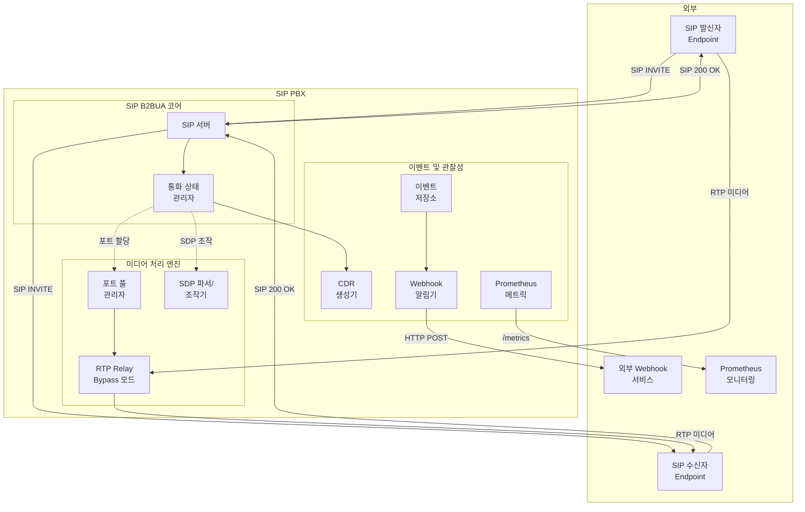

# SIP PBX 아키텍처 문서

## 소개

본 문서는 SIP PBX 프로젝트의 전체 아키텍처를 설명합니다. SIP B2BUA(Back-to-Back User Agent) 시스템으로서 통화 제어 및 미디어 처리 기능을 제공합니다.

### 변경 이력

| 날짜 | 버전 | 설명 | 작성자 |
|------|---------|-------------|--------|
| 2025-10-27 | v1.0 | 초기 아키텍처 생성 | Architect |
| 2025-01-05 | v1.1 | AI 기능 제거, 현재 구현 상태 반영 | Architect |

## 상위 레벨 아키텍처

### 기술 요약

SIP PBX 시스템은 **모듈러 모놀리스** 아키텍처를 채택합니다. 시스템은 SIP B2BUA(Back-to-Back User Agent)로 동작하며, 통화 엔드포인트 간의 시그널링(SIP)과 미디어(RTP) 스트림을 모두 가로채고 제어합니다.

Python 3.11+ 기반의 비동기 처리를 통해 실시간 SIP/RTP 프로토콜 처리를 지원하며, 동적 포트 풀링을 통한 효율적인 미디어 처리를 제공합니다.

모듈러 설계는 3개의 주요 서브시스템으로 관심사를 분리합니다: SIP B2BUA 코어(통화 제어), 미디어 처리 엔진(RTP relay), 이벤트 관리 및 관찰성(webhook, 메트릭, CDR).

### 상위 레벨 개요

**아키텍처 스타일**: 모듈러 모놀리스

시스템은 명확히 분리된 내부 모듈을 가진 단일 배포 서비스로 설계되었으며, 다음을 최적화합니다:
- **저지연 실시간 처리**: SIP 시그널링 및 RTP 미디어
- **운영 단순성**: 간단한 배포 및 확장 모델

**리포지토리 구조**: Monorepo

모든 컴포넌트가 단일 리포지토리에 상주:
- SIP, 미디어 모듈 간 의존성 관리 단순화
- 여러 서브시스템에 걸친 atomic 커밋 가능
- 통합 빌드 및 테스트 파이프라인으로 CI/CD 간소화

**서비스 아키텍처**: 모듈러 모놀리스

주요 컴포넌트:
1. **SIP B2BUA 코어** - SIP 시그널링 및 통화 상태 관리를 처리하는 메인 프로세스
2. **미디어 처리 엔진** - RTP 패킷 relay 처리를 위한 별도 스레드 풀
3. **이벤트 버스** - 인메모리 큐를 사용한 비동기 메시지 전달

이 아키텍처는 다음을 가능하게 합니다:
- **초기 단순성**: MVP를 위한 단일 서비스 배포
- **미래 유연성**: 명확한 모듈 경계로 필요 시 마이크로서비스 추출 가능

**주요 데이터 흐름**:

1. **통화 설정**: SIP INVITE 도착 → B2BUA가 두 개의 독립 leg 생성 (caller ↔ PBX ↔ callee) → 미디어 포트 풀이 통화당 8개 포트 할당 → SDP 조작으로 RTP를 PBX를 통하도록 리디렉션
2. **미디어 흐름** (Bypass): RTP 패킷 → UDP 소켓 → 반대편 leg로 직접 relay → 5ms 이하 지연
3. **통화 종료**: BYE 수신 → 포트 해제 → CDR 생성

**주요 아키텍처 결정사항**:

| 결정 | 근거 |
|----------|-----------|
| Python 3.11+ | asyncio로 동시성 지원, 개발 생산성 |
| 모놀리스 | 100호 목표에 대해 복잡성 감소 |
| 인메모리 이벤트 큐 | 단일 서비스에 충분; 외부 브로커 복잡성 회피 |
| StatefulSet 배포 | 포트 풀 상태 유지; graceful shutdown 지원 |

### 상위 레벨 프로젝트 다이어그램



### 아키텍처 및 디자인 패턴

시스템 설계를 가이드하는 아키텍처 패턴:

- **B2BUA (Back-to-Back User Agent):** PBX가 UAC(User Agent Client)와 UAS(User Agent Server) 역할을 모두 수행하며, 각 통화 leg에 대해 독립적인 SIP 다이얼로그를 유지하는 핵심 SIP 패턴.

- **Repository 패턴:** 세션 상태, 포트 풀 관리, 이벤트 저장을 위한 데이터 접근 추상화.

- **Object Pool 패턴:** 사전 할당된 UDP 포트 쌍(10000-20000 범위)을 풀로 관리.

- **Observer 패턴:** 이벤트 생성이 여러 구독자(webhook 알림기, 메트릭 수집기, CDR 생성기)를 트리거.

- **Strategy 패턴:** 미디어 모드 선택(Bypass)이 설정에 따라 런타임에 결정.

## 기술 스택

### 클라우드 인프라

- **공급자:** Kubernetes 호환 (클라우드 중립 또는 온프레미스)
- **핵심 서비스:** 
  - 컨테이너 오케스트레이션 (Kubernetes/K3s)
  - 로그/CDR용 영구 저장소
  - 수평 확장을 위한 로드 밸런서 (선택사항)
- **배포 리전:** 배포별로 설정 가능; 초기에는 단일 리전

### 기술 스택 테이블

| 카테고리 | 기술 | 버전 | 목적 | 근거 |
|----------|-----------|---------|---------|-----------|
| **언어** | Python | 3.11+ | 주요 개발 언어 | asyncio 동시성; 강력한 생태계 |
| **웹 프레임워크** | aiohttp | 3.9+ | HTTP API, Webhook | 비동기 HTTP 클라이언트/서버 |
| **설정 관리** | Pydantic | 2.5+ | 설정 검증 | 타입 안전, 자동 검증 |
| **모니터링** | Prometheus | - | 메트릭 수집 | 업계 표준 |
| **로깅** | structlog | Latest | 구조화 로깅 | JSON 로깅, 컨텍스트 전파 |
| **컨테이너** | Docker | Latest | 배포 단위 | 일관된 환경 |
| **오케스트레이션** | Kubernetes | 1.25+ | 컨테이너 관리 | StatefulSet 지원 |

## 디렉토리 구조

```
sip-pbx/
├── src/
│   ├── main.py                 # 애플리케이션 진입점
│   ├── sip_core/               # SIP B2BUA 코어
│   │   ├── sip_endpoint.py
│   │   ├── call_manager.py
│   │   └── models/
│   ├── media/                  # 미디어 처리
│   │   ├── port_pool.py
│   │   ├── rtp_relay.py
│   │   ├── sdp_parser.py
│   │   └── codec/
│   ├── events/                 # 이벤트 관리
│   │   ├── event_store.py
│   │   ├── webhook.py
│   │   └── cdr.py
│   ├── monitoring/             # 관찰성
│   │   └── metrics.py
│   └── config/                 # 설정
│       └── models.py
├── tests/                      # 테스트
│   ├── unit/
│   └── integration/
├── config/                     # 설정 파일
│   └── config.example.yaml
├── docs/                       # 문서
├── k8s/                        # Kubernetes 매니페스트
└── requirements.txt            # Python 의존성
```

## 컴포넌트 상세 설명

### 1. SIP B2BUA 코어

**목적**: SIP 프로토콜 처리 및 통화 상태 관리

**주요 클래스**:
- `MockSIPEndpoint`: SIP 서버 구현
- `CallManager`: 통화 세션 관리
- `CallSession`: 통화 상태 추적

**지원 메서드**:
- REGISTER: 사용자 등록
- INVITE: 통화 시작
- ACK: 통화 확인
- BYE: 통화 종료
- UPDATE: 통화 중 업데이트
- PRACK: 신뢰성 있는 provisional 응답
- CANCEL: 통화 취소

### 2. 미디어 처리 엔진

**목적**: RTP 스트림 처리

**주요 컴포넌트**:
- `PortPool`: UDP 포트 풀 관리
- `RTPRelay`: RTP 패킷 relay
- `SDPParser`: SDP 파싱 및 조작
- `MediaSession`: 미디어 세션 추적

**처리 모드**:
- **Bypass**: RTP 패킷 직접 relay (저지연)

### 3. 이벤트 관리

**목적**: 시스템 이벤트 처리 및 알림

**주요 컴포넌트**:
- `EventStore`: 이벤트 저장소
- `WebhookNotifier`: Webhook 전송
- `CDRGenerator`: 통화 기록 생성

**이벤트 타입**:
- 통화 시작
- 통화 종료
- 에러 발생

### 4. 모니터링

**Prometheus 메트릭**:
- `sip_pbx_active_calls`: 활성 통화 수
- `sip_pbx_total_calls`: 총 통화 수
- `sip_pbx_call_duration_seconds`: 통화 시간
- `sip_pbx_errors_total`: 에러 발생 수

## 배포 아키텍처

### Kubernetes 배포

```yaml
apiVersion: apps/v1
kind: StatefulSet
metadata:
  name: sip-pbx
spec:
  serviceName: sip-pbx
  replicas: 1
  selector:
    matchLabels:
      app: sip-pbx
  template:
    metadata:
      labels:
        app: sip-pbx
    spec:
      containers:
      - name: sip-pbx
        image: sip-pbx:latest
        ports:
        - containerPort: 5060
          protocol: UDP
        - containerPort: 8080
          protocol: TCP
        - containerPort: 9090
          protocol: TCP
        resources:
          requests:
            memory: "2Gi"
            cpu: "1000m"
          limits:
            memory: "4Gi"
            cpu: "2000m"
```

## 보안 고려사항

1. **SIP 보안**
   - TLS 전송 지원 (계획)
   - SIP 인증 (계획)

2. **API 보안**
   - API 키 인증
   - HTTPS 지원 (계획)

3. **네트워크 보안**
   - 방화벽 설정
   - 포트 제한

## 성능 목표

- 동시 통화: 100호
- SIP 통화 설정 시간: <1초
- RTP Bypass 지연: <5ms
- 메모리 사용: <4GB
- CPU 사용률: <70%

## 확장성 고려사항

- Horizontal scaling을 위한 StatefulSet 사용
- 포트 풀 크기 조정 가능
- 설정을 통한 리소스 제한

## 라이선스

MIT License

