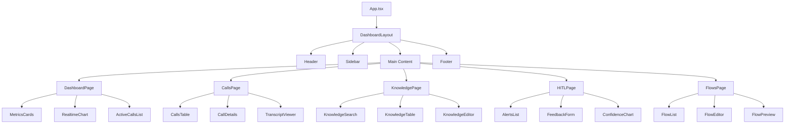

# SmartPBX AI - Frontend Architecture
## React 기반 운영자 & 상담원 대시보드

**문서 버전**: v1.0  
**작성일**: 2026-01-30  
**작성자**: Frontend Team  
**상태**: Design Review

---

## 📋 목차

1. [Overview](#overview)
2. [Technology Stack](#technology-stack)
3. [Project Structure](#project-structure)
4. [Component Architecture](#component-architecture)
5. [State Management](#state-management)
6. [API Integration](#api-integration)
7. [WebSocket Integration](#websocket-integration)
8. [Routing & Navigation](#routing--navigation)
9. [UI/UX Design System](#uiux-design-system)
10. [Key Features Implementation](#key-features-implementation)
11. [Performance Optimization](#performance-optimization)
12. [Build & Deployment](#build--deployment)

---

## Overview

### Application Types

**1. Operator Dashboard** (`/dashboard`)
- 실시간 통화 모니터링
- HITL (Human-in-the-Loop) 피드백
- Knowledge Base 관리
- AI 성능 모니터링
- Flow 관리

**2. Agent Dashboard** (`/agent`)
- Shadowing Mode (실시간 AI 가이드)
- 통화 중 지식 검색
- 통화 이력 조회
- 성과 리포트

**3. Admin Portal** (`/admin`)
- 사용자 관리
- 시스템 설정
- 권한 관리
- Audit Log 조회

---

## Technology Stack

### Core Framework

```json
{
  "framework": "React 18.2",
  "language": "TypeScript 5.0",
  "build": "Vite 4.0",
  "package-manager": "pnpm"
}
```

### UI Libraries

| Category | Library | Version | Purpose |
|----------|---------|---------|---------|
| **Component Library** | shadcn/ui | Latest | Base components |
| **Styling** | Tailwind CSS | 3.3 | Utility-first CSS |
| **Icons** | Lucide React | Latest | Icon library |
| **Charts** | Recharts | 2.5 | Data visualization |
| **Tables** | TanStack Table | 8.0 | Advanced tables |
| **Forms** | React Hook Form | 7.0 | Form management |
| **Validation** | Zod | 3.0 | Schema validation |

### State Management

| Category | Library | Purpose |
|----------|---------|---------|
| **Global State** | Zustand | Lightweight state |
| **Server State** | TanStack Query | API caching |
| **Form State** | React Hook Form | Form state |

### Real-time Communication

| Category | Library | Purpose |
|----------|---------|---------|
| **WebSocket** | Native WebSocket | Real-time updates |
| **Event Bus** | mitt | Event emitter |

### Development Tools

```json
{
  "linter": "ESLint 8.0",
  "formatter": "Prettier 3.0",
  "type-checker": "TypeScript",
  "testing": {
    "unit": "Vitest",
    "e2e": "Playwright",
    "coverage": "Vitest Coverage"
  }
}
```

---

## Project Structure

```
frontend/
├── public/
│   ├── favicon.ico
│   └── assets/
│
├── src/
│   ├── main.tsx                    # Entry point
│   ├── App.tsx                     # Root component
│   │
│   ├── components/                 # Shared components
│   │   ├── ui/                     # shadcn/ui components
│   │   │   ├── button.tsx
│   │   │   ├── card.tsx
│   │   │   ├── dialog.tsx
│   │   │   ├── input.tsx
│   │   │   ├── table.tsx
│   │   │   └── ...
│   │   │
│   │   ├── layout/                 # Layout components
│   │   │   ├── Header.tsx
│   │   │   ├── Sidebar.tsx
│   │   │   ├── Footer.tsx
│   │   │   └── DashboardLayout.tsx
│   │   │
│   │   ├── common/                 # Common components
│   │   │   ├── Loading.tsx
│   │   │   ├── ErrorBoundary.tsx
│   │   │   ├── EmptyState.tsx
│   │   │   └── ...
│   │   │
│   │   └── features/               # Feature-specific components
│   │       ├── calls/
│   │       ├── knowledge/
│   │       ├── hitl/
│   │       ├── flows/
│   │       └── agent/
│   │
│   ├── pages/                      # Page components
│   │   ├── DashboardPage.tsx
│   │   ├── CallsPage.tsx
│   │   ├── KnowledgePage.tsx
│   │   ├── HITLPage.tsx
│   │   ├── FlowsPage.tsx
│   │   ├── AgentPage.tsx
│   │   ├── SettingsPage.tsx
│   │   └── LoginPage.tsx
│   │
│   ├── stores/                     # Zustand stores
│   │   ├── authStore.ts
│   │   ├── callStore.ts
│   │   ├── knowledgeStore.ts
│   │   ├── hitlStore.ts
│   │   ├── wsStore.ts
│   │   └── uiStore.ts
│   │
│   ├── api/                        # API clients
│   │   ├── client.ts               # Axios instance
│   │   ├── calls.ts
│   │   ├── knowledge.ts
│   │   ├── hitl.ts
│   │   ├── flows.ts
│   │   ├── agent.ts
│   │   └── auth.ts
│   │
│   ├── hooks/                      # Custom hooks
│   │   ├── useAuth.ts
│   │   ├── useCalls.ts
│   │   ├── useKnowledge.ts
│   │   ├── useWebSocket.ts
│   │   ├── useRealTimeTranscript.ts
│   │   └── useHITL.ts
│   │
│   ├── lib/                        # Utilities
│   │   ├── utils.ts
│   │   ├── format.ts
│   │   ├── validation.ts
│   │   └── constants.ts
│   │
│   ├── types/                      # TypeScript types
│   │   ├── api.types.ts
│   │   ├── call.types.ts
│   │   ├── knowledge.types.ts
│   │   ├── hitl.types.ts
│   │   ├── flow.types.ts
│   │   └── websocket.types.ts
│   │
│   ├── routes/                     # Route configuration
│   │   └── index.tsx
│   │
│   └── styles/                     # Global styles
│       ├── globals.css
│       └── tailwind.css
│
├── tests/                          # Test files
│   ├── unit/
│   ├── integration/
│   └── e2e/
│
├── .env.development
├── .env.production
├── package.json
├── tsconfig.json
├── vite.config.ts
├── tailwind.config.js
└── README.md
```

---

## Component Architecture

### Design Principles

1. **Atomic Design**: Atoms → Molecules → Organisms → Templates → Pages
2. **Component Composition**: Small, reusable components
3. **Single Responsibility**: One component, one purpose
4. **Type Safety**: Full TypeScript coverage
5. **Accessibility**: WCAG 2.1 AA compliant

---

### Component Hierarchy



---

### Base Component Implementation

#### Button Component (shadcn/ui)

```tsx
// src/components/ui/button.tsx

import * as React from "react"
import { Slot } from "@radix-ui/react-slot"
import { cva, type VariantProps } from "class-variance-authority"
import { cn } from "@/lib/utils"

const buttonVariants = cva(
  "inline-flex items-center justify-center rounded-md text-sm font-medium ring-offset-background transition-colors focus-visible:outline-none focus-visible:ring-2 focus-visible:ring-ring focus-visible:ring-offset-2 disabled:pointer-events-none disabled:opacity-50",
  {
    variants: {
      variant: {
        default: "bg-primary text-primary-foreground hover:bg-primary/90",
        destructive: "bg-destructive text-destructive-foreground hover:bg-destructive/90",
        outline: "border border-input bg-background hover:bg-accent hover:text-accent-foreground",
        secondary: "bg-secondary text-secondary-foreground hover:bg-secondary/80",
        ghost: "hover:bg-accent hover:text-accent-foreground",
        link: "text-primary underline-offset-4 hover:underline",
      },
      size: {
        default: "h-10 px-4 py-2",
        sm: "h-9 rounded-md px-3",
        lg: "h-11 rounded-md px-8",
        icon: "h-10 w-10",
      },
    },
    defaultVariants: {
      variant: "default",
      size: "default",
    },
  }
)

export interface ButtonProps
  extends React.ButtonHTMLAttributes<HTMLButtonElement>,
    VariantProps<typeof buttonVariants> {
  asChild?: boolean
}

const Button = React.forwardRef<HTMLButtonElement, ButtonProps>(
  ({ className, variant, size, asChild = false, ...props }, ref) => {
    const Comp = asChild ? Slot : "button"
    return (
      <Comp
        className={cn(buttonVariants({ variant, size, className }))}
        ref={ref}
        {...props}
      />
    )
  }
)
Button.displayName = "Button"

export { Button, buttonVariants }
```

---

### Layout Components

#### Dashboard Layout

```tsx
// src/components/layout/DashboardLayout.tsx

import { useState } from 'react'
import { Outlet } from 'react-router-dom'
import { Header } from './Header'
import { Sidebar } from './Sidebar'
import { Footer } from './Footer'
import { cn } from '@/lib/utils'

export function DashboardLayout() {
  const [sidebarCollapsed, setSidebarCollapsed] = useState(false)

  return (
    <div className="min-h-screen bg-background">
      <Header />
      
      <div className="flex">
        <Sidebar 
          collapsed={sidebarCollapsed}
          onToggle={() => setSidebarCollapsed(!sidebarCollapsed)}
        />
        
        <main 
          className={cn(
            "flex-1 transition-all duration-300",
            sidebarCollapsed ? "ml-16" : "ml-64"
          )}
        >
          <div className="container mx-auto p-6">
            <Outlet />
          </div>
        </main>
      </div>
      
      <Footer />
    </div>
  )
}
```

#### Header Component

```tsx
// src/components/layout/Header.tsx

import { Bell, Settings, User } from 'lucide-react'
import { Button } from '@/components/ui/button'
import {
  DropdownMenu,
  DropdownMenuContent,
  DropdownMenuItem,
  DropdownMenuLabel,
  DropdownMenuSeparator,
  DropdownMenuTrigger,
} from '@/components/ui/dropdown-menu'
import { useAuthStore } from '@/stores/authStore'
import { useNotificationStore } from '@/stores/notificationStore'

export function Header() {
  const { user, logout } = useAuthStore()
  const { unreadCount } = useNotificationStore()

  return (
    <header className="sticky top-0 z-50 w-full border-b bg-background/95 backdrop-blur supports-[backdrop-filter]:bg-background/60">
      <div className="container flex h-16 items-center justify-between">
        {/* Logo */}
        <div className="flex items-center gap-2">
          
          <span className="text-xl font-bold">SmartPBX AI</span>
        </div>

        {/* Right Section */}
        <div className="flex items-center gap-4">
          {/* Notifications */}
          <Button variant="ghost" size="icon" className="relative">
            <Bell className="h-5 w-5" />
            {unreadCount > 0 && (
              <span className="absolute right-1 top-1 flex h-4 w-4 items-center justify-center rounded-full bg-red-500 text-xs text-white">
                {unreadCount}
              </span>
            )}
          </Button>

          {/* Settings */}
          <Button variant="ghost" size="icon">
            <Settings className="h-5 w-5" />
          </Button>

          {/* User Menu */}
          <DropdownMenu>
            <DropdownMenuTrigger asChild>
              <Button variant="ghost" size="icon">
                <User className="h-5 w-5" />
              </Button>
            </DropdownMenuTrigger>
            <DropdownMenuContent align="end" className="w-56">
              <DropdownMenuLabel>
                <div className="flex flex-col space-y-1">
                  <p className="text-sm font-medium">{user?.name}</p>
                  <p className="text-xs text-muted-foreground">{user?.email}</p>
                </div>
              </DropdownMenuLabel>
              <DropdownMenuSeparator />
              <DropdownMenuItem>프로필</DropdownMenuItem>
              <DropdownMenuItem>설정</DropdownMenuItem>
              <DropdownMenuSeparator />
              <DropdownMenuItem onClick={logout}>로그아웃</DropdownMenuItem>
            </DropdownMenuContent>
          </DropdownMenu>
        </div>
      </div>
    </header>
  )
}
```

#### Sidebar Component

```tsx
// src/components/layout/Sidebar.tsx

import { Link, useLocation } from 'react-router-dom'
import { cn } from '@/lib/utils'
import {
  LayoutDashboard,
  Phone,
  BookOpen,
  AlertCircle,
  GitBranch,
  BarChart3,
  ChevronLeft,
  ChevronRight,
} from 'lucide-react'
import { Button } from '@/components/ui/button'
import { useAuthStore } from '@/stores/authStore'

interface SidebarProps {
  collapsed: boolean
  onToggle: () => void
}

const menuItems = [
  { icon: LayoutDashboard, label: '대시보드', path: '/dashboard', roles: ['admin', 'operator'] },
  { icon: Phone, label: '통화 관리', path: '/calls', roles: ['admin', 'operator'] },
  { icon: BookOpen, label: 'Knowledge', path: '/knowledge', roles: ['admin', 'operator'] },
  { icon: AlertCircle, label: 'HITL', path: '/hitl', roles: ['admin', 'operator'] },
  { icon: GitBranch, label: 'Flow 관리', path: '/flows', roles: ['admin', 'operator'] },
  { icon: BarChart3, label: '통계', path: '/analytics', roles: ['admin', 'operator'] },
]

export function Sidebar({ collapsed, onToggle }: SidebarProps) {
  const location = useLocation()
  const { user } = useAuthStore()

  const filteredMenuItems = menuItems.filter(item =>
    item.roles.includes(user?.role || '')
  )

  return (
    <aside
      className={cn(
        "fixed left-0 top-16 z-40 h-[calc(100vh-4rem)] border-r bg-background transition-all duration-300",
        collapsed ? "w-16" : "w-64"
      )}
    >
      {/* Toggle Button */}
      <div className="flex h-12 items-center justify-end border-b px-2">
        <Button
          variant="ghost"
          size="icon"
          onClick={onToggle}
          className="h-8 w-8"
        >
          {collapsed ? (
            <ChevronRight className="h-4 w-4" />
          ) : (
            <ChevronLeft className="h-4 w-4" />
          )}
        </Button>
      </div>

      {/* Menu Items */}
      <nav className="space-y-1 p-2">
        {filteredMenuItems.map((item) => {
          const Icon = item.icon
          const isActive = location.pathname === item.path

          return (
            <Link key={item.path} to={item.path}>
              <div
                className={cn(
                  "flex items-center gap-3 rounded-md px-3 py-2 text-sm font-medium transition-colors",
                  isActive
                    ? "bg-primary text-primary-foreground"
                    : "text-muted-foreground hover:bg-accent hover:text-accent-foreground"
                )}
              >
                <Icon className="h-5 w-5 flex-shrink-0" />
                {!collapsed && <span>{item.label}</span>}
              </div>
            </Link>
          )
        })}
      </nav>
    </aside>
  )
}
```

---

## State Management

### Zustand Store Architecture

#### Auth Store

```typescript
// src/stores/authStore.ts

import { create } from 'zustand'
import { persist } from 'zustand/middleware'
import { authAPI } from '@/api/auth'

interface User {
  id: string
  email: string
  name: string
  role: 'admin' | 'operator' | 'agent' | 'viewer'
}

interface AuthState {
  user: User | null
  token: string | null
  isAuthenticated: boolean
  
  // Actions
  login: (email: string, password: string) => Promise<void>
  logout: () => void
  setUser: (user: User) => void
  checkAuth: () => Promise<void>
}

export const useAuthStore = create<AuthState>()(
  persist(
    (set, get) => ({
      user: null,
      token: null,
      isAuthenticated: false,

      login: async (email, password) => {
        try {
          const response = await authAPI.login(email, password)
          set({
            user: response.user,
            token: response.access_token,
            isAuthenticated: true,
          })
        } catch (error) {
          console.error('Login failed:', error)
          throw error
        }
      },

      logout: () => {
        set({
          user: null,
          token: null,
          isAuthenticated: false,
        })
      },

      setUser: (user) => {
        set({ user })
      },

      checkAuth: async () => {
        const { token } = get()
        if (!token) {
          set({ isAuthenticated: false })
          return
        }

        try {
          const user = await authAPI.getCurrentUser()
          set({ user, isAuthenticated: true })
        } catch (error) {
          set({ user: null, token: null, isAuthenticated: false })
        }
      },
    }),
    {
      name: 'auth-storage',
      partialize: (state) => ({
        token: state.token,
      }),
    }
  )
)
```

---

#### Call Store

```typescript
// src/stores/callStore.ts

import { create } from 'zustand'
import { subscribeWithSelector } from 'zustand/middleware'

interface Call {
  call_id: string
  caller: string
  callee: string
  status: 'active' | 'completed' | 'failed'
  start_time: string
  duration?: number
}

interface CallState {
  // State
  activeCalls: Call[]
  recentCalls: Call[]
  selectedCall: Call | null
  
  // Actions
  addActiveCall: (call: Call) => void
  updateCall: (callId: string, updates: Partial<Call>) => void
  removeActiveCall: (callId: string) => void
  setSelectedCall: (call: Call | null) => void
  addRecentCall: (call: Call) => void
}

export const useCallStore = create<CallState>()(
  subscribeWithSelector((set) => ({
    activeCalls: [],
    recentCalls: [],
    selectedCall: null,

    addActiveCall: (call) =>
      set((state) => ({
        activeCalls: [...state.activeCalls, call],
      })),

    updateCall: (callId, updates) =>
      set((state) => ({
        activeCalls: state.activeCalls.map((call) =>
          call.call_id === callId ? { ...call, ...updates } : call
        ),
      })),

    removeActiveCall: (callId) =>
      set((state) => ({
        activeCalls: state.activeCalls.filter((call) => call.call_id !== callId),
      })),

    setSelectedCall: (call) =>
      set({ selectedCall: call }),

    addRecentCall: (call) =>
      set((state) => ({
        recentCalls: [call, ...state.recentCalls].slice(0, 50),
      })),
  }))
)
```

---

#### HITL Store

```typescript
// src/stores/hitlStore.ts

import { create } from 'zustand'

interface HITLAlert {
  alert_id: string
  call_id: string
  timestamp: string
  question: string
  ai_answer: string
  confidence: number
  status: 'pending' | 'reviewed' | 'skipped'
}

interface HITLState {
  // State
  alerts: HITLAlert[]
  activeAlert: HITLAlert | null
  
  // Stats
  totalAlerts: number
  pendingAlerts: number
  
  // Actions
  addAlert: (alert: HITLAlert) => void
  updateAlert: (alertId: string, updates: Partial<HITLAlert>) => void
  setActiveAlert: (alert: HITLAlert | null) => void
  removeAlert: (alertId: string) => void
  clearAlerts: () => void
}

export const useHITLStore = create<HITLState>((set, get) => ({
  alerts: [],
  activeAlert: null,
  totalAlerts: 0,
  pendingAlerts: 0,

  addAlert: (alert) =>
    set((state) => {
      const newAlerts = [alert, ...state.alerts]
      return {
        alerts: newAlerts,
        totalAlerts: state.totalAlerts + 1,
        pendingAlerts: newAlerts.filter((a) => a.status === 'pending').length,
      }
    }),

  updateAlert: (alertId, updates) =>
    set((state) => {
      const newAlerts = state.alerts.map((alert) =>
        alert.alert_id === alertId ? { ...alert, ...updates } : alert
      )
      return {
        alerts: newAlerts,
        pendingAlerts: newAlerts.filter((a) => a.status === 'pending').length,
      }
    }),

  setActiveAlert: (alert) =>
    set({ activeAlert: alert }),

  removeAlert: (alertId) =>
    set((state) => ({
      alerts: state.alerts.filter((alert) => alert.alert_id !== alertId),
    })),

  clearAlerts: () =>
    set({ alerts: [], activeAlert: null, pendingAlerts: 0 }),
}))
```

---

#### WebSocket Store

```typescript
// src/stores/wsStore.ts

import { create } from 'zustand'

type ConnectionStatus = 'disconnected' | 'connecting' | 'connected' | 'error'

interface WebSocketState {
  // State
  ws: WebSocket | null
  status: ConnectionStatus
  reconnectAttempts: number
  
  // Actions
  connect: (url: string, token: string) => void
  disconnect: () => void
  send: (message: any) => void
  
  // Event handlers
  onMessage: (handler: (data: any) => void) => void
  onStatusChange: (handler: (status: ConnectionStatus) => void) => void
}

const MAX_RECONNECT_ATTEMPTS = 5
const RECONNECT_DELAY = 3000

export const useWebSocketStore = create<WebSocketState>((set, get) => {
  let messageHandlers: Array<(data: any) => void> = []
  let statusHandlers: Array<(status: ConnectionStatus) => void> = []
  let reconnectTimer: NodeJS.Timeout | null = null

  const notifyStatusChange = (status: ConnectionStatus) => {
    statusHandlers.forEach((handler) => handler(status))
  }

  const attemptReconnect = (url: string, token: string) => {
    const { reconnectAttempts } = get()
    
    if (reconnectAttempts >= MAX_RECONNECT_ATTEMPTS) {
      console.error('Max reconnection attempts reached')
      set({ status: 'error' })
      notifyStatusChange('error')
      return
    }

    console.log(`Reconnecting... Attempt ${reconnectAttempts + 1}`)
    reconnectTimer = setTimeout(() => {
      set({ reconnectAttempts: reconnectAttempts + 1 })
      get().connect(url, token)
    }, RECONNECT_DELAY)
  }

  return {
    ws: null,
    status: 'disconnected',
    reconnectAttempts: 0,

    connect: (url, token) => {
      const { ws: existingWs } = get()
      
      // Close existing connection
      if (existingWs) {
        existingWs.close()
      }

      set({ status: 'connecting' })
      notifyStatusChange('connecting')

      const wsUrl = `${url}?token=${token}`
      const ws = new WebSocket(wsUrl)

      ws.onopen = () => {
        console.log('WebSocket connected')
        set({ ws, status: 'connected', reconnectAttempts: 0 })
        notifyStatusChange('connected')

        // Send ping every 30 seconds
        const pingInterval = setInterval(() => {
          if (ws.readyState === WebSocket.OPEN) {
            ws.send(JSON.stringify({ type: 'ping' }))
          }
        }, 30000)

        ws.addEventListener('close', () => {
          clearInterval(pingInterval)
        })
      }

      ws.onmessage = (event) => {
        try {
          const data = JSON.parse(event.data)
          messageHandlers.forEach((handler) => handler(data))
        } catch (error) {
          console.error('Failed to parse WebSocket message:', error)
        }
      }

      ws.onerror = (error) => {
        console.error('WebSocket error:', error)
        set({ status: 'error' })
        notifyStatusChange('error')
      }

      ws.onclose = () => {
        console.log('WebSocket disconnected')
        set({ ws: null, status: 'disconnected' })
        notifyStatusChange('disconnected')

        // Attempt reconnection
        attemptReconnect(url, token)
      }
    },

    disconnect: () => {
      const { ws } = get()
      
      if (reconnectTimer) {
        clearTimeout(reconnectTimer)
        reconnectTimer = null
      }

      if (ws) {
        ws.close()
      }

      set({ ws: null, status: 'disconnected', reconnectAttempts: 0 })
      notifyStatusChange('disconnected')
    },

    send: (message) => {
      const { ws, status } = get()
      
      if (status !== 'connected' || !ws) {
        console.warn('WebSocket not connected')
        return
      }

      ws.send(JSON.stringify(message))
    },

    onMessage: (handler) => {
      messageHandlers.push(handler)
      
      // Return cleanup function
      return () => {
        messageHandlers = messageHandlers.filter((h) => h !== handler)
      }
    },

    onStatusChange: (handler) => {
      statusHandlers.push(handler)
      
      return () => {
        statusHandlers = statusHandlers.filter((h) => h !== handler)
      }
    },
  }
})
```

---

## API Integration

### Axios Client Setup

```typescript
// src/api/client.ts

import axios, { AxiosError, AxiosRequestConfig } from 'axios'
import { useAuthStore } from '@/stores/authStore'

const BASE_URL = import.meta.env.VITE_API_URL || 'https://api.smartpbx.ai/api/v1'

// Create Axios instance
export const apiClient = axios.create({
  baseURL: BASE_URL,
  timeout: 30000,
  headers: {
    'Content-Type': 'application/json',
  },
})

// Request interceptor (add auth token)
apiClient.interceptors.request.use(
  (config) => {
    const { token } = useAuthStore.getState()
    
    if (token) {
      config.headers.Authorization = `Bearer ${token}`
    }
    
    return config
  },
  (error) => {
    return Promise.reject(error)
  }
)

// Response interceptor (handle errors)
apiClient.interceptors.response.use(
  (response) => response.data,
  (error: AxiosError) => {
    if (error.response?.status === 401) {
      // Unauthorized - clear auth and redirect to login
      useAuthStore.getState().logout()
      window.location.href = '/login'
    }

    // Extract error message
    const errorMessage = 
      (error.response?.data as any)?.error?.message || 
      error.message || 
      'An error occurred'

    return Promise.reject(new Error(errorMessage))
  }
)

// Generic API call function
export async function apiCall<T>(
  config: AxiosRequestConfig
): Promise<T> {
  return apiClient(config)
}
```

---

### API Modules

#### Calls API

```typescript
// src/api/calls.ts

import { apiCall } from './client'

export interface Call {
  call_id: string
  caller: string
  callee: string
  start_time: string
  end_time?: string
  duration?: number
  status: 'active' | 'completed' | 'failed'
  call_type: string
  has_transcript: boolean
  has_recording: boolean
}

export interface CallListResponse {
  total: number
  skip: number
  limit: number
  data: Call[]
}

export interface Transcript {
  call_id: string
  content: string
  speaker_timeline: Array<{
    timestamp: string
    speaker: string
    text: string
  }>
  quality_score: number
  word_count: number
}

export const callsAPI = {
  // List calls
  list: (params?: {
    skip?: number
    limit?: number
    date_from?: string
    date_to?: string
    status?: string
  }) =>
    apiCall<CallListResponse>({
      method: 'GET',
      url: '/calls',
      params,
    }),

  // Get call details
  get: (callId: string) =>
    apiCall<Call>({
      method: 'GET',
      url: `/calls/${callId}`,
    }),

  // Get transcript
  getTranscript: (callId: string) =>
    apiCall<Transcript>({
      method: 'GET',
      url: `/calls/${callId}/transcript`,
    }),

  // Download recording
  downloadRecording: (callId: string, type: 'caller' | 'callee' | 'mixed' = 'mixed') => {
    const url = `${import.meta.env.VITE_API_URL}/calls/${callId}/recording?type=${type}`
    window.open(url, '_blank')
  },
}
```

---

#### Knowledge API

```typescript
// src/api/knowledge.ts

import { apiCall } from './client'

export interface Knowledge {
  id: string
  question: string
  answer: string
  category: string
  source: 'auto' | 'operator_correction' | 'manual'
  similarity?: number
  call_id?: string
  date: string
}

export interface KnowledgeSearchResponse {
  query: string
  results: Knowledge[]
  total: number
  search_time_ms: number
}

export const knowledgeAPI = {
  // Search
  search: (params: {
    query: string
    top_k?: number
    category?: string
  }) =>
    apiCall<KnowledgeSearchResponse>({
      method: 'GET',
      url: '/knowledge',
      params,
    }),

  // Create
  create: (data: {
    question: string
    answer: string
    category: string
    source?: string
  }) =>
    apiCall<Knowledge>({
      method: 'POST',
      url: '/knowledge',
      data,
    }),

  // Update
  update: (qaId: string, data: Partial<Knowledge>) =>
    apiCall<Knowledge>({
      method: 'PUT',
      url: `/knowledge/${qaId}`,
      data,
    }),

  // Delete
  delete: (qaId: string) =>
    apiCall<void>({
      method: 'DELETE',
      url: `/knowledge/${qaId}`,
    }),
}
```

---

#### HITL API

```typescript
// src/api/hitl.ts

import { apiCall } from './client'

export interface HITLAlert {
  alert_id: string
  call_id: string
  timestamp: string
  question: string
  ai_answer: string
  confidence: number
  status: 'pending' | 'reviewed' | 'skipped'
  priority: 'high' | 'medium' | 'low'
}

export interface HITLFeedback {
  call_id: string
  alert_id: string
  original_question: string
  original_answer: string
  corrected_answer: string
  feedback_type: 'real_time' | 'post_call'
  operator_id: string
}

export const hitlAPI = {
  // List alerts
  listAlerts: (params?: {
    status?: 'pending' | 'reviewed' | 'skipped'
    limit?: number
  }) =>
    apiCall<{ total: number; data: HITLAlert[] }>({
      method: 'GET',
      url: '/hitl/alerts',
      params,
    }),

  // Submit feedback
  submitFeedback: (data: HITLFeedback) =>
    apiCall<{
      feedback_id: string
      status: string
      knowledge_id: string
      confidence_after: number
    }>({
      method: 'POST',
      url: '/hitl/feedback',
      data,
    }),
}
```

---

## Custom Hooks

### useAuth Hook

```typescript
// src/hooks/useAuth.ts

import { useAuthStore } from '@/stores/authStore'
import { useNavigate } from 'react-router-dom'

export function useAuth() {
  const navigate = useNavigate()
  const { user, isAuthenticated, login, logout } = useAuthStore()

  const handleLogin = async (email: string, password: string) => {
    try {
      await login(email, password)
      navigate('/dashboard')
    } catch (error) {
      throw error
    }
  }

  const handleLogout = () => {
    logout()
    navigate('/login')
  }

  const hasPermission = (permission: string) => {
    if (!user) return false
    // Check user role permissions
    return true // Simplified
  }

  return {
    user,
    isAuthenticated,
    login: handleLogin,
    logout: handleLogout,
    hasPermission,
  }
}
```

---

### useCalls Hook (TanStack Query)

```typescript
// src/hooks/useCalls.ts

import { useQuery, useMutation, useQueryClient } from '@tanstack/react-query'
import { callsAPI, Call } from '@/api/calls'

export function useCalls(params?: {
  skip?: number
  limit?: number
  status?: string
}) {
  return useQuery({
    queryKey: ['calls', params],
    queryFn: () => callsAPI.list(params),
    staleTime: 30000, // 30 seconds
    refetchInterval: 60000, // Refetch every minute
  })
}

export function useCall(callId: string) {
  return useQuery({
    queryKey: ['call', callId],
    queryFn: () => callsAPI.get(callId),
    enabled: !!callId,
  })
}

export function useTranscript(callId: string) {
  return useQuery({
    queryKey: ['transcript', callId],
    queryFn: () => callsAPI.getTranscript(callId),
    enabled: !!callId,
  })
}
```

---

### useWebSocket Hook

```typescript
// src/hooks/useWebSocket.ts

import { useEffect, useRef } from 'react'
import { useWebSocketStore } from '@/stores/wsStore'
import { useAuthStore } from '@/stores/authStore'

export function useWebSocket(endpoint: string) {
  const { connect, disconnect, send, onMessage, status } = useWebSocketStore()
  const { token } = useAuthStore()
  const messageHandlersRef = useRef<Map<string, (data: any) => void>>(new Map())

  useEffect(() => {
    if (!token) return

    const wsUrl = `${import.meta.env.VITE_WS_URL}${endpoint}`
    connect(wsUrl, token)

    return () => {
      disconnect()
    }
  }, [endpoint, token])

  const subscribe = (messageType: string, handler: (data: any) => void) => {
    messageHandlersRef.current.set(messageType, handler)

    // Subscribe to WebSocket messages
    const unsubscribe = onMessage((data) => {
      const handler = messageHandlersRef.current.get(data.type)
      if (handler) {
        handler(data)
      }
    })

    return () => {
      messageHandlersRef.current.delete(messageType)
      unsubscribe()
    }
  }

  return {
    status,
    send,
    subscribe,
  }
}
```

---

### useRealTimeTranscript Hook

```typescript
// src/hooks/useRealTimeTranscript.ts

import { useState, useEffect } from 'react'
import { useWebSocket } from './useWebSocket'

interface TranscriptChunk {
  timestamp: string
  speaker: string
  text: string
  is_final: boolean
}

export function useRealTimeTranscript(callId: string) {
  const [transcript, setTranscript] = useState<TranscriptChunk[]>([])
  const { subscribe } = useWebSocket(`/ws/call/${callId}`)

  useEffect(() => {
    if (!callId) return

    const unsubscribe = subscribe('transcript_chunk', (data) => {
      if (data.call_id === callId) {
        setTranscript((prev) => [...prev, {
          timestamp: data.timestamp,
          speaker: data.speaker,
          text: data.text,
          is_final: data.is_final,
        }])
      }
    })

    return unsubscribe
  }, [callId])

  return transcript
}
```

---

## Key Features Implementation

### 1. HITL Alert Component

```tsx
// src/components/features/hitl/HITLAlertCard.tsx

import { useState } from 'react'
import { Card, CardContent, CardHeader, CardTitle } from '@/components/ui/card'
import { Button } from '@/components/ui/button'
import { Textarea } from '@/components/ui/textarea'
import { Badge } from '@/components/ui/badge'
import { AlertCircle, CheckCircle, X } from 'lucide-react'
import { HITLAlert } from '@/api/hitl'
import { formatDistanceToNow } from 'date-fns'
import { ko } from 'date-fns/locale'

interface HITLAlertCardProps {
  alert: HITLAlert
  onSubmitFeedback: (alertId: string, correctedAnswer: string) => Promise<void>
  onSkip: (alertId: string) => void
}

export function HITLAlertCard({ alert, onSubmitFeedback, onSkip }: HITLAlertCardProps) {
  const [correctedAnswer, setCorrectedAnswer] = useState('')
  const [isSubmitting, setIsSubmitting] = useState(false)

  const handleSubmit = async () => {
    if (!correctedAnswer.trim()) return

    setIsSubmitting(true)
    try {
      await onSubmitFeedback(alert.alert_id, correctedAnswer)
      setCorrectedAnswer('')
    } catch (error) {
      console.error('Failed to submit feedback:', error)
    } finally {
      setIsSubmitting(false)
    }
  }

  const getConfidenceBadge = (confidence: number) => {
    if (confidence < 0.3) return <Badge variant="destructive">Very Low</Badge>
    if (confidence < 0.6) return <Badge variant="secondary">Low</Badge>
    return <Badge>Medium</Badge>
  }

  return (
    <Card className="mb-4">
      <CardHeader>
        <div className="flex items-start justify-between">
          <div className="flex items-center gap-2">
            <AlertCircle className="h-5 w-5 text-yellow-500" />
            <CardTitle className="text-base">Low Confidence Alert</CardTitle>
          </div>
          <div className="flex items-center gap-2">
            {getConfidenceBadge(alert.confidence)}
            <span className="text-xs text-muted-foreground">
              {formatDistanceToNow(new Date(alert.timestamp), {
                addSuffix: true,
                locale: ko,
              })}
            </span>
          </div>
        </div>
      </CardHeader>

      <CardContent className="space-y-4">
        {/* Question */}
        <div>
          <p className="text-sm font-medium text-muted-foreground">고객 질문</p>
          <p className="mt-1 text-sm">{alert.question}</p>
        </div>

        {/* AI Answer */}
        <div>
          <p className="text-sm font-medium text-muted-foreground">AI 답변</p>
          <div className="mt-1 rounded-md bg-muted p-3">
            <p className="text-sm">{alert.ai_answer}</p>
          </div>
        </div>

        {/* Corrected Answer Input */}
        <div>
          <p className="text-sm font-medium text-muted-foreground">정답 입력</p>
          <Textarea
            value={correctedAnswer}
            onChange={(e) => setCorrectedAnswer(e.target.value)}
            placeholder="올바른 답변을 입력하세요..."
            className="mt-1"
            rows={4}
          />
        </div>

        {/* Actions */}
        <div className="flex justify-end gap-2">
          <Button
            variant="ghost"
            size="sm"
            onClick={() => onSkip(alert.alert_id)}
            disabled={isSubmitting}
          >
            <X className="mr-1 h-4 w-4" />
            건너뛰기
          </Button>
          <Button
            size="sm"
            onClick={handleSubmit}
            disabled={!correctedAnswer.trim() || isSubmitting}
          >
            <CheckCircle className="mr-1 h-4 w-4" />
            {isSubmitting ? '제출 중...' : '피드백 제출'}
          </Button>
        </div>
      </CardContent>
    </Card>
  )
}
```

---

### 2. Real-time Transcript Viewer

```tsx
// src/components/features/calls/TranscriptViewer.tsx

import { useEffect, useRef } from 'react'
import { Card, CardContent, CardHeader, CardTitle } from '@/components/ui/card'
import { Badge } from '@/components/ui/badge'
import { useRealTimeTranscript } from '@/hooks/useRealTimeTranscript'
import { cn } from '@/lib/utils'
import { format } from 'date-fns'

interface TranscriptViewerProps {
  callId: string
  realTime?: boolean
}

export function TranscriptViewer({ callId, realTime = false }: TranscriptViewerProps) {
  const transcript = useRealTimeTranscript(callId)
  const scrollRef = useRef<HTMLDivElement>(null)

  // Auto-scroll to bottom on new messages
  useEffect(() => {
    if (scrollRef.current) {
      scrollRef.current.scrollTop = scrollRef.current.scrollHeight
    }
  }, [transcript])

  return (
    <Card>
      <CardHeader>
        <div className="flex items-center justify-between">
          <CardTitle>Transcript</CardTitle>
          {realTime && (
            <Badge variant="secondary" className="animate-pulse">
              실시간
            </Badge>
          )}
        </div>
      </CardHeader>

      <CardContent>
        <div
          ref={scrollRef}
          className="h-[500px] space-y-4 overflow-y-auto rounded-md border bg-muted/50 p-4"
        >
          {transcript.length === 0 ? (
            <p className="text-center text-sm text-muted-foreground">
              대화 내용이 없습니다
            </p>
          ) : (
            transcript.map((chunk, index) => (
              <div
                key={index}
                className={cn(
                  "flex flex-col gap-1 rounded-md p-3",
                  chunk.speaker === 'Caller'
                    ? "bg-blue-100 dark:bg-blue-950"
                    : "bg-green-100 dark:bg-green-950"
                )}
              >
                <div className="flex items-center justify-between">
                  <span className="text-xs font-medium">
                    {chunk.speaker === 'Caller' ? '고객' : '상담원'}
                  </span>
                  <span className="text-xs text-muted-foreground">
                    {format(new Date(chunk.timestamp), 'HH:mm:ss')}
                  </span>
                </div>
                <p className="text-sm">{chunk.text}</p>
                {!chunk.is_final && (
                  <Badge variant="outline" className="w-fit text-xs">
                    임시
                  </Badge>
                )}
              </div>
            ))
          )}
        </div>
      </CardContent>
    </Card>
  )
}
```

---

### 3. Flow Editor (React Flow)

```tsx
// src/components/features/flows/FlowEditor.tsx

import { useCallback } from 'react'
import ReactFlow, {
  Background,
  Controls,
  MiniMap,
  Node,
  Edge,
  addEdge,
  useNodesState,
  useEdgesState,
  Connection,
} from 'reactflow'
import 'reactflow/dist/style.css'

import { Card } from '@/components/ui/card'
import { Button } from '@/components/ui/button'
import { Save, Play } from 'lucide-react'

// Custom node types
const nodeTypes = {
  intent: IntentNode,
  slot: SlotNode,
  tool: ToolNode,
  response: ResponseNode,
  condition: ConditionNode,
}

interface FlowEditorProps {
  initialNodes?: Node[]
  initialEdges?: Edge[]
  onSave: (nodes: Node[], edges: Edge[]) => void
  onDeploy: () => void
}

export function FlowEditor({
  initialNodes = [],
  initialEdges = [],
  onSave,
  onDeploy,
}: FlowEditorProps) {
  const [nodes, setNodes, onNodesChange] = useNodesState(initialNodes)
  const [edges, setEdges, onEdgesChange] = useEdgesState(initialEdges)

  const onConnect = useCallback(
    (params: Connection) => setEdges((eds) => addEdge(params, eds)),
    [setEdges]
  )

  const handleSave = () => {
    onSave(nodes, edges)
  }

  return (
    <Card className="h-[800px] w-full p-4">
      {/* Toolbar */}
      <div className="mb-4 flex items-center justify-between">
        <h3 className="text-lg font-semibold">Flow Editor</h3>
        <div className="flex gap-2">
          <Button onClick={handleSave} variant="outline" size="sm">
            <Save className="mr-2 h-4 w-4" />
            저장
          </Button>
          <Button onClick={onDeploy} size="sm">
            <Play className="mr-2 h-4 w-4" />
            배포
          </Button>
        </div>
      </div>

      {/* Flow Canvas */}
      <div className="h-[calc(100%-60px)] rounded-md border">
        <ReactFlow
          nodes={nodes}
          edges={edges}
          onNodesChange={onNodesChange}
          onEdgesChange={onEdgesChange}
          onConnect={onConnect}
          nodeTypes={nodeTypes}
          fitView
        >
          <Background />
          <Controls />
          <MiniMap />
        </ReactFlow>
      </div>
    </Card>
  )
}

// Custom Node Components
function IntentNode({ data }: { data: any }) {
  return (
    <div className="rounded-md border-2 border-blue-500 bg-white p-4 shadow-md">
      <div className="font-semibold">Intent: {data.intent}</div>
      <div className="text-xs text-gray-500">{data.greeting}</div>
    </div>
  )
}

function SlotNode({ data }: { data: any }) {
  return (
    <div className="rounded-md border-2 border-green-500 bg-white p-4 shadow-md">
      <div className="font-semibold">Slot: {data.slot_name}</div>
      <div className="text-xs text-gray-500">{data.question}</div>
    </div>
  )
}

function ToolNode({ data }: { data: any }) {
  return (
    <div className="rounded-md border-2 border-purple-500 bg-white p-4 shadow-md">
      <div className="font-semibold">Tool: {data.tool_name}</div>
    </div>
  )
}

function ResponseNode({ data }: { data: any }) {
  return (
    <div className="rounded-md border-2 border-orange-500 bg-white p-4 shadow-md">
      <div className="font-semibold">Response</div>
      <div className="text-xs text-gray-500">{data.template}</div>
    </div>
  )
}

function ConditionNode({ data }: { data: any }) {
  return (
    <div className="rounded-md border-2 border-yellow-500 bg-white p-4 shadow-md">
      <div className="font-semibold">Condition</div>
    </div>
  )
}
```

---

### 4. Knowledge Search & Management

```tsx
// src/components/features/knowledge/KnowledgeSearch.tsx

import { useState } from 'react'
import { Search, Plus, Edit, Trash2 } from 'lucide-react'
import { Input } from '@/components/ui/input'
import { Button } from '@/components/ui/button'
import { Card, CardContent } from '@/components/ui/card'
import { Badge } from '@/components/ui/badge'
import { useQuery, useMutation, useQueryClient } from '@tanstack/react-query'
import { knowledgeAPI, Knowledge } from '@/api/knowledge'

export function KnowledgeSearch() {
  const [query, setQuery] = useState('')
  const [debouncedQuery, setDebouncedQuery] = useState('')
  const queryClient = useQueryClient()

  // Debounce search query
  useEffect(() => {
    const timer = setTimeout(() => {
      setDebouncedQuery(query)
    }, 500)

    return () => clearTimeout(timer)
  }, [query])

  // Search knowledge
  const { data, isLoading } = useQuery({
    queryKey: ['knowledge', 'search', debouncedQuery],
    queryFn: () => knowledgeAPI.search({ query: debouncedQuery, top_k: 10 }),
    enabled: debouncedQuery.length > 0,
  })

  // Delete mutation
  const deleteMutation = useMutation({
    mutationFn: knowledgeAPI.delete,
    onSuccess: () => {
      queryClient.invalidateQueries({ queryKey: ['knowledge'] })
    },
  })

  const handleDelete = (qaId: string) => {
    if (confirm('정말 삭제하시겠습니까?')) {
      deleteMutation.mutate(qaId)
    }
  }

  return (
    <div className="space-y-4">
      {/* Search Input */}
      <div className="flex gap-2">
        <div className="relative flex-1">
          <Search className="absolute left-3 top-3 h-4 w-4 text-muted-foreground" />
          <Input
            value={query}
            onChange={(e) => setQuery(e.target.value)}
            placeholder="지식 검색..."
            className="pl-10"
          />
        </div>
        <Button>
          <Plus className="mr-2 h-4 w-4" />
          새로 만들기
        </Button>
      </div>

      {/* Results */}
      <div className="space-y-2">
        {isLoading && <p className="text-center text-sm">검색 중...</p>}
        
        {data && data.results.length === 0 && (
          <p className="text-center text-sm text-muted-foreground">
            검색 결과가 없습니다
          </p>
        )}

        {data?.results.map((item: Knowledge) => (
          <Card key={item.id}>
            <CardContent className="p-4">
              <div className="flex items-start justify-between">
                <div className="flex-1">
                  <div className="flex items-center gap-2">
                    <h4 className="font-semibold">{item.question}</h4>
                    {item.similarity && (
                      <Badge variant="secondary">
                        {(item.similarity * 100).toFixed(0)}%
                      </Badge>
                    )}
                    <Badge>{item.category}</Badge>
                  </div>
                  <p className="mt-2 text-sm text-muted-foreground">
                    {item.answer}
                  </p>
                  <div className="mt-2 flex items-center gap-4 text-xs text-muted-foreground">
                    <span>출처: {item.source}</span>
                    {item.call_id && <span>Call ID: {item.call_id}</span>}
                    <span>{item.date}</span>
                  </div>
                </div>
                
                <div className="flex gap-1">
                  <Button variant="ghost" size="icon">
                    <Edit className="h-4 w-4" />
                  </Button>
                  <Button
                    variant="ghost"
                    size="icon"
                    onClick={() => handleDelete(item.id)}
                  >
                    <Trash2 className="h-4 w-4" />
                  </Button>
                </div>
              </div>
            </CardContent>
          </Card>
        ))}
      </div>

      {data && (
        <p className="text-center text-xs text-muted-foreground">
          {data.total}개 결과 ({data.search_time_ms}ms)
        </p>
      )}
    </div>
  )
}
```

---

## Performance Optimization

### 1. Code Splitting

```typescript
// src/routes/index.tsx

import { lazy, Suspense } from 'react'
import { Routes, Route } from 'react-router-dom'
import { Loading } from '@/components/common/Loading'

// Lazy load pages
const DashboardPage = lazy(() => import('@/pages/DashboardPage'))
const CallsPage = lazy(() => import('@/pages/CallsPage'))
const KnowledgePage = lazy(() => import('@/pages/KnowledgePage'))
const HITLPage = lazy(() => import('@/pages/HITLPage'))
const FlowsPage = lazy(() => import('@/pages/FlowsPage'))

export function AppRoutes() {
  return (
    <Suspense fallback={<Loading />}>
      <Routes>
        <Route path="/dashboard" element={<DashboardPage />} />
        <Route path="/calls" element={<CallsPage />} />
        <Route path="/knowledge" element={<KnowledgePage />} />
        <Route path="/hitl" element={<HITLPage />} />
        <Route path="/flows" element={<FlowsPage />} />
      </Routes>
    </Suspense>
  )
}
```

---

### 2. Virtualization (Large Lists)

```tsx
// src/components/features/calls/CallsTable.tsx

import { useVirtualizer } from '@tanstack/react-virtual'
import { useRef } from 'react'

export function CallsTable({ calls }: { calls: Call[] }) {
  const parentRef = useRef<HTMLDivElement>(null)

  const virtualizer = useVirtualizer({
    count: calls.length,
    getScrollElement: () => parentRef.current,
    estimateSize: () => 50,
    overscan: 5,
  })

  return (
    <div ref={parentRef} className="h-[600px] overflow-auto">
      <div
        style={{
          height: `${virtualizer.getTotalSize()}px`,
          width: '100%',
          position: 'relative',
        }}
      >
        {virtualizer.getVirtualItems().map((virtualRow) => {
          const call = calls[virtualRow.index]
          return (
            <div
              key={call.call_id}
              style={{
                position: 'absolute',
                top: 0,
                left: 0,
                width: '100%',
                height: `${virtualRow.size}px`,
                transform: `translateY(${virtualRow.start}px)`,
              }}
            >
              <CallRow call={call} />
            </div>
          )
        })}
      </div>
    </div>
  )
}
```

---

### 3. Memoization

```tsx
// src/components/features/calls/CallCard.tsx

import { memo } from 'react'

export const CallCard = memo(function CallCard({ call }: { call: Call }) {
  return (
    <Card>
      <CardContent>
        <p>{call.caller} → {call.callee}</p>
        <p>{call.duration}s</p>
      </CardContent>
    </Card>
  )
}, (prevProps, nextProps) => {
  // Custom comparison
  return prevProps.call.call_id === nextProps.call.call_id &&
         prevProps.call.status === nextProps.call.status
})
```

---

### 4. Image Optimization

```typescript
// vite.config.ts

import { defineConfig } from 'vite'
import react from '@vitejs/plugin-react'
import imagemin from 'vite-plugin-imagemin'

export default defineConfig({
  plugins: [
    react(),
    imagemin({
      gifsicle: { optimizationLevel: 7 },
      optipng: { optimizationLevel: 7 },
      mozjpeg: { quality: 80 },
      svgo: {
        plugins: [
          { name: 'removeViewBox', active: false },
          { name: 'removeEmptyAttrs', active: true },
        ],
      },
    }),
  ],
  build: {
    rollupOptions: {
      output: {
        manualChunks: {
          vendor: ['react', 'react-dom', 'react-router-dom'],
          ui: ['@radix-ui/react-dialog', '@radix-ui/react-dropdown-menu'],
        },
      },
    },
  },
})
```

---

## Build & Deployment

### Environment Variables

```bash
# .env.development
VITE_API_URL=http://localhost:8000/api/v1
VITE_WS_URL=ws://localhost:8000

# .env.production
VITE_API_URL=https://api.smartpbx.ai/api/v1
VITE_WS_URL=wss://api.smartpbx.ai
```

---

### Build Configuration

```json
// package.json

{
  "name": "smartpbx-frontend",
  "version": "2.0.0",
  "scripts": {
    "dev": "vite",
    "build": "tsc && vite build",
    "preview": "vite preview",
    "lint": "eslint . --ext ts,tsx --report-unused-disable-directives --max-warnings 0",
    "format": "prettier --write \"src/**/*.{ts,tsx}\"",
    "test": "vitest",
    "test:coverage": "vitest --coverage"
  },
  "dependencies": {
    "react": "^18.2.0",
    "react-dom": "^18.2.0",
    "react-router-dom": "^6.20.0",
    "@tanstack/react-query": "^5.0.0",
    "zustand": "^4.4.0",
    "axios": "^1.6.0",
    "@radix-ui/react-dialog": "^1.0.0",
    "lucide-react": "^0.300.0",
    "tailwindcss": "^3.3.0",
    "recharts": "^2.5.0",
    "reactflow": "^11.10.0",
    "react-hook-form": "^7.48.0",
    "zod": "^3.22.0",
    "date-fns": "^2.30.0"
  },
  "devDependencies": {
    "@types/react": "^18.2.0",
    "@types/react-dom": "^18.2.0",
    "@vitejs/plugin-react": "^4.2.0",
    "typescript": "^5.0.0",
    "vite": "^5.0.0",
    "eslint": "^8.55.0",
    "prettier": "^3.1.0",
    "vitest": "^1.0.0"
  }
}
```

---

### Docker Configuration

```dockerfile
# Dockerfile

# Build stage
FROM node:18-alpine AS builder

WORKDIR /app

# Copy package files
COPY package.json pnpm-lock.yaml ./
RUN npm install -g pnpm && pnpm install --frozen-lockfile

# Copy source code
COPY . .

# Build
RUN pnpm build

# Production stage
FROM nginx:alpine

# Copy built files
COPY --from=builder /app/dist /usr/share/nginx/html

# Copy nginx config
COPY nginx.conf /etc/nginx/nginx.conf

EXPOSE 80

CMD ["nginx", "-g", "daemon off;"]
```

```nginx
# nginx.conf

server {
    listen 80;
    server_name _;

    root /usr/share/nginx/html;
    index index.html;

    # Gzip compression
    gzip on;
    gzip_vary on;
    gzip_min_length 10240;
    gzip_types text/plain text/css text/xml text/javascript application/javascript application/json;

    # Security headers
    add_header X-Frame-Options "SAMEORIGIN" always;
    add_header X-Content-Type-Options "nosniff" always;
    add_header X-XSS-Protection "1; mode=block" always;

    # Cache static assets
    location ~* \.(js|css|png|jpg|jpeg|gif|ico|svg|woff|woff2|ttf|eot)$ {
        expires 1y;
        add_header Cache-Control "public, immutable";
    }

    # SPA routing
    location / {
        try_files $uri $uri/ /index.html;
    }

    # API proxy
    location /api/ {
        proxy_pass http://api-gateway:8080;
        proxy_http_version 1.1;
        proxy_set_header Upgrade $http_upgrade;
        proxy_set_header Connection 'upgrade';
        proxy_set_header Host $host;
        proxy_cache_bypass $http_upgrade;
    }

    # WebSocket proxy
    location /ws/ {
        proxy_pass http://api-gateway:8080;
        proxy_http_version 1.1;
        proxy_set_header Upgrade $http_upgrade;
        proxy_set_header Connection "upgrade";
    }
}
```

---

## Testing Strategy

### Unit Tests (Vitest)

```typescript
// src/stores/__tests__/authStore.test.ts

import { describe, it, expect, beforeEach } from 'vitest'
import { useAuthStore } from '../authStore'

describe('authStore', () => {
  beforeEach(() => {
    useAuthStore.setState({ user: null, token: null, isAuthenticated: false })
  })

  it('should login successfully', async () => {
    const { login } = useAuthStore.getState()
    
    await login('test@example.com', 'password')
    
    const { isAuthenticated, user } = useAuthStore.getState()
    expect(isAuthenticated).toBe(true)
    expect(user).toBeDefined()
  })

  it('should logout successfully', () => {
    const { logout } = useAuthStore.getState()
    
    logout()
    
    const { isAuthenticated, user, token } = useAuthStore.getState()
    expect(isAuthenticated).toBe(false)
    expect(user).toBeNull()
    expect(token).toBeNull()
  })
})
```

---

### Component Tests

```typescript
// src/components/__tests__/Button.test.tsx

import { describe, it, expect } from 'vitest'
import { render, screen, fireEvent } from '@testing-library/react'
import { Button } from '../ui/button'

describe('Button', () => {
  it('should render correctly', () => {
    render(<Button>Click me</Button>)
    expect(screen.getByText('Click me')).toBeInTheDocument()
  })

  it('should handle click events', () => {
    let clicked = false
    const handleClick = () => { clicked = true }
    
    render(<Button onClick={handleClick}>Click me</Button>)
    fireEvent.click(screen.getByText('Click me'))
    
    expect(clicked).toBe(true)
  })

  it('should be disabled when disabled prop is true', () => {
    render(<Button disabled>Click me</Button>)
    expect(screen.getByText('Click me')).toBeDisabled()
  })
})
```

---

## Summary

이 Frontend Architecture 문서는 다음을 포함합니다:

✅ **Technology Stack**: React 18 + TypeScript + Vite  
✅ **State Management**: Zustand + TanStack Query  
✅ **UI Library**: shadcn/ui + Tailwind CSS  
✅ **Real-time**: WebSocket integration  
✅ **Key Features**:
- HITL Alert Management
- Real-time Transcript Viewer
- Flow Editor (React Flow)
- Knowledge Search & Management

✅ **Performance Optimization**:
- Code splitting (lazy loading)
- Virtualization (large lists)
- Memoization
- Image optimization

✅ **Build & Deployment**:
- Docker containerization
- NGINX configuration
- Environment management

✅ **Testing**: Unit tests + Component tests

---

**다음 작업 옵션**:

1. **Database Migration Scripts** - Alembic migrations
2. **CI/CD Pipeline** - GitHub Actions workflows
3. **Testing Strategy (Backend)** - Pytest, Integration tests
4. **Deployment Runbook** - 상세 배포 절차

어떤 것을 진행할까요? 🚀
