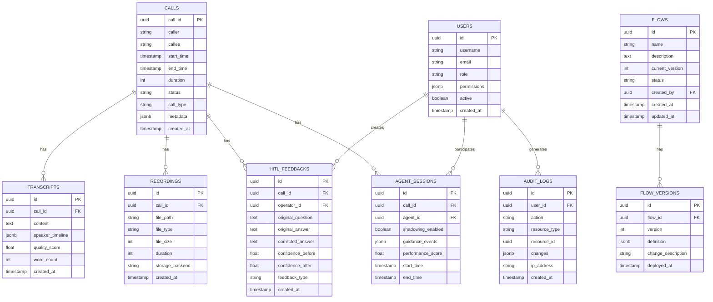

# SmartPBX AI - Technical Architecture Document
## Active RAG 기반 지능형 통화 응대 시스템 - 기술 아키텍처

**문서 버전**: v1.0  
**작성일**: 2026-01-30  
**작성자**: Architecture Team  
**상태**: Design Review

---

## 📋 목차

1. [Architecture Overview](#architecture-overview)
2. [System Architecture](#system-architecture)
3. [Component Design](#component-design)
4. [Data Architecture](#data-architecture)
5. [API Specifications](#api-specifications)
6. [Integration Architecture](#integration-architecture)
7. [Deployment Architecture](#deployment-architecture)
8. [Security Architecture](#security-architecture)
9. [Performance & Scalability](#performance--scalability)
10. [Monitoring & Observability](#monitoring--observability)

---

## Architecture Overview

### Design Principles

1. **Modularity**: 각 컴포넌트는 독립적으로 개발/배포 가능
2. **Scalability**: 수평 확장을 통한 트래픽 증가 대응
3. **Resilience**: 장애 발생 시에도 기본 기능 유지
4. **Performance**: 실시간 통화 품질 우선 (Latency < 2초)
5. **Security**: 통화 데이터 및 개인정보 보호
6. **Observability**: 모든 컴포넌트의 상태 및 성능 모니터링

### Technology Stack Summary

| Layer | Technology | Version | Purpose |
|-------|-----------|---------|---------|
| **Backend** | Python | 3.11+ | Main Language |
| **Framework** | FastAPI | 0.100+ | REST API & WebSocket |
| **Async Runtime** | asyncio | Built-in | Concurrent Processing |
| **SIP/RTP** | Custom | - | B2BUA Implementation |
| **STT** | Google Cloud Speech | v2 | Speech-to-Text |
| **TTS** | Google Cloud TTS | v1 | Text-to-Speech |
| **LLM** | Gemini 2.5 Flash | - | AI Agent Core |
| **Embedding** | OpenAI | text-embedding-3-large | Semantic Embedding |
| **Vector DB** | Qdrant | 1.7+ | Knowledge Storage |
| **Orchestration** | LangGraph | 0.1+ | Agent Workflow |
| **Message Queue** | Redis | 7.0+ | Event Bus, Caching |
| **Database** | PostgreSQL | 15+ | Metadata, Audit Log |
| **Object Storage** | MinIO (S3) | Latest | Recording Storage |
| **Frontend** | React | 18+ | Operator Dashboard |
| **Real-time** | WebSocket | - | Live Communication |
| **Container** | Docker | Latest | Containerization |
| **Orchestration** | Kubernetes | 1.28+ | Container Management |
| **Monitoring** | Prometheus + Grafana | Latest | Metrics & Visualization |
| **Logging** | ELK Stack | Latest | Centralized Logging |

---

## System Architecture

### High-Level Architecture


### Architecture Layers

#### 1. Client Layer
- **SIP Phones**: Softphones, Hardware phones (통화 발신/수신)
- **Web Browser**: Operator Dashboard (React SPA)

#### 2. Load Balancer Layer
- **NGINX**: HTTP/WebSocket Load Balancing
- **DNS Round-robin**: SIP UDP Load Balancing

#### 3. Application Layer

**SIP PBX Core (기존)**:
- SIP Endpoint: B2BUA 시그널링
- RTP Relay: 미디어 스트림 중계
- Call Manager: 통화 세션 관리

**AI Layer (신규)**:
- AI Agent Service: LLM 기반 대화 처리
- RAG Engine: 지식 검색 및 생성
- Dialog Manager: 대화 상태 관리

#### 4. Data Layer
- **Qdrant**: Vector embeddings, Knowledge base
- **PostgreSQL**: Call metadata, User data, Audit logs
- **Redis**: Session cache, Message queue
- **MinIO S3**: Call recordings, Transcripts

#### 5. External Services
- **Google Cloud**: STT, TTS, Gemini LLM
- **OpenAI**: Text embeddings

#### 6. Monitoring Layer
- **Prometheus**: Metrics collection
- **Grafana**: Visualization
- **ELK**: Centralized logging

---

## Component Design

### 1. SIP PBX Core (Existing - Enhanced)

#### 1.1 SIP Endpoint

**Purpose**: SIP B2BUA 시그널링 처리

**Components**:
```python
# src/sip_core/sip_endpoint.py

class SIPEndpoint:
    """SIP B2BUA 서버"""
    
    def __init__(self):
        self.transport: UDPTransport
        self.call_manager: CallManager
        self.media_manager: MediaManager
        self.ai_integration: AIIntegration  # NEW
    
    async def handle_invite(self, request: SIPRequest):
        """INVITE 처리"""
        # 1. B2BUA leg 생성
        # 2. Media 포트 할당
        # 3. AI 모드 판단 (부재중 시 AI 활성화)
        # 4. SDP 조작
        # 5. INVITE 전달
    
    async def handle_bye(self, request: SIPRequest):
        """BYE 처리 → STT 트리거"""
        call_id = request.call_id
        # 1. 통화 종료
        # 2. Recording 완료
        # 3. STT 파이프라인 트리거 (NEW)
        await self.ai_integration.trigger_stt(call_id)
```

**Interfaces**:
```python
# Input
- SIP Messages (INVITE, ACK, BYE, etc.)

# Output
- SIP Responses (100, 180, 200, etc.)
- Events → Event Bus (Redis)

# Dependencies
- Call Manager
- Media Manager
- AI Integration (NEW)
```

---

#### 1.2 RTP Relay

**Purpose**: RTP 패킷 중계 및 녹음

**Enhanced Architecture**:
```python
# src/media/rtp_relay.py

class RTPRelay:
    """RTP 패킷 relay + 녹음"""
    
    def __init__(self):
        self.port_pool: PortPool
        self.recorder: CallRecorder
        self.streaming_stt: StreamingSTT  # NEW
    
    async def relay_packet(self, packet: RTPPacket):
        """패킷 relay + 실시간 STT"""
        # 1. 반대편으로 relay
        await self.send_to_peer(packet)
        
        # 2. 녹음 버퍼에 추가
        self.recorder.add_audio(packet.payload)
        
        # 3. 실시간 STT (Phase 1+)
        if self.streaming_stt.enabled:
            text = await self.streaming_stt.process(packet.payload)
            await self.publish_transcript(text)
```

**Data Flow**:
```
[Caller RTP] → [Parse] → [Decode G.711] → [PCM Buffer]
                ↓                              ↓
         [Relay to Callee]              [Streaming STT]
                                               ↓
                                        [Real-time Text]
```

---

### 2. AI Layer (New)

#### 2.1 AI Agent Service

**Purpose**: LLM 기반 대화 처리 및 Agent 실행

**Architecture**:
```python
# src/ai/agent_service.py

from langchain_google_genai import ChatGoogleGenerativeAI
from langgraph.graph import StateGraph

class AIAgentService:
    """AI Agent 핵심 서비스"""
    
    def __init__(self):
        self.llm = ChatGoogleGenerativeAI(
            model="gemini-2.5-flash",
            temperature=0.5,
            max_output_tokens=150
        )
        self.rag_engine: RAGEngine
        self.dialog_manager: DialogManager
        self.tool_registry: ToolRegistry
        self.workflow: StateGraph
        
    async def process_query(self, query: str, session_id: str) -> str:
        """고객 질문 처리"""
        # 1. Dialog Context 로드
        context = await self.dialog_manager.get_context(session_id)
        
        # 2. Intent Classification
        intent = await self.classify_intent(query)
        
        # 3. RAG Retrieval
        knowledge = await self.rag_engine.search(query, top_k=5)
        
        # 4. LLM Response Generation
        response = await self.generate_response(
            query=query,
            intent=intent,
            knowledge=knowledge,
            context=context
        )
        
        # 5. Confidence Calculation
        confidence = self.calculate_confidence(knowledge, response)
        
        # 6. HITL Trigger (Low Confidence)
        if confidence < 0.6:
            await self.trigger_hitl_alert(session_id, query, response, confidence)
        
        return response
```

**Agent Workflow (LangGraph)**:
```python
from langgraph.graph import StateGraph, END
from typing import TypedDict

class AgentState(TypedDict):
    messages: list
    intent: str
    slots: dict
    rag_results: list
    confidence: float
    response: str

# Workflow 정의
workflow = StateGraph(AgentState)

# Nodes
workflow.add_node("classify_intent", classify_intent_node)
workflow.add_node("rag_search", rag_search_node)
workflow.add_node("check_confidence", check_confidence_node)
workflow.add_node("generate_response", generate_response_node)
workflow.add_node("hitl_alert", hitl_alert_node)

# Edges
workflow.set_entry_point("classify_intent")
workflow.add_edge("classify_intent", "rag_search")
workflow.add_edge("rag_search", "check_confidence")

workflow.add_conditional_edges(
    "check_confidence",
    lambda state: "low" if state["confidence"] < 0.6 else "high",
    {
        "low": "hitl_alert",
        "high": "generate_response"
    }
)

workflow.add_edge("hitl_alert", "generate_response")
workflow.add_edge("generate_response", END)

agent = workflow.compile()
```

---

#### 2.2 RAG Engine

**Purpose**: Vector 검색 및 Embedding 생성

**Architecture**:
```python
# src/ai/rag_engine.py

from qdrant_client import QdrantClient
from qdrant_client.models import PointStruct, Distance, VectorParams
from langchain.embeddings import OpenAIEmbeddings

class RAGEngine:
    """RAG 검색 엔진"""
    
    def __init__(self):
        self.vector_db = QdrantClient(host="qdrant", port=6333)
        self.embeddings = OpenAIEmbeddings(model="text-embedding-3-large")
        self.reranker = CrossEncoder("cross-encoder/ms-marco-MiniLM-L-12-v2")
        
    async def search(self, query: str, top_k: int = 5) -> list:
        """Semantic Search"""
        # 1. Query Embedding
        query_vector = await self.embeddings.aembed_query(query)
        
        # 2. Vector Search
        results = self.vector_db.search(
            collection_name="knowledge_base",
            query_vector=query_vector,
            limit=top_k * 2,  # Reranking을 위해 2배 검색
            score_threshold=0.7
        )
        
        # 3. Reranking (선택)
        if len(results) > top_k:
            reranked = self.rerank(query, results)
            results = reranked[:top_k]
        
        return results
    
    async def upsert(self, qa_pair: dict):
        """Knowledge 저장"""
        # 1. Embedding 생성
        text = f"{qa_pair['question']} {qa_pair['answer']}"
        vector = await self.embeddings.aembed_query(text)
        
        # 2. Qdrant에 저장
        point = PointStruct(
            id=qa_pair["id"],
            vector=vector,
            payload={
                "question": qa_pair["question"],
                "answer": qa_pair["answer"],
                "call_id": qa_pair["call_id"],
                "date": qa_pair["date"],
                "category": qa_pair["category"],
                "source": qa_pair["source"]  # "auto" or "operator_correction"
            }
        )
        
        self.vector_db.upsert(
            collection_name="knowledge_base",
            points=[point]
        )
```

**Vector DB Schema (Qdrant)**:
```yaml
Collection: knowledge_base
  Vector Config:
    size: 3072  # OpenAI text-embedding-3-large
    distance: Cosine
  
  Payload Schema:
    question: string (indexed)
    answer: string
    call_id: string (indexed)
    date: datetime (indexed)
    category: string (indexed)
    source: string (indexed)
    metadata: object
```

---

#### 2.3 Dialog Manager

**Purpose**: 대화 컨텍스트 관리 및 Slot Filling

**Architecture**:
```python
# src/ai/dialog_manager.py

from dataclasses import dataclass, field
from typing import Dict, List

@dataclass
class DialogContext:
    """대화 컨텍스트"""
    session_id: str
    call_id: str
    intent: str
    slots: Dict[str, any] = field(default_factory=dict)
    required_slots: List[str] = field(default_factory=list)
    turn_count: int = 0
    history: List[Dict] = field(default_factory=list)
    created_at: datetime = field(default_factory=datetime.now)
    updated_at: datetime = field(default_factory=datetime.now)
    
    def is_complete(self) -> bool:
        """모든 필수 slot이 채워졌는지"""
        return all(slot in self.slots for slot in self.required_slots)
    
    def next_slot(self) -> str | None:
        """다음에 물어볼 slot"""
        for slot in self.required_slots:
            if slot not in self.slots:
                return slot
        return None

class DialogManager:
    """대화 관리자"""
    
    def __init__(self):
        self.redis = Redis(host="redis", port=6379, decode_responses=True)
        self.ttl = 3600  # 1시간
    
    async def get_context(self, session_id: str) -> DialogContext:
        """컨텍스트 조회"""
        data = await self.redis.get(f"dialog:{session_id}")
        if data:
            return DialogContext(**json.loads(data))
        return None
    
    async def save_context(self, context: DialogContext):
        """컨텍스트 저장"""
        context.updated_at = datetime.now()
        await self.redis.setex(
            f"dialog:{context.session_id}",
            self.ttl,
            json.dumps(asdict(context), default=str)
        )
    
    async def extract_slots(self, user_input: str, context: DialogContext) -> Dict:
        """발화에서 slot 추출"""
        # LLM으로 slot 추출
        prompt = f"""
        다음 대화에서 정보를 추출하세요.
        
        Intent: {context.intent}
        Required Slots: {context.required_slots}
        User Input: {user_input}
        
        Output (JSON):
        {{"slot_name": "value", ...}}
        """
        
        response = await self.llm.ainvoke(prompt)
        slots = json.loads(response.content)
        return slots
```

**Dialog State Storage (Redis)**:
```json
Key: "dialog:{session_id}"
TTL: 3600 seconds

Value:
{
  "session_id": "abc123",
  "call_id": "xyz789",
  "intent": "delivery_tracking",
  "slots": {
    "order_number": "2024-0130-001"
  },
  "required_slots": ["order_number"],
  "turn_count": 2,
  "history": [
    {"turn": 1, "user": "배송 조회하고 싶어요", "ai": "주문번호 알려주세요"},
    {"turn": 2, "user": "2024-0130-001", "ai": "확인해드릴게요"}
  ],
  "created_at": "2026-01-30T10:00:00Z",
  "updated_at": "2026-01-30T10:00:15Z"
}
```

---

#### 2.4 Knowledge Extraction Pipeline

**Purpose**: Transcript → Q&A 추출 및 Vector DB 저장

**Architecture**:
```python
# src/ai/knowledge_extractor.py

from langchain.text_splitter import RecursiveCharacterTextSplitter
from langchain.prompts import PromptTemplate

class KnowledgeExtractor:
    """지식 추출 파이프라인"""
    
    def __init__(self):
        self.llm = ChatGoogleGenerativeAI(model="gemini-2.5-flash")
        self.splitter = RecursiveCharacterTextSplitter(
            chunk_size=512,
            chunk_overlap=50,
            separators=["\n[Caller]", "\n[Callee]"]
        )
        self.rag_engine: RAGEngine
    
    async def process_transcript(self, transcript: str, call_id: str):
        """Transcript 처리 파이프라인"""
        # 1. Semantic Chunking
        chunks = self.splitter.split_text(transcript)
        
        # 2. Q&A 추출 (LLM)
        qa_pairs = []
        for chunk in chunks:
            pairs = await self.extract_qa_pairs(chunk)
            qa_pairs.extend(pairs)
        
        # 3. 중복 제거
        deduplicated = await self.deduplicate(qa_pairs)
        
        # 4. 품질 필터링
        filtered = self.filter_quality(deduplicated)
        
        # 5. Vector DB 저장
        for qa in filtered:
            qa["call_id"] = call_id
            qa["id"] = f"{call_id}_{qa['index']}"
            await self.rag_engine.upsert(qa)
        
        return len(filtered)
    
    async def extract_qa_pairs(self, chunk: str) -> List[Dict]:
        """Chunk에서 Q&A 추출"""
        extraction_prompt = PromptTemplate(
            input_variables=["chunk"],
            template="""
            다음 통화 내용에서 고객의 질문과 상담원의 답변을 추출하세요.
            
            통화 내용:
            {chunk}
            
            Output (JSON Array):
            [
              {{
                "question": "고객 질문",
                "answer": "상담원 답변",
                "category": "문의 유형 (배송/환불/교환/상품문의/기타)",
                "resolved": true/false
              }},
              ...
            ]
            
            규칙:
            1. 의미있는 Q&A만 추출 (인사말 제외)
            2. 답변이 완전하지 않으면 resolved: false
            3. 고객 질문이 명확하지 않으면 제외
            """
        )
        
        response = await self.llm.ainvoke(
            extraction_prompt.format(chunk=chunk)
        )
        
        qa_pairs = json.loads(response.content)
        return qa_pairs
    
    async def deduplicate(self, qa_pairs: List[Dict]) -> List[Dict]:
        """중복 제거 (Embedding 유사도 기반)"""
        unique_pairs = []
        
        for qa in qa_pairs:
            # Embedding 생성
            text = f"{qa['question']} {qa['answer']}"
            vector = await self.rag_engine.embeddings.aembed_query(text)
            
            # 기존 항목과 유사도 비교
            is_duplicate = False
            for existing in unique_pairs:
                similarity = cosine_similarity(vector, existing["vector"])
                if similarity > 0.95:
                    is_duplicate = True
                    break
            
            if not is_duplicate:
                qa["vector"] = vector
                unique_pairs.append(qa)
        
        return unique_pairs
    
    def filter_quality(self, qa_pairs: List[Dict]) -> List[Dict]:
        """저품질 데이터 필터링"""
        filtered = []
        
        for qa in qa_pairs:
            score = self.calculate_quality_score(qa)
            if score >= 0.6:
                qa["quality_score"] = score
                filtered.append(qa)
        
        return filtered
    
    def calculate_quality_score(self, qa: Dict) -> float:
        """품질 점수 계산"""
        score = 1.0
        
        # 1. 질문 길이 체크
        if len(qa["question"]) < 10:
            score -= 0.3
        
        # 2. 답변 길이 체크
        if len(qa["answer"]) < 20:
            score -= 0.2
        
        # 3. 불완전한 답변
        if not qa.get("resolved", True):
            score -= 0.3
        
        # 4. 대명사 많이 사용 ("이거", "그거" 등)
        unclear_words = ["이거", "그거", "저거", "뭐", "어"]
        unclear_count = sum(1 for word in unclear_words if word in qa["question"])
        score -= unclear_count * 0.1
        
        return max(score, 0.0)
```

**Processing Flow**:
```
[Call Ends] → [Transcript Generated]
                    ↓
            [Semantic Chunking]
                    ↓
            [Q&A Extraction (LLM)]
                    ↓
            [Deduplication]
                    ↓
            [Quality Filtering]
                    ↓
            [Embedding Generation]
                    ↓
            [Vector DB Storage]
                    ↓
            [Searchable in 3 seconds]
```

---

### 3. API Gateway

#### 3.1 REST API (FastAPI)

**Purpose**: HTTP API 제공 (CRUD, Admin)

**Endpoints**:
```python
# src/api/main.py

from fastapi import FastAPI, WebSocket, Depends
from fastapi.middleware.cors import CORSMiddleware

app = FastAPI(title="SmartPBX AI API", version="2.0.0")

# CORS
app.add_middleware(
    CORSMiddleware,
    allow_origins=["*"],  # Production에서는 제한 필요
    allow_credentials=True,
    allow_methods=["*"],
    allow_headers=["*"],
)

# ==================== Call Management ====================

@app.get("/api/v1/calls")
async def list_calls(
    skip: int = 0,
    limit: int = 100,
    date_from: datetime = None,
    date_to: datetime = None
):
    """통화 목록 조회"""
    pass

@app.get("/api/v1/calls/{call_id}")
async def get_call(call_id: str):
    """통화 상세 조회"""
    pass

@app.get("/api/v1/calls/{call_id}/transcript")
async def get_transcript(call_id: str):
    """Transcript 조회"""
    pass

@app.get("/api/v1/calls/{call_id}/recording")
async def get_recording(call_id: str):
    """녹음 파일 다운로드"""
    pass

# ==================== Knowledge Management ====================

@app.get("/api/v1/knowledge")
async def search_knowledge(
    query: str,
    top_k: int = 5,
    category: str = None
):
    """Knowledge 검색"""
    pass

@app.post("/api/v1/knowledge")
async def create_knowledge(qa: QACreate):
    """Knowledge 수동 추가"""
    pass

@app.put("/api/v1/knowledge/{qa_id}")
async def update_knowledge(qa_id: str, qa: QAUpdate):
    """Knowledge 수정"""
    pass

@app.delete("/api/v1/knowledge/{qa_id}")
async def delete_knowledge(qa_id: str):
    """Knowledge 삭제"""
    pass

# ==================== AI Agent ====================

@app.post("/api/v1/agent/query")
async def agent_query(request: AgentQueryRequest):
    """AI Agent에게 질문"""
    result = await ai_agent_service.process_query(
        query=request.query,
        session_id=request.session_id
    )
    return result

@app.get("/api/v1/agent/confidence-stats")
async def get_confidence_stats(date_from: datetime, date_to: datetime):
    """Confidence Score 통계"""
    pass

# ==================== HITL ====================

@app.get("/api/v1/hitl/alerts")
async def list_hitl_alerts(status: str = "pending"):
    """Low Confidence 알림 목록"""
    pass

@app.post("/api/v1/hitl/feedback")
async def submit_feedback(feedback: HITLFeedback):
    """운영자 피드백 제출"""
    # 1. VectorDB 업데이트
    # 2. Audit Log 기록
    pass

# ==================== Flow Management ====================

@app.get("/api/v1/flows")
async def list_flows():
    """ARS Flow 목록"""
    pass

@app.get("/api/v1/flows/{flow_id}")
async def get_flow(flow_id: str):
    """Flow 상세 조회"""
    pass

@app.post("/api/v1/flows")
async def create_flow(flow: FlowCreate):
    """Flow 생성"""
    pass

@app.put("/api/v1/flows/{flow_id}")
async def update_flow(flow_id: str, flow: FlowUpdate):
    """Flow 업데이트 → 자동 배포"""
    pass

# ==================== Monitoring ====================

@app.get("/api/v1/metrics/performance")
async def get_performance_metrics():
    """성능 메트릭"""
    pass

@app.get("/api/v1/metrics/ai-accuracy")
async def get_ai_accuracy_metrics():
    """AI 정확도 메트릭"""
    pass

# ==================== Health Check ====================

@app.get("/health")
async def health_check():
    """헬스체크"""
    return {
        "status": "healthy",
        "version": "2.0.0",
        "timestamp": datetime.now()
    }

@app.get("/ready")
async def readiness_check():
    """Ready 체크 (K8s)"""
    # 1. DB 연결 확인
    # 2. Vector DB 연결 확인
    # 3. Redis 연결 확인
    pass
```

**API Models (Pydantic)**:
```python
# src/api/models.py

from pydantic import BaseModel, Field
from typing import List, Optional
from datetime import datetime

class QACreate(BaseModel):
    question: str = Field(..., min_length=10)
    answer: str = Field(..., min_length=20)
    category: str
    source: str = "manual"

class QAUpdate(BaseModel):
    question: Optional[str] = None
    answer: Optional[str] = None
    category: Optional[str] = None

class AgentQueryRequest(BaseModel):
    query: str
    session_id: str
    call_id: Optional[str] = None

class HITLFeedback(BaseModel):
    call_id: str
    session_id: str
    original_question: str
    original_answer: str
    corrected_answer: str
    operator_id: str
    confidence_before: float

class FlowCreate(BaseModel):
    name: str
    description: str
    nodes: List[dict]
    edges: List[dict]
    created_by: str

class FlowUpdate(BaseModel):
    name: Optional[str] = None
    description: Optional[str] = None
    nodes: Optional[List[dict]] = None
    edges: Optional[List[dict]] = None
```

---

#### 3.2 WebSocket API

**Purpose**: 실시간 통신 (Shadowing Mode, HITL)

**Endpoints**:
```python
# src/api/websocket.py

from fastapi import WebSocket, WebSocketDisconnect
from typing import Dict

class ConnectionManager:
    """WebSocket 연결 관리"""
    
    def __init__(self):
        self.active_connections: Dict[str, WebSocket] = {}
    
    async def connect(self, client_id: str, websocket: WebSocket):
        await websocket.accept()
        self.active_connections[client_id] = websocket
        logger.info("ws_connected", client_id=client_id)
    
    async def disconnect(self, client_id: str):
        self.active_connections.pop(client_id, None)
        logger.info("ws_disconnected", client_id=client_id)
    
    async def send_message(self, client_id: str, message: dict):
        if client_id in self.active_connections:
            await self.active_connections[client_id].send_json(message)
    
    async def broadcast(self, message: dict):
        """모든 연결에 브로드캐스트"""
        for ws in self.active_connections.values():
            await ws.send_json(message)

manager = ConnectionManager()

# ==================== Operator Dashboard ====================

@app.websocket("/ws/operator/{operator_id}")
async def websocket_operator(websocket: WebSocket, operator_id: str):
    """운영자 Dashboard WebSocket"""
    await manager.connect(f"operator:{operator_id}", websocket)
    
    try:
        while True:
            data = await websocket.receive_json()
            
            # Message Type 별 처리
            if data["type"] == "hitl_feedback":
                await handle_hitl_feedback(data)
            elif data["type"] == "ping":
                await websocket.send_json({"type": "pong"})
            
    except WebSocketDisconnect:
        await manager.disconnect(f"operator:{operator_id}")

# ==================== Agent Dashboard (Shadowing) ====================

@app.websocket("/ws/agent/{agent_id}")
async def websocket_agent(websocket: WebSocket, agent_id: str):
    """상담원 Shadowing Mode WebSocket"""
    await manager.connect(f"agent:{agent_id}", websocket)
    
    try:
        while True:
            data = await websocket.receive_json()
            
            if data["type"] == "call_started":
                # 상담원이 통화 시작
                call_id = data["call_id"]
                await register_shadowing_session(agent_id, call_id)
            
            elif data["type"] == "request_guidance":
                # 상담원이 가이드 요청
                query = data["query"]
                guidance = await generate_agent_guidance(query)
                await websocket.send_json({
                    "type": "guidance",
                    "content": guidance
                })
    
    except WebSocketDisconnect:
        await manager.disconnect(f"agent:{agent_id}")

# ==================== Call Monitoring ====================

@app.websocket("/ws/call/{call_id}")
async def websocket_call(websocket: WebSocket, call_id: str):
    """통화 모니터링 WebSocket (실시간 Transcript)"""
    await manager.connect(f"call:{call_id}", websocket)
    
    try:
        while True:
            # Redis Pub/Sub에서 실시간 Transcript 수신
            transcript = await redis_subscriber.get_message()
            if transcript and transcript["call_id"] == call_id:
                await websocket.send_json({
                    "type": "transcript",
                    "speaker": transcript["speaker"],
                    "text": transcript["text"],
                    "timestamp": transcript["timestamp"]
                })
    
    except WebSocketDisconnect:
        await manager.disconnect(f"call:{call_id}")
```

**WebSocket Message Protocol**:
```typescript
// Client → Server

// Type 1: HITL Feedback
{
  "type": "hitl_feedback",
  "call_id": "abc123",
  "original_answer": "...",
  "corrected_answer": "...",
  "operator_id": "op001"
}

// Type 2: Guidance Request (Shadowing)
{
  "type": "request_guidance",
  "query": "배송 조회",
  "agent_id": "agent001"
}

// ==========================================
// Server → Client

// Type 1: Low Confidence Alert
{
  "type": "hitl_alert",
  "call_id": "abc123",
  "session_id": "session456",
  "question": "신제품 있나요?",
  "ai_answer": "죄송합니다, 확인이 필요합니다",
  "confidence": 0.25,
  "timestamp": "2026-01-30T10:00:00Z"
}

// Type 2: Real-time Transcript
{
  "type": "transcript",
  "call_id": "abc123",
  "speaker": "Caller",
  "text": "배송은 언제 도착하나요?",
  "timestamp": "2026-01-30T10:00:05Z"
}

// Type 3: Agent Guidance (Shadowing)
{
  "type": "guidance",
  "suggested_answer": "주문번호 기준, 2일 이내 도착 예정입니다",
  "related_policies": ["배송 정책 1", "배송 정책 2"],
  "similar_cases": [...],
  "confidence": 0.92
}
```

---

## Data Architecture

### Database Schema (PostgreSQL)

#### ER Diagram



#### Table Definitions

```sql
-- ==================== calls ====================
CREATE TABLE calls (
    call_id UUID PRIMARY KEY DEFAULT gen_random_uuid(),
    caller VARCHAR(255) NOT NULL,
    callee VARCHAR(255) NOT NULL,
    start_time TIMESTAMP NOT NULL,
    end_time TIMESTAMP,
    duration INTEGER,  -- seconds
    status VARCHAR(50) NOT NULL,  -- 'active', 'completed', 'failed'
    call_type VARCHAR(50),  -- 'sip_call', 'ai_call'
    metadata JSONB,
    created_at TIMESTAMP DEFAULT CURRENT_TIMESTAMP,
    
    INDEX idx_calls_caller (caller),
    INDEX idx_calls_callee (callee),
    INDEX idx_calls_start_time (start_time),
    INDEX idx_calls_status (status)
);

-- ==================== transcripts ====================
CREATE TABLE transcripts (
    id UUID PRIMARY KEY DEFAULT gen_random_uuid(),
    call_id UUID NOT NULL REFERENCES calls(call_id) ON DELETE CASCADE,
    content TEXT NOT NULL,
    speaker_timeline JSONB,  -- [{"speaker": "Caller", "text": "...", "timestamp": "..."}]
    quality_score FLOAT CHECK (quality_score >= 0 AND quality_score <= 1),
    word_count INTEGER,
    created_at TIMESTAMP DEFAULT CURRENT_TIMESTAMP,
    
    INDEX idx_transcripts_call_id (call_id),
    FULLTEXT INDEX idx_transcripts_content (content)  -- PostgreSQL: tsvector
);

-- ==================== recordings ====================
CREATE TABLE recordings (
    id UUID PRIMARY KEY DEFAULT gen_random_uuid(),
    call_id UUID NOT NULL REFERENCES calls(call_id) ON DELETE CASCADE,
    file_path VARCHAR(1024) NOT NULL,
    file_type VARCHAR(50),  -- 'caller', 'callee', 'mixed'
    file_size BIGINT,  -- bytes
    duration INTEGER,  -- seconds
    storage_backend VARCHAR(50) DEFAULT 's3',  -- 's3', 'local'
    created_at TIMESTAMP DEFAULT CURRENT_TIMESTAMP,
    
    INDEX idx_recordings_call_id (call_id)
);

-- ==================== hitl_feedbacks ====================
CREATE TABLE hitl_feedbacks (
    id UUID PRIMARY KEY DEFAULT gen_random_uuid(),
    call_id UUID NOT NULL REFERENCES calls(call_id),
    operator_id UUID NOT NULL REFERENCES users(id),
    original_question TEXT NOT NULL,
    original_answer TEXT NOT NULL,
    corrected_answer TEXT NOT NULL,
    confidence_before FLOAT CHECK (confidence_before >= 0 AND confidence_before <= 1),
    confidence_after FLOAT CHECK (confidence_after >= 0 AND confidence_after <= 1),
    feedback_type VARCHAR(50),  -- 'real_time', 'post_call'
    created_at TIMESTAMP DEFAULT CURRENT_TIMESTAMP,
    
    INDEX idx_hitl_call_id (call_id),
    INDEX idx_hitl_operator_id (operator_id),
    INDEX idx_hitl_created_at (created_at)
);

-- ==================== agent_sessions ====================
CREATE TABLE agent_sessions (
    id UUID PRIMARY KEY DEFAULT gen_random_uuid(),
    call_id UUID NOT NULL REFERENCES calls(call_id),
    agent_id UUID NOT NULL REFERENCES users(id),
    shadowing_enabled BOOLEAN DEFAULT false,
    guidance_events JSONB,  -- [{"timestamp": "...", "query": "...", "guidance": "..."}]
    performance_score FLOAT,
    start_time TIMESTAMP NOT NULL,
    end_time TIMESTAMP,
    
    INDEX idx_agent_sessions_call_id (call_id),
    INDEX idx_agent_sessions_agent_id (agent_id)
);

-- ==================== users ====================
CREATE TABLE users (
    id UUID PRIMARY KEY DEFAULT gen_random_uuid(),
    username VARCHAR(255) UNIQUE NOT NULL,
    email VARCHAR(255) UNIQUE NOT NULL,
    password_hash VARCHAR(255) NOT NULL,
    role VARCHAR(50) NOT NULL,  -- 'admin', 'operator', 'agent'
    permissions JSONB DEFAULT '{}',
    active BOOLEAN DEFAULT true,
    created_at TIMESTAMP DEFAULT CURRENT_TIMESTAMP,
    updated_at TIMESTAMP DEFAULT CURRENT_TIMESTAMP,
    
    INDEX idx_users_email (email),
    INDEX idx_users_role (role)
);

-- ==================== flows ====================
CREATE TABLE flows (
    id UUID PRIMARY KEY DEFAULT gen_random_uuid(),
    name VARCHAR(255) UNIQUE NOT NULL,
    description TEXT,
    current_version INTEGER DEFAULT 1,
    status VARCHAR(50) DEFAULT 'draft',  -- 'draft', 'active', 'archived'
    created_by UUID NOT NULL REFERENCES users(id),
    created_at TIMESTAMP DEFAULT CURRENT_TIMESTAMP,
    updated_at TIMESTAMP DEFAULT CURRENT_TIMESTAMP,
    
    INDEX idx_flows_status (status),
    INDEX idx_flows_created_by (created_by)
);

-- ==================== flow_versions ====================
CREATE TABLE flow_versions (
    id UUID PRIMARY KEY DEFAULT gen_random_uuid(),
    flow_id UUID NOT NULL REFERENCES flows(id) ON DELETE CASCADE,
    version INTEGER NOT NULL,
    definition JSONB NOT NULL,  -- {"nodes": [...], "edges": [...]}
    change_description TEXT,
    deployed_at TIMESTAMP DEFAULT CURRENT_TIMESTAMP,
    
    UNIQUE(flow_id, version),
    INDEX idx_flow_versions_flow_id (flow_id)
);

-- ==================== audit_logs ====================
CREATE TABLE audit_logs (
    id UUID PRIMARY KEY DEFAULT gen_random_uuid(),
    user_id UUID REFERENCES users(id),
    action VARCHAR(255) NOT NULL,  -- 'create', 'update', 'delete', 'read'
    resource_type VARCHAR(100) NOT NULL,  -- 'call', 'knowledge', 'flow'
    resource_id UUID,
    changes JSONB,  -- {"before": {...}, "after": {...}}
    ip_address VARCHAR(45),
    created_at TIMESTAMP DEFAULT CURRENT_TIMESTAMP,
    
    INDEX idx_audit_logs_user_id (user_id),
    INDEX idx_audit_logs_resource (resource_type, resource_id),
    INDEX idx_audit_logs_created_at (created_at)
);
```

---

### Vector Database Schema (Qdrant)

```yaml
# Qdrant Collection Configuration

collection_name: knowledge_base

vectors:
  size: 3072  # OpenAI text-embedding-3-large
  distance: Cosine
  
indexes:
  - field: payload.call_id
    type: keyword
  - field: payload.date
    type: datetime
  - field: payload.category
    type: keyword
  - field: payload.source
    type: keyword

payload_schema:
  question:
    type: text
    indexed: true
  answer:
    type: text
  call_id:
    type: keyword
    indexed: true
  date:
    type: datetime
    indexed: true
  category:
    type: keyword
    indexed: true
    # Values: "배송", "환불", "교환", "상품문의", "기타"
  source:
    type: keyword
    indexed: true
    # Values: "auto", "operator_correction", "manual"
  quality_score:
    type: float
  metadata:
    type: object
    properties:
      resolved: boolean
      sentiment: keyword
      tags: array<keyword>

# Sharding Strategy (Future)
# - Monthly collections: knowledge_base_2026_01, knowledge_base_2026_02, ...
# - Auto-archiving: > 6 months old → archive collection
```

---

### Object Storage Structure (MinIO S3)

```
s3://smartpbx-recordings/
├── calls/
│   └── {YYYY}/{MM}/{DD}/
│       └── {call_id}/
│           ├── caller.wav         # 발신자 오디오
│           ├── callee.wav         # 수신자 오디오
│           ├── mixed.wav          # 믹싱된 오디오
│           ├── transcript.txt     # 전체 Transcript
│           └── metadata.json      # 메타데이터
│
├── backups/
│   └── vector_db/
│       └── {YYYY-MM-DD}/
│           └── knowledge_base.snapshot
│
└── exports/
    └── {export_id}/
        └── data.zip
```

**S3 Bucket Policy**:
```json
{
  "Version": "2012-10-17",
  "Statement": [
    {
      "Effect": "Allow",
      "Principal": {"Service": "sip-pbx-service"},
      "Action": [
        "s3:GetObject",
        "s3:PutObject",
        "s3:DeleteObject"
      ],
      "Resource": "arn:aws:s3:::smartpbx-recordings/calls/*"
    },
    {
      "Effect": "Allow",
      "Principal": {"Service": "backup-service"},
      "Action": [
        "s3:GetObject",
        "s3:PutObject"
      ],
      "Resource": "arn:aws:s3:::smartpbx-recordings/backups/*"
    }
  ]
}
```

---

## Integration Architecture

### External Service Integration

#### 1. Google Cloud Integration

**Services Used**:
- Speech-to-Text API v2
- Text-to-Speech API v1
- Gemini API (AI Studio)

**Authentication**:
```yaml
Method: Service Account Key (gcp-key.json)
Scopes:
  - https://www.googleapis.com/auth/cloud-platform
  - https://www.googleapis.com/auth/speech
  - https://www.googleapis.com/auth/generative-language

Rate Limits:
  STT: 1,000 requests/minute
  TTS: 300 requests/minute
  Gemini: 60 requests/minute (Free tier)

Cost Management:
  - STT: $0.024/minute (standard), $0.009/minute (telephony model)
  - TTS: $16/1M characters (Neural2)
  - Gemini 2.5 Flash: $0.075/1M input tokens, $0.30/1M output tokens
```

**Implementation**:
```python
# src/integrations/google_cloud.py

from google.cloud import speech_v2, texttospeech_v1
import google.generativeai as genai
from google.oauth2 import service_account

class GoogleCloudIntegration:
    """Google Cloud 통합 클라이언트"""
    
    def __init__(self, credentials_path: str):
        self.credentials = service_account.Credentials.from_service_account_file(
            credentials_path,
            scopes=["https://www.googleapis.com/auth/cloud-platform"]
        )
        
        # STT Client
        self.stt_client = speech_v2.SpeechAsyncClient(credentials=self.credentials)
        
        # TTS Client
        self.tts_client = texttospeech_v1.TextToSpeechAsyncClient(
            credentials=self.credentials
        )
        
        # Gemini Client
        genai.configure(api_key=os.getenv("GEMINI_API_KEY"))
        self.gemini = genai.GenerativeModel("gemini-2.5-flash")
    
    async def transcribe_audio(
        self,
        audio_content: bytes,
        sample_rate: int = 8000,
        language_code: str = "ko-KR",
        enable_diarization: bool = True
    ) -> dict:
        """음성 → 텍스트 변환"""
        config = speech_v2.RecognitionConfig(
            explicit_decoding_config=speech_v2.ExplicitDecodingConfig(
                encoding=speech_v2.ExplicitDecodingConfig.AudioEncoding.LINEAR16,
                sample_rate_hertz=sample_rate,
                audio_channel_count=1,
            ),
            language_codes=[language_code],
            model="telephony",  # 전화 통화 최적화
            features=speech_v2.RecognitionFeatures(
                enable_automatic_punctuation=True,
                enable_word_time_offsets=True,
                diarization_config=speech_v2.SpeakerDiarizationConfig(
                    min_speaker_count=2,
                    max_speaker_count=2,
                ) if enable_diarization else None
            ),
        )
        
        request = speech_v2.RecognizeRequest(
            recognizer=f"projects/{self.project_id}/locations/global/recognizers/_",
            config=config,
            content=audio_content,
        )
        
        response = await self.stt_client.recognize(request=request)
        
        # Parse results
        transcript = self._parse_stt_response(response)
        return transcript
    
    async def synthesize_speech(
        self,
        text: str,
        voice_name: str = "ko-KR-Neural2-A",
        speaking_rate: float = 1.0
    ) -> bytes:
        """텍스트 → 음성 변환"""
        input_text = texttospeech_v1.SynthesisInput(text=text)
        
        voice = texttospeech_v1.VoiceSelectionParams(
            language_code="ko-KR",
            name=voice_name,
        )
        
        audio_config = texttospeech_v1.AudioConfig(
            audio_encoding=texttospeech_v1.AudioEncoding.LINEAR16,
            speaking_rate=speaking_rate,
            sample_rate_hertz=16000,
        )
        
        request = texttospeech_v1.SynthesizeSpeechRequest(
            input=input_text,
            voice=voice,
            audio_config=audio_config,
        )
        
        response = await self.tts_client.synthesize_speech(request=request)
        return response.audio_content
```

---

#### 2. OpenAI Integration

**Service**: Text Embeddings API

```python
# src/integrations/openai_integration.py

from openai import AsyncOpenAI

class OpenAIIntegration:
    """OpenAI 통합 클라이언트"""
    
    def __init__(self, api_key: str):
        self.client = AsyncOpenAI(api_key=api_key)
        self.model = "text-embedding-3-large"
        self.dimensions = 3072
    
    async def create_embedding(self, text: str) -> list[float]:
        """텍스트 → Embedding 벡터"""
        response = await self.client.embeddings.create(
            model=self.model,
            input=text,
            dimensions=self.dimensions
        )
        return response.data[0].embedding
    
    async def create_embeddings_batch(self, texts: list[str]) -> list[list[float]]:
        """배치 Embedding (최대 2048개)"""
        response = await self.client.embeddings.create(
            model=self.model,
            input=texts,
            dimensions=self.dimensions
        )
        return [data.embedding for data in response.data]
```

**Rate Limits**:
- 3,000 requests/minute
- 1,000,000 tokens/minute

---

### Event-Driven Architecture (Redis Pub/Sub)

**Events**:
```python
# src/events/event_types.py

from enum import Enum
from pydantic import BaseModel

class EventType(str, Enum):
    # Call Events
    CALL_STARTED = "call.started"
    CALL_ENDED = "call.ended"
    CALL_RECORDING_SAVED = "call.recording_saved"
    
    # Transcript Events
    TRANSCRIPT_GENERATED = "transcript.generated"
    TRANSCRIPT_CHUNK = "transcript.chunk"  # Real-time
    
    # Knowledge Events
    KNOWLEDGE_EXTRACTED = "knowledge.extracted"
    KNOWLEDGE_CREATED = "knowledge.created"
    KNOWLEDGE_UPDATED = "knowledge.updated"
    
    # HITL Events
    HITL_ALERT_TRIGGERED = "hitl.alert_triggered"
    HITL_FEEDBACK_SUBMITTED = "hitl.feedback_submitted"
    
    # Agent Events
    AGENT_QUERY_PROCESSED = "agent.query_processed"
    AGENT_LOW_CONFIDENCE = "agent.low_confidence"

class Event(BaseModel):
    event_type: EventType
    event_id: str
    timestamp: datetime
    payload: dict
```

**Event Bus**:
```python
# src/events/event_bus.py

import redis.asyncio as redis
import json

class EventBus:
    """Redis Pub/Sub 기반 Event Bus"""
    
    def __init__(self, redis_url: str):
        self.redis = redis.from_url(redis_url, decode_responses=True)
        self.pubsub = self.redis.pubsub()
    
    async def publish(self, event: Event):
        """이벤트 발행"""
        channel = f"events:{event.event_type.value}"
        message = event.model_dump_json()
        await self.redis.publish(channel, message)
    
    async def subscribe(self, event_types: list[EventType], handler):
        """이벤트 구독"""
        channels = [f"events:{et.value}" for et in event_types]
        await self.pubsub.subscribe(*channels)
        
        async for message in self.pubsub.listen():
            if message["type"] == "message":
                event_data = json.loads(message["data"])
                event = Event(**event_data)
                await handler(event)
```

**Usage Example**:
```python
# Event Publisher (SIP Endpoint)
async def on_call_ended(call_id: str):
    event = Event(
        event_type=EventType.CALL_ENDED,
        event_id=str(uuid.uuid4()),
        timestamp=datetime.now(),
        payload={"call_id": call_id}
    )
    await event_bus.publish(event)

# Event Subscriber (Knowledge Extractor)
async def handle_call_ended(event: Event):
    call_id = event.payload["call_id"]
    # Trigger STT → Knowledge Extraction
    await knowledge_extractor.process_call(call_id)

await event_bus.subscribe(
    [EventType.CALL_ENDED],
    handle_call_ended
)
```

---

## Deployment Architecture

### Kubernetes Deployment

#### Namespace Structure

```yaml
apiVersion: v1
kind: Namespace
metadata:
  name: smartpbx
  labels:
    name: smartpbx
```

---

#### 1. SIP PBX Deployment (StatefulSet)

```yaml
apiVersion: apps/v1
kind: StatefulSet
metadata:
  name: sip-pbx
  namespace: smartpbx
spec:
  serviceName: sip-pbx
  replicas: 3
  selector:
    matchLabels:
      app: sip-pbx
  template:
    metadata:
      labels:
        app: sip-pbx
    spec:
      containers:
      - name: sip-pbx
        image: smartpbx/sip-pbx:2.0.0
        ports:
        - name: sip-udp
          containerPort: 5060
          protocol: UDP
        - name: rtp-start
          containerPort: 10000
          protocol: UDP
        - name: rtp-end
          containerPort: 20000
          protocol: UDP
        - name: http
          containerPort: 8080
          protocol: TCP
        env:
        - name: CONFIG_PATH
          value: /config/config.yaml
        - name: REDIS_URL
          value: redis://redis:6379
        - name: POSTGRES_URL
          valueFrom:
            secretKeyRef:
              name: db-secrets
              key: postgres_url
        - name: GCP_CREDENTIALS_PATH
          value: /secrets/gcp-key.json
        volumeMounts:
        - name: config
          mountPath: /config
        - name: gcp-credentials
          mountPath: /secrets
        - name: recordings
          mountPath: /recordings
        resources:
          requests:
            memory: "2Gi"
            cpu: "1000m"
          limits:
            memory: "4Gi"
            cpu: "2000m"
        livenessProbe:
          httpGet:
            path: /health
            port: 8080
          initialDelaySeconds: 30
          periodSeconds: 10
        readinessProbe:
          httpGet:
            path: /ready
            port: 8080
          initialDelaySeconds: 10
          periodSeconds: 5
      volumes:
      - name: config
        configMap:
          name: sip-pbx-config
      - name: gcp-credentials
        secret:
          secretName: gcp-credentials
  volumeClaimTemplates:
  - metadata:
      name: recordings
    spec:
      accessModes: ["ReadWriteOnce"]
      storageClassName: fast-ssd
      resources:
        requests:
          storage: 100Gi
```

---

#### 2. AI Agent Service Deployment

```yaml
apiVersion: apps/v1
kind: Deployment
metadata:
  name: ai-agent
  namespace: smartpbx
spec:
  replicas: 5
  selector:
    matchLabels:
      app: ai-agent
  template:
    metadata:
      labels:
        app: ai-agent
    spec:
      containers:
      - name: ai-agent
        image: smartpbx/ai-agent:2.0.0
        ports:
        - name: http
          containerPort: 8000
        env:
        - name: QDRANT_URL
          value: http://qdrant:6333
        - name: REDIS_URL
          value: redis://redis:6379
        - name: GEMINI_API_KEY
          valueFrom:
            secretKeyRef:
              name: api-keys
              key: gemini_api_key
        - name: OPENAI_API_KEY
          valueFrom:
            secretKeyRef:
              name: api-keys
              key: openai_api_key
        resources:
          requests:
            memory: "1Gi"
            cpu: "500m"
          limits:
            memory: "2Gi"
            cpu: "1000m"
        livenessProbe:
          httpGet:
            path: /health
            port: 8000
          initialDelaySeconds: 20
          periodSeconds: 10
        readinessProbe:
          httpGet:
            path: /ready
            port: 8000
          initialDelaySeconds: 10
          periodSeconds: 5
---
apiVersion: autoscaling/v2
kind: HorizontalPodAutoscaler
metadata:
  name: ai-agent-hpa
  namespace: smartpbx
spec:
  scaleTargetRef:
    apiVersion: apps/v1
    kind: Deployment
    name: ai-agent
  minReplicas: 3
  maxReplicas: 20
  metrics:
  - type: Resource
    resource:
      name: cpu
      target:
        type: Utilization
        averageUtilization: 70
  - type: Resource
    resource:
      name: memory
      target:
        type: Utilization
        averageUtilization: 80
```

---

#### 3. Qdrant Vector DB

```yaml
apiVersion: apps/v1
kind: StatefulSet
metadata:
  name: qdrant
  namespace: smartpbx
spec:
  serviceName: qdrant
  replicas: 3  # HA mode
  selector:
    matchLabels:
      app: qdrant
  template:
    metadata:
      labels:
        app: qdrant
    spec:
      containers:
      - name: qdrant
        image: qdrant/qdrant:v1.7.0
        ports:
        - name: http
          containerPort: 6333
        - name: grpc
          containerPort: 6334
        volumeMounts:
        - name: storage
          mountPath: /qdrant/storage
        resources:
          requests:
            memory: "4Gi"
            cpu: "2000m"
          limits:
            memory: "8Gi"
            cpu: "4000m"
  volumeClaimTemplates:
  - metadata:
      name: storage
    spec:
      accessModes: ["ReadWriteOnce"]
      storageClassName: fast-ssd
      resources:
        requests:
          storage: 500Gi
```

---

#### 4. PostgreSQL (Metadata DB)

```yaml
apiVersion: apps/v1
kind: StatefulSet
metadata:
  name: postgres
  namespace: smartpbx
spec:
  serviceName: postgres
  replicas: 1  # Primary only (Replication 추후 추가)
  selector:
    matchLabels:
      app: postgres
  template:
    metadata:
      labels:
        app: postgres
    spec:
      containers:
      - name: postgres
        image: postgres:15-alpine
        ports:
        - name: postgres
          containerPort: 5432
        env:
        - name: POSTGRES_DB
          value: smartpbx
        - name: POSTGRES_USER
          valueFrom:
            secretKeyRef:
              name: db-secrets
              key: postgres_user
        - name: POSTGRES_PASSWORD
          valueFrom:
            secretKeyRef:
              name: db-secrets
              key: postgres_password
        volumeMounts:
        - name: data
          mountPath: /var/lib/postgresql/data
        resources:
          requests:
            memory: "2Gi"
            cpu: "1000m"
          limits:
            memory: "4Gi"
            cpu: "2000m"
  volumeClaimTemplates:
  - metadata:
      name: data
    spec:
      accessModes: ["ReadWriteOnce"]
      storageClassName: standard
      resources:
        requests:
          storage: 100Gi
```

---

#### 5. Redis (Cache & Message Queue)

```yaml
apiVersion: apps/v1
kind: Deployment
metadata:
  name: redis
  namespace: smartpbx
spec:
  replicas: 1
  selector:
    matchLabels:
      app: redis
  template:
    metadata:
      labels:
        app: redis
    spec:
      containers:
      - name: redis
        image: redis:7.0-alpine
        ports:
        - name: redis
          containerPort: 6379
        args:
        - redis-server
        - --maxmemory 4gb
        - --maxmemory-policy allkeys-lru
        resources:
          requests:
            memory: "2Gi"
            cpu: "500m"
          limits:
            memory: "4Gi"
            cpu: "1000m"
```

---

#### 6. Frontend (React Dashboard)

```yaml
apiVersion: apps/v1
kind: Deployment
metadata:
  name: frontend
  namespace: smartpbx
spec:
  replicas: 3
  selector:
    matchLabels:
      app: frontend
  template:
    metadata:
      labels:
        app: frontend
    spec:
      containers:
      - name: frontend
        image: smartpbx/frontend:2.0.0
        ports:
        - name: http
          containerPort: 80
        env:
        - name: API_URL
          value: http://api-gateway:8080
        - name: WS_URL
          value: ws://api-gateway:8080/ws
        resources:
          requests:
            memory: "256Mi"
            cpu: "100m"
          limits:
            memory: "512Mi"
            cpu: "200m"
```

---

### Service Configuration

```yaml
# ==================== SIP PBX Service ====================
apiVersion: v1
kind: Service
metadata:
  name: sip-pbx
  namespace: smartpbx
spec:
  type: LoadBalancer  # External SIP traffic
  ports:
  - name: sip-udp
    port: 5060
    protocol: UDP
    targetPort: 5060
  - name: rtp-range
    port: 10000
    protocol: UDP
    targetPort: 10000
  selector:
    app: sip-pbx

---
# ==================== AI Agent Service ====================
apiVersion: v1
kind: Service
metadata:
  name: ai-agent
  namespace: smartpbx
spec:
  type: ClusterIP
  ports:
  - name: http
    port: 8000
    targetPort: 8000
  selector:
    app: ai-agent

---
# ==================== API Gateway Service ====================
apiVersion: v1
kind: Service
metadata:
  name: api-gateway
  namespace: smartpbx
spec:
  type: LoadBalancer
  ports:
  - name: http
    port: 80
    targetPort: 8080
  - name: https
    port: 443
    targetPort: 8443
  selector:
    app: api-gateway
```

---

### Ingress Configuration

```yaml
apiVersion: networking.k8s.io/v1
kind: Ingress
metadata:
  name: smartpbx-ingress
  namespace: smartpbx
  annotations:
    kubernetes.io/ingress.class: nginx
    cert-manager.io/cluster-issuer: letsencrypt-prod
    nginx.ingress.kubernetes.io/websocket-services: api-gateway
spec:
  tls:
  - hosts:
    - api.smartpbx.ai
    - dashboard.smartpbx.ai
    secretName: smartpbx-tls
  rules:
  - host: api.smartpbx.ai
    http:
      paths:
      - path: /
        pathType: Prefix
        backend:
          service:
            name: api-gateway
            port:
              number: 8080
  - host: dashboard.smartpbx.ai
    http:
      paths:
      - path: /
        pathType: Prefix
        backend:
          service:
            name: frontend
            port:
              number: 80
```

---

## Security Architecture

### 1. Authentication & Authorization

**JWT-based Authentication**:
```python
# src/security/auth.py

from jose import JWTError, jwt
from datetime import datetime, timedelta
from fastapi import Depends, HTTPException
from fastapi.security import HTTPBearer

SECRET_KEY = os.getenv("JWT_SECRET_KEY")
ALGORITHM = "HS256"
ACCESS_TOKEN_EXPIRE_MINUTES = 60

security = HTTPBearer()

def create_access_token(data: dict, expires_delta: timedelta = None):
    to_encode = data.copy()
    expire = datetime.utcnow() + (expires_delta or timedelta(minutes=15))
    to_encode.update({"exp": expire})
    encoded_jwt = jwt.encode(to_encode, SECRET_KEY, algorithm=ALGORITHM)
    return encoded_jwt

async def get_current_user(token: str = Depends(security)):
    credentials_exception = HTTPException(
        status_code=401,
        detail="Could not validate credentials",
        headers={"WWW-Authenticate": "Bearer"},
    )
    try:
        payload = jwt.decode(token.credentials, SECRET_KEY, algorithms=[ALGORITHM])
        user_id: str = payload.get("sub")
        if user_id is None:
            raise credentials_exception
    except JWTError:
        raise credentials_exception
    
    user = await get_user_by_id(user_id)
    if user is None:
        raise credentials_exception
    return user
```

**RBAC (Role-Based Access Control)**:
```python
# src/security/rbac.py

from enum import Enum
from functools import wraps

class Role(str, Enum):
    ADMIN = "admin"
    OPERATOR = "operator"
    AGENT = "agent"
    VIEWER = "viewer"

class Permission(str, Enum):
    # Call Management
    CALL_VIEW = "call:view"
    CALL_DELETE = "call:delete"
    
    # Knowledge Management
    KNOWLEDGE_VIEW = "knowledge:view"
    KNOWLEDGE_CREATE = "knowledge:create"
    KNOWLEDGE_UPDATE = "knowledge:update"
    KNOWLEDGE_DELETE = "knowledge:delete"
    
    # HITL
    HITL_VIEW = "hitl:view"
    HITL_FEEDBACK = "hitl:feedback"
    
    # Flow Management
    FLOW_VIEW = "flow:view"
    FLOW_CREATE = "flow:create"
    FLOW_UPDATE = "flow:update"
    FLOW_DEPLOY = "flow:deploy"
    
    # System
    SYSTEM_METRICS = "system:metrics"
    SYSTEM_CONFIG = "system:config"

ROLE_PERMISSIONS = {
    Role.ADMIN: [perm for perm in Permission],  # All permissions
    Role.OPERATOR: [
        Permission.CALL_VIEW,
        Permission.KNOWLEDGE_VIEW,
        Permission.KNOWLEDGE_UPDATE,
        Permission.HITL_VIEW,
        Permission.HITL_FEEDBACK,
        Permission.FLOW_VIEW,
    ],
    Role.AGENT: [
        Permission.CALL_VIEW,
        Permission.KNOWLEDGE_VIEW,
        Permission.HITL_VIEW,
    ],
    Role.VIEWER: [
        Permission.CALL_VIEW,
        Permission.KNOWLEDGE_VIEW,
        Permission.SYSTEM_METRICS,
    ],
}

def require_permission(permission: Permission):
    def decorator(func):
        @wraps(func)
        async def wrapper(*args, current_user=None, **kwargs):
            if not current_user:
                raise HTTPException(status_code=401, detail="Not authenticated")
            
            user_permissions = ROLE_PERMISSIONS.get(current_user.role, [])
            if permission not in user_permissions:
                raise HTTPException(status_code=403, detail="Permission denied")
            
            return await func(*args, current_user=current_user, **kwargs)
        return wrapper
    return decorator

# Usage
@app.delete("/api/v1/knowledge/{qa_id}")
@require_permission(Permission.KNOWLEDGE_DELETE)
async def delete_knowledge(qa_id: str, current_user: User = Depends(get_current_user)):
    pass
```

---

### 2. Data Encryption

**At Rest**:
- Database: PostgreSQL with TDE (Transparent Data Encryption)
- Object Storage: S3 Server-Side Encryption (SSE-S3)
- Secrets: Kubernetes Secrets (encrypted with KMS)

**In Transit**:
- External: TLS 1.3
- Internal: mTLS (Istio Service Mesh)

```yaml
# SSL/TLS Certificate (cert-manager)
apiVersion: cert-manager.io/v1
kind: Certificate
metadata:
  name: smartpbx-tls
  namespace: smartpbx
spec:
  secretName: smartpbx-tls
  issuerRef:
    name: letsencrypt-prod
    kind: ClusterIssuer
  dnsNames:
  - api.smartpbx.ai
  - dashboard.smartpbx.ai
```

---

### 3. PII Masking

**Automatic PII Detection & Masking**:
```python
# src/security/pii_masking.py

import re
from typing import Dict

class PIIMasker:
    """개인정보 자동 마스킹"""
    
    PATTERNS = {
        "phone": r'\d{2,3}-\d{3,4}-\d{4}',
        "email": r'[a-zA-Z0-9._%+-]+@[a-zA-Z0-9.-]+\.[a-zA-Z]{2,}',
        "card": r'\d{4}-\d{4}-\d{4}-\d{4}',
        "ssn": r'\d{6}-\d{7}',  # 주민등록번호
    }
    
    def mask(self, text: str) -> tuple[str, Dict]:
        """텍스트에서 PII 자동 마스킹"""
        masked_text = text
        pii_found = {}
        
        # Phone number
        masked_text, phone_count = re.subn(
            self.PATTERNS["phone"],
            lambda m: m.group(0)[:3] + "-****-" + m.group(0)[-4:],
            masked_text
        )
        if phone_count > 0:
            pii_found["phone"] = phone_count
        
        # Email
        masked_text, email_count = re.subn(
            self.PATTERNS["email"],
            lambda m: m.group(0)[:2] + "***@" + m.group(0).split('@')[1],
            masked_text
        )
        if email_count > 0:
            pii_found["email"] = email_count
        
        # Card number
        masked_text, card_count = re.subn(
            self.PATTERNS["card"],
            "****-****-****-****",
            masked_text
        )
        if card_count > 0:
            pii_found["card"] = card_count
        
        return masked_text, pii_found
    
    def unmask(self, text: str, original_data: Dict) -> str:
        """마스킹 해제 (권한 필요)"""
        # Only for authorized users
        pass
```

---

## Performance & Scalability

### Performance Targets

| Metric | Target | Measurement |
|--------|--------|-------------|
| **End-to-End Latency** | <2초 | 고객 질문 → AI 답변 (TTS 포함) |
| **STT Latency** | <500ms | Audio → Text (Streaming) |
| **RAG Retrieval** | <100ms | Query → Top-K results |
| **LLM Response** | <1초 | Context → Generated response |
| **API Response Time** | <200ms | P95 (GET requests) |
| **WebSocket Latency** | <50ms | HITL alert delivery |
| **Throughput** | 100 concurrent calls | Per instance |
| **Uptime** | 99.9% | Monthly SLA |

---

### Caching Strategy

```python
# src/caching/cache_manager.py

from redis.asyncio import Redis
import hashlib
import json

class CacheManager:
    """Redis 기반 캐싱"""
    
    def __init__(self, redis_url: str):
        self.redis = Redis.from_url(redis_url)
    
    async def get_rag_result(self, query: str) -> list | None:
        """RAG 검색 결과 캐싱"""
        cache_key = self._generate_key("rag", query)
        cached = await self.redis.get(cache_key)
        if cached:
            return json.loads(cached)
        return None
    
    async def set_rag_result(self, query: str, results: list, ttl: int = 3600):
        """RAG 결과 저장 (1시간 TTL)"""
        cache_key = self._generate_key("rag", query)
        await self.redis.setex(
            cache_key,
            ttl,
            json.dumps(results, default=str)
        )
    
    async def get_llm_response(self, prompt_hash: str) -> str | None:
        """LLM 응답 캐싱"""
        cache_key = f"llm:{prompt_hash}"
        return await self.redis.get(cache_key)
    
    async def set_llm_response(self, prompt_hash: str, response: str, ttl: int = 7200):
        """LLM 응답 저장 (2시간 TTL)"""
        cache_key = f"llm:{prompt_hash}"
        await self.redis.setex(cache_key, ttl, response)
    
    def _generate_key(self, prefix: str, data: str) -> str:
        """캐시 키 생성"""
        hash_value = hashlib.md5(data.encode()).hexdigest()
        return f"{prefix}:{hash_value}"
```

**Cache Invalidation**:
- RAG 결과: 새로운 Knowledge 추가 시 관련 캐시 무효화
- LLM 응답: Flow 변경 시 전체 캐시 Flush

---

### Load Balancing

**Strategy**: Round-robin with Health Checks

```nginx
# NGINX Configuration

upstream sip_pbx_backend {
    least_conn;  # Least connections algorithm
    
    server sip-pbx-0.sip-pbx:5060 max_fails=3 fail_timeout=30s;
    server sip-pbx-1.sip-pbx:5060 max_fails=3 fail_timeout=30s;
    server sip-pbx-2.sip-pbx:5060 max_fails=3 fail_timeout=30s;
}

upstream ai_agent_backend {
    server ai-agent-0.ai-agent:8000;
    server ai-agent-1.ai-agent:8000;
    server ai-agent-2.ai-agent:8000;
    
    # Health check
    check interval=5000 rise=2 fall=3 timeout=3000;
}

server {
    listen 80;
    server_name api.smartpbx.ai;
    
    location /api/ {
        proxy_pass http://ai_agent_backend;
        proxy_http_version 1.1;
        proxy_set_header Upgrade $http_upgrade;
        proxy_set_header Connection "upgrade";
        proxy_set_header Host $host;
        proxy_set_header X-Real-IP $remote_addr;
    }
}
```

---

## Monitoring & Observability

### Prometheus Metrics

```python
# src/monitoring/metrics.py

from prometheus_client import Counter, Histogram, Gauge, generate_latest

# ==================== Call Metrics ====================
calls_total = Counter(
    'smartpbx_calls_total',
    'Total number of calls',
    ['status', 'call_type']
)

call_duration_seconds = Histogram(
    'smartpbx_call_duration_seconds',
    'Call duration in seconds',
    buckets=[10, 30, 60, 120, 300, 600, 1800, 3600]
)

active_calls = Gauge(
    'smartpbx_active_calls',
    'Number of currently active calls'
)

# ==================== AI Metrics ====================
ai_queries_total = Counter(
    'smartpbx_ai_queries_total',
    'Total AI queries',
    ['intent']
)

ai_confidence_score = Histogram(
    'smartpbx_ai_confidence_score',
    'AI confidence score distribution',
    buckets=[0.0, 0.2, 0.4, 0.6, 0.8, 0.9, 0.95, 1.0]
)

rag_retrieval_latency_seconds = Histogram(
    'smartpbx_rag_retrieval_latency_seconds',
    'RAG retrieval latency',
    buckets=[0.01, 0.05, 0.1, 0.2, 0.5, 1.0]
)

llm_response_latency_seconds = Histogram(
    'smartpbx_llm_response_latency_seconds',
    'LLM response generation latency',
    buckets=[0.1, 0.5, 1.0, 2.0, 5.0, 10.0]
)

# ==================== HITL Metrics ====================
hitl_alerts_total = Counter(
    'smartpbx_hitl_alerts_total',
    'Total HITL alerts triggered'
)

hitl_intervention_rate = Gauge(
    'smartpbx_hitl_intervention_rate',
    'Operator intervention rate (percentage)'
)

hitl_response_time_seconds = Histogram(
    'smartpbx_hitl_response_time_seconds',
    'Time for operator to respond to alert',
    buckets=[1, 5, 10, 30, 60, 120, 300]
)

# ==================== Knowledge Metrics ====================
knowledge_base_size = Gauge(
    'smartpbx_knowledge_base_size',
    'Total number of Q&A pairs in knowledge base'
)

knowledge_extraction_rate = Gauge(
    'smartpbx_knowledge_extraction_rate',
    'Average Q&A pairs extracted per call'
)

# ==================== System Metrics ====================
api_request_duration_seconds = Histogram(
    'smartpbx_api_request_duration_seconds',
    'API request duration',
    ['method', 'endpoint', 'status']
)

websocket_connections = Gauge(
    'smartpbx_websocket_connections',
    'Number of active WebSocket connections',
    ['connection_type']
)
```

---

### Grafana Dashboards

**Dashboard 1: Real-time Call Monitoring**
```yaml
Panels:
  - Active Calls (Gauge)
  - Calls per Minute (Graph)
  - Call Duration Distribution (Heatmap)
  - Call Success Rate (Stat)
  - Geographic Distribution (World Map)

Refresh: 5s
```

**Dashboard 2: AI Performance**
```yaml
Panels:
  - AI Queries per Second (Graph)
  - Confidence Score Distribution (Histogram)
  - RAG Retrieval Latency (Graph)
  - LLM Response Latency (Graph)
  - Cache Hit Rate (Stat)
  - Top Intents (Bar Chart)

Refresh: 10s
```

**Dashboard 3: HITL Statistics**
```yaml
Panels:
  - Intervention Rate Trend (Graph)
  - Low Confidence Calls (Table)
  - Operator Response Time (Graph)
  - Knowledge Growth Rate (Graph)
  - Before/After Accuracy (Comparison)

Refresh: 30s
```

---

### Logging (ELK Stack)

**Structured Logging Format**:
```python
# src/logging/logger_config.py

import structlog

structlog.configure(
    processors=[
        structlog.contextvars.merge_contextvars,
        structlog.processors.add_log_level,
        structlog.processors.TimeStamper(fmt="iso"),
        structlog.processors.StackInfoRenderer(),
        structlog.processors.format_exc_info,
        structlog.processors.JSONRenderer()
    ],
    logger_factory=structlog.PrintLoggerFactory(),
)

logger = structlog.get_logger()

# Usage
logger.info(
    "ai_query_processed",
    call_id="abc123",
    query="배송 조회",
    intent="delivery_tracking",
    confidence=0.92,
    latency_ms=1250
)
```

**Log Format Example**:
```json
{
  "event": "ai_query_processed",
  "level": "info",
  "timestamp": "2026-01-30T10:00:00.000Z",
  "call_id": "abc123",
  "query": "배송 조회",
  "intent": "delivery_tracking",
  "confidence": 0.92,
  "latency_ms": 1250,
  "service": "ai-agent",
  "pod_name": "ai-agent-5f7b8c9d-xk2lp"
}
```

---

### Distributed Tracing (Jaeger)

```python
# src/tracing/tracer.py

from opentelemetry import trace
from opentelemetry.exporter.jaeger.thrift import JaegerExporter
from opentelemetry.sdk.trace import TracerProvider
from opentelemetry.sdk.trace.export import BatchSpanProcessor

# Initialize Tracer
tracer_provider = TracerProvider()
jaeger_exporter = JaegerExporter(
    agent_host_name="jaeger",
    agent_port=6831,
)
tracer_provider.add_span_processor(BatchSpanProcessor(jaeger_exporter))
trace.set_tracer_provider(tracer_provider)

tracer = trace.get_tracer(__name__)

# Usage
async def process_query(query: str):
    with tracer.start_as_current_span("ai_query") as span:
        span.set_attribute("query", query)
        
        # RAG Retrieval
        with tracer.start_as_current_span("rag_retrieval"):
            results = await rag_engine.search(query)
        
        # LLM Response
        with tracer.start_as_current_span("llm_response"):
            response = await llm.generate(query, results)
        
        return response
```

---

## 다음 단계

이제 다음 문서를 작성할 수 있습니다:

1. **API Documentation (OpenAPI 3.0 Spec)**
2. **Database Migration Scripts**
3. **CI/CD Pipeline Configuration**
4. **Deployment Runbook**
5. **Disaster Recovery Plan**

어떤 것부터 진행할까요? 🚀
