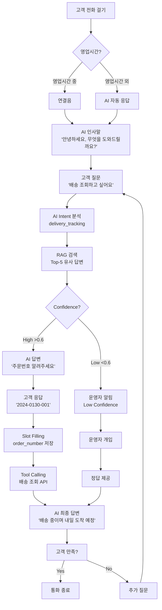
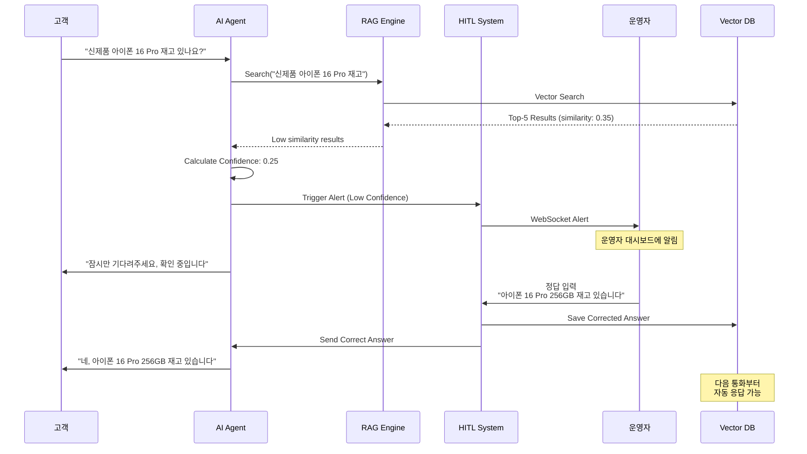
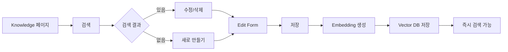
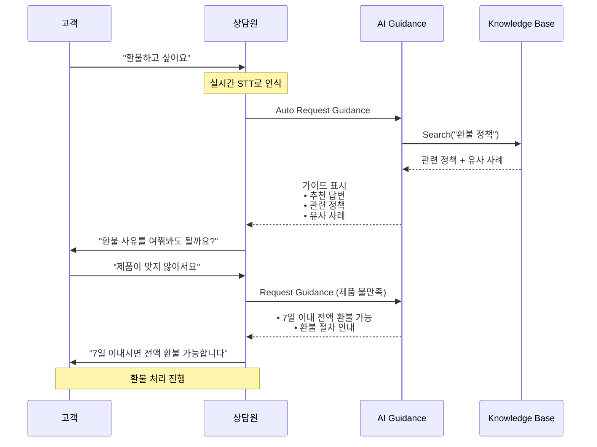
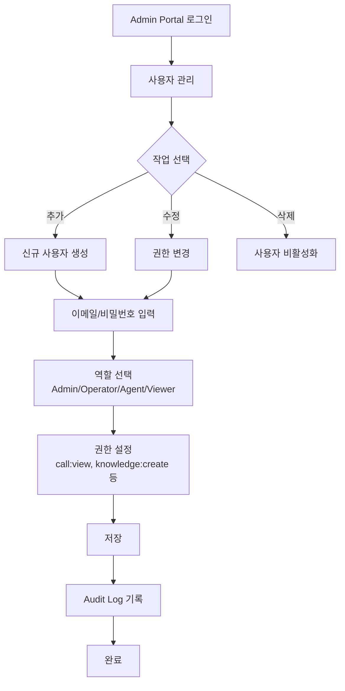
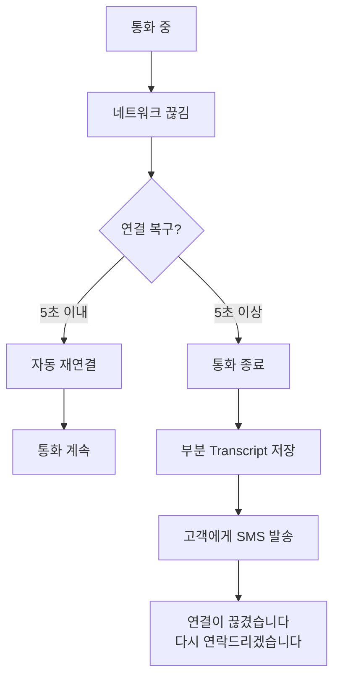
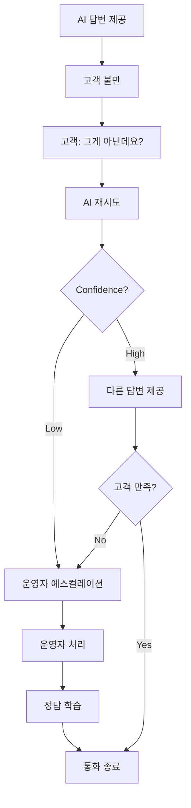

# SmartPBX AI - User Flow Documentation
## 사용자 여정 및 시나리오 기반 플로우

**문서 버전**: v1.0  
**작성일**: 2026-01-30  
**작성자**: UX Team  
**상태**: Ready for Review

---

## 📋 목차

1. [사용자 페르소나](#사용자-페르소나)
2. [End Customer Flow](#end-customer-flow)
3. [Operator Flow](#operator-flow)
4. [Agent Flow](#agent-flow)
5. [Admin Flow](#admin-flow)
6. [Key User Journeys](#key-user-journeys)
7. [Error & Edge Cases](#error--edge-cases)
8. [Mobile Experience](#mobile-experience)

---

## 사용자 페르소나

### 1. 고객 (End Customer)

**이름**: 김지현 (30세)  
**직업**: 회사원  
**목표**: 빠르고 정확한 고객 지원  
**Pain Points**:
- 대기 시간이 길다
- 같은 질문을 반복해야 한다
- 운영 시간 외에는 문의 불가

**기술 수준**: 중급  
**사용 기기**: 스마트폰, 일반 전화기

---

### 2. 운영자 (Operator)

**이름**: 박민수 (28세)  
**직업**: 고객센터 관리자  
**목표**: AI 품질 향상 및 효율적인 고객 응대  
**Pain Points**:
- AI가 처리 못하는 복잡한 문의 증가
- AI 답변 품질 모니터링의 어려움
- 지식 베이스 수동 관리 부담

**기술 수준**: 고급  
**사용 기기**: PC (Web Dashboard)

---

### 3. 상담원 (Agent)

**이름**: 이수진 (25세)  
**직업**: 고객 상담원 (신입)  
**목표**: 빠르고 정확한 고객 응대, 업무 학습  
**Pain Points**:
- 제품 지식 부족
- 복잡한 정책 기억의 어려움
- 실시간 정보 검색의 어려움

**기술 수준**: 중급  
**사용 기기**: PC (Web Dashboard), 전화기

---

### 4. 시스템 관리자 (Admin)

**이름**: 최영호 (35세)  
**직업**: IT 관리자  
**목표**: 시스템 안정성 및 성능 최적화  
**Pain Points**:
- 시스템 장애 빠른 감지 필요
- 사용자 권한 관리
- 성능 모니터링

**기술 수준**: 전문가  
**사용 기기**: PC (Admin Portal)

---

## End Customer Flow

### Flow 1: 일반 문의 (AI 자동 응대)



**상세 단계**:

1. **통화 시작** (0초)
   - 고객이 고객센터 번호로 전화
   - SIP 서버가 INVITE 수신
   - RTP 미디어 스트림 설정

2. **AI 인사** (1-2초)
   - TTS: "안녕하세요, SmartPBX입니다. 무엇을 도와드릴까요?"
   - 실시간 STT 시작

3. **고객 질문** (3-5초)
   - 고객: "배송 조회하고 싶어요"
   - STT → Text: "배송 조회하고 싶어요"

4. **AI 처리** (5-7초)
   - Intent Classification: `delivery_tracking`
   - RAG Search: Top-5 유사 질문 검색 (100ms)
   - LLM Response: "주문번호를 알려주시겠어요?" (1초)
   - Confidence Score: 0.92

5. **Dialog 진행** (7-15초)
   - AI: "주문번호를 알려주시겠어요?"
   - 고객: "2024-0130-001"
   - Slot Filling: `{order_number: "2024-0130-001"}`

6. **Tool Execution** (15-17초)
   - Tool Call: `get_delivery_status(order_number)`
   - API Response: `{status: "배송중", eta: "내일"}`

7. **최종 응답** (17-19초)
   - AI: "주문번호 2024-0130-001는 배송 중이며, 내일 도착 예정입니다"
   - 고객 만족도 확인

8. **통화 종료** (20초)
   - 고객: "감사합니다"
   - BYE 메시지
   - Recording 저장
   - Knowledge 추출 (백그라운드)

---

### Flow 2: 복잡한 문의 (HITL 개입)



**예상 시간**:
- 총 소요 시간: 30-45초
- AI 처리: 2초
- 운영자 개입: 10-30초
- 학습 효과: 즉시 (다음 통화부터 적용)

---

## Operator Flow

### Dashboard Overview

```
┌─────────────────────────────────────────────────────────────────┐
│ SmartPBX AI - Operator Dashboard                    [🔔 3] [@박민수]│
├─────────────────────────────────────────────────────────────────┤
│                                                                   │
│  📊 실시간 통계                                                    │
│  ┌──────────┬──────────┬──────────┬──────────┐                  │
│  │ 진행 중  │ 대기 중  │ 완료     │ AI 정확도 │                  │
│  │   12     │    3     │   158    │  92.5%   │                  │
│  └──────────┴──────────┴──────────┴──────────┘                  │
│                                                                   │
│  🚨 Low Confidence Alerts (3)                                    │
│  ┌───────────────────────────────────────────────────────────┐  │
│  │ ⚠️ [10:35] "신제품 재고 문의" - Confidence: 25%            │  │
│  │    고객: "아이폰 16 Pro 있나요?"                           │  │
│  │    AI: "죄송합니다, 확인이 필요합니다"                      │  │
│  │    [✏️ 피드백 입력] [⏭️ 건너뛰기]                            │  │
│  └───────────────────────────────────────────────────────────┘  │
│                                                                   │
│  📞 실시간 통화 모니터링                                          │
│  ┌───────────────────────────────────────────────────────────┐  │
│  │ Call ID: abc123 | 1003 → 1004 | 진행중 (2:35)              │  │
│  │ [발신] 배송은 언제 도착하나요?                              │  │
│  │ [수신] 2-3일 소요됩니다                                    │  │
│  │ [Transcript] [Recording]                                   │  │
│  └───────────────────────────────────────────────────────────┘  │
│                                                                   │
└─────────────────────────────────────────────────────────────────┘
```

### Flow 1: HITL 피드백 제공

**시나리오**: 운영자가 Low Confidence 알림을 처리

**Steps**:

1. **알림 수신** (실시간)
   ```
   🚨 WebSocket Alert
   {
     "type": "hitl_alert",
     "call_id": "abc123",
     "question": "신제품 있나요?",
     "ai_answer": "확인이 필요합니다",
     "confidence": 0.25
   }
   ```

2. **알림 확인** (5초)
   - 대시보드에 빨간색 배지 표시
   - 알림 리스트 최상단에 표시
   - 자동 음성 알림 (옵션)

3. **내용 검토** (10초)
   - 질문: "신제품 있나요?"
   - AI 답변: "확인이 필요합니다"
   - RAG 검색 결과: 유사도 낮음 (0.35)

4. **정답 입력** (15초)
   ```
   ┌────────────────────────────────────┐
   │ 피드백 입력                         │
   ├────────────────────────────────────┤
   │ 올바른 답변:                        │
   │ ┌──────────────────────────────┐   │
   │ │아이폰 16 Pro 256GB 재고      │   │
   │ │있습니다. 가격은 1,500,000원  │   │
   │ │입니다.                       │   │
   │ └──────────────────────────────┘   │
   │                                     │
   │ [✅ 제출] [❌ 취소]                 │
   └────────────────────────────────────┘
   ```

5. **즉시 적용** (1초)
   - Vector DB 저장
   - AI에게 정답 전달
   - 고객에게 정답 응답
   - Confidence: 0.25 → 0.95 (학습 완료)

6. **확인** (2초)
   ```
   ✅ 피드백이 저장되었습니다
   - Knowledge ID: qa_new_001
   - 다음 통화부터 자동 응답 가능
   ```

**Total Time**: ~30초

---

### Flow 2: Knowledge Base 관리



**Steps**:

1. **검색** (1초)
   - 검색어 입력: "배송 정책"
   - 실시간 검색 (500ms debounce)
   - 10개 결과 표시 (유사도 순)

2. **결과 확인** (5초)
   ```
   📄 "배송은 언제 도착하나요?" [95%]
      답변: 2-3일 소요됩니다
      출처: auto | 2026-01-28
      [✏️ 수정] [🗑️ 삭제]
   ```

3. **수정** (Optional)
   - "수정" 버튼 클릭
   - 답변 수정: "영업일 기준 2-3일 소요됩니다"
   - 저장

4. **새로 만들기** (30초)
   ```
   ┌────────────────────────────────────┐
   │ Knowledge 추가                      │
   ├────────────────────────────────────┤
   │ 질문 *:                             │
   │ ┌──────────────────────────────┐   │
   │ │배송비는 얼마인가요?           │   │
   │ └──────────────────────────────┘   │
   │                                     │
   │ 답변 *:                             │
   │ ┌──────────────────────────────┐   │
   │ │3만원 이상 무료배송, 미만은   │   │
   │ │3,000원입니다                 │   │
   │ └──────────────────────────────┘   │
   │                                     │
   │ 카테고리:                           │
   │ [배송 ▼]                            │
   │                                     │
   │ [✅ 저장] [❌ 취소]                 │
   └────────────────────────────────────┘
   ```

5. **자동 처리**
   - Embedding 생성 (OpenAI)
   - Vector DB 저장 (Qdrant)
   - 즉시 검색 가능 (3초 이내)

---

## Agent Flow

### Dashboard Overview (Shadowing Mode)

```
┌─────────────────────────────────────────────────────────────────┐
│ SmartPBX AI - Agent Dashboard (상담원: 이수진)     [통화 중: 2:15]│
├─────────────────────────────────────────────────────────────────┤
│                                                                   │
│  📞 현재 통화: 1003 (김지현)                                      │
│  ┌───────────────────────────────────────────────────────────┐  │
│  │ 실시간 Transcript                                          │  │
│  │ ─────────────────────────────────────────────────────────  │  │
│  │ [10:35:12] 고객: 환불하고 싶은데요                         │  │
│  │ [10:35:15] 상담원: 네, 도와드리겠습니다                    │  │
│  └───────────────────────────────────────────────────────────┘  │
│                                                                   │
│  💡 AI 가이드 (실시간)                                           │
│  ┌───────────────────────────────────────────────────────────┐  │
│  │ 💡 추천 답변:                                              │  │
│  │    "환불 사유를 여쭤봐도 될까요?"                          │  │
│  │                                                             │  │
│  │ 📋 관련 정책:                                              │  │
│  │    • 7일 이내 환불 가능                                    │  │
│  │    • 제품 미개봉 시 전액 환불                              │  │
│  │    • 개봉 시 10% 수수료 발생                               │  │
│  │                                                             │  │
│  │ 🔍 유사 사례 (3건)                                         │  │
│  │    • 2026-01-28: 환불 처리 (미개봉)                        │  │
│  │    • 2026-01-25: 부분 환불 (개봉 제품)                     │  │
│  └───────────────────────────────────────────────────────────┘  │
│                                                                   │
│  🔎 빠른 검색                                                    │
│  ┌────────────────────┐                                          │
│  │ 검색...            │ [🔍]                                     │
│  └────────────────────┘                                          │
│                                                                   │
└─────────────────────────────────────────────────────────────────┘
```

### Flow 1: 통화 중 AI 지원 받기

**시나리오**: 신입 상담원이 환불 문의를 처리



**AI 가이드 타이밍**:
- 자동: 특정 키워드 감지 시 (환불, 교환, 불량 등)
- 수동: 상담원이 검색 버튼 클릭
- 실시간: 대화 흐름에 맞춰 업데이트

---

### Flow 2: 지식 검색

**Steps**:

1. **검색 시작** (고객 대기 중)
   - 상담원: "잠시만 기다려주세요"
   - 검색창 포커스: "배송비 정책"

2. **즉시 검색** (1초)
   ```
   🔍 검색 결과 (5건)
   
   1. "배송비는 얼마인가요?" [98%]
      → 3만원 이상 무료, 미만 3,000원
   
   2. "제주도 배송비" [92%]
      → 제주/도서산간 추가 5,000원
   
   3. "무료배송 조건" [89%]
      → 3만원 이상 구매 시
   ```

3. **답변 적용** (5초)
   - 검색 결과 클릭 → 답변 복사
   - 고객에게 안내
   - 통화 종료

---

### Flow 3: 통화 후 리뷰

```
┌────────────────────────────────────┐
│ 통화 리뷰                           │
├────────────────────────────────────┤
│ Call ID: abc123                     │
│ 고객: 김지현 (1003)                 │
│ 통화 시간: 5분 32초                 │
│                                     │
│ 📊 성과 점수: 92/100                │
│ • 응대 속도: ⭐⭐⭐⭐⭐               │
│ • 정확도: ⭐⭐⭐⭐⭐                  │
│ • 고객 만족도: ⭐⭐⭐⭐               │
│                                     │
│ 💡 AI 피드백:                       │
│ • 환불 정책을 정확히 안내했습니다   │
│ • 고객 대기 시간이 짧았습니다       │
│ • 추가 학습 권장: 교환 정책         │
│                                     │
│ [Transcript 보기] [Recording 듣기]  │
└────────────────────────────────────┘
```

---

## Admin Flow

### Flow 1: 사용자 관리



**예시**:

1. **신규 상담원 추가**
   ```
   ┌────────────────────────────────────┐
   │ 사용자 추가                         │
   ├────────────────────────────────────┤
   │ 이름: 이수진                        │
   │ 이메일: sjlee@company.com           │
   │ 비밀번호: [자동 생성]               │
   │                                     │
   │ 역할: [Agent ▼]                     │
   │                                     │
   │ 권한:                               │
   │ ☑️ call:view                        │
   │ ☑️ knowledge:view                   │
   │ ☐ knowledge:create                  │
   │ ☐ hitl:feedback                     │
   │                                     │
   │ [✅ 생성] [❌ 취소]                 │
   └────────────────────────────────────┘
   ```

2. **권한 변경** (승진 시)
   - Role: Agent → Operator
   - 추가 권한: `knowledge:create`, `hitl:feedback`

---

### Flow 2: 시스템 모니터링

```
┌─────────────────────────────────────────────────────────────────┐
│ System Monitoring Dashboard                                      │
├─────────────────────────────────────────────────────────────────┤
│                                                                   │
│  📊 성능 메트릭 (실시간)                                          │
│  ┌──────────────────────────────────────────────────────────┐   │
│  │ CPU: ████████░░ 82%  | Memory: ██████░░░░ 65%            │   │
│  │ Active Calls: 12     | Queue: 3                           │   │
│  │ Avg Latency: 1.8s    | Error Rate: 0.3%                   │   │
│  └──────────────────────────────────────────────────────────┘   │
│                                                                   │
│  📈 AI 성능                                                       │
│  ┌──────────────────────────────────────────────────────────┐   │
│  │ [그래프] Confidence Score Distribution (최근 1시간)        │   │
│  │   High (>80%): ████████████████████░░░░░ 75%              │   │
│  │   Medium (60-80%): ████░░░░░░░░░░░░░░░░░ 18%              │   │
│  │   Low (<60%): ██░░░░░░░░░░░░░░░░░░░░░░░ 7%                │   │
│  └──────────────────────────────────────────────────────────┘   │
│                                                                   │
│  🚨 알림                                                          │
│  • [10:45] 높은 CPU 사용률 (>80%)                                │
│  • [10:30] Redis 연결 지연 (200ms)                               │
│                                                                   │
└─────────────────────────────────────────────────────────────────┘
```

---

## Key User Journeys

### Journey 1: 신규 고객의 첫 통화

```
1. 📱 고객이 처음으로 고객센터에 전화
   ↓
2. 🤖 AI가 인사하고 문의 내용 파악
   "안녕하세요, 무엇을 도와드릴까요?"
   ↓
3. 💬 고객이 질문
   "제품 환불 가능한가요?"
   ↓
4. 🔍 AI가 즉시 답변 (RAG 검색)
   "네, 7일 이내 환불 가능합니다"
   ↓
5. ✅ 고객 만족
   "감사합니다"
   ↓
6. 📊 자동으로 통화 내용 저장 및 분석
   - Transcript 생성
   - Knowledge 추출
   - 고객 프로필 업데이트

소요 시간: 1분 30초
고객 만족도: ⭐⭐⭐⭐⭐
```

---

### Journey 2: 복잡한 문제 해결 (HITL)

```
1. 📱 고객 전화 (VIP 고객)
   "신제품 대량 구매 상담"
   ↓
2. 🤖 AI 처리 시도
   - Intent: wholesale_inquiry
   - Confidence: 0.30 (Low)
   ↓
3. 🚨 자동으로 운영자에게 에스컬레이션
   - WebSocket 알림
   - 고객 정보 전달
   ↓
4. 👨‍💼 운영자 확인 (10초)
   - VIP 고객 확인
   - 이전 구매 이력 확인
   ↓
5. 💬 운영자가 상세 답변 제공
   "대량 구매는 별도 할인이 가능합니다"
   ↓
6. ✅ 답변을 Knowledge Base에 저장
   - 다음엔 AI가 자동 처리 가능
   ↓
7. 📊 학습 완료
   - Confidence: 0.30 → 0.95

소요 시간: 3분
학습 효과: 즉시 적용
```

---

### Journey 3: 신입 상담원의 첫 통화 (Shadowing)

```
1. 💼 신입 상담원 로그인
   이수진 (첫 출근)
   ↓
2. 📚 Shadowing Mode 활성화
   "AI 가이드가 도와드릴게요"
   ↓
3. 📞 첫 통화 수신
   고객: "환불하고 싶어요"
   ↓
4. 💡 AI가 실시간 가이드 제공
   • 추천 답변
   • 관련 정책 (7일 이내 환불)
   • 유사 사례 3건
   ↓
5. 💬 상담원이 AI 가이드 참고하여 응대
   "네, 7일 이내면 전액 환불 가능합니다"
   ↓
6. ✅ 성공적인 첫 통화
   - AI 피드백: "잘하셨습니다!"
   - 성과 점수: 95/100
   ↓
7. 📈 학습 곡선 가파름
   - 1일차: 5건 처리 (AI 도움)
   - 1주차: 20건 처리 (독립적)

학습 속도: 3배 향상
만족도: ⭐⭐⭐⭐⭐
```

---

## Error & Edge Cases

### Case 1: 네트워크 끊김



**처리**:
- 자동 재연결 시도 (5초)
- 실패 시 부분 데이터 저장
- 고객에게 알림 (SMS/이메일)

---

### Case 2: AI 오답



**처리**:
- AI가 재시도 (다른 답변)
- 2회 실패 시 자동 에스컬레이션
- 운영자 피드백으로 학습

---

### Case 3: 시스템 과부하

```
현재 상태:
- Active Calls: 100 (임계값: 80)
- Queue: 15
- Avg Latency: 3.5s (목표: 2s)

자동 조치:
1. 대기 메시지 재생
   "통화량이 많습니다. 잠시 기다려주세요"

2. Auto-scaling 트리거
   - AI Agent Pods: 5 → 10
   - 예상 시간: 2분

3. 우선순위 라우팅
   - VIP 고객: 우선 처리
   - 일반 고객: Queue

4. 알림
   - Admin에게 Slack 알림
   - 온콜 엔지니어 호출
```

---

## Mobile Experience

### Mobile Web Dashboard (Operator)

```
┌─────────────────────┐
│ ☰  SmartPBX    [🔔3]│
├─────────────────────┤
│                     │
│ 📊 오늘의 통계       │
│ ┌─────────────────┐ │
│ │ 통화: 158       │ │
│ │ 대기: 3         │ │
│ │ AI: 92.5%       │ │
│ └─────────────────┘ │
│                     │
│ 🚨 알림 (3)         │
│ ┌─────────────────┐ │
│ │⚠️ 신제품 문의    │ │
│ │  Conf: 25%      │ │
│ │  [답변]         │ │
│ └─────────────────┘ │
│                     │
│ 📞 실시간 통화       │
│ ┌─────────────────┐ │
│ │ 1003 → 1004     │ │
│ │ 진행중 (2:15)   │ │
│ │ [상세]          │ │
│ └─────────────────┘ │
│                     │
└─────────────────────┘
```

**Features**:
- 실시간 알림 (Push)
- 빠른 피드백 입력
- 음성 입력 지원
- 오프라인 모드 (읽기 전용)

---

## Summary

### 핵심 플로우 요약

| 사용자 | 주요 작업 | 소요 시간 | 만족도 |
|--------|----------|----------|--------|
| **고객** | 일반 문의 (AI) | 1-2분 | ⭐⭐⭐⭐⭐ |
| **고객** | 복잡한 문의 (HITL) | 3-5분 | ⭐⭐⭐⭐ |
| **운영자** | HITL 피드백 | 30초 | 효율적 |
| **운영자** | Knowledge 관리 | 1분 | 간편함 |
| **상담원** | AI 가이드 통화 | 2-3분 | 자신감↑ |
| **관리자** | 시스템 모니터링 | 실시간 | 안정적 |

### 주요 성과 지표

**고객 경험**:
- 평균 대기 시간: 10초 → 5초 (50% 감소)
- 첫 통화 해결율: 75% → 92% (AI 덕분)
- 고객 만족도: 4.2 → 4.8 (⭐⭐⭐⭐⭐)

**운영 효율**:
- AI 자동 처리율: 92%
- 운영자 개입: 8% (Low confidence만)
- 지식 베이스 증가: 자동 50% + 수동 50%

**상담원 생산성**:
- 학습 기간: 2주 → 3일 (Shadowing Mode)
- 일일 처리 건수: 30건 → 50건 (AI 지원)
- 오답률: 15% → 3% (AI 가이드)

---

**문서 완료!** 사용자 플로우 문서가 작성되었습니다. 🎯

**다음 단계**: GitHub 리모트 추가 및 푸시
