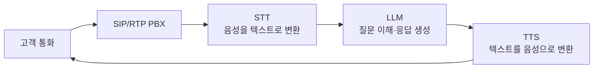
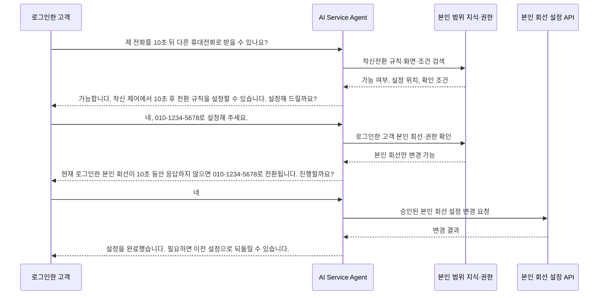
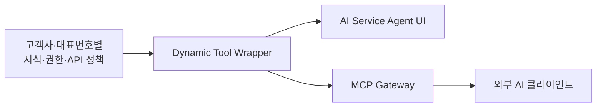

# 지능망 AI Service Agent PoC

**문서 유형**: C-Level/임원 및 본부장 보고용 PoC 소개서
**작성일**: 2026-09-03
**버전**: 6.4
**상태**: PoC 범위 정의 및 검증 보고
**대상 독자**: C-Level, 본부장, 사업·운영·기술 의사결정권자
**관련 문서**: [셀프서비스 AI 아키텍처](architecture/self-service-ai-assistant-architecture.md) | [서비스 PRD](product/self-service-ai-assistant-prd.md) | [시장·연구 조사](design/MCP_VS_CLIENT_CENTRIC_UNIVERSAL_AGENT_MARKET_RESEARCH.md) | [지식베이스·IntelliDecision 연구](design/SELF_SERVICE_RAG_INTELLIDECISION_ADVANCEMENT_RESEARCH.md)

---

## 1. PoC를 시작한 배경

통화매니저 CS 고객센터에는 반복 문의가 꾸준히 들어옵니다. 고객은 사용법을 묻는 데서 그치지 않고, 현재 설정을 확인하거나 바꿔 달라고 요청합니다. 상담원이 같은 설명과 시스템 조작을 반복하면 대기 시간이 길어지고, 장애·계약·예외 처리처럼 사람의 판단이 필요한 업무에 집중하기 어렵습니다.

신규 고객의 불편도 큽니다. 처음 서비스를 쓰는 고객은 메뉴 위치와 용어부터 다시 익혀야 합니다. UI/UX를 개선하면 서비스는 더 좋아지지만, 화면과 메뉴가 바뀌는 초기에는 기존 고객도 낯선 구조를 익혀야 합니다. 고객의 질문을 이해하고, 바뀐 화면을 기준으로 안내하며, 필요한 경우 설정까지 이어 주는 대화형 지원 채널이 필요한 이유입니다.

기존 방식으로 AI 고객센터를 구축하려면 전문 Agent Builder 엔지니어가 업무 도메인을 분석해야 합니다. 기능마다 대화 흐름을 설계하고, 질문별 분기와 정보 수집 단계를 만들며, API 연동 결과에 따라 상태를 이동시켜야 합니다. 오류와 예외까지 상태 머신으로 관리해야 하므로 구축과 유지에 많은 시간과 전문 인력이 듭니다. 소규모 사업자나 일반 고객이 자체 AI 상담 시스템을 갖기 어려운 이유입니다.

**지능망 AI Service Agent PoC**는 이 한계를 검증합니다. 사람이 복잡한 대화 흐름을 하나씩 설계하는 대신, 고객사별 지식 문서와 API 계약을 등록하고 IntelliDecision, N-hop RAG, Dynamic Tool Wrapper가 고객의 질문을 판단·안내·실행까지 연결할 수 있는지 확인합니다.

---

## 2. 1차 보고 기반 - 지능망 Next AI Call Agent PoC

이번 PoC는 처음부터 새로 시작한 과제가 아닙니다. 1차 보고인 **지능망 Next AI Call Agent PoC**에서는 SIP/RTP 통화를 처리하는 PBX를 구축하고, 음성 인식(STT), 대규모 언어 모델(LLM), 음성 합성(TTS)을 연결해 인입 통화에 AI가 응대하는 기반을 만들었습니다.



이후에는 지식베이스를 자유롭게 구성하고 관리할 수 있도록 체계를 확장했습니다. 통화에서 얻은 지식 후보를 축적하고, 관리자가 검토·보완하며, AI가 답하기 어려운 상황은 사람에게 넘기는 HITL(Human-in-the-Loop) 체계를 함께 마련했습니다. AI가 지식 후보를 채우고 사람은 지식 품질과 예외 상황을 관리하는 유연한 AI 응대 기반입니다.

이번 2차 PoC는 이 기반에서 출발합니다. 통화 AI의 입력·출력 구조는 유지하되, 검증 범위에서는 **UI의 텍스트 입력 → LLM 처리 → UI 응답**을 가정합니다. 음성 채널의 지연이나 인식 품질과 분리해, 고객센터 업무를 이해하고 실행하는 AI의 핵심 동작을 명확히 검증하기 위해서입니다. 아래의 작은 구조 그림을 시작점으로, 각 핵심 기술을 하나씩 더해 고객 질문이 안전한 실행으로 이어지는 전체 구조를 설명합니다.

```text
┌──────────────────────────────────────────────────────────────────────┐
│  AI Service Agent                                                     │
├──────────────────┬──────────────────────┬────────────────────────────┤
│  UI 요청         │  LLM                 │  UI 응답                   │
│  "설정할 수      │  질문 이해            │  "가능합니다."             │
│   있나요?"       │                      │                            │
└──────────────────┴──────────────────────┴────────────────────────────┘
```

---

## 3. PoC 시나리오 - 내 전화를 10초 후 다른 휴대전화로 받기

본 문서는 한 가지 질문을 끝까지 따라갑니다.

> "제가 받지 못하는 전화가 10초 후 다른 휴대전화로 오도록 설정할 수 있나요?"

AI는 먼저 가능 여부와 설정 화면을 안내합니다. 고객이 "설정해 주세요"라고 답하면, AI는 로그인한 고객 본인에게 연결된 회선만 대상으로 삼습니다. 다른 고객이나 다른 사람의 회선은 조회하거나 수정할 수 없습니다. AI는 전환할 휴대전화 번호와 변경 결과를 확인하고, 고객이 최종 승인한 뒤에만 등록된 API를 호출합니다. 실행 후에는 실제 설정 결과를 다시 확인해 화면에 알려 줍니다.



이 한 흐름 안에서 세 가지 핵심 기술이 순서대로 작동합니다.

1. **IntelliDecision**이 질문의 목적과 다음 행동을 판단합니다.
2. **N-hop RAG**가 답변에 필요한 지식과 화면 안내를 연결합니다.
3. **Dynamic Tool Wrapper**가 승인된 외부 API를 실제 설정 작업으로 연결합니다.

---

## 4. 먼저 만드는 것 - 착신전환 지식베이스

AI가 정확한 답을 하려면 먼저 업무 지식을 구조화해야 합니다. 이 PoC에서는 고객사와 서비스 대표번호별로 지식과 권한을 분리합니다. 따라서 A 고객사의 매뉴얼이나 API가 B 고객사의 답변과 실행 경로에 섞이지 않습니다.

### 4.1 실제로 업로드하는 원본 데이터

아래는 이 PoC에서 사용하는 착신전환 지식의 원본 형태입니다. 운영자는 마크다운 매뉴얼과 OpenAPI 계약을 업로드하고, 지식베이스는 이를 질문·답변 단위와 실행 가능한 계약으로 나누어 보관합니다. 매뉴얼은 실제 서비스 이용 매뉴얼의 착신 제어 항목을 발췌했으며, API 계약은 “본인 회선의 10초 무응답 전환”을 검증하기 위해 정의한 PoC 입력 예시입니다.

**업로드 파일 A - `call-control-manual.md`**

```markdown
## 5. 착신 제어 {domain: call-control}

**Q: "무응답 시 AI 응대"는 어떻게 동작하나요?**
A: 전화벨이 지정한 시간(10초, 20초, 30초 중 선택) 동안 아무도 받지 않으면
그때 AI가 응답합니다.

**Q: 착신 규칙을 여러 개 만들면 어떻게 적용되나요?**
A: 활성화된 규칙만 후보가 되고, 목록에 표시된 순서대로 하나씩 확인합니다.
시간 조건과 가장 먼저 일치하는 규칙 딱 1개만 적용됩니다.

**Q: 전화를 특정 직원에게 돌리고 싶어요.**
A: 설정 > 착신 제어 > 착신전환 대상 탭에서 표시 이름과 내선 번호를 등록하세요.
```

**업로드 파일 B - `call-forwarding-api.yaml` (PoC 검증용 계약)**

```yaml
openapi: "3.0.0"
info:
    title: 본인 회선 착신전환 API
paths:
    /my-line/forwarding-rule:
        get:
            summary: 로그인한 고객 본인 회선의 현재 착신 규칙 조회
        patch:
            summary: 본인 회선의 무응답 착신전환 변경
            requestBody:
                required: true
                content:
                    application/json:
                        schema:
                            type: object
                            required: [no_answer_seconds, forward_to]
                            properties:
                                no_answer_seconds: { type: integer, enum: [10, 20, 30] }
                                forward_to: { type: string, description: "사전 등록된 전환 대상" }
```

**업로드 후 만들어지는 지식 카드**

| 카드 ID | 원본 위치       | 보관 내용                          | 질문에서 쓰이는 이유                |
| ------- | --------------- | ---------------------------------- | ----------------------------------- |
| KB-01   | 매뉴얼 5.1      | 무응답 시간은 10·20·30초 중 선택   | “10초 뒤” 조건의 가능 여부를 확인   |
| KB-02   | 매뉴얼 5.1      | 활성 규칙을 우선순위 순서로 평가   | 기존 규칙과 충돌할 수 있음을 안내   |
| KB-03   | 매뉴얼 5.3      | `설정 > 착신 제어 > 착신전환 대상` | 고객이 직접 설정할 화면 위치를 안내 |
| API-01  | OpenAPI `GET`   | 현재 본인 회선 규칙 조회           | 변경 전 상태와 대상 확인            |
| API-02  | OpenAPI `PATCH` | 10·20·30초, 전환 대상 입력 계약    | 최종 승인 후 변경에만 사용          |

```text
┌──────────────────────────────────────────────────────────────────────┐
│  AI Service Agent                                                     │
├───────────────┬───────────────┬────────────────────┬─────────────────┤
│ UI 요청       │ LLM           │ 지식베이스(업로드) │ UI 응답         │
│ "10초 뒤      │ 질문 이해     │ KB-01: 시간 조건  │ "가능합니다.   │
│  전환할 수    │               │ KB-03: 화면 위치  │  착신 제어에서 │
│  있나요?"     │               │                    │  설정하세요."  │
└───────────────┴───────────────┴────────────────────┴─────────────────┘
```

### 4.2 질문마다 활용되는 지식이 다르다

같은 다섯 장의 지식 카드라도 고객이 무엇을 묻느냐에 따라 조합이 달라집니다. 아래는 실제 대화에서 나올 법한 네 가지 질문을 예로 들어, 그 질문에 답하기 위해 어떤 카드를 꺼내 쓰고 화면에 무엇을 보여 주는지 정리한 것입니다.

| 고객 질문                                  | 직접 활용하는 지식                 | AI가 화면에 보여 줄 응답                       |
| ------------------------------------------ | ---------------------------------- | ---------------------------------------------- |
| “10초 뒤 다른 휴대전화로 받을 수 있나요?”  | KB-01, KB-03                       | 가능 여부, 10초 선택 조건, 설정 메뉴 위치      |
| “기존 규칙이 있는데 새로 설정해도 되나요?” | KB-02, API-01                      | 우선순위 충돌 가능성, 현재 규칙 확인 필요      |
| “010-1234-5678로 설정해 주세요.”           | KB-01, API-01, API-02              | 본인 회선 확인, 등록 대상 여부, 최종 승인 요청 |
| “방금 변경을 취소해 주세요.”               | 변경 전 상태, 실행 이력, Undo 정책 | 복원 가능 여부와 이전 값 복구 결과             |

이렇게 카드를 나눠 두면 지식베이스는 FAQ 모음 이상의 역할을 합니다. IntelliDecision은 같은 카드를 놓고 다음에 무엇을 할지 판단하는 근거로 삼고, N-hop RAG는 그 카드들을 답변 근거로 엮어 냅니다. Dynamic Tool Wrapper는 그중 실행 가능한 계약과 승인 조건만 골라내 실제 변경 작업에 씁니다.

---

## 5. 핵심 기술 1 - IntelliDecision

고객의 문장은 짧아도 의도는 매번 다릅니다. "설정할 수 있나요?"는 안내 요청이고, "설정해 주세요"는 실행 요청입니다. "아니요, 다른 번호로요"는 앞서 입력한 값을 고치는 요청이며, "방금 변경을 취소해 주세요"는 복원 요청입니다. 기존 Agent Builder 방식은 이런 경우를 예상해 흐름과 분기를 미리 설계해야 합니다. 모든 변형을 미리 만들 수 없으므로 고객은 정해진 질문 밖에서 답답함을 느끼기 쉽습니다.

IntelliDecision의 역할은 발화 유형을 고르는 데서 끝나지 않습니다. 고객이 지금 원하는 것이 무엇인지, 앞선 대화에서 이미 확인된 값은 무엇인지를 함께 살펴봅니다. 실행을 요청한 경우에는 권한과 변경 영향을 먼저 따진 뒤에야 안내·추가 질문·승인 요청·실행·복원·사람 이관 중 하나를 고릅니다. LLM은 정해진 대본을 따르지 않고, 이 판단 결과에 맞는 지식과 도구만 골라 씁니다.

| 판단 기준   | 10초 착신전환 시나리오에서 확인하는 내용                       | 다음 행동                  |
| ----------- | -------------------------------------------------------------- | -------------------------- |
| 고객의 목적 | 가능 여부를 묻는가, 실제 변경을 원하는가                       | 안내 또는 실행 준비        |
| 이전 대화   | 이미 전환 번호와 본인 회선 상태를 확인했는가                   | 같은 정보를 다시 묻지 않음 |
| 누락 정보   | 전환할 번호와 시간 조건이 무엇인지                             | 꼭 필요한 정보만 질문      |
| 실행 위험   | 여러 회선에 영향을 주는지, 되돌릴 수 있는지                    | 영향 범위와 승인 요구      |
| 다음 행동   | 안내, 조회, 보완 질문, 승인, 실행, 취소, 이관 중 무엇이 맞는지 | 대화 경로 선택             |

```text
┌────────────────────────────────────────────────────────────────────────────────┐
│  AI Service Agent                                                               │
├────────────┬────────┬─────────────────┬──────────────────────┬─────────────────┤
│ UI 요청    │ LLM    │ IntelliDecision │ 지식베이스(업로드)  │ UI 응답         │
│ "설정해    │ 의미   │ 목적: 실행 요청 │ KB-01: 10초 조건    │ "전환할 번호를 │
│  주세요"   │ 해석   │ 누락: 전환 번호 │ API-01: 현재 상태   │  알려주세요."  │
│            │        │ 다음: 정보 요청 │                      │                 │
└────────────┴────────┴─────────────────┴──────────────────────┴─────────────────┘
```

**같은 지식, 다른 대화 판단**

한 번의 대화 안에서도 판단은 발화마다 달라집니다. 아래는 같은 고객이 네 차례에 걸쳐 말을 바꿔 가는 동안, IntelliDecision이 매번 무엇을 다르게 판단하는지 보여 줍니다.

| 대화 차례 | 고객 발화                    | IntelliDecision 판단           | 활용 카드            | 다음 UI 응답                      |
| --------- | ---------------------------- | ------------------------------ | -------------------- | --------------------------------- |
| 1         | “10초 뒤 전환할 수 있나요?”  | 안내 요청                      | KB-01, KB-03         | 가능 여부와 메뉴 위치 안내        |
| 2         | “설정해 주세요.”             | 실행 요청, 번호 누락           | KB-01, API-01        | 전환할 번호 입력 요청             |
| 3         | “010-1234-5678로요.”         | 실행 준비, 본인 회선 확인 필요 | API-01, API-02       | 변경 내용을 요약해 최종 승인 요청 |
| 4         | “아니요, 010-9876-5432로요.” | 정정 요청                      | 기존 대화 값, API-02 | 새 번호만 반영해 승인 문구 갱신   |

이 기능의 핵심은 대화가 이어지는 동안 판단을 매번 새로 내린다는 데 있습니다. 그래서 이미 확인한 10초 조건은 그대로 두고, 고객이 정정한 번호만 바꿀 수 있습니다. 지식이 없거나 권한이 부족하거나 정책상 위험한 요청을 만나면, AI는 이유를 설명하고 담당자에게 넘깁니다. 답할 근거가 부족한 상황에서 억지로 답하거나 실행하지 않는 것 역시 IntelliDecision이 지켜야 할 몫입니다.

**9가지 판단 유형과 처리 방향**

IntelliDecision은 고객 발화를 아래 9가지 유형 중 하나로 판단한 뒤, 유형에 맞는 방식으로 대응합니다.

| 유형        | 고객 발화의 성격                      | AI의 처리 방향                                            |
| ----------- | ------------------------------------- | --------------------------------------------------------- |
| 안내        | 기능·절차·화면을 묻는 질문            | 관련 지식을 찾아 가능 여부와 다음 행동을 안내             |
| 실행        | 조회·변경을 직접 요청                 | 필수 정보, 권한, 업무 규칙을 확인한 뒤 승인 절차로 이동   |
| 포괄 도움   | “무엇을 할 수 있나요?” 같은 넓은 질문 | 여러 업무 영역을 살펴보고 가능한 업무를 묶어 안내         |
| 정정        | 번호·시간·조건을 바꾸는 요청          | 이미 확인한 값은 유지하고 바뀐 값만 다시 확인             |
| 취소·복원   | 실행 전 취소 또는 실행 후 되돌리기    | 승인 대기 상태를 폐기하거나 실행 이력과 복원 조건을 확인  |
| 모호성 해소 | 대상·값·의미가 불분명한 요청          | 필요한 정보 한 가지만 짚어 되묻고 추측 실행은 중단        |
| 일괄 처리   | 여러 대상·여러 변경을 함께 요청       | 대상 수와 영향 범위를 먼저 확인하고 작업을 분리           |
| 범위 밖     | 권한·지식·정책을 벗어난 요청          | 처리할 수 없는 이유와 담당 경로를 안내                    |
| 반복        | 직전 안내를 다시 요청                 | 새 검색이나 실행 없이 직전 안내를 이해하기 쉽게 다시 제시 |

이 구조는 Flow를 없애겠다는 뜻이 아닙니다. 빈번한 업무에 공통으로 적용할 판단 구조를 먼저 세우고, 그 위에 문서·정책·도구를 연결하는 방식에 가깝습니다. 관리자는 고객 발화가 어느 유형으로 분류됐는지, 어떤 지식 카드가 쓰였는지, 실제로 실행까지 이어졌는지를 살펴봅니다. 답변이 부정확할 때도 대화 흐름 전체를 다시 그릴 필요는 없습니다. 판단 정책이나 원본 지식 카드 하나만 고치면 다음 응답부터 개선됩니다.

---

## 6. 핵심 기술 2 - N-hop RAG

일반 RAG는 질문과 의미가 비슷한 문서 조각을 찾아 답변에 넣습니다. 그러나 고객센터 업무에서는 문서 한 조각만으로 충분하지 않습니다. "10초 뒤 다른 휴대전화로 전환할 수 있나요?"라는 질문에 답하려면 사용법뿐 아니라 화면 위치, 규칙의 우선순위, 등록 가능한 번호 조건, 변경 가능 여부까지 함께 알아야 합니다.

N-hop RAG는 첫 문서 검색 결과에서 멈추지 않고, 관련 문서에서 업무 영역으로, 업무 영역에서 다시 화면 안내와 정책으로 한 단계씩 근거를 넓혀 갑니다. 이렇게 하면 고객은 “매뉴얼에 적힌 문장”을 그대로 듣는 대신, 지금 해야 할 행동을 안내받을 수 있습니다.

```text
┌────────────────────────────────────────────────────────────────────────────────┐
│  AI Service Agent                                                               │
├──────────┬────────┬────────────────┬────────────────────────┬──────────────────┤
│ UI 요청  │ LLM    │ IntelliDecision│ 지식베이스(업로드)     │ UI 응답          │
│ "어디서  │ 질문   │ 안내 요청      │ 1단계 KB-01: 10초 규칙 │ "착신 제어에서  │
│  설정해?"│ 해석   │                │ 2단계 KB-02: 평가 순서 │  규칙과 대상을  │
│          │        │                │ 3단계 KB-03: 화면 위치 │  설정하세요."   │
└──────────┴────────┴────────────────┴────────────────────────┴──────────────────┘
```

| 단계  | 연결하는 정보                          | 고객에게 주는 가치                             |
| ----- | -------------------------------------- | ---------------------------------------------- |
| 1-hop | 사용 매뉴얼의 무응답 전환 설명         | 가능한 기능인지 빠르게 확인                    |
| 2-hop | 착신 규칙, 우선순위, 번호 등록 조건    | 왜 특정 조건이 필요한지 이해                   |
| 3-hop | UI 화면 경로, 실행 정책, API 가능 여부 | 어디서 설정하고 다음에 무엇을 해야 하는지 확인 |

첫 검색에서는 KB-01의 “10초를 선택할 수 있다”는 사실을 찾습니다. 다만 이 한 문장만으로 답하면 기존 규칙과 충돌하는지, 어느 메뉴에서 설정하는지는 알 수 없습니다. 그래서 다음 단계로 KB-02를 찾아 활성 규칙의 우선순위를 확인하고, 이어서 KB-03으로 화면 위치를 확인합니다. 실행 요청으로 이어진 경우에만 마지막으로 API 계약까지 확인한 뒤, 이렇게 찾은 근거를 답변 문장에 반영합니다.

> “10초 무응답 전환을 선택할 수 있습니다. 다만 활성 규칙은 목록 순서대로 적용되므로 기존 규칙을 먼저 확인하세요. 직접 설정하려면 `설정 > 착신 제어 > 착신전환 대상`에서 전환할 번호를 등록하면 됩니다.”

**질문 “10초 뒤 전환은 어디서 설정하나요?”의 근거 표시 예시**

| 근거 단계 | 활용한 카드 | 답변에 반영되는 내용                                         |
| --------- | ----------- | ------------------------------------------------------------ |
| 1단계     | KB-01       | 무응답 시간은 10·20·30초 중 선택 가능                        |
| 2단계     | KB-02       | 활성 규칙은 우선순위 순서대로 평가되므로 기존 규칙 확인 필요 |
| 3단계     | KB-03       | `설정 > 착신 제어 > 착신 규칙`, `착신전환 대상`에서 설정     |

UI가 바뀌면 관리자는 KB-03의 화면 안내만 고치면 되고, 규칙이 바뀌면 KB-02만 수정하면 됩니다. 운영자가 답변에 쓰인 원본 카드와 연결 순서를 확인할 수 있어서, 잘못된 지점을 바로 찾아 고칠 수 있습니다. 다만 관계 확장은 허용된 업무 관계와 정해진 단계 안에서만 이뤄지며, 관련 없는 문서를 끝없이 따라가며 답변을 부풀리지는 않습니다.

---

## 7. 핵심 기술 3 - Dynamic Tool Wrapper

답변만 하는 AI는 고객의 마지막 요청을 상담원에게 다시 넘깁니다. Dynamic Tool Wrapper는 업로드된 OpenAPI 명세를 읽어 AI가 사용할 수 있는 실행 도구 후보를 만듭니다. 고객사가 이미 운영하는 설정 API를 바꾸지 않아도, 필요한 계약과 정책을 등록하면 AI가 조회와 승인된 변경 업무에 활용할 수 있습니다.

```text
┌──────────────────────────────────────────────────────────────────────────────────────┐
│  AI Service Agent                                                                     │
├──────────┬────────┬────────────────┬──────────────────┬──────────────┬───────────────┤
│ UI 요청  │ LLM    │ IntelliDecision│ 지식베이스       │ Dynamic Tool │ UI 응답       │
│ "010...  │ 의미   │ 실행 요청      │ API-01: 사전조회 │ 본인 회선    │ "10초 후     │
│ 로 설정" │ 해석   │ 정보 충족      │ API-02: PATCH   │ 승인·실행    │  전환됩니다. │
│          │        │                │                  │ 상태 재확인  │  진행할까요?"│
└──────────┴────────┴────────────────┴──────────────────┴──────────────┴───────────────┘
```

**질문 “010-1234-5678로 설정해 주세요.”의 실행 근거**

같은 요청이라도 다섯 단계를 모두 통과해야 실제 변경으로 이어집니다. 아래 표는 각 단계에서 무엇을 확인하고, 통과하지 못하면 어떻게 되는지를 정리한 것입니다.

| 확인 순서         | 사용하는 업로드 데이터                     | 통과하지 않으면                               |
| ----------------- | ------------------------------------------ | --------------------------------------------- |
| 1. 적용 범위 확인 | 로그인 정보, API-01                        | 업무별 권한 범위를 벗어나면 실행하지 않음     |
| 2. 업무 조건 확인 | KB-01, KB-02                               | 허용 시간이 아니거나 규칙 충돌 시 안내로 전환 |
| 3. 계약 검증      | API-02의 `no_answer_seconds`, `forward_to` | 누락·허용 외 값이면 고객에게 다시 확인        |
| 4. 최종 승인      | 화면에 표시한 변경 요약                    | 고객이 승인하지 않으면 API를 호출하지 않음    |
| 5. 실행 후 검증   | API-01 재조회, 실행 이력                   | 실제 상태가 다르면 완료로 안내하지 않음       |

이 다섯 단계와 별개로, 착신전환 변경 자체는 아래 검증 원칙을 항상 지킵니다.

| 검증 원칙    | 착신전환 변경에서 확인하는 내용                                                   |
| ------------ | --------------------------------------------------------------------------------- |
| 실행 전 기록 | 로그인한 고객의 본인 회선에서 무엇을 바꾸는지, 변경 전 값이 무엇인지 남김         |
| 권한과 정책  | 업무별 접근 권한, 인증, 승인된 메서드인지 확인                                    |
| 명시적 승인  | “현재 로그인한 본인 회선이 10초 뒤 010-1234-5678로 전환됩니다”를 확인받은 뒤 실행 |
| 실행 후 검증 | API 응답과 실제 설정 상태가 일치하는지 대조                                       |
| 복원 가능성  | 이전 상태를 되돌릴 수 있을 때만 Undo 경로 안내                                    |

실행은 네 단계를 거치며 통제됩니다. 업로드 모듈이 OpenAPI 문서에서 엔드포인트, 입력값, 응답 형식, 접속 주소, 인증 방식을 먼저 읽어 오면, 관리자가 허용한 메서드만 AI의 도구 후보로 등록됩니다. 승인하지 않은 쓰기 메서드는 애초에 후보 목록에 나타나지 않습니다. 실행 직전에는 필수 입력값, 업무 규칙, 권한, 변경 전 상태를 확인해 고객에게 변경 내용을 평문으로 보여 주고, 고객이 승인한 뒤에야 API를 호출합니다. 이때도 응답 메시지만 믿지 않고 원격 상태를 다시 조회해 실제로 반영됐는지 확인합니다.

Undo도 모든 경우에 자동으로 제공되는 기능은 아닙니다. 변경 전 상태를 읽을 수 있고 이를 되돌릴 API가 실제로 있을 때만 복원 경로를 안내합니다. 접속 주소, 인증 방식, 요청·응답 형식, 업무 규칙, 승인 대상, 사후 검증 조건 중 하나라도 갖추지 못한 API는 안내용 지식으로만 쓰거나 담당자에게 넘깁니다. 이 PoC가 확인하려는 것은 이런 공통 통제 구조가 업무마다 중계 코드와 대화 흐름을 새로 만드는 부담을 얼마나 줄여 주는가입니다.

---

## 8. 시장 활용 사례

대표 사례는 Zendesk AI Agent를 사용 중인 언어 학습 서비스 **Babbel**입니다. 이 사례는 대량의 반복 문의, 지식 기반 응대, 고객별 백엔드 연동, 복잡한 문의의 사람 이관이라는 고객센터 운영 과제를 한 흐름 안에서 보여 줍니다. 수치는 Zendesk가 공개한 고객 사례이며, 본 PoC의 성과나 예상 성과를 뜻하지 않습니다.

### 8.1 Zendesk AI Agent와 Babbel - 지식·판단·실행을 고객 셀프서비스로 연결

**운영 배경**: Babbel은 다국어 고객 문의가 몰리는 시기에 약 50명의 상담 인력으로 지원 수요를 처리해야 했습니다. 팀은 먼저 상담 티켓 유형을 분석해 마찰이 크고 유입량이 많은 반복 요청부터 자동화 대상으로 골랐습니다. 구독 상태 확인, 구독 관리, 선호 언어 변경이 대표 대상이었습니다.

**운영 방식**: Zendesk AI Agent는 헬프센터, Google Drive, PDF 등 연결된 지식에서 답변 근거를 찾습니다. 고객 요청의 의도와 복잡도를 판단하고, 추가 정보가 필요하면 대화로 확인합니다. Babbel은 구독 관리 API를 열어 AI Agent와 자사 백엔드 시스템을 연결했습니다. 고객은 상담원을 거치지 않고 구독을 관리할 수 있고, 개인정보 요청처럼 개별 판단이 필요한 업무는 사람에게 이관합니다.

```text
고객의 구독 문의
       │
       ▼
Zendesk AI Agent ── 연결된 지식·정책 확인 ──> 추가 질문 또는 안내
       │
       ├── 구독 관리 요청 ──> Babbel 백엔드 API ──> 처리 결과 안내
       │
       └── 개인정보 등 개별 판단 업무 ──> 상담사 이관
```

**공개 결과**: Zendesk 고객 사례는 Babbel의 AI 자동화율이 50% 이상이며, 상담사 온보딩 기간이 67% 줄었다고 밝힙니다. 메시징·채팅 채널 비중은 45%입니다. Babbel은 성수기 문의량이 크게 늘어도 팀 규모를 유지하면서 서비스 KPI를 지킬 수 있었다고 설명합니다.


*출처: [Zendesk AI Agent 공식 소개](https://www.zendesk.kr/service/ai/ai-agents/) | [Zendesk Babbel 고객 사례](https://www.zendesk.kr/customer/babbel/)*

**PoC에 주는 시사점**: 이 사례는 AI가 FAQ만 답하는 구조를 넘어, 지식으로 정책을 확인하고 대화로 필요한 정보를 채운 뒤 백엔드 작업까지 연결하는 운영 모델을 보여 줍니다. 본 PoC도 같은 문제를 세 층으로 나누어 다룹니다. 고객이 무엇을 원하는지와 다음 행동을 고르는 일은 IntelliDecision이 맡고, 업무 규칙과 화면 안내를 함께 찾는 일은 N-hop RAG가 맡습니다. 승인 정책을 적용한 API 실행은 Dynamic Tool Wrapper의 몫입니다. 다만 본 PoC는 착신전환 단일 업무에서 이 구조와 통제 절차가 작동하는지를 먼저 확인합니다.

**참고한 시장 모델**: [Google Dialogflow CX](https://docs.cloud.google.com/dialogflow/cx/docs/basics)는 Flow·Page·Route 기반의 Builder 중심 대화 설계 비교 근거로, [OpenAI GPT Actions](https://developers.openai.com/api/docs/actions/introduction)는 OpenAPI 계약을 자연어 API 실행으로 연결하는 선행 모델로 활용합니다.

---

## 9. 기존 AICC와 비교한 PoC의 가치

비교 대상은 모든 AICC가 아닙니다. 여기서는 전문 엔지니어가 업무별 대화 Flow, 상태 전이, API 결과 분기를 사전에 설계하는 **Builder 중심 AICC**를 비교 대상으로 삼습니다. 생성형 AI와 지식 검색, API 연동을 지원하는 최신 AICC도 있으므로 기존 AICC 전체를 낮춰 평가하지 않습니다.

이 차이는 구축 방식부터 운영 개선까지 여섯 가지 축으로 나타납니다.

| 비교 축     | Builder 중심 AICC                            | 지능망 AI Service Agent PoC                                         | 고객·운영 효과                           |
| ----------- | -------------------------------------------- | ------------------------------------------------------------------- | ---------------------------------------- |
| 초기 구축   | 업무별 Flow, 예외, 상태 전이를 설계하고 시험 | 지식 문서·API 계약·승인 정책을 등록하고 공통 판단 구조를 적용       | 작은 업무부터 빠르게 검증                |
| 비정형 발화 | 미리 만든 분기 밖의 표현은 추가 설계가 필요  | IntelliDecision이 목적·맥락·누락 정보를 다시 판단                   | 고객이 정해진 질문에 맞춰 말할 부담 축소 |
| 지식 변경   | 답변·분기·시나리오 테스트를 함께 수정        | 업무 규칙·화면 안내·정책 카드를 수정하고 근거를 재확인              | UI와 정책 변경에 더 빠르게 대응          |
| API 연동    | 기능별 중계 로직과 성공·실패 분기 설계       | OpenAPI 계약에서 후보를 만들고 승인·사전 상태·사후 검증을 공통 적용 | 연결 방식의 반복 작업 감소               |
| 고객별 적용 | 고객사마다 Flow 구축 프로젝트가 누적         | 고객사별 지식·권한·API를 분리 등록                                  | 동일 구조를 여러 고객사에 재사용         |
| 운영 개선   | Flow와 프롬프트, 로그를 함께 추적            | 답변 근거 카드와 실행 이력에서 수정 지점을 확인                     | 운영자가 지식 중심으로 개선              |

이 PoC가 주장하는 가치는 “무엇이 들어와도 무조건 답하는 AI”가 아닙니다. 고객이 정해진 메뉴와 질문에 맞춰 말해야 하는 부담을 줄이면서도, 지식·권한·승인 정책이 준비된 범위 안에서만 안내와 실행을 연결하겠다는 데 있습니다. 그래서 지식이 없거나 권한이 없거나 복원할 수 없는 고위험 작업은 AI가 임의로 처리하지 않고 사람의 확인이나 이관으로 넘깁니다. 고객사마다 업무 지식과 API 계약이 달라도 같은 판단 구조를 그대로 재사용할 수 있고, 운영자는 답변 근거와 실행 이력을 살펴본 뒤 원본 문서부터 고쳐 나가면 됩니다.

---

## 10. CS 데이터가 보여 주는 적용 가능성

2024년 통화매니저 CS 처리 실데이터 7,047건을 분석한 결과, 표준 절차로 안내·조회·실행 가능성을 검토할 수 있는 상위 4개 유형은 5,436건으로 전체의 **77.1%**입니다. 이는 자동화 절감 실적이 아니라 PoC 이후 우선순위를 정하기 위한 후보군입니다.

| 우선 검토 업무             |      건수 |      비중 | PoC 이후 적용 방향                                  |
| -------------------------- | --------: | --------: | --------------------------------------------------- |
| 고객사 MAC/비밀번호 초기화 |     2,626 |     37.3% | 본인 확인 뒤 표준 절차 안내 또는 승인된 초기화 실행 |
| 서비스 이용 문의           |     1,473 |     20.9% | 지식베이스와 화면 안내를 활용한 자가 해결 지원      |
| 회선 묶음 요청             |       792 |     11.2% | 대상·영향 범위·최종 승인 뒤 제한된 실행             |
| KT OPEN_API 로그인 불가    |       545 |      7.7% | 상태 조회, 표준 조치, 기술 지원 이관                |
| **우선 후보 합계**         | **5,436** | **77.1%** | API와 보안 정책이 준비된 업무부터 단계 적용         |

PoC에서 착신전환 한 건의 안내·판단·실행 흐름을 검증한 뒤, 위 업무에도 같은 원칙을 적용할 수 있습니다. 실제 확대 여부는 셀프 해결률, 실행 성공률, 이관 사유, 재문의율, 변경 취소율을 통해 확인합니다.

---

## 11. MCP Gateway - PoC의 확장 가능성

MCP(Model Context Protocol)는 세 핵심 기술과 별개로, 이미 구성한 실행 도구를 외부 AI에도 연결하는 확장 경로입니다. Dynamic Tool Wrapper가 만든 도구에 MCP 서버 기능을 더하면 Claude Desktop이나 VS Code Copilot 같은 MCP 클라이언트도 같은 API를 사용할 수 있습니다.



이 기능은 이번 PoC의 핵심 검증 대상은 아닙니다. 다만 고객센터용으로 검증한 API 연결과 안전 정책을 다른 AI 도구에도 재사용할 수 있는지 확인하는 확장 가능성으로 기록합니다.

---

## 12. PoC Lessons Learned

1. AI 고객센터의 어려움은 모델 연결 자체보다 업무 지식, 권한, 예외, API 결과를 대화 흐름에 반영하는 데 있습니다.
2. 고객 경험을 바꾸려면 FAQ 검색만으로는 부족합니다. 화면 안내, 업무 규칙, 실행 정책을 함께 연결해야 고객이 다음 행동을 할 수 있습니다.
3. 모든 대화 흐름을 미리 설계하는 방식은 고객의 정정·취소·모호한 질문을 모두 담기 어렵습니다. 목적과 맥락을 다시 판단하는 구조가 필요합니다.
4. 실제 실행은 답변 생성보다 더 엄격하게 다뤄야 합니다. 승인, 변경 전 상태, 원격 상태 검증, 복원 가능 여부가 갖춰지지 않으면 실행하지 않아야 합니다.
5. AI 응대 품질은 프롬프트만으로 관리할 수 없습니다. 답변 근거와 지식베이스를 관리자가 직접 확인하고 문서를 갱신할 수 있어야 지속적으로 개선할 수 있습니다.

## 결론

지능망 AI Service Agent PoC는 기존 통화 AI와 지식베이스 기반 위에서, 고객센터 업무를 더 유연하게 처리할 수 있는지를 검증하는 과제입니다. 고객이 UI에서 “10초 동안 전화를 받지 못하면 다른 휴대전화로 받을 수 있나요?”라고 묻는 한 가지 시나리오를 끝까지 따라가며, IntelliDecision의 판단과 N-hop RAG의 근거 탐색, Dynamic Tool Wrapper의 안전한 실행 연결이 실제로 이어지는지 확인합니다.

PoC의 성공 여부는 “AI가 많은 답을 했는가”가 아니라, 고객이 정확한 안내를 받고 필요한 경우 안전하게 설정을 마칠 수 있었는가로 판단합니다. 이 검증이 끝나면, CS 데이터에서 확인한 우선 후보 업무로 적용 범위를 넓혀 갈 수 있습니다.

*최종 업데이트: 2026-09-03*