# AI Service Agent - 서비스 소개서

**문서 유형**: C-Level/임원 및 본부장 보고용 서비스 소개서
**작성일**: 2026-09-02
**버전**: 5.2
**상태**: 도입·확장 제안
**대상 독자**: C-Level, 본부장, 사업·운영·기술 의사결정권자
**관련 문서**: [셀프서비스 AI 아키텍처](architecture/self-service-ai-assistant-architecture.md) | [서비스 PRD](product/self-service-ai-assistant-prd.md) | [시장·연구 조사](design/MCP_VS_CLIENT_CENTRIC_UNIVERSAL_AGENT_MARKET_RESEARCH.md) | [지식베이스·IntelliDecision 연구](design/SELF_SERVICE_RAG_INTELLIDECISION_ADVANCEMENT_RESEARCH.md)

---

## Executive Summary

### 한 장 요약

**AI Service Agent**는 고객 또는 테넌트 관리자가 전화와 문자로 질문하면, 단순히 답변을 찾는 데서 멈추지 않고 **지식 안내, 상태 조회, 승인된 설정 변경, 변경 취소, 담당자 이관**까지 한 흐름으로 수행하는 AI 실행 채널이다. 기존 SIP PBX와 운영 콘솔 위에 결합되므로, 별도 고객센터 시스템을 새로 교체하는 방식이 아니라 현재 서비스의 셀프서비스 접점을 확장하는 방식으로 도입한다.

2024년 통화매니저 CS 처리 실데이터 7,047건을 분석한 결과, 표준 절차로 안내·조회·실행 가능성이 있는 상위 4개 문의 유형이 5,436건으로 전체의 **77.1%**다. 이는 실제 자동화 절감 실적이 아니라, 보안 정책과 API 가용성을 확인한 뒤 단계적으로 전환해야 할 **우선 자동화 후보군**이다.

| 경영 질문          | 답변                                                                            |
| ------------------ | ------------------------------------------------------------------------------- |
| 왜 지금인가        | 반복 문의가 상담원 큐를 점유해 고난도 문의의 대응 여력을 낮추고 있음            |
| 무엇을 바꾸는가    | FAQ 응답에서 안내·조회·승인된 실행·Undo까지 가능한 완결형 셀프서비스로 전환     |
| 무엇이 다른가      | 매뉴얼과 OpenAPI 명세를 지식·실행 계약으로 등록해 서비스별 구축 의존도를 낮춤   |
| 어떻게 통제하는가  | 테넌트 격리, 메서드 화이트리스트, 변경 전 확인, 사전 상태 보관, 감사 로그, Undo |
| 무엇부터 하는가    | MAC/비밀번호, 이용 안내, 회선 묶음, 로그인 장애 1차 진단부터 우선 적용          |
| 어떤 성과를 보는가 | 인입 감소율, 셀프 해결률, 실행 성공률, 이관율, 재문의율, 변경 취소율            |

### 의사결정 요청

1. 통화매니저 상위 4개 문의를 1차 도입 범위로 승인한다.
2. API 실행이 필요한 업무는 서비스 오너가 대상 API, 인증 방식, 허용 메서드와 Undo 가능 여부를 확정한다.
3. 8주 파일럿에서 후보군 77.1%와 실제 인입 감소율을 분리 측정해 확장 여부를 결정한다.

---

## 1. 문제 정의 - 상담원 연결 전에 해결할 수 있는 일

### 1.1 2024년 통화매니저 CS 분석

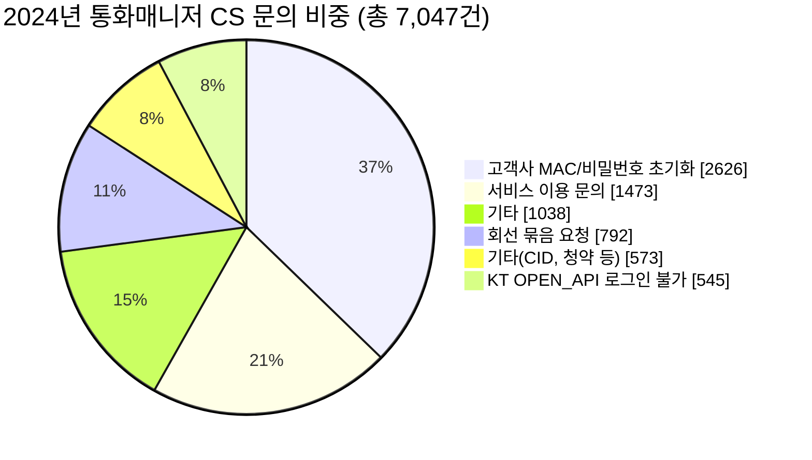

| 문의 유형                  |      건수 |       비중 | 고객이 원하는 결과             | AI Service Agent 적용 방식                          |
| -------------------------- | --------: | ---------: | ------------------------------ | --------------------------------------------------- |
| 고객사 MAC/비밀번호 초기화 |     2,626 |  **37.3%** | 접속을 즉시 복구               | 본인·권한 확인 후 표준 절차 안내 또는 승인 API 실행 |
| 서비스 이용 문의           |     1,473 |  **20.9%** | 기능과 화면 경로 이해          | 매뉴얼 근거 답변, 메뉴 경로와 다음 행동 안내        |
| 회선 묶음 요청             |       792 |  **11.2%** | 여러 회선을 정형 규칙으로 구성 | 대상·영향 범위 확인 후 API 실행, 결과 검증          |
| KT OPEN_API 로그인 불가    |       545 |   **7.7%** | 장애 여부와 조치 판단          | 상태 조회, 표준 조치, 기술 지원 이관                |
| 기타                       |     1,038 |      14.7% | 유형별 상이                    | 반복성·난이도·리스크를 기준으로 후속 발굴           |
| 기타(CID, 청약 등)         |       573 |       8.1% | 유형별 상이                    | 정책·업무 규칙 확정 후 후보 재평가                  |
| **합계**                   | **7,047** | **100.0%** |                                |                                                     |

| 자동화 우선 후보군 | 대상 문의                              |      합계 | 전체 비중 | 적용 원칙                                  |
| ------------------ | -------------------------------------- | --------: | --------: | ------------------------------------------ |
| 즉시 안내·처리     | MAC/비밀번호 초기화 + 서비스 이용 문의 |     4,099 | **58.2%** | 권한 확인 후 안내 또는 허용된 실행         |
| 정형 실행          | 회선 묶음 요청                         |       792 | **11.2%** | 대상·영향 범위·최종 승인을 명시적으로 확인 |
| 1차 진단           | KT OPEN_API 로그인 불가                |       545 |  **7.7%** | 상태 확인 후 표준 조치 또는 이관           |
| **후보 합계**      | 위 4개 유형                            | **5,436** | **77.1%** | API와 정책이 준비된 업무부터 순차 적용     |

### 1.2 기존 운영 모델의 한계

반복 요청은 답변만으로 끝나지 않는다. 고객은 "비밀번호를 초기화해 달라", "이 회선을 그룹에 넣어 달라"처럼 **현재 상태의 확인과 실제 처리**를 원한다. FAQ 또는 규칙 기반 챗봇만으로는 최종 업무를 해결하지 못해 상담원 연결로 되돌아가며, 고객 경험과 상담원 생산성이 함께 저하된다.

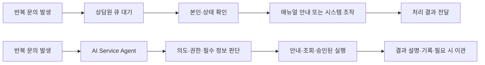

목표는 상담원을 제거하는 것이 아니다. 단순하고 규칙화 가능한 업무를 고객 셀프서비스로 전환해 상담원은 예외 처리, 장애 분석, 계약·정책 판단처럼 사람의 판단이 필요한 업무에 집중하게 한다.

---

## 2. 목표 고객 경험과 우선 업무

### 2.1 대표 테넌트 여정

통화매니저를 사용하는 고객사 관리자는 자기 서비스 번호로 전화하거나 문자한다. AI는 해당 테넌트의 매뉴얼, 현재 권한, 등록된 API와 정책만 사용해 응답한다. 고객은 별도 포털 탐색이나 상담원 대기 없이 필요한 작업을 끝낼 수 있고, 위험하거나 불명확한 요청은 즉시 사람에게 넘긴다.

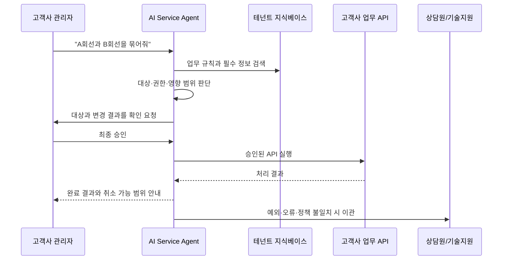

### 2.2 우선순위 시나리오

| 우선순위 | 시나리오             | 대화 완결 범위                                  | 운영상 핵심 통제                          |
| -------: | -------------------- | ----------------------------------------------- | ----------------------------------------- |
|        1 | MAC/비밀번호 초기화  | 본인 확인, 초기화 절차 또는 API 실행, 결과 안내 | 인증 정책, 민감 정보 마스킹, 감사 이력    |
|        2 | 서비스 이용 안내     | 기능 설명, 화면 경로, 단계별 사용법             | 테넌트별 최신 매뉴얼, 근거 문서 연결      |
|        3 | 회선 묶음            | 대상 조회, 중복·영향 점검, 승인 후 실행         | 대상 목록 재확인, 변경 전 상태 보관, Undo |
|        4 | OPEN_API 로그인 불가 | 서비스 상태, 계정·설정 점검, 표준 조치          | 장애 판단 기준, 기술 지원 이관 기준       |
|        5 | 통화 이력·통계 질의  | 기간·조건 수집, 구조화 조회, 요약               | 테넌트 범위 강제, 개인정보 최소 노출      |

### 2.3 대표 시나리오 A - MAC/비밀번호 초기화

| 단계 | 고객 발화와 시스템 행동                                 | 통제 포인트                      |
| ---- | ------------------------------------------------------- | -------------------------------- |
| 1    | "새 PC에서 로그인이 안 돼요"                            | 문의 유형과 테넌트 식별          |
| 2    | AI가 계정·기기·권한 확인에 필요한 최소 정보를 질문      | 인증 완료 전 민감 작업 금지      |
| 3    | 등록된 절차를 안내하거나 승인된 초기화 API 후보를 준비  | 허용된 API만 후보화              |
| 4    | 변경 대상과 결과를 다시 읽어 주고 최종 승인을 받음      | 명시적 확인 없이는 실행하지 않음 |
| 5    | 초기화 결과, 후속 로그인 방법, 실패 시 담당 채널을 안내 | 실행 로그와 감사 이력 저장       |

### 2.4 대표 시나리오 B - 회선 묶음 요청

회선 묶음은 정형 업무지만 다른 회선에 영향을 줄 수 있으므로, AI가 한 번의 명령으로 즉시 변경하지 않는다. 대상 회선, 기존 그룹, 예상 변경 결과를 먼저 조회하고 사용자의 최종 승인을 받은 뒤에만 실행한다. 변경 가능 API와 되돌리기 경로가 없는 경우에는 상담원 또는 운영자 승인 흐름으로 넘긴다.

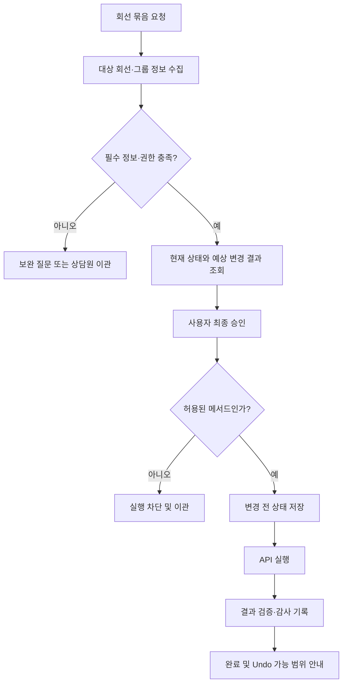

---

## 3. 기존 AICC와의 차별성

### 3.1 비교 관점

기존 구축형 AICC는 업무를 사람이 해석하고, 인텐트·슬롯·분기 시나리오로 미리 고정하는 데 강점이 있다. 반면 AI Service Agent는 매뉴얼을 설명 지식으로, OpenAPI를 실행 계약으로 관리해 운영자가 서비스별 데이터를 등록하고 정책을 통제하는 모델을 지향한다. 이 방식은 기존 AICC를 대체한다기보다, 반복 셀프서비스 업무를 빠르게 흡수하는 실행 레이어다.

| 비교 항목   | 기존 구축형 AICC                            | AI Service Agent                                    |
| ----------- | ------------------------------------------- | --------------------------------------------------- |
| 구축 출발점 | 전문가가 업무별 시나리오·인텐트·슬롯을 설계 | 매뉴얼과 OpenAPI 명세를 등록하고 정책을 구성        |
| 지식 변경   | 시나리오 수정·테스트·배포가 수반될 수 있음  | 문서 수정·재색인으로 반영, 운영 검토 필요           |
| API 연동    | 서비스별 인터페이스 분석과 개발이 주로 필요 | OpenAPI Operation에서 동적 Tool 후보를 구성         |
| 실행 범위   | 안내·분기 또는 사전 정의된 업무 중심        | 조회, 승인된 변경, 실행 이력·Undo까지 확장          |
| 확장 단위   | 고객사별 구축 프로젝트가 누적               | 공통 엔진 재사용, 테넌트별 지식·API·권한 분리       |
| 운영 책임   | 시나리오 전문가 중심                        | 서비스 오너의 지식·정책 관리와 개발의 API 보장 협업 |

### 3.2 과장하지 않는 적용 조건

문서와 OpenAPI만으로 모든 연동이 자동 완성되는 것은 아니다. 안정적 운영에는 API base URL, 인증 방식, 요청·응답 스키마, 업무 규칙, 승인 대상, 오류·Undo 경로를 서비스 오너와 합의해야 한다. 특히 결제, 계약, 대량 변경, 개인정보 처리처럼 피해 범위가 큰 업무는 자동 실행 대상에서 제외하거나 별도 승인 절차를 둔다.

---

## 4. 핵심 기능 소개 - 판단, 근거 탐색, 안전한 실행

AI Service Agent의 핵심 기능은 세 가지다. **IntelliDecision**이 무엇을 해야 하는지 판단하고, **N-hop RAG**가 답변과 행동의 근거를 연결하며, **Dynamic Tool Wrapper**가 승인된 외부 API를 실제 업무 실행으로 바꾼다. 세 기능은 순차 기능이 아니라 하나의 고객 요청을 함께 처리하는 역할 분담 구조다.

| 핵심 기능                | 입력                                   | 기능이 하는 일                               | 고객에게 보이는 결과             | 운영 통제                                  |
| ------------------------ | -------------------------------------- | -------------------------------------------- | -------------------------------- | ------------------------------------------ |
| **IntelliDecision**      | 자연어 요청과 대화 맥락                | 요청 목적·위험도·다음 행동을 판단            | 안내, 추가 질문, 실행 제안, 이관 | 유형별 정책, 맥락 유지, 명시적 확인        |
| **N-hop RAG**            | 매뉴얼, FAQ, OpenAPI, 화면·도메인 관계 | 관련 문서에서 화면·정책까지 근거를 확장      | 근거 있는 사용법과 다음 단계     | 테넌트 owner 범위, 출처·관계 추적          |
| **Dynamic Tool Wrapper** | OpenAPI 명세, 인증, 승인 정책          | API 계약을 동적 Tool로 변환해 조회·변경 실행 | 확인 후 처리 완료와 결과 안내    | allowlist, 사전 상태, 감사, 원격 상태 검증 |

### 4.1 세 기능 결합 Flow - 통화매니저 관리자 요청

다음은 고객사 관리자가 "착신전환은 어디서 설정해?"라고 질문한 뒤 "그럼 설정해줘"라고 요청하는 하나의 흐름이다. 첫 질문에서는 N-hop RAG가 정확한 화면 경로와 조건을 찾고, 두 번째 요청에서는 IntelliDecision이 안내에서 실행으로 목적이 바뀐 것을 판단한다. Dynamic Tool Wrapper는 승인된 API가 있을 때만 실제 변경을 준비한다.

```mermaid
flowchart LR
    U["관리자: 착신전환은 어디서 설정해?"] --> I["① IntelliDecision\n탐색 요청으로 판단"]
    I --> R["② N-hop RAG\n매뉴얼 -> 설정 도메인 -> 화면\n-> 허용 정책 관계 탐색"]
    R --> G["AI: 설정 메뉴 -> 통화 제어에서\n현재 규칙을 확인할 수 있습니다.\n설정을 도와드릴까요?"]
    G --> U2["관리자: 네, 새 번호로 설정해줘"]
    U2 --> I2["① IntelliDecision\n실행 요청으로 재판단"]
    I2 --> T["③ Dynamic Tool Wrapper\nOpenAPI Tool 후보 및 승인 정책 확인"]
    T --> C["대상 번호·영향 범위 재확인\n관리자 최종 승인"]
    C --> E["승인된 REST API 실행\n원격 상태 검증·감사·Undo"]
    E --> O["AI: 착신전환을 설정했습니다.\n취소 가능한 범위를 안내합니다."]

    classDef core fill:#DDEBFF,stroke:#2563A8,stroke-width:2px,color:#111827;
    class I,I2,R,T core;
```

이 흐름의 핵심은 AI가 첫 질문에 곧바로 API를 호출하지 않는다는 점이다. **설명 요청은 근거를 찾아 안내하고, 실행 요청은 다시 판단한 뒤 사용자 승인과 정책 검사를 거친다.** API가 없거나 권한·업무 규칙이 맞지 않으면 실행 대신 정확한 안내 또는 상담원 이관으로 끝난다.

### 4.2 IntelliDecision - 대화의 목적과 다음 행동을 결정

IntelliDecision은 발화에 라벨 하나를 붙이는 분류기가 아니다. 사용자의 목적, 이전 대화, 필요한 정보, 실행 위험도, 다음 행동을 함께 판단하는 **Dynamic Intent Orchestration / Autonomous Task Planning** 계층이다. 사용자가 설명을 듣다가 실행을 요청하거나, 실행 직전에 값을 정정하거나, 완료 후 취소를 요청해도 같은 세션 맥락에서 다음 경로를 다시 선택한다.

| 유형                     | 사용자의 의도                        | IntelliDecision의 처리                          |
| ------------------------ | ------------------------------------ | ----------------------------------------------- |
| A. 탐색                  | 기능·방법을 알고 싶음                | N-hop RAG로 매뉴얼과 화면 경로를 근거로 안내    |
| B. 실행                  | 상태 조회 또는 실제 변경을 원함      | 필수 정보·권한·승인 확인 후 Tool 실행 준비      |
| C. 포괄 도움             | 가능한 업무가 무엇인지 알고 싶음     | 여러 도메인을 함께 탐색해 지원 범위를 설명      |
| D/F. 정정·모호성         | 앞선 입력이 틀리거나 요청이 불충분함 | 이전 맥락을 수정하고 필요한 값만 다시 질문      |
| E. 실행 취소             | 직전 변경을 되돌리고 싶음            | 실행 이력·사전 상태를 확인해 가능한 Undo 수행   |
| G/H/I. 일괄·범위 외·반복 | 다수 대상 처리, 지원 밖 요청, 재설명 | 영향 범위 확인, 이관, 이전 결과의 맥락별 재표현 |

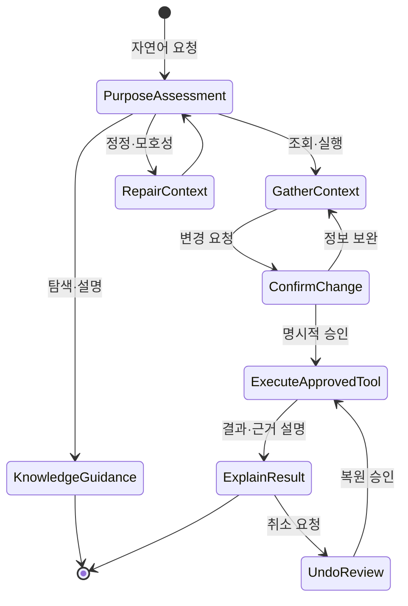

**시장 사례 1 - Anthropic Routing.** Anthropic은 고객 문의를 일반 질문, 환불 요청, 기술 지원처럼 분류한 뒤 각각의 전문 프롬프트·후속 프로세스·도구로 보내는 Routing 워크플로를 제시한다. 한 유형의 문의에 맞춘 처리 규칙이 다른 문의의 성능을 해치지 않도록 관심사를 분리하는 것이 목적이다. 우리 시스템은 이 구조를 A-I 유형 정책으로 구체화한다. 즉, 사용법 질문은 지식 탐색으로, 설정 변경 요청은 승인된 Tool 준비로, 불명확한 요청은 보완 질문으로 보낸다.

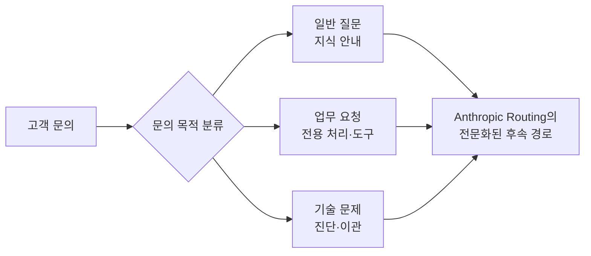

**시장 사례 2 - Google Dialogflow CX.** Dialogflow CX는 대화 주제를 Flow로, 현재 단계와 수집해야 할 정보를 Page로, 사용자 발화 또는 세션 조건에 따른 이동을 Route로 관리한다. 예를 들어 주문·고객 정보·최종 확인을 별도 Page로 두고, 사용자가 필요한 정보를 주면 다음 Page로 이동시키며, 조건이 바뀌면 다른 Route로 전환한다. 우리 시스템은 고정된 화면 설계 도구 대신 대화 실행 시 IntelliDecision으로 이 역할을 수행한다. 따라서 "어디서 설정해?"에서 "설정해줘"로 바뀌는 요청을 새 대화로 끊지 않고, 탐색에서 실행으로 자연스럽게 전환한다.

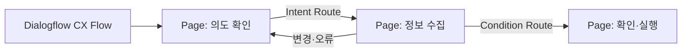

현재 시스템에서는 `intellidecision_policy.py`가 A-I 유형, 대표 발화, RAG 필요 여부, Tool 필요 여부를 정책 레지스트리로 관리한다. 이 정책은 단순 분류 결과가 아니라 다음 단계의 RAG 범위·질문·실행 경로를 결정하는 기준이다.

### 4.3 N-hop RAG - 문서 답변을 업무 행동의 근거로 확장

일반 RAG는 질문과 의미가 가까운 문서 조각을 찾는다. N-hop RAG는 여기서 한 단계 더 나아가, 찾은 문서가 어떤 업무 도메인과 연결되고, 사용자가 어느 화면을 봐야 하며, 해당 업무가 안내만 가능한지 실행도 가능한지까지 **관계 경로를 따라 확인**한다. 따라서 고객은 "매뉴얼의 한 문단"이 아니라 자신의 다음 행동에 필요한 안내를 받는다.

#### 지식베이스 구성과 관계 데이터

테넌트별 지식베이스에는 아래 데이터가 함께 들어간다. 매뉴얼·FAQ·OpenAPI는 업로드 문서로 분리 관리되고, 설정 카탈로그와 화면 안내는 공통 구조 정보로 유지한다. 모든 검색과 관계 조회는 테넌트 `owner` 범위 안에서 수행한다.

| 데이터                 | 예시                                        | N-hop에서 하는 역할                   | 현재 상태 |
| ---------------------- | ------------------------------------------- | ------------------------------------- | --------- |
| 매뉴얼·FAQ             | "착신전환 설정 방법", 정책·주의사항         | 질문과 가장 가까운 최초 근거          | 실제 사용 |
| OpenAPI 문서           | 착신 규칙 조회·변경 endpoint, 필수 파라미터 | 실행 가능한 업무와 입력 조건의 근거   | 실제 사용 |
| 업무·설정 도메인       | `call-control`, `chat-relay`                | 문서와 화면·정책을 연결하는 중심 노드 | 실제 사용 |
| 화면 안내              | 설정 메뉴와 탭, 사용자가 보는 경로          | 자연어 답변을 실제 조작 위치로 변환   | 실제 사용 |
| IntelliDecision 정책   | 탐색·실행·정정·Undo 가능 여부               | 질문 유형에 맞는 다음 행동을 제한     | 실제 사용 |
| API endpoint·절차 단계 | endpoint 간 의존성, 복합 절차               | 더 세밀한 실행 관계 표현              | 확장 예약 |

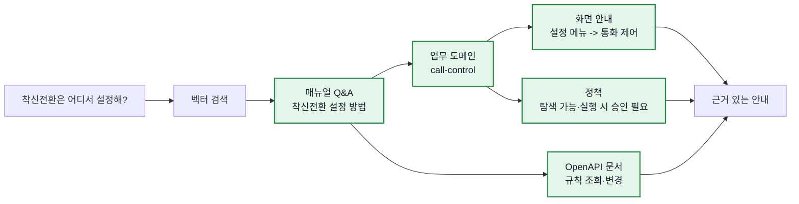

#### 검색부터 응답까지의 예시

관리자가 "착신전환은 어디서 설정해?"라고 물으면, 먼저 매뉴얼과 업로드 문서에서 관련 내용을 찾는다. 그 결과가 `call-control` 도메인과 연결되면 화면 안내를 따라 "설정 메뉴 → 통화 제어"를 알려 준다. 같은 도메인에 변경 API와 승인 정책이 등록돼 있다면, AI는 이를 실행 가능한 업무로 인식하되 아직 실행하지 않고 "원하시면 현재 규칙을 확인하거나 새 번호로 설정해 드릴까요?"라고 다음 선택지를 제시한다. 사용자가 실행을 명시적으로 요청한 뒤에만 Dynamic Tool Wrapper 단계로 넘어간다.

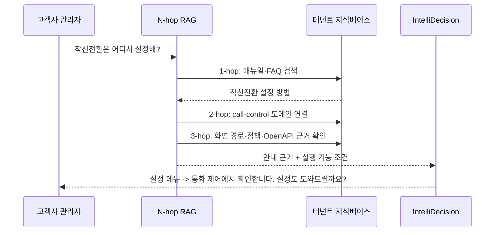

**시장 사례 1 - Glean.** Glean은 엔터프라이즈 검색에서 지식 그래프와 벡터 검색을 함께 사용한다. 벡터 검색이 문서 내용의 의미적 유사성을 찾으면, 지식 그래프는 문서가 어떤 서비스·팀·운영 절차와 연결되는지 보여 준다. 예를 들어 장애 문서를 제시할 때 "이 장애는 이 서비스와 연결되고, 그 서비스의 담당 팀과 운영 매뉴얼은 이것"이라는 식으로 결과가 나온 근거와 다음 행동을 함께 제시한다. 우리 N-hop RAG도 동일하게 문서 검색 결과를 업무 도메인·화면·정책으로 연결해 설명 가능성을 높인다.

**시장 사례 2 - Microsoft GraphRAG.** GraphRAG는 단순 검색이 흩어진 정보의 연결을 놓치는 문제를 해결하기 위해, 특정 대상 질문에는 주변 노드로 퍼져 나가는 Local Search를, 전체 현황 질문에는 요약을 활용하는 Global Search를 구분한다. 예를 들어 특정 서비스 장애 원인은 해당 서비스와 이웃 관계의 문서·개념을 따라가며 확인하고, "조직 전체에서 반복되는 문제는 무엇인가" 같은 질문은 전체 요약을 사용한다. 우리 시스템은 대규모 자동 엔터티 추출·커뮤니티 클러스터링까지 도입하지 않고, 운영 도메인에 이미 정의된 관계를 경량화해 쓴다. 특정 기능 질문은 도메인 주변을 탐색하고, "무엇을 할 수 있어?" 같은 포괄 도움 요청은 여러 도메인을 병렬 조회한다.

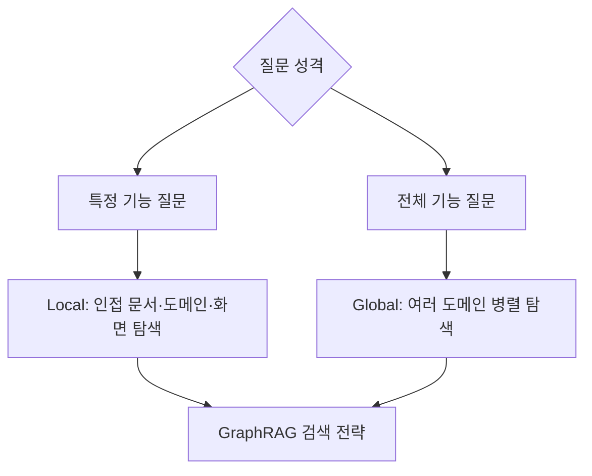

현재 `knowledge_graph.traverse_graph()`는 문서·도메인·화면·IntelliDecision 유형 간 관계를 순회하고, 유형 C의 포괄 도움 요청에는 다중 도메인 검색을 병렬 실행한다. Full GraphRAG의 자동 엔터티 추출은 현재 운영 규모에 비해 과도해 채택하지 않았으며, endpoint·procedure 단계 관계는 후속 확장 대상으로 남겨 두었다.

### 4.4 Dynamic Tool Wrapper - OpenAPI를 안전한 AI 실행 도구로 변환

Dynamic Tool Wrapper는 기존 REST API를 위해 서비스별 백엔드 중계 코드를 새로 작성하는 대신, **OpenAPI 명세를 읽어 AI가 이해할 수 있는 Tool 후보로 변환**하는 zero-code REST API Adapter다. 운영자는 서비스의 기존 API를 바꾸지 않고 명세, 접속 주소, 인증 방식, 승인 정책을 등록한다. 시스템은 endpoint·HTTP method·path/query/body 파라미터·요청 본문을 분석해 필요한 Tool 설명과 실행 컨텍스트를 만든다.

이는 “명세만 붙여 넣으면 아무 API나 즉시 실행한다”는 의미가 아니다. 지식 안내는 매뉴얼만으로 가능하지만, 실제 API 실행에는 base URL, 인증, 정확한 OpenAPI 계약, 허용 메서드, 업무 규칙, 원격 상태 검증과 Undo 가능 여부가 필요하다. 이 조건을 갖춘 표준 REST API에서는 개별 업무마다 새로운 Agent Builder 시나리오와 중계 코드를 작성하는 부담을 크게 줄인다.

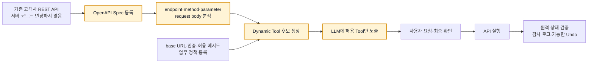

| OpenAPI·운영 입력                   | Tool 변환과 실행에 쓰이는 방식                |
| ----------------------------------- | --------------------------------------------- |
| `servers` 또는 관리자 지정 base URL | 실제 API 호출 목적지 구성                     |
| 인증 헤더 이름·값                   | 테넌트별 인증 컨텍스트 구성                   |
| path/query/body 스키마              | Tool 설명, 필수 값 수집, 파라미터 검증에 반영 |
| HTTP method                         | 조회와 변경 요청의 위험도를 구분              |
| 승인 메서드 목록                    | 미승인 쓰기 Tool은 모델에 노출하지 않음       |
| 변경 전 조회 경로                   | 사전 상태 스냅샷, 결과 대조, Undo 가능성 판단 |

**시장 사례 1 - OpenAI GPT Actions.** OpenAI는 GPT Actions에서 개발자가 API 스키마와 인증을 등록하면 ChatGPT가 자연어를 API 호출에 필요한 JSON 스키마로 연결하는 방식을 제공한다. 공식 예시에서는 weather.gov의 위치 조회 API와 예보 API 두 개를 등록한 뒤, 사용자의 "이번 주말 워싱턴 DC 여행에 뭘 챙겨야 해?"라는 질문에 ChatGPT가 위치를 찾고 예보를 조회해 짐 목록을 답한다. 핵심은 weather.gov 서버를 수정하거나 질문별 중계 코드를 만들지 않고, OpenAPI 계약을 자연어와 API 사이의 연결 규칙으로 사용한다는 점이다.

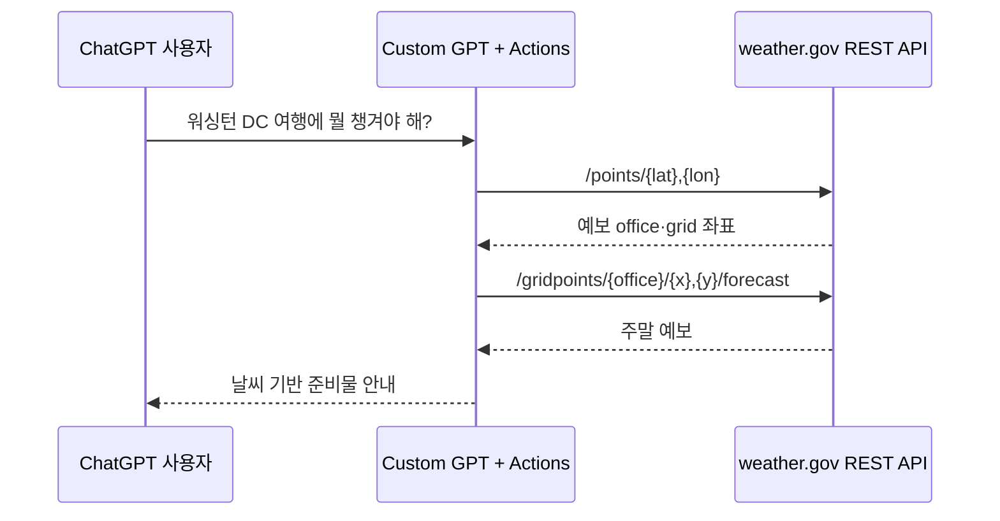

우리 시스템은 이 패턴을 전화·문자 기반 관리 업무에 적용한다. 차이는 GPT Actions가 Custom GPT에 명세를 정적으로 등록하는 중심이라면, 우리는 테넌트가 업로드한 OpenAPI에서 동적 Tool 후보를 만들고 테넌트별 승인 정책을 함께 적용한다는 점이다.

**시장 사례 2 - Composio.** Composio는 Gmail, Slack, GitHub, Notion, Stripe, Sentry, Linear 등 1,000개 이상의 서비스 통합을 미리 Tool로 정규화하고, 위임 인증과 실행 환경을 제공한다. 대표 흐름은 "Sentry 오류를 확인하고 Linear 이슈를 만들어줘"라는 한 문장을 Sentry 조회 Tool과 Linear 생성 Tool의 연속 실행으로 바꾸는 방식이다. 사용자가 각 서비스의 API 세부 형식을 알 필요 없이 의도만 말하면, 플랫폼이 적합한 Tool과 인증을 연결한다.

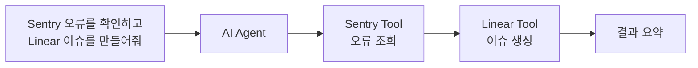

Composio가 사전에 통합한 SaaS 카탈로그를 제공하는 모델이라면, Dynamic Tool Wrapper는 처음 보는 고객사·사내 시스템도 OpenAPI 명세와 운영 정책을 등록해 AI 실행 채널에 연결하는 모델이다. 두 사례 모두 자연어 의도와 API 계약을 Tool 계층으로 분리하지만, 우리는 테넌트 격리와 승인된 메서드만 노출하는 정책을 기본값으로 둔다.

현재 `build_dynamic_tools_for_owner(owner)`는 테넌트별 OpenAPI 문서에서 동적 Tool을 만들고, GET은 조회용으로 노출하며 쓰기 method는 `approved_methods`에 있을 때만 노출한다. `dynamic_api_tool.py`는 실행 전 승인 검사와 가능한 사전 상태 저장, HTTP 실행, 실행 로그 기록, 원격 상태 대조 및 Undo 경로를 담당한다.

### 4.5 MCP는 세 기능의 외부 확장 채널

MCP(Model Context Protocol)는 네 번째 핵심 기능이 아니라 Dynamic Tool Wrapper가 만든 실행 능력을 외부 AI 클라이언트에도 재사용하는 확장 채널이다. MCP Gateway는 같은 동적 Tool과 테넌트·승인·감사·Undo 정책을 Claude Desktop, VS Code Copilot 같은 MCP 클라이언트에 노출한다.

| 관점      | MCP Gateway                                | Dynamic Tool Wrapper                   |
| --------- | ------------------------------------------ | -------------------------------------- |
| 출발점    | 외부 AI 클라이언트에 Tool 제공             | 기존 REST API를 AI 실행 Tool로 변환    |
| 구현 방식 | FastMCP Adapter가 기존 Dynamic Tool을 감쌈 | OpenAPI 명세와 운영 정책으로 Tool 생성 |
| 공통 기반 | owner 범위, 승인, 감사, Undo 재사용        | owner 범위, 승인, 감사, Undo 재사용    |

---

---

## 5. 안전·운영 설계

### 5.1 다중 테넌트 분리

공통 AI 엔진을 공유하되, 지식·API·인증·실행 이력·권한은 테넌트 식별자(`owner`) 기준으로 분리한다. 모든 검색과 API 실행 컨텍스트에 owner를 강제해 다른 고객사의 문서나 도구가 응답 경로에 섞이지 않도록 설계한다.

| 계층              | 공통 플랫폼                             | 테넌트별 데이터·정책               |
| ----------------- | --------------------------------------- | ---------------------------------- |
| 통신              | SIP 음성, SIP MESSAGE, REST/MCP Gateway | 대표번호, 채널 허용 정책           |
| AI 오케스트레이션 | LangGraph, IntelliDecision, LLM 연결    | 업무 문맥, 맞춤 프롬프트           |
| 지식              | ChromaDB 검색 엔진, 관계 그래프         | 매뉴얼, FAQ, 절차, OpenAPI 문서    |
| 실행              | Dynamic Tool Wrapper, 실행 정책 엔진    | base URL, 인증, 승인 메서드        |
| 감사              | 공통 실행·변경 이력 구조                | owner 스코프 실행 결과와 복원 정보 |

### 5.2 변경 작업 통제 모델

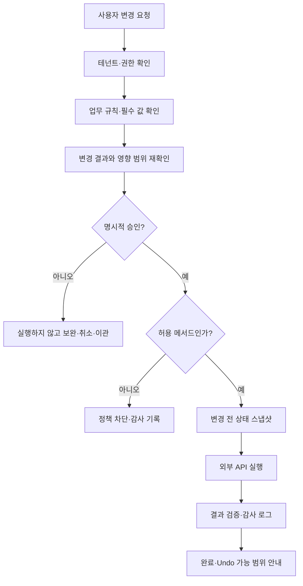

| 통제 장치        | 목적                             | 운영 원칙                                 |
| ---------------- | -------------------------------- | ----------------------------------------- |
| allowlist        | 승인되지 않은 쓰기 API 차단      | 기본 거부, 명시적 승인 후 노출            |
| 사용자 재확인    | 자연어 오해와 오조작 감소        | 변경 대상·결과를 읽어 준 뒤 실행          |
| pre-state 스냅샷 | Undo와 사후 검증                 | 가능한 경우 변경 전 조회 결과를 저장      |
| 실행 감사 로그   | 추적성과 운영 분석               | 요청·도구·결과·시간·테넌트를 기록         |
| 업무 규칙 검증   | 기술적으로 가능한 위험 작업 방지 | 매뉴얼 정책과 충돌하면 이관 또는 차단     |
| 실패·예외 이관   | 무리한 자동화 방지               | API 오류·권한 부족·모호성은 사람에게 연결 |

Undo는 모든 API에 자동으로 보장되는 기능이 아니다. 대상 API가 복원 가능한 상태를 제공하고, 복원에 필요한 PUT 또는 동등한 메서드가 승인돼야 한다. Undo 불가능한 변경은 사전에 명확히 고지하고 자동 실행 범위에서 제외한다.

### 5.3 참조 아키텍처

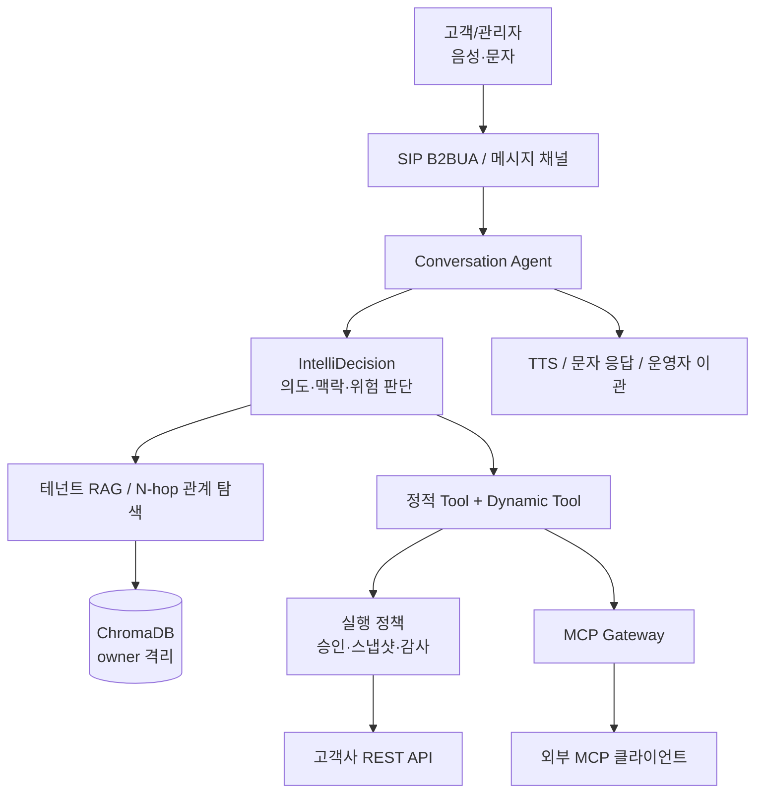

---

## 6. 도입 모델과 책임 분담

### 6.1 테넌트 온보딩 입력·출력

| 단계         | 서비스 오너 입력                     | 플랫폼 처리                       | 산출물              |
| ------------ | ------------------------------------ | --------------------------------- | ------------------- |
| 1. 업무 선정 | 자동화할 문의, 제외 업무, 이관 기준  | 리스크·빈도·API 준비도 평가       | 우선순위 백로그     |
| 2. 지식 등록 | 매뉴얼, FAQ, 운영 절차, 정책         | 문서 파싱·색인·도메인 연결        | 테넌트 지식베이스   |
| 3. API 등록  | OpenAPI, base URL, 인증, 테스트 환경 | endpoint 메타 보존·Tool 후보 생성 | 조회/변경 Tool 후보 |
| 4. 실행 승인 | 허용 메서드, 승인 대상, Undo 정책    | allowlist와 실행 정책 적용        | 실행 가능 범위      |
| 5. 검증      | 대표 발화, 정상·오류·취소 케이스     | 응답·Tool trace·원격 상태 대조    | 파일럿 승인 근거    |
| 6. 운영      | 지식 최신화, 정책 변경, KPI 검토     | 감사·품질 데이터 제공             | 확장 또는 개선 계획 |

### 6.2 역할 분담

| 역할          | 주요 책임                                          |
| ------------- | -------------------------------------------------- |
| 사업/CS       | 상위 문의 선정, 고객 경험 기준, 이관·성과 KPI 정의 |
| 서비스 오너   | 업무 규칙, 최신 매뉴얼, API 의미와 허용 범위 책임  |
| 보안/운영     | 인증, 권한, 개인정보, 감사 보존 정책 승인          |
| 개발/플랫폼   | API 어댑터, 실행 정책, 관측성, 장애 대응 체계 제공 |
| 고객사 관리자 | 테넌트 문서·API 등록, 실행 승인, 결과 검토         |

---

## 7. 성과 측정과 단계별 로드맵

### 7.1 KPI 체계

후보 비중 77.1%는 사업 기회 규모다. 실제 성과는 파일럿에서 아래 KPI로 검증한다.

| KPI            | 정의                                                | 해석 시 유의점                                     |
| -------------- | --------------------------------------------------- | -------------------------------------------------- |
| 셀프 해결률    | AI 세션 중 상담원 이관 없이 완료된 비율             | 단순 종료를 해결로 오인하지 않도록 결과 확인 필요  |
| 인입 감소율    | 동일 유형의 상담원 인입 건수 감소율                 | 계절성·고객 수 변화를 보정해 비교                  |
| 실행 성공률    | 승인된 API 실행 중 원격 시스템에서 완료 확인된 비율 | AI 응답 문구가 아니라 원격 상태를 기준으로 측정    |
| 이관율         | 사람에게 넘긴 비율과 사유                           | 위험 회피가 필요한 업무에서는 낮음만이 정답이 아님 |
| 재문의율       | 동일 문제의 재접수 비율                             | 안내 품질·실행 정확도·UI 경로 품질을 함께 반영     |
| Undo·취소율    | 변경 후 복원 요청 비율                              | 정책·확인 문구·대상 식별 품질의 선행 지표          |
| 평균 처리 시간 | 문의 시작부터 해결·이관까지의 시간                  | 음성 채널에서는 지연과 함께 관리                   |

### 7.2 권장 로드맵

| 단계           | 기간      | 범위                                     | 성공 기준                                  |
| -------------- | --------- | ---------------------------------------- | ------------------------------------------ |
| 0. 준비        | 2주       | 상위 4개 문의, API·보안·Undo 가능성 확인 | 업무별 자동화/이관 경계 확정               |
| 1. 안내 파일럿 | 2주       | MAC/비밀번호 절차, 서비스 이용 문의      | 근거 기반 응답 품질과 재문의율 기준선 확보 |
| 2. 조회·진단   | 2주       | 로그인 장애 상태 조회, 통계·이력 질의    | 권한 격리와 원격 상태 대조 통과            |
| 3. 제한 실행   | 2주       | 회선 묶음 등 저위험 정형 변경            | 승인·감사·Undo·실행 성공률 검증            |
| 4. 확장        | 분기 단위 | 기타 반복 문의와 외부 MCP 채널           | KPI 기준 충족 업무만 확대                  |

### 7.3 파일럿 게이트

1. 모든 쓰기 API는 서비스 오너 승인 메서드에만 한정한다.
2. 정상·실패·권한 부족·사용자 취소·Undo 케이스를 원격 시스템 상태까지 검증한다.
3. 테넌트 간 지식과 API가 교차 노출되지 않는지 확인한다.
4. KPI가 개선되지 않은 업무는 프롬프트 보강보다 업무 규칙·API 계약·지식 품질을 먼저 재점검한다.

---

## 8. 상세 부록

### 부록 A. 실제 구현 범위

| 영역           | 구현된 핵심 범위                                               |
| -------------- | -------------------------------------------------------------- |
| 채널           | SIP 음성, SIP MESSAGE, REST API, MCP Gateway                   |
| 오케스트레이션 | LangGraph 기반 대화 흐름, IntelliDecision 유형 A-I             |
| 지식           | Markdown/PDF/OpenAPI 문서 업로드, owner 스코프 검색, 문서 CRUD |
| 관계 탐색      | 문서·도메인·화면·의도 유형을 잇는 n-hop 그래프                 |
| 실행           | OpenAPI endpoint 메타 보존, 동적 Tool 생성, 승인 메서드 노출   |
| 안전           | owner 강제, 변경 전 스냅샷, 실행 로그, 범용 Undo 경로          |
| 투명성         | 지식 인벤토리, 의사결정 정책·세션 흐름, RAG/hop 근거 조회      |

### 부록 B. API 실행 검증 원칙

외부 API 연동은 모델이 답변을 생성했다는 사실만으로 완료로 보지 않는다. 다음 세 가지를 함께 확인한다.

1. AI 실행 로그에 선택된 Tool, 파라미터, 정책 판정이 남아 있는가.
2. 원격 API 서버의 요청·응답과 상태 변경이 기대값과 일치하는가.
3. 사용자에게 전달한 완료 메시지가 실제 원격 상태와 일치하는가.

특히 쓰기 작업은 오류 응답, 잘못된 ID, 미승인 메서드, 정책상 금지된 변경, Undo 불가 API를 모두 별도 케이스로 다뤄야 한다.

### 부록 C. 참고 자료

| 구분           | 자료                                                                                                                                                                                                                                   | 활용 목적                             |
| -------------- | -------------------------------------------------------------------------------------------------------------------------------------------------------------------------------------------------------------------------------------- | ------------------------------------- |
| Agent workflow | [ReAct](https://arxiv.org/abs/2210.03629), [Anthropic Building Effective Agents](https://www.anthropic.com/engineering/building-effective-agents)                                                                                      | 추론·행동·라우팅 구조                 |
| 대화·인텐트    | [Dialogflow CX](https://cloud.google.com/dialogflow/cx/docs), [Amazon Lex V2](https://docs.aws.amazon.com/lexv2/latest/dg/what-is.html), [Rasa Forms](https://rasa.com/docs/rasa/forms/)                                               | 흐름, 슬롯 수집, fallback·복구        |
| Tool calling   | [OpenAI GPT Actions](https://platform.openai.com/docs/actions), [Anthropic Tool Use](https://docs.anthropic.com/en/docs/build-with-claude/tool-use), [Gemini Function Calling](https://ai.google.dev/gemini-api/docs/function-calling) | 자연어와 API 계약 연결                |
| REST API Agent | [RestGPT](https://arxiv.org/abs/2306.06624), [Gorilla/GoEx](https://gorilla.cs.berkeley.edu/)                                                                                                                                          | 계획, API 선택, 실행과 피해 범위 제한 |
| RAG·그래프     | [Microsoft GraphRAG](https://microsoft.github.io/graphrag/), [Anthropic Contextual Retrieval](https://www.anthropic.com/news/contextual-retrieval)                                                                                     | 질문 유형별 검색·관계 탐색·검색 품질  |
| 표준 연동      | [Model Context Protocol](https://modelcontextprotocol.io/)                                                                                                                                                                             | 외부 AI 생태계 도구 노출              |

외부 자료의 상세 인용과 본 시스템에 적용하지 않은 범위는 [REFERENCE_TRACEABILITY.md](design/REFERENCE_TRACEABILITY.md)에 정리한다.

---

## 결론

AI Service Agent의 우선 과제는 "더 많은 질문에 답하는 봇"이 아니라, 반복 CS 업무를 **고객이 직접 끝낼 수 있는 안전한 실행 경험**으로 전환하는 것이다. 통화매니저 CS 7,047건 중 5,436건(77.1%)의 후보군을 시작점으로 삼되, 실제 절감 성과는 업무별 정책·API 품질·권한 통제·원격 상태 검증을 통과한 범위에서만 측정한다.

공통 AI 엔진, 테넌트별 지식과 API 계약, IntelliDecision, Dynamic Tool, MCP Gateway를 하나의 실행 정책으로 묶으면 통화매니저에서 검증한 운영 모델을 다른 REST API 기반 서비스로 확장할 수 있다. 다만 확장은 자동화율이 아니라 **안전하게 검증된 셀프 해결률**을 기준으로 진행한다.

*최종 업데이트: 2026-09-02*