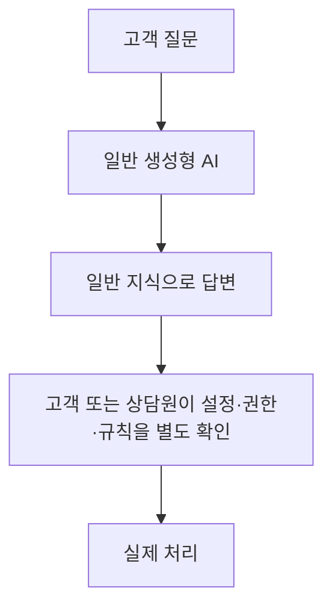
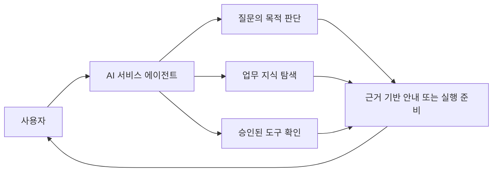
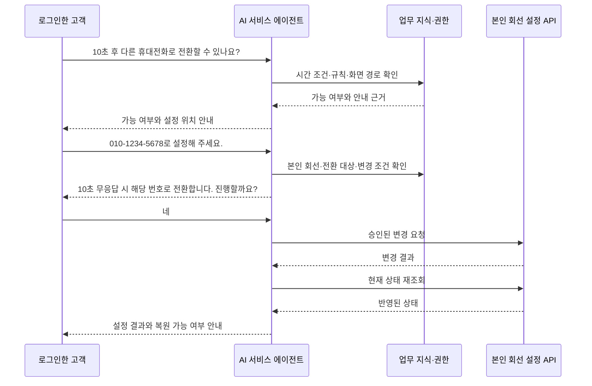
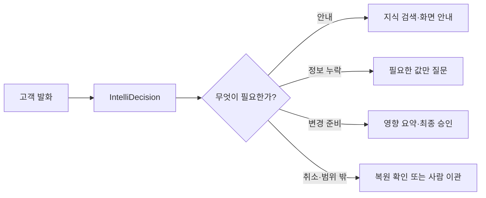
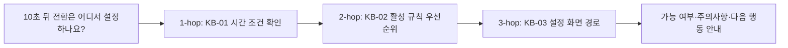
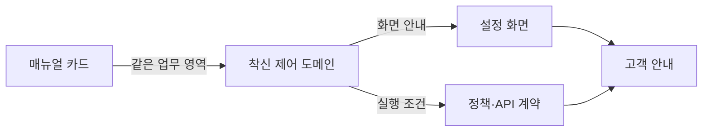
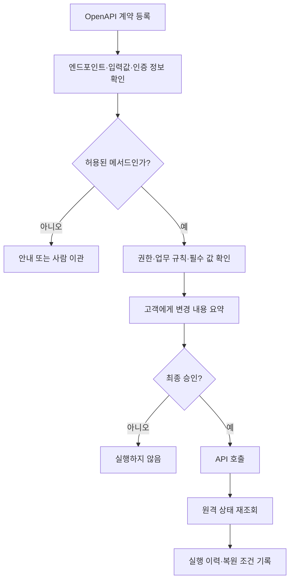
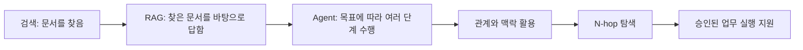
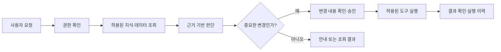

# AI 서비스 에이전트

> 질문에 답하는 AI에서, 업무를 이해하고 수행을 지원하는 AI로

- **문서 목적**: AI 서비스 에이전트 PoC의 문제, 작동 방식, 적용 경계와 다음 검증 기준을 설명한다.
- **발표 대상**: 경영진, 사업·서비스 기획자, 운영 담당자, 고객사와 협력사
- **예상 발표 시간**: 25~30분
- **작성 기준일**: 2026-09-11
- **문서 상태**: PoC 소개 및 적용 방향
- **관련 문서**: [셀프서비스 AI 아키텍처](architecture/self-service-ai-assistant-architecture.md) | [서비스 PRD](product/self-service-ai-assistant-prd.md) | [참고·백업 자료집](SELFSERVICE_AI_ASSISTANT_INTRODUCTION.md)

---

## Executive Summary

> **핵심 메시지: AI 서비스 에이전트는 고객의 질문을 안내에서 끝내지 않고, 확인 가능한 업무 지식과 승인된 시스템 기능을 연결해 다음 행동을 돕는다.**

고객센터에는 사용 방법을 묻는 문의와 현재 상태를 확인하거나 설정을 바꿔 달라는 요청이 함께 들어온다. 상담원은 매뉴얼, 현재 설정, 업무 규칙, 변경 권한을 각각 확인한다. 정보가 여러 곳에 흩어져 있어 답을 찾는 일보다 정보 사이의 관계를 확인하는 일이 더 오래 걸린다.

일반적인 생성형 AI는 문장을 자연스럽게 만들 수 있다. 그러나 우리 서비스의 최신 매뉴얼, 고객 본인의 권한, 기존 설정, 승인된 API까지 자동으로 알지는 못한다. 근거가 부족하면 잘못된 안내를 하거나, 반대로 실제 변경 요청을 다시 사람에게 넘길 수 있다.

AI 서비스 에이전트 PoC는 고객사별 지식 문서와 API 계약을 등록하고 세 기능을 조합한다.

| 핵심 요소            | 맡는 일                         | 착신전환 요청에서의 역할                        |
| -------------------- | ------------------------------- | ----------------------------------------------- |
| IntelliDecision      | 고객의 목적과 다음 행동을 판단  | 안내, 변경 요청, 정정, 취소를 구분              |
| N-hop RAG            | 관련 정보를 단계적으로 연결     | 시간 조건, 기존 규칙, 화면 위치를 함께 확인     |
| Dynamic Tool Wrapper | 승인된 API를 통제된 도구로 변환 | 본인 회선 변경을 승인 후 실행하고 결과를 재확인 |

대표 PoC 사례는 다음 한 문장이다.

> “제가 받지 못하는 전화가 10초 후 다른 휴대전화로 오도록 설정할 수 있나요?”

AI는 먼저 가능한지와 설정 위치를 안내한다. 고객이 설정을 요청하면 본인 회선인지, 전환 번호와 시간 조건이 있는지, 기존 규칙과 충돌하지 않는지 확인한다. 고객이 최종 승인한 경우에만 허용된 API를 호출한다. 실행 뒤에는 실제 상태를 다시 확인하고, 복원 조건이 충족될 때만 되돌리기 경로를 안내한다.

이 PoC의 목표는 AI가 많은 답변을 만드는 것이 아니다. 고객이 정확한 안내를 받고, 필요한 경우 안전하게 설정을 마칠 수 있는지 검증하는 것이다. CS 데이터의 7,047건 중 표준 절차로 안내·조회·실행 가능성을 검토할 수 있는 우선 후보는 5,436건, 77.1%로 집계됐다. 이는 절감 성과가 아니라 PoC 이후 검증 우선순위를 정하기 위한 후보군이다.

### 발표자 강조 포인트

- AI의 가치는 답변 문장에만 있지 않다.
- 77.1%는 자동화 완료율이나 예상 절감률이 아니다.
- PoC는 착신전환 한 업무에서 지식, 권한, 승인, 실행 후 확인을 끝까지 검증한다.

---

## 1. 왜 만들었는가

> **핵심 메시지: 고객센터의 병목은 정보를 한 곳에서 찾지 못하는 데서 시작한다.**

고객이 “전화를 못 받으면 다른 번호로 넘길 수 있나요?”라고 문의한다고 가정한다. 담당자는 사용 매뉴얼에서 가능한 시간 조건을 찾고, 현재 활성 규칙을 확인하고, 전환 대상이 등록돼 있는지 확인해야 한다. 변경 요청이라면 고객 본인 회선인지와 API 실행 권한도 검토해야 한다.


한 번의 문의에도 매뉴얼, 설정, 권한, 실행 결과를 차례로 확인해야 한다. 반복 설명과 단순 설정 변경에 상담원 시간이 쓰이면, 장애, 계약, 예외 처리처럼 사람이 직접 판단해야 하는 업무에 집중하기 어렵다.

| 필요한 확인      | 일반 답변형 AI의 한계            | AI 서비스 에이전트의 접근                 |
| ---------------- | -------------------------------- | ----------------------------------------- |
| 최신 사용 방법   | 학습 지식 또는 일반 문서에 의존  | 등록된 업무 지식을 먼저 검색              |
| 현재 설정        | 시스템 데이터를 직접 알기 어려움 | 승인된 조회 도구로 확인                   |
| 여러 정보의 관계 | 한 문서만 인용하고 끝날 수 있음  | 관련 규칙과 화면 안내를 단계적으로 연결   |
| 실제 변경        | 절차를 설명하고 사람에게 넘김    | 권한·승인·검증 조건이 맞을 때만 실행 지원 |
| 오류와 예외      | 그럴듯한 답을 만들 위험          | 근거 부족, 권한 부족, 고위험 요청은 이관  |

---

## 2. 기존 AI가 실제 업무에서 부족한 지점

> **핵심 메시지: 실제 업무는 질문 하나가 아니라, 확인해야 할 관계와 다음 행동의 연속이다.**



답변 뒤에 사람이 다시 정보를 찾고 변경을 수행해야 하면 고객의 업무는 끝나지 않는다.

| 사용자가 겪는 문제       | 기존 방식이 부족한 이유                          | 개선 방향                              |
| ------------------------ | ------------------------------------------------ | -------------------------------------- |
| “10초 후 전환” 가능 여부 | 매뉴얼 한 문장만 찾으면 기존 규칙을 놓칠 수 있음 | 시간 조건과 규칙 우선순위를 함께 확인  |
| 설정 화면을 모름         | 메뉴 구조와 문서가 분리돼 있음                   | 관련 화면 경로를 답변에 포함           |
| “설정해 달라”는 요청     | 답변형 AI는 실제 시스템을 바꾸지 못함            | 승인된 API만 실행 도구로 연결          |
| 이전 답을 정정           | 매 턴을 독립 질문으로 처리하기 쉬움              | 이전 대화와 변경된 값만 비교           |
| 권한 밖 변경             | 실행 범위가 불명확하면 오용 위험                 | 본인 범위, 허용 메서드, 승인 절차 적용 |

- 모든 질문에 N-hop 탐색이 필요한 것은 아니다. 단순 안내는 짧게 처리하는 편이 낫다.
- 여러 정보를 확인해야 하는 요청에서만 관계 기반 탐색과 실행 통제가 중요해진다.

---

## 3. AI 서비스 에이전트란 무엇인가

> **핵심 메시지: AI 서비스 에이전트는 업무 지식을 찾아 연결하고, 통제된 범위에서 다음 행동을 지원하는 시스템이다.**

AI 서비스 에이전트는 질문에 답하는 데서 끝나지 않는다. 고객의 목적을 파악하고, 필요한 업무 지식을 찾고, 관련 규칙을 연결한 뒤, 허용된 경우에만 업무 시스템을 조회하거나 변경 요청을 준비한다.



이번 PoC는 음성 채널의 품질이나 통화 지연 자체를 평가하지 않는다. 검증 범위는 UI 텍스트 입력, LLM 처리, UI 응답이다. 따라서 고객센터 업무를 이해하고 안내·조회·승인된 실행으로 연결하는 핵심 동작에 집중한다.

> 일반 AI가 알고 있는 내용을 말하는 AI라면, AI 서비스 에이전트는 업무에 필요한 정보를 찾아 연결하고 다음 행동을 지원하는 AI다.

---

## 4. 대표 시나리오: 10초 무응답 착신전환 요청

> **핵심 메시지: 한 번의 착신전환 요청 안에서 안내, 판단, 근거 탐색, 승인, 실행 후 확인이 차례로 일어난다.**

> “제가 받지 못하는 전화가 10초 후 다른 휴대전화로 오도록 설정할 수 있나요?”



| 카드   | 확인하는 사실                         | 이 사례에서 쓰는 시점     |
| ------ | ------------------------------------- | ------------------------- |
| KB-01  | 무응답 시간은 10·20·30초 중 선택      | “10초 후”가 가능한지 확인 |
| KB-02  | 활성 규칙은 목록 우선순위에 따라 적용 | 기존 규칙 충돌을 설명     |
| KB-03  | `설정 > 착신 제어 > 착신전환 대상`    | 직접 설정할 화면을 안내   |
| API-01 | 본인 회선의 현재 착신 규칙 조회       | 변경 전 상태와 대상 확인  |
| API-02 | 무응답 시간과 전환 대상 입력 계약     | 승인 뒤 변경 요청에 사용  |

- 변경 대상은 로그인한 고객의 본인 회선이다.
- 타인 회선의 조회·수정이나 권한 밖의 요청은 허용 범위가 아니다.

---

## 5. 핵심 기술 1: IntelliDecision

> **핵심 메시지: IntelliDecision은 고객의 말에 맞춰 다음 행동을 다시 고르는 판단 계층이다.**

IntelliDecision은 고객 발화를 하나의 고정된 대본으로 처리하지 않는다. 고객이 지금 무엇을 원하는지, 이전 대화에서 이미 확인한 값이 무엇인지, 무엇이 빠졌는지, 실행해도 되는지를 함께 보고 다음 행동을 고른다.

| 차례 | 고객 발화                    | 판단                 | AI의 다음 행동                                 |
| ---- | ---------------------------- | -------------------- | ---------------------------------------------- |
| 1    | “10초 후 전환할 수 있나요?”  | 안내 요청            | 가능 여부와 메뉴 위치 안내                     |
| 2    | “설정해 주세요.”             | 실행 요청, 번호 누락 | 전환할 번호만 질문                             |
| 3    | “010-1234-5678로요.”         | 실행 준비            | 변경 내용을 요약하고 승인 요청                 |
| 4    | “아니요, 010-9876-5432로요.” | 정정 요청            | 10초 조건은 유지하고 번호만 갱신               |
| 5    | “취소해 주세요.”             | 취소·복원 요청       | 승인 대기 취소 또는 실행 이력과 복원 조건 확인 |



| 유형        | 의미                               | 안전한 처리 방향                        |
| ----------- | ---------------------------------- | --------------------------------------- |
| 안내        | 기능·절차·화면을 묻는 질문         | 지식으로 가능 여부와 다음 행동 설명     |
| 실행        | 조회·변경을 직접 요청              | 필수 정보, 권한, 규칙을 확인            |
| 포괄 도움   | “무엇을 할 수 있나요?”             | 가능한 업무 범위를 묶어 안내            |
| 정정        | 번호·시간·조건 변경                | 바뀐 값만 다시 확인                     |
| 취소·복원   | 실행 전 취소 또는 실행 후 되돌리기 | 대기 상태 폐기 또는 이력·복원 조건 확인 |
| 모호성 해소 | 대상이나 값이 불분명               | 추측하지 않고 필요한 정보 한 가지 질문  |
| 일괄 처리   | 여러 대상에 같은 요청              | 대상 수와 영향 범위를 먼저 확인         |
| 범위 밖     | 지식·권한·정책 밖 요청             | 처리 불가 사유와 담당 경로 안내         |
| 반복        | 직전 안내를 다시 요청              | 불필요한 재검색 없이 간결하게 재안내    |

Google Dialogflow CX는 Flow, Page, Route, Form, Webhook을 미리 설계해 대화 단계를 운영하는 대표적인 Builder 중심 방식이다. 이 PoC는 그 통제 장점을 참고하되, 고객 발화와 이전 대화를 바탕으로 다음 행동을 판단하고 지식·도구를 연결하는 구조를 검증한다.

---

## 6. 핵심 기술 2: N-hop RAG

> **핵심 메시지: N-hop RAG는 첫 검색 결과에서 멈추지 않고, 다음 단서를 따라 필요한 업무 근거를 연결한다.**

RAG는 AI가 기억만으로 답하지 않고, 질문과 관련된 자료를 먼저 찾아 근거로 사용하는 방식이다. N-hop RAG는 한 자료만 찾고 끝내지 않는다. 첫 번째 자료에서 다음에 봐야 할 업무 영역을 찾고, 필요한 만큼 관계를 따라간다.

| 방식        | 하는 일                                  | 착신전환 질문에서의 한계 또는 가치                      |
| ----------- | ---------------------------------------- | ------------------------------------------------------- |
| 키워드 검색 | 단어가 포함된 문서를 찾음                | 표현이 달라지면 놓칠 수 있고, 사용자가 직접 읽어야 함   |
| RAG         | 관련 문서를 찾아 그 내용을 바탕으로 답변 | “10초 선택 가능”은 알려도 규칙·화면 위치가 빠질 수 있음 |
| N-hop RAG   | 첫 근거에서 관련 정보로 단계적으로 이동  | 시간 조건, 규칙, 화면 안내를 연결해 다음 행동까지 설명  |

```text
신고 내용을 확인한다.
    ↓
관련 인물의 최근 기록을 찾는다.
    ↓
그 기록과 연결된 사건을 확인한다.
    ↓
여러 단서를 종합해 다음 조치를 정한다.
```

N-hop RAG도 비슷하다. 다만 무한히 문서를 따라가지는 않는다. 허용된 업무 관계와 정해진 탐색 단계 안에서만 근거를 넓힌다.



| 단계  | 확인하는 정보              | 답변에 반영되는 내용                          |
| ----- | -------------------------- | --------------------------------------------- |
| 1-hop | 무응답 시간 선택 가능 여부 | 10초를 선택할 수 있음                         |
| 2-hop | 활성 규칙의 우선순위       | 기존 규칙과 충돌할 수 있으므로 먼저 확인 필요 |
| 3-hop | 화면 경로와 실행 가능 여부 | 설정 위치 또는 승인된 실행 준비 단계          |

Knowledge Graph는 사람, 서비스, 문서, 화면, 정책처럼 업무 요소의 관계를 표현하는 방식이다. N-hop RAG는 이 관계를 활용해 여러 단계의 근거를 찾을 수 있다. 그래프가 있다고 자동으로 정답이 나오지는 않는다. 관계 정의, 원본 데이터의 최신성, 탐색 종료 조건이 모두 중요하다.



### Microsoft Work IQ 참고 사례

Microsoft Work IQ는 조직 데이터와 업무 맥락을 Enterprise AI에 활용하려는 시장 방향성을 검토하기 위한 참고 사례다. 이 PoC의 N-hop RAG와 같은 구현이라고 단정할 수는 없다. 다만 단일 문서 검색을 넘어 업무 관계와 맥락을 활용하려는 방향을 이해하는 데 도움이 된다.

| 구분                      | 이 문서에서의 해석                                                                                             |
| ------------------------- | -------------------------------------------------------------------------------------------------------------- |
| Work IQ의 공식 설명       | **확인 필요:** 최신 Microsoft 공식 원문을 다시 확인한 뒤 조직 데이터·업무 맥락·권한 관련 문구를 확정해야 한다. |
| N-hop RAG와의 개념적 접점 | 여러 업무 정보의 관계와 맥락을 함께 고려한다는 시장 방향성                                                     |
| 동일시하면 안 되는 부분   | 데이터 모델, 검색·추론 절차, 제품 기능과 보안 모델은 공개 문서로 별도 확인 필요                                |

**고려사항:** 단순한 매뉴얼 질문에는 일반 RAG가 더 빠를 수 있다. 탐색 단계가 늘면 처리시간과 비용도 늘어난다. N-hop RAG는 다단계 근거가 필요한 질문에 제한적으로 써야 한다.

---

## 7. 핵심 기술 3: Dynamic Tool Wrapper

> **핵심 메시지: Dynamic Tool Wrapper는 등록된 API를 누구나 실행하는 통로가 아니라, 조건을 통과한 업무 도구로 바꾼다.**

Dynamic Tool Wrapper는 OpenAPI 문서에 적힌 엔드포인트, 입력값, 응답 형식, 접속 주소, 인증 방식을 읽어 AI가 사용할 도구 후보를 만든다. 그러나 API 문서가 있다는 이유만으로 모든 변경을 실행하지는 않는다.



| 순서 | 확인 내용                          | 통과하지 못하면                     |
| ---- | ---------------------------------- | ----------------------------------- |
| 1    | 로그인한 고객의 본인 회선 범위     | 실행하지 않음                       |
| 2    | 10·20·30초 중 허용 시간, 기존 규칙 | 안내 또는 추가 확인                 |
| 3    | 전환 대상과 API 입력 계약          | 필요한 값만 다시 질문               |
| 4    | 고객의 최종 승인                   | API를 호출하지 않음                 |
| 5    | 변경 후 실제 상태                  | 완료로 안내하지 않고 확인 또는 이관 |

되돌리기는 항상 가능한 기능이 아니다. 변경 전 상태를 읽을 수 있고, 이를 되돌릴 API가 존재하며, 그 API도 승인됐을 때만 안내할 수 있다. 이 조건이 없으면 AI는 복원을 약속해서는 안 된다.

OpenAI GPT Actions는 개발자가 API 스키마와 인증 방식을 등록하면 자연어 요청과 외부 REST API 호출을 연결하는 기능이다. 이 문서에서는 API 계약을 AI 도구로 바꾸는 선행 사례로 참고한다. 이 PoC와 API 등록 방식, 권한 정책, 실행 후 검증 범위가 같다고 단정하지 않는다.

---

## 8. 고객과 조직에 생기는 변화

> **핵심 메시지: 변화의 기준은 AI 기능 수가 아니라, 사람이 정보를 찾고 확인하고 처리하는 시간이 줄어드는가이다.**

| 관점   | 기존 방식                                  | AI 서비스 에이전트 적용 후                    | 측정 권장 지표                      |
| ------ | ------------------------------------------ | --------------------------------------------- | ----------------------------------- |
| 고객   | 메뉴와 규칙을 찾아야 하고 변경은 다시 요청 | 질문으로 가능 여부·화면 위치·다음 행동을 확인 | 첫 응답시간, 재문의율, 셀프 해결률  |
| 상담원 | 반복 설명과 단순 상태 확인을 반복          | 근거가 부족하거나 예외인 요청에 집중          | 처리시간, 이관 사유, 반복 문의 비중 |
| 운영자 | 문서, 설정, 이력을 각각 확인               | 답변 근거와 실행 이력을 확인해 원본을 보완    | 정보 탐색시간, 오류 원인 확인 시간  |
| 관리자 | 자동화 효과를 답변 수로만 판단하기 쉬움    | 안내·실행·이관 결과를 구분해 운영 지표 관리   | 승인 후 실행 성공률, 변경 취소율    |

| 구분               | 현재 상태                                                                              |
| ------------------ | -------------------------------------------------------------------------------------- |
| 확인된 내부 데이터 | 2024년 CS 처리 7,047건 중 우선 검토 후보 5,436건, 77.1%                                |
| 측정이 필요한 효과 | 평균 처리시간, 첫 응답시간, 재문의율, 셀프 해결률, 실행 성공률                         |
| 정성적 변화        | 고객은 자연어로 다음 행동을 확인하고, 운영자는 근거와 이력을 바탕으로 개선 지점을 찾음 |

**주의:** 77.1%는 실제 자동화율, 비용 절감률, 고객 만족도 개선 수치가 아니다.

---

## 9. Builder 중심 AICC와 비교한 가치

> **핵심 메시지: 비교 대상은 모든 AICC가 아니라, 업무별 Flow를 사전에 구성하는 Builder 중심 방식이다.**

| 비교 축     | Builder 중심 AICC                            | AI 서비스 에이전트 PoC                                        | 업무상 의미                         |
| ----------- | -------------------------------------------- | ------------------------------------------------------------- | ----------------------------------- |
| 초기 구축   | 업무별 Flow, 예외, 상태 전이를 설계하고 시험 | 지식 문서, API 계약, 승인 정책을 등록하고 공통 판단 구조 적용 | 작은 업무부터 검증 가능             |
| 비정형 발화 | 미리 만든 분기 밖 표현은 추가 설계 필요      | 목적·맥락·누락 정보를 다시 판단                               | 고객이 정해진 표현에 맞출 부담 감소 |
| 지식 변경   | 답변·분기·시나리오를 함께 수정               | 원본 지식 카드와 정책을 수정하고 근거 확인                    | UI·규칙 변경에 대응하기 쉬움        |
| API 연동    | 기능별 중계 로직과 성공·실패 분기 설계       | 계약에서 후보를 만들고 승인·사전·사후 검증 적용               | 반복 통합 작업 감소 가능            |
| 고객별 적용 | 고객사마다 Flow 구축이 누적                  | 고객사별 지식·권한·API를 분리 등록                            | 공통 구조의 재사용 가능성 검증      |
| 운영 개선   | Flow와 프롬프트, 로그를 함께 추적            | 답변 근거 카드와 실행 이력 확인                               | 원본 문서 중심의 개선               |

Builder 방식은 복잡한 절차와 예외를 명시적으로 관리해야 할 때 장점이 있다. 이 PoC는 자주 바뀌는 지식과 고객별 API를 공통 판단 구조에 연결하는 방식이 얼마나 유용한지 확인한다.

- 고위험 변경, 법적 판단, 지식이 없는 요청은 사람의 확인 또는 이관이 필요하다.
- 지식 문서, API 계약, 권한 정책이 틀리면 AI도 정확하게 동작할 수 없다.
- 복원할 수 없는 작업은 Undo를 약속하지 않는다.

---

## 10. 시장 사례와 참고점

> **핵심 메시지: 시장 사례는 제품 목록이 아니라, 지식·판단·실행을 어떻게 운영에 연결하는지 보여 주는 참고 자료다.**

Zendesk가 공개한 Babbel 고객 사례는 고객 문의에서 반복적이고 절차가 비교적 정해진 업무를 자동화 대상으로 선정하고, 지식 기반 응대와 백엔드 연동을 조합한 사례다. 공개 자료에 따르면 Babbel은 AI 상담사를 통해 전체 문의의 50% 이상을 자동 처리했다고 소개했다. 이 수치는 Zendesk의 고객 사례이며, 본 PoC의 성과나 예상 성과가 아니다.

| 항목        | 공개 사례에서 읽을 수 있는 점           | 이 PoC에 주는 참고점                        |
| ----------- | --------------------------------------- | ------------------------------------------- |
| 적용 대상   | 고객 지원의 반복 문의                   | 자동화 우선 업무를 데이터로 선정            |
| 지식과 연동 | AI 상담사와 고객사의 업무 시스템 연결   | 지식 안내와 승인된 API 실행을 분리해 설계   |
| 사람 이관   | 개별 판단이 필요한 요청은 상담사가 처리 | 권한·근거 부족·고위험 요청의 이관 기준 필요 |
| 지표 해석   | Zendesk가 공개한 고객 성과              | 우리 PoC의 성과로 전용하지 않음             |

| 제품 또는 사례       | 이 문서에서 참고하는 점                                       | 동일시하면 안 되는 부분                         |
| -------------------- | ------------------------------------------------------------- | ----------------------------------------------- |
| Google Dialogflow CX | Flow·Page·Route·Webhook으로 대화 단계를 관리하는 Builder 모델 | PoC의 판단 방식과 제품 구조는 다름              |
| OpenAI GPT Actions   | API 계약을 자연어 요청과 REST 호출 사이의 도구로 연결         | 등록·인증·통제·운영 방식은 별도 제품 정책       |
| Microsoft Work IQ    | 조직 데이터와 업무 맥락을 활용하려는 Enterprise AI 방향성     | N-hop RAG의 구현 또는 동일 기능이라고 단정 불가 |

외부 기업의 수치와 기능은 출처가 확인된 범위에서만 사용한다. 시장 사례는 “우리도 이미 같은 제품이다”라는 주장이 아니라 설계 방향을 비교하는 기준이다.

---

## 11. 기술 진화와 확장 방향

> **핵심 메시지: 아래 흐름은 절대적인 기술 발전 순서가 아니라, 업무 AI를 이해하기 위한 설명 구조다.**



| 단계             | 쉬운 설명                                           |
| ---------------- | --------------------------------------------------- |
| 검색             | 필요한 문서를 찾는다.                               |
| RAG              | 찾은 문서를 근거로 답한다.                          |
| Agent            | 목표에 맞춰 검색, 질문, 도구 사용 순서를 고른다.    |
| 관계와 맥락 활용 | 문서, 규칙, 화면, 이력의 연결을 확인한다.           |
| N-hop 탐색       | 첫 단서에서 다음 단서를 찾아 복합 질문을 해결한다.  |
| 업무 실행 지원   | 승인된 도구로 조회·변경을 지원하고 결과를 확인한다. |

MCP(Model Context Protocol)는 도구와 데이터를 외부 AI 애플리케이션에 연결하기 위한 개방형 표준이다. PoC에서 검증한 동적 도구와 정책을 MCP Gateway로 노출하면, 별도 외부 AI 클라이언트가 같은 도구를 쓸 수 있는 확장 가능성이 생긴다. MCP는 이번 착신전환 PoC의 필수 성공 조건이 아니라, 검증된 도구를 다른 AI 환경에 재사용하는 확장 경로다.

---

## 12. 실제 활용 시나리오와 적용 경계

> **핵심 메시지: 현재 PoC의 상세 사례는 착신전환이며, 다른 업무는 같은 통제 원칙을 적용할 수 있는 후보로만 다룬다.**

| 항목      | 현재 PoC: 본인 회선 착신전환                             |
| --------- | -------------------------------------------------------- |
| 사용자    | 로그인한 고객                                            |
| 기존 업무 | 매뉴얼·현재 규칙·전환 대상·권한을 따로 확인              |
| 질문      | “10초 후 다른 휴대전화로 전환할 수 있나요?”              |
| 확인 정보 | 시간 조건, 규칙 우선순위, 화면 경로, 본인 회선, API 계약 |
| 처리 결과 | 안내, 추가 정보 요청, 승인된 변경, 실행 후 상태 확인     |
| 통제      | 본인 범위, 허용 메서드, 최종 승인, 감사 이력, 복원 조건  |

아래는 같은 원칙을 적용할 수 있는 후보일 뿐, 현재 PoC가 이미 제공하거나 성과를 검증한 기능이라는 뜻은 아니다.

| 후보 업무            | 먼저 확인할 데이터                | 필요한 통제                |
| -------------------- | --------------------------------- | -------------------------- |
| MAC·비밀번호 초기화  | 본인 확인, 초기화 정책, 현재 상태 | 본인 확인, 승인, 감사 로그 |
| 서비스 이용 문의     | 최신 매뉴얼, 화면 경로, FAQ       | 출처·최신성 관리           |
| 회선 묶음 요청       | 대상 회선, 영향 범위, 업무 규칙   | 대상 수 확인, 최종 승인    |
| OPEN API 로그인 장애 | 상태 정보, 표준 조치, 지원 이력   | 조회 권한, 사람 이관 기준  |

---

## 13. 도입 시 고려사항과 단계적 검증

> **핵심 메시지: 신뢰할 수 있는 업무 AI는 기능보다 데이터 품질, 권한, 승인, 기록, 운영 책임을 먼저 갖춰야 한다.**



| 고려사항           | 확인할 질문                                                 |
| ------------------ | ----------------------------------------------------------- |
| 데이터 품질·최신성 | 매뉴얼, 규칙, API 계약이 현재 서비스와 일치하는가?          |
| 권한               | 사용자가 자신의 정보와 설정만 다루는가?                     |
| 보안·개인정보      | 인증 정보와 민감 데이터가 로그·응답에 노출되지 않는가?      |
| 근거 제시          | 답변에 사용한 지식과 연결 경로를 운영자가 확인할 수 있는가? |
| 승인               | 변경 내용을 고객이 이해하고 명시적으로 승인했는가?          |
| 실행 후 확인       | API 응답뿐 아니라 실제 원격 상태를 다시 확인했는가?         |
| 복원               | 변경 전 상태와 복원 API가 있어야만 Undo를 제안하는가?       |
| 성능·비용          | 다단계 탐색이 필요한 요청에만 추가 탐색을 하는가?           |
| 운영 책임          | 근거 부족·권한 부족·예외 요청을 담당자에게 넘기는가?        |

```text
1단계: 매뉴얼과 지식 검색
2단계: 규칙·화면·이력의 관계 연결
3단계: 조회 중심의 승인된 도구 연계
4단계: 최종 승인 기반의 변경 요청
5단계: 반복 업무의 적용 범위 확대
```

---

## 14. 결론

> **청중이 기억해야 할 한 문장: AI 서비스 에이전트의 핵심 가치는 더 많은 답을 만드는 것이 아니라, 사람이 정보를 찾고 관계를 확인하고 업무를 수행하는 과정을 줄이는 데 있다.**

AI는 질문에 답하는 도구에서, 업무의 맥락을 이해하고 필요한 정보와 시스템을 연결해 실행을 지원하는 도구로 발전하고 있다. 그러나 실제 업무에 쓰려면 자연스러운 답변만으로는 부족하다. 최신 지식, 관계 기반 탐색, 권한, 승인, 실행 후 확인, 감사 이력이 함께 작동해야 한다.

지능망 AI Service Agent PoC는 본인 회선의 10초 무응답 착신전환 사례에서 이 구조를 검증한다. 고객이 무엇을 원하는지 판단하고, 시간 조건·기존 규칙·화면 경로를 연결하며, 승인된 경우에만 API 변경을 실행하고 결과를 다시 확인한다.

### 핵심 메시지 5개

1. 고객센터의 어려움은 답변 생성보다 분산된 업무 정보와 실행 조건을 확인하는 데 있다.
2. IntelliDecision은 고객 발화마다 다음 행동을 다시 판단한다.
3. N-hop RAG는 단일 문서 검색을 넘어 규칙·화면·정책의 관계를 연결한다.
4. Dynamic Tool Wrapper는 승인된 API만 통제된 실행 도구로 바꾼다.
5. PoC의 성공은 답변 수가 아니라 정확한 안내, 안전한 실행, 추적 가능한 운영으로 판단한다.

### 발표용 1분 요약

고객이 착신전환을 문의하면 기존에는 매뉴얼, 현재 설정, 규칙, 권한을 사람이 각각 확인해야 했습니다. AI 서비스 에이전트는 고객의 목적을 판단하고, 필요한 지식을 순서대로 연결하며, 변경 요청이면 고객의 최종 승인 뒤 허용된 API만 호출합니다. 실행 뒤에는 실제 상태를 다시 확인하고 이력을 남깁니다. 이번 PoC는 이 구조가 본인 회선의 10초 무응답 착신전환에서 정확하고 안전하게 작동하는지를 검증하는 단계입니다.

---

## 예상 질문과 답변

| 질문                                           | 답변                                                                                               |
| ---------------------------------------------- | -------------------------------------------------------------------------------------------------- |
| 일반 챗봇과 무엇이 다른가?                     | 업무 지식, 규칙, 권한, 승인된 도구를 연결해 다음 행동을 지원한다는 점이 다르다.                    |
| AI가 임의로 설정을 바꾸는가?                   | 아니다. 본인 범위, 허용 메서드, 업무 규칙, 고객의 최종 승인을 모두 통과해야 한다.                  |
| 모든 문의에 N-hop RAG를 쓰는가?                | 아니다. 단순 안내에는 짧은 검색이 더 효율적이며, 여러 근거가 필요한 질문에 제한적으로 사용한다.    |
| 고객이 번호를 바꾸면 처음부터 다시 시작하는가? | 아니다. 이전 대화에서 확인한 값과 변경된 값을 구분해 필요한 부분만 다시 확인한다.                  |
| Undo는 항상 가능한가?                          | 아니다. 변경 전 상태와 복원 API가 모두 준비된 경우에만 안내한다.                                   |
| API 문서만 등록하면 모든 변경이 가능한가?      | 아니다. 접속 정보, 인증, 허용 메서드, 권한, 승인, 사후 검증 조건이 필요하다.                       |
| 외부 시장 제품과 같은가?                       | 아니다. 시장 사례는 지식·실행·맥락 연결의 방향을 참고하는 자료이며 제품 구조와 운영 정책은 다르다. |
| 77.1%는 자동화 성과인가?                       | 아니다. 표준 절차로 검토할 수 있는 CS 업무의 우선 후보 비중이다.                                   |
| 음성 통화 품질도 이번 PoC에서 검증하는가?      | 아니다. 이번 범위는 UI 텍스트 입력과 응답을 기준으로 업무 판단·검색·실행 연결을 검증한다.          |
| 지식이 틀리면 어떻게 되는가?                   | AI도 정확하게 안내할 수 없으므로 원본 문서의 최신성 관리와 근거 확인이 운영의 핵심이다.            |
| 사람은 언제 개입하는가?                        | 권한이 없거나 지식이 부족하거나 고위험·복원 불가 요청일 때 개입한다.                               |
| MCP는 왜 언급하는가?                           | 검증된 도구와 정책을 다른 AI 클라이언트에도 재사용할 수 있는 확장 가능성이 있기 때문이다.          |

---

## 용어 설명

| 용어                 | 쉬운 설명                                                                       |
| -------------------- | ------------------------------------------------------------------------------- |
| LLM                  | 사람의 문장을 이해하고 답변을 만드는 대규모 언어 모델                           |
| RAG                  | AI가 기억만으로 답하지 않고 관련 자료를 찾아 근거로 답하는 방식                 |
| Knowledge Graph      | 문서, 서비스, 화면, 정책처럼 업무 요소의 관계를 표현한 구조                     |
| N-hop RAG            | 첫 검색 결과에서 관련 단서를 따라 여러 단계의 근거를 확인하는 방식              |
| IntelliDecision      | 고객의 목적·맥락·누락 정보·실행 위험을 보고 다음 행동을 고르는 판단 계층        |
| OpenAPI              | API의 주소, 입력값, 응답 형식을 표준 형식으로 기술한 계약 문서                  |
| Tool Calling         | AI가 승인된 기능을 호출해 조회나 변경 같은 업무 단계를 수행하도록 연결하는 방식 |
| Dynamic Tool Wrapper | API 계약을 읽고 통제 조건을 적용해 AI가 쓸 도구 후보로 바꾸는 계층              |
| MCP                  | AI 애플리케이션을 외부 도구와 데이터에 연결하기 위한 개방형 프로토콜            |
| Undo                 | 변경 전 상태로 되돌리는 기능. 복원 조건과 API가 있어야만 가능                   |

---

## 사실 확인이 필요한 항목

1. Microsoft Work IQ의 최신 공식 명칭, 기능 설명, 조직 데이터·업무 맥락·권한 관련 표현은 Microsoft 공식 원문으로 재확인 후 확정한다. 이 개정 작업에서는 공식 페이지 자동 조회가 도구 오류로 완료되지 않았다.
2. 2024년 CS 데이터 7,047건과 우선 후보 5,436건의 원천 데이터, 집계 기준, 대상 기간은 대외 발표 전 데이터 소유 부서가 재검증한다.
3. 착신전환 PoC용 `call-forwarding-api.yaml`은 설명을 위한 계약 예시다. 실제 상용 API의 경로, 인증, 전환 대상 등록 규칙, 복원 API 존재 여부는 연동 전 확정해야 한다.
4. Zendesk Babbel 사례의 공개 성과와 문구는 발표 직전 공식 고객 사례 페이지에서 최신 내용으로 다시 확인한다.

---

## 출처 목록

- 내부 문서: [셀프서비스 AI 아키텍처](architecture/self-service-ai-assistant-architecture.md), 확인일 2026-09-11
- 내부 문서: [셀프서비스 AI 도우미 PRD](product/self-service-ai-assistant-prd.md), 확인일 2026-09-11
- 내부 문서: [셀프서비스 이용 매뉴얼 지식 소스](product/self-service-manual-content.md), 확인일 2026-09-11
- 내부 문서: [MCP와 범용 API 에이전트 시장·연구 조사](design/MCP_VS_CLIENT_CENTRIC_UNIVERSAL_AGENT_MARKET_RESEARCH.md), 확인일 2026-09-11
- Zendesk, [AI Agents](https://www.zendesk.kr/service/ai/ai-agents/), 대외 발표 직전 재확인 필요
- Zendesk, [Babbel 고객 사례](https://www.zendesk.kr/customer/babbel/), 대외 발표 직전 재확인 필요
- Google Cloud, [Dialogflow CX 기본사항](https://docs.cloud.google.com/dialogflow/cx/docs/basics), 대외 발표 직전 재확인 필요
- OpenAI, [GPT Actions 소개](https://developers.openai.com/api/docs/actions/introduction), 대외 발표 직전 재확인 필요
- Microsoft, [Work IQ 소개](https://www.microsoft.com/en-us/microsoft-365/blog/2025/11/18/introducing-work-iq-the-intelligence-layer-for-copilot-and-agents/), 내용 확인 필요

---

## 부록: 기술 구조 참고

```text
[고객의 UI 요청]
        |
        v
[IntelliDecision]
목적·이전 대화·누락 값·실행 위험 판단
        |
        +--> [N-hop RAG]
        |    매뉴얼 -> 업무 규칙 -> 화면·정책 연결
        |
        +--> [Dynamic Tool Wrapper]
             API 계약 -> 허용 메서드 -> 승인 -> 실행 후 확인
        |
        v
[근거 기반 안내 / 승인된 실행 결과 / 사람 이관]
```

*최종 업데이트: 2026-09-11*
