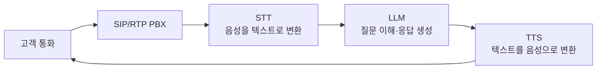
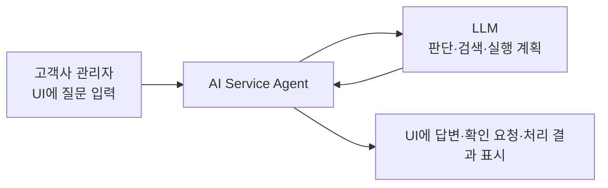
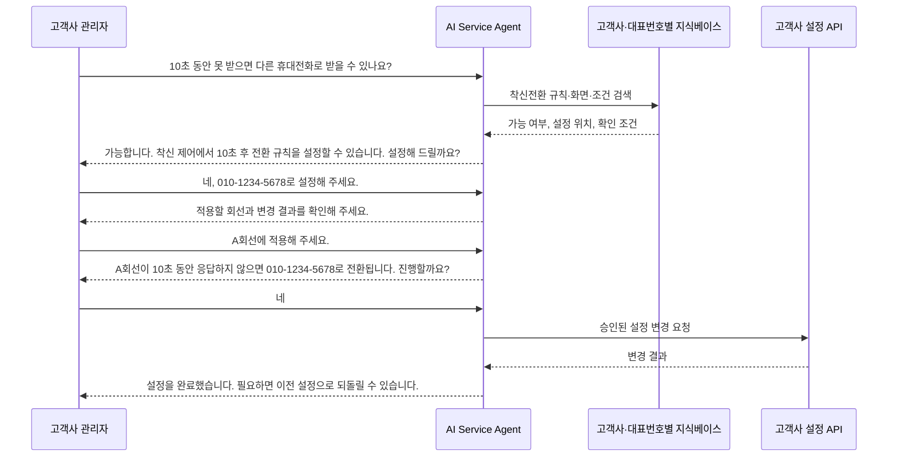
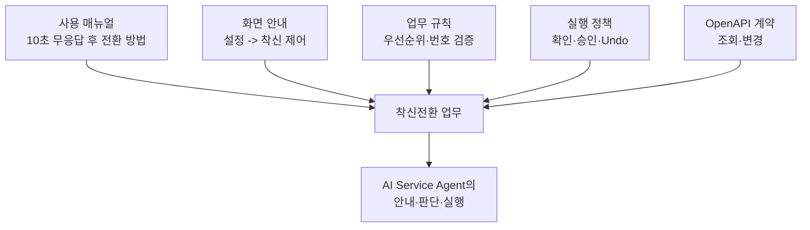
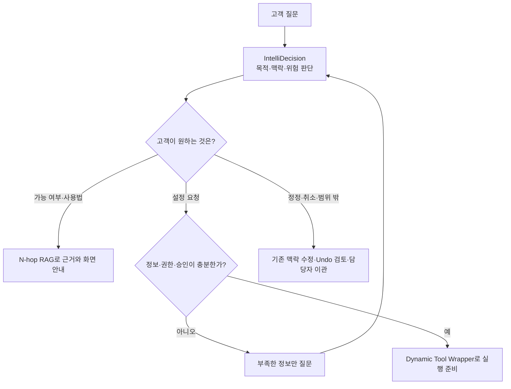
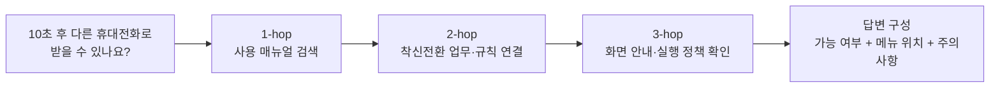
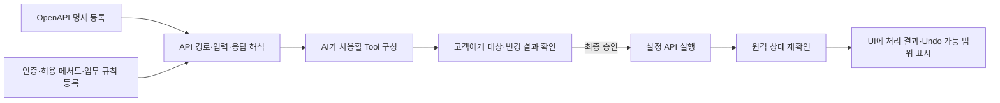
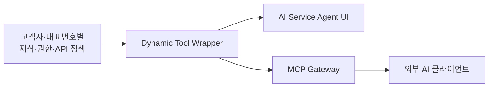

# 지능망 AI Service Agent PoC

**문서 유형**: C-Level/임원 및 본부장 보고용 PoC 소개서
**작성일**: 2026-09-03
**버전**: 6.0
**상태**: PoC 범위 정의 및 검증 보고
**대상 독자**: C-Level, 본부장, 사업·운영·기술 의사결정권자
**관련 문서**: [셀프서비스 AI 아키텍처](architecture/self-service-ai-assistant-architecture.md) | [서비스 PRD](product/self-service-ai-assistant-prd.md) | [시장·연구 조사](design/MCP_VS_CLIENT_CENTRIC_UNIVERSAL_AGENT_MARKET_RESEARCH.md) | [지식베이스·IntelliDecision 연구](design/SELF_SERVICE_RAG_INTELLIDECISION_ADVANCEMENT_RESEARCH.md)

---

## 1. PoC를 시작한 배경

통화매니저 CS 고객센터에는 반복 문의가 꾸준히 들어온다. 고객은 사용법을 묻는 데서 그치지 않고, 현재 설정을 확인하거나 바꿔 달라고 요청한다. 상담원이 같은 설명과 시스템 조작을 반복하면 대기 시간이 길어지고, 장애·계약·예외 처리처럼 사람의 판단이 필요한 업무에 집중하기 어렵다.

신규 고객의 불편도 크다. 처음 서비스를 쓰는 고객은 메뉴 위치와 용어부터 다시 익혀야 한다. UI/UX를 개선하면 서비스는 더 좋아지지만, 화면과 메뉴가 바뀌는 초기에는 기존 고객도 낯선 구조를 익혀야 한다. 고객의 질문을 이해하고, 바뀐 화면을 기준으로 안내하며, 필요한 경우 설정까지 이어 주는 대화형 지원 채널이 필요한 이유다.

기존 방식으로 AI 고객센터를 구축하려면 전문 Agent Builder 엔지니어가 업무 도메인을 분석해야 한다. 기능마다 대화 흐름을 설계하고, 질문별 분기와 정보 수집 단계를 만들며, API 연동 결과에 따라 상태를 이동시켜야 한다. 오류와 예외까지 상태 머신으로 관리해야 하므로 구축과 유지에 많은 시간과 전문 인력이 든다. 소규모 사업자나 일반 고객이 자체 AI 상담 시스템을 갖기 어려운 이유다.

**지능망 AI Service Agent PoC**는 이 한계를 검증한다. 사람이 복잡한 대화 흐름을 하나씩 설계하는 대신, 고객사별 지식 문서와 API 계약을 등록하고 IntelliDecision, N-hop RAG, Dynamic Tool Wrapper가 고객의 질문을 판단·안내·실행까지 연결할 수 있는지 확인한다.

---

## 2. 1차 보고 기반 - 지능망 Next AI Call Agent PoC

이번 PoC는 처음부터 새로 시작한 과제가 아니다. 1차 보고인 **지능망 Next AI Call Agent PoC**에서는 SIP/RTP 통화를 처리하는 PBX를 구축하고, 음성 인식(STT), 대규모 언어 모델(LLM), 음성 합성(TTS)을 연결해 인입 통화에 AI가 응대하는 기반을 만들었다.

이후에는 지식베이스를 자유롭게 구성하고 관리할 수 있도록 체계를 확장했다. 통화에서 얻은 지식 후보를 축적하고, 관리자가 검토·보완하며, AI가 답하기 어려운 상황은 사람에게 넘기는 HITL(Human-in-the-Loop) 체계를 함께 마련했다. AI가 지식 후보를 채우고 사람은 지식 품질과 예외 상황을 관리하는 유연한 AI 응대 기반이다.

이번 2차 PoC는 이 기반에서 출발한다. 통화 AI의 입력·출력 구조는 유지하되, 검증 범위에서는 **UI의 텍스트 입력 → LLM 처리 → UI 응답**을 가정한다. 음성 채널의 지연이나 인식 품질과 분리해, 고객센터 업무를 이해하고 실행하는 AI의 핵심 동작을 명확히 검증하기 위해서다.

---

## 3. PoC 시나리오 - 10초 후 다른 휴대전화로 받기

본 문서는 한 가지 질문을 끝까지 따라간다.

> "저에게 오는 전화를 10초 동안 받지 못하면 다른 휴대전화로 받을 수 있나요?"

AI는 먼저 가능 여부와 설정 위치를 설명한다. 고객이 "그렇게 설정해 주세요"라고 답하면, AI는 어떤 번호로 전환할지, 어느 회선에 적용할지, 변경 결과가 무엇인지 확인한다. 고객이 최종 승인한 뒤에만 등록된 API를 호출하고, 실제 설정 결과를 다시 확인해 화면에 알려 준다.

이 한 흐름 안에서 세 가지 핵심 기술이 순서대로 작동한다.

1. **IntelliDecision**이 질문의 목적과 다음 행동을 판단한다.
2. **N-hop RAG**가 답변에 필요한 지식과 화면 안내를 연결한다.
3. **Dynamic Tool Wrapper**가 승인된 외부 API를 실제 설정 작업으로 연결한다.

---

## 4. 먼저 만드는 것 - 착신전환 지식베이스

AI가 정확한 답을 하려면 먼저 업무 지식을 구조화해야 한다. 이 PoC에서는 고객사와 서비스 대표번호별로 지식과 권한을 분리한다. 따라서 A 고객사의 매뉴얼이나 API가 B 고객사의 답변과 실행 경로에 섞이지 않는다.

| 지식 항목    | 등록 내용                                                        | AI가 활용하는 시점                             |
| ------------ | ---------------------------------------------------------------- | ---------------------------------------------- |
| 사용 매뉴얼  | 10초 무응답 후 전환 규칙, 설정 순서, 주의사항                    | 고객의 가능 여부와 사용법 질문에 답할 때       |
| 화면 안내    | `설정 → 착신 제어 → 착신 규칙/착신전환 대상`                     | 고객에게 바뀐 UI에서도 정확한 메뉴를 안내할 때 |
| 업무 규칙    | 발신자 필터 우선, 규칙 평가 순서, 등록되지 않은 번호는 전환 불가 | 조건을 설명하고 잘못된 설정을 막을 때          |
| 실행 정책    | 대상 회선 확인, 새 번호 확인, 최종 승인, Undo 가능 여부          | 변경 요청을 안전하게 통제할 때                 |
| OpenAPI 계약 | 현재 규칙 조회, 대상 등록, 규칙 변경에 필요한 입력과 응답        | 실제 변경을 준비하고 결과를 검증할 때          |

지식베이스는 단순 FAQ 모음이 아니다. 같은 정보를 세 핵심 기술이 다른 목적으로 사용한다. IntelliDecision은 실행 정책과 대화 상태를 읽어 다음 행동을 고르고, N-hop RAG는 매뉴얼·규칙·화면 안내를 연결해 답변 근거를 만들며, Dynamic Tool Wrapper는 OpenAPI 계약과 승인 조건을 읽어 실행 가능 여부를 판단한다.

---

## 5. 핵심 기술 1 - IntelliDecision

고객의 문장은 짧아도 의도는 매번 다르다. "설정할 수 있나요?"는 안내 요청이고, "설정해 주세요"는 실행 요청이다. "아니요, 다른 번호로요"는 앞서 입력한 값을 고치는 요청이며, "방금 변경을 취소해 주세요"는 복원 요청이다. 기존 Agent Builder 방식은 이런 경우를 예상해 흐름과 분기를 미리 설계해야 한다. 모든 변형을 미리 만들 수 없으므로 고객은 정해진 질문 밖에서 답답함을 느끼기 쉽다.

IntelliDecision은 단순 분류기가 아니다. 매 발화마다 고객의 목적, 앞선 대화, 누락된 정보, 실행 위험, 다음 행동을 함께 판단한다. 이 체계 아래에서 LLM은 정해진 대본을 반복하는 대신 현재 대화에 맞는 지식과 행동을 선택한다.

| 판단 기준   | 10초 착신전환 시나리오에서 확인하는 내용                       | 다음 행동                  |
| ----------- | -------------------------------------------------------------- | -------------------------- |
| 고객의 목적 | 가능 여부를 묻는가, 실제 변경을 원하는가                       | 안내 또는 실행 준비        |
| 이전 대화   | 이미 전환 번호와 대상 회선을 받았는가                          | 같은 정보를 다시 묻지 않음 |
| 누락 정보   | 어느 회선에 적용할지, 전환할 번호가 무엇인지                   | 꼭 필요한 정보만 질문      |
| 실행 위험   | 여러 회선에 영향을 주는지, 되돌릴 수 있는지                    | 영향 범위와 승인 요구      |
| 다음 행동   | 안내, 조회, 보완 질문, 승인, 실행, 취소, 이관 중 무엇이 맞는지 | 대화 경로 선택             |

IntelliDecision은 탐색, 실행, 포괄 도움, 정정, 취소, 모호성 해소, 일괄 처리, 범위 밖 요청, 반복 요청을 구분하는 정책을 갖고 있다. 중요한 점은 유형 이름이 아니라 **대화가 바뀌어도 매 턴마다 다시 판단한다는 것**이다. 고객이 안내를 들은 뒤 실행을 요청하거나, 전환 번호를 바꾸거나, 실행 후 취소를 요청해도 처음부터 다시 시작하지 않는다. 이미 확인한 정보는 유지하고 바뀐 내용만 반영한다.

지식이 없거나 권한이 부족하거나 정책상 위험한 요청이면 AI는 이유를 설명하고 담당자에게 넘긴다. 정확하게 답할 수 없는 상황에서 억지로 답하거나 실행하지 않는 것도 IntelliDecision의 역할이다.

---

## 6. 핵심 기술 2 - N-hop RAG

일반 RAG는 질문과 의미가 비슷한 문서 조각을 찾아 답변에 넣는다. 그러나 고객센터 업무에서는 문서 한 조각만으로 충분하지 않다. "10초 뒤 다른 휴대전화로 전환할 수 있나요?"라는 질문에 답하려면 사용법뿐 아니라 화면 위치, 규칙의 우선순위, 등록 가능한 번호 조건, 변경 가능 여부까지 함께 알아야 한다.

N-hop RAG는 첫 문서 검색 결과에서 멈추지 않는다. 관련 문서에서 업무 영역으로, 업무 영역에서 화면 안내와 정책으로 한 단계씩 연결해 답변 근거를 넓힌다. 고객은 “매뉴얼에 적힌 문장”이 아니라 지금 해야 할 행동을 안내받는다.

| 단계  | 연결하는 정보                          | 고객에게 주는 가치                             |
| ----- | -------------------------------------- | ---------------------------------------------- |
| 1-hop | 사용 매뉴얼의 무응답 전환 설명         | 가능한 기능인지 빠르게 확인                    |
| 2-hop | 착신 규칙, 우선순위, 번호 등록 조건    | 왜 특정 조건이 필요한지 이해                   |
| 3-hop | UI 화면 경로, 실행 정책, API 가능 여부 | 어디서 설정하고 다음에 무엇을 해야 하는지 확인 |

UI가 바뀌어도 화면 안내 지식만 최신화하면 AI는 새 경로를 기준으로 답한다. 정책이 바뀌면 업무 규칙 문서를 고치면 된다. 관리자는 어떤 문서와 관계를 근거로 답했는지 확인해 지식베이스를 바로잡을 수 있다. 이것이 지식베이스 투명성이 주는 운영상의 장점이다.

---

## 7. 핵심 기술 3 - Dynamic Tool Wrapper

답변만 하는 AI는 고객의 마지막 요청을 상담원에게 다시 넘긴다. Dynamic Tool Wrapper는 기존 시스템의 OpenAPI 명세를 읽어 AI가 사용할 수 있는 실행 도구로 바꾼다. 고객사가 이미 운영하는 설정 API를 바꾸지 않아도, 필요한 계약과 정책을 등록하면 AI가 조회와 승인된 변경 업무에 활용할 수 있다.

착신전환 예시에서 AI는 먼저 현재 규칙을 조회하고, 고객이 확인한 회선·전화번호·시간 조건을 정리한다. 그다음 사전에 승인된 변경 API만 후보로 삼아 최종 승인을 요청한다. 승인 뒤에는 API를 실행하고, 응답만 믿지 않고 원격 시스템의 실제 상태를 다시 확인한다.

| 검증 원칙    | 착신전환 변경에서 확인하는 내용                                 |
| ------------ | --------------------------------------------------------------- |
| 실행 전 기록 | 어떤 회선의 어떤 설정을 바꾸는지, 변경 전 값이 무엇인지 남김    |
| 권한과 정책  | 고객사·서비스 대표번호 범위, 인증, 승인된 메서드인지 확인       |
| 명시적 승인  | “A회선이 10초 뒤 010-1234-5678로 전환됩니다”를 확인받은 뒤 실행 |
| 실행 후 검증 | API 응답과 실제 설정 상태가 일치하는지 대조                     |
| 복원 가능성  | 이전 상태를 되돌릴 수 있을 때만 Undo 경로 안내                  |

OpenAPI 문서 하나만 등록하면 모든 API가 자동 실행되는 것은 아니다. 접속 주소, 인증 방식, 요청·응답 형식, 업무 규칙, 승인 대상, 오류 처리, Undo 가능 여부를 함께 확인해야 한다. PoC는 이 안전 조건을 갖춘 API에서 개별 업무마다 별도 중계 코드와 대화 흐름을 만드는 부담을 줄일 수 있는지 검증한다.

---

## 8. 시장 활용 사례

**Anthropic Routing**은 Claude API로 에이전트를 만드는 조직에 제시하는 설계 방식이다. 일반 질문, 환불, 기술 지원처럼 목적이 다른 문의를 먼저 가르고, 각 문의에 맞는 지식·도구·후속 절차로 보낸다. IntelliDecision은 이 원칙을 고객센터 업무에 적용해 안내 요청과 설정 요청, 정정과 취소를 같은 대화 안에서 구분한다.

**Google Dialogflow CX**는 기업이 콜센터 IVR과 챗봇을 구축할 때 쓰는 Google Cloud 서비스다. 전문 엔지니어가 Flow, Page, Route를 미리 설계해 대화 상태를 관리한다. 지능망 AI Service Agent는 이와 달리 모든 세부 흐름을 고정하지 않고, IntelliDecision과 지식베이스가 현재 질문에 맞는 다음 행동을 판단하는 방식을 PoC로 검증한다.

**OpenAI GPT Actions**는 OpenAPI 계약과 인증 정보를 바탕으로 자연어 요청을 API 호출로 연결한다. Dynamic Tool Wrapper 역시 자연어와 API 계약을 연결하지만, 고객사·서비스 대표번호별 권한 분리, 변경 전 확인, 실행 후 상태 검증, Undo 정책을 함께 적용한다.

---

## 9. 기존 AICC와 비교한 PoC의 가치

| 비교 항목   | 기존 Agent Builder 중심 AICC                        | 지능망 AI Service Agent PoC                                     |
| ----------- | --------------------------------------------------- | --------------------------------------------------------------- |
| 구축 방식   | 전문 엔지니어가 업무별 대화 Flow와 상태 전이를 설계 | 지식 문서, API 계약, 승인 정책을 등록하고 AI가 대화 시점에 판단 |
| 예외 처리   | 예상 가능한 케이스를 흐름에 추가                    | 정정·모호성·취소 등 대화 변화를 IntelliDecision이 재판단        |
| 지식 변경   | 시나리오와 응답 흐름을 수정·검증                    | 매뉴얼·정책·화면 안내 문서를 바꾸고 근거를 확인                 |
| API 연동    | 기능마다 연동 로직과 결과별 분기 설계               | OpenAPI 계약을 활용해 승인된 조회·변경 도구를 구성              |
| 고객별 적용 | 고객사별 구축 프로젝트가 누적                       | 고객사와 서비스 대표번호별 문서·권한·API를 분리해 구성          |
| 운영 투명성 | 흐름과 프롬프트를 함께 추적                         | 답변 근거와 지식베이스 구성을 확인하고 문서 중심으로 개선       |

이 PoC의 목표는 “무엇이 들어와도 무조건 답하는 AI”가 아니다. 고객이 정해진 메뉴와 질문 안에 갇힌다는 답답함을 줄이면서도, 지식과 정책으로 통제된 범위 안에서 안내와 실행을 이어 가는 시스템을 검증하는 것이다. 고객별로 서로 다른 업무 지식이 있어도 문서와 API 계약을 분리해 등록할 수 있으며, 문서가 바뀌면 지식베이스만 갱신해 응대 내용을 개선할 수 있다.

---

## 10. CS 데이터가 보여 주는 적용 가능성

2024년 통화매니저 CS 처리 실데이터 7,047건을 분석한 결과, 표준 절차로 안내·조회·실행 가능성을 검토할 수 있는 상위 4개 유형은 5,436건으로 전체의 **77.1%**다. 이는 자동화 절감 실적이 아니라 PoC 이후 우선순위를 정하기 위한 후보군이다.

| 우선 검토 업무             |      건수 |      비중 | PoC 이후 적용 방향                                  |
| -------------------------- | --------: | --------: | --------------------------------------------------- |
| 고객사 MAC/비밀번호 초기화 |     2,626 |     37.3% | 본인 확인 뒤 표준 절차 안내 또는 승인된 초기화 실행 |
| 서비스 이용 문의           |     1,473 |     20.9% | 지식베이스와 화면 안내를 활용한 자가 해결 지원      |
| 회선 묶음 요청             |       792 |     11.2% | 대상·영향 범위·최종 승인 뒤 제한된 실행             |
| KT OPEN_API 로그인 불가    |       545 |      7.7% | 상태 조회, 표준 조치, 기술 지원 이관                |
| **우선 후보 합계**         | **5,436** | **77.1%** | API와 보안 정책이 준비된 업무부터 단계 적용         |

PoC에서 착신전환 한 건의 안내·판단·실행 흐름을 검증한 뒤, 위 업무에도 같은 원칙을 적용할 수 있다. 실제 확대 여부는 셀프 해결률, 실행 성공률, 이관 사유, 재문의율, 변경 취소율을 통해 확인한다.

---

## 11. MCP Gateway - PoC의 확장 가능성

MCP(Model Context Protocol)는 세 핵심 기술과 별개로, 이미 구성한 실행 도구를 외부 AI에도 연결하는 확장 경로다. Dynamic Tool Wrapper가 만든 도구에 MCP 서버 기능을 더하면 Claude Desktop이나 VS Code Copilot 같은 MCP 클라이언트도 같은 API를 사용할 수 있다.

이 기능은 이번 PoC의 핵심 검증 대상은 아니다. 다만 고객센터용으로 검증한 API 연결과 안전 정책을 다른 AI 도구에도 재사용할 수 있는지 확인하는 확장 가능성으로 기록한다.

---

## 12. PoC Lessons Learned

1. AI 고객센터의 어려움은 모델 연결 자체보다 업무 지식, 권한, 예외, API 결과를 대화 흐름에 반영하는 데 있다.
2. 고객 경험을 바꾸려면 FAQ 검색만으로는 부족하다. 화면 안내, 업무 규칙, 실행 정책을 함께 연결해야 고객이 다음 행동을 할 수 있다.
3. 모든 대화 흐름을 미리 설계하는 방식은 고객의 정정·취소·모호한 질문을 모두 담기 어렵다. 목적과 맥락을 다시 판단하는 구조가 필요하다.
4. 실제 실행은 답변 생성보다 더 엄격하게 다뤄야 한다. 승인, 변경 전 상태, 원격 상태 검증, 복원 가능 여부가 갖춰지지 않으면 실행하지 않아야 한다.
5. AI 응대 품질은 프롬프트만으로 관리할 수 없다. 답변 근거와 지식베이스를 관리자가 직접 확인하고 문서를 갱신할 수 있어야 지속적으로 개선할 수 있다.

## 결론

지능망 AI Service Agent PoC는 기존 통화 AI와 지식베이스 기반 위에서 고객센터 업무를 더 유연하게 처리할 수 있는지 검증하는 과제다. 고객이 UI에서 “10초 동안 전화를 받지 못하면 다른 휴대전화로 받을 수 있나요?”라고 묻는 한 가지 시나리오를 통해 IntelliDecision의 판단, N-hop RAG의 근거 탐색, Dynamic Tool Wrapper의 안전한 실행 연결을 확인한다.

PoC의 성공은 “AI가 많은 답을 했는가”가 아니라, 고객이 정확한 안내를 받고 필요한 경우 안전하게 설정을 끝냈는가로 판단한다. 이 검증을 마친 뒤 CS 데이터의 우선 후보 업무로 적용 범위를 넓힌다.

*최종 업데이트: 2026-09-03*