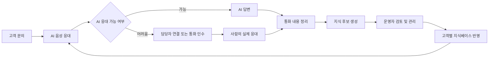
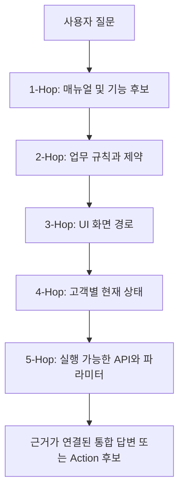
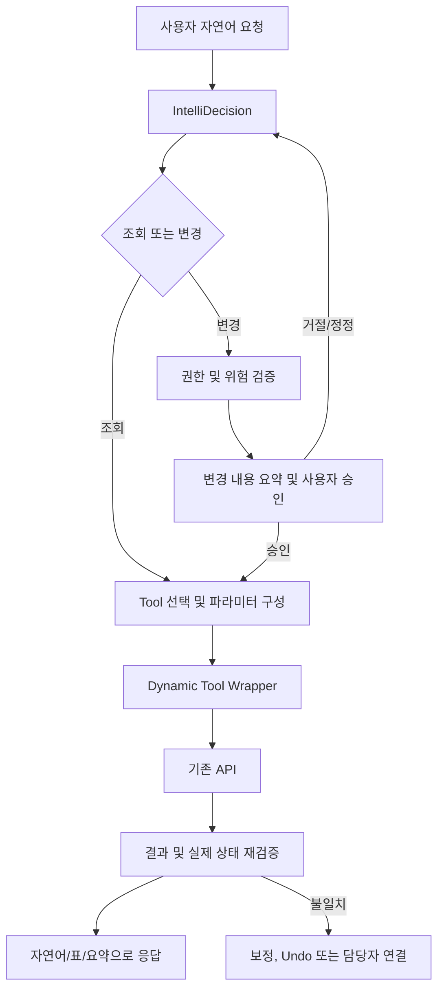
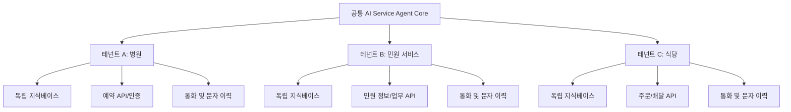
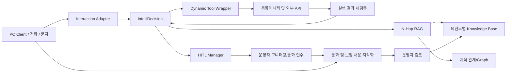

# AI 서비스 에이전트를 활용한 Next 지능망 PoC 계획서

> **문서 구분**: PoC 계획서  
> **문서 버전**: v1.0  
> **작성일**: 2026-09-16  
> **연계 과제**: Agentic AI CallBot 1차 PoC  
> **검증 대상**: IntelliDecision, N-Hop RAG, Dynamic Tool Wrapper, PC Client 대화형 개인 비서, 테넌트 격리형 개인 서비스 Agent

---

## 0. Executive Summary

본 PoC는 1차 Agentic AI CallBot PoC에서 검증한 **음성 기반 AI 응대, 통화 내용 기반 자율 성장형 지식베이스, Human-in-the-Loop(HITL) 협업 구조**를 계승하고, 이를 **판단, 지식 탐색, 행동 실행**이 결합된 Next 지능망 AI Service Agent로 고도화하기 위한 기술 및 서비스 검증 과제이다.

1차 PoC의 핵심은 AI가 고객과 음성으로 응대하고, 실제 통화에서 확인된 질문과 답변을 정리하여 지식베이스에 축적함으로써 운영자가 지식베이스를 관리하는 것만으로 AI 응대 시스템이 지속적으로 성장할 수 있는 구조를 검증하는 것이었다. 또한 고객이 AI 응대 상황을 실시간으로 모니터링하다가 필요한 경우 직접 통화를 인수하거나, AI가 응대하기 어려운 상황에서 담당자에게 연결하는 HITL 구조를 통해 AI와 사람이 하나의 서비스 프로세스로 협업할 수 있음을 확인하고자 하였다.

이번 PoC는 위 성과를 유지하면서 다음 세 가지 기술을 추가 검증한다.

1. **IntelliDecision**: 단순 Intent 분류를 넘어 목적, 맥락, 누락 정보, 실행 리스크, 다음 행동의 5개 상태값을 매 턴 재평가하여 답변, 추가 질문, 사용자 확인, 실행, 취소 또는 담당자 연결을 결정한다.
2. **N-Hop RAG**: 단일 문서 조각을 찾는 일반 RAG를 넘어 매뉴얼, 업무 규칙, 화면 경로, 고객 상태 및 실행 조건을 연쇄적으로 탐색하여 하나의 완결된 답변을 구성한다.
3. **Dynamic Tool Wrapper**: 특정 API를 MCP 서버로 개별 포장하는 방향과 달리, 기존 API의 간략한 규격 문서를 등록하면 AI가 해당 API를 실행 가능한 도구로 해석하도록 하여 다수의 기존 API를 신속하게 AI 실행 영역으로 확장한다.

PoC 적용 대상은 다음 두 가지이다.

- **통화매니저 PC Client 대화형 개인 비서**: 매뉴얼 기반 질의응답, 설정 방법 안내, 본인 설정 및 통화이력 조회, 승인 기반 설정 변경, Raw Data 기반 즉석 분석을 하나의 대화형 인터페이스에서 제공한다.
- **테넌트 격리형 개인 서비스 Agent**: 고객별 독립 지식베이스와 서비스 연결정보를 보유한 Agent를 제공하고, 병원, 민원 응대, 식당 등 고객 업무에 맞춰 전화와 문자로 365일 응대한다.

본 PoC의 핵심 방향은 **편의성**이다. 고객이 별도의 대규모 지식 구축이나 시나리오 설계를 수행하지 않고, 기존 통화 내용의 자동 지식화 또는 매뉴얼 문서 업로드만으로 서비스를 시작하며, 이후에는 지식베이스를 관리하는 것만으로 AI 서비스가 유지되고 고도화되는 구조를 지향한다.

---

# 1. 추진 배경

## 1.1 산업의 방향

생성형 AI 서비스는 질문에 답변하는 단계를 넘어, 사용자의 목적을 해석하고 필요한 지식과 도구를 선택하여 실제 업무를 수행하는 Agentic AI로 발전하고 있다. 이러한 변화의 핵심은 단순히 더 자연스러운 문장을 생성하는 것이 아니라 다음 과정을 하나의 서비스 흐름으로 결합하는 데 있다.

```text
사용자 요청
   → 상황 판단
   → 필요한 지식 탐색
   → 부족한 정보 확인
   → 실행 가능 여부 및 위험 검증
   → 사용자 승인
   → 시스템 행동
   → 결과 검증 및 후속 응대
```

그러나 기존 AICC, 챗봇 및 로우코드 Agent Builder는 다음 한계를 가진다.

| 구분 | 기존 방식의 한계 | Next 지능망이 해결하려는 방향 |
|---|---|---|
| 대화 판단 | 사전 정의한 Intent와 시나리오 중심 | 매 턴 상태를 재계산하는 동적 판단 |
| 지식 활용 | 유사 문서 조각 1개 중심 검색 | 연관 규칙, 화면, 상태정보를 단계적으로 연결 |
| 행동 수행 | 기능마다 전용 API 연동 및 UI 개발 필요 | 기등록 API를 AI가 동적으로 선택하고 실행 |
| 지식 구축 | FAQ, 시나리오, 학습 데이터 사전 구축 | 통화 내용 자동 지식화 또는 매뉴얼 업로드 |
| 운영 | 개발자 중심 수정 | 운영자의 지식베이스 관리 중심 |
| 예외 처리 | 시나리오 이탈 시 실패 또는 상담사 이관 | 추가 질문, 경로 재산정, HITL로 유연하게 처리 |

## 1.2 기존 AICC 및 Agent Builder의 구조적 제약

현재 다수의 상담형 AI는 사전에 정의한 질문, Intent, Slot, 분기 Flow를 기반으로 동작한다. 이 방식은 범위가 명확하고 변경이 적은 업무에는 효과적이지만, 고객이 복합적으로 질문하거나 대화 중 요청을 정정하는 경우, 또는 여러 업무 규칙을 함께 적용해야 하는 경우에는 시나리오 수가 급격히 증가한다.

또한 기존 UI 중심 서비스는 새로운 정보나 분석 기능을 제공하려면 일반적으로 다음 과정이 필요하다.

```text
요구사항 정의 → API 개발 → 화면 설계 → UI 개발 → 시험 → 배포
```

반면 AI Agent는 API로 접근 가능한 데이터와 기능이 준비되어 있다면, 별도의 고정 UI 없이 자연어 요청에 따라 정보를 조회하고 결과를 요약, 비교, 계산 또는 표 형태로 구성할 수 있다. 따라서 모든 예상 질문에 대응하는 화면과 통계를 미리 개발하는 방식에서, **안전하게 접근 가능한 Raw Data와 Action을 개방하고 AI가 목적에 맞게 조합하는 방식**으로 전환할 수 있다.

## 1.3 1차 Agentic AI CallBot PoC 수행 내용과 시사점

### 1.3.1 1차 PoC의 핵심 검증 내용

1차 PoC는 Tool 연계나 API 실행을 핵심 범위로 삼지 않았다. 핵심은 다음 두 축이었다.

#### 가. 자율 성장형 지식베이스

- AI Agent가 고객과 음성으로 응대한다.
- 유저와 담당자의 통화 내용을 STT로 변환한다.
- 질문, 답변, 해결 방법 및 관련 맥락을 정리한다.
- 검토 가능한 지식 후보로 지식베이스에 축적한다.
- 운영자는 지식의 승인, 수정, 폐기 등 관리에 집중한다.
- 축적된 지식은 이후 유사 문의에 대한 AI 응답에 활용된다.

즉, 과거처럼 FAQ와 시나리오를 처음부터 대량으로 구축하는 것이 아니라, 실제 업무 과정에서 발생하는 통화를 지식 자산으로 전환하여 **운영과 동시에 AI 시스템이 성장하는 구조**를 지향하였다.

#### 나. AI와 사람의 HITL 협업

- 고객은 AI의 응대 내용을 실시간으로 모니터링할 수 있다.
- 필요할 경우 고객 또는 담당자가 실제 통화를 인수할 수 있다.
- AI가 지식 부족, 낮은 확신도 또는 예외 상황을 감지하면 담당자에게 연결한다.
- 사람의 실제 응대 결과는 다시 지식 후보로 축적된다.

이를 통해 AI가 사람을 완전히 대체하는 방식이 아니라, AI가 반복적이고 정형화된 응대를 담당하고 사람이 예외와 고난도 상황을 처리하며, 그 결과가 다시 AI의 지식으로 환류되는 협업 구조를 검증하였다.

### 1.3.2 1차 PoC의 순환 구조



### 1.3.3 이번 PoC의 확장 지점

이번 PoC는 1차의 자율 성장형 지식베이스와 HITL 구조를 폐기하는 것이 아니라, 다음 기능을 추가하여 응대 품질과 활용 범위를 확대한다.

| 구분 | 1차 PoC | Next PoC |
|---|---|---|
| 기본 채널 | AI 음성 응대 | 음성, 문자, PC Client 대화 |
| 지식 생성 | 통화 내용에서 지식 후보 자동 생성 | 기존 방식 유지 + 매뉴얼 간편 업로드 |
| 지식 검색 | 일반 RAG | N-Hop RAG |
| 판단 | 주로 Intent 및 응답 가능 여부 | 5차원 상태 기반 IntelliDecision |
| 사람 협업 | 모니터링, 통화 인수, 담당자 연결 | 기존 HITL 유지 + 고위험 Action 승인 |
| 행동 수행 | 주요 검증 범위 아님 | Dynamic Tool Wrapper를 통한 조회 및 변경 |
| 테넌트 | 고객별 격리 구조 | 동일 구조를 유지하며 개인 서비스 Agent로 확장 |

---

# 2. PoC 목표와 지향점

## 2.1 목표

본 PoC의 목표는 **최소한의 초기 준비만으로 생성되고, 사용할수록 지식이 축적되며, 답변뿐 아니라 안전한 행동까지 수행하는 지능망 AI Service Agent의 실현 가능성을 검증하는 것**이다.

세부 목표는 다음과 같다.

1. 통화 내용 또는 업로드 문서를 기반으로 고객별 지식베이스를 간편하게 구성한다.
2. 복합 문의에 대해 여러 지식과 규칙을 연결하여 일관된 답변을 생성한다.
3. 대화 상태와 실행 위험을 판단하여 적절한 다음 행동을 선택한다.
4. 고객의 명시적 확인이 필요한 변경 작업은 승인 후 실행한다.
5. 기존 API를 대규모 개별 개발 없이 AI 실행 도구로 활용한다.
6. AI와 사람이 HITL 구조로 협업하고, 사람의 응대 결과를 다시 지식화한다.
7. PC Client 개인 비서와 테넌트 격리형 개인 서비스 Agent의 서비스 적용성을 검증한다.

## 2.2 지향점

> **구축해야 사용하는 AI가 아니라, 보유한 문서와 업무 데이터만 연결하면 바로 사용할 수 있고 운영 과정에서 스스로 성장하는 AI Service Agent**

### 핵심 원칙

- **Zero/Minimum Knowledge Build**: 초기 지식 구축을 생략하거나 최소화한다.
- **Knowledge Management First**: 고객은 AI Flow를 개발하지 않고 지식베이스를 관리한다.
- **Smart but Controlled**: AI는 유연하게 판단하되, 위험한 변경은 승인과 검증을 거친다.
- **Data and Action Separation**: 조회, 분석, 변경을 구분하고 권한과 승인 수준을 차등 적용한다.
- **Tenant Isolation**: 고객별 지식, 통화, 도구, 인증정보 및 실행이 섞이지 않도록 분리한다.
- **HITL by Design**: AI의 한계를 숨기지 않고 사람의 개입과 전환을 기본 기능으로 설계한다.

---

# 3. 핵심 기술

## 3.1 IntelliDecision: 5차원 상태 기반 자율 판단

### 3.1.1 개념

IntelliDecision은 사용자의 발화를 하나의 Intent로 분류하고 끝내는 방식이 아니라, 매 대화 턴마다 5개 상태값을 갱신하여 다음 행동을 결정하는 판단 계층이다.

| 상태값 | 판단 질문 | 주요 결과 |
|---|---|---|
| 1. 목적(Intent) | 사용자가 알고 싶은가, 조회하려는가, 변경하려는가, 취소하려는가 | 지식 응답, 조회, 변경, 취소 등 후보 결정 |
| 2. 맥락(Context) | 이미 확인한 회선, 사용자, 기간, 기존 설정, 이전 발화는 무엇인가 | 중복 질문 방지, 정정 내용 반영 |
| 3. 누락 정보(Missing Parameter) | 작업 수행에 필요한 값 중 무엇이 부족한가 | 추가 질문 또는 기본값 확인 |
| 4. 실행 리스크(Security/Execution Risk) | 본인 권한인가, 변경 영향이 있는가, 되돌릴 수 있는가 | 승인 수준, 실행 제한, 담당자 이관 결정 |
| 5. 다음 행동(Next Action) | 지금 가장 적절한 한 단계는 무엇인가 | 답변, 질문, 확인, 실행, 검증, 취소, 이관 |

### 3.1.2 5차원 상태값과 동작의 매핑 예시

#### 사용자 요청

> “퇴근 후에는 회사 전화가 휴대폰으로 오게 해줘.”

#### 턴별 판단 과정

| 대화 턴 | 사용자/시스템 입력 | Intent | Context | Missing Parameter | Risk | Next Action |
|---|---|---|---|---|---|---|
| T1 | 퇴근 후 휴대폰으로 수신 요청 | 예약형 착신전환 설정 | 로그인 사용자와 보유 회선 확인 가능 | 퇴근 시간, 전환 번호 | 설정 변경, 과금/수신 영향 가능 | 필요한 값 질문 |
| T2 | “오후 6시부터, 내 휴대폰으로” | 설정 요청 유지 | 사용자가 오후 6시와 본인 휴대폰을 지정 | 종료 시각 또는 해제 조건 | 변경 대상과 번호는 확인됨 | 종료 조건 질문 또는 기본 정책 제시 |
| T3 | “다음 날 오전 9시에 해제해줘” | 반복 예약 설정 | 18:00∼익일 09:00 조건 완성 | 없음 | 회선 설정 변경, 반복 실행 | 실행 전 요약 및 승인 요청 |
| T4 | “응, 설정해줘” | 명시적 승인 | 직전 설정 요약과 승인 연결 | 없음 | 승인 충족 | API 실행 |
| T5 | API 결과 및 재조회 | 실행 완료 검증 | 요청값과 실제값 비교 | 없음 | 불일치 여부 확인 | 성공 안내 또는 보정/이관 |

#### 사용자에게 보이는 대화 예시

```text
사용자: 퇴근 후에는 회사 전화가 휴대폰으로 오게 해줘.
AI: 몇 시부터 전환할까요?
사용자: 오후 6시부터, 내 휴대폰으로.
AI: 언제 자동으로 해제할까요?
사용자: 다음 날 오전 9시에 해제해줘.
AI: 회사 회선을 매일 오후 6시부터 다음 날 오전 9시까지
    등록된 휴대폰 번호로 착신전환할까요?
사용자: 응, 설정해줘.
AI: 설정을 적용했고 실제 상태를 다시 확인했습니다.
```

**중요 설계 원칙**: 사용자의 최초 발화만으로 즉시 변경하지 않는다. IntelliDecision은 조회와 안내는 바로 수행할 수 있지만, 서비스 상태 변경이나 외부 영향 가능성이 있는 작업은 변경 대상과 결과를 사용자에게 요약하고 **“설정할까요?”**와 같은 명시적 확인을 받은 뒤 실행한다.

### 3.1.3 정정, 취소 및 예외 처리 예시

```text
사용자: 6시부터 010-1111-2222로 착신전환해줘.
AI: 매일 오후 6시부터 해당 번호로 착신전환할까요?
사용자: 아니, 번호는 010-3333-4444야.
```

이 경우 시스템은 최초 단계부터 다시 시작하지 않고 다음과 같이 처리한다.

- Intent: 설정 변경 유지
- Context: 시간 조건 유지, 번호만 정정
- Missing Parameter: 없음
- Risk: 변경 대상 번호 재검증 필요
- Next Action: 정정된 전체 조건을 다시 요약하고 승인 요청

### 3.1.4 시장 검증 사례: Microsoft Copilot Studio의 Generative Orchestration

Microsoft Copilot Studio의 Generative Orchestration은 LLM 기반 Planner가 사용자 의도를 해석하고, 복합 요청을 단계로 분해하며, 적절한 Tool, Topic, Knowledge Source 또는 Agent를 선택하여 다단계 계획을 실행하는 구조를 제공한다. Microsoft 공식 문서는 이 Planner가 입력을 구조화된 Plan으로 바꾸고, 실행 순서와 데이터 흐름을 결정하며, 민감한 작업에는 승인을 요구할 수 있다고 설명한다.

전통적인 Topic 기반 Agent가 수작업 분기와 Slot Filling에 의존하는 반면, Generative Orchestration은 재사용 가능한 Action, Topic, Knowledge 및 Agent를 동적으로 조합한다. 또한 Connected Agent가 더 높은 권한을 보유할 수 있으므로, 삭제와 같은 민감 작업은 적절한 검증 또는 사용자 동의를 거쳐야 한다고 권고한다.

#### 시장 사례와 IntelliDecision의 관계

| Microsoft Copilot Studio | 본 PoC의 IntelliDecision |
|---|---|
| 사용자 의도 해석 | Intent 상태 계산 |
| 대화 및 입력 Context 활용 | Context 상태 계산 |
| 입력 정의에 따른 Slot Filling | Missing Parameter 계산 |
| 정책 범위와 민감 Action 승인 | Security/Execution Risk 계산 |
| Tool, Topic, Knowledge, Agent 선택 | Next Action 결정 |

따라서 IntelliDecision은 전혀 새로운 개념을 선언하는 것이 아니라, 시장에서 검증되고 있는 **LLM 기반 동적 Orchestration과 승인형 Action 패턴**을 지능망 서비스의 회선, 설정, 통화이력, 테넌트 권한 및 HITL 요구에 맞게 구체화한 구조이다.

### 3.1.5 PoC 검증 항목

- 동일 발화를 정보 문의와 설정 변경으로 올바르게 구분하는가
- 이전 대화에서 확보한 값을 재사용하고 불필요한 재질문을 줄이는가
- 누락된 필수값만 추가 질문하는가
- 정정이나 취소 발화 시 현재 상태를 유지하면서 경로를 재계산하는가
- 변경 작업 전에 영향과 변경값을 요약하고 명시적 승인을 받는가
- 권한 부족, 고위험 또는 불확실 상황을 담당자에게 연결하는가

---

## 3.2 N-Hop RAG: 연관 지식의 단계적 탐색

### 3.2.1 개념

일반 RAG는 사용자 질문과 의미적으로 유사한 문서 조각을 찾아 답변의 근거로 제공한다. 이 방식은 단일 매뉴얼 항목의 사용법을 묻는 질문에는 유효하지만, 실제 고객 문의처럼 기능 설명, 적용 조건, 예외 규칙, 현재 설정 상태 및 화면 위치가 함께 필요한 경우에는 답변이 파편화될 수 있다.

N-Hop RAG는 1차 검색 결과에서 확인된 개체와 관계를 다음 검색의 단서로 사용하여, 서로 다른 지식 계층을 연쇄 탐색한다.

### 3.2.2 지식 계층

| 계층 | 내용 | 예시 |
|---|---|---|
| User Manual | 기능 정의와 사용 방법 | 착신전환 기능 설명 |
| Business Rule | 적용 조건, 제한, 우선순위 | 동시 설정 불가, 번호 형식, 과금 조건 |
| UI Navigation | PC Client 메뉴와 화면 경로 | 설정 > 통화설정 > 착신전환 |
| Tenant/User State | 고객의 현재 가입, 권한, 설정상태 | 서비스 가입 여부, 현재 대상 번호 |
| Tool/API Description | 조회 및 변경 기능, 입력값, 응답값 | 설정 조회 API, 착신전환 변경 API |

### 3.2.3 실제 판단 예시

#### 사용자 질문

> “VIP 고객 전화는 놓치지 않게 하고 싶은데 어떻게 해야 해?”

이 질문에는 기능명이 직접 포함되어 있지 않다. N-Hop RAG는 다음과 같이 탐색한다.

1. **1-Hop, 요구 목적 식별**: 특정 발신자 전화를 우선적으로 수신하려는 요구로 해석한다.
2. **2-Hop, 관련 기능 검색**: 중요 발신자, VIP 그룹, 선택 착신 또는 부재중 처리 기능을 탐색한다.
3. **3-Hop, 업무 규칙 확인**: VIP 그룹 등록 조건, 번호 개수 제한, 다른 착신전환 설정과의 우선순위를 확인한다.
4. **4-Hop, 고객 상태 확인**: 현재 가입 상품, 보유 권한 및 기존 설정을 조회한다.
5. **5-Hop, UI 또는 Action 연결**: 화면 경로를 안내하거나 설정 가능한 API를 IntelliDecision에 전달한다.

#### 답변 예시

```text
VIP 고객 번호를 중요 발신자 그룹으로 등록한 뒤,
해당 그룹의 전화를 휴대폰으로 우선 착신하도록 설정할 수 있습니다.
현재 회선에는 일반 착신전환이 설정되어 있어 두 규칙의 우선순위를 먼저 확인해야 합니다.
PC Client에서는 [고객관리 > 중요 발신자 그룹]에서 번호를 등록할 수 있습니다.
원하시면 현재 설정을 조회한 뒤 적용 가능한 방식으로 안내하겠습니다.
```

### 3.2.4 일반 RAG 대비 구조



### 3.2.5 시장 검증 사례: Microsoft GraphRAG

Microsoft Research의 GraphRAG는 단순 벡터 유사도 기반의 Baseline RAG와 달리, 원문에서 개체, 관계 및 Claim을 추출하고 Knowledge Graph와 Community 계층을 구성한 뒤 이를 질의에 활용하는 구조이다. Microsoft는 Baseline RAG가 서로 떨어진 정보 조각을 공통 속성을 통해 연결해야 하는 질문, 또는 대규모 데이터 전체의 의미를 종합해야 하는 질문에서 약점을 보인다고 설명한다.

GraphRAG의 Indexing 과정은 원문을 Text Unit으로 나누고, 개체와 관계 및 Claim을 추출하며, Community를 탐지하고 요약을 생성한다. 질의 시에는 이러한 Graph Context를 사용해 단일 문서 조각 이상의 연결된 답변을 만든다.

#### 시장 사례와 N-Hop RAG의 관계

| Microsoft GraphRAG | 본 PoC의 N-Hop RAG |
|---|---|
| 개체와 관계 추출 | 기능, 규칙, 화면, 고객상태, API 관계 정의 |
| Knowledge Graph | 지능망 서비스 지식 연결 구조 |
| Community 및 계층 요약 | 서비스/기능군별 지식 묶음 |
| 복잡한 정보 간 연결 | 매뉴얼에서 규칙, 화면, 상태, Action으로 연쇄 탐색 |
| Private Data에 대한 근거 기반 질의 | 고객별 격리된 매뉴얼과 통화 지식 활용 |

본 PoC는 GraphRAG 제품 자체의 도입을 전제하지 않는다. 다만, 시장에서 검증된 **“지식을 평면적인 문서 조각으로만 보지 않고 개체와 관계로 구조화하여 연결 검색한다”**는 접근을 차용하여, 통화매니저 업무에 필요한 N-Hop 탐색 로직을 구현하고 검증한다.

### 3.2.6 통화 내용 기반 자율 성장과의 결합

N-Hop RAG는 1차 PoC의 통화 지식화 구조와 함께 동작한다.

```text
실제 통화
 → 질문/해결방법/조건/화면/결과 추출
 → 지식 후보 생성
 → 운영자 검토
 → 기존 기능 및 규칙과 관계 연결
 → 다음 문의에서 N-Hop 탐색에 활용
```

예를 들어 담당자가 실제 통화에서 “회선 묶음 신청 후에는 기존 착신전환 우선순위가 변경될 수 있다”고 설명했다면, 해당 내용을 단순 Q&A로만 저장하지 않고 `회선 묶음 ↔ 착신전환 ↔ 우선순위 규칙`의 관계로 연결한다. 이후 고객이 “회선을 묶은 뒤 전화가 다른 번호로 가요”라고 문의하면 관련 규칙까지 함께 탐색할 수 있다.

### 3.2.7 PoC 검증 항목

- 단일 검색으로 해결되지 않는 복합 질문을 2개 이상의 지식으로 연결하는가
- 검색 경로와 사용 근거를 추적할 수 있는가
- 테넌트 외부 지식이 혼입되지 않는가
- 지식이 부족하면 추정하지 않고 추가 질문 또는 담당자 연결을 수행하는가
- 일반 RAG 대비 정답 완결성, 근거 적합성 및 재질문 감소 효과가 있는가

---

## 3.3 Dynamic Tool Wrapper: 임의의 API를 AI 실행 도구로 전환

### 3.3.1 개념

Dynamic Tool Wrapper는 기존 시스템이 보유한 API의 간략 규격, 인증 방식, 입력 및 출력, 권한, 실행 위험 및 승인 조건을 문서로 등록하면 AI가 해당 API를 실행 가능한 Tool로 해석하고, 사용자 요청에 맞는 Tool과 입력값을 동적으로 구성하도록 하는 기능이다.

핵심은 **API마다 전용 대화 Flow, 중계 코드 및 UI를 반복 개발하는 작업을 줄이는 것**이다.

### 3.3.2 기존 방식과의 차이

#### 기존 기능 개발 방식

```text
새 요구사항 발생
 → 전용 API 또는 중계 개발
 → 화면과 입력 Form 개발
 → 업무 Flow에 고정 연결
 → 시험 및 배포
 → 변경 시 코드와 UI 수정
```

#### Dynamic Tool Wrapper 방식

```text
기존 API 존재
 → API 설명 문서 등록
 → 입력/출력/권한/승인 조건 해석
 → AI Tool Catalog에 반영
 → 자연어 요청에 따라 Tool 선택
 → IntelliDecision 승인 및 위험 검증
 → API 실행 및 결과 재검증
```

이 방식은 API가 존재하지 않는 업무까지 자동으로 가능하게 만드는 기술은 아니다. **조회 또는 변경 가능한 API와 접근 권한이 준비된 범위에서만 동작**하며, 데이터가 불완전하거나 필요한 Action이 제공되지 않은 경우에는 응답과 실행에 한계가 있음을 명확히 안내한다.

### 3.3.3 MCP와의 대비

MCP는 AI Application과 외부 Data/Tool 사이의 연결을 표준화하는 Client-Server Protocol이다. MCP Server는 Tool의 이름, 설명 및 입력 Schema를 노출하고, AI Application은 이를 발견해 호출할 수 있다. 즉 MCP의 핵심 가치는 **한 번 MCP Server로 제공한 기능을 다양한 MCP Client 또는 AI Application이 일관된 방식으로 이용할 수 있게 하는 것**이다.

Dynamic Tool Wrapper는 방향을 달리한다.

| 구분 | MCP | Dynamic Tool Wrapper |
|---|---|---|
| 중심 질문 | 내 기능을 여러 AI가 어떻게 표준 방식으로 사용하게 할 것인가 | 이미 존재하는 여러 API를 현재 AI가 어떻게 빠르게 사용하게 할 것인가 |
| 준비 단위 | MCP Server 또는 MCP Tool로 제공 | API 설명 문서 또는 OpenAPI 규격 등록 |
| 방향 | 하나의 기능을 다양한 AI Client에 개방 | 다양한 API를 하나의 Agent 실행 영역으로 수용 |
| 주요 가치 | 상호운용성과 표준 연결 | 기존 API 수용 속도와 개별 연동 개발 최소화 |
| 적용 판단 | 외부/다중 AI 생태계에 장기 제공할 공통 기능 | 내부 Legacy API를 PoC/서비스에 빠르게 연결할 기능 |

두 기술은 경쟁 또는 배타 관계가 아니다. 향후 공통 기능은 MCP Server로 표준화하고, 아직 MCP화되지 않은 내부 API는 Dynamic Tool Wrapper로 빠르게 수용하는 혼합 구조가 가능하다.

### 3.3.4 시장 검증 사례: OpenAI GPT Actions

OpenAI의 GPT Actions는 Custom GPT가 외부 REST API와 자연어로 상호작용하도록 연결하는 기능이다. 개발자가 API Schema와 인증 방식을 구성하면, 모델이 사용자의 질문에 어떤 API가 필요한지 결정하고, API 호출에 필요한 JSON 입력을 생성한 뒤 API를 실행한다. 공식 예시는 Data Warehouse 조회와 Jira Ticket 생성처럼 정보 조회와 외부 시스템 행동을 모두 설명한다.

대표 예시로 날씨 API가 있다. 개발자가 위도와 경도로 예보 지점을 찾는 API, 해당 지점의 예보를 조회하는 API의 Schema를 등록하면, 사용자는 API 명칭이나 파라미터를 몰라도 “이번 주말 워싱턴 DC 여행에 무엇을 챙겨야 하나?”라고 자연어로 묻는다. GPT Action은 필요한 API를 순서대로 선택하고 결과를 받아 준비물 형태의 자연어 답변으로 변환한다.

#### GPT Actions 동작을 통화매니저에 대응하면

```text
사용자: 지난달 부재중 전화가 많은 요일을 알려줘.
AI:
  1) 통화이력 조회 API 선택
  2) 사용자 회선과 지난달 기간을 파라미터로 구성
  3) Raw Call Log 조회
  4) 요일별 부재중 건수를 계산
  5) 핵심 특징과 대응 제안을 자연어로 제공
```

기존에는 “요일별 부재중 통계”라는 요구를 사전에 정의하고, 통계 API와 화면을 각각 개발해야 했다. Dynamic Tool Wrapper에서는 범용 통화이력 조회 API가 Raw Data를 제공한다면 AI가 사용자의 질문에 맞게 필터링, 집계, 비교 및 설명을 수행할 수 있다.

#### GPT Actions와 Dynamic Tool Wrapper의 관계

GPT Actions는 API Schema, Authentication, Instructions를 사용하여 자연어를 API 호출로 연결하는 시장 검증 사례이다. 본 PoC는 이 패턴을 차용하되, 통화 서비스에 필요한 다음 통제를 추가 검증한다.

- 본인 회선과 테넌트 범위 강제
- 조회와 변경 Action의 위험 등급 분리
- 변경 전 사용자 승인
- 실행 후 실제 상태 재조회
- 실패 시 재시도, 보정 또는 담당자 연결
- 변경 전 값 보관과 가능한 범위의 Undo

### 3.3.5 실행 보호 구조



### 3.3.6 PoC 검증 항목

- 서로 다른 API 문서 형식을 Tool 정의로 정상 변환하는가
- 사용자의 자연어 요청에 맞는 API를 정확히 선택하는가
- 필수 파라미터가 없으면 임의 생성하지 않고 추가 질문하는가
- 사용자와 테넌트 권한을 실행 전에 강제하는가
- 변경 작업은 명시적 승인 이후에만 실행되는가
- API 성공 응답과 실제 상태가 일치하는지 재검증하는가
- 지원하지 않는 요청을 가능한 것처럼 답하지 않는가

---

# 4. PoC 적용 방안

## 4.1 통화매니저 PC Client 대화형 개인 비서

### 4.1.1 추진 배경

통화매니저 CS 고객센터 1년 인입 자료는 총 7,047건 중 MAC/비밀번호 초기화 2,626건, 서비스 이용 문의 1,473건, 회선 묶음 요청 792건, KT OPEN_API 로그인 불가 545건 등 상위 4개 유형이 5,436건으로 정리되어 있다. 이 자료를 기준으로 하면 지식 안내, 상태 조회, 승인 기반 설정 변경 또는 기술지원 연결로 대응 가능한 후보가 전체의 77.1%이다.

CS 업무의 대부분은 다음 두 가지로 구분할 수 있다.

1. 고객이 모르는 지식, 규칙 또는 사용 방법을 설명한다.
2. 고객이 요청한 조회, 초기화, 설정 변경 또는 상태 확인을 수행한다.

따라서 PC Client 안에 대화형 개인 비서를 제공하면 고객은 별도의 고객센터 문의 없이 지식 안내와 업무 수행을 하나의 인터페이스에서 처리할 수 있다.

### 4.1.2 제공 기능

#### 가. 지식 답변

- 매뉴얼 업로드만으로 초기 지식베이스를 구성한다.
- N-Hop RAG를 통해 기능, 업무 규칙, 화면 경로 및 고객 상태를 연결한다.
- 단순 답변뿐 아니라 현재 조건에 맞는 실행 가능 여부와 다음 단계를 안내한다.

#### 나. 화면 및 메뉴 안내

- “착신전환 메뉴가 어디 있어?”와 같은 질문에 메뉴 경로를 안내한다.
- 가능하면 PC Client의 해당 화면 또는 메뉴로 이동할 수 있는 Deep Link를 제공한다.
- UI 변경 시 화면 경로 지식만 갱신하여 응답을 최신화한다.

#### 다. 조회 및 분석

- 본인 회선, 현재 설정, 통화이력 및 서비스 상태를 조회한다.
- Raw Call Log를 기반으로 사용자가 원하는 기간, 조건 및 관점으로 즉석 분석한다.
- 사전에 정의되지 않은 통계라도 조회 가능한 Raw Data 범위에서는 AI가 집계, 비교 및 요약한다.

#### 라. 승인 기반 행동 수행

- 비밀번호 초기화, 착신전환, 그룹 설정 등 허용된 API를 사용한다.
- 실행 전 대상, 변경값 및 영향을 요약한다.
- 사용자의 명시적 승인 후 실행한다.
- 실행 후 실제 상태를 다시 확인한다.

### 4.1.3 적용 시나리오 1: 지식, 규칙 및 화면 경로 조합

```text
사용자: 특정 고객 전화만 휴대폰으로 받고 싶어.
AI: 중요 발신자 그룹을 등록한 뒤 그룹 조건에 맞는 착신 규칙을 사용할 수 있습니다.
    현재 일반 착신전환이 설정되어 있어 우선순위 확인이 필요합니다.
    메뉴는 [고객관리 > 중요 발신자 그룹]입니다.
    현재 설정을 조회해 적용 가능한 방법을 확인할까요?
```

N-Hop RAG 동작:

1. “특정 고객”에서 중요 발신자 관련 기능 탐색
2. 관련 착신 규칙 연결
3. 일반 착신전환과의 우선순위 규칙 확인
4. UI 메뉴 경로 연결
5. 설정 조회 Tool 후보 전달

### 4.1.4 적용 시나리오 2: Raw Data 기반 즉석 분석

```text
사용자: 지난 3개월 동안 월요일 오전에 놓친 전화가 많은지 알려줘.
AI: 본인 회선의 지난 3개월 통화이력을 조회하겠습니다.
    조회 후 월요일 09:00~12:00의 부재중 통화를 주차별로 집계하고,
    다른 평일 오전과 비교해 특징을 설명합니다.
```

이 기능의 핵심은 “월요일 오전 부재중 통계” 전용 API와 UI를 미리 만들지 않는 것이다. 범용 통화이력 조회 API가 필요한 Raw Data를 제공하면 AI가 질문 조건에 따라 분석한다.

### 4.1.5 적용 시나리오 3: 설정 변경

```text
사용자: 오늘 오후 7시 이후 전화는 휴대폰으로 넘겨줘.
AI: 오늘 오후 7시부터 자정까지 등록된 휴대폰 번호로 착신전환할까요?
사용자: 내일 오전 9시까지로 해줘.
AI: 오늘 오후 7시부터 내일 오전 9시까지로 변경했습니다.
    해당 조건으로 설정할까요?
사용자: 응.
AI: 설정을 적용하고 실제 상태를 확인했습니다.
```

### 4.1.6 기대 효과

- 반복 CS 문의의 PC Client 내 자가 해결
- 고객이 메뉴와 매뉴얼을 학습해야 하는 부담 감소
- 신규 기능마다 고정 UI와 통계를 사전 개발해야 하는 범위 축소
- 고객의 자연어 요구를 통해 기존 데이터와 API 활용도 확대
- 고객 문의 내용을 신규 지식 후보로 수집하여 서비스 지속 고도화

---

## 4.2 테넌트 격리형 개인 서비스 Agent

### 4.2.1 개념

고객 또는 사업자마다 독립된 지식베이스, 통화 내용, 정책, 연결 API, 인증정보 및 운영 규칙을 보유하는 개인 서비스 Agent를 제공한다. 공통 AI Agent Core를 사용하되 서비스 데이터와 실행 권한은 테넌트 단위로 분리한다.

### 4.2.2 고객 구축 방식

고객은 다음 중 하나 또는 둘을 함께 사용해 서비스를 시작한다.

1. **통화 기반 자동 지식화**: 기존 또는 신규 통화에서 질문과 해결 방법을 추출하여 지식 후보로 생성한다.
2. **간편 문서 업로드**: 매뉴얼, FAQ, 운영 정책 또는 웹 문서를 업로드한다.

이후 고객은 AI Flow를 직접 개발하는 대신 지식 후보의 승인, 수정, 폐기 및 최신화에 집중한다.

### 4.2.3 1차 PoC 대비 고도화

| 구분 | 1차 PoC | Next PoC |
|---|---|---|
| 지식 활용 | 일반 RAG로 유사 지식 검색 | N-Hop RAG로 연관 주제와 규칙 연결 |
| 판단 방식 | Intent 중심 처리 | 5차원 상태 기반 동적 판단 |
| 응대 범위 | 안내 및 HITL 중심 | 안내, 조회, 승인 기반 실행 |
| 시스템 연계 | Tool/API 실행 미검증 | Dynamic Tool Wrapper로 기존 API 활용 |
| 채널 | 음성 중심 | 통화와 문자로 확장 |
| 운영 | 통화 지식화와 운영자 관리 | 동일 구조 유지 + 문서 업로드와 관계 관리 |

### 4.2.4 산업별 시나리오

#### 가. 병원 운영 고객

- 진료과, 운영시간, 준비사항 및 예약 규칙을 N-Hop RAG로 안내한다.
- 기존 예약시스템 API를 Dynamic Tool Wrapper로 연결한다.
- 예약 가능 시간 조회는 즉시 수행한다.
- 예약 생성 또는 변경은 환자정보와 시간을 확인하고 최종 승인을 받은 뒤 실행한다.
- 의료 판단이나 상담 범위를 벗어나는 요청은 담당자에게 연결한다.

#### 나. 민원인을 응대하는 고객

- 공개 웹사이트, 민원 매뉴얼, 신청 조건 및 구비서류를 지식으로 구성한다.
- 사용자의 민원 목적을 파악하고 대상 제도, 자격 조건, 필요 문서 및 신청 화면을 연쇄적으로 안내한다.
- 공개 정보로 판단할 수 없는 개인 민원은 담당자에게 연결한다.

#### 다. 식당 운영 고객

- 메뉴, 영업시간, 좌석, 포장 및 배달 정책을 안내한다.
- 주문/배달 시스템과 연결하여 주문 상태 또는 매장 상태를 조회한다.
- 품절, 배달 가능 지역, 최소 주문금액 등 규칙을 함께 확인한다.
- 주문 생성이나 취소는 사용자의 최종 확인 후 실행한다.

### 4.2.5 통화 및 문자 응대

- 전화 인입 시 AI가 고객의 질문에 음성으로 응대한다.
- 문자에서는 동일한 테넌트 지식과 도구를 사용한다.
- 복잡한 안내는 문자 링크 또는 요약으로 보완한다.
- AI가 응대하기 어렵거나 고객이 사람을 요청하면 담당자에게 연결한다.
- 운영자가 AI 응대를 모니터링하고 필요한 경우 개입할 수 있다.

### 4.2.6 테넌트 격리 구조



---

# 5. 목표 아키텍처

## 5.1 논리 구조



## 5.2 주요 컴포넌트

| 컴포넌트 | 역할 |
|---|---|
| Interaction Adapter | PC Client, 전화, 문자 입력을 공통 대화 형식으로 변환 |
| IntelliDecision | 5차원 상태값 계산 및 다음 행동 결정 |
| N-Hop RAG | 연관 지식과 고객 상태의 단계적 탐색 |
| Dynamic Tool Wrapper | API 설명을 Tool로 해석하고 호출 |
| Tenant Policy/Guardrail | 테넌트, 사용자, 회선 및 Action 권한 강제 |
| HITL Manager | 모니터링, 담당자 연결, 통화 인수 및 보정 |
| Knowledge Builder | 통화와 문서에서 지식 후보 생성 |
| Knowledge Review | 운영자의 승인, 수정, 폐기 및 버전 관리 |
| Execution Verifier | API 결과와 실제 상태를 재조회하여 검증 |
| Audit/Observability | 판단 근거, 검색 경로, 승인 및 실행 이력 기록 |

---

# 6. PoC 범위

## 6.1 포함 범위

### 공통 기술

- IntelliDecision 5차원 상태 모델
- N-Hop 지식 탐색 및 근거 추적
- Dynamic Tool Wrapper를 통한 조회/변경 API 연동
- 사용자 승인 및 실행 후 상태 검증
- 테넌트별 지식과 권한 격리
- HITL 모니터링, 담당자 연결 및 통화 인수
- 통화 또는 문서 기반 지식 후보 생성

### PC Client

- 매뉴얼 질의응답
- 화면/메뉴 경로 안내
- 현재 설정 및 통화이력 조회
- Raw Call Log 기반 동적 분석
- 제한된 설정 변경 시나리오

### 개인 서비스 Agent

- 테넌트별 독립 지식베이스
- 전화와 문자 응대
- 병원, 민원 또는 식당 중 대표 업종 시나리오 적용
- 외부 시스템 조회 및 승인 기반 Action 시범 연동

## 6.2 제외 또는 제한 범위

- API가 존재하지 않는 업무의 자동 실행
- 검증되지 않은 고위험 변경의 완전 자율 실행
- 의료, 법률 등 전문 판단 자체를 AI가 대체하는 기능
- 전체 통화매니저 기능과 전 업종의 상용 수준 구현
- 자동 생성 지식의 무검수 즉시 운영 반영
- 상용 SLA, 전사 규모 성능 및 전체 보안 인증 완료

---

# 7. 상세 검증 시나리오

## 7.1 IntelliDecision

| ID | 검증 시나리오 | 기대 결과 |
|---|---|---|
| ID-01 | 정보성 질문 | 지식 답변 후 불필요한 승인 요청 없음 |
| ID-02 | 설정 변경 요청 | 대상과 값 확인 후 “설정할까요?” 승인 절차 수행 |
| ID-03 | 필수값 누락 | 누락된 값만 추가 질문 |
| ID-04 | 대화 중 번호 정정 | 기존 맥락은 유지하고 번호만 갱신 후 재확인 |
| ID-05 | 요청 취소 | 실행 전이면 중단, 실행 후이면 Undo 가능 여부 안내 |
| ID-06 | 권한 없음 | 실행 차단 및 적절한 안내 또는 담당자 연결 |
| ID-07 | AI 확신 부족 | 무리하게 답하지 않고 HITL 전환 |

## 7.2 N-Hop RAG

| ID | 검증 시나리오 | 기대 결과 |
|---|---|---|
| NR-01 | 매뉴얼 단일 질문 | 관련 매뉴얼 근거로 직접 답변 |
| NR-02 | 기능+규칙 복합 질문 | 기능 설명과 제한 조건을 함께 제공 |
| NR-03 | 기능+UI 질문 | 기능 가능 여부와 실제 화면 경로 제공 |
| NR-04 | 통화 사례+업무 규칙 | 과거 해결 사례와 현재 규칙을 함께 적용 |
| NR-05 | 지식 충돌 | 최신 버전과 권위 Source를 우선하고 충돌 표시 |
| NR-06 | 테넌트 교차 질문 | 타 테넌트 지식 노출 없이 거부 또는 범위 안내 |

## 7.3 Dynamic Tool Wrapper

| ID | 검증 시나리오 | 기대 결과 |
|---|---|---|
| DT-01 | 범용 조회 API 등록 | 질문에 맞는 조회 API와 파라미터 선택 |
| DT-02 | Raw Data 분석 | 사전 정의되지 않은 조건으로 집계 및 요약 |
| DT-03 | 변경 API 실행 | 승인 후 실행하고 실제 상태 재조회 |
| DT-04 | API 오류 | 오류 원인을 설명하고 재시도 또는 이관 |
| DT-05 | 지원하지 않는 Action | 기능 부재를 명확히 안내하고 허위 실행 금지 |
| DT-06 | 권한 범위 초과 | Tool 호출 전 차단하고 감사 로그 기록 |

---

# 8. 성공 기준

PoC 수치는 착수 시 기준 데이터셋과 협의하여 확정하며, 본 문서에서는 평가 방법을 우선 정의한다.

| 영역 | 핵심 지표 | 평가 방법 |
|---|---|---|
| 판단 정확성 | Next Action 적합도 | 표준 대화셋에서 기대 행동과 비교 |
| 누락정보 처리 | 불필요 질문률, 필수값 누락률 | 대화 로그 평가 |
| 승인 통제 | 무승인 변경 실행 건수 | 변경 Audit Log 점검, 목표 0건 |
| N-Hop 품질 | 복합 질문 정답 완결성 | 일반 RAG와 Blind 평가 비교 |
| 근거성 | 답변 근거 적합도 및 추적 가능성 | Source/Path 검토 |
| Tool 선택 | API 선택 및 파라미터 정확성 | 테스트케이스별 기대 호출 비교 |
| 실행 일관성 | API 응답과 실제 상태 일치 | 실행 후 재조회 결과 비교 |
| 테넌트 격리 | 교차 데이터 노출 또는 실행 | 침투/오류 주입 테스트, 목표 0건 |
| HITL | 적절한 이관 및 통화 인수 성공 | 예외 시나리오 E2E 시험 |
| 지식 운영 | 통화→지식 후보 생성 품질 | 운영자 승인율과 수정 유형 분석 |
| 사용자 편의 | 과업 완료 시간 및 단계 수 | 기존 UI/CS 절차와 비교 |

---

# 9. 추진 절차

## 9.1 단계별 수행 내용

### 단계 1. 기준 정의

- 대표 사용자 발화와 업무 시나리오 선정
- 5차원 상태값과 Action 정책 정의
- 지식 Source, 관계 유형 및 우선순위 정의
- 조회/변경 API 분류와 위험 등급 정의
- 테넌트 격리 및 HITL 정책 정의

### 단계 2. 공통 기술 구현

- IntelliDecision 상태 저장 및 매 턴 재평가
- N-Hop Retriever와 근거 Path 기록
- Dynamic Tool Wrapper의 문서 Parser 및 Tool Catalog 구성
- 승인, 권한 검증, 실행 후 재조회 및 감사 로그 구현

### 단계 3. 적용 시나리오 구현

- PC Client 대화형 개인 비서
- 대표 테넌트 개인 서비스 Agent
- 통화/문자 채널 Adapter
- 운영자 모니터링 및 통화 인수
- 지식 후보 생성과 검토 화면 또는 절차

### 단계 4. 검증 및 개선

- 정상, 예외, 정정, 취소, 권한부족 및 오류 시나리오 시험
- 일반 RAG 대비 N-Hop RAG 비교
- 고정 Intent 대비 IntelliDecision 비교
- 기존 연동 대비 Tool 등록 및 활용 공수 비교
- 운영자 및 사용자 평가 결과 기반 개선

### 단계 5. 결과 정리

- 성공 기준별 측정 결과
- 기술적 한계와 상용화 전 보완 항목
- 통화매니저 적용 확대 대상
- 테넌트형 상품화 검토
- 공통 API의 MCP 전환 및 Dynamic Wrapper 병행 전략

## 9.2 WBS 초안

| 단계 | 주요 산출물 |
|---|---|
| 기획 | PoC 범위서, 대표 시나리오, 평가 데이터셋, 성공 기준 |
| 설계 | 논리 아키텍처, 상태 모델, 지식 모델, Tool/권한 정책 |
| 구현 | 기술 모듈, PC Client Agent, Tenant Agent, HITL 기능 |
| 시험 | 기능/예외/보안/E2E 시험 결과, 비교 평가 |
| 보고 | 결과 보고서, Demo, 상용화 Gap 및 로드맵 |

---

# 10. 리스크 및 대응

| 리스크 | 영향 | 대응 방향 |
|---|---|---|
| AI가 잘못된 Tool 선택 | 잘못된 조회 또는 변경 | Tool 설명 품질 관리, Allowlist, 실행 전 검증 |
| 누락값 임의 생성 | 오동작 | 필수값 Schema와 Missing Parameter 질문 강제 |
| 무승인 변경 | 고객 피해 | 변경 Action은 승인 Token 없이는 실행 차단 |
| API 성공과 실제 상태 불일치 | 잘못된 완료 안내 | 실행 후 별도 상태 조회 및 비교 |
| 자동 생성 지식 오류 | 잘못된 응답 확산 | 운영자 승인 후 반영, Source와 버전 유지 |
| N-Hop 과잉 탐색 | 지연 및 불필요 정보 | 최대 Hop, Confidence, 종료 조건 정의 |
| 테넌트 데이터 혼입 | 보안 사고 | 물리/논리 Namespace, 권한 Filter, 격리 시험 |
| AI 응대 한계 | 고객 불편 | HITL, 담당자 연결, 통화 인수 기본 제공 |
| Raw Data 부족 | 분석 품질 저하 | 가능한 필드와 한계 명시, 미지원 요청 구분 |

---

# 11. 기대 효과

## 11.1 고객 편의

- 매뉴얼 탐색과 메뉴 학습 없이 자연어로 서비스 이용
- 고객센터 연결 없이 지식 확인, 상태 조회 및 설정 수행
- 복합 요구에도 관련 규칙과 화면을 함께 안내
- 전화와 문자에서 365일 일관된 응대

## 11.2 운영 효율

- 고객 통화를 지식으로 전환하여 수동 FAQ 구축 부담 감소
- 운영자는 Flow 개발이 아니라 지식 검토와 최신화에 집중
- 반복 CS 문의의 자가 해결 확대
- 예외 상황은 HITL로 안전하게 처리하고 해결 결과를 다시 지식화

## 11.3 개발 생산성

- 신규 질문마다 전용 화면과 통계를 사전 개발해야 하는 범위 감소
- 기존 API 설명을 기반으로 AI 활용 범위 확대
- Raw Data 조회만 가능한 영역도 AI가 목적별 분석과 표현 수행
- 공통 기능은 향후 MCP로 표준 제공하고 Legacy API는 Dynamic Wrapper로 빠르게 수용할 수 있는 선택지 확보

## 11.4 사업 확장성

- 통화매니저 고객 대상 PC Client AI 비서 제공
- 고객별 독립 Agent를 구독형 서비스로 확장
- 병원, 공공/민원, 식당 등 도메인별 서비스 적용
- 지능망을 단순 호처리 플랫폼에서 AI Service Platform으로 확장

---

# 12. 최종 산출물

1. IntelliDecision 상태 모델 및 실행 정책서
2. N-Hop RAG 지식 모델, 탐색 경로 및 평가 결과
3. Dynamic Tool Wrapper 규격 및 연동 API 목록
4. PC Client 대화형 개인 비서 Demo
5. 테넌트 격리형 개인 서비스 Agent Demo
6. HITL 모니터링, 담당자 연결 및 통화 인수 결과
7. 통화/문서 기반 지식 후보 생성 및 관리 결과
8. 기능, 품질, 보안 및 E2E 시험 결과서
9. 1차 PoC 대비 개선 결과와 상용화 Gap
10. Next 지능망 서비스 적용 및 상품화 로드맵

---

# 13. 결론

1차 Agentic AI CallBot PoC가 **통화 내용으로 성장하는 지식베이스와 AI-사람 협업 구조**의 가능성을 검증하는 단계였다면, 이번 PoC는 그 기반 위에 **판단, 연쇄 지식 탐색, 안전한 행동 실행**을 결합하는 단계이다.

Next 지능망 AI Service Agent는 모든 업무를 사전에 시나리오화하거나 화면으로 구현하는 것을 목표로 하지 않는다. 고객이 가진 통화 내용, 매뉴얼, Raw Data 및 기존 API를 최대한 그대로 활용하고, AI가 사용자의 자연어 목적에 맞춰 필요한 지식과 기능을 조합하도록 한다. 다만 AI의 자율성은 권한, 승인, 상태 검증, 감사 및 HITL의 통제 안에서 동작해야 한다.

본 PoC를 통해 다음 명제를 검증한다.

> **고객은 AI 시스템을 구축하는 것이 아니라 지식만 관리하고, AI는 지식을 연결하여 답변하며, 허용된 범위의 업무를 안전하게 수행할 수 있다.**

---

# 부록 A. 시장 조사 참고자료

## A.1 IntelliDecision 및 Agent Orchestration

- [Microsoft Copilot Studio: Generative Orchestration](https://learn.microsoft.com/en-us/microsoft-copilot-studio/guidance/generative-orchestration)
- [Microsoft Copilot Studio: Multi-agent orchestration patterns and best practices](https://learn.microsoft.com/en-us/microsoft-copilot-studio/guidance/multi-agent-patterns)
- [Microsoft Copilot Blog: Multi-agent orchestration updates](https://www.microsoft.com/en-us/microsoft-copilot/blog/copilot-studio/new-and-improved-multi-agent-orchestration-connected-experiences-and-faster-prompt-iteration/)

## A.2 N-Hop RAG 및 관계 기반 검색

- [Microsoft GraphRAG Documentation](https://microsoft.github.io/graphrag/)
- [Microsoft Research: Project GraphRAG](https://www.microsoft.com/en-us/research/project/graphrag/)
- [Microsoft GraphRAG Indexing Overview](https://microsoft.github.io/graphrag/index/overview/)

## A.3 Dynamic Tool Wrapper, GPT Actions 및 MCP

- [OpenAI Developer Documentation: GPT Actions](https://developers.openai.com/api/docs/actions/introduction)
- [OpenAI Help: Configuring Actions in GPTs](https://help.openai.com/en/articles/9442513)
- [Model Context Protocol: Architecture Overview](https://modelcontextprotocol.io/docs/2026-07-28/learn/architecture)
- [Model Context Protocol: Tools Specification](https://modelcontextprotocol.io/specification/2025-06-18/server/tools)

## A.4 기존 PoC 내부 참고자료

- [(260428) Agentic AI Callbot PoC 보고](https://ktspace.atlassian.net/wiki/spaces/WISEPMLIFE/pages/741969110/260428+Agentic+AI+Callbot+PoC?xpis=eyJicmlkZ2UiOiJxdWlja0ZpbmQiLCJpZCI6IjE3ODk1MjMxNjM3NjQiLCJzb3VyY2UiOiJjb25mbHVlbmNlIn0%3D)
- [(260204) Agentic AI CallBot PoC 계획서](https://ktspace.atlassian.net/wiki/spaces/WISEPMLIFE/pages/598026030/260204+Agentic+AI+CallBot+PoC)
- 첨부 자료: `ai-service-agent-introduction.md`

---

# 부록 B. 용어 정의

| 용어 | 정의 |
|---|---|
| Agentic AI | 목표를 해석하고 지식과 도구를 선택하여 여러 단계를 수행하는 AI 방식 |
| HITL | AI의 판단 또는 실행 과정에 사람이 모니터링, 승인, 개입 또는 인수하는 구조 |
| IntelliDecision | 5차원 상태값을 기반으로 다음 행동을 결정하는 본 PoC의 판단 계층 |
| N-Hop RAG | 여러 지식과 관계를 단계적으로 탐색하여 통합 답변을 만드는 검색 방식 |
| Dynamic Tool Wrapper | API 설명을 AI 실행 Tool로 해석해 기존 API 활용을 확장하는 기능 |
| MCP | AI Application과 외부 Data 및 Tool의 연결을 표준화하는 Client-Server Protocol |
| Tool | AI가 호출할 수 있도록 이름, 설명, 입력 및 출력이 정의된 기능 |
| Tenant Isolation | 고객별 지식, 데이터, 인증 및 실행 권한을 분리하는 구조 |
| Raw Data | 사전 통계나 화면용으로 가공되지 않은 원천 조회 데이터 |
