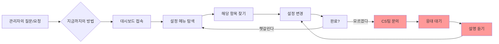
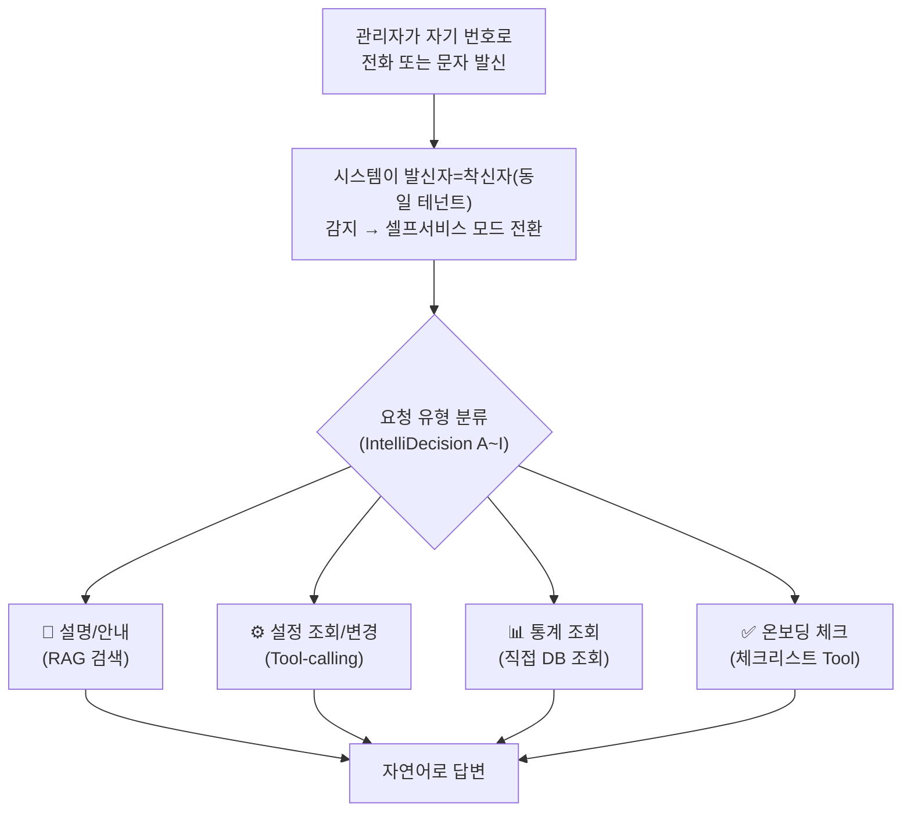
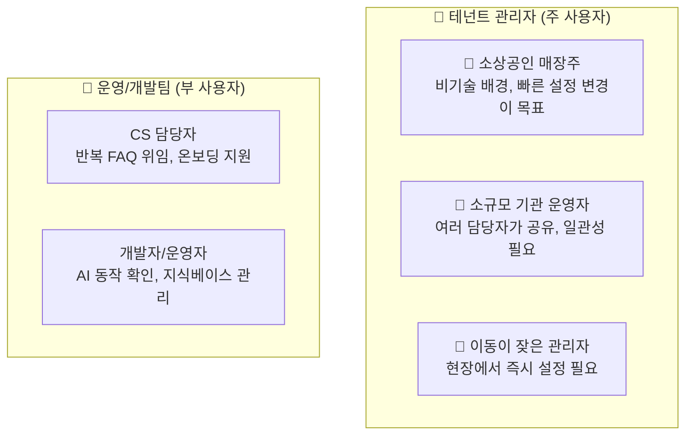
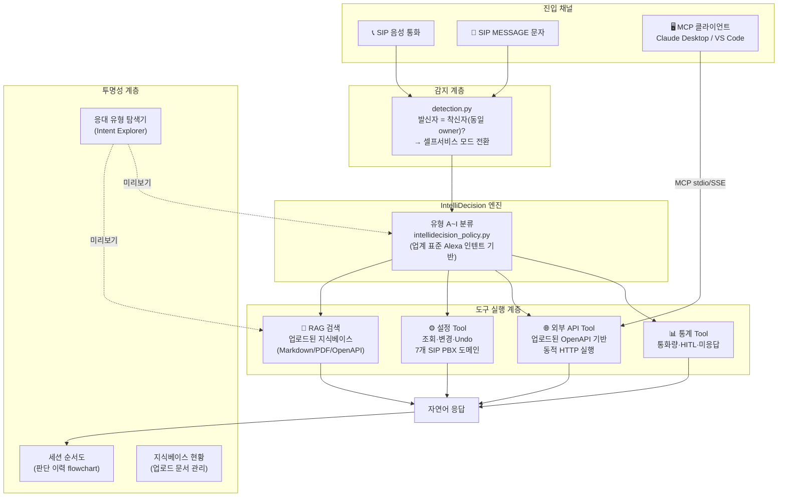
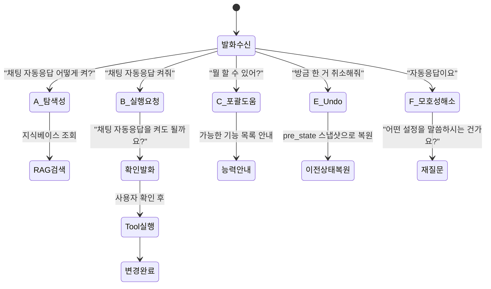
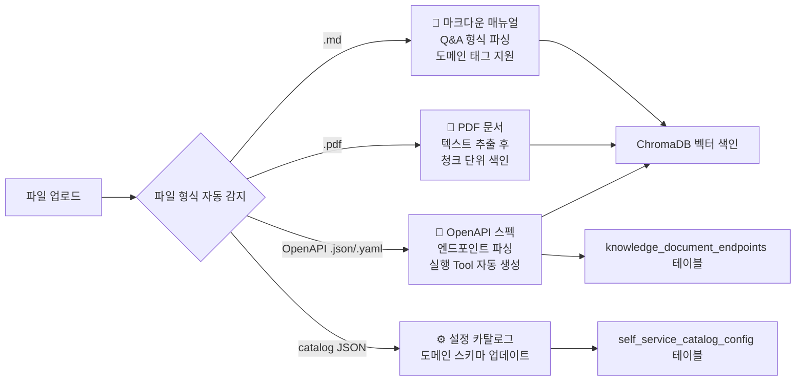
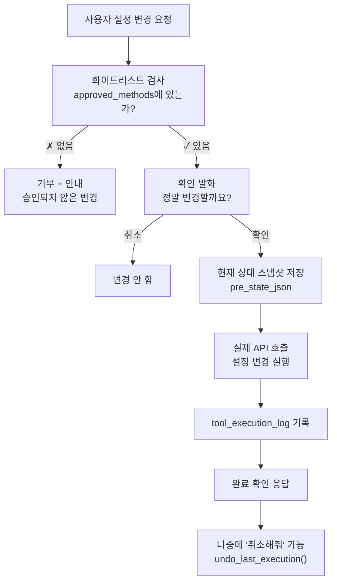

# SmartPBX AI 셀프서비스 AI 도우미 — 서비스 소개서

**문서 유형**: 서비스 소개서 (Service Introduction)  
**작성일**: 2026-08-10  
**버전**: 1.0  
**대상 독자**: 도입 검토 담당자, 테넌트 관리자, 운영팀

---

## 목차

1. [배경 — 우리가 해결하려는 문제](#1-배경)
2. [해결책과 장점](#2-해결책과-장점)
3. [누구를 위한 서비스인가](#3-타겟-유저)
4. [핵심 기능 상세](#4-핵심-기능)
5. [실제 사용 예시 — 유저 스토리](#5-유저-스토리)

---

## 1. 배경

### 1.1 기존의 문제

SmartPBX AI를 사용하는 테넌트 관리자들은 매일 이런 상황을 맞닥뜨립니다.

```
"채팅 자동응답은 어디서 켜요?"
"AI가 이번 달에 몇 건 응대했는지 보고 싶은데 어떻게 보나요?"
"착신 전환 설정을 바꾸고 싶은데 어느 메뉴인지 모르겠어요."
```

지금까지의 답은 항상 같았습니다 — **"프론트엔드 대시보드에 접속해서 해당 메뉴를 찾아보세요."**

하지만 현실은 다릅니다.

| 상황                               | 현실의 장벽                                    |
| ---------------------------------- | ---------------------------------------------- |
| 이동 중에 급히 설정을 바꿔야 한다  | 대시보드에 접속하려면 노트북/PC가 필요하다     |
| 신규 직원이 설정을 맡았다          | 7개 설정 메뉴를 처음부터 탐색해야 한다         |
| 어제 뭔가 바뀐 것 같다             | 변경 이력을 찾으려면 여러 페이지를 뒤져야 한다 |
| "AI가 잘 작동하는지" 확인하고 싶다 | 실제로 전화를 걸어봐야만 알 수 있다            |



### 1.2 문제의 규모

이것이 단순한 "불편함"이 아닌 이유가 있습니다.

> **Zendesk 실사용 데이터(2026)**: Hello Sugar(뷰티 살롱 체인)는 AI 기반 고객 셀프서비스 도입 후  
> **월 14,000달러 상당의 CS 비용을 절감**했으며, TeamSystem은 **반복 이메일 처리의 99%를 자동화**했습니다.  
> — [Zendesk AI Agents 한국어 공식 페이지](https://www.zendesk.kr/service/ai/ai-agents/)

반복적인 관리자 문의는 벤더 CS팀의 주요 업무 병목입니다. "채팅 자동응답 어떻게 켜요?" 같은 질문이 하루에도 수십 건씩 들어온다면, 그 시간은 모두 **부가가치가 없는 반복 작업**입니다.

---

## 2. 해결책과 장점

### 2.1 핵심 아이디어: 전화 한 통으로 전부 해결

```
관리자가 → 자기 번호로 → 자기 서비스에 전화/문자를 보내면
AI가 → "관리자 도우미 모드"로 전환하여 → 모든 것을 대화로 처리
```



### 2.2 무엇이 다른가 — 기존 방식 대비

| 기준               | 기존 방식 (대시보드)                      | 셀프서비스 AI 도우미           |
| ------------------ | ----------------------------------------- | ------------------------------ |
| **접근 방법**      | PC/노트북 필요, URL 직접 접속             | 전화 한 통, 문자 한 통         |
| **학습 곡선**      | 7개 설정 메뉴 숙지 필요                   | 자연어로 질문하면 됨           |
| **설정 변경 속도** | 메뉴 탐색 → 항목 찾기 → 변경 (평균 3~5분) | "채팅 자동응답 꺼줘" (30초)    |
| **변경 확인**      | 저장 후 실제로 작동하는지 별도 테스트     | 대화 중 AI가 변경 완료 확인    |
| **실수 복구**      | 이전 상태를 기억하거나 기록해두어야 함    | "방금 한 거 취소해줘" 한 마디  |
| **AI 동작 확인**   | 실제 고객 전화를 받아봐야 알 수 있음      | 응대 유형 탐색기에서 미리 확인 |

### 2.3 주요 장점

**① 즉시성** — 설정 메뉴를 찾을 필요 없이 말하면 됩니다.

**② 투명성** — AI가 어떤 지식을 근거로 어떻게 응대하는지 화면에서 미리 확인할 수 있습니다.

> "Fin은 라이브 배포 전에 시뮬레이션·회귀 테스트·수동 점검을 실행할 수 있는 완전한 테스트 스위트를 갖추고 있습니다."  
> — Intercom Fin 공식 문서 (12,000개 이상 기업에서 평균 76% 문제 해결률 달성)

우리 시스템의 **응대 유형 탐색기(Intent Explorer)**가 동일한 역할을 합니다 — 실제 전화를 걸기 전에 "이런 질문을 하면 AI가 어떻게 처리할지" 미리 볼 수 있습니다.

**③ 안전성** — 모든 설정 변경은 확인 발화를 거치며, 실수했을 때 즉시 되돌릴 수 있습니다.

> GoEx 연구(arXiv:2312.10929)가 제안하는 "undo/damage confinement" 원칙 — AI가 취한 행동은  
> 반드시 되돌릴 수 있어야 하며, 실행 전 현재 상태를 스냅샷으로 저장해야 한다.

**④ 도메인 비종속성** — OpenAPI 스펙 문서를 업로드하면, 외부 REST-API도 자연어로 조작할 수 있습니다.

---

## 3. 타겟 유저

### 3.1 주요 사용자 유형



### 3.2 사용자별 주요 니즈

| 사용자 유형     | 주요 니즈                                 | 이 시스템이 제공하는 것     |
| --------------- | ----------------------------------------- | --------------------------- |
| 소상공인 매장주 | "지금 당장 설정 바꾸고 싶다"              | 전화 한 통으로 즉시 변경    |
| 신규 직원       | "처음 써보는데 뭘 해야 할지 모르겠다"     | 온보딩 체크리스트 대화 안내 |
| 이동 중 관리자  | "이메일/PC 없이 처리하고 싶다"            | 통화/문자로 모든 설정 가능  |
| CS 담당자       | "반복 질문 줄이고 싶다"                   | 관리자가 스스로 해결 가능   |
| 개발자/운영자   | "AI가 실제로 어떻게 동작하는지 보고 싶다" | 응대 이력 순서도, 탐색기    |

---

## 4. 핵심 기능

### 4.1 전체 아키텍처 개요



---

### 4.2 IntelliDecision — 대화 의도 분류 엔진

사용자의 발화를 9가지 유형으로 분류하여 각각 최적화된 처리 경로로 라우팅합니다.



**왜 이 분류 방식인가 — 업계 표준 검증**

> Amazon Alexa의 모든 상용 스킬이 반드시 구현해야 하는 "표준 내장 인텐트"(Standard Built-in Intents)와  
> 우리의 유형 A~I는 구조적으로 1:1 대응됩니다.

| 우리 유형 | 개념        | Alexa 표준 인텐트          | 실사용 의미           |
| --------- | ----------- | -------------------------- | --------------------- |
| A         | 탐색성 질문 | `AMAZON.HelpIntent`        | "~은 어떻게 하나요?"  |
| C         | 포괄적 도움 | `AMAZON.HelpIntent` (범용) | "뭘 할 수 있어요?"    |
| D         | 정정        | 확인 단계 내 정정          | "아니, 그게 아니라…"  |
| E         | 실행 취소   | `AMAZON.CancelIntent`      | "방금 한 거 취소해줘" |
| F         | 모호성 해소 | `AMAZON.FallbackIntent`    | 불명확한 발화 재질문  |
| I         | 반복 확인   | `AMAZON.RepeatIntent`      | "다시 말해줘"         |

> **출처**: [Amazon Alexa Developer Docs — Standard Built-in Intents](https://developer.amazon.com/en-US/docs/alexa/custom-skills/standard-built-in-intents.html)  
> Alexa 인증을 받으려면 이 인텐트들을 반드시 지원해야 할 만큼 업계 표준으로 자리잡았습니다.

---

### 4.3 지식베이스 — 업로드만으로 AI가 새 내용을 학습

#### 지원 파일 형식



#### 지식 구조 — 2-hop 그래프 연결

단순 키워드 매칭이 아닌, **관계형 지식 그래프**로 연결합니다.


> **Microsoft Research GraphRAG**가 제안하는 "Local Search"(특정 엔티티에서 시작해 관련 노드로 순회)  
> 방식을 경량화해서 적용했습니다.  
> GraphRAG는 GitHub에서 37,000+ 스타를 받은 오픈소스로, Microsoft Azure AI Search에서 프로덕션에  
> 활용 중입니다.  
> — [Microsoft Research GraphRAG](https://microsoft.github.io/graphrag/)

**유형 C — 하이브리드 다중 도메인 검색**

"뭘 할 수 있어요?" 같은 포괄적 질문은 여러 도메인을 동시에 검색합니다.

```
🔍 "서비스 이용법 알려줘" 질문 시:

  ┌─ chat-relay 도메인    → "채팅 자동응답 설정 방법"
  ├─ ai-escalation 도메인 → "상담원 연결 방법"
  ├─ call-control 도메인  → "착신 전환 규칙"
  └─ persona 도메인       → "AI 응대 페르소나 설정"

  4개 도메인을 asyncio.gather로 병렬 검색 → 통합 응답 생성
```

---

### 4.4 설정 Tool-calling — 확인 후 실행, 언제든 취소 가능

#### 실행 보안 원칙



> **GoEx 연구(arXiv:2312.10929) "undo/damage confinement" 원칙** — AI가 실행한 모든 행동은  
> 롤백 가능해야 하며, 실행 전 상태를 반드시 저장해야 한다는 원칙을 시스템에 반영했습니다.

**지원하는 설정 도메인 (SIP PBX 내장)**

| 도메인          | 주요 설정 항목                               | 읽기 | 변경   |
| --------------- | -------------------------------------------- | ---- | ------ |
| `persona`       | AI 응대 이름, 응대 스타일, 에스컬레이션 모드 | ✅    | ✅      |
| `ai-escalation` | 상담원 전환 조건, 전환 내선번호              | ✅    | ✅      |
| `chat-relay`    | 채팅 자동응답 on/off, 자동응답 접두어        | ✅    | ✅      |
| `call-control`  | 착신 전환 규칙, 업무시간 설정                | ✅    | 조회   |
| `contacts`      | 연락처 목록                                  | ✅    | 조회   |
| `general`       | 테넌트 프로필(업종, 이름)                    | ✅    | 조회   |
| `integrations`  | Google Calendar 연동 상태                    | ✅    | 해제만 |

---

### 4.5 외부 REST-API 연동 — OpenAPI 업로드만으로 자연어 조작 가능

기존 SIP PBX 설정 외에, **OpenAPI 스펙 파일을 업로드하면** 임의의 외부 시스템도 자연어로 조작할 수 있습니다.

```
업로드: orders-api.yaml (주문 관리 API)
         ↓
자동 파싱: GET /orders/{id}, POST /orders, PUT /orders/{id}
         ↓
승인: PUT (수정 메서드) 명시적 승인
         ↓
사용: "주문 #1234 배송지 수정해줘" → PUT /orders/1234 자동 호출
```

> **시장 근거**: OpenAI GPT Actions, GitHub 437개 `openapi-to-mcp` 저장소(상위 4개 합계 5,700+⭐)가  
> "OpenAPI 스펙 하나로 서버 수정 없이 AI 인터페이스 생성" 패턴을 검증했습니다.  
> 특히 [mcp-link](https://github.com/automation-ai-labs/mcp-link)(622⭐)의 핵심 문구:  
> **"Zero Code Modification"** — 원본 API 코드를 한 줄도 바꾸지 않습니다.

---

### 4.6 응대 투명성 — AI가 왜 그렇게 답했는지 확인

#### 응대 유형 탐색기 (Intent Explorer)

실제 전화를 걸기 전에 "이 질문을 하면 어떻게 처리될지" 미리 확인합니다.

```
┌────────────────────────────────────────────────────────┐
│  AI 에이전트 › 응대 투명성 › 응대 유형 탐색기           │
├────────────────────────────────────────────────────────┤
│  [A 탐색성] [B 실행요청] [C 포괄도움] ... [I 반복확인]  │
├────────────────────────────────────────────────────────┤
│  유형 A · 탐색성 질문                                   │
│  질문 예시:                                             │
│  ○ "채팅 자동응답 어떻게 켜?"    [RAG 필요] [Tool 불필요]│
│  ○ "통화 이력 몇 건 있어?"      [RAG 필요] [Tool 필요]  │
│                                                        │
│  ┌──────────────────────────────────────────────────┐ │
│  │ 🔍 이 질문은 이렇게 처리될 예정이에요              │ │
│  │                                                  │ │
│  │  관련 지식 문서:                                  │ │
│  │  📄 "채팅 자동응답 설정 방법" (관련도 92%)         │ │
│  │  📄 "chat-relay 설정 항목" (관련도 78%)           │ │
│  │                                                  │ │
│  │  이어서 참고하는 화면:                             │ │
│  │  설정 메뉴 → 조직·채팅 → 채팅·SIP MESSAGE          │ │
│  │                                                  │ │
│  │  ※ 이건 예측이며 실제 답변은 실제 대화에서 확인    │ │
│  │  [ 이대로 실제로 물어보기 → ]                     │ │
│  └──────────────────────────────────────────────────┘ │
└────────────────────────────────────────────────────────┘
```

#### 세션 순서도 (응대 이력 Flowchart)

실제로 이루어진 대화가 어떤 흐름으로 처리됐는지 시각적으로 확인합니다.

```
세션 2026-08-10 14:32 (음성 통화, 3턴)

  턴 1 ──────────────────────────────────────────────
  👤 "채팅 자동응답 어떻게 켜?"
  🤖 유형 A (탐색성) | 📄 지식 2건 참고 | ⏱ 1.2초
  "설정 메뉴 → 조직·채팅에서 채팅·SIP MESSAGE를 선택하신 후..."

  턴 2 ──────────────────────────────────────────────
  👤 "그냥 켜줘"
  🤖 유형 B (실행요청) → 확인 발화
  "채팅 자동응답을 켤까요?"

  턴 3 ──────────────────────────────────────────────
  👤 "응"
  🤖 유형 B (실행요청 확인) | ✅ message_ai_reply_enabled = true
  "채팅 자동응답을 켰습니다."
```

> **Intercom Fin의 "완전한 테스트 스위트"** 개념을 현실화한 것입니다 — 테스트 환경이 아닌  
> 실제 운영 환경의 모든 응대가 그 자체로 검증 데이터가 됩니다.

---

### 4.7 MCP 클라이언트 연결 (Claude Desktop / VS Code)

업로드한 OpenAPI 기반 Tool을 Claude Desktop이나 VS Code Copilot에서도 자연어로 사용할 수 있습니다.

```
[연결 방법 — Claude Desktop]

claude_desktop_config.json:
{
  "mcpServers": {
    "my-service-api": {
      "command": "python",
      "args": ["-m", "src.mcp_gateway.server", "--owner", "9001"],
      "cwd": "/path/to/sip-pbx"
    }
  }
}
```

연결 후 Claude에서 바로 사용:

```
나: "주문 #1234 상태가 어때?"
Claude: [Tool 호출: GET /orders/1234]
        "주문 #1234는 현재 배송 중이며 내일 오전 도착 예정입니다."

나: "배송지 바꿔줘, 서울 강남구 테헤란로 123"
Claude: [Tool 호출: PUT /orders/1234, pre_state 저장 완료]
        "배송지를 변경했습니다."

나: "아 잠깐, 취소해줘"
Claude: [Tool 호출: undo_last_change]
        "이전 배송지로 되돌렸습니다."
```

---

## 5. 유저 스토리

### 스토리 1: 소상공인 사장님 — 바쁜 점심시간에 설정 변경

**배경**: 카페 사장님 A씨. AI 채팅 자동응답이 켜져 있는데, 오늘 직원들이 많아서 직접 응대할 수 있어 잠깐 꺼두고 싶습니다. 지금은 주방에서 음식 준비 중이라 컴퓨터 앞에 앉을 수가 없습니다.

```
시나리오: 자기 번호로 자기 매장 번호에 문자 전송

━━━━━━━━━━━━━━━━━━━━━━━━━━━━━━━━━━━━━━
A씨: 채팅 자동응답 꺼줘

AI: 현재 채팅 자동응답이 켜져 있어요.
    꺼드릴까요?

A씨: 응

AI: 채팅 자동응답을 껐습니다. ✅
    (message_ai_reply_enabled: true → false)

━━━━━━━━━━━━━━━━━━━━━━━━━━━━━━━━━━━━━━
소요 시간: 약 30초
기존 방식: PC 접속 → 설정 메뉴 탐색 → 변경 (약 3~5분)
```

저녁에 다시 켜고 싶을 때:

```
A씨: 아까 꺼놓은 자동응답 다시 켜줘

AI: 채팅 자동응답을 켰습니다. ✅
```

---

### 스토리 2: 신규 직원 온보딩 — "처음인데 뭐부터 해야 해요?"

**배경**: 소형 의원의 원무 담당 직원 B씨. 어제 입사했고 SmartPBX AI를 처음 씁니다. 초기 설정이 제대로 되어 있는지 모르는 상태입니다.

```
━━━━━━━━━━━━━━━━━━━━━━━━━━━━━━━━━━━━━━
B씨: 안녕하세요, 저 새로 왔는데 설정이 맞는지 
     확인해 줄 수 있어요?

AI: 안녕하세요! 초기 설정 현황을 확인해 드릴게요.

    ✅ 완료된 항목:
    - AI 페르소나 이름: "서울내과 도우미"
    - 채팅 자동응답: 켜져 있음

    ⚠️ 아직 설정 안 된 항목:
    - 에스컬레이션 내선번호 (상담원 연결 번호)
    - Google Calendar 연동 (예약 일정 동기화)

    어떤 것부터 설정해 드릴까요?

B씨: 상담원 연결 번호 어떻게 설정해요?

AI: 상담원 연결 번호는 AI가 직접 답하기 어려운
    문의가 왔을 때 연결할 전화번호예요.
    
    설정 메뉴 → AI 에스컬레이션에서 변경하시거나,
    저한테 "상담원 번호를 010-xxxx-xxxx로 바꿔줘"
    라고 말씀해 주세요.

━━━━━━━━━━━━━━━━━━━━━━━━━━━━━━━━━━━━━━
```

---

### 스토리 3: 운영자 — AI 동작을 확인하고 싶다

**배경**: 의류 쇼핑몰 운영팀 C씨. 상품 문의 매뉴얼을 업로드했는데 AI가 제대로 안내하는지 확인하고 싶습니다.

**단계 1: 매뉴얼 업로드**

```
웹 화면에서:
AI 에이전트 → 지식베이스 → 지식 업로드
→ FAQ_상품문의.md 파일 업로드
→ "12개 Q&A 항목이 색인되었습니다" ✅
```

**단계 2: 응대 유형 탐색기로 미리 확인**

```
AI 에이전트 → 응대 투명성 → 응대 유형 탐색기

[A 탐색성] 탭 선택
"반품 어떻게 해요?" 입력

→ 결과 미리보기:
   📄 "반품 정책 안내" (관련도 89%)
   📄 "교환 처리 절차" (관련도 71%)
   
   "이대로 실제로 물어보기 →" 클릭
```

**단계 3: 실제 채팅 패널에서 확인**

```
GlobalSmsDock에서 자기 번호로 발송:

C씨: 반품하고 싶어요

AI: 반품은 수령일로부터 7일 이내에 가능합니다.
    미개봉 상품에 한해 무상 반품 처리되며,
    고객센터(1588-xxxx)로 연락 주시면...

✅ 업로드한 매뉴얼 내용이 정확히 반영됨 확인
```

**단계 4: 응대 이력 확인**

```
AI 에이전트 → 응대 투명성 → 최근 응대 세션

세션 2026-08-10 15:14
 턴 1: A(탐색성) | 📄 2건 참고 | ⏱ 1.4초
        "반품 어떻게 해요?"
```

---

### 스토리 4: 외부 REST-API 연동 — 주문 관리 시스템과 연결

**배경**: 식당 체인 운영팀 D씨. 주문 관리 시스템(POS)이 있고, REST-API 문서(OpenAPI)를 갖고 있습니다. 전화로 주문 상태를 바로 확인하고 싶습니다.

**설정 과정 (1회성)**

```
1. AI 에이전트 → 지식베이스 → 지식 업로드
2. orders-api.yaml 업로드
3. PUT/PATCH/DELETE 메서드 → 명시적 승인 버튼 클릭
4. 완료
```

**이후 매일 사용**

```
━━━━━━━━━━━━━━━━━━━━━━━━━━━━━━━━━━━━━━
D씨: (전화로) 오늘 주문 현황 알려줘

AI: [GET /orders?date=today 호출]
    오늘 접수된 주문은 총 47건입니다.
    - 처리 완료: 38건
    - 처리 중: 9건
    - 취소 요청: 2건

D씨: 주문 번호 2847번 취소해줘

AI: 주문 #2847 (김치찌개 2인분, 35,000원)을
    취소할까요?

D씨: 응

AI: [PUT /orders/2847 {status: "cancelled"} 호출]
    [pre_state: {status: "processing"} 저장]
    주문 #2847을 취소했습니다. ✅
    
    취소가 잘못된 경우 "취소 되돌려줘"라고
    말씀해 주세요.

━━━━━━━━━━━━━━━━━━━━━━━━━━━━━━━━━━━━━━
```

---

## 부록 A: 참고 문헌 및 연구 근거

| 기능                             | 참고 자료                                                                                                                   | 핵심 데이터                                                                 |
| -------------------------------- | --------------------------------------------------------------------------------------------------------------------------- | --------------------------------------------------------------------------- |
| 대화 의도 분류 (IntelliDecision) | [Amazon Alexa 표준 내장 인텐트](https://developer.amazon.com/en-US/docs/alexa/custom-skills/standard-built-in-intents.html) | 모든 상용 Alexa Skills가 의무 구현해야 하는 9개 인텐트와 1:1 대응           |
| 지식베이스 청킹 품질             | [Anthropic Contextual Retrieval](https://www.anthropic.com/news/contextual-retrieval) (2024-09)                             | Contextual Embeddings: 검색 실패율 35% 감소 (5.7%→3.7%)                     |
| AI 고객 응대 성과                | [Intercom Fin](https://fin.ai/)                                                                                             | 12,000+ 기업 평균 문제 해결률 76%, 엔지니어링 리소스 없이 노코드 관리       |
| 고객사 실사용 지표               | [Zendesk AI Agents](https://www.zendesk.kr/service/ai/ai-agents/)                                                           | TeamSystem 자동화율 80%·반복 이메일 99%, Hello Sugar 월 $14,000 절감        |
| hop 기반 연계 검색               | [Microsoft GraphRAG](https://microsoft.github.io/graphrag/)                                                                 | GitHub 37,000+⭐, 질문 유형에 따른 최적 그래프 순회 전략(Local/Global/DRIFT) |
| 지식 그래프 + 벡터DB 하이브리드  | [Glean 엔터프라이즈 AI](https://www.glean.com/blog/knowledge-graph-vs-vector-database)                                      | "둘 중 하나가 아니라 둘 다" — 관계 추론 + 의미 유사도 결합                  |
| 대화 주도권 이론                 | Jurafsky & Martin "Speech and Language Processing" §26                                                                      | Mixed-Initiative Dialogue 이론 — 시스템/사용자 주도권 혼합 최적화           |
| 외부 API 자연어 연동             | [mcp-link](https://github.com/automation-ai-labs/mcp-link), OpenAPI-to-MCP 오픈소스 437개                                   | "Zero Code Modification" — 원본 API 수정 없이 자연어 인터페이스 생성        |
| AI 실행 안전성                   | GoEx 연구 arXiv:2312.10929                                                                                                  | "undo/damage confinement" — AI 행동은 반드시 롤백 가능해야 함               |
| 의미 기반 초고속 라우팅          | [Semantic Router](https://github.com/aurelio-labs/semantic-router) (GitHub 3,800+⭐)                                         | IEEE GlobeCom 2024 5G 통신망 의도 분류, 콜센터 10ms 저지연 라우팅 실사례    |

---

*최종 업데이트: 2026-08-10*
