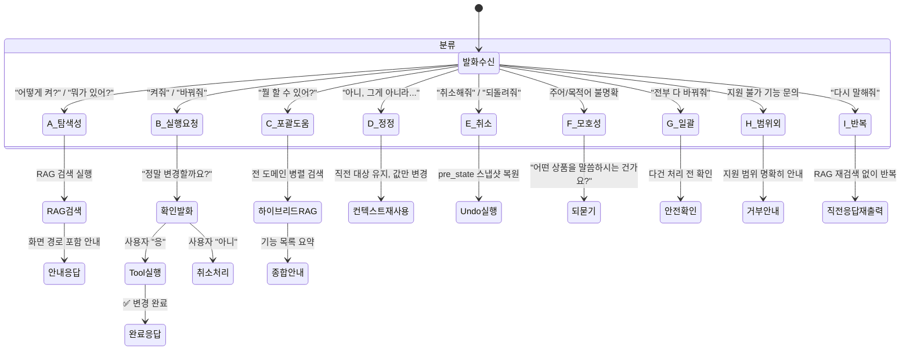
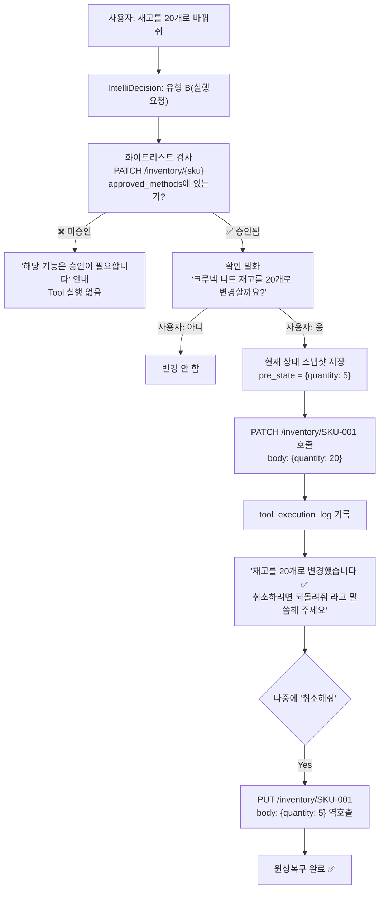
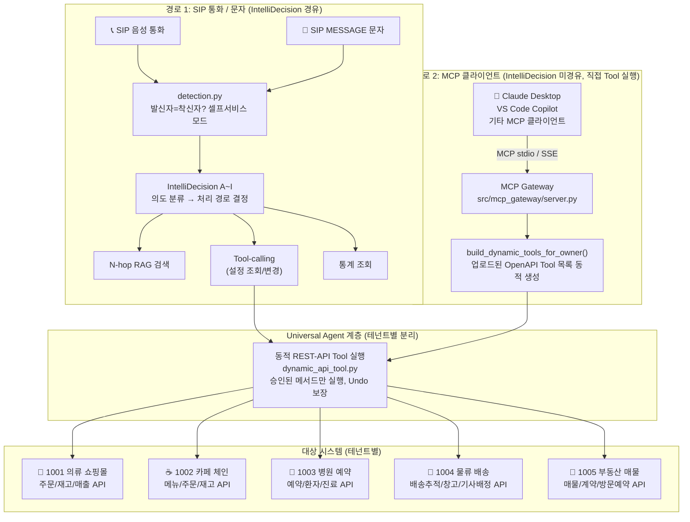

# AI 서비스 도우미 (AI Service Agent) — 서비스 소개서

**문서 유형**: 서비스 소개서 (Service Introduction)
**작성일**: 2026-08-10
**버전**: 3.0
**대상 독자**: 도입 검토 담당자, 개발팀, 운영팀, 비기술 이해관계자

---

## 목차

1. [배경 및 개발 경위](#1-배경-및-개발-경위)
2. [핵심 기능 상세](#2-핵심-기능-상세)
   - 2.1 IntelliDecision — 대화 의도 분류 엔진
   - 2.2 N-hop RAG — 관계형 지식 그래프 검색
   - 2.3 Tool-calling — 실제 API 실행 (Undo 보장)
   - 2.4 지식베이스 구성 — 업로드 방법 상세
3. [아키텍처](#3-아키텍처)
4. [범용 REST-API 연동 — 활용 방안](#4-범용-rest-api-연동--활용-방안)
5. [MCP 연동 — AI 생태계 확장](#5-mcp-연동--ai-생태계-확장)
6. [A-Z 완전 사용 가이드 — 처음부터 끝까지](#6-a-z-완전-사용-가이드--처음부터-끝까지)
7. [참고 문헌](#7-참고-문헌)

---

## 1. 배경 및 개발 경위

### 1.1 출발점 — 통화매니저 CS 문의 급증

통화매니저 서비스를 운영하면서 CS 고객센터에 서비스 이용 문의가 집중되는 문제가 있었다.

```
"채팅 자동응답은 어떻게 켜나요?"         → CS 팀 응대 필요
"AI가 이번 달 몇 건 응대했나요?"         → CS 팀 응대 필요
"착신 전환 설정 메뉴가 어딘지 모르겠어요" → CS 팀 응대 필요
```

반복적인 이 문의들이 CS 리소스를 소모하고, 관리자는 시스템을 제대로 활용하지 못하는 문제가 이어졌다.

**해결 방향**: 자연어로 대화하면 서비스 안내·설정 조회·실제 설정 변경까지 처리해주는 **AI 서비스 도우미 Agent**를 구축한다.

### 1.2 핵심 아이디어 세 가지

| 목표 | 기술 수단 | 효과 |
|---|---|---|
| 서비스 이용 안내 | N-hop RAG + 화면 경로 안내 | 메뉴를 몰라도 자연어 질문으로 해결 |
| 실제 설정 조회/변경 | Tool-calling (API 직접 호출) | 대화로 설정 변경, 실수 시 Undo |
| 원활한 대화 흐름 | IntelliDecision (의도 분류) | 9가지 대화 패턴을 자동 인식 |

### 1.3 발전 — 도메인 비종속 Universal Agent로

개발을 진행하면서 중요한 전환점이 생겼다.

> **통화매니저에만 쓰기엔 아깝다.
> 매뉴얼 파일과 REST-API 스펙만 있으면 어떤 서비스든 동일하게 동작한다.**

```
[Before] 통화매니저 전용 AI 도우미
    ↓ 아키텍처 전환
[After]  매뉴얼 + REST-API 스펙 주입 →
         어떤 시스템이든 제어 가능한
         Client-Centric Universal Agent
```

이 전환이 이 시스템의 핵심 차별점이다.

---

## 2. 핵심 기능 상세

### 2.1 IntelliDecision — 대화 의도 분류 엔진

사용자의 모든 발화를 **9가지 유형(A~I)**으로 자동 분류하여 최적 처리 경로로 라우팅한다.
LLM이 매 턴마다 프롬프트에 명시된 유형 정의를 참조해 판정한다(키워드 매칭 없음).

> **업계 표준 검증**: Amazon Alexa의 모든 상용 스킬이 **의무 구현**해야 하는
> "표준 내장 인텐트(Standard Built-in Intents)"와 우리의 유형 A~I는 구조적으로 1:1 대응된다.
> Alexa 인증 요건이므로 업계에서 수십억 건의 대화를 통해 검증된 분류 체계다.
> — [Amazon Alexa Developer Docs — Standard Built-in Intents](https://developer.amazon.com/en-US/docs/alexa/custom-skills/standard-built-in-intents.html)

#### 유형별 상태 전이 다이어그램



#### 유형별 대표 질문 예시

| 유형 | 이름 | 대표 질문 예시 | 처리 방식 |
|---|---|---|---|
| **A** | 탐색성 | "채팅 자동응답 어떻게 켜?" / "재고 부족 상품 어디서 봐?" / "착신 전환 메뉴가 어딘지 모르겠어" | RAG 검색 → 화면 경로 안내 |
| **B** | 실행요청 | "채팅 자동응답 켜줘" / "ORD-1042 배송중으로 바꿔줘" / "에스컬레이션 번호를 010-1234-5678로 변경해줘" | 확인 발화 → Tool 실행 → Undo 가능 |
| **C** | 포괄적 도움 | "이 도우미로 뭘 할 수 있어?" / "관리자 사이트에서 할 수 있는 거 다 알려줘" | 전 도메인 병렬 RAG → 종합 안내 |
| **D** | 정정 | "배송중이 아니라 배송완료로 바꿔줘" / "20개 말고 15개로" | 직전 맥락 재사용, 값만 수정 |
| **E** | 실행 취소 | "방금 한 거 취소해줘" / "되돌려줘" / "실수했어" | pre_state 스냅샷으로 원복 |
| **F** | 모호성 해소 | "그거 바꿔줘"(대상 불명) / "재고 바꿔줘"(상품 미특정) | 구체 정보 재질문 |
| **G** | 일괄 처리 | "재고 부족 상품 전부 20개로 채워줘" / "결제완료 주문 전부 배송준비중으로" | 안전 확인 후 다건 처리 |
| **H** | 범위 외 | "환불 처리해줘"(미지원) / "회원 등급 바꿔줘"(API 없음) | 지원 불가 명확히 안내, 오호출 없음 |
| **I** | 반복 요청 | "다시 말해줘" / "방금 뭐라고 했지?" | 직전 응답 재출력 |

---

### 2.2 N-hop RAG — 관계형 지식 그래프 검색

단순한 키워드 검색이 아니다. 문서 → 도메인 → 화면 → 실행 가능 여부까지 **그래프를 따라 순회**하며 맥락 있는 답변을 생성한다.

> **Microsoft Research GraphRAG** (GitHub 37,000+⭐)가 제안하는
> "질문 유형에 따른 최적 그래프 순회 전략(Local/Global/DRIFT Search)"을 경량화해 적용했다.
> 엔터티 자동추출·Leiden 클러스터링의 복잡도 없이 명시적 관계 스키마로 동일한 효과를 낸다.
> — [Microsoft GraphRAG](https://microsoft.github.io/graphrag/)

#### 데이터 구성 구조

```
┌─────────────────────────────────────────────────────────────────┐
│  ChromaDB (벡터 스토어)                                          │
│                                                                  │
│  각 문서 청크의 메타데이터:                                       │
│  ┌──────────────────────────────────────────────┐               │
│  │ owner: "1001"                                │ ← 테넌트 격리 │
│  │ doc_type: "knowledge_document"               │ ← 문서 유형   │
│  │ related_domain: "inventory-management"       │ ← 도메인 태그 │
│  │ section_title: "§3 재고 현황 필터 기능"       │ ← 섹션 제목   │
│  │ text: "재고 부족 상품은 재고관리 화면에서..." │ ← 실제 내용   │
│  └──────────────────────────────────────────────┘               │
└─────────────────────────────────────────────────────────────────┘
         │
         │ (1-hop) 벡터 유사도 검색
         ▼
┌─────────────────────────────────────────────────────────────────┐
│  knowledge_graph.py (관계 그래프)                                │
│                                                                  │
│  노드 유형:                                                      │
│  manual_qa ──relates_to──► catalog_domain                        │
│  catalog_domain ──rendered_by──► frontend_screen                 │
│  frontend_screen ──writable──► intent_type                       │
│  document ──relates_to──► api_endpoint                           │
└─────────────────────────────────────────────────────────────────┘
```

#### 실제 검색 흐름 (예: "재고 부족한 상품 어떻게 봐?")

```
질문: "재고 부족한 상품 어떻게 봐?"
│
├─ 【1-hop】 ChromaDB 벡터 검색
│   쿼리 임베딩 → 코사인 유사도 계산
│   ┌────────────────────────────────────────────────────────┐
│   │ 매칭 결과:                                              │
│   │ ① "§3 재고 현황 필터 기능"   유사도: 0.89             │
│   │    related_domain: inventory-management                 │
│   │ ② "§1 서비스 소개 - 재고관리" 유사도: 0.71             │
│   │    related_domain: inventory-management                 │
│   └────────────────────────────────────────────────────────┘
│
├─ 【2-hop】 도메인 → 화면 연결 (knowledge_graph.traverse_graph)
│   inventory-management 도메인 조회
│   ┌────────────────────────────────────────────────────────┐
│   │ 연결된 화면(screen):                                    │
│   │   화면명: "재고관리"                                    │
│   │   nav_hint: "상품관리 메뉴 → 재고현황 탭               │
│   │              → 필터: 재고수량 조건 설정"               │
│   └────────────────────────────────────────────────────────┘
│
└─ 【3-hop】 실행 가능 여부 판단
    inventory-management 도메인 writable 여부 확인
    ┌────────────────────────────────────────────────────────┐
    │ PATCH /inventory/{sku}  → 승인됨 ✅ → Tool 호출 가능  │
    │ IntelliDecision 유형: A(탐색성) = 안내만              │
    │                       B(실행성) = Tool 실행 가능      │
    └────────────────────────────────────────────────────────┘

최종 응답:
"재고 부족한 상품은 [상품관리 메뉴 → 재고현황 탭]에서 확인하실 수 있어요.
 재고수량 필터를 설정하시면 특정 수량 이하 상품만 모아볼 수 있습니다.
 원하시면 제가 직접 재고를 수정해드릴 수도 있어요!"
```

#### 유형 C 하이브리드 검색 (다중 도메인 병렬)

"뭘 할 수 있어?" 같은 포괄적 질문은 모든 도메인을 동시에 검색한다.

```
질문: "이 관리자 사이트에서 뭘 할 수 있는지 알려줘"
│
└─ asyncio.gather() 병렬 실행:
   ├─ inventory-management 도메인 검색 → "재고 조회/수정"
   ├─ order-management 도메인 검색    → "주문 상태 변경"
   └─ sales-stats 도메인 검색         → "매출 통계 조회"

통합 응답:
"이 도우미로 할 수 있는 것들을 안내해 드릴게요!
 📦 재고 관리: 재고 현황 조회, 수량 수정
 📋 주문 관리: 주문 상태 조회, 배송 상태 변경
 📊 매출 통계: 일별/주별 매출 현황 조회
 더 궁금한 게 있으시면 편하게 말씀해 주세요!"
```

> **Glean 엔터프라이즈 AI** (엔터프라이즈 검색 업계 1위)의 Head of Product는
> "지식 그래프와 벡터DB 중 하나가 아니라 둘 다 사용해야 한다"고 명시했다 —
> 그래프는 **관계 추론**에, 벡터는 **의미 유사도**에 각각 강하기 때문이다.
> 우리 시스템은 이 두 계층을 결합한 하이브리드 아키텍처를 채택했다.
> — [Glean: Knowledge Graph vs Vector Database](https://www.glean.com/blog/knowledge-graph-vs-vector-database)

---

### 2.3 Tool-calling — 실제 API 실행 (Undo 보장)

#### 실행 보안 원칙 (화이트리스트 방식)



> **GoEx 연구(arXiv:2312.10929) "undo/damage confinement" 원칙** —
> AI가 실행한 모든 행동은 반드시 롤백 가능해야 하며, 실행 전 상태를 저장해야 한다.
> 이 원칙을 `tool_execution_log.pre_state_json`으로 구현했다.

---

### 2.4 지식베이스 구성 — 업로드 방법 상세

#### 지원하는 파일 형식 3가지

| 형식 | 파일 예 | 필수 포맷? | 생성 결과 |
|---|---|---|---|
| **마크다운 매뉴얼** | `manual.md` | ❌ 자유 형식 가능 | RAG 검색용 지식 (안내 전용) |
| **PDF 문서** | `guide.pdf` | ❌ 어떤 PDF든 | RAG 검색용 지식 (안내 전용) |
| **OpenAPI 스펙** | `api.yaml` | ✅ OpenAPI 3.x | RAG 지식 + **실제 Tool 실행** 가능 |

#### 마크다운 매뉴얼 — 두 가지 방식

**방식 A: 자유 형식 (바로 업로드 가능)**
```markdown
# 카페 오더 시스템 관리자 가이드

이 시스템에서는 메뉴 관리, 주문 처리, 재고 관리를 할 수 있습니다.

메뉴를 추가하려면 [메뉴관리] 탭에서 [+ 메뉴 추가] 버튼을 클릭합니다.
품절 메뉴는 해당 메뉴의 [품절처리] 버튼으로 표시할 수 있습니다.
```
→ PDF 단락 단위로 분리해 ChromaDB에 색인됨. RAG 검색 가능.

**방식 B: Q&A 구조화 형식 (정밀도 향상)**
```markdown
## 1. 메뉴 관리 {domain: menu-management}

**Q: 새 메뉴는 어떻게 추가하나요?**
A: 메뉴관리 탭 → [+ 메뉴 추가] 버튼 클릭 → 메뉴명, 가격, 카테고리 입력 → 저장

**Q: 품절된 메뉴를 처리하려면?**
A: 해당 메뉴 카드의 [품절처리] 버튼을 클릭하면 즉시 반영됩니다.
```
→ Q&A 단위로 분리, `{domain: menu-management}` 태그로 도메인 자동 연결.

**결론**: 어떤 형식도 업로드 가능하다. Q&A 구조화 형식은 N-hop RAG의 도메인 연결 정밀도를 높이지만, 일반 PDF나 자유 형식 마크다운도 RAG 검색에 즉시 활용된다.

#### OpenAPI 스펙 — Tool 실행 연동

```yaml
# 예: cafe-orders-api.yaml
openapi: "3.0.0"
info:
  title: 카페 오더 관리 API
  version: "1.0.0"
servers:
  - url: https://api.cafe-order.example.com
paths:
  /orders/{order_id}:
    get:
      summary: 주문 조회
    patch:
      summary: 주문 상태 변경  # ← 이 메서드를 승인하면 AI가 직접 호출
  /menu/{menu_id}/status:
    patch:
      summary: 메뉴 품절 처리   # ← 마찬가지로 승인 후 Tool 실행 가능
```

업로드하면:
1. 엔드포인트 자동 파싱 → `knowledge_document_endpoints` 테이블 저장
2. GET 메서드: 승인 없이 즉시 Tool 실행 가능 (조회)
3. PATCH/POST/PUT/DELETE: 명시적 승인 클릭 필요 (쓰기 화이트리스트)

> **시장 검증**: GitHub에 `openapi-to-mcp` 관련 저장소 **437개** 존재,
> OpenAI GPT Actions, [mcp-link](https://github.com/automation-ai-labs/mcp-link)(622⭐) 등
> "OpenAPI 스펙 하나로 AI 인터페이스 자동 생성" 패턴이 업계 표준으로 자리잡았다.
> 핵심 원칙: **"Zero Code Modification"** — 원본 API 서버를 한 줄도 수정하지 않는다.

---

## 3. 아키텍처

### 3.1 두 가지 접근 경로

**중요**: MCP 클라이언트와 SIP/SMS는 서로 다른 경로를 사용한다.



### 3.2 테넌트별 완전 분리

모든 데이터는 `owner` 필드로 테넌트 간 격리된다.

```
테넌트 1001 (의류 쇼핑몰)
  ├─ 지식베이스: 쇼핑몰 운영 매뉴얼 + 주문/재고 API 스펙
  ├─ Tool: PATCH /orders/{id}/status, PATCH /inventory/{sku}
  └─ RAG 검색: 이 테넌트 문서만 검색됨

테넌트 1002 (카페 체인)
  ├─ 지식베이스: 카페 운영 가이드 + 메뉴/주문 API 스펙
  ├─ Tool: PATCH /menu/{id}/status, POST /orders
  └─ RAG 검색: 이 테넌트 문서만 검색됨

→ 테넌트 간 데이터 교차 접근 불가능 (owner 필터 강제 적용)
```

---

## 4. 범용 REST-API 연동 — 활용 방안

### 4.1 시장 현황 — "어떤 시스템이든 AI로 조작하는" 시대

> **Intercom Fin** (12,000+ 기업 고객, 평균 문제 해결률 76%):
> "Fin은 비즈니스 목표, 모든 정책·규칙·운영 절차를 이해하도록 학습된다.
> 엔지니어링 리소스 없이 완전히 스스로 관리할 수 있는 유일한 Agent다."
> — [fin.ai](https://fin.ai/)

> **Zendesk AI Agent** 실사용 지표:
> - TeamSystem: 자동화율 **80%**, 반복 이메일 처리 **99%** 자동화
> - Hello Sugar(뷰티 살롱): 월 **$14,000** CS 비용 절감
> - Action Property Management: 자동 해결률 **80%**, 응답 대기시간 **81%** 단축
> — [Zendesk AI Agents](https://www.zendesk.kr/service/ai/ai-agents/)

### 4.2 활용 가능한 분야

| 분야 | 기존 방식 | AI 도우미 연동 후 |
|---|---|---|
| **소매/이커머스** | 담당자가 관리 화면 직접 조작 | "ORD-1234 배송중으로 바꿔줘" → 즉시 처리 |
| **의료/예약** | 전화·이메일로 예약 변경 요청 | "오늘 오후 3시 예약을 내일로 변경해줘" |
| **물류/배송** | ERP 시스템 직접 접속 | "SKU-888 재고 50개 입고 처리해줘" |
| **F&B 운영** | 메뉴판 직접 업데이트 | "아메리카노 품절 처리해줘" |
| **부동산** | 매물 관리 시스템 로그인 | "매물 ID 2847 계약완료로 변경해줘" |
| **인사/총무** | 그룹웨어 직접 접속 | "김철수 휴가 신청 승인해줘" |
| **IT 운영** | 모니터링 대시보드 접속 | "서버 A의 현재 CPU 사용률 알려줘" |

### 4.3 유저 스토리 — 범용 연동

**스토리 R-1: 카페 체인 운영팀**
```
상황: 오전 피크 타임, 매니저가 주방에서 근무 중

매니저: (문자로) "아메리카노 품절 처리해줘"

AI:  "아메리카노를 품절 처리할까요?"

매니저: "응"

AI:  [PATCH /menu/americano/status → {available: false}]
     "아메리카노를 품절 처리했습니다. ✅
      복구하려면 '아메리카노 품절 해제해줘'라고 말씀해 주세요."

소요 시간: 30초 | 기존 방식: PC → 로그인 → 메뉴 찾기 → 변경 (3~5분)
```

**스토리 R-2: 물류 창고 관리자**
```
상황: 현장 점검 중, 스마트폰으로 확인 필요

관리자: "SKU-2847 현재 재고가 몇 개야?"

AI:  [GET /inventory/SKU-2847]
     "크루넥 니트(네이비/XL) 현재 재고: 3개입니다.
      안전재고(10개) 이하입니다. 발주가 필요할 수 있어요."

관리자: "50개 발주 신청해줘"

AI:  "SKU-2847 크루넥 니트 50개 발주를 신청할까요?"

관리자: "응"

AI:  [POST /purchase-orders → {sku: "SKU-2847", qty: 50}]
     "발주 신청 완료! 주문번호 PO-9231로 처리되었습니다. ✅"
```

**스토리 R-3: 병원 원무팀**
```
상황: 전화 응대 중 예약 변경 요청

원무: "환자 김철수 오늘 오후 2시 예약 내일 같은 시간으로 변경해줘"

AI:  [GET /appointments?patient=김철수&date=today]
     "김철수 환자 오늘 오후 2시 예약을 확인했습니다.
      내일 오후 2시로 변경할까요?"

원무: "응"

AI:  [PATCH /appointments/APT-4521 → {date: "2026-08-11T14:00"}]
     "예약 변경 완료! 김철수 환자께 문자 안내가 발송됩니다. ✅"
```

---

## 5. MCP 연동 — AI 생태계 확장

### 5.1 MCP란 무엇인가

MCP(Model Context Protocol)는 Anthropic이 2024년 발표한 **AI 클라이언트-서버 표준 프로토콜**이다. 이 프로토콜을 통해 어떤 AI 앱(Claude, VS Code Copilot 등)에서도 우리 시스템의 Tool을 사용할 수 있다.

> **MCP의 폭발적 성장**:
> - Claude Desktop, VS Code GitHub Copilot, Cursor 등 주요 AI 앱이 MCP 지원
> - GitHub 437개 `openapi-to-mcp` 저장소 (2026년 기준)
> - [mcp-link](https://github.com/automation-ai-labs/mcp-link) (622⭐): "Zero Code Modification"
> - [openapi-mcp-server](https://github.com/janwilmake/openapi-mcp-server) (900⭐)
> - Twilio, Zapier 등 주요 SaaS 벤더가 공식 MCP 서버 출시

### 5.2 연결 방법 (1회 설정, 이후 자동)

```json
// Claude Desktop: claude_desktop_config.json
{
  "mcpServers": {
    "my-service-agent": {
      "command": "python",
      "args": ["-m", "src.mcp_gateway.server", "--owner", "1001"],
      "cwd": "/path/to/sip-pbx",
      "env": { "BOOKING_DB_PATH": "/path/to/data/booking.db" }
    }
  }
}
```

설정 후 Claude Desktop을 재시작하면 해당 테넌트의 모든 Tool이 자동으로 노출된다.

### 5.3 활용 가능한 시나리오

| 시나리오 | 기존 방식 | MCP 연동 후 |
|---|---|---|
| **개발자 워크플로** | 코딩 중 별도 대시보드 접속 | VS Code에서 코딩하면서 AI에게 바로 질문 |
| **마케터 업무** | 여러 시스템 탭 전환 | Claude에서 자연어로 전체 처리 |
| **임원 리포팅** | 데이터팀에 요청 → 대기 | "이번 달 매출 요약해줘" 즉시 답변 |
| **다중 시스템 통합** | 각 시스템 별도 접속 | 하나의 AI에서 여러 시스템 동시 제어 |
| **자동화 워크플로** | RPA/스크립트 개발 필요 | AI Agent가 자연어 지시로 실행 |

### 5.4 유저 스토리 — MCP 연동

**스토리 M-1: VS Code에서 개발하면서 바로 조회**
```
개발자가 VS Code에서 코드 작성 중

개발자: "@my-service-agent 지난주 주문 건수랑 환불 건수 알려줘"

AI (Copilot 내):
  [GET /stats/orders?period=last_week]
  [GET /stats/refunds?period=last_week]

  "지난주 데이터:
   📦 주문: 1,247건 (전주 대비 +12%)
   🔄 환불: 23건 (환불률 1.8%)"

개발자: "환불률이 높은 상품 카테고리가 뭐야?"

AI: [GET /analytics/refunds?group_by=category&period=last_week]
    "환불률 상위:
     1. 사이즈 관련 (여성복): 42%
     2. 색상 불일치 (니트): 28%
     3. 배송 손상 (잡화): 18%"

→ 컨텍스트 전환 없이 코딩 환경에서 그대로 업무 처리
```

**스토리 M-2: Claude Desktop에서 복잡한 워크플로 자동화**
```
마케터:
"이번 달 재고 부족 상품 목록 뽑아서, 재입고 예정이 있는 것들은
 웹사이트에 '재입고 예정' 배지 달아주고,
 아예 단종된 것들은 품절 처리해줘"

AI (Claude):
  1. [GET /inventory?filter=low_stock]
     → 24개 상품 확인

  2. [GET /products/{id}/restock_schedule] (24회 병렬 실행)
     → 재입고 예정: 15개, 단종: 9개

  3. "확인했습니다:
     - 재입고 예정 15개: 배지 추가 예정
     - 단종 9개: 품절 처리 예정
     진행할까요?"

  사용자: "응"

  4. [PATCH /products/{id}/badge] × 15회 (재입고 배지)
  5. [PATCH /products/{id}/status?status=discontinued] × 9회

  "완료! 재입고 배지 15개, 품절 처리 9개 처리했습니다. ✅"

→ 기존에 30분 걸리던 작업을 대화 3턴으로 처리
```

**스토리 M-3: 다중 시스템 통합 조회**
```
임원:
"이번 달 우리 쇼핑몰 매출이랑
 배송 지연율이랑
 고객 만족도를 한번에 알려줘"

AI (Claude):
  → my-service-agent (쇼핑몰 API): 매출 조회
  → delivery-agent (배송 API): 지연율 조회
  → crm-agent (CRM API): 만족도 조회
  (3개 MCP 서버 병렬 호출)

  "이번 달 종합 현황:
   💰 매출: 4억 2천만원 (전월 대비 +8%)
   🚚 배송 지연율: 2.3% (목표 3% 이하 달성 ✅)
   ⭐ 고객 만족도: 4.7/5.0"
```

---

## 6. A-Z 완전 사용 가이드 — 처음부터 끝까지

### 시나리오: 카페 오더 시스템 운영자 김사장님

김사장님은 카페 3곳을 운영하고 있다. 새로운 AI 도우미를 도입해서 스마트폰으로 주문/메뉴를 관리하고 싶다.

---

#### STEP 1: 매뉴얼 문서 작성 (10분)

김사장님이 아래와 같이 마크다운 파일을 작성한다.
**포맷을 맞출 필요 없다 — 그냥 알고 있는 내용을 쓰면 된다.**

```markdown
# 카페 오더 관리자 도우미 가이드

## 시스템 소개
이 시스템으로 메뉴 관리, 주문 처리, 매출 통계를 볼 수 있습니다.

**Q: 오늘 주문 현황은 어떻게 봐요?**
A: 주문관리 화면에서 날짜 필터를 '오늘'로 설정하면 당일 접수된 주문을 모두 확인할 수 있습니다.

**Q: 메뉴를 품절 처리하려면?**
A: 메뉴관리 → 해당 메뉴 선택 → [품절처리] 버튼 클릭. 앱에 즉시 반영됩니다.

**Q: 인기 메뉴 순위가 궁금할 때?**
A: 통계 → 메뉴별 판매량에서 기간별 인기 메뉴를 확인할 수 있습니다.

**Q: 아르바이트생 주문 실수를 취소하려면?**
A: 주문관리 → 해당 주문 선택 → [주문취소] 버튼. 결제 취소도 함께 처리됩니다.
```

파일명: `cafe-guide.md`

---

#### STEP 2: 파일 업로드 (2분)

웹 화면에서:
```
AI 에이전트 → 지식베이스 → 지식 업로드
→ cafe-guide.md 드래그앤드롭
→ "4개 Q&A 항목 색인 완료" ✅
```

업로드 완료 시 내부에서 일어나는 일:

```
cafe-guide.md
   │
   ▼ MarkdownManualAdapter 파싱
   │
   ├─ 청크 1: "오늘 주문 현황은 어떻게 봐요?"
   │           answer: "주문관리 화면에서 날짜 필터..."
   │           related_domain: "order-management"
   │
   ├─ 청크 2: "메뉴를 품절 처리하려면?"
   │           answer: "메뉴관리 → 해당 메뉴 선택..."
   │           related_domain: "menu-management"
   │
   ├─ 청크 3: "인기 메뉴 순위가 궁금할 때?"
   │           answer: "통계 → 메뉴별 판매량..."
   │           related_domain: "sales-stats"
   │
   └─ 청크 4: "주문 실수를 취소하려면?"
               answer: "주문관리 → 해당 주문 선택..."
               related_domain: "order-management"

   ↓ ChromaDB 벡터 색인
   각 청크를 임베딩(텍스트 → 숫자 벡터)으로 변환해 저장
```

---

#### STEP 3: OpenAPI 스펙 업로드 (선택, Tool 실행 연동 시)

카페 오더 시스템에 API가 있다면 스펙도 업로드:

```
AI 에이전트 → 지식 업로드
→ cafe-orders-api.yaml 업로드
→ "엔드포인트 8개 파싱 완료"

→ 쓰기 메서드 승인:
   ✅ PATCH /orders/{id}/status   (주문 상태 변경)
   ✅ PATCH /menu/{id}/available  (메뉴 품절/복구)
   ❌ DELETE /orders/{id}         (주문 삭제 — 미승인)
```

---

#### STEP 4: 실제 사용 (스마트폰 문자로)

**예시 대화 1 — 탐색성 질문 (유형 A)**

```
김사장: "아메리카노 오늘 몇 잔 팔렸어?"

   내부 처리:
   ① IntelliDecision: 유형 A (탐색성) 판정
   ② RAG 검색: "아메리카노" + "판매량" 쿼리
      → 청크 3 매칭 (유사도 0.84): "통계 → 메뉴별 판매량"
   ③ API Tool: GET /stats/menu?name=아메리카노&date=today
   ④ 응답 생성

AI: "오늘 아메리카노 판매량: 47잔 (전날 대비 +5잔)
     피크 시간대: 오전 8~10시 (23잔)
     통계 화면에서 더 자세히 확인하실 수 있어요!"
```

**예시 대화 2 — 실행 요청 (유형 B)**

```
김사장: "딸기라떼 품절 처리해줘"

   내부 처리:
   ① IntelliDecision: 유형 B (실행요청) 판정
   ② RAG 검색: "품절 처리" 쿼리
      → 청크 2 매칭 (유사도 0.91): "메뉴관리 → 품절처리 버튼"
   ③ Tool 준비: PATCH /menu/strawberry-latte/available (승인됨 ✅)
   ④ 확인 발화

AI: "딸기라떼를 품절 처리할까요?"
    [✅ 확인] [❌ 취소]

김사장: "응"

   ⑤ pre_state 저장: {available: true}
   ⑥ API 실행: PATCH /menu/strawberry-latte/available → {available: false}
   ⑦ 로그 기록

AI: "딸기라떼 품절 처리 완료! ✅
     앱에서 주문이 비활성화되었습니다.
     복구하려면 '딸기라떼 품절 해제해줘'라고 말씀해 주세요."
```

**예시 대화 3 — 실수 취소 (유형 E)**

```
김사장: "아 잠깐, 딸기라떼 다시 열어줘"

   내부 처리:
   ① IntelliDecision: 유형 E (취소) 판정
   ② pre_state 조회: {available: true}
   ③ 역호출: PATCH /menu/strawberry-latte/available → {available: true}

AI: "딸기라떼 품절 해제 완료! ✅
     다시 주문 가능 상태로 복구되었습니다."
```

**예시 대화 4 — 포괄적 도움 (유형 C)**

```
김사장: "이 도우미로 뭘 할 수 있어?"

   내부 처리:
   ① IntelliDecision: 유형 C (포괄적 도움) 판정
   ② 하이브리드 다중 도메인 검색 (asyncio.gather):
      order-management + menu-management + sales-stats 병렬 검색
   ③ 전체 기능 종합

AI: "제가 도와드릴 수 있는 것들이에요!

     📋 주문 관리
     · 오늘 주문 현황 조회
     · 주문 상태 변경 (준비중/완료/취소)

     🍵 메뉴 관리
     · 메뉴 품절/복구 처리
     · 인기 메뉴 순위 확인

     📊 매출 통계
     · 일별/주별 매출 조회
     · 메뉴별 판매량 분석

     더 궁금한 게 있으면 편하게 말씀해 주세요!"
```

---

## 7. 참고 문헌

| # | 기능 | 참고 자료 | 핵심 내용 |
|---|---|---|---|
| 1 | **IntelliDecision 유형 분류** | [Amazon Alexa Standard Built-in Intents](https://developer.amazon.com/en-US/docs/alexa/custom-skills/standard-built-in-intents.html) | 모든 상용 Alexa 스킬 의무 구현 9개 인텐트 — 업계 표준 검증 |
| 2 | **N-hop RAG** | [Microsoft GraphRAG](https://microsoft.github.io/graphrag/) (GitHub 37,000+⭐) | 질문 유형별 최적 그래프 순회 전략 (Local/Global/DRIFT Search) |
| 3 | **지식 그래프 + 벡터DB** | [Glean: Knowledge Graph vs Vector Database](https://www.glean.com/blog/knowledge-graph-vs-vector-database) | Head of Product: "둘 다 사용해야 한다" — 관계 추론 + 의미 유사도 결합 |
| 4 | **RAG 검색 품질** | [Anthropic Contextual Retrieval](https://www.anthropic.com/news/contextual-retrieval) (2024-09) | Contextual Embeddings: 검색 실패율 **35% 감소** (5.7%→3.7%) |
| 5 | **AI 고객 응대 성과** | [Intercom Fin](https://fin.ai/) | 12,000+ 기업, 평균 문제 해결률 **76%** |
| 6 | **실사용 CS 절감** | [Zendesk AI Agents](https://www.zendesk.kr/service/ai/ai-agents/) | TeamSystem 자동화율 80%, Hello Sugar 월 $14,000 절감 |
| 7 | **AI 실행 안전성 (Undo)** | GoEx arXiv:2312.10929 | "undo/damage confinement" — AI 행동은 반드시 롤백 가능해야 함 |
| 8 | **OpenAPI Universal Agent** | [mcp-link](https://github.com/automation-ai-labs/mcp-link) (622⭐), 437개 openapi-to-mcp 저장소 | "Zero Code Modification" — 서버 수정 없이 AI 인터페이스 생성 |
| 9 | **MCP 프로토콜** | Anthropic MCP 공식 문서, [Twilio 공식 MCP 서버](https://github.com/twilio-labs/mcp) | AI 클라이언트-서버 표준 프로토콜, 주요 AI 앱 일제 지원 |
| 10 | **의미 기반 라우팅** | [Semantic Router](https://github.com/aurelio-labs/semantic-router) (3,800+⭐) | IEEE GlobeCom 2024 5G 통신망 의도 분류, 콜센터 10ms 저지연 사례 |
| 11 | **대화 주도권 이론** | Jurafsky & Martin "Speech and Language Processing" §26 | Mixed-Initiative Dialogue — 시스템/사용자 주도권 혼합 최적화 이론 |
| 12 | **Routing 워크플로** | Anthropic "Building Effective Agents" (2024-12) | "관심사 분리 Routing"이 고객 지원 유형 분류의 업계 표준임을 명시 |

---

*최종 업데이트: 2026-08-10*
