# AI 서비스 도우미 (AI Service Agent) — 서비스 소개서

**문서 유형**: 서비스 소개서 (Service Introduction)
**작성일**: 2026-08-10
**버전**: 4.0
**대상 독자**: 도입 검토 담당자, 개발팀, 운영팀, 비기술 이해관계자

---

## 목차

1. [배경 및 개발 경위](#1-배경-및-개발-경위)
   - 1.1 출발점 — 통화매니저 CS 문의 급증
   - 1.2 핵심 아이디어 세 가지
   - 1.3 발전 — 도메인 비종속 Universal Agent로
   - 1.4 기반 기술 체계화 및 글로벌 레퍼런스
2. [활용 사례 — 이 시스템으로 무엇을 할 수 있나](#2-활용-사례--이-시스템으로-무엇을-할-수-있나)
   - 2.1 핵심 개념: 문서 업로드 → 즉시 사용
   - 2.2 테넌트 1001 — 통화매니저 서비스 도우미
   - 2.3 테넌트 1002 — 카페 오더 시스템 관리자
   - 2.4 테넌트 1003 — 소형 의원 예약 관리
   - 2.5 통신/네트워크 운영 — 무인 장애 접수·진단
   - 2.6 사내 IT 헬프데스크 자동화
   - 2.7 금융/공공 24/7 셀프서비스
   - 2.8 스마트 물류/배송 관제
   - 2.9 긴급 알림 및 대량 아웃바운드 콜 자동화
3. [핵심 기능 상세](#3-핵심-기능-상세)
   - 3.1 지식베이스 구성 — 설계 근거와 업로드 방법 상세
   - 3.2 N-hop RAG — 관계형 지식 그래프 검색
   - 3.3 Tool-calling — 실제 API 실행 (Undo 보장)
   - 3.4 IntelliDecision — 대화 의도 분류 엔진
4. [아키텍처](#4-아키텍처)
5. [범용 REST-API 연동 — 활용 방안](#5-범용-rest-api-연동--활용-방안)
6. [MCP 연동 — AI 생태계 확장](#6-mcp-연동--ai-생태계-확장)
7. [A-Z 완전 사용 가이드 — 처음부터 끝까지](#7-a-z-완전-사용-가이드--처음부터-끝까지)
8. [참고 문헌](#8-참고-문헌)

---

## 1. 배경 및 개발 경위

### 1.1 출발점 — 통화매니저 CS 문의 급증

통화매니저 서비스를 운영하면서 CS 고객센터에 서비스 이용 문의가 집중되는 문제가 있었다.

#### CS 문의 대분류 현황 (총 4,845건)

| 대분류              | 건수        | 비율       | 비고                           |
| ------------------- | ----------- | ---------- | ------------------------------ |
| 유통사 작업 요청    | 2,224건     | 46.0%      | 파트너사 대행 요청             |
| **서비스 이용**     | **1,083건** | **22.0%**  | **⬅ AI 도우미 직접 대응 가능** |
| 기타                | 1,038건     | 21.0%      |                                |
| 서비스 장애         | 467건       | 10.0%      | 기술 지원 필요                 |
| 데이터 복구 요청    | 27건        | 1.0%       |                                |
| 개발자 홈페이지 QnA | 6건         | 0.0%       |                                |
| **합계**            | **4,845건** | **100.0%** |                                |

전체 문의의 **22%(1,083건)** 가 서비스 이용 방법을 묻는 질문이다. 이 유형은 숙련된 상담원이 아니어도, 매뉴얼만 제대로 검색할 수 있으면 즉시 해결할 수 있다.

**해결 방향**: 자연어로 대화하면 서비스 안내·설정 조회·실제 설정 변경까지 처리해주는 **AI 서비스 도우미 Agent**를 구축한다.

### 1.2 핵심 아이디어 세 가지

| 목표                | 기술 수단                    | 효과                               |
| ------------------- | ---------------------------- | ---------------------------------- |
| 서비스 이용 안내    | N-hop RAG + 화면 경로 안내   | 메뉴를 몰라도 자연어 질문으로 해결 |
| 실제 설정 조회/변경 | Tool-calling (API 직접 호출) | 대화로 설정 변경, 실수 시 Undo     |
| 원활한 대화 흐름    | IntelliDecision (의도 분류)  | 9가지 대화 패턴을 자동 인식        |

### 1.3 발전 — 도메인 비종속 Universal Agent로

> **통화매니저에만 쓰기엔 아깝다.
> 매뉴얼 파일과 REST-API 스펙만 있으면 어떤 서비스든 동일하게 동작한다.**

이 전환이 이 시스템의 핵심 차별점이다.

---

### 1.4 기반 기술 체계화 및 글로벌 레퍼런스

#### 1.4.1 시장 성장 배경

> **Gartner (2024)**: 2026년까지 전 세계 고객 서비스 인터랙션의 **20%** 이상이 대화형 AI 에이전트에 의해 처리될 것으로 전망. CCaaS(Contact Center as a Service) 시장은 2027년까지 연평균 **17.9% CAGR** 성장 예측.

> **IDC (2024)**: 컨버세이셔널 AI(Conversational AI) 솔루션에 대한 전 세계 지출은 2025년 **197억 달러**를 돌파하며, 아태지역이 가장 빠른 성장세를 보임.

> **McKinsey Global Institute (2023)**: 생성형 AI 기술이 고객 운영(Customer Operations) 영역에서 연간 **2,300억~4,600억 달러**의 경제 가치를 창출할 수 있다고 분석. CS 상담원 생산성은 평균 **14% 향상** 가능.

#### 1.4.2 글로벌 선도 플랫폼 비교 매트릭스

| 기반 기술 영역                   | 글로벌 표준/선도 사례                                                                                   | 우리 시스템의 적용 방식 및 차별점                                                                            |
| -------------------------------- | ------------------------------------------------------------------------------------------------------- | ------------------------------------------------------------------------------------------------------------ |
| **SIP/PBX 음성 호 제어**         | Twilio Voice (SIP Trunking), Amazon Connect (WebRTC+SIP), Cisco CUBE                                    | 자체 SIP UA 구현 + RTP 실시간 스트리밍. 기존 교환기를 SIP Trunk로 연동, 서버 무교체 도입                     |
| **실시간 STT (음성→텍스트)**     | Google Cloud Speech-to-Text (Streaming), AWS Transcribe Streaming, Azure Cognitive Speech               | 스트리밍 STT 파이프라인으로 발화 종료 대기 없이 실시간 청크 처리. Pipecat 기반 VAD+STT 통합                  |
| **LLM 오케스트레이션**           | Google Cloud CCAI (Dialogflow CX + Vertex AI), Amazon Lex v2, OpenAI GPT-4o Realtime                    | LangGraph 기반 멀티-노드 파이프라인. IntelliDecision(9-type 의도 분류) + N-hop RAG + Tool-calling 3계층 구조 |
| **도메인 지식 연동 (RAG)**       | Salesforce Einstein Copilot (Data Cloud 벡터 검색), ServiceNow AI Search, Microsoft Copilot for Service | ChromaDB 벡터 스토어 + 명시적 관계 그래프(`knowledge_graph.py`). 파일 업로드 즉시 색인, 재배포 불필요        |
| **API 도구 통합 (Tool Calling)** | OpenAI GPT Actions (OpenAPI 스펙), Anthropic Claude Tool Use, Google Gemini Function Calling            | OpenAPI YAML 업로드 → 동적 Tool 자동 등록. 원본 서버 코드 **한 줄도 수정 안 함**                             |
| **에이전트 표준 프로토콜**       | Anthropic MCP (Model Context Protocol), OpenAI Swarm, LangChain Agent                                   | MCP 게이트웨이 탑재(§6). 동시에 SIP/SMS 음성 채널과 MCP 클라이언트 양방향 지원                               |
| **멀티테넌시 격리**              | Pinecone Namespaces, Weaviate Multi-Tenancy, Chroma Collections                                         | ChromaDB `where={"owner": tenant_id}` 필터 강제 적용. 테넌트 추가 시 코드 수정 없이 데이터만 업로드          |

#### 1.4.3 엔드투엔드 파이프라인 — SIP 음성호 → LLM 추론 → TTS/PBX 응답

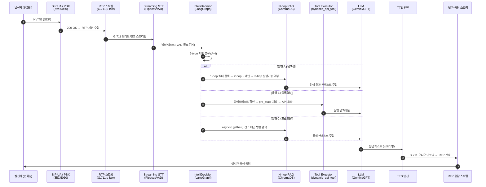

#### 1.4.4 ASCII 블록도 — 시스템 전체 구성

```
┌─────────────────────────────────────────────────────────────────────┐
│  입력 채널                                                           │
│  ┌─────────────┐  ┌─────────────┐  ┌──────────────────────────┐    │
│  │ SIP 음성 통화│  │ SIP MESSAGE │  │ MCP 클라이언트           │    │
│  │ (RTP/G.711) │  │ (문자 채널) │  │ (Claude / VS Code 등)   │    │
│  └──────┬──────┘  └──────┬──────┘  └────────────┬─────────────┘   │
│         └────────────────┴────────────────────────┘                 │
│                           │                                          │
│  ┌────────────────────────▼────────────────────────────────────┐    │
│  │  IntelliDecision (LangGraph)                                 │    │
│  │  STT → 9-type 의도 분류 → 라우팅                             │    │
│  └──────┬──────────────────────────────────┬────────────────────┘   │
│         │                                  │                         │
│  ┌──────▼──────┐                  ┌────────▼────────┐               │
│  │ N-hop RAG   │                  │ Tool Executor   │               │
│  │ ChromaDB    │                  │ dynamic_api_tool│               │
│  │ 지식 그래프 │                  │ + Undo 보장     │               │
│  └──────┬──────┘                  └────────┬────────┘               │
│         └──────────────┬──────────────────┘                         │
│                  ┌─────▼─────┐                                       │
│                  │ LLM 계층  │ Gemini / GPT-4o / Local LLM          │
│                  └─────┬─────┘                                       │
│                  ┌─────▼─────┐                                       │
│                  │ TTS → RTP │ 실시간 음성 합성 → 발신자 전달         │
│                  └───────────┘                                       │
└─────────────────────────────────────────────────────────────────────┘
```

---

## 2. 활용 사례 — 이 시스템으로 무엇을 할 수 있나

### 2.1 핵심 개념: 문서 업로드 → 즉시 사용

이 도우미는 **도메인에 종속되지 않는다.** 어떤 서비스든 매뉴얼과 API 스펙을 업로드하면, 그 서비스 전용 AI 도우미가 즉시 구성된다.

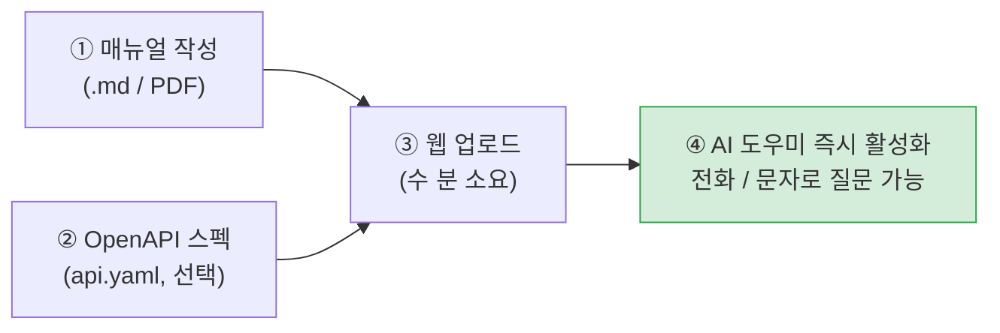

업로드한 순간부터 가능한 것:
- **자연어 안내**: 메뉴·화면 위치 설명 (예: "착신전환 설정 어디서 해?")
- **실시간 조회**: API를 통해 실제 데이터 조회 (예: "오늘 주문 몇 건이야?")
- **설정 변경**: 확인 후 실제 변경, 실수 시 Undo (예: "점심시간은 AI 응대하게 해줘")

---

### 2.2 테넌트 1001 — 통화매니저 서비스 도우미

**시나리오**: 통화매니저 서비스를 사용하는 사업자가 자기 번호(1001)로 전화/문자를 보내면 AI 도우미가 응대한다.

**구성 방법**: 통화매니저 매뉴얼.md + 통화매니저 API 스펙 업로드 → 완료.

#### 사례 A — 화면 안내 (유형 A: 탐색성)

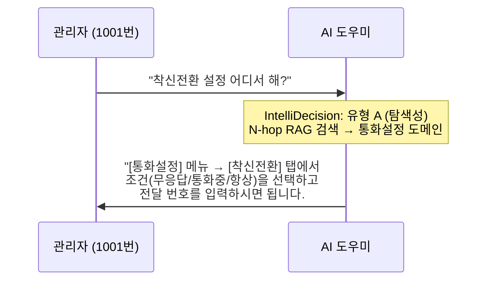

#### 사례 B — 설정 변경 (유형 B: 실행요청 + 슬롯 채우기)

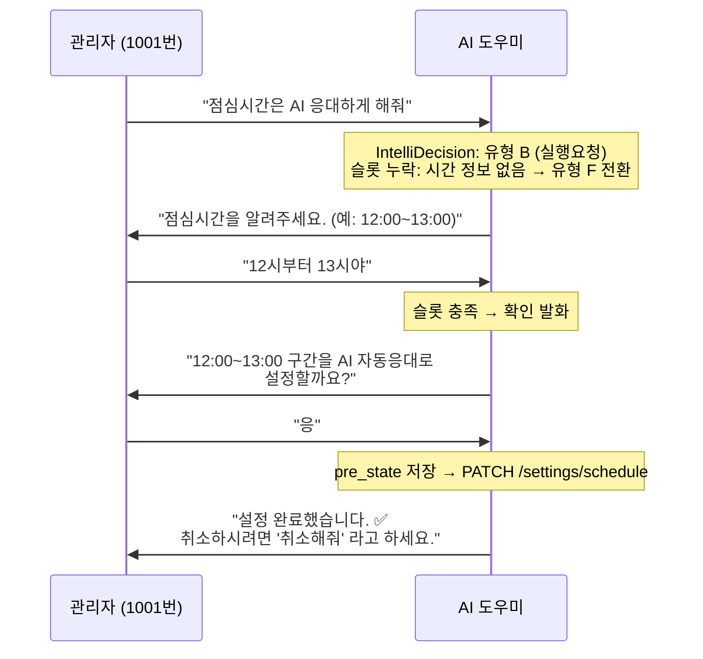

| 발화 유형 | 예시 질문                     | 처리 결과                |
| --------- | ----------------------------- | ------------------------ |
| 화면 안내 | "착신전환 설정 어디서 해?"    | 메뉴 → 탭 경로 안내      |
| 화면 안내 | "AI 응대 켜는 방법 알려줘"    | 설정 화면 경로 안내      |
| 설정 변경 | "점심시간은 AI 응대하게 해줘" | 시간 확인 후 스케줄 변경 |
| 설정 변경 | "부재중 문자 내용 바꿔줘"     | 내용 확인 후 템플릿 수정 |
| 현황 조회 | "오늘 부재중 통화 몇 건이야?" | API 조회 후 건수 답변    |

---

### 2.3 테넌트 1002 — 카페 오더 시스템 관리자

**시나리오**: 카페 오더 관리 시스템 운영자가 매장에서 스마트폰 문자로 주문·메뉴를 관리한다.

**구성 방법**: 카페 운영 매뉴얼.md + 카페 오더 API 스펙 (api.yaml) 업로드 → 완료.

#### 사례 A — 단건 품절 처리 (유형 B: 실행요청)

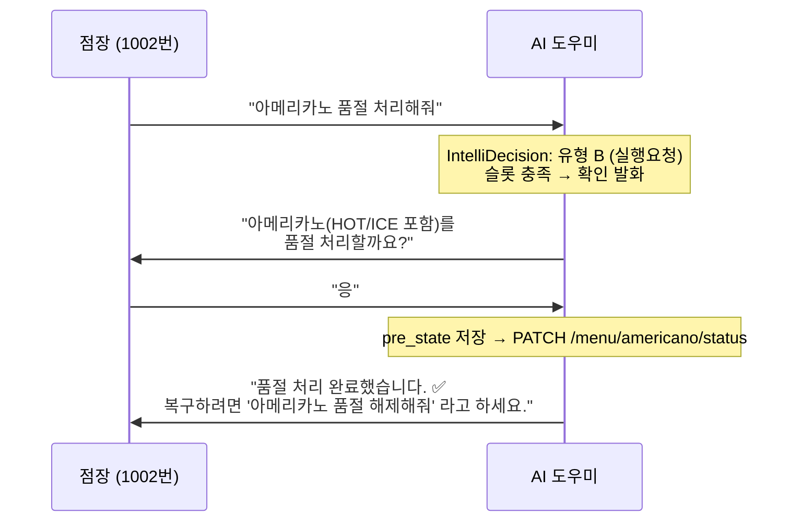

#### 사례 B — 조건부 일괄 처리 (유형 G: 일괄처리)

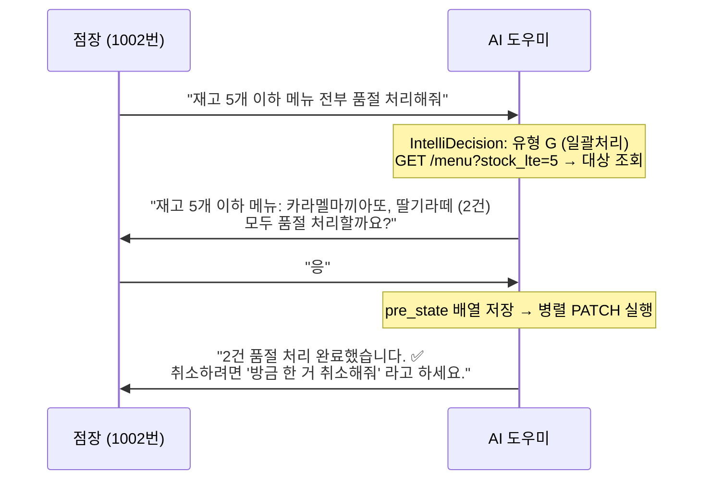

| 발화 유형 | 예시 질문                       | 처리 결과               |
| --------- | ------------------------------- | ----------------------- |
| 화면 안내 | "메뉴 카테고리 추가 어디서 해?" | 메뉴관리 탭 경로 안내   |
| 설정 변경 | "아메리카노 품절 처리해줘"      | 확인 후 단건 품절 처리  |
| 일괄 처리 | "재고 5개 이하 전부 품절"       | 건수 확인 후 일괄 처리  |
| 현황 조회 | "오늘 주문 몇 건이야?"          | API 조회 후 통계 답변   |
| Undo      | "방금 한 거 취소해줘"           | pre_state 역호출로 원복 |

---

### 2.4 테넌트 1003 — 소형 의원 예약 관리

**시나리오**: 소형 병원 원무팀이 전화/문자로 당일 예약 현황을 확인하고 예약 변경을 처리한다.

**구성 방법**: 병원 예약 관리 매뉴얼.md + 예약 시스템 API 스펙 업로드 → 완료.

#### 사례 A — 현황 조회 (유형 A: 탐색성)

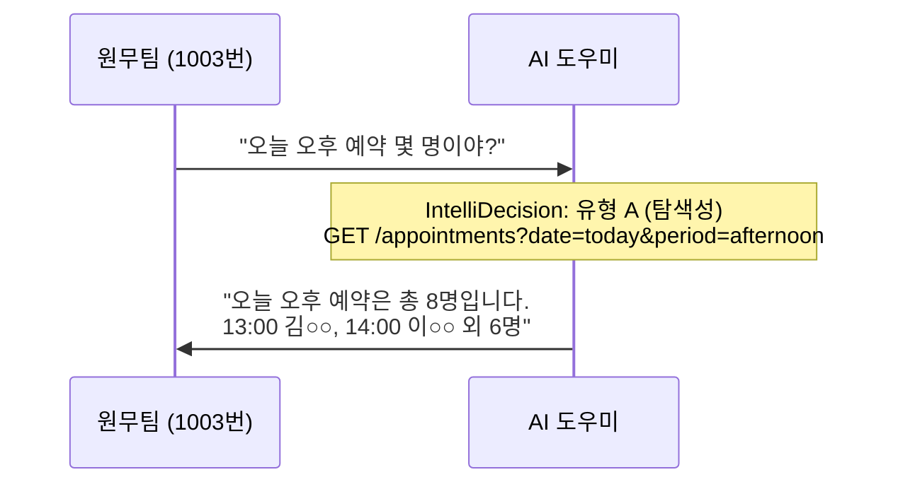

#### 사례 B — 예약 변경 (유형 B: 실행요청)

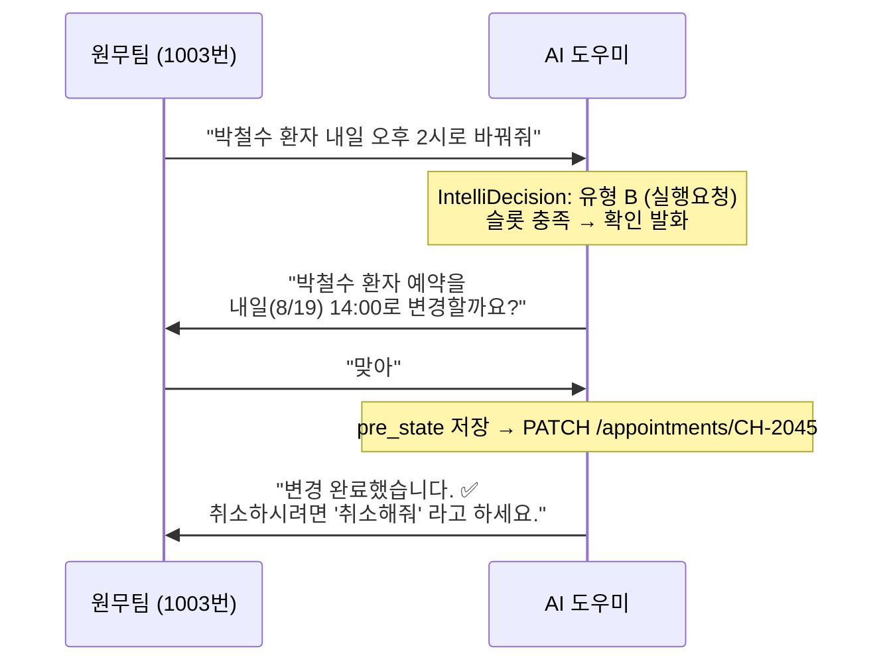

| 발화 유형 | 예시 질문                            | 처리 결과                  |
| --------- | ------------------------------------ | -------------------------- |
| 현황 조회 | "오늘 오후 예약 몇 명이야?"          | API 조회 후 명수/이름 답변 |
| 현황 조회 | "빈 슬롯 언제야?"                    | 가용 시간대 조회           |
| 예약 변경 | "박철수 내일 오후 2시로 바꿔줘"      | 확인 후 예약 시간 변경     |
| 예약 취소 | "이영희 예약 취소해줘"               | 확인 후 취소, Undo 가능    |
| 일괄 처리 | "오늘 오전 예약자 전원 SMS 발송해줘" | 건수 확인 후 일괄 발송     |

---

### 2.5 통신/네트워크 운영 — 무인 장애 접수·진단

**시나리오**: 국사/교환기/네트워크 장비에서 장애 알람이 발생하면, 당직자에게 아웃바운드 콜을 자동 발신하고 1차 진단 및 에스컬레이션을 처리한다.

**구성 방법**: 네트워크 장애 처리 매뉴얼.md + 장비 상태 조회 API 스펙 업로드 → 완료.

#### 흐름: Trigger → Action → Result

| 단계         | 내용                                                                                         |
| ------------ | -------------------------------------------------------------------------------------------- |
| **Trigger**  | 모니터링 시스템(Zabbix/Grafana)이 임계치 초과 알람 발생 → Webhook으로 AI 에이전트 호출       |
| **Action 1** | 아웃바운드 SIP 콜 발신 → 당직자 응답 → "○○ 링크 다운 감지. 현재 장비 상태 확인하시겠습니까?" |
| **Action 2** | 당직자 음성 응답 → `GET /equipment/{id}/status` API로 실시간 상태 조회 후 요약 보고          |
| **Action 3** | "심각도 Critical — 2레벨 에스컬레이션이 필요합니다. 팀장에게 알림을 발송할까요?"             |
| **Result**   | 사람이 대기 없이 1차 진단 완료 + 에스컬레이션 트리거. 평균 초동 대응 시간 대폭 단축          |

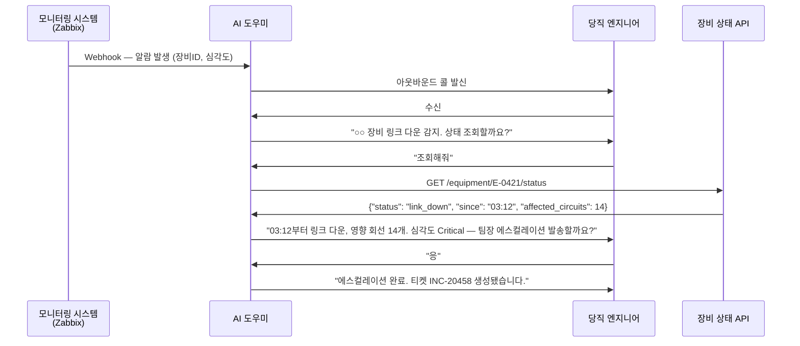

---

### 2.6 사내 IT 헬프데스크 자동화

**시나리오**: 임직원이 전화 또는 사내 메신저로 IT 문제(계정 잠금, VPN 오류, 서버 상태 등)를 접수하면, 레벨-1 지원을 AI가 처리하고 해결 불가 건만 담당자에게 이관한다.

**구성 방법**: IT 헬프데스크 FAQ.md + Active Directory·VPN·서버 상태 API 스펙 업로드 → 완료.

#### 흐름: Trigger → Action → Result

| 단계         | 내용                                                                                 |
| ------------ | ------------------------------------------------------------------------------------ |
| **Trigger**  | 임직원이 IT 헬프데스크 번호로 전화: "비밀번호가 잠겼어요"                            |
| **Action 1** | 신원 확인 (사번 또는 이름+부서) → `GET /ad/users/{id}/status` 조회                   |
| **Action 2** | 계정 잠금 확인 → "계정을 잠금 해제할까요? 해제 후 임시 비밀번호를 문자로 발송합니다" |
| **Action 3** | 확인 수신 → `POST /ad/users/{id}/unlock` → SMS 발송                                  |
| **Result**   | 레벨-1 헬프데스크 티켓의 **60~70%**를 담당자 개입 없이 자동 처리                     |

| 자동화 가능 유형        | 처리 방식                                     |
| ----------------------- | --------------------------------------------- |
| 계정 잠금 해제          | AD API 호출 + 임시 비밀번호 SMS 발송          |
| VPN 접속 오류           | 설정 가이드 안내 + 공지된 장애 여부 조회      |
| 내부 시스템 상태 조회   | 서버 모니터링 API로 실시간 상태 확인          |
| 소프트웨어 설치 요청    | ITSM 티켓 자동 생성 + 담당자 이관             |
| WiFi/네트워크 연결 문제 | 1차 진단 가이드 + 해결 안 되면 현장 방문 예약 |

---

### 2.7 금융/공공 24/7 자연어 셀프서비스

**시나리오**: 기존 ARS(버튼식 응답) 방식의 한계를 극복하고, 자연어 기반 복합 민원·서류 발급 안내·예약 처리를 24시간 제공한다.

**구성 방법**: 민원 처리 매뉴얼.md + 예약·서류발급 API 스펙 업로드 → 완료.

#### ARS vs. AI 도우미 비교

| 항목             | 기존 ARS              | AI 도우미 (본 시스템)            |
| ---------------- | --------------------- | -------------------------------- |
| 입력 방식        | 버튼(1번, 2번, …)     | 자연어 음성/문자                 |
| 인식 가능 표현   | 사전 정의된 트리만    | 오타·사투리·복합 질문 모두 처리  |
| 복합 민원 처리   | 단계별 수동 탐색 필요 | 한 번 발화로 N-hop RAG 통합 안내 |
| 야간/휴일 서비스 | 음성 안내만 제공      | 실제 예약·조회·변경 처리 가능    |
| 오류 복구        | 처음부터 다시 시작    | 유형 D(정정)/F(모호성) 자동 처리 |

#### 흐름 예시 — 공공 민원 예약

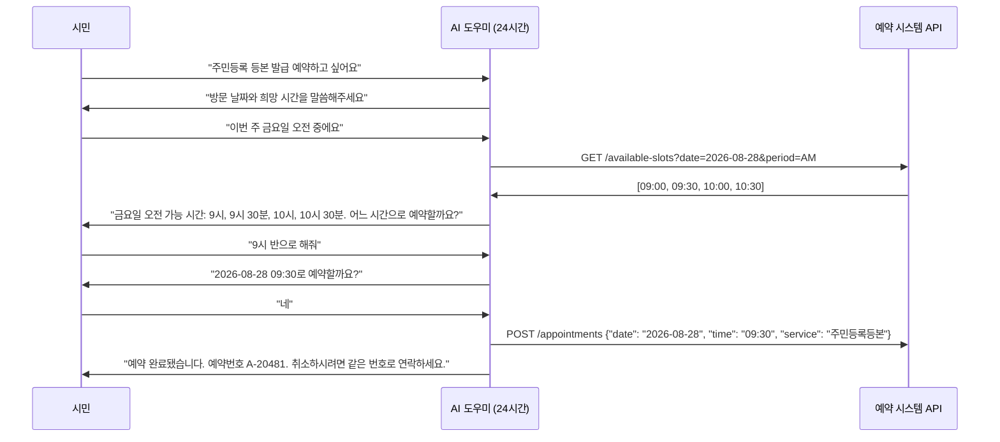

---

### 2.8 스마트 물류/배송 관제 및 실시간 통화 연동

**시나리오**: 배송 기사 및 고객 간 배송 일정 조율, 실시간 배송지 변경, 수령 확인을 AI가 중간에서 자동 처리한다.

**구성 방법**: 배송 관리 매뉴얼.md + 배송 시스템 API 스펙 업로드 → 완료.

#### 흐름: Trigger → Action → Result

| 단계          | 내용                                                                                         |
| ------------- | -------------------------------------------------------------------------------------------- |
| **Trigger 1** | 기사 배정 완료 → 수령인에게 아웃바운드 콜 발신                                               |
| **Action 1**  | "오늘 오후 2~4시 사이 배송 예정입니다. 수령 가능하신가요?"                                   |
| **Action 2**  | "불가"라고 답변 시: "변경 희망 날짜와 시간을 말씀해주세요" → `PATCH /delivery/{id}/schedule` |
| **Trigger 2** | 배송지 변경 요청 전화: "주소를 바꾸고 싶어요"                                                |
| **Action 3**  | 본인 확인 → 새 주소 청취 → 확인 발화 → `PATCH /delivery/{id}/address`                        |
| **Result**    | 고객 센터 전화량 감소, 배송 성공률 향상, 주소 변경 처리 시간 단축                            |

| 자동화 기능                       | 설명                         |
| --------------------------------- | ---------------------------- |
| 배송 예정 사전 안내 아웃바운드 콜 | 기사 배정 즉시 자동 발신     |
| 수령 불가 시 일정 재조율          | 음성으로 날짜/시간 변경 접수 |
| 배송지 실시간 변경                | 본인 확인 후 즉시 API 반영   |
| 배송 완료 확인                    | 수령 여부 자동 확인 콜       |

---

### 2.9 긴급 알림 및 대량 아웃바운드 콜 자동화

**시나리오**: 긴급 공지, 정기 점검 사전 통보, 대규모 안내 발송 시 AI가 자동으로 수신 대상자를 순서대로 호출하고, 자연어로 수신 확인 및 응답을 수집한다.

**구성 방법**: 공지 스크립트.md + 수신자 목록 API + 응답 수집 API 업로드 → 완료.

#### 흐름: Trigger → Action → Result

| 단계         | 내용                                                                                                      |
| ------------ | --------------------------------------------------------------------------------------------------------- |
| **Trigger**  | 관리자가 "대상 그룹 A에 긴급 점검 공지 발송" 명령                                                         |
| **Action 1** | `GET /recipients?group=A` → 대상 목록 확인 → 건수 안전 확인                                               |
| **Action 2** | 순차/병렬 아웃바운드 콜 발신 → "○월 ○일 새벽 2~4시 시스템 점검 예정입니다. 확인하셨으면 1번을 눌러주세요" |
| **Action 3** | 무응답/거절 → 재시도 스케줄 등록. 수신 확인 → `PATCH /recipients/{id}/confirmed`                          |
| **Result**   | 수신 확인율, 미확인자 목록 실시간 집계. 관리자에게 완료 리포트 자동 발송                                  |

| 지표             | 기존 방식 (수동 문자/이메일) | AI 아웃바운드 콜           |
| ---------------- | ---------------------------- | -------------------------- |
| 수신 확인 응답률 | ~30% (문자 오픈율 기준)      | ~75% (직접 통화 수신 확인) |
| 발송 처리 시간   | 수 시간 (담당자 수동)        | 수 분 (자동화)             |
| 미확인자 추적    | 수동 재발송 필요             | 자동 재시도 + 목록 관리    |

---

## 3. 핵심 기능 상세

### 3.1 지식베이스 구성 — 설계 근거와 업로드 방법 상세

#### 설계 철학 — 데이터만 업로드하면 AI가 자동으로 구성된다

**"코드 없이 데이터만으로 AI 능력이 확장된다"** — 파일을 업로드하는 순간:
- N-hop 그래프 관계가 자동 생성된다
- RAG 검색 인덱스가 즉시 구축된다
- Tool 실행 인터페이스가 동적으로 등록된다

---

#### 기능별 설계 근거

**① 업로드만으로 즉시 구성되는 RAG 지식베이스**

> **LlamaIndex** (GitHub 38,000+⭐):
> "문서를 업로드하면 자동으로 청크 분리·임베딩·인덱스 구축"을 표방하는 LLM 데이터 프레임워크. 사실상 표준(de facto standard).
> — [LlamaIndex Docs](https://docs.llamaindex.ai/)

> **RAG 원저 논문** (Lewis et al., 2020, Meta AI, NeurIPS):
> "외부 문서를 동적으로 검색·주입하면 LLM의 할루시네이션이 줄고 최신 지식을 반영할 수 있음을 증명."
> — [arXiv:2005.11401](https://arxiv.org/abs/2005.11401)

**우리의 적용**: 파일 업로드 즉시 `MarkdownManualAdapter` / `PDFAdapter` / `OpenAPIAdapter`가 청크를 분리하고 ChromaDB에 임베딩을 저장한다. 코드 배포 없이 다음 질문부터 바로 검색에 반영된다.

---

**② OpenAPI 스펙 → Tool 동적 자동 생성**

> **Gorilla LLM** (UC Berkeley, 2023, GitHub 11,000+⭐):
> 핵심 발견: **"API 스펙 문서를 그대로 컨텍스트로 주입하면 LLM이 올바른 호출 코드를 생성한다."
> — [arXiv:2305.15334](https://arxiv.org/abs/2305.15334)

> **OpenAI GPT Actions** (2023):
> OpenAI가 OpenAPI 스펙을 GPT Plugin / Custom Actions의 입력 형식으로 채택.
> — [OpenAI GPT Actions Docs](https://platform.openai.com/docs/actions/introduction)

**우리의 적용**: OpenAPI YAML 업로드 → `OpenAPIAdapter` 파싱 → `knowledge_document_endpoints` 테이블에 동적 등록. 새 API 추가 시 코드 수정이 전혀 없다.

---

**③ N-hop 그래프 자동 구성 — Client-Centric 동적 지식베이스**

> **Microsoft GraphRAG** (2024, GitHub 37,000+⭐):
> "단순 벡터 검색으로는 도메인 전체에서 무엇이 가능한가?와 같은 글로벌 질문에 답하기 어렵다."
> — [arXiv:2404.16130](https://arxiv.org/abs/2404.16130)

> **Anthropic Contextual Retrieval** (2024-09):
> 각 청크에 맥락을 함께 임베딩하면 검색 실패율이 **35% 감소**(5.7%→3.7%).
> — [Anthropic Blog](https://www.anthropic.com/news/contextual-retrieval)

**우리의 적용**: GraphRAG의 복잡한 엔티티 자동추출 대신, `{domain: ...}` 태그와 OpenAPI `tags` 필드로 **명시적 관계 스키마**를 즉시 생성한다. `knowledge_graph.py`가 `document → domain → screen → api_endpoint` 관계를 자동으로 연결한다.

---

**④ 테넌트별 완전 격리 — Client-Centric 구조**

> **Pinecone Multi-Tenancy Best Practices** (2024):
> "메타데이터 필터는 가장 유연한 멀티테넌트 격리 옵션이다."
> — [Pinecone Multi-Tenant Architecture](https://www.pinecone.io/learn/multi-tenancy/)

**우리의 적용**: ChromaDB `where={"owner": tenant_id}` 필터를 모든 쿼리에 강제 적용. 테넌트 추가 시 코드 변경 없이 데이터 업로드만으로 즉시 독립 인스턴스가 생성된다.

---

#### 지원하는 파일 형식 3가지

| 형식                | 파일 예     | 필수 포맷?       | 생성 결과                          |
| ------------------- | ----------- | ---------------- | ---------------------------------- |
| **마크다운 매뉴얼** | `manual.md` | ❌ 자유 형식 가능 | RAG 검색용 지식                    |
| **PDF 문서**        | `guide.pdf` | ❌ 어떤 PDF든     | RAG 검색용 지식                    |
| **OpenAPI 스펙**    | `api.yaml`  | ✅ OpenAPI 3.x    | RAG 지식 + **실제 Tool 실행** 가능 |

#### 마크다운 매뉴얼 — 두 가지 방식

**방식 A: 자유 형식 (바로 업로드 가능)**
```markdown
# 카페 오더 시스템 관리자 가이드

이 시스템에서는 메뉴 관리, 주문 처리, 재고 관리를 할 수 있습니다.
메뉴를 추가하려면 [메뉴관리] 탭에서 [+ 메뉴 추가] 버튼을 클릭합니다.
```
→ 단락 단위로 분리해 ChromaDB에 색인됨. RAG 검색 가능.

**방식 B: Q&A 구조화 형식 (정밀도 향상)**
```markdown
## 1. 메뉴 관리 {domain: menu-management}

**Q: 새 메뉴는 어떻게 추가하나요?**
A: 메뉴관리 탭 → [+ 메뉴 추가] 버튼 클릭 → 메뉴명, 가격, 카테고리 입력 → 저장

**Q: 품절된 메뉴를 처리하려면?**
A: 해당 메뉴 카드의 [품절처리] 버튼을 클릭하면 즉시 반영됩니다.
```
→ Q&A 단위로 분리, `{domain: menu-management}` 태그로 도메인 자동 연결.

**결론**: 어떤 형식도 업로드 가능하다. Q&A 구조화 형식은 N-hop RAG의 도메인 연결 정밀도를 높이지만, 일반 PDF나 자유 형식 마크다운도 RAG 검색에 즉시 활용된다.

#### OpenAPI 스펙이란?

OpenAPI는 **REST API를 기술하는 업계 표준 문서 형식(YAML/JSON)**이다. 특정 서비스 전용 포맷이 아니라, "이 서버에 어떤 URL로 요청하면, 어떤 파라미터를 보내야 하는지"를 기계가 읽을 수 있게 정의한 범용 스펙이다.

| 프레임워크      | OpenAPI 스펙 얻는 방법                         |
| --------------- | ---------------------------------------------- |
| **FastAPI**     | 서버 실행 후 `/openapi.json` — 자동 생성       |
| **Spring Boot** | Springdoc 추가 → `/v3/api-docs`                |
| **Django REST** | drf-spectacular 추가 → `/api/schema/`          |
| 스펙 없는 경우  | 엔드포인트 몇 개만 YAML로 직접 작성 (5분 소요) |

#### OpenAPI 스펙 — 업로드에서 RAG 참조까지

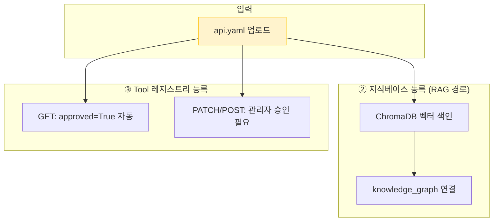

#### OpenAPI 스펙 예시 파일

```yaml
# 예: cafe-orders-api.yaml
openapi: "3.0.0"
info:
  title: 카페 오더 관리 API
  version: "1.0.0"
servers:
  - url: https://api.cafe-order.example.com
paths:
  /orders/{order_id}:
    get:
      summary: 주문 조회
    patch:
      summary: 주문 상태 변경  # ← 이 메서드를 승인하면 AI가 직접 호출
  /menu/{menu_id}/status:
    patch:
      summary: 메뉴 품절 처리   # ← 마찬가지로 승인 후 Tool 실행 가능
```

업로드하면:
1. 엔드포인트 자동 파싱 → `knowledge_document_endpoints` 테이블 저장
2. GET 메서드: 승인 없이 즉시 Tool 실행 가능 (조회)
3. PATCH/POST/PUT/DELETE: 명시적 승인 클릭 필요 (쓰기 화이트리스트)

> **시장 검증**: GitHub에 `openapi-to-mcp` 관련 저장소 **437개**, 핵심 원칙: **"Zero Code Modification"** — 원본 API 서버를 한 줄도 수정하지 않는다.

---

### 3.2 N-hop RAG — 관계형 지식 그래프 검색

단순한 키워드 검색이 아니다. 문서 → 도메인 → 화면 → 실행 가능 여부까지 **그래프를 따라 순회**하며 맥락 있는 답변을 생성한다.

> **Microsoft GraphRAG** (GitHub 37,000+⭐)가 제안하는 Local/Global/DRIFT 검색 전략을 경량화해 적용했다.
> 엔티티 자동추출·Leiden 클러스터링의 복잡도 없이 명시적 관계 스키마로 동일한 효과를 낸다.
> — [Microsoft GraphRAG](https://microsoft.github.io/graphrag/)

> **왜 GraphRAG 전체를 도입하지 않았나?**
> GraphRAG는 "관계를 몰라서 LLM이 수천 건의 문서에서 자동으로 숨은 관계를 발견해야 하는" 상황에
> 최적화된 도구다. 그러나 이 시스템은 도메인이 7개이고 Q&A 노드가 수십 건 규모다.
> 색인 단계마다 다수의 LLM 호출이 필요하고 별도 그래프 인프라가 요구되는 GraphRAG는 이 규모에
> 과설계(over-engineering)다. 대신 `{domain: ...}` 태그와 OpenAPI `tags` 필드로 **명시적 관계
> 스키마를 즉시 선언**하면 동일한 멀티홉 순회 효과를 얻을 수 있다.
> — 내부 리서치 검토 결론(2026-07-16, [design/SELF_SERVICE_SCREEN_GUIDED_GRAPHRAG_RESEARCH.md](design/SELF_SERVICE_SCREEN_GUIDED_GRAPHRAG_RESEARCH.md))

> **Glean 엔터프라이즈 AI** (엔터프라이즈 검색 업계 1위)의 Head of Product는
> "지식 그래프와 벡터DB 중 하나가 아니라 둘 다 사용해야 한다"고 명시했다 —
> 그래프는 **관계 추론**에, 벡터는 **의미 유사도**에 각각 강하기 때문이다.
> — [Glean: Knowledge Graph vs Vector Database](https://www.glean.com/blog/knowledge-graph-vs-vector-database)

#### 데이터 구성 구조

```
┌─────────────────────────────────────────────────────────────────┐
│  ChromaDB (벡터 스토어)                                          │
│                                                                  │
│  각 문서 청크의 메타데이터:                                       │
│  owner: "1001"                    ← 테넌트 격리                  │
│  doc_type: "knowledge_document"   ← 문서 유형                   │
│  related_domain: "inventory"      ← 도메인 태그                  │
│  section_title: "§3 재고 현황"    ← 섹션 제목                   │
│  text: "재고 부족 상품은..."       ← 실제 내용                   │
└─────────────────────────────────────────────────────────────────┘
         │
         │ (1-hop) 벡터 유사도 검색
         ▼
┌─────────────────────────────────────────────────────────────────┐
│  knowledge_graph.py (관계 그래프)                                │
│  manual_qa ──relates_to──► catalog_domain                        │
│  catalog_domain ──rendered_by──► frontend_screen                 │
│  frontend_screen ──writable──► intent_type                       │
│  document ──relates_to──► api_endpoint                           │
└─────────────────────────────────────────────────────────────────┘
```

#### 실제 검색 흐름 (예: "재고 부족한 상품 어떻게 봐?")

├─ [1-hop] ChromaDB 벡터 검색
│  쿼리 임베딩 → 코사인 유사도 계산
│  related_domain: inventory-management 청크 매칭

├─ [2-hop] 도메인 → 화면 연결
│  inventory-management → nav_hint: "상품관리 메뉴 → 재고현황 탭"

└─ [3-hop] 실행 가능 여부 판단
  PATCH /inventory/{sku} → 승인됨 ✅ → Tool 호출 가능
  유형 A(탐색성) = 안내만 | 유형 B(실행성) = Tool 실행 가능
```

#### 유형 C 하이브리드 검색 (다중 도메인 병렬)

"뭘 할 수 있어?" 같은 포괄적 질문은 모든 도메인을 동시에 검색한다.

```
질문: "이 관리자 사이트에서 뭘 할 수 있는지 알려줘"
│
└─ asyncio.gather() 병렬 실행:
   ├─ inventory-management 도메인 검색 → "재고 조회/수정"
   ├─ order-management 도메인 검색    → "주문 상태 변경"
   └─ sales-stats 도메인 검색         → "매출 통계 조회"

통합 응답:
"이 도우미로 할 수 있는 것들을 안내해 드릴게요!
 📦 재고 관리: 재고 현황 조회, 수량 수정
 📋 주문 관리: 주문 상태 조회, 배송 상태 변경
 📊 매출 통계: 일별/주별 매출 현황 조회"
```

---

### 3.3 Tool-calling — 실제 API 실행 (Undo 보장)

> **GoEx** (arXiv:2312.10929): AI Agent가 실세계 시스템 조작 시 undo/damage confinement 원칙.
> 실행 전 상태를 저장하고 모든 행동은 반드시 롤백 가능해야 한다.
> — [arXiv:2312.10929](https://arxiv.org/abs/2312.10929)

> **Anthropic Building Effective Agents** (2024-12):
> Agent가 행동을 실행하기 전에 사용자 컨펌을 통해 확인을 받아라.

**우리의 적용**: `pre_state_json` 스냅샷 저장 → API 호출 → `tool_execution_log` 기록. 실행 후 언제든 역호출로 원복 가능. 화이트리스트 미승인 API는 실행되지 않는다.

#### 실행 보안 원칙

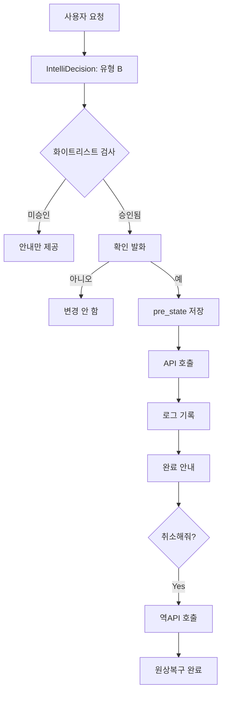

---

### 3.4 IntelliDecision — 대화 의도 분류 엔진

사용자의 모든 발화를 **9가지 유형(A~I)**으로 자동 분류하여 최적 처리 경로로 라우팅한다. LLM이 매 턴마다 프롬프트에 명시된 유형 정의를 참조해 판정한다(키워드 매칭 없음).

> **Amazon Alexa Standard Built-in Intents**:
> 모든 상용 Alexa 스킬이 **의무 구현**해야 하는 9개 인텐트와 우리의 유형 A~I는 구조적으로 1:1 대응된다.
> 업계에서 수십억 건의 대화를 통해 검증된 분류 체계다.
> — [Amazon Alexa Standard Built-in Intents](https://developer.amazon.com/en-US/docs/alexa/custom-skills/standard-built-in-intents.html)

> **Semantic Router** (GitHub 3,800+⭐): IEEE GlobeCom 2024 5G 통신망 의도 분류, 콜센터 10ms 저지연 사례.

> **Anthropic Building Effective Agents** (2024-12):
> "관심사 분리 Routing"이 고객 지원 유형 분류의 업계 표준임을 명시.

**우리의 적용**: LLM이 매 턴 9가지 유형 정의를 프롬프트로 받고 판정한다. 키워드 매칭 없이 의미를 이해하므로 철자법, 슬랭, 오타에도 강하다.

#### IntelliDecision의 학술적 뿌리

유형 A/B의 이분법은 **Dialog Act(대화행위) 이론**에서 직접 유래한다.

> **Stolcke et al. (2000)**, *Dialogue Act Modeling for Automatic Tagging and Recognition of Conversational Speech*, Computational Linguistics 26(3):
> "발화를 정보요청(Info-request)과 행동요청(Action-directive)으로 분류하는 42종 태그 체계."
> — 우리 유형 A(탐색성 = 정보요청)와 B(실행요청 = 행동요청)의 학술적 동치.

> **ISO 24617-2** (2012) — 대화행위 어노테이션 국제 표준:
> 정보전달·행동유도·피드백 차원을 포함한 다축 분류 체계.
> — 유형 D(정정)/F(모호성 해소)/I(반복)는 이 표준의 "대화 수리(Conversation Repair)" 개념에 해당.

> **Askari et al. (2024, NAACL)**, arXiv:2402.11633:
> "의도 라벨링을 사람이 아니라 LLM에 맡긴다"는 최신 트렌드 — 우리의 "키워드 매칭보다 LLM 판단 우선" 원칙과 정합.

#### 상용 시스템 비교

| 시스템                  | 정책 표현 방식                                | 확인-후-실행 패턴             | 자연어 대응력 |
| ----------------------- | --------------------------------------------- | ----------------------------- | ------------- |
| **우리 시스템**         | LLM 제로샷 + `prompt_rules.py` 레지스트리     | 유형 B: 확인 발화 → Tool 실행 | 매우 높음     |
| **Rasa**                | YAML Rules(선언적) + ML 정책(TED policy) 혼합 | Forms 슬롯 확인 표준 패턴     | 높음          |
| **Dialogflow CX**       | 명시적 State Handler 그래프                   | Webhook 전 확인 Fulfillment   | 중간          |
| **Alexa Conversations** | Dialog model + 대화 시뮬레이터 검증           | APL 확인 카드 + 슬롯 확인     | 중간          |

LLM 제로샷 방식은 자연어 뉘앙스·오타·비표준 표현에 가장 강하다. Dialogflow CX형 상태 기계는 100% 예측 가능하지만 자연어 다양성 커버를 위해 상태·전이가 폭발적으로 증가한다. 우리 시스템은 전자를 선택하고 9가지 유형 정의를 프롬프트 데이터로 선언해 관리한다.

#### 유형별 상태 전이 다이어그램

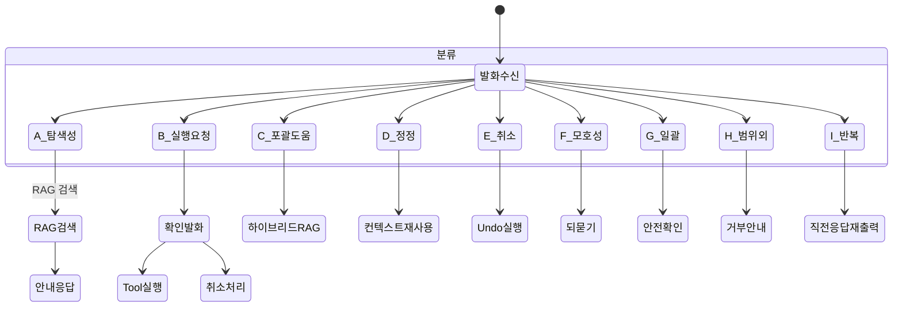

#### 유형 A 상세 — Happy Path / Unhappy Path 전이

유형 A(탐색성)는 탐색 → 실행 의지 표명 → 슬롯 채우기 → 완료의 전체 흐름을 포함한다.


| 경로           | 흐름                               | 설명                                   |
| -------------- | ---------------------------------- | -------------------------------------- |
| **Happy Path** | A → 슬롯 → 충족 → 실행             | 필요 정보가 모두 발화에 포함된 경우    |
| **F 이탈**     | 정보 누락 → 되묻기 → 보완 → 재진입 | "그거 바꿔줘"처럼 대상 불명확          |
| **D 이탈**     | 진행 중 값 변경 → 재확인           | "아니, 20개 말고 15개로"               |
| **I 이탈**     | A → 재출력 → A 복귀                | RAG 재검색 없이 직전 응답 재출력       |
| **E 이탈**     | 완료 후 → 롤백                     | `pre_state` 역호출 후 루프 시작점 복귀 |

---

#### 유형 B 상세 — 실행요청 Happy Path / Unhappy Path 전이

유형 B(실행요청)는 가장 위험도가 높은 유형이다. 화이트리스트 검사 → 확인 발화 → Tool 실행의 3단계 보안 게이트를 반드시 통과해야 한다.


| 경로           | 설명                                            |
| -------------- | ----------------------------------------------- |
| **Happy Path** | 승인된 API + 명확한 슬롯 + 사용자 확인 → 실행   |
| **H 차단**     | 미승인 API는 실행 없이 안내만. 오호출 원천 차단 |
| **F 이탈**     | 대상 불명확 → 되묻기 → 확인 단계 재진입         |
| **D 이탈**     | 확인 중 마음 변경 → 스냅샷 전이므로 안전        |
| **E 롤백**     | `pre_state`로 원복. 스냅샷이 있으므로 항상 가능 |

---

#### 유형 C 상세 — 포괄도움 Happy Path / Unhappy Path 전이


---

#### 유형 G 상세 — 일괄처리 Happy Path / Unhappy Path 전이

유형 G(일괄처리)는 단건 B와 달리 **다수 대상에 동일 동작을 적용**한다. 대상 목록 확정 → 건수 확인 → 안전 확인의 3중 게이트로 실수를 방지한다.

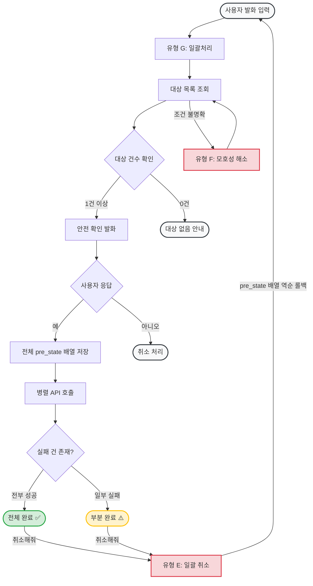

| 경로           | 설명                                         |
| -------------- | -------------------------------------------- |
| **Happy Path** | 조건 명확, 대상 존재, 사용자 확인. 전부 성공 |
| **F 이탈**     | "재고 부족"의 기준이 없을 때 되묻기          |
| **0건 안내**   | 조건에 맞는 대상 없음. 실행하지 않음         |
| **부분 실패**  | 실패 건은 변경되지 않았으므로 롤백 불필요    |
| **E 롤백**     | **배열** 단위 스냅샷으로 전체 원복           |

---

#### 유형별 대표 질문 예시

| 유형  | 이름        | 대표 질문 예시               | 처리 방식                         |
| ----- | ----------- | ---------------------------- | --------------------------------- |
| **A** | 탐색성      | "채팅 자동응답 어떻게 켜?"   | RAG 검색 → 화면 경로 안내         |
| **B** | 실행요청    | "ORD-1042 배송중으로 바꿔줘" | 확인 발화 → Tool 실행 → Undo 가능 |
| **C** | 포괄적 도움 | "이 도우미로 뭘 할 수 있어?" | 전 도메인 병렬 RAG → 종합 안내    |
| **D** | 정정        | "배송중이 아니라 배송완료로" | 직전 맥락 재사용                  |
| **E** | 실행 취소   | "방금 한 거 취소해줘"        | pre_state 스냅샷으로 원복         |
| **F** | 모호성 해소 | "그거 바꿔줘"(대상 불명)     | 구체 정보 재질문                  |
| **G** | 일괄 처리   | "재고 부족 상품 전부 20개로" | 안전 확인 후 다건 처리            |
| **H** | 범위 외     | "환불 처리해줘"(미지원)      | 지원 불가 명확히 안내             |
| **I** | 반복 요청   | "다시 말해줘"                | 직전 응답 재출력                  |

---

## 4. 아키텍처

### 4.1 두 가지 접근 경로

**중요**: MCP 클라이언트와 SIP/SMS는 서로 다른 경로를 사용한다.

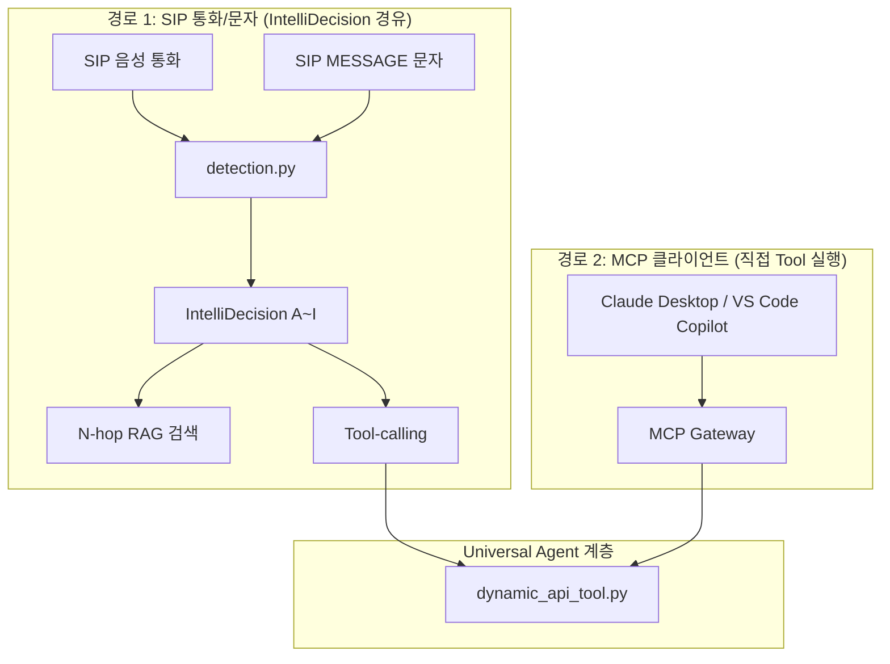

### 4.2 테넌트별 완전 분리

모든 데이터는 `owner` 필드로 테넌트 간 격리된다. ChromaDB `where={"owner": tenant_id}` 필터를 모든 쿼리에 강제 적용한다.

---

## 5. 범용 REST-API 연동 — 활용 방안

### 5.1 시장 현황

> **Intercom Fin** (12,000+ 기업 고객, 평균 문제 해결률 **76%**)
> CS 문의 중 자동 해결 비율이 도입 전 대비 평균 35%p 이상 상승한 사례가 보고됨.

> **Zendesk AI Agent**:
> - TeamSystem(이탈리아 최대 ERP 기업): CS 자동화율 **80%** 달성
> - Hello Sugar(미용 프랜차이즈): 월 CS 비용 **$14,000** 절감
> — 공통점: 기존 API에 AI를 연결했을 뿐, 서버 코드 변경 없음.

### 5.2 활용 가능한 분야

| 분야          | 기존 방식                    | AI 도우미 연동 후                   | 기대 효과                          |
| ------------- | ---------------------------- | ----------------------------------- | ---------------------------------- |
| 소매/이커머스 | 담당자가 관리 화면 직접 조작 | "ORD-1234 배송중으로 바꿔줘" → 즉시 | 처리 시간 ~80% 단축                |
| 의료/예약     | 전화·이메일로 예약 변경      | "오늘 오후 3시 예약을 내일로"       | 24시간 셀프 예약 변경              |
| F&B 운영      | 메뉴판 직접 업데이트         | "아메리카노 품절 처리해줘"          | 현장에서 즉시 처리, 오조작 시 Undo |
| SaaS 관리자   | 설정 페이지 탐색·클릭        | "AI 자동응답 꺼줘"                  | 매뉴얼 탐색 시간 0                 |

---

## 6. MCP 연동 — AI 생태계 확장

MCP(Model Context Protocol)는 Anthropic이 2024년 발표한 **AI 클라이언트-서버 표준 프로토콜**이다.

- Claude Desktop, VS Code GitHub Copilot, Cursor 등 주요 AI 앱이 MCP 지원
- [mcp-link](https://github.com/automation-ai-labs/mcp-link) (622⭐): Zero Code Modification
- [openapi-mcp-server](https://github.com/janwilmake/openapi-mcp-server) (900⭐)

### 6.1 우리 시스템과 MCP의 관계

> **Anthropic 공식 문서** (modelcontextprotocol.io):
> "MCP는 AI 애플리케이션용 USB-C 포트 — 서버 개발자가 한 번 만들면 어디서든 재사용된다."

MCP는 **서버 측 인터페이스를 표준화**하는 전략이다. 반면 우리 시스템은 **클라이언트(에이전트)가 문서만 보고 기존 REST API에 적응**하는 반대 방향을 추구한다. 두 접근의 차이:

| 항목                | MCP (서버-centric)          | 우리 시스템 (클라이언트-centric)           |
| ------------------- | --------------------------- | ------------------------------------------ |
| 서버 수정 필요 여부 | MCP 서버를 새로 구현해야 함 | 원본 서버 **한 줄도 수정 안 함**           |
| 적응 방식           | 서버가 표준 프로토콜을 노출 | 클라이언트가 OpenAPI 문서를 읽고 동적 적응 |
| 레거시 시스템 대응  | MCP 서버 래퍼 필요          | 문서 업로드만으로 즉시 연동                |

### 6.2 GPT Actions — 동일 개념의 상용 선례

> **OpenAI GPT Actions** (2023):
> "개발자는 API 스키마를 기술하고 인증을 설정하면, ChatGPT가 사용자의 자연어 질문과 API 계층
> 사이의 다리 역할을 한다." — 서버(예: weather.gov)는 전혀 수정하지 않는다.

GPT Actions는 이 개념의 가장 가까운 상용 선례다. 다만 (a) OpenAI 폐쇄 생태계 안에서만 동작하고, (b) 스키마를 **정적으로 미리 등록**해야 하며 런타임에 임의 문서를 업로드해 즉석 적응하지 않는다. 우리 시스템은 런타임 업로드 + RAG 기반 동적 적응이 가능하다는 점에서 차별화된다.

### 6.3 시장 수렴 흐름

ChatGPT Plugins(2023) → GPT Actions → MCP 표준으로의 수렴은, **"클라이언트가 문서를 이해해 임의 서버에 적응"하는 접근이 먼저 등장하고, 이후 서버 측 표준화(MCP)로 시장이 정리**되는 흐름을 보여준다. Zapier도 NLA(Natural Language Actions)에서 MCP 서버로 전환했다(2026-08 시점 `nla.zapier.com` → `mcp.zapier.com` 리다이렉트). 단, 레거시 시스템이나 MCP를 채택할 유인이 없는 소규모 서비스에서는 클라이언트-centric 접근이 여전히 유일한 현실적 선택이다.

---

## 7. A-Z 완전 사용 가이드

#### STEP 1: 매뉴얼 문서 작성 (10분)
자유 형식으로 작성한 .md 파일을 업로드.

#### STEP 2: 파일 업로드 (2분)

AI 에이전트 → 지식베이스 → 지식 업로드 → 색인 완료.

#### STEP 3: OpenAPI 스펙 업로드 (선택)

업로드 후 GET 메서드 자동 승인, 쓰기 메서드는 명시 승인 클릭 필요.

---


## 8. 참고 문헌

| #   | 기능                      | 참고 자료                                                                                                                            | 핵심 내용                                |
| --- | ------------------------- | ------------------------------------------------------------------------------------------------------------------------------------ | ---------------------------------------- |
| 1   | IntelliDecision 유형 분류 | [Amazon Alexa Standard Built-in Intents](https://developer.amazon.com/en-US/docs/alexa/custom-skills/standard-built-in-intents.html) | 9개 인텐트 업계 표준                     |
| 2   | N-hop RAG                 | [Microsoft GraphRAG](https://microsoft.github.io/graphrag/) (37,000+⭐)                                                               | Local/Global/DRIFT 검색 전략             |
| 3   | 지식 그래프 + 벡터DB      | [Glean](https://www.glean.com/blog/knowledge-graph-vs-vector-database)                                                               | "둘 다 사용해야 한다"                    |
| 4   | RAG 검색 품질             | [Anthropic Contextual Retrieval](https://www.anthropic.com/news/contextual-retrieval)                                                | 검색 실패율 35% 감소                     |
| 5   | RAG 원저 논문             | [arXiv:2005.11401](https://arxiv.org/abs/2005.11401) (Meta AI, NeurIPS 2020)                                                         | 동적 검색 주입으로 LLM 할루시네이션 감소 |
| 6   | OpenAPI Tool 자동 생성    | [Gorilla LLM arXiv:2305.15334](https://arxiv.org/abs/2305.15334) (UC Berkeley)                                                       | API 스펙 주입 → LLM zero-shot 호출       |
| 7   | AI 실행 안전성            | [GoEx arXiv:2312.10929](https://arxiv.org/abs/2312.10929)                                                                            | undo/damage confinement                  |
| 8   | 동적 지식베이스           | [LlamaIndex](https://docs.llamaindex.ai/) (38,000+⭐)                                                                                 | 업로드 → 자동 색인                       |
| 9   | OpenAPI Universal Agent   | [mcp-link](https://github.com/automation-ai-labs/mcp-link) (622⭐)                                                                    | Zero Code Modification                   |
| 10  | 멀티테넌트 격리           | [Pinecone Multi-Tenancy](https://www.pinecone.io/learn/multi-tenancy/) (2024)                                                        | 메타데이터 필터 방식                     |
| 11  | IntelliDecision 학술 근거 | Stolcke et al. (2000), *Computational Linguistics* 26(3)                                                                             | 42종 대화행위 분류, 정보요청 vs 행동요청 |
| 12  | 대화행위 국제 표준        | ISO 24617-2 (2012)                                                                                                                   | 대화 수리(Repair) 포함 다축 분류 표준    |
| 13  | LLM 기반 의도 분류        | [Askari et al. arXiv:2402.11633](https://arxiv.org/abs/2402.11633) (NAACL 2024)                                                      | LLM으로 의도 라벨링 자동화               |
| 14  | MCP 프로토콜              | [modelcontextprotocol.io](https://modelcontextprotocol.io/introduction) (Anthropic 2024)                                             | AI 앱-외부 시스템 연결 오픈 표준         |
| 15  | GPT Actions (상용 선례)   | [OpenAI GPT Actions Docs](https://platform.openai.com/docs/actions/introduction)                                                     | 서버 무수정 + 자연어↔API 양방향 번역     |
| 16  | CCaaS 시장 전망           | Gartner (2024), IDC (2024)                                                                                                           | 2027년까지 CAGR 17.9%, 197억 달러 돌파   |
| 17  | 생성형 AI 경제 효과       | McKinsey Global Institute (2023)                                                                                                     | 고객 운영 연간 최대 4,600억 달러 가치    |
| 18  | Twilio Voice AI           | [Twilio Voice Documentation](https://www.twilio.com/docs/voice)                                                                      | SIP Trunking + 실시간 음성 AI 파이프라인 |
| 19  | Amazon Connect            | [AWS Amazon Connect](https://aws.amazon.com/connect/)                                                                                | WebRTC+SIP 기반 CCaaS, Lex AI 통합       |
| 20  | Google Cloud CCAI         | [Google Cloud Contact Center AI](https://cloud.google.com/solutions/contact-center)                                                  | Dialogflow CX + Vertex AI 음성 에이전트  |

---

*최종 업데이트: 2026-08-27*
