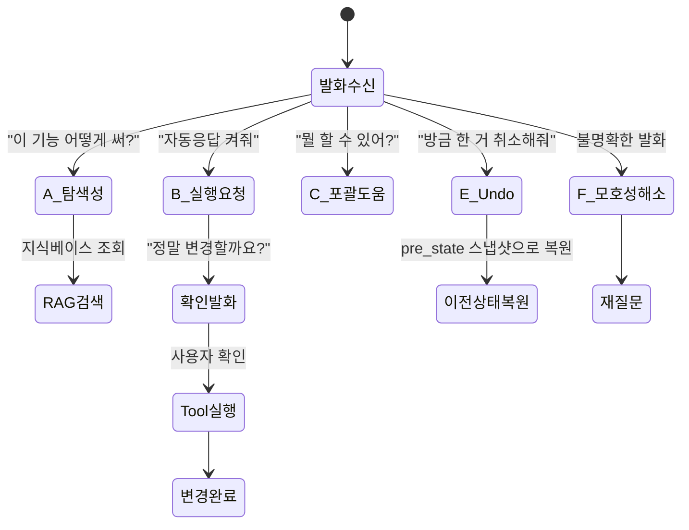
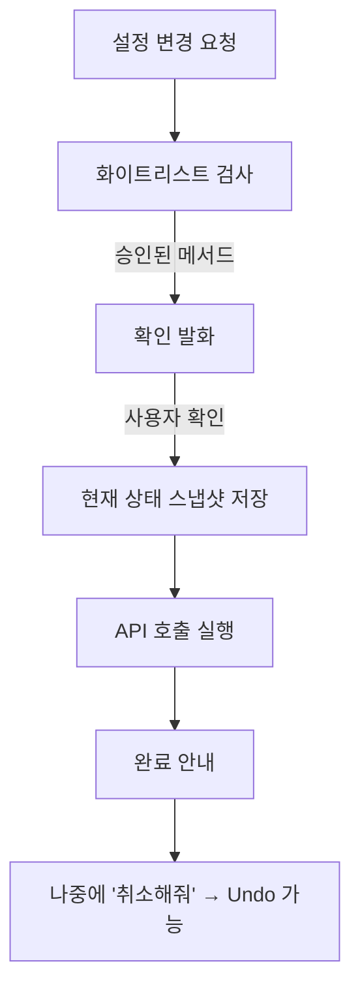
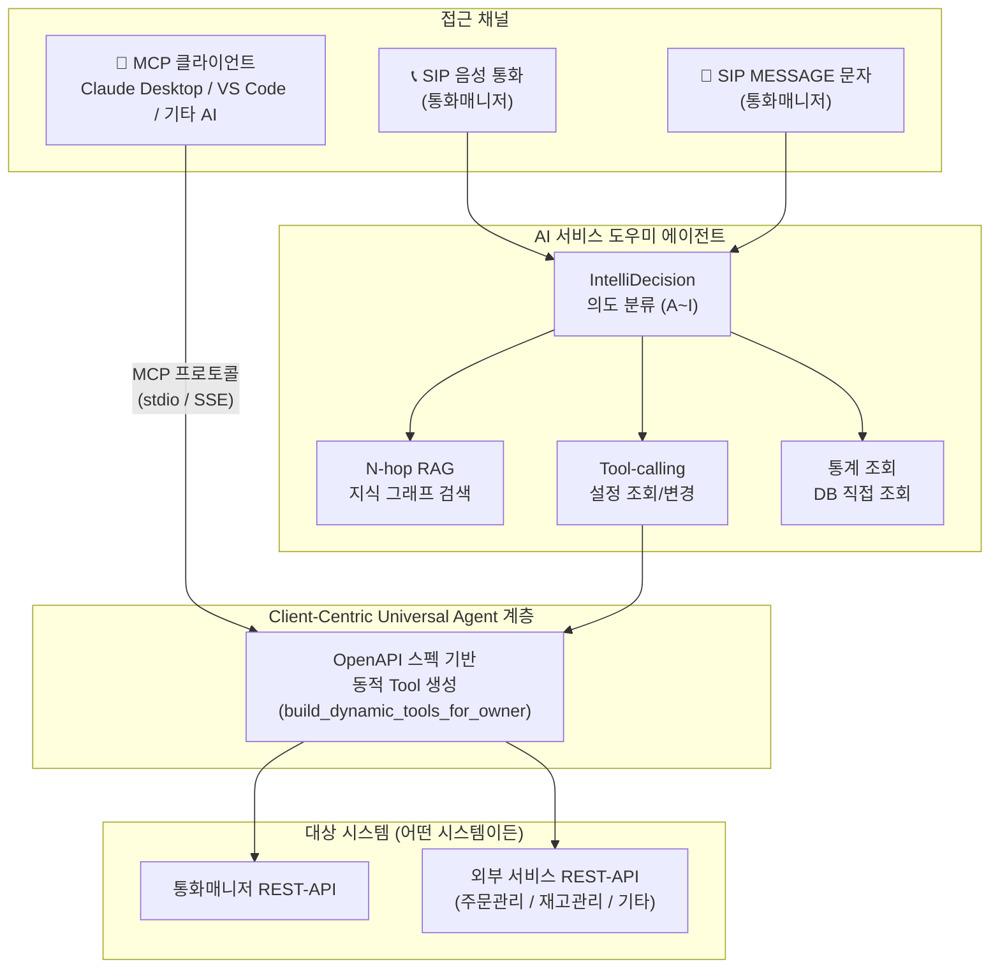

# AI 서비스 도우미 (AI Service Agent) — 서비스 소개서

**문서 유형**: 서비스 소개서 (Service Introduction)
**작성일**: 2026-08-10
**버전**: 2.0
**대상 독자**: 도입 검토 담당자, 개발팀, 운영팀

---

## 목차

1. [배경 및 개발 경위](#1-배경-및-개발-경위)
2. [핵심 기능](#2-핵심-기능)
3. [아키텍처](#3-아키텍처)
4. [이용 방법](#4-이용-방법)
5. [유저 스토리](#5-유저-스토리)
6. [참고 문헌 및 연구 근거](#부록-a-참고-문헌-및-연구-근거)

---

## 1. 배경 및 개발 경위

### 1.1 출발점 — 통화매니저 CS 문의 급증

통화매니저 서비스를 운영하면서 CS 고객센터로 **서비스 이용 문의가 집중**되는 문제가 있었다.

```
"채팅 자동응답은 어떻게 켜나요?"
"AI가 이번 달 몇 건 응대했는지 어디서 보나요?"
"착신 전환 설정 메뉴가 어딘지 모르겠어요."
```

반복적이고 단순한 이 문의들이 CS 팀의 리소스를 소모하고 있었다. 해결책으로 **AI를 이용한
서비스 도우미 Agent**를 만들어 이 문의들을 자동 처리하기로 했다.

### 1.2 핵심 아이디어 — 자연어로 서비스를 제어한다

단순한 FAQ 챗봇이 아니다. 아래 세 가지를 하나의 대화에서 처리하는 것이 목표였다.

| 목표 | 수단 |
|---|---|
| 서비스 이용 안내 | N-hop RAG + 화면 경로 안내 |
| 실제 설정 조회/변경 | Tool-calling (설정 API 직접 호출) |
| 원활한 대화 흐름 | IntelliDecision (의도 분류 엔진) |

### 1.3 발전 — 도메인 비종속 Universal Agent로

개발을 진행하면서 중요한 사실을 깨달았다.

> **통화매니저에만 쓰기엔 아깝다.**
> 매뉴얼과 REST-API 스펙만 있으면 **어떤 서비스든** 동일하게 동작한다.

이에 따라 아키텍처를 전환했다.

```
[Before] 통화매니저 전용 AI 도우미
    ↓
[After]  매뉴얼 + REST-API 스펙만 주입하면
         어떤 시스템이든 제어 가능한
         Client-Centric Universal Agent
```

이것이 바로 **도메인 비종속 AI 서비스 도우미**다.

---

## 2. 핵심 기능

### 2.1 IntelliDecision — 대화 의도 분류 엔진

사용자 발화를 9가지 유형으로 분류해 최적의 처리 경로로 라우팅한다.



> Amazon Alexa의 모든 상용 스킬이 의무 구현해야 하는
> **표준 내장 인텐트(Standard Built-in Intents)** 와 우리의 유형 A~I는 구조적으로 1:1 대응된다.
> — [Amazon Alexa Developer Docs](https://developer.amazon.com/en-US/docs/alexa/custom-skills/standard-built-in-intents.html)

### 2.2 N-hop RAG — 지식 그래프 기반 화면 안내

단순 키워드 검색이 아닌 **관계형 지식 그래프**로 연결된 답변을 생성한다.


> Microsoft Research **GraphRAG** (GitHub 37,000+⭐)가 제안하는
> "질문 유형에 따른 최적 그래프 순회 전략"을 경량화해서 적용했다.
> — [Microsoft GraphRAG](https://microsoft.github.io/graphrag/)

### 2.3 Tool-calling — 실제 설정 변경 (확인 후 실행, Undo 보장)



> GoEx 연구(arXiv:2312.10929) **"undo/damage confinement"** 원칙 —
> AI가 실행한 모든 행동은 롤백 가능해야 하며, 실행 전 상태를 반드시 저장해야 한다.

### 2.4 도메인 비종속 — OpenAPI 업로드만으로 즉시 연동

```
① OpenAPI 스펙(.yaml/.json) 업로드
② 자동 파싱: 엔드포인트, 파라미터, 응답 스키마 추출
③ 쓰기 메서드(POST/PUT/PATCH/DELETE) 명시적 승인
④ 완료 → 자연어로 해당 API 조회·실행 가능
```

> OpenAI GPT Actions, GitHub 437개 `openapi-to-mcp` 저장소(상위 4개 합계 5,700+⭐)가
> "OpenAPI 스펙 하나로 서버 수정 없이 AI 인터페이스 생성" 패턴을 검증했다.
> — [mcp-link](https://github.com/automation-ai-labs/mcp-link): **"Zero Code Modification"**

---

## 3. 아키텍처

### 3.1 전체 구조



### 3.2 MCP 연동 구조 — AI 에이전트 생태계 확장

MCP(Model Context Protocol)를 통해 외부 AI 클라이언트에서도 동일한 도우미 기능을 사용할 수 있다.

```
MCP 클라이언트          MCP 서버              AI 서비스 도우미
(Claude Desktop  →   (src/mcp_gateway/)  →  에이전트
 VS Code Copilot       server.py              │
 기타 AI 앱)           _tool_bridge.py        ├─ N-hop RAG
                                              ├─ IntelliDecision
                                              └─ Universal Agent
                                                   │
                                                   └─ 어떤 REST-API든
```

이 구조가 의미하는 것:

| 채널 | 접근 방법 | 특징 |
|---|---|---|
| 통화매니저 사용자 | SIP 음성 통화 / SMS | 기존 그대로 사용 |
| 운영자/개발자 | 웹 대시보드 (GlobalSmsDock) | 브라우저에서 직접 |
| 다른 AI 앱 | MCP 클라이언트 연결 | Claude, VS Code 등 외부 AI에서 동일 기능 |

> 이것이 **AI Agent 생태계에서 가장 확장성 높은 아키텍처**다 —
> 특정 도메인에 종속된 AI Agent가 아니라,
> **매뉴얼과 API 스펙만 주입하면 어떤 시스템이든 제어할 수 있는**
> Client-Centric Universal Agent.

### 3.3 테넌트 분리

서비스를 이용하는 고객마다 데이터가 완전히 분리된다.

```
테넌트 A (통화매니저 매장주) → 자신의 설정만 조회/변경
테넌트 B (의류 쇼핑몰 운영자) → 자신의 API Tool만 접근
테넌트 C (식당 체인 운영팀) → 자신의 지식베이스만 RAG 검색
```

모든 RAG 검색, 설정 Tool, API Tool 실행에 `owner` 필터가 강제 적용된다.

---

## 4. 이용 방법

### 4.1 SIP 통화 / 문자 (기존 통화매니저 사용자)

```
관리자가 자기 번호로 자기 서비스에 전화/문자
  ↓
시스템이 발신자 = 착신자(동일 테넌트) 감지
  ↓
AI 서비스 도우미 모드로 자동 전환
  ↓
자연어로 모든 것 처리
```

### 4.2 MCP 클라이언트 (Claude Desktop / VS Code)

**연결 설정 (1회)**

```json
// claude_desktop_config.json
{
  "mcpServers": {
    "my-service-agent": {
      "command": "python",
      "args": ["-m", "src.mcp_gateway.server", "--owner", "9001"],
      "cwd": "/path/to/sip-pbx"
    }
  }
}
```

**연결 후 즉시 사용**

```
나:     "주문 #1234 상태 알려줘"
Claude: [GET /orders/1234 호출] "주문 #1234는 배송 중입니다."

나:     "배송지 서울 강남구 테헤란로 123으로 바꿔줘"
Claude: [PUT /orders/1234 호출, 스냅샷 저장] "배송지를 변경했습니다."

나:     "취소해줘"
Claude: [Undo 실행] "이전 배송지로 되돌렸습니다."
```

### 4.3 새 서비스 연동 절차 (누구든 5분 안에)

```
1. OpenAPI 스펙 파일 업로드 (.yaml 또는 .json)
2. 쓰기 메서드 승인 (클릭 한 번)
3. 완료 → 자연어로 해당 서비스 제어 가능
```

---

## 5. 유저 스토리

### 스토리 1: 통화매니저 카페 사장님 — 이동 중에 설정 변경

```
━━━━━━━━━━━━━━━━━━━━━━━━━━━━━━━━━━━━━━━━
상황: 점심 배달 중, 오늘은 직원이 직접 응대하고 싶어서

A씨: (문자로) 채팅 자동응답 꺼줘

AI:  현재 채팅 자동응답이 켜져 있어요. 꺼드릴까요?

A씨: 응

AI:  채팅 자동응답을 껐습니다. ✅
━━━━━━━━━━━━━━━━━━━━━━━━━━━━━━━━━━━━━━━━
기존: PC → 대시보드 접속 → 설정 메뉴 탐색 (3~5분)
지금: 문자 2줄 (30초)
```

### 스토리 2: 의류 쇼핑몰 — OpenAPI 업로드 후 주문 관리

```
━━━━━━━━━━━━━━━━━━━━━━━━━━━━━━━━━━━━━━━━
① orders-api.yaml 업로드 → PUT 메서드 승인
② Claude Desktop에 MCP 연결

운영자: "오늘 결제완료 주문 몇 건이야?"
Claude: [GET /orders?status=paid&date=today]
        "오늘 결제완료 주문은 23건입니다."

운영자: "ORD-1042 배송중으로 바꿔줘"
Claude: "ORD-1042(청바지 L) 상태를 배송중으로 바꿀까요?"

운영자: "응"
Claude: [PUT /orders/ORD-1042] "변경했습니다. ✅
         취소하려면 '되돌려줘'라고 말씀해 주세요."
━━━━━━━━━━━━━━━━━━━━━━━━━━━━━━━━━━━━━━━━
```

### 스토리 3: AI 생태계 통합 — VS Code에서 개발 중에 바로 조회

```
━━━━━━━━━━━━━━━━━━━━━━━━━━━━━━━━━━━━━━━━
개발자가 VS Code에서 코딩 중 궁금한 것이 생겼을 때

개발자: "@my-service-agent 지난주 AI 응대율이 어떻게 됐어?"
AI:     [GET /api/v1/stats?period=last_week]
        "지난주 AI 자동 응대율은 83%, 미응답 건수는 12건입니다."
━━━━━━━━━━━━━━━━━━━━━━━━━━━━━━━━━━━━━━━━
컨텍스트 전환 없이, 코딩 환경에서 그대로
```

---

## 부록 A: 참고 문헌 및 연구 근거

| 기능 | 참고 자료 | 핵심 데이터 |
|---|---|---|
| 대화 의도 분류 (IntelliDecision) | [Amazon Alexa 표준 내장 인텐트](https://developer.amazon.com/en-US/docs/alexa/custom-skills/standard-built-in-intents.html) | 모든 상용 Alexa Skills 의무 구현 9개 인텐트와 1:1 대응 |
| N-hop RAG (지식 그래프 검색) | [Microsoft GraphRAG](https://microsoft.github.io/graphrag/) | GitHub 37,000+⭐, 질문 유형별 최적 그래프 순회 전략 |
| 지식 그래프 + 벡터DB 하이브리드 | [Glean 엔터프라이즈 AI](https://www.glean.com/blog/knowledge-graph-vs-vector-database) | "관계 추론 + 의미 유사도" 결합 아키텍처 |
| AI 고객 응대 성과 | [Intercom Fin](https://fin.ai/) | 12,000+ 기업 평균 문제 해결률 76% |
| 실사용 CS 절감 지표 | [Zendesk AI Agents](https://www.zendesk.kr/service/ai/ai-agents/) | TeamSystem 자동화율 80%, Hello Sugar 월 $14,000 절감 |
| AI 실행 안전성 (Undo) | GoEx 연구 arXiv:2312.10929 | "undo/damage confinement" — AI 행동은 반드시 롤백 가능해야 함 |
| OpenAPI 기반 Universal Agent | [mcp-link](https://github.com/automation-ai-labs/mcp-link) (622⭐), OpenAPI-to-MCP 437개 저장소 | "Zero Code Modification" — 원본 서버 수정 없이 AI 인터페이스 생성 |
| 의미 기반 라우팅 | [Semantic Router](https://github.com/aurelio-labs/semantic-router) (3,800+⭐) | 콜센터 10ms 저지연 라우팅, IEEE GlobeCom 2024 실사례 |

---

*최종 업데이트: 2026-08-10*
