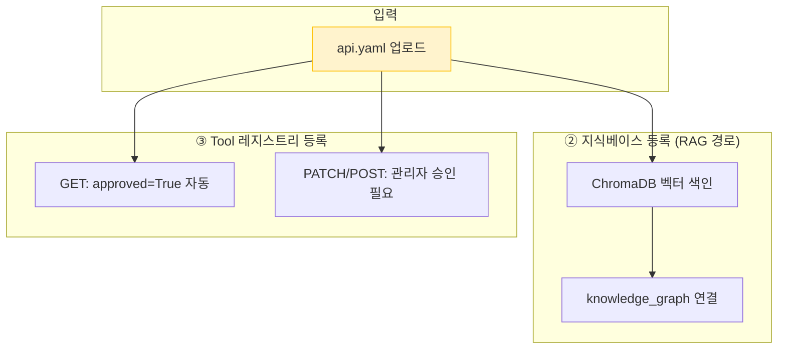
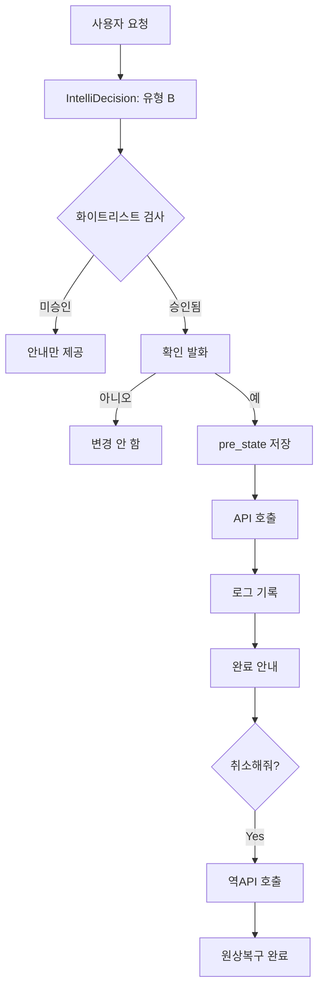
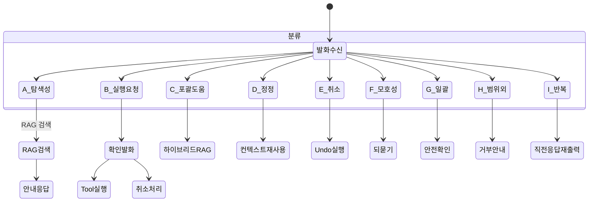
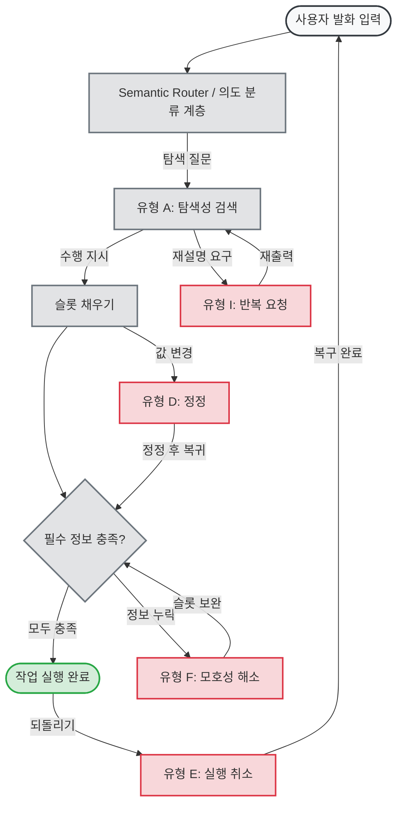
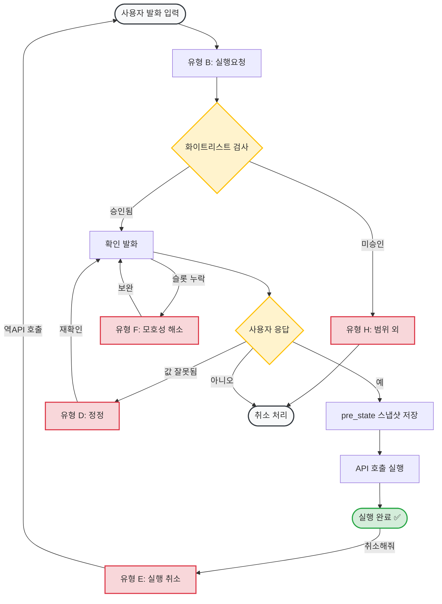
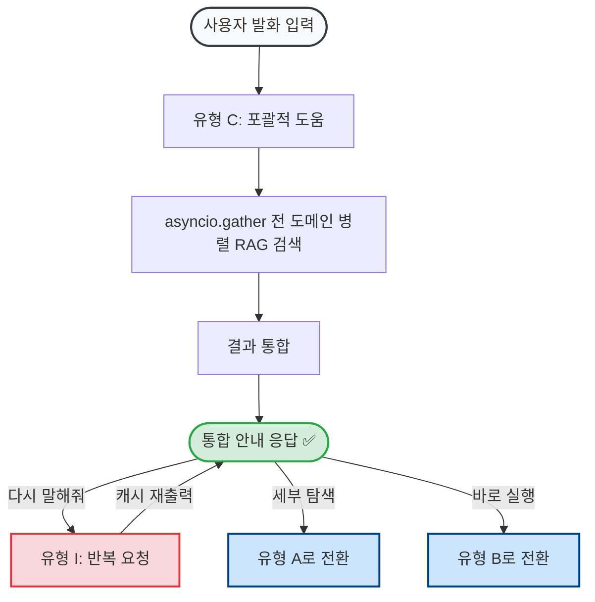
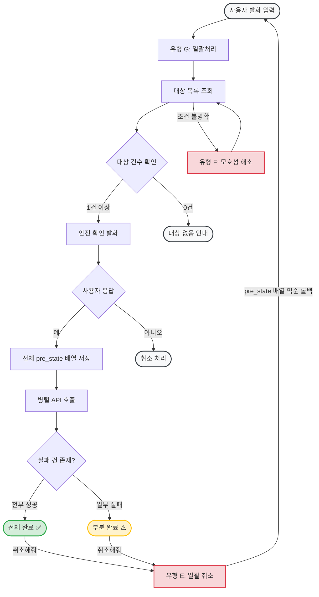
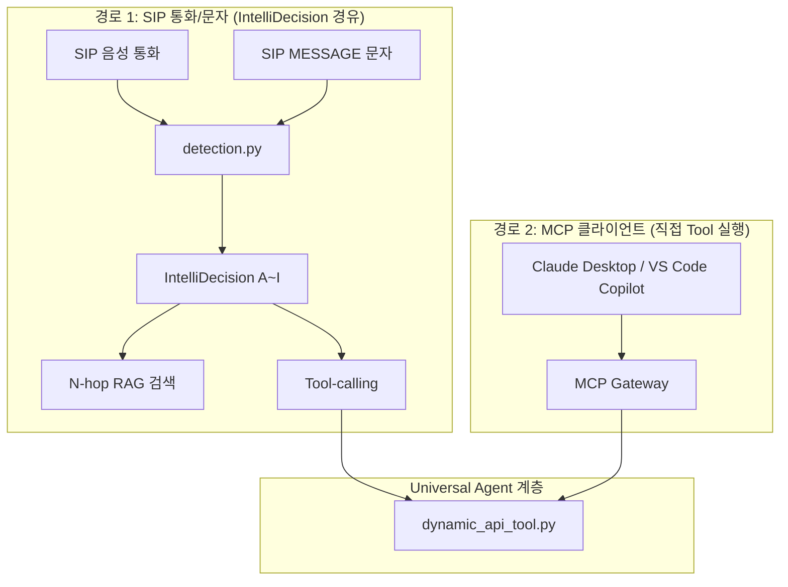

# AI 서비스 도우미 (AI Service Agent) — 서비스 소개서

**문서 유형**: 서비스 소개서 (Service Introduction)
**작성일**: 2026-08-10
**버전**: 3.0
**대상 독자**: 도입 검토 담당자, 개발팀, 운영팀, 비기술 이해관계자

---

## 목차

1. [배경 및 개발 경위](#1-배경-및-개발-경위)
2. [핵심 기능 상세](#2-핵심-기능-상세)
   - 2.1 지식베이스 구성 — 설계 근거와 업로드 방법 상세
   - 2.2 N-hop RAG — 관계형 지식 그래프 검색
   - 2.3 Tool-calling — 실제 API 실행 (Undo 보장)
   - 2.4 IntelliDecision — 대화 의도 분류 엔진
3. [아키텍처](#3-아키텍처)
4. [범용 REST-API 연동 — 활용 방안](#4-범용-rest-api-연동--활용-방안)
5. [MCP 연동 — AI 생태계 확장](#5-mcp-연동--ai-생태계-확장)
6. [A-Z 완전 사용 가이드 — 처음부터 끝까지](#6-a-z-완전-사용-가이드--처음부터-끝까지)
7. [참고 문헌](#7-참고-문헌)

---

## 1. 배경 및 개발 경위

### 1.1 출발점 — 통화매니저 CS 문의 급증

통화매니저 서비스를 운영하면서 CS 고객센터에 서비스 이용 문의가 집중되는 문제가 있었다.

#### CS 문의 대분류 현황 (총 4,845건)

| 대분류              | 건수        | 비율       | 비고                           |
| ------------------- | ----------- | ---------- | ------------------------------ |
| 유통사 작업 요청    | 2,224건     | 46.0%      | 파트너사 대행 요청             |
| **서비스 이용**     | **1,083건** | **22.0%**  | **⬅ AI 도우미 직접 대응 가능** |
| 기타                | 1,038건     | 21.0%      |                                |
| 서비스 장애         | 467건       | 10.0%      | 기술 지원 필요                 |
| 데이터 복구 요청    | 27건        | 1.0%       |                                |
| 개발자 홈페이지 QnA | 6건         | 0.0%       |                                |
| **합계**            | **4,845건** | **100.0%** |                                |

전체 문의의 **22%(1,083건)** 가 서비스 이용 방법을 뤵는 질문이다. 이 유형은 숫련된 상담원이 아니어도, 매뉴얼만 제대로 검색할 수 있으면 즉시 해결할 수 있다.

**해결 방향**: 자연어로 대화하면 서비스 안내·설정 조회·실제 설정 변경까지 처리해주는 **AI 서비스 도우미 Agent**를 구축한다.

### 1.2 핵심 아이디어 세 가지

| 목표                | 기술 수단                    | 효과                               |
| ------------------- | ---------------------------- | ---------------------------------- |
| 서비스 이용 안내    | N-hop RAG + 화면 경로 안내   | 메뉴를 몰라도 자연어 질문으로 해결 |
| 실제 설정 조회/변경 | Tool-calling (API 직접 호출) | 대화로 설정 변경, 실수 시 Undo     |
| 원활한 대화 흐름    | IntelliDecision (의도 분류)  | 9가지 대화 패턴을 자동 인식        |

### 1.3 발전 — 도메인 비종속 Universal Agent로

> **통화매니저에만 쓰기엔 아꺝다.
> 매뉴얼 파일과 REST-API 스펙만 있으면 어떤 서비스든 동일하게 동작한다.**

이 전환이 이 시스템의 핵심 차별점이다.

---

## 2. 핵심 기능 상세

### 2.1 지식베이스 구성 — 설계 근거와 업로드 방법 상세

#### 설계 철학 — 데이터만 업로드하면 AI가 자동으로 구성된다

**"코드 없이 데이터만으로 AI 능력이 확장된다"** — 파일을 업로드하는 순간:
- N-hop 그래프 관계가 자동 생성된다
- RAG 검색 인덱스가 즉시 구축된다
- Tool 실행 인터페이스가 동적으로 등록된다

---

#### 기능별 설계 근거

**① 업로드만으로 즉시 구성되는 RAG 지식베이스**

> **LlamaIndex** (GitHub 38,000+⭐):
> "문서를 업로드하면 자동으로 청크 분리·임베딩·인덱스 구축"을 표방하는 LLM 데이터 프레임워크. 사실상 표준(de facto standard).
> — [LlamaIndex Docs](https://docs.llamaindex.ai/)

> **RAG 원저 논문** (Lewis et al., 2020, Meta AI, NeurIPS):
> "외부 문서를 동적으로 검색·주입하면 LLM의 할루시네이션이 줄고 최신 지식을 반영할 수 있음을 증명."
> — [arXiv:2005.11401](https://arxiv.org/abs/2005.11401)

**우리의 적용**: 파일 업로드 즉시 `MarkdownManualAdapter` / `PDFAdapter` / `OpenAPIAdapter`가 첩크를 분리하고 ChromaDB에 임베딩을 저장한다. 코드 배포 없이 다음 질문부터 바로 검색에 반영된다.

---

**② OpenAPI 스펙 → Tool 동적 자동 생성**

> **Gorilla LLM** (UC Berkeley, 2023, GitHub 11,000+⭐):
> 핵심 발견: **"API 스펙 문서를 그대로 컨텍스트로 주입하면 LLM이 올바른 호출 코드를 생성한다."
> — [arXiv:2305.15334](https://arxiv.org/abs/2305.15334)

> **OpenAI GPT Actions** (2023):
> OpenAI가 OpenAPI 스펙을 GPT Plugin / Custom Actions의 입력 형식으로 채택.
> — [OpenAI GPT Actions Docs](https://platform.openai.com/docs/actions/introduction)

**우리의 적용**: OpenAPI YAML 업로드 → `OpenAPIAdapter` 파싱 → `knowledge_document_endpoints` 테이블에 동적 등록. 새 API 추가 시 코드 수정이 전혀 없다.

---

**③ N-hop 그래프 자동 구성 — Client-Centric 동적 지식베이스**

> **Microsoft GraphRAG** (2024, GitHub 37,000+⭐):
> "단순 벡터 검색으로는 도메인 전체에서 무엇이 가능한가?와 같은 글로벌 질문에 답하기 어렵다."
> — [arXiv:2404.16130](https://arxiv.org/abs/2404.16130)

> **Anthropic Contextual Retrieval** (2024-09):
> 각 청크에 맥락을 함께 임베딩하면 검색 실패율이 **35% 감소**(5.7%→3.7%).
> — [Anthropic Blog](https://www.anthropic.com/news/contextual-retrieval)

**우리의 적용**: GraphRAG의 복잡한 엔티티 자동추출 대신, `{domain: ...}` 태그와 OpenAPI `tags` 필드로 **명시적 관계 스키마**를 즉시 생성한다. `knowledge_graph.py`가 `document → domain → screen → api_endpoint` 관계를 자동으로 연결한다.

---

**④ 테넌트별 완전 격리 — Client-Centric 구조**

> **Pinecone Multi-Tenancy Best Practices** (2024):
> "메타데이터 필터는 가장 유연한 멀티테넌트 격리 옵션이다."
> — [Pinecone Multi-Tenant Architecture](https://www.pinecone.io/learn/multi-tenancy/)

**우리의 적용**: ChromaDB `where={"owner": tenant_id}` 필터를 모든 쿼리에 강제 적용. 테넌트 추가 시 코드 변경 없이 데이터 업로드만으로 즉시 독립 인스턴스가 생성된다.

---

#### 지원하는 파일 형식 3가지

| 형식                | 파일 예     | 필수 포맷?       | 생성 결과                          |
| ------------------- | ----------- | ---------------- | ---------------------------------- |
| **마크다운 매뉴얼** | `manual.md` | ❌ 자유 형식 가능 | RAG 검색용 지식                    |
| **PDF 문서**        | `guide.pdf` | ❌ 어떤 PDF든     | RAG 검색용 지식                    |
| **OpenAPI 스펙**    | `api.yaml`  | ✅ OpenAPI 3.x    | RAG 지식 + **실제 Tool 실행** 가능 |

#### 마크다운 매뉴얼 — 두 가지 방식

**방식 A: 자유 형식 (바로 업로드 가능)**
```markdown
# 카페 오더 시스템 관리자 가이드

이 시스템에서는 메뉴 관리, 주문 처리, 재고 관리를 할 수 있습니다.
메뉴를 추가하려면 [메뉴관리] 탭에서 [+ 메뉴 추가] 버튼을 클릭합니다.
```
→ 단락 단위로 분리해 ChromaDB에 색인됨. RAG 검색 가능.

**방식 B: Q&A 구조화 형식 (정밀도 향상)**
```markdown
## 1. 메뉴 관리 {domain: menu-management}

**Q: 새 메뉴는 어떻게 추가하나요?**
A: 메뉴관리 탭 → [+ 메뉴 추가] 버튼 클릭 → 메뉴명, 가격, 카테고리 입력 → 저장

**Q: 품절된 메뉴를 처리하려면?**
A: 해당 메뉴 카드의 [품절처리] 버튼을 클릭하면 즉시 반영됩니다.
```
→ Q&A 단위로 분리, `{domain: menu-management}` 태그로 도메인 자동 연결.

**결론**: 어떤 형식도 업로드 가능하다. Q&A 구조화 형식은 N-hop RAG의 도메인 연결 정밀도를 높이지만, 일반 PDF나 자유 형식 마크다운도 RAG 검색에 즉시 활용된다.

#### OpenAPI 스펙이란?

OpenAPI는 **REST API를 기술하는 업계 표준 문서 형식(YAML/JSON)**이다. 특정 서비스 전용 포맷이 아니라, "이 서버에 어떤 URL로 요청하면, 어떤 파라미터를 보내야 하는지"를 기계가 읽을 수 있게 정의한 범용 스펙이다.

| 프레임워크      | OpenAPI 스펙 얻는 방법                         |
| --------------- | ---------------------------------------------- |
| **FastAPI**     | 서버 실행 후 `/openapi.json` — 자동 생성       |
| **Spring Boot** | Springdoc 추가 → `/v3/api-docs`                |
| **Django REST** | drf-spectacular 추가 → `/api/schema/`          |
| 스펙 없는 경우  | 엔드포인트 몇 개만 YAML로 직접 작성 (5분 소요) |

#### OpenAPI 스펙 — 업로드에서 RAG 참조까지



#### OpenAPI 스펙 예시 파일

```yaml
# 예: cafe-orders-api.yaml
openapi: "3.0.0"
info:
  title: 카페 오더 관리 API
  version: "1.0.0"
servers:
  - url: https://api.cafe-order.example.com
paths:
  /orders/{order_id}:
    get:
      summary: 주문 조회
    patch:
      summary: 주문 상태 변경  # ← 이 메서드를 승인하면 AI가 직접 호출
  /menu/{menu_id}/status:
    patch:
      summary: 메뉴 품절 처리   # ← 마찬가지로 승인 후 Tool 실행 가능
```

업로드하면:
1. 엔드포인트 자동 파싱 → `knowledge_document_endpoints` 테이블 저장
2. GET 메서드: 승인 없이 즉시 Tool 실행 가능 (조회)
3. PATCH/POST/PUT/DELETE: 명시적 승인 클릭 필요 (쓰기 화이트리스트)

> **시장 검증**: GitHub에 `openapi-to-mcp` 관련 저장소 **437개**, 핵심 원칙: **"Zero Code Modification"** — 원본 API 서버를 한 줄도 수정하지 않는다.

---

### 2.2 N-hop RAG — 관계형 지식 그래프 검색

단순한 키워드 검색이 아니다. 문서 → 도메인 → 화면 → 실행 가능 여부까지 **그래프를 따라 순회**하며 맥락 있는 답변을 생성한다.

> **Microsoft GraphRAG** (GitHub 37,000+⭐)가 제안하는 Local/Global/DRIFT 검색 전략을 경량화해 적용했다.
> 엔티티 자동추출·Leiden 클러스터링의 복잡도 없이 명시적 관계 스키마로 동일한 효과를 낸다.
> — [Microsoft GraphRAG](https://microsoft.github.io/graphrag/)

> **Glean 엔터프라이즈 AI** (엔터프라이즈 검색 업계 1위)의 Head of Product는
> "지식 그래프와 벡터DB 중 하나가 아니라 둘 다 사용해야 한다"고 명시했다 —
> 그래프는 **관계 추론**에, 벡터는 **의미 유사도**에 각각 강하기 때문이다.
> — [Glean: Knowledge Graph vs Vector Database](https://www.glean.com/blog/knowledge-graph-vs-vector-database)

#### 데이터 구성 구조

```
┌─────────────────────────────────────────────────────────────────┐
│  ChromaDB (벡터 스토어)                                          │
│                                                                  │
│  각 문서 청크의 메타데이터:                                       │
│  owner: "1001"                    ← 테넌트 격리                  │
│  doc_type: "knowledge_document"   ← 문서 유형                   │
│  related_domain: "inventory"      ← 도메인 태그                  │
│  section_title: "§3 재고 현황"    ← 섹션 제목                   │
│  text: "재고 부족 상품은..."       ← 실제 내용                   │
└─────────────────────────────────────────────────────────────────┘
         │
         │ (1-hop) 벡터 유사도 검색
         ▼
┌─────────────────────────────────────────────────────────────────┐
│  knowledge_graph.py (관계 그래프)                                │
│  manual_qa ──relates_to──► catalog_domain                        │
│  catalog_domain ──rendered_by──► frontend_screen                 │
│  frontend_screen ──writable──► intent_type                       │
│  document ──relates_to──► api_endpoint                           │
└─────────────────────────────────────────────────────────────────┘
```

#### 실제 검색 흐름 (예: "재고 부족한 상품 어떻게 봐?")

├─ [1-hop] ChromaDB 벡터 검색
│  쾼리 임베딩 → 코사인 유사도 계산
│  related_domain: inventory-management 청크 매칭

├─ [2-hop] 도메인 → 화면 연결
│  inventory-management → nav_hint: "상품관리 메뉴 → 재고현황 탭"

└─ [3-hop] 실행 가능 여부 판단
  PATCH /inventory/{sku} → 승인됨 ✅ → Tool 호출 가능
  유형 A(탐색성) = 안내만 | 유형 B(실행성) = Tool 실행 가능
```

#### 유형 C 하이브리드 검색 (다중 도메인 병렬)

"뭘 할 수 있어?" 같은 포괄적 질문은 모든 도메인을 동시에 검색한다.

```
질문: "이 관리자 사이트에서 뭘 할 수 있는지 알려줘"
│
└─ asyncio.gather() 병렬 실행:
   ├─ inventory-management 도메인 검색 → "재고 조회/수정"
   ├─ order-management 도메인 검색    → "주문 상태 변경"
   └─ sales-stats 도메인 검색         → "매출 통계 조회"

통합 응답:
"이 도우미로 할 수 있는 것들을 안내해 드릴게요!
 📦 재고 관리: 재고 현황 조회, 수량 수정
 📋 주문 관리: 주문 상태 조회, 배송 상태 변경
 📊 매출 통계: 일별/주별 매출 현황 조회"
```

---

### 2.3 Tool-calling — 실제 API 실행 (Undo 보장)

> **GoEx** (arXiv:2312.10929): AI Agent가 실세계 시스템 조작 시 undo/damage confinement 원칙.
> 실행 전 상태를 저장하고 모든 행동은 반드시 롤백 가능해야 한다.
> — [arXiv:2312.10929](https://arxiv.org/abs/2312.10929)

> **Anthropic Building Effective Agents** (2024-12):
> Agent가 행동을 실행하기 전에 사용자 컨페이너를 통해 확인을 받아라.

**우리의 적용**: `pre_state_json` 스냅샷 저장 → API 호출 → `tool_execution_log` 기록. 실행 후 언제든 역호출로 원복 가능. 화이트리스트 미승인 API는 실행되지 않는다.

#### 실행 보안 원칙



---

### 2.4 IntelliDecision — 대화 의도 분류 엔진

사용자의 모든 발화를 **9가지 유형(A~I)**으로 자동 분류하여 최적 처리 경로로 라우팅한다. LLM이 매 턴마다 프롬프트에 명시된 유형 정의를 참조해 판정한다(키워드 매칭 없음).

> **Amazon Alexa Standard Built-in Intents**:
> 모든 상용 Alexa 스킬이 **의무 구현**해야 하는 9개 인텐트와 우리의 유형 A~I는 구조적으로 1:1 대응된다.
> 업계에서 수십억 건의 대화를 통해 검증된 분류 체계다.
> — [Amazon Alexa Standard Built-in Intents](https://developer.amazon.com/en-US/docs/alexa/custom-skills/standard-built-in-intents.html)

> **Semantic Router** (GitHub 3,800+⭐): IEEE GlobeCom 2024 5G 통신망 의도 분류, 콜센터 10ms 저지연 사례.

> **Anthropic Building Effective Agents** (2024-12):
> "관심사 분리 Routing"이 고객 지원 유형 분류의 업계 표준임을 명시.

**우리의 적용**: LLM이 매 턴 9가지 유형 정의를 프롬프트로 받고 판정한다. 키워드 매칭 없이 의미를 이해하므로 철자법, 스랬랑, 오타 스키마에도 강하다.

#### 유형별 상태 전이 다이어그램



#### 유형 A 상세 — Happy Path / Unhappy Path 전이

유형 A(탐색성)는 탐색 → 실행 의지 표명 → 슬롯 채우기 → 완료의 전체 흐름을 포함한다.



| 경로           | 흐름                               | 설명                                   |
| -------------- | ---------------------------------- | -------------------------------------- |
| **Happy Path** | A → 슬롯 → 충족 → 실행             | 필요 정보가 모두 발화에 포함된 경우    |
| **F 이탈**     | 정보 누락 → 되묻기 → 보완 → 재진입 | "그거 바꿔줘"처럼 대상 불명확          |
| **D 이탈**     | 진행 중 값 변경 → 재확인           | "아니, 20개 말고 15개로"               |
| **I 이탈**     | A → 재출력 → A 복귀                | RAG 재검색 없이 직전 응답 재출력       |
| **E 이탈**     | 완료 후 → 롤백                     | `pre_state` 역호출 후 루프 시작점 복귀 |

---

#### 유형 B 상세 — 실행요청 Happy Path / Unhappy Path 전이

유형 B(실행요청)는 가장 위험도가 높은 유형이다. 화이트리스트 검사 → 확인 발화 → Tool 실행의 3단계 보안 게이트를 반드시 통과해야 한다.



| 경로           | 설명                                            |
| -------------- | ----------------------------------------------- |
| **Happy Path** | 승인된 API + 명확한 슬롯 + 사용자 확인 → 실행   |
| **H 차단**     | 미승인 API는 실행 없이 안내만. 오호출 원천 차단 |
| **F 이탈**     | 대상 불명확 → 되묻기 → 확인 단계 재진입         |
| **D 이탈**     | 확인 중 마음 변경 → 스냅샷 전이므로 안전        |
| **E 롤백**     | `pre_state`로 원복. 스냅샷이 있으므로 항상 가능 |

---

#### 유형 C 상세 — 포괄도움 Happy Path / Unhappy Path 전이



---

#### 유형 G 상세 — 일괄처리 Happy Path / Unhappy Path 전이

유형 G(일괄처리)는 단건 B와 달리 **다수 대상에 동일 동작을 적용**한다. 대상 목록 확정 → 건수 확인 → 안전 확인의 3중 게이트로 실수를 방지한다.



| 경로           | 설명                                         |
| -------------- | -------------------------------------------- |
| **Happy Path** | 조건 명확, 대상 존재, 사용자 확인. 전부 성공 |
| **F 이탈**     | "재고 부족"의 기준이 없을 때 되묻기          |
| **0건 안내**   | 조건에 맞는 대상 없음. 실행하지 않음         |
| **부분 실패**  | 실패 건은 변경되지 않았으므로 롤백 불필요    |
| **E 롤백**     | **배열** 단위 스냅샷으로 전체 원복           |

---

#### 유형별 대표 질문 예시

| 유형  | 이름        | 대표 질문 예시                 | 처리 방식                         |
| ----- | ----------- | ------------------------------ | --------------------------------- |
| **A** | 탐색성      | "채팅 자동응답 어떻게 켜?"     | RAG 검색 → 화면 경로 안내         |
| **B** | 실행요청    | "ORD-1042 배송중으로 바꿈"     | 확인 발화 → Tool 실행 → Undo 가능 |
| **C** | 포괄적 도움 | "이 도우미로 뿐을 할 수 있어?" | 전 도메인 병렬 RAG → 종합 안내    |
| **D** | 정정        | "배송중이 아니라 배송완료로"   | 직전 맥락 재사용                  |
| **E** | 실행 취소   | "방금 한 거 취소해줘"          | pre_state 스냅샷으로 월복         |
| **F** | 모호성 해소 | "그거 바꿈줘"(대상 불명)       | 구체 정보 재질문                  |
| **G** | 일괄 처리   | "재고 부족 상품 전부 20개로"   | 안전 확인 후 다건 처리            |
| **H** | 범위 외     | "환불 처리해줘"(미지원)        | 지원 불가 명확히 안내             |
| **I** | 반복 요청   | "다시 말해줘"                  | 직전 응답 재출력                  |

---

## 3. 아키텍처

### 3.1 두 가지 접근 경로

**중요**: MCP 클라이언트와 SIP/SMS는 서로 다른 경로를 사용한다.



### 3.2 테넌트별 완전 분리

모든 데이터는 `owner` 필드로 테넌트 간 격리된다. ChromaDB `where={"owner": tenant_id}` 필터를 모든 쿼리에 강제 적용한다.

---

## 4. 범용 REST-API 연동 — 활용 방안

### 4.1 시장 현황

> **Intercom Fin** (12,000+ 기업 고객, 평균 문제 해결률 76%)

> **Zendesk AI Agent**: TeamSystem 자동화율 **80%**, Hello Sugar 월 **$14,000** CS 비용 절감

### 4.2 활용 가능한 분야

| 분야          | 기존 방식                    | AI 도우미 연동 후                 |
| ------------- | ---------------------------- | --------------------------------- |
| 소매/이커머스 | 담당자가 관리 화면 직접 조작 | "ORD-1234 배송중으로 바꿈" → 즉시 |
| 의료/예약     | 전화·이메일로 예약 변경      | "오늘 오후 3시 예약을 내일로"     |
| F&B 운영      | 메뉴판 직접 업데이트         | "아메리카노 품절 처리해줘"        |

---

## 5. MCP 연동 — AI 생태계 확장

MCP(Model Context Protocol)는 Anthropic이 2024년 발표한 **AI 클라이언트-서버 표준 프로토콜**이다.

- Claude Desktop, VS Code GitHub Copilot, Cursor 등 주요 AI 앱이 MCP 지원
- [mcp-link](https://github.com/automation-ai-labs/mcp-link) (622⭐): Zero Code Modification
- [openapi-mcp-server](https://github.com/janwilmake/openapi-mcp-server) (900⭐)

---

## 6. A-Z 완전 사용 가이드

#### STEP 1: 매뉴얼 문서 작성 (10분)
자유 형식으로 작성한 .md 파일을 업로드.

#### STEP 2: 파일 업로드 (2분)

AI 엔이전트 → 지식베이스 → 지식 업로드 → 색인 완료.

#### STEP 3: OpenAPI 스펙 업로드 (선택)

업로드 후 GET 맰 자동 승인, 쌓기 메서드는 명시 승인 콴릭 필요.

---

## 7. 참고 문헌

| #   | 기능                      | 참고 자료                                                                                                                            | 핸심 내용                                |
| --- | ------------------------- | ------------------------------------------------------------------------------------------------------------------------------------ | ---------------------------------------- |
| 1   | IntelliDecision 유형 분류 | [Amazon Alexa Standard Built-in Intents](https://developer.amazon.com/en-US/docs/alexa/custom-skills/standard-built-in-intents.html) | 9개 인텐트 업계 표준                     |
| 2   | N-hop RAG                 | [Microsoft GraphRAG](https://microsoft.github.io/graphrag/) (37,000+⭐)                                                               | Local/Global/DRIFT 검색 전략             |
| 3   | 지식 그래프 + 벡터DB      | [Glean](https://www.glean.com/blog/knowledge-graph-vs-vector-database)                                                               | "둘 다 사용해야 한다"                    |
| 4   | RAG 검색 품질             | [Anthropic Contextual Retrieval](https://www.anthropic.com/news/contextual-retrieval)                                                | 검색 실패율 35% 감소                     |
| 5   | RAG 원저 논문             | [arXiv:2005.11401](https://arxiv.org/abs/2005.11401) (Meta AI, NeurIPS 2020)                                                         | 동적 검색 주입으로 LLM 할루시네이션 감소 |
| 6   | OpenAPI Tool 자동 생성    | [Gorilla LLM arXiv:2305.15334](https://arxiv.org/abs/2305.15334) (UC Berkeley)                                                       | API 스펙 주입 → LLM zero-shot 호출       |
| 7   | AI 실행 안전성            | [GoEx arXiv:2312.10929](https://arxiv.org/abs/2312.10929)                                                                            | undo/damage confinement                  |
| 8   | 동적 지식베이스           | [LlamaIndex](https://docs.llamaindex.ai/) (38,000+⭐)                                                                                 | 업로드 → 자동 색인                       |
| 9   | OpenAPI Universal Agent   | [mcp-link](https://github.com/automation-ai-labs/mcp-link) (622⭐)                                                                    | Zero Code Modification                   |
| 10  | 멀티테넌트 격리           | [Pinecone Multi-Tenancy](https://www.pinecone.io/learn/multi-tenancy/) (2024)                                                        | 메타데이터 필터 방식                     |

---

*최종 업데이트: 2026-08-13*
