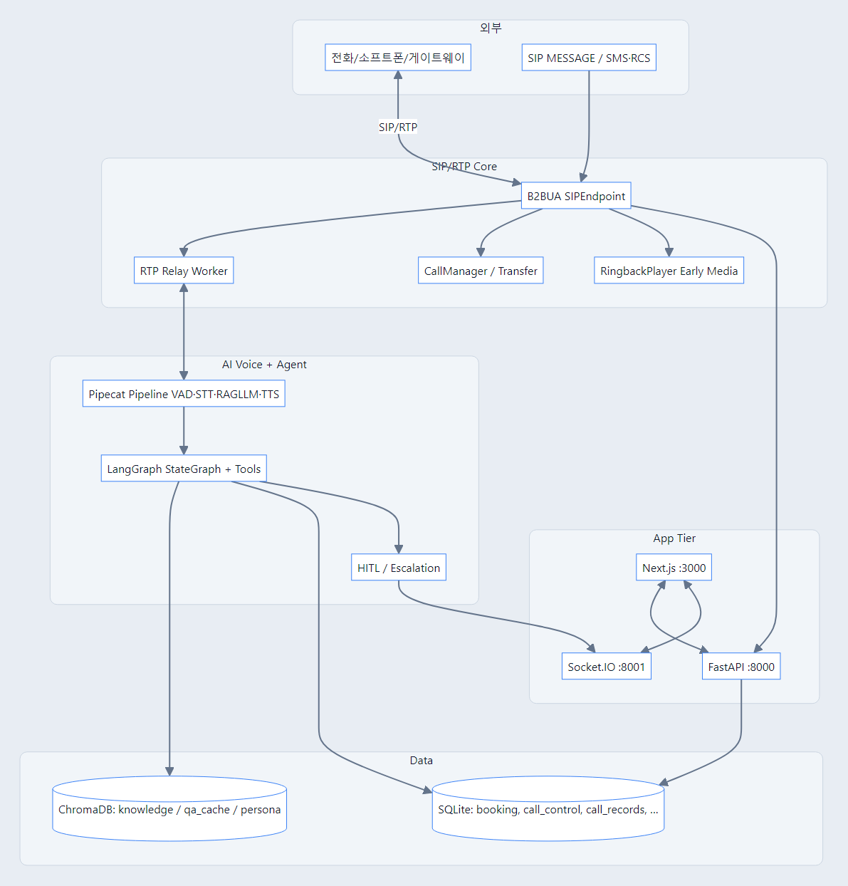
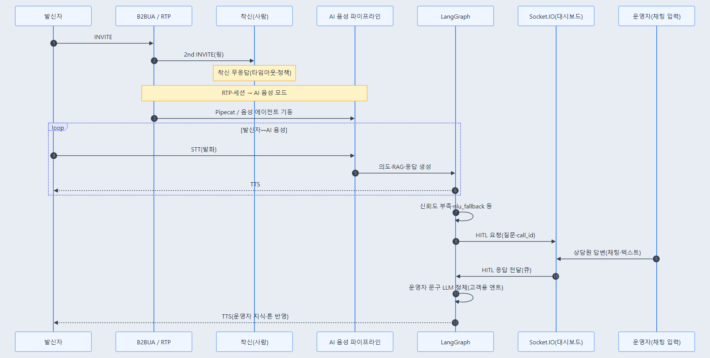
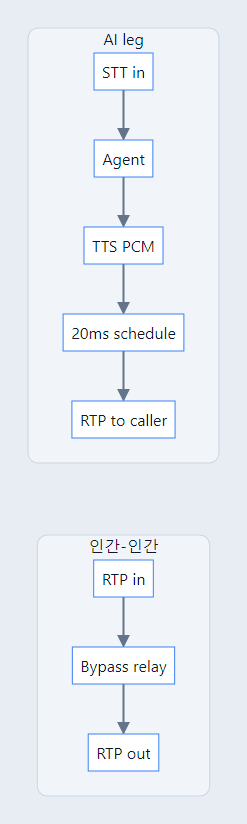
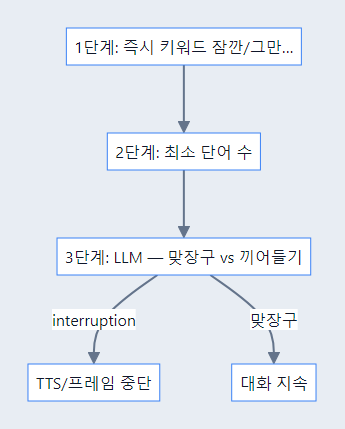
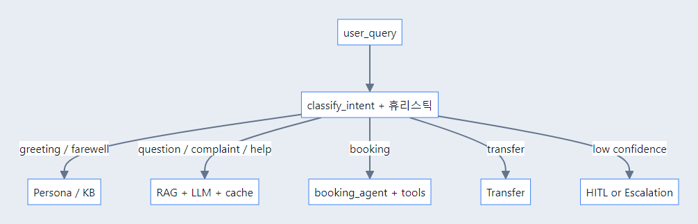
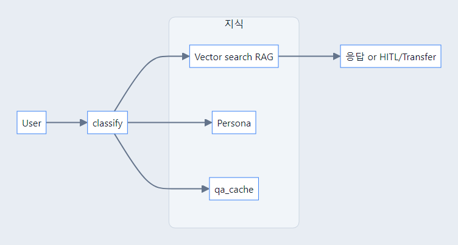
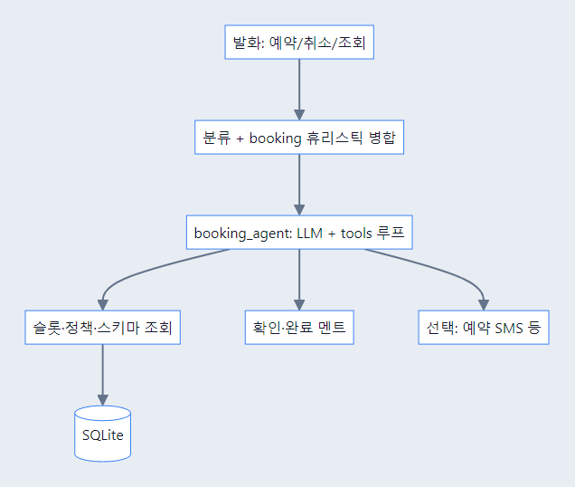
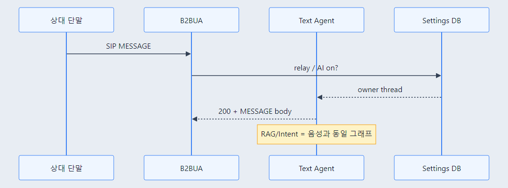
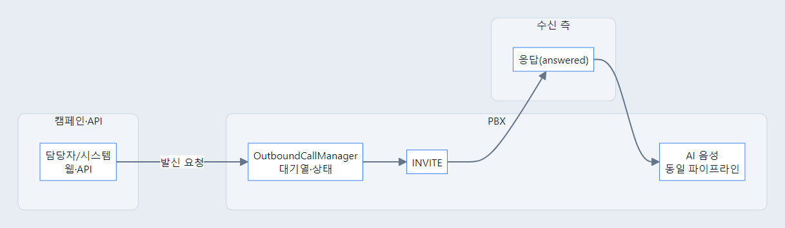
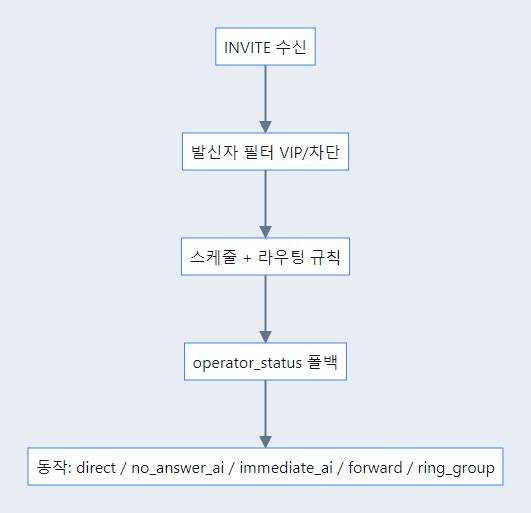

# AI SIP PBX — 시스템 소개

**AI SIP PBX**는 Python 기반 **SIP B2BUA(Back-to-Back User Agent)** 위에 **실시간 음성 AI**, **웹 운영 콘솔**, **지식·연락처·문자·예약**을 한데 묶은 통합 플랫폼이다.

| 항목 | 내용 |
|------|------|
| **대상 독자** | 제품·운영·엔지니어링 이해관계자, 시스템 아키텍처 검토에 참여하는 팀 |
| **최종 수정** | 2026-04-27 |
| **이전 문서 백업** | 상세 항목·API 표가 필요하면 [`SYSTEM_OVERVIEW_2026-04-27_before_rewrite.md`](SYSTEM_OVERVIEW_2026-04-27_before_rewrite.md) 참고 |

### 다이어그램 (PNG) — 문서·교육 자료 등에 삽입

렌더된 그림은 `docs/images/system-overview/` 에 있으며, 편집용 Mermaid 소스는 `docs/diagrams/system-overview/`의 `01-`…`11-` 접두 `.md` 파일(아래 표·[README](diagrams/system-overview/README.md))이다. PNG는 **`mermaid-frontend.json` + `mermaid-frontend.css`** 로 생성해 **밝은 UI 톤·카드형 패널·넉넉한 노드 간격**을 맞춘다(상세·재생성: [diagrams/system-overview/README.md](diagrams/system-overview/README.md)).

| PNG | 절 | 소스(`.md`) |
|-----|----|--------------|
| [`01-logical-architecture.png`](images/system-overview/01-logical-architecture.png) | §3.1 | [`01-logical-architecture.md`](diagrams/system-overview/01-logical-architecture.md) |
| [`02-inbound-voice-sequence.png`](images/system-overview/02-inbound-voice-sequence.png) | §3.3 | [`02-inbound-voice-sequence.md`](diagrams/system-overview/02-inbound-voice-sequence.md) |
| [`03-rtp-modes.png`](images/system-overview/03-rtp-modes.png) | §4.2 | [`03-rtp-modes.md`](diagrams/system-overview/03-rtp-modes.md) |
| [`04-smart-barge-in.png`](images/system-overview/04-smart-barge-in.png) | §4.3 | [`04-smart-barge-in.md`](diagrams/system-overview/04-smart-barge-in.md) |
| [`05-intent-routing.png`](images/system-overview/05-intent-routing.png) | §4.4 | [`05-intent-routing.md`](diagrams/system-overview/05-intent-routing.md) |
| [`06-knowledge-flow.png`](images/system-overview/06-knowledge-flow.png) | §4.5 | [`06-knowledge-flow.md`](diagrams/system-overview/06-knowledge-flow.md) |
| [`07-booking-tools.png`](images/system-overview/07-booking-tools.png) | §4.6 | [`07-booking-tools.md`](diagrams/system-overview/07-booking-tools.md) |
| [`08-sip-message-sequence.png`](images/system-overview/08-sip-message-sequence.png) | §4.7 | [`08-sip-message-sequence.md`](diagrams/system-overview/08-sip-message-sequence.md) |
| [`09-ringback-suno.png`](images/system-overview/09-ringback-suno.png) | §4.9 | [`09-ringback-suno.md`](diagrams/system-overview/09-ringback-suno.md) |
| [`10-call-control-priority.png`](images/system-overview/10-call-control-priority.png) | §4.10 | [`10-call-control-priority.md`](diagrams/system-overview/10-call-control-priority.md) |
| [`11-outbound-campaign.png`](images/system-overview/11-outbound-campaign.png) | §4.8 | [`11-outbound-campaign.md`](diagrams/system-overview/11-outbound-campaign.md) |

---

## 1. 배경 및 목표

### 1.1 왜 만들었는가 (배경)

- 기존 **시나리오형 콜봇**은 초기 시나리오·답변셋 구축에 **높은 고정비**가 들고, 운영 중 변경도 **스크립트 단위 재작업**에 의존한다.
- 전형적인 **ARS 트리 구조**는 사용자 질문을 유연하게 받기 어렵고, 관리자가 **의도 밖 문의**를 체계적으로 흡수하기도 어렵다.
- **문제은행식 FAQ**만으로는 다양한 표현·후속 질문·맥락 전환을 커버하기 어렵다.

### 1.2 현황 (As-Is 관점에서의 문제)

- 지식이 **수동 입력**에 묶이면 최신성·규모 확장에 한계가 있다.
- 음성 경로가 **고정 TTS + 긴 지연**이면 실제 대화 같은 **턴교환**과 **끼어들기** 요구를 만족시키기 어렵다.
- AI가 답하지 못할 때 **상담원 연계**가 ARS·별도 시스템에 흩어지면 **일관된 고객 경험**을 주기 어렵다.

### 1.3 지향점 (To-Be 목표)

- **Agentic AICC**: LLM·도구·RAG를 묶어 **의도에 맞는 행동**(예약 조회·지식 검색·호전환)을 한 흐름에서 수행한다.
- **Active RAG**: 통화·문자 등 **운영 데이터가 쌓일수록** 지식과 캐시가 갱신되어 **한계 비용**을 낮춘다.
- **HITL + 상담원 전환**: AI 한계 구간을 **대시보드 협업** 또는 **내선 호전환**으로 연결해 **품질과 가용성**을 동시에 확보한다.
- **멀티 테넌트**: 내선(테넌트) 단위로 지식·페르소나·캐시를 **격리**해 **소규모 다수 테넌트** 운영이 가능하다.

---

## 2. Ideation: 해결 전략과 시스템 비교

### 2.1 전략 한 줄

**“표준 SIP/RTP로 통화는 안정적으로 중계하고, 음성·텍스트·툴은 Pipecat + LangGraph + FastAPI로 오케스트레이션한다.”**

- 시그널링·RTP는 **B2BUA**에서 일관되게 제어한다.
- AI 로직은 **대화 그래프(LangGraph)**와 **스토리지(ChromaDB, SQLite)**로 모듈화한다.
- 운영 UI는 **Next.js + Socket.IO**로 실시간 상황을 보여 주고, **착신 정책·연결음·채팅 AI**는 설정 화면으로 모은다.

### 2.2 기존 상용/일반적 구성 (As-Is) vs 본 시스템 (To-Be)

| 구분 | 일반적 As-Is | 본 시스템 To-Be |
|------|----------------|-----------------|
| **지식** | 수개월 시나리오·정적 FAQ | 통화/문자 기반 **자동 적재** + RAG, 시맨틱 캐시 |
| **대화** | ARS 트리, 규칙 매칭 | **의도 분류 + LLM 추론** + 필요 시 **툴 호출** |
| **상담 연계** | 별도 CTI, 수동 | **HITL·호전환·에스컬레이션 모드**를 동일 PBX 흐름에 통합 |
| **음성 UX** | 긴 TTS, 끼어들기 제한 | **VAD + 턴 전략 + 스마트 바지인**, 20ms 격자 **연속 RTP** (AI 모드) |
| **멀티채널** | 음성/문자 분리 제품 | **SIP MESSAGE·RCS/SMS**와 **동일 에이전트**를 맞댈 수 있음(설정 기반) |
| **착신 정책** | PBX/헤더에 분산 | **착신 제어 DB + 스케줄**로 “직접/지연 AI/즉시 AI/전달/그룹”을 한 곳에서 |

---

## 3. 현재 시스템 아키텍처 (상세)

### 3.1 논리 구성

*편집·재렌더: [`diagrams/system-overview/01-logical-architecture.md`](diagrams/system-overview/01-logical-architecture.md)*

### 3.2 데이터·테넌트 (「나만의 AI」를 가능하게 하는 구조)

**데이터** 저장·조회 위치, **고객사·조직** 단위(테넌트)로 **지식·응답**이 **분리**되는 방식을 아래에서 정리한다.

**비유**  
하나의 PBX/플랫폼을 **여러 ‘입주사’**가 쓰는 오피스와 같다. 건물(시스템)은 공유하지만, **각 사무실(테넌트) 서랍**에는 **그 회사만의 매뉴얼**이 들어 있다. 엘리베이터(전화)로 들어온 방문객(발신자)은 **접수처 안내(착신 내선)**에 따라 **어느 서랍을 열지**가 결정되고, AI는 **그 서랍에 있는 지식**만 꺼내 답한다.

**테넌트란**  
- 기술적으로는 보통 **착신 SIP 내선(사용자 ID)** 를 **테넌트 키**(`owner` 등)로 쓴다.  
- “A 번호로 걸리면 A 회사 AI”, “B 번호로 걸리면 B 회사 AI”처럼 **한 번에 하나의 ‘나만의 AI’ 페르소나·지식**이 선택된다.  
- **B 회사**가 올려 둔 FAQ가 **A 회사** 통화에 **섞이지 않도록** 설계한 것이 핵심이다.

**지식·AI가 테넌트별로 나뉘는 이유 (장점)**  
- **지식 격리**: **벡터 DB(ChromaDB)** 에서 `knowledge`·`qa_cache`·`persona` 등이 **owner(내선)별 컬렉션**으로 분리되어, RAG·캐시·인사/톤이 **다른 주체의 데이터에 의존하지 않는다**.  
- **나만의 AI**: 상담·영업팀이 올리는 **문서·Q&A**와 통화·문자로 쌓이는 **자동 적재**가 전부 **그 테넌트의 “두뇌”**에만 쌓인다. 경쟁사·다른 점포와 **지식이 섞일 위험**을 막는다.  
- **페르소나**: “우리는 이런 톤·이런 업무 범위”를 **조직마다** 다르게 둘 수 있어, 동일 LLM 뒤에서도 **브랜드에 맞는 응답**이 나온다.  
- **운영 단위**: 예약·착신 제어·연락처 등 **관계형 데이터(SQLite 등)**도 **테넌트/owner 단위**로 쪼개 관리해, **설정·이력**이 뒤엉키지 않게 한다.

**한 줄 요약**  
> **테넌트 = (대개) 착신 내선 1로 묶이는 “고객사·조직” 단위**이고, **지식·캐시·페르소나·업무 DB를 끊어 두어** “같은 플랫폼이지만 **우리만의 AI**”를 갖는 것이 이 구조의 본질이다.

(포트·호스트·배포 경로 등 **엔지니어용 런타임 표**는 [`SYSTEM_OVERVIEW_2026-04-27_before_rewrite.md`](SYSTEM_OVERVIEW_2026-04-27_before_rewrite.md) 또는 운영 가이드에서 다룬다.)

### 3.3 주요 제어 루프 (복잡 흐름: 무응답 → AI → HITL → 운영자 채팅 기반 응대)

가장 **많은 모듈이 엮이는** 인입 시나리오로 정리한다. (단순 “사람끼리 통화만 되고 끝”이 아닌 경우.)

1. **발신 → 착신(사람)**  
   B2BUA가 **2차 INVITE**로 벨을 울리지만, 착신이 **끄지 못하거나(무응답)** , 착신 정책상 **N초 후 AI** 등으로 **AI 음성 파이프라인**이 뜬다.  
2. **AI 1차 응대**  
   STT → LangGraph(의도·RAG·LLM) → TTS로 **고객과 음성 대화**가 이어진다.  
3. **HITL 에스컬레이션**  
   AI **신뢰도가 낮거나** 답이 어려운 intent 등으로 **HITL**이 켜지면, **대시보드**에 `hitl_requested` 등으로 **질문·call_id**가 올라간다. (고객에는 대기 멘트 TTS.)  
4. **운영자는 “전화”가 아니라 “채팅(텍스트)”으로 답**  
   운영자는 실시간으로 **웹·Socket.IO**를 통해 **짧은 사실/지시**를 입력한다(환경에 따라 대시보드 HITL 패널).  
5. **AI가 그 문구를 “그대로 읽기”가 아니라 가공**  
   시스템이 운영자 문장을 `format_hitl_reply` 를 포함한 흐름으로 **고객이 듣기 자연스운 한국어**로 정리한 뒤 **TTS**로 보낸다.  
6. **결과**  
   **사람(운영자)의 지식·판단**이 **그 통화의 AI 응답**에 반영되고, 이후 **지식베이스 자동 반영** 정책이 있으면 같은 질문을 AI가 **다음부터 직접** 처리할 수도 있다(제품/설정에 따름).

*편집·재렌더: [`diagrams/system-overview/02-inbound-voice-sequence.md`](diagrams/system-overview/02-inbound-voice-sequence.md)*

---

## 4. 핵심 기능 (User Story 기반)

**기능 축(4.1~4.10)**마다 **페르소나·User Story**와 **그때 실제로 가능한 경험**을 먼저 쓰고, 동작·경계는 **도식**과 `docs/reports`·코드로 병행한다.

### §4 하위 목차

| 절 | 주제 | User story 요지 | 도식 |
|----|------|-----------------|------|
| [4.1](#41-sip-pbxb2bua) | SIP PBX·B2BUA | 한 통화에서 **사람/AI/전환** | 01 |
| [4.2](#42-rtp) | RTP | **지연·품질**을 경로에 맞춤 | 03 |
| [4.3](#43-ai-음성) | 음성 파이프라인 | **끼어들기**가 자연스럽게 | 04 |
| [4.4](#44-langgraph) | 의도·라우팅 | 말이 **지식/예약/사람**으로 감 | 05 |
| [4.5](#45-지식) | 지식·HITL | **우리 답** + 어려울 땐 **사람** | 06, 02 |
| [4.6](#46-예약) | 예약 | **말·문자**로 슬롯 | 07 |
| [4.7](#47-문자) | 문자 | **같은 AI**로 문자 | 08 |
| [4.8](#48-outbound) | AI 발신 | **시스템이 먼저** 전화 | 11 |
| [4.9](#49-연결음) | 연결음 | **받기 전** 대기 음 | 09 |
| [4.10](#410-착신) | 착신 제어 | **번호·시간** 규칙 | 10 |

---

### 4.1 SIP PBX·B2BUA

#### User story

| ID | 누가 | 원하는 것 | 그래서 |
|----|------|-----------|--------|
| US-4.1a | 발신 고객 | 벨·연결음·**AI**·**상담**이 **한 통화**처럼 이어짐 | 끊김·낯섦 감소 |
| US-4.1b | 운영·엔지니어 | **호**는 두고 **AI**만 재기동 | 장애 범위 축소 |

#### 가능한 경험

- **고객**: 정책에 따라 **벨 → (연결음) → (무응답 시) AI → 상담** 순으로 **같은 세션**에서 전환.
- **운영**: **SIP**·**RTP**·**AI**를 한 런타임에서 다뤄 **로그**·**배포 단위**가 맞음.

#### 도식

*소스: [`01-logical-architecture.md`](diagrams/system-overview/01-logical-architecture.md) · §3.1과 동일*

**요지**: B2BUA가 **독립 레그**로 **AI·호전환**을 끼운다. 메시지·모듈명은 SIP 구현·리포트 참고.

---

### 4.2 RTP

#### User story

| ID | 누가 | 원하는 것 | 그래서 |
|----|------|-----------|--------|
| US-4.2a | 인간–인간 통화 | **초저지연** 양방향 | 자연스러운 대화 |
| US-4.2b | AI 음성 | **끊김 없는** TTS 스트림 | STT/LLM 뒤에도 귀에 부담↓ |

#### 가능한 경험

- **Bypass**: 200 OK 이후 **양방향 릴레이** (지연 최소).
- **AI**: 20ms 격자 **연속 RTP**·큐·무음 채움.
- **Bridge**: 호전환 후 **새 상대**와 미디어.

#### 도식

*소스: [`03-rtp-modes.md`](diagrams/system-overview/03-rtp-modes.md)*

**품질**: AEC·STT 후처리는 §4.3과 연동.

---

### 4.3 AI 음성

#### User story

| ID | 누가 | 원하는 것 | 그래서 |
|----|------|-----------|--------|
| US-4.3a | 고객 | AI 말하는 중 **짧은 수긍** vs **질문**을 다르게 | TTS 끊김 최소·대화 흐름 |
| US-4.3b | 제품/운영 | 잡음·짧은 반응이 **엉뚱한 LLM**으로 안 감 | 비용·오답 감소 |

#### 가능한 경험

- **VAD·턴·STT**로 “이번 말끝”·“진짜 질문 시작”이 구분.
- **스마트 바지인**: 키워드·단어 수·LLM으로 **맞장구/끼어들기** 판정.

#### 도식

*소스: [`04-smart-barge-in.md`](diagrams/system-overview/04-smart-barge-in.md)*

---

### 4.4 LangGraph

#### User story

| ID | 누가 | 원하는 것 | 그래서 |
|----|------|-----------|--------|
| US-4.4a | 고객 | “예약”과 “왜 그래”가 **다른 처리** | 기대한 행동(예약·FAQ·사람) |
| US-4.4b | 운영 | **의도**가 로그·대시보드에 **일정한 라벨** | 원인 분석 |

#### 가능한 경험

- **의도** → Persona / RAG / **booking** / HITL / **Transfer**.
- **Outbound**(§4.8)는 미션이 있으면 **의도 생략** 경로 가능.

#### 도식

*소스: [`05-intent-routing.md`](diagrams/system-overview/05-intent-routing.md)*

---

### 4.5 지식 베이스

#### User story

| ID | 누가 | 원하는 것 | 그래서 |
|----|------|-----------|--------|
| US-4.5a | 고객 | **우리 회사** 톤·범위의 답 | 신뢰·브랜드 |
| US-4.5b | 상담·운영 | 답이 어려우면 **사람**이 **짧게** 쓰고 **고객**은 **듣기** | 정확도+업무 효율 |

#### 가능한 경험

- **RAG·캐시·페르소나**로 유사 질문·톤 통제.
- **HITL** → `format_hitl_reply` 등 → **TTS** (§3.3 루프).

#### 도식 ①

*소스: [`06-knowledge-flow.md`](diagrams/system-overview/06-knowledge-flow.md)*

#### 도식 ② (복잡 루프 — §3.3과 동일 자산)

*소스: [`02-inbound-voice-sequence.md`](diagrams/system-overview/02-inbound-voice-sequence.md)*

---

### 4.6 예약

#### User story

| ID | 누가 | 원하는 것 | 그래서 |
|----|------|-----------|--------|
| US-4.6a | 고객 | **말/문자**로 빈 시간·취소 | IVR·수기 최소 |
| US-4.6b | 운영 | **booking_*** 이벤트로 추적 | 사후 분석·CS |

#### 가능한 경험

- **LLM + 도구** 루프: 슬롯 조회·생성·변경·알림 SMS(설정).

#### 도식

*소스: [`07-booking-tools.md`](diagrams/system-overview/07-booking-tools.md)*

---

### 4.7 문자

#### User story

| ID | 누가 | 원하는 것 | 그래서 |
|----|------|-----------|--------|
| US-4.7a | 고객 | **전화 없이** **같은 수준** AI | 채널 선택 |
| US-4.7b | 상담(웹) | 통화 **후** 문자·같은 **사건** UI | 이력 일원화 |

#### 가능한 경험

- **SIP MESSAGE** → **텍스트** 에이전트 (RTP·STT 생략).
- `X-PBX-Skip-AI-Reply` 등으로 **응답 루프** 방지.

#### 도식

*소스: [`08-sip-message-sequence.md`](diagrams/system-overview/08-sip-message-sequence.md)*

---

### 4.8 Outbound

#### User story

| ID | 누가 | 원하는 것 | 그래서 |
|----|------|-----------|--------|
| US-4.8a | 캠페인 담당 | **리마인드·안내**를 **서버**가 **먼저** 전화 | 선제 응답·이용률 |
| US-4.8b | 수신 고객 | 받으면 **인입과 같이** **AI** 음성(설정) | 채널 경험 일치 |

#### 가능한 경험

- **API/웹** → 대기열·상태·최대 통화·재시도 (`OutboundCallManager`·리포트).

#### 도식

*소스: [`11-outbound-campaign.md`](diagrams/system-overview/11-outbound-campaign.md)*

---

### 4.9 연결음 (Ringback)

#### User story

| ID | 누가 | 원하는 것 | 그래서 |
|----|------|-----------|--------|
| US-4.9a | 발신 고객 | **받기 전**에도 **빈** 느낌이 아님 | 대기·브랜드 |
| US-4.9b | 운영 | **TTS 인사** + **짧은 음원**(Suno 등) | early media |

#### 가능한 경험

- 200 OK 또는 AI 인수 **전** 연결음 **중단**.

#### 도식

*소스: [`09-ringback-suno.md`](diagrams/system-overview/09-ringback-suno.md)*

**배포**: Suno 콜백은 **공인 URL** 필요(예: ngrok).

---

### 4.10 착신 제어

#### User story

| ID | 누가 | 원하는 것 | 그래서 |
|----|------|-----------|--------|
| US-4.10a | IT·대표 번호 | **시간·휴일·무응답**마다 **다른 동작** | 누락·야간 대응 |
| US-4.10b | 고객 | **N초 후 AI** 또는 **즉시 AI** | 기다림/정책에 맞는 응답 |

#### 가능한 경험

- **DB** 규칙: direct / no_answer_ai / immediate_ai / forward / ring_group.

#### 도식

*소스: [`10-call-control-priority.md`](diagrams/system-overview/10-call-control-priority.md)*

> **주의**: 링 그룹 **SIP** 동시/순차는 제품·리포트 **최신** 본 뒤 배포.

| 모델 | 경험에 대응 |
|------|-------------|
| `direct` | 곧장 인간 |
| `no_answer_ai` | N초 **무응답** 후 AI |
| `immediate_ai` | 첫 응답 **AI** (이후 사람 가능) |
| `forward_*` / `ring_group` | **전달**·**헌트** |

`AnnouncementProfile` + `greeting_override`로 **같은 규칙**에 **맞는** 인사 TTS.

---

## 5. 기술 스택

| 층 | 기술 |
|----|------|
| **런타임** | Python 3.11+, **asyncio** |
| **API** | **FastAPI**, structlog |
| **실시간** | **python-socketio** / aiohttp |
| **SIP/RTP** | 자체 B2BUA + RTP (코덱·SDP 조작) |
| **Voice 프레임워크** | **Pipecat** (VAD, STT/TTS 프레임, 파이프라인) |
| **에이전트** | **LangGraph** + **LangChain** tools, **checkpointer** (SQLite 권장 패키지) |
| **LLM/STT/TTS** | **Google Cloud** (Gemini, STT, TTS) |
| **벡터 DB** | **ChromaDB** + **sentence-transformers** 계열 임베딩 |
| **관계 DB** | **SQLite** (예약, 착신제어, 통화 기록 등) |
| **프론트** | **Next.js** (App Router), **TypeScript**, Tailwind, **Zustand** 등 |
| **통화음 생성** | **Suno API** (sunoapi.org), **pydub**/ffmpeg(디코딩) |

**외부 옵션**: **ngrok** (Suno·웹훅), **Google Calendar OAuth** (예약·캘린더), **SMS/RCS** 연동(리포트·`booking_notify`·`end_call_sms` 등).

---

## 부록

- **API·이벤트·CDR 상세 표** — 백업 문서 [`SYSTEM_OVERVIEW_2026-04-27_before_rewrite.md`](SYSTEM_OVERVIEW_2026-04-27_before_rewrite.md) §4, §5.
- **날짜별 구현/장애 기록** — `docs/reports/YYYY-MM/`.
- **설계 세부** — `docs/design/` (프로젝트에 있을 때).
- **다이어그램 자산** — PNG: `docs/images/system-overview/` · Mermaid 소스: `docs/diagrams/system-overview/` (재생성은 [README](diagrams/system-overview/README.md)).

---

*이 문서는 고수준 **아키텍처**와 **기능**을 한데 묶은 **시스템 개요**에 초점을 맞췄다. 경계 조건·플래그·엔드포인트·API 상세는 코드와 `docs/reports` 리포트를 병행한다.*
