# AI SIP PBX — 시스템 소개

**AI SIP PBX**는 Python 기반 **SIP B2BUA(Back-to-Back User Agent)** 위에 **실시간 음성 AI**, **웹 운영 콘솔**, **지식·연락처·문자·예약**을 한데 묶은 통합 플랫폼이다.

| 항목 | 내용 |
|------|------|
| **대상 독자** | 제품·운영·엔지니어링 이해관계자, 시스템 아키텍처 검토에 참여하는 팀 |
| **최종 수정** | 2026-04-27 |
| **이전 문서 백업** | 상세 항목·API 표가 필요하면 [`SYSTEM_OVERVIEW_2026-04-27_before_rewrite.md`](SYSTEM_OVERVIEW_2026-04-27_before_rewrite.md) 참고 |

### 다이어그램 (PNG) — 문서·교육 자료 등에 삽입

렌더된 그림은 `docs/images/system-overview/` 에 있으며, 편집용 Mermaid 소스는 `docs/diagrams/system-overview/`의 `01-`…`11-` 접두 `.md` 파일(아래 표·[README](diagrams/system-overview/README.md))이다. PNG는 **`mermaid-frontend.json` + `mermaid-frontend.css`** 로 생성해 **밝은 UI 톤·카드형 패널·넉넉한 노드 간격**을 맞춘다(상세·재생성: [diagrams/system-overview/README.md](diagrams/system-overview/README.md)).

| PNG | 절 | 소스(`.md`) |
|-----|----|--------------|
| [`01-logical-architecture.png`](images/system-overview/01-logical-architecture.png) | §3.1 | [`01-logical-architecture.md`](diagrams/system-overview/01-logical-architecture.md) |
| [`02-inbound-voice-sequence.png`](images/system-overview/02-inbound-voice-sequence.png) | §3.3 | [`02-inbound-voice-sequence.md`](diagrams/system-overview/02-inbound-voice-sequence.md) |
| [`03-rtp-modes.png`](images/system-overview/03-rtp-modes.png) | §4.2 | [`03-rtp-modes.md`](diagrams/system-overview/03-rtp-modes.md) |
| [`04-smart-barge-in.png`](images/system-overview/04-smart-barge-in.png) | §4.3 | [`04-smart-barge-in.md`](diagrams/system-overview/04-smart-barge-in.md) |
| [`05-intent-routing.png`](images/system-overview/05-intent-routing.png) | §4.4 | [`05-intent-routing.md`](diagrams/system-overview/05-intent-routing.md) |
| [`06-knowledge-flow.png`](images/system-overview/06-knowledge-flow.png) | §4.5 | [`06-knowledge-flow.md`](diagrams/system-overview/06-knowledge-flow.md) |
| [`07-booking-tools.png`](images/system-overview/07-booking-tools.png) | §4.6 | [`07-booking-tools.md`](diagrams/system-overview/07-booking-tools.md) |
| [`08-sip-message-sequence.png`](images/system-overview/08-sip-message-sequence.png) | §4.7 | [`08-sip-message-sequence.md`](diagrams/system-overview/08-sip-message-sequence.md) |
| [`09-ringback-suno.png`](images/system-overview/09-ringback-suno.png) | §4.9 | [`09-ringback-suno.md`](diagrams/system-overview/09-ringback-suno.md) |
| [`10-call-control-priority.png`](images/system-overview/10-call-control-priority.png) | §4.10 | [`10-call-control-priority.md`](diagrams/system-overview/10-call-control-priority.md) |
| [`11-outbound-campaign.png`](images/system-overview/11-outbound-campaign.png) | §4.8 | [`11-outbound-campaign.md`](diagrams/system-overview/11-outbound-campaign.md) |

---

## 1. 배경 및 목표

### 1.1 왜 만들었는가 (배경)

- 기존 **시나리오형 콜봇**은 초기 시나리오·답변셋 구축에 **높은 고정비**가 들고, 운영 중 변경도 **스크립트 단위 재작업**에 의존한다.
- 전형적인 **ARS 트리 구조**는 사용자 질문을 유연하게 받기 어렵고, 관리자가 **의도 밖 문의**를 체계적으로 흡수하기도 어렵다.
- **문제은행식 FAQ**만으로는 다양한 표현·후속 질문·맥락 전환을 커버하기 어렵다.

### 1.2 현황 (As-Is 관점에서의 문제)

- 지식이 **수동 입력**에 묶이면 최신성·규모 확장에 한계가 있다.
- 음성 경로가 **고정 TTS + 긴 지연**이면 실제 대화 같은 **턴교환**과 **끼어들기** 요구를 만족시키기 어렵다.
- AI가 답하지 못할 때 **상담원 연계**가 ARS·별도 시스템에 흩어지면 **일관된 고객 경험**을 주기 어렵다.

### 1.3 지향점 (To-Be 목표)

- **Agentic AICC**: LLM·도구·RAG를 묶어 **의도에 맞는 행동**(예약 조회·지식 검색·호전환)을 한 흐름에서 수행한다.
- **Active RAG**: 통화·문자 등 **운영 데이터가 쌓일수록** 지식과 캐시가 갱신되어 **한계 비용**을 낮춘다.
- **HITL + 상담원 전환**: AI 한계 구간을 **대시보드 협업** 또는 **내선 호전환**으로 연결해 **품질과 가용성**을 동시에 확보한다.
- **멀티 테넌트**: 내선(테넌트) 단위로 지식·페르소나·캐시를 **격리**해 **소규모 다수 테넌트** 운영이 가능하다.

---

## 2. Ideation: 해결 전략과 시스템 비교

### 2.1 전략 한 줄

**“표준 SIP/RTP로 통화는 안정적으로 중계하고, 음성·텍스트·툴은 Pipecat + LangGraph + FastAPI로 오케스트레이션한다.”**

- 시그널링·RTP는 **B2BUA**에서 일관되게 제어한다.
- AI 로직은 **대화 그래프(LangGraph)**와 **스토리지(ChromaDB, SQLite)**로 모듈화한다.
- 운영 UI는 **Next.js + Socket.IO**로 실시간 상황을 보여 주고, **착신 정책·연결음·채팅 AI**는 설정 화면으로 모은다.

### 2.2 기존 상용/일반적 구성 (As-Is) vs 본 시스템 (To-Be)

| 구분 | 일반적 As-Is | 본 시스템 To-Be |
|------|----------------|-----------------|
| **지식** | 수개월 시나리오·정적 FAQ | 통화/문자 기반 **자동 적재** + RAG, 시맨틱 캐시 |
| **대화** | ARS 트리, 규칙 매칭 | **의도 분류 + LLM 추론** + 필요 시 **툴 호출** |
| **상담 연계** | 별도 CTI, 수동 | **HITL·호전환·에스컬레이션 모드**를 동일 PBX 흐름에 통합 |
| **음성 UX** | 긴 TTS, 끼어들기 제한 | **VAD + 턴 전략 + 스마트 바지인**, 20ms 격자 **연속 RTP** (AI 모드) |
| **멀티채널** | 음성/문자 분리 제품 | **SIP MESSAGE·RCS/SMS**와 **동일 에이전트**를 맞댈 수 있음(설정 기반) |
| **착신 정책** | PBX/헤더에 분산 | **착신 제어 DB + 스케줄**로 “직접/지연 AI/즉시 AI/전달/그룹”을 한 곳에서 |

---

## 3. 현재 시스템 아키텍처 (상세)

### 3.1 논리 구성


*편집·재렌더: [`diagrams/system-overview/01-logical-architecture.md`](diagrams/system-overview/01-logical-architecture.md)*

### 3.2 데이터·테넌트 (「나만의 AI」를 가능하게 하는 구조)

**데이터** 저장·조회 위치, **고객사·조직** 단위(테넌트)로 **지식·응답**이 **분리**되는 방식을 아래에서 정리한다.

**비유**  
하나의 PBX/플랫폼을 **여러 ‘입주사’**가 쓰는 오피스와 같다. 건물(시스템)은 공유하지만, **각 사무실(테넌트) 서랍**에는 **그 회사만의 매뉴얼**이 들어 있다. 엘리베이터(전화)로 들어온 방문객(발신자)은 **접수처 안내(착신 내선)**에 따라 **어느 서랍을 열지**가 결정되고, AI는 **그 서랍에 있는 지식**만 꺼내 답한다.

**테넌트란**  
- 기술적으로는 보통 **착신 SIP 내선(사용자 ID)** 를 **테넌트 키**(`owner` 등)로 쓴다.  
- “A 번호로 걸리면 A 회사 AI”, “B 번호로 걸리면 B 회사 AI”처럼 **한 번에 하나의 ‘나만의 AI’ 페르소나·지식**이 선택된다.  
- **B 회사**가 올려 둔 FAQ가 **A 회사** 통화에 **섞이지 않도록** 설계한 것이 핵심이다.

**지식·AI가 테넌트별로 나뉘는 이유 (장점)**  
- **지식 격리**: **벡터 DB(ChromaDB)** 에서 `knowledge`·`qa_cache`·`persona` 등이 **owner(내선)별 컬렉션**으로 분리되어, RAG·캐시·인사/톤이 **다른 주체의 데이터에 의존하지 않는다**.  
- **나만의 AI**: 상담·영업팀이 올리는 **문서·Q&A**와 통화·문자로 쌓이는 **자동 적재**가 전부 **그 테넌트의 “두뇌”**에만 쌓인다. 경쟁사·다른 점포와 **지식이 섞일 위험**을 막는다.  
- **페르소나**: “우리는 이런 톤·이런 업무 범위”를 **조직마다** 다르게 둘 수 있어, 동일 LLM 뒤에서도 **브랜드에 맞는 응답**이 나온다.  
- **운영 단위**: 예약·착신 제어·연락처 등 **관계형 데이터(SQLite 등)**도 **테넌트/owner 단위**로 쪼개 관리해, **설정·이력**이 뒤엉키지 않게 한다.

**한 줄 요약**  
> **테넌트 = (대개) 착신 내선 1로 묶이는 “고객사·조직” 단위**이고, **지식·캐시·페르소나·업무 DB를 끊어 두어** “같은 플랫폼이지만 **우리만의 AI**”를 갖는 것이 이 구조의 본질이다.

(포트·호스트·배포 경로 등 **엔지니어용 런타임 표**는 [`SYSTEM_OVERVIEW_2026-04-27_before_rewrite.md`](SYSTEM_OVERVIEW_2026-04-27_before_rewrite.md) 또는 운영 가이드에서 다룬다.)

### 3.3 주요 제어 루프 (복잡 흐름: 무응답 → AI → HITL → 운영자 채팅 기반 응대)

가장 **많은 모듈이 엮이는** 인입 시나리오로 정리한다. (단순 “사람끼리 통화만 되고 끝”이 아닌 경우.)

1. **발신 → 착신(사람)**  
   B2BUA가 **2차 INVITE**로 벨을 울리지만, 착신이 **끄지 못하거나(무응답)** , 착신 정책상 **N초 후 AI** 등으로 **AI 음성 파이프라인**이 뜬다.  
2. **AI 1차 응대**  
   STT → LangGraph(의도·RAG·LLM) → TTS로 **고객과 음성 대화**가 이어진다.  
3. **HITL 에스컬레이션**  
   AI **신뢰도가 낮거나** 답이 어려운 intent 등으로 **HITL**이 켜지면, **대시보드**에 `hitl_requested` 등으로 **질문·call_id**가 올라간다. (고객에는 대기 멘트 TTS.)  
4. **운영자는 “전화”가 아니라 “채팅(텍스트)”으로 답**  
   운영자는 실시간으로 **웹·Socket.IO**를 통해 **짧은 사실/지시**를 입력한다(환경에 따라 대시보드 HITL 패널).  
5. **AI가 그 문구를 “그대로 읽기”가 아니라 가공**  
   시스템이 운영자 문장을 `format_hitl_reply` 를 포함한 흐름으로 **고객이 듣기 자연스운 한국어**로 정리한 뒤 **TTS**로 보낸다.  
6. **결과**  
   **사람(운영자)의 지식·판단**이 **그 통화의 AI 응답**에 반영되고, 이후 **지식베이스 자동 반영** 정책이 있으면 같은 질문을 AI가 **다음부터 직접** 처리할 수도 있다(제품/설정에 따름).


*편집·재렌더: [`diagrams/system-overview/02-inbound-voice-sequence.md`](diagrams/system-overview/02-inbound-voice-sequence.md)*

---

## 4. 핵심 기능 (User Story·경험 중심)

각 **4.1~4.10** 절의 구성은 **(1) 배경·페르소나·과정·효과 → (2) Journey 도식 + 시스템 도식 → (3) 절 맨 아래 상세 User story(flow+서술)** 이다. 상세·경계는 **도식**·`docs/reports`·코드로 병행한다.

### §4 하위 목차

| 절 | 주제 | **Journey**(사용자·상황) | **시스템**도식(기술) |
|----|------|----------------------------|----------------------|
| [4.1](#41-sip-pbxb2bua) | SIP·B2BUA | 12 | 01 |
| [4.2](#42-rtp) | RTP | 13 | 03 |
| [4.3](#43-ai-음성) | 음성 | 14 | 04 |
| [4.4](#44-langgraph) | 의도 | 15 | 05 |
| [4.5](#45-지식) | 지식·HITL | 16 | 06, 02 |
| [4.6](#46-예약) | 예약 | 17 | 07 |
| [4.7](#47-문자) | 문자 | 18 | 08 |
| [4.8](#48-outbound) | Outbound | 19 | 11 |
| [4.9](#49-연결음) | 연결음 | 20 | 09 |
| [4.10](#410-착신) | 착신 제어 | 21 | 10 |

---

### 4.1 SIP PBX·B2BUA

**이 기능이 쓰이는 이유 (배경)**  
대표번호·콜센터는 **한 통화** 안에서 **벨, 연결음, 첫 응답(사람/무응답, AI, 전환)**이 **연이어** 일어나야 한다. 일반 SBC(단순 전달)만으로는 **같은 세션**을 유지하며 **AI와 상담원을 갈아끼우기** 어렵다. **B2BUA**는 **발신 레그**와 **착신 레그**를 **분리**해 제어하므로, **한쪽만 AI**·**이후 Transfer** 같은 **시나리오**를 **소프트웨어**로 구현할 수 있다.

**핵심 페르소나**  
- **발신 고객**: “대표번호로 **한 번**” 걸어 **문의~상담**까지 **끊지 않기**를 기대한다.  
- **착신자(사람)**: **내선**이 울리고, **무응답**이면 **다음 정책(예: AI)**이 이어질 수 있다.  
- **운영·SRE**: **호**는 유지한 채 **AI**만 재기동·튜닝하거나, 장애 시 **SIP / RTP / AI** **범위**를 나누어 본다.

**의존·사용하는 능력**  
- SIP: **INVITE**, **200 OK**, **BYE**, CallManager / TransferManager / OutboundCallManager 등 **세션 동기** (가칭·상세는 구현·리포트).  
- **2차 INVITE**, **early media**(§4.9)와 결합될 수 있음.

**시간순 과정(요약)**  
1. 발신 **INVITE** → B2BUA가 **착신**에 2차 **INVITE** (벨, 연결음 가능).  
2. **200 OK** → 한동안 **인간–인간** Bypass(§4.2) 또는 **무응답/착신 정책**에 따라 **AI** 투입(§3.3, §4.3).  
3. **호전환** → **새** 대상과 **Bridge** / SIP 재협상.

**이때 느끼는 경험·효과**  
- **고객**: “끊었다 **다시** 걸지” 않고, **같은 통화**에서 **응답 주체**만 바뀌는 **경로**(정책·§4.10).  
- **비즈·운영**: **CX** 혼란↓, **장애** 시 **롤백 범위**↓(호·AI 분리).

#### 도식 ①: **사용자·상황** 흐름 (Journey)

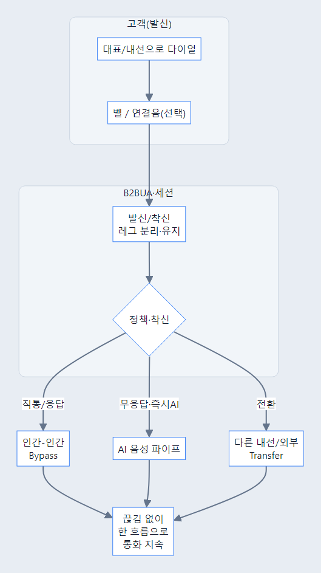

*소스: [`12-journey-4-1-sip-pbx.md`](diagrams/system-overview/12-journey-4-1-sip-pbx.md)*

#### 도식 ②: **시스템·논리** (기존)


*소스: [`01-logical-architecture.md`](diagrams/system-overview/01-logical-architecture.md) · §3.1과 동일*

**요지**: B2BUA = **독립 레그** + **AI·Transfer** **끼움**. 메시지·필드는 SIP 구현·`docs/reports` 참고.

#### User story (절 맨 하단)

##### US-4.1-1 — 발신 고객이 한 통화 안에서 응답 주체 변경을 경험한다

**BMAD Story Card**  
- **As a** 대표번호로 전화한 발신 고객  
- **I want** 벨·AI 응대·상담원 전환이 한 통화 안에서 이어지길 원한다  
- **So that** 같은 설명을 반복하거나 전화를 다시 걸지 않고 문의를 끝낼 수 있다

**처리 flow**

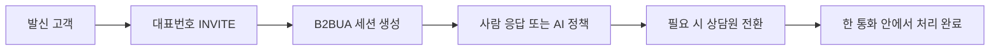

대표번호로 전화를 건 고객은 **문의 접수, 대기, AI 1차 응대, 사람 상담**을 서로 다른 통화로 느끼고 싶지 않다. 고객에게 중요한 것은 SIP 레그가 몇 개인지가 아니라, “방금 말한 내용을 유지한 채 다음 응답자가 이어받는가”이다.

이때 시스템은 **B2BUA 세션**, **2차 INVITE**, **RTP Bypass/AI 전환**, **Transfer**를 사용한다. 발신 INVITE가 들어오면 B2BUA가 착신 레그를 만들고, 사람이 받지 않거나 정책상 AI가 필요하면 같은 흐름 안에서 AI 음성 파이프라인을 붙인다. 이후 상담원 연결이 필요하면 새 대상과 Bridge/전환을 수행한다.

결과적으로 고객은 **끊고 다시 걸거나 같은 설명을 반복하는 느낌**을 줄이고, “대표번호에 전화했더니 상황에 맞는 응답자가 이어서 처리했다”는 경험을 얻는다. 운영 측면에서는 AI·상담원·전환을 한 통화의 상태 변화로 다룰 수 있어 이탈과 중복 통화가 줄어든다.

**수용 기준(문서 수준)**
- 고객 입장에서 다이얼, 대기, AI, 상담원 전환이 하나의 흐름으로 설명된다.
- 이 Story가 B2BUA, 2차 INVITE, RTP/AI 전환을 사용하는 이유를 포함한다.

##### US-4.1-2 — 착신 상담원이 통화 흐름을 이어받는다

**BMAD Story Card**  
- **As a** 대표번호 착신 상담원  
- **I want** 고객이 이미 남긴 맥락을 끊지 않고 전화를 이어받고 싶다  
- **So that** 고객에게 같은 질문을 반복하지 않고 바로 상담을 시작할 수 있다

**처리 flow**

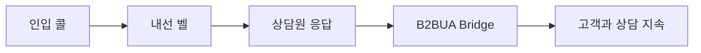

착신 상담원은 단순히 전화를 받는 사람이 아니라, AI 또는 초기 라우팅 이후 **통화 흐름을 이어받는 주체**다. 고객이 이미 대표번호에 진입했고 연결음이나 AI 안내를 들었다면, 상담원은 그 흐름을 끊지 않고 바로 본 상담으로 들어가야 한다.

시스템은 착신 레그를 별도로 만들고, 상담원이 200 OK로 응답하면 발신 레그와 착신 레그를 Bridge한다. 필요하면 이전 단계의 intent, call_id, 이벤트 로그를 대시보드나 운영 화면에서 함께 참고한다.

고객은 “처음부터 다시 시작”하는 느낌을 덜 받는다. 상담원은 통화 시작 전후의 상태를 보고 대응할 수 있어 상담 시간이 줄고, 고객 응대 품질이 안정된다.

**수용 기준(문서 수준)**
- 상담원이 B2BUA Bridge를 통해 발신 고객과 연결되는 흐름이 드러난다.
- 고객 반복 설명 감소와 상담 시간 단축 효과가 명시된다.

##### US-4.1-3 — 무응답 시 AI가 같은 통화 안에서 인수한다

**BMAD Story Card**  
- **As a** 상담원이 받지 못한 고객  
- **I want** 일정 시간 무응답 후에도 통화가 끊기지 않고 AI가 응대하길 원한다  
- **So that** 야간·피크 시간에도 최소한의 안내와 문제 접수를 받을 수 있다

**처리 flow**

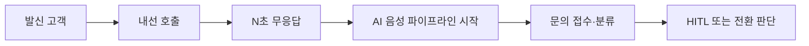

고객이 대표번호로 전화했는데 상담원이 받지 못하는 상황은 흔하다. 이때 통화가 끊기거나 계속 벨만 울리면 고객은 이탈한다. 무응답 이후 AI가 같은 통화 안에서 인수하면 고객은 최소한 문의를 남기거나 다음 행동을 안내받을 수 있다.

시스템은 착신 정책에서 `no_answer_ai` 같은 모델을 확인하고, 타이머가 만료되면 AI 음성 파이프라인을 시작한다. 이후 STT, 의도 분류, RAG, HITL, 전환 판단이 이어진다.

운영자는 부재 중 통화를 단순 미스콜로 남기지 않고, AI 접수와 로그로 전환할 수 있다. 고객은 사람이 없더라도 “응답받았다”는 경험을 얻는다.

**수용 기준(문서 수준)**
- 무응답 타이머 이후 AI가 같은 세션 흐름에서 시작되는 이유가 설명된다.
- 고객 경험과 운영상 미응답 감소 효과가 모두 포함된다.

##### US-4.1-4 — 고객이 AI에서 사람으로 전환된다

**BMAD Story Card**  
- **As a** AI 응대 중 사람 상담이 필요한 고객  
- **I want** AI가 해결하지 못하는 경우 사람에게 자연스럽게 연결되길 원한다  
- **So that** 복잡하거나 민감한 문제도 같은 전화 안에서 해결을 이어갈 수 있다

**처리 flow**

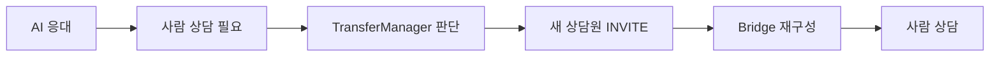

AI는 반복 문의와 단순 안내에 강하지만, 모든 문제를 해결할 수는 없다. 고객이 불만을 표현하거나 정책상 사람이 필요한 케이스라면 AI가 무리해서 답하기보다 사람 상담으로 넘겨야 한다.

시스템은 의도 분류, HITL 결과, 정책 신호를 바탕으로 TransferManager를 통해 새 착신 대상에 INVITE를 보내고, 연결이 성립되면 미디어 Bridge를 재구성한다. 이때 기존 통화의 call_id와 대화 맥락이 유지되어야 한다.

고객은 “AI가 막다른 길”이 아니라 사람 상담으로 넘어가는 관문이라고 느낀다. 비즈니스는 AI 자동화와 사람 개입 사이의 균형을 얻는다.

**수용 기준(문서 수준)**
- AI에서 사람으로 전환되는 판단 기준과 통화 흐름이 포함된다.
- 고객이 같은 통화 안에서 문제 해결을 이어가는 경험이 설명된다.

##### US-4.1-5 — 운영자가 장애 범위를 SIP/RTP/AI로 나누어 복구한다

**BMAD Story Card**  
- **As a** PBX 운영자·SRE  
- **I want** SIP, RTP, AI 계층의 상태와 장애 범위를 분리해 보고 싶다  
- **So that** 전체 통화를 끊지 않고 문제가 난 계층만 복구하거나 우회할 수 있다

**처리 flow**

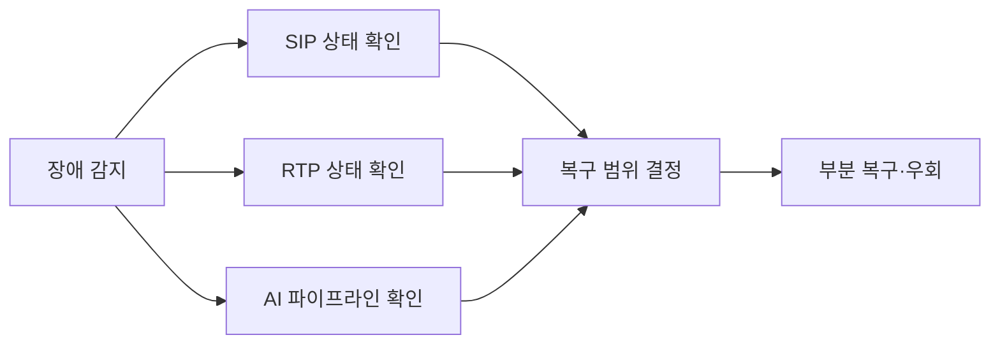

운영·SRE는 장애가 났을 때 전체 PBX를 재시작하기보다 **호는 유지하고 문제가 난 계층만 좁혀** 보고 싶다. 예를 들어 AI 응답이 느려도 SIP 착신과 RTP 릴레이가 살아 있다면, 고객 통화 전체를 끊는 대신 AI 파이프라인만 재기동하거나 우회하는 판단이 필요하다.

이를 위해 시스템은 **CallManager**, **TransferManager**, **OutboundCallManager**, 세션 이벤트와 로그를 계층별로 남긴다. 운영자는 INVITE/200 OK/BYE 같은 SIP 상태, RTP 모드, AI 노드 상태를 나누어 보고 복구 범위를 결정한다.

효과는 **MTTR 감소**와 **장애 전파 범위 축소**다. 고객에게는 단순히 “통화가 덜 끊기는 서비스”로 보이지만, 내부적으로는 장애 대응 단위가 작아져 운영 리스크가 낮아진다.

**수용 기준(문서 수준)**
- SIP, RTP, AI를 분리해 관찰해야 하는 이유가 명시된다.
- 부분 복구·우회가 고객 통화 유지와 연결되는 효과가 설명된다.

---

### 4.2 RTP

**이 기능이 쓰이는 이유 (배경)**  
**같은 PBX**라도 **인간끼리**는 **듣고 말하는 지연**을 최소로 **양방향 릴레이**하고, **AI** 구간은 **STT·LLM·TTS** 뒤에 **귀에 끊김이 덜** 느껴지도록 **20ms 격자 RTP·큐·무음**으로 **스트림**을 맞춘다. **호전환**이 나면 **Bridge**로 **새 담당**과 **미디어**를 이어 **다시 “사람 통화”**에 가깝게 돌아간다.

**핵심 페르소나**  
- **인간–인간(상담·고객)**: **끊김 없는** 대화, **에코** 완화.  
- **AI 통화 고객**: 로봇 목소리가 **끊기지 않고** 이어짐.  
- **운영**: **Bypass / AI / Bridge** 모드에 따라 **AEC·STT 튜닝** 정책을 다룸.

**의존·사용하는 능력**  
20ms 격자, **RTP** 큐, 무음 패딩, **AEC**, STT **후처리**(§4.3과 연동).

**시간순 과정(요약)**  
1. **200 OK** 이후 모드 판정: **Bypass**면 즉시 양방향.  
2. **AI**면: 마이크 → STT → … → TTS → **연속 RTP** 송신.  
3. **전환**이면: **Bridge**로 새 레그.

**이때 느끼는 경험·효과**  
- 인간 통화: **즉시성**. AI: **끊김 없는** 오디오. 모드 전환은 고객이 **“기술 용어”**가 아니라 **“누가 말하는지”**로만 느낌(정책).

#### 도식 ①: Journey (모드·경로)

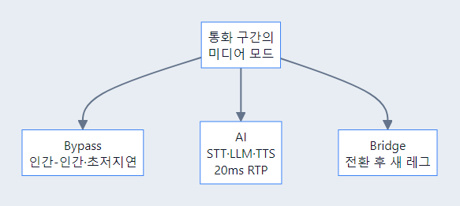

*소스: [`13-journey-4-2-rtp.md`](diagrams/system-overview/13-journey-4-2-rtp.md)*

#### 도식 ②: 시스템 (기존)


*소스: [`03-rtp-modes.md`](diagrams/system-overview/03-rtp-modes.md)*

**품질**: AEC·STT 후처리는 §4.3과 연동.

#### User story (절 맨 하단)

##### US-4.2-1 — 사람끼리 통화할 때 지연을 거의 의식하지 않는다

**BMAD Story Card**  
- **As a** 고객과 직접 대화하는 상담원·발신 고객  
- **I want** 사람끼리 연결된 구간에서는 미디어가 빠르게 양방향으로 흐르길 원한다  
- **So that** 전화가 지연되거나 끊기는 느낌 없이 자연스럽게 대화할 수 있다

**처리 flow**

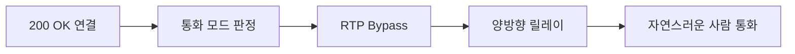

고객과 상담원이 직접 통화하는 구간에서는 AI 기능보다 **말하고 듣는 즉시성**이 더 중요하다. 상담원이 “잠시만요”라고 말했을 때 고객이 바로 듣고, 고객이 질문하면 상담원이 끊김 없이 되받아야 자연스럽다.

시스템은 이 상황에서 **RTP Bypass/릴레이**를 사용한다. 200 OK 이후 사람-사람 구간으로 판단되면 RTP 패킷을 불필요하게 AI 파이프라인에 넣지 않고 양방향으로 중계한다. AEC·지터·코덱 처리도 사람 통화 품질을 우선한다.

고객은 기술적으로는 RTP가 릴레이되는 사실을 모르지만, 체감상 **상대가 바로 대답하는 전화**로 경험한다. 이는 상담 만족도와 통화 유지율에 직접 연결된다.

**수용 기준(문서 수준)**
- 사람 통화 구간에서 AI 파이프라인을 우회하는 이유가 설명된다.
- 지연 감소가 고객·상담원 경험에 주는 효과가 포함된다.

##### US-4.2-2 — AI 응답도 끊김 없는 음성 스트림처럼 들린다

**BMAD Story Card**  
- **As a** AI와 통화 중인 고객  
- **I want** AI가 생각하고 말하는 동안에도 오디오가 일정하게 들리길 원한다  
- **So that** 시스템이 멈췄다고 느끼지 않고 대화를 이어갈 수 있다

**처리 flow**

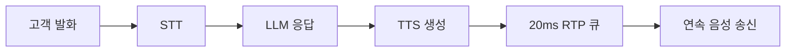

AI가 말하는 구간에서는 STT, LLM, TTS 처리 시간이 섞여 있어 오디오가 끊기기 쉽다. 고객은 내부 처리 단계를 이해하지 않기 때문에, 음성이 중간중간 비면 “시스템이 멈췄다”고 느낀다.

시스템은 **20ms RTP 격자**, **송신 큐**, **무음 패딩**, **TTS 스트리밍**으로 AI 음성을 일정하게 내보낸다. 고객 발화는 STT로 들어가고, LLM 결과는 TTS로 변환된 뒤 RTP 프레임으로 정렬되어 송신된다. 전환이 발생하면 Bridge 모드로 바뀌어 새 상대와 미디어가 이어진다.

결과적으로 고객은 AI가 답을 준비하는 동안에도 **귀에 부담이 덜한 연속성**을 경험한다. 운영자는 끊김 민원, 침묵 구간, RTP 큐 지표를 기준으로 품질을 튜닝할 수 있다.

**수용 기준(문서 수준)**
- STT→LLM→TTS→RTP 큐로 이어지는 미디어 경로가 설명된다.
- 무음 패딩과 큐가 고객 체감 품질을 높이는 이유가 포함된다.

##### US-4.2-3 — 전환 후 새 상대와 미디어 Bridge가 이어진다

**BMAD Story Card**  
- **As a** AI 또는 기존 상담에서 다른 담당자에게 넘어가는 고객  
- **I want** 전환 후에도 새 상대와 음성이 자연스럽게 이어지길 원한다  
- **So that** 담당자가 바뀌어도 통화가 끊긴 것처럼 느끼지 않는다

**처리 flow**

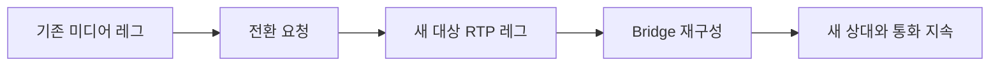

호전환은 SIP 신호만 바뀌는 일이 아니라 고객이 듣고 말하는 미디어 상대가 바뀌는 과정이다. 전환 시점에 RTP 경로가 늦게 바뀌거나 끊기면 고객은 통화 실패로 느낀다.

시스템은 새 대상 레그가 준비되면 기존 RTP 경로를 Bridge 모드로 재구성하고, 필요 없는 AI 송신이나 기존 릴레이를 정리한다. 이때 지연과 무음 구간을 최소화해야 한다.

고객은 담당자가 바뀌었지만 통화 자체는 이어졌다고 느낀다. 운영자는 전환 실패율과 전환 중 무음 시간을 품질 지표로 볼 수 있다.

**수용 기준(문서 수준)**
- 호전환 이후 RTP Bridge가 재구성되는 흐름이 포함된다.
- 전환 중 무음·끊김 최소화가 사용자 경험 목표로 명시된다.

##### US-4.2-4 — 운영자가 AEC와 잡음 품질을 모드별로 튜닝한다

**BMAD Story Card**  
- **As a** 음성 품질 운영자  
- **I want** Bypass, AI, Bridge 모드별로 에코와 잡음 지표를 보고 싶다  
- **So that** 어떤 통화 경로에서 품질 문제가 발생하는지 구분해 개선할 수 있다

**처리 flow**

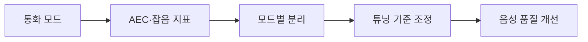

사람끼리 통화할 때의 에코 문제와 AI TTS 구간의 끊김 문제는 원인이 다르다. 운영자가 모든 RTP 문제를 하나로 보면 어떤 설정을 바꿔야 하는지 판단하기 어렵다.

시스템은 통화 모드를 기준으로 AEC, 잡음, 지터, 큐 길이 같은 지표를 나눠 볼 수 있어야 한다. Bypass에서는 낮은 지연과 에코 억제가 중요하고, AI 모드에서는 STT 입력 품질과 TTS 송신 안정성이 중요하다.

효과는 원인별 품질 튜닝이다. 고객은 통화 상대가 사람이든 AI든 일정한 음성 품질을 경험한다.

**수용 기준(문서 수준)**
- 음성 품질 지표를 통화 모드별로 나눠야 하는 이유가 설명된다.
- AEC·잡음 튜닝이 고객 체감 품질과 연결된다.

##### US-4.2-5 — 운영자가 RTP 큐와 무음 패딩으로 끊김을 진단한다

**BMAD Story Card**  
- **As a** RTP 안정성을 보는 운영자  
- **I want** 큐 길이, 무음 패딩, 송신 간격을 확인하고 싶다  
- **So that** 끊김 민원이 네트워크 문제인지 AI 처리 지연인지 판단할 수 있다

**처리 flow**

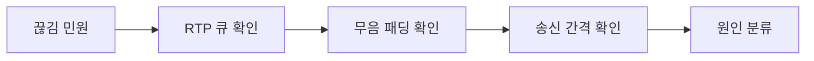

AI 음성 통화에서 끊김이 발생하면 원인은 네트워크, TTS 지연, 큐 부족, 무음 패딩 정책 등 여러 가지일 수 있다. 운영자는 어떤 단계에서 오디오가 비었는지 알아야 재발을 막을 수 있다.

시스템은 RTP 송신 큐 상태, 20ms 간격 유지 여부, 무음 패딩 삽입 여부를 진단 정보로 남긴다. 이 정보가 있으면 AI 응답 생성이 늦은 것인지, RTP 송신이 불안정한 것인지 분리할 수 있다.

효과는 끊김 민원 대응 속도 향상이다. 운영자는 재현 없이도 기록을 보고 원인을 좁히고, 고객에게는 더 안정적인 음성 스트림을 제공할 수 있다.

**수용 기준(문서 수준)**
- RTP 큐와 무음 패딩이 끊김 진단에 쓰이는 방식이 포함된다.
- 운영자가 원인을 네트워크/AI 처리/RTP 송신으로 나누는 흐름이 설명된다.

---

### 4.3 AI 음성 (Voice Agent)

**이 기능이 쓰이는 이유 (배경)**  
AI가 **TTS로 말하는 동안** 고객은 **짧게 “응”**만 할 수도 있고, **“잠깐만”**처럼 **진짜로 끼어들** 수도 있다. 둘을 **같은 “끼어들기”**로 처리하면 **불필요하게 TTS가 끊**기거나, 반대로 **질문이 묻힌다**. **VAD·턴·스마트 바지인**으로 **맞장구(짧은 수긍)**와 **실제 끼어들기**를 나누고, 잡음·짧은 음성이 **엉뚱한 LLM**으로 가지 않게 **후처리**한다.

**핵심 페르소나**  
- **고객**: **말이 끊기지 않는** 대화, **질문**은 **분명히** 전달.  
- **제품·QA**: 맞장구/끼어들기 **비율**, **TTS 중단** 횟수로 **품질**을 본다.

**의존·사용하는 능력**  
VAD, STT, 턴 전략, **스마트 바지인**(키워드·최소 단어·LLM), Pipecat 파이프라인(구현명은 리포트).

**시간순 과정(요약)**  
1. 고객 발화 → VAD·STT → **이번 발화 끝** 판정.  
2. AI TTS 재생 중 고객 발화 → **바지인**: 키워드·단어 수·LLM으로 **맞장구 vs 끼어들기**.  
3. 끼어들기면 TTS 중단 후 **새 턴** 처리.

**이때 느끼는 경험·효과**  
“**응**”만 할 때는 **AI가 말을 끝까지** 이어 가고, **질문**할 때만 **끊기고** 다시 듣는 **자연스러운** 전화 대화에 가깝다. **잡음**으로 **질문이 잘못 올라가는** 비율이 줄어 **비용·오답**이 줄 수 있다(튜닝·설정).

#### 도식 ①: Journey

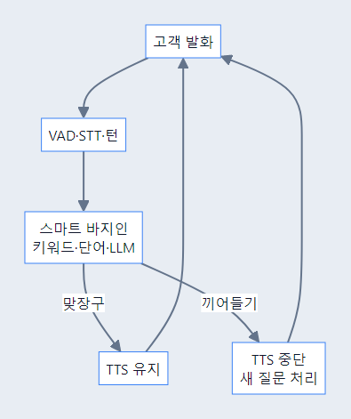

*소스: [`14-journey-4-3-voice.md`](diagrams/system-overview/14-journey-4-3-voice.md)*

#### 도식 ②: 시스템 (기존)


*소스: [`04-smart-barge-in.md`](diagrams/system-overview/04-smart-barge-in.md)*

#### User story (절 맨 하단)

##### US-4.3-1 — 고객의 맞장구와 실제 질문을 다르게 처리한다

**BMAD Story Card**  
- **As a** AI 설명을 듣는 고객  
- **I want** 짧은 맞장구와 실제 질문이 서로 다르게 처리되길 원한다  
- **So that** AI 설명은 불필요하게 끊기지 않고, 내가 질문할 때는 즉시 새 턴으로 반영된다

**처리 flow**

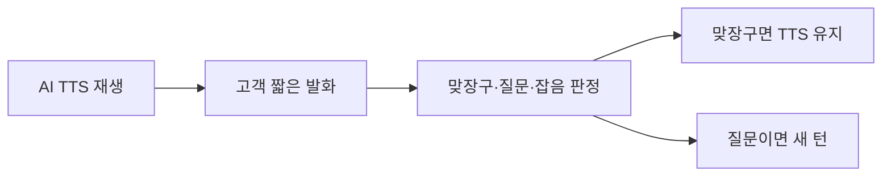

고객은 AI가 설명하는 도중 “네”, “음”, “잠깐만요”처럼 짧게 반응한다. 모든 반응을 끼어들기로 판단하면 AI 음성이 계속 끊기고, 반대로 모든 반응을 무시하면 실제 질문이 묻힌다.

시스템은 **VAD**, **STT**, **스마트 바지인**, **맞장구 패턴**, 필요 시 **LLM 판정**을 사용한다. TTS가 재생되는 중 고객 음성이 들어오면 먼저 짧은 수긍인지, 의도 있는 질문인지, 잡음인지 구분한다. 맞장구라면 AI가 말을 이어가고, 실제 질문이면 TTS를 중단하고 새 턴으로 처리한다.

고객은 “AI가 내 말을 무조건 무시하거나 무조건 끊는” 느낌 대신, **상대가 대화 흐름을 이해하는 듯한 응답**을 경험한다. 이는 전화형 AI에서 가장 중요한 자연스러움과 피로도에 영향을 준다.

**수용 기준(문서 수준)**
- 맞장구와 실제 질문을 다른 흐름으로 처리하는 이유가 설명된다.
- 고객이 느끼는 대화 자연스러움과 TTS 유지/중단 조건이 포함된다.

##### US-4.3-2 — 고객이 실제로 끼어들면 AI가 말을 멈추고 듣는다

**BMAD Story Card**  
- **As a** AI 설명 중 정정하거나 질문하려는 고객  
- **I want** “잠깐만요”처럼 의도 있는 발화를 하면 AI가 멈추고 내 말을 듣길 원한다  
- **So that** 잘못된 안내를 끝까지 듣지 않고 대화를 바로 수정할 수 있다

**처리 flow**

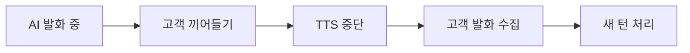

전화 대화에서는 상대가 길게 설명하는 중간에도 고객이 정정하거나 추가 정보를 줄 수 있다. AI가 이를 무시하면 고객은 기계적인 안내를 끝까지 들어야 하고, 대화 효율이 떨어진다.

시스템은 VAD와 바지인 판정을 통해 의미 있는 끼어들기를 감지하면 TTS 재생을 멈추고, 현재 고객 발화를 새 턴 입력으로 보낸다. 이후 의도 분류와 응답 생성이 다시 시작된다.

고객은 AI가 일방적으로 말하는 봇이 아니라 **내 말을 들을 수 있는 상담 상대**처럼 느낀다.

**수용 기준(문서 수준)**
- 실제 끼어들기 감지 시 TTS가 중단되는 흐름이 포함된다.
- 끼어들기 이후 새 턴 처리와 고객 체감 효과가 설명된다.

##### US-4.3-3 — 운영자는 잡음과 짧은 음성이 불필요하게 LLM으로 가지 않게 한다

**BMAD Story Card**  
- **As a** AI 음성 품질을 관리하는 운영자  
- **I want** 잡음·숨소리·짧은 감탄사가 LLM 요청으로 이어지지 않게 하고 싶다  
- **So that** 비용과 오답을 줄이고 실제 고객 의도만 안정적으로 처리할 수 있다

**처리 flow**

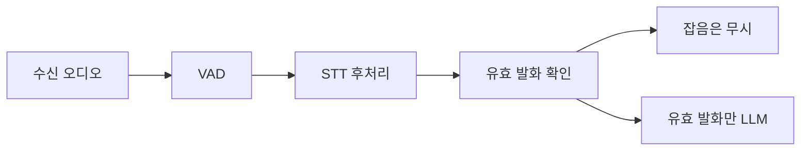

콜센터 환경에는 주변 소음, 숨소리, 짧은 감탄사, 통화 품질 저하가 섞인다. 이런 입력이 모두 LLM으로 전달되면 비용이 늘고, 대화 맥락과 맞지 않는 답이 나올 수 있다.

시스템은 **VAD 임계값**, **STT 후처리**, **최소 단어 수**, **키워드 기반 필터**를 사용해 유효 발화만 다음 단계로 넘긴다. 운영자는 로그에서 바지인 판정, 무시된 발화, LLM 호출 수를 확인하며 기준을 튜닝한다.

효과는 **LLM 호출 비용 감소**, **오답 감소**, **대화 안정성 향상**이다. 고객에게는 단순히 “AI가 이상한 타이밍에 끼어들지 않는다”는 경험으로 드러난다.

**수용 기준(문서 수준)**
- 잡음 필터링이 비용과 오답 감소에 연결되는 이유가 포함된다.
- 유효 발화만 LLM으로 전달되는 처리 흐름이 설명된다.

##### US-4.3-4 — 턴 종료를 판단해 고객 발화를 너무 빨리 끊지 않는다

**BMAD Story Card**  
- **As a** 생각하며 말하는 고객  
- **I want** 잠깐 쉬었다 말해도 AI가 내 말을 끝난 것으로 오해하지 않길 원한다  
- **So that** 문장이 완성되기 전에 잘못된 답변이 나오지 않는다

**처리 flow**


고객은 전화 중 날짜, 이름, 요청 사항을 생각하며 말한다. 짧은 침묵을 곧바로 발화 종료로 처리하면 AI가 미완성 문장을 바탕으로 답하고, 고객은 다시 정정해야 한다.

시스템은 VAD, STT 안정성, 최근 발화 길이, 문장 종결 표현을 함께 보고 턴 종료를 판단한다. 짧은 침묵만으로 처리하지 않고, 필요한 경우 조금 더 기다려 완성된 발화를 확보한다.

효과는 잘못된 조기 응답 감소다. 고객은 자신의 말을 끝까지 들었다는 인상을 받고, AI는 더 정확한 의도 분류를 할 수 있다.

**수용 기준(문서 수준)**
- 짧은 침묵과 실제 발화 종료를 구분해야 하는 이유가 설명된다.
- 턴 종료 판단이 의도 분류 정확도에 미치는 효과가 포함된다.

##### US-4.3-5 — 제품·QA가 음성 대화 품질과 비용을 함께 튜닝한다

**BMAD Story Card**  
- **As a** 제품·QA 담당자  
- **I want** 바지인, 턴 종료, LLM 호출, TTS 중단 지표를 함께 보고 싶다  
- **So that** 자연스러움과 비용 사이의 균형을 데이터로 조정할 수 있다

**처리 flow**

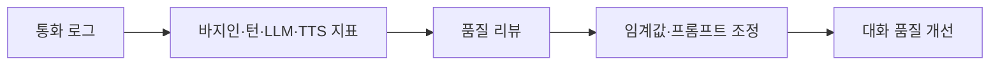

AI 음성 품질은 단순히 STT 정확도만으로 판단할 수 없다. 너무 자주 끊기면 불편하고, 너무 많이 LLM을 호출하면 비용이 증가하며, 너무 늦게 반응하면 답답하다.

제품·QA는 바지인 성공률, TTS 중단 횟수, 무시된 발화, LLM 호출 수, 고객 재질문 비율을 함께 본다. 이를 기반으로 VAD 임계값, 맞장구 패턴, 프롬프트, 턴 대기 시간을 조정한다.

효과는 정량 기반 개선이다. 고객 경험을 훼손하지 않으면서 비용을 제어하고, 전화형 AI의 자연스러움을 반복적으로 높일 수 있다.

**수용 기준(문서 수준)**
- 대화 품질과 비용 지표를 함께 보는 이유가 포함된다.
- 튜닝 대상과 기대 효과가 명확히 드러난다.

---

<a id="44-langgraph"></a>

### 4.4 LangGraph (의도·라우팅)

**이 기능이 쓰이는 이유 (배경)**  
같은 **“말 한마디”**도 **“예약해 주세요”**는 **캘린더 도구**로, **“왜 끊기지?”**는 **락/FAQ·사과** 톤으로, **“사람”**은 **HITL·Transfer**로 가야 한다. **의도**를 **일관된 라벨**로 쪼개 **LangGraph(또는 그에 준하는)** 노드·가드에 **연결**하지 않으면, **RAG**와 **도구**가 **뒤섞여** **오답**·**이중 질의**·**로그** 해석이 어려워진다. **Outbound**(§4.8)는 **미션이 먼저** 주어질 수 있어 **의도 생략** 경로가 **허용**된다(구현·리포트).

**핵심 페르소나**  
- **고객**: **맥락에 맞는** 다음 행동(예약·지식·사람)을 **기대**한다.  
- **CS·데이터**: **intent**·**turn**·**툴 호출**이 **대시보드/로그**에 **읽을 수 있게** 남기길 원한다.

**의존·사용하는 능력**  
STT(또는 텍스트) → **classify_intent** 등 → **Persona**·**RAG**·`booking` **도구**·**HITL**·**Transfer**·(선택) **Outbound 스킵**.

**시간순 과정(요약)**  
1. **문장**·**컨텍스트**·**최근 턴**이 그래프에 들어감.  
2. **의도** 결정(또는 **신뢰도**로 HITL).  
3. **한 가지** 메인 루트(예: 예약)로 **도구/LLM**이 이어짐, **TTS/전환**으로 끝.

**이때 느끼는 경험·효과**  
“**딴소리**”·“**또 뭐죠?**” **감소**, **A/B**·**장애** 시 **의도 단위**로 **원인**을 좁힐 수 있다.

#### 도식 ①: Journey

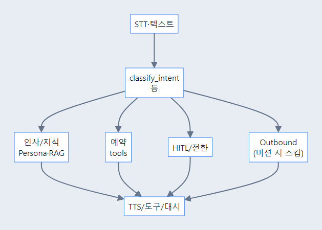

*소스: [`15-journey-4-4-intent.md`](diagrams/system-overview/15-journey-4-4-intent.md)*

#### 도식 ②: 시스템 (기존)


*소스: [`05-intent-routing.md`](diagrams/system-overview/05-intent-routing.md)*

#### User story (절 맨 하단)

##### US-4.4-1 — 예약 의도를 예약 도구 흐름으로 연결한다

**BMAD Story Card**  
- **As a** 전화로 예약을 요청하는 고객  
- **I want** “내일 예약” 같은 발화가 예약 도구로 바로 연결되길 원한다  
- **So that** 단순 답변이 아니라 실제 슬롯 조회와 확정까지 진행할 수 있다

**처리 flow**

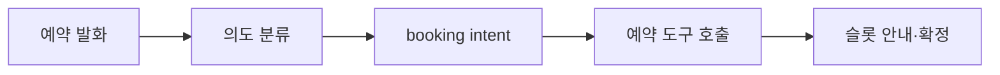

고객이 “내일 오후 가능한가요?”라고 말하면 기대하는 것은 단순 FAQ 답변이 아니라 **실제 예약 가능 시간 확인**이다. 의도 라우팅이 없으면 AI가 일반 안내로 답하거나 잘못된 지식 검색을 수행할 수 있다.

시스템은 **classify_intent** 계열 노드와 LangGraph 분기를 사용한다. STT 또는 텍스트 입력이 들어오면 최근 대화 맥락과 함께 의도를 분류하고, Persona/RAG/예약 도구/HITL/Transfer 중 하나의 주 경로로 보낸다. 신뢰도가 낮거나 민감한 요청이면 HITL로 올릴 수 있다.

고객은 같은 AI와 대화하더라도 예약 요청일 때 실제 슬롯 조회와 확정이 이어지는 결과를 경험한다. 이는 “말은 알아듣지만 행동은 못 하는 봇”이라는 인상을 줄인다.

**수용 기준(문서 수준)**
- 예약 의도가 일반 지식 응답이 아니라 도구 호출로 이어지는 흐름이 설명된다.
- 고객이 실제 예약 결과를 얻는 효과가 포함된다.

##### US-4.4-2 — 지식 문의를 RAG·페르소나 답변으로 보낸다

**BMAD Story Card**  
- **As a** 제품·정책 정보를 묻는 고객  
- **I want** 정보성 질문이 우리 조직 지식 기반으로 처리되길 원한다  
- **So that** 예약이나 전환이 아니라 정확한 설명을 들을 수 있다

**처리 flow**


고객이 운영 시간, 가격, 절차를 물을 때는 예약 도구나 전환보다 정확한 지식 응답이 필요하다. 같은 발화라도 “예약해줘”와 “예약 정책 알려줘”는 다른 흐름으로 처리되어야 한다.

시스템은 의도를 지식 문의로 분류한 뒤 테넌트별 RAG와 페르소나를 사용해 답변을 생성한다. 답변 가능 범위를 벗어나면 HITL 또는 사람 연결로 넘길 수 있다.

고객은 조직의 문서와 톤에 맞는 안내를 듣고, 운영자는 지식 문의 성공률을 따로 측정할 수 있다.

**수용 기준(문서 수준)**
- 지식 문의가 RAG와 페르소나 적용 흐름으로 이어지는 것이 명시된다.
- 답변 가능 범위 밖의 예외 처리 방향이 포함된다.

##### US-4.4-3 — 불만·감정 발화를 민감 흐름으로 처리한다

**BMAD Story Card**  
- **As a** 불편을 겪은 고객  
- **I want** 불만이나 감정 표현이 일반 FAQ처럼 처리되지 않길 원한다  
- **So that** 사과, 확인, 사람 연결 등 상황에 맞는 대응을 받을 수 있다

**처리 flow**

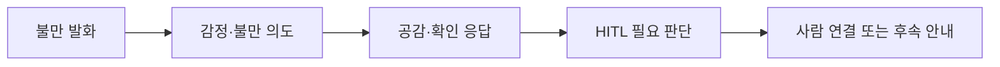

고객이 “왜 이렇게 늦어요?”처럼 감정이 담긴 말을 했을 때 단순 FAQ 답변만 제공하면 상황이 악화될 수 있다. 이 경우에는 공감 표현, 확인 절차, 사람 연결 가능성을 함께 고려해야 한다.

시스템은 의도 분류에서 감정·불만 신호를 감지하고, 안전한 톤의 응답이나 HITL 경로로 분기한다. 민감도가 높으면 AI 단독 답변을 제한하고 상담사 판단을 요청한다.

고객은 자신의 불편이 무시되지 않았다고 느끼며, 운영자는 불만 통화를 별도 지표로 추적할 수 있다.

**수용 기준(문서 수준)**
- 불만 발화가 일반 FAQ와 다른 흐름으로 처리되는 이유가 설명된다.
- 공감 응답, HITL, 사람 연결 가능성이 포함된다.

##### US-4.4-4 — 사람 연결 요청을 HITL·Transfer 흐름으로 보낸다

**BMAD Story Card**  
- **As a** AI가 아닌 사람과 대화하고 싶은 고객  
- **I want** “사람 연결” 요청이 반복 질문 없이 전환 흐름으로 이어지길 원한다  
- **So that** 복잡한 문제를 상담원과 바로 이어서 해결할 수 있다

**처리 flow**

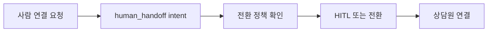

고객이 명시적으로 사람을 요청했는데 AI가 계속 질문을 반복하면 불만이 커진다. 의도 라우팅은 사람 연결 요청을 별도 흐름으로 분리해야 한다.

시스템은 전환 가능 시간, 상담원 상태, HITL 정책을 확인하고 가능한 경우 Transfer를 수행한다. 즉시 전환이 어렵다면 대기 안내 또는 후속 조치를 제공한다.

고객은 요청이 존중된다고 느끼고, 운영자는 AI 자동화와 사람 상담 사이의 경계 정책을 관리할 수 있다.

**수용 기준(문서 수준)**
- 사람 연결 의도가 별도 라우팅되는 흐름이 설명된다.
- 전환 불가 시 대기·후속 안내 같은 예외가 포함된다.

##### US-4.4-5 — 운영자가 의도 라벨로 장애와 품질을 분석한다

**BMAD Story Card**  
- **As a** CS·데이터·SRE 담당자  
- **I want** 모든 대화 턴에 일관된 의도 라벨과 도구 이벤트가 남길 원한다  
- **So that** 실패 원인을 예약, 지식, HITL, 전환 등 업무 단위로 추적할 수 있다

**처리 flow**

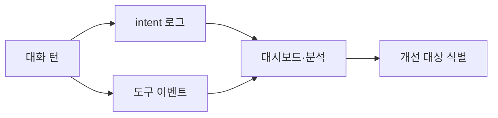

운영자는 통화가 실패했을 때 단순히 “AI가 틀렸다”가 아니라 **어떤 의도에서, 어떤 분기에서, 어떤 도구 호출 후 실패했는지** 알아야 한다. 그래야 예약 도구 문제인지, RAG 문서 문제인지, 전환 정책 문제인지 나눠볼 수 있다.

시스템은 intent 라벨, 툴 이벤트, HITL 요청, 전환 시도 등을 로그와 대시보드에 남긴다. 운영자는 같은 라벨 체계를 기준으로 실패율과 재시도율을 집계하고, 개선 대상을 좁힌다.

효과는 **원인 분석 시간 단축**과 **품질 개선 루프**다. 제품 측면에서는 의도별 성공률을 보며 우선순위를 정할 수 있고, SRE 측면에서는 장애 대응 범위를 빠르게 좁힐 수 있다.

**수용 기준(문서 수준)**
- 의도 라벨과 도구 이벤트가 운영 분석에 쓰이는 흐름이 포함된다.
- 실패 원인을 업무 단위로 좁히는 효과가 설명된다.

---

### 4.5 지식 베이스·HITL

**이 기능이 쓰이는 이유 (배경)**  
**테넌트별(§3.2)** **문서·Q&A**를 **RAG**로 쓰되, **톤·범위**는 **페르소나**로 맞추고, **유사 질**은 **캐시**로 **지연**을 줄인다. **그래도** **결제·의료** 등 **한 번에 틀리면 안 되는** 경우는 **HITL**로 **초안**을 **사람**이 보고, **format_hitl_reply** 등으로 **TTS**에 **자연스러운** 한국어(§3.3)로 내려보낸다.

**핵심 페르소나**  
- **고객·발신**: **“우리 회사 말투”**·**답할 수 있는 주제** 안에서 **듣는다**.  
- **상담·오퍼**: **짧은 텍스트**로 **수정/승인**하고, **고객**은 **전화**로 **들을 뿐**이다.

**의존·사용하는 능력**  
ChromaDB·owner 컬렉션, RAG, **HITL** WebSocket, `format_hitl_reply`, TTS.

**시간순 과정(요약)**  
1. 질문 → **RAG**·(선택) **캐시** → 답 **초안** 또는 HITL **요청**.  
2. HITL 시 **초록/노랑/빨강**·승인/거절(§2.1·대시보드).  
3. **승인** 문구 → TTS(§3.3 **복잡 루프**).

**이때 느끼는 경험·효과**  
**브랜드·정확**을 동시에 잡고, **민감** 구간은 **사람**이 **최종**한다.

#### 도식 ①: Journey

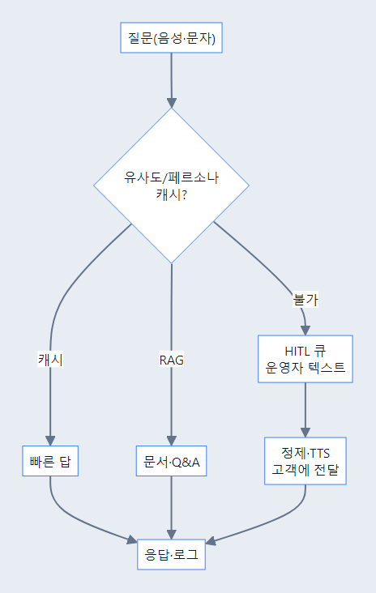

*소스: [`16-journey-4-5-knowledge.md`](diagrams/system-overview/16-journey-4-5-knowledge.md)*

#### 도식 ②: 시스템 (지식)


*소스: [`06-knowledge-flow.md`](diagrams/system-overview/06-knowledge-flow.md)*

#### 도식 ③: **복잡 루프** (§3.3과 동일)


*소스: [`02-inbound-voice-sequence.md`](diagrams/system-overview/02-inbound-voice-sequence.md)*

#### User story (절 맨 하단)

##### US-4.5-1 — 고객이 우리 조직의 지식과 말투로 답을 듣는다

**BMAD Story Card**  
- **As a** 특정 회사·조직에 문의한 고객  
- **I want** 그 조직의 문서, 정책, 말투에 맞는 답변을 듣고 싶다  
- **So that** 다른 테넌트의 정보가 섞이지 않는 신뢰 가능한 상담을 받을 수 있다

**처리 flow**

```mermaid
flowchart LR
  question["고객 질문"] --> owner["owner 식별"]
  owner --> rag["테넌트 RAG 검색"]
  rag --> persona["페르소나 적용"]
  persona --> answer["조직 맞춤 답변"]
```

고객은 같은 플랫폼을 쓰더라도 A 회사에 전화했으면 A 회사의 정책, 가격, 운영 시간, 말투로 답을 듣고 싶다. 다른 테넌트의 FAQ나 캐시가 섞이면 신뢰가 깨지고, 민감한 정보가 잘못 노출될 위험도 생긴다.

시스템은 **owner별 ChromaDB 컬렉션**, **RAG**, **qa_cache**, **persona**를 사용한다. 고객 질문이 들어오면 해당 테넌트의 문서와 캐시를 검색하고, 지정된 페르소나와 답변 범위 안에서 응답을 구성한다. 답변이 불확실하거나 민감하면 HITL로 넘긴다.

고객은 “우리 회사 내용을 알고 있는 상담원”처럼 느끼는 답변을 듣는다. 비즈니스 입장에서는 브랜드 일관성과 지식 격리가 유지되고, 반복 질문 처리 비용이 줄어든다.

**수용 기준(문서 수준)**
- 테넌트 owner 기준 지식 격리와 페르소나 적용이 설명된다.
- 고객 신뢰와 반복 문의 감소 효과가 포함된다.

##### US-4.5-2 — 브랜드 페르소나가 답변의 톤과 범위를 제한한다

**BMAD Story Card**  
- **As a** 브랜드 경험을 관리하는 운영자  
- **I want** AI가 우리 조직의 말투와 답변 가능 범위 안에서 말하길 원한다  
- **So that** 같은 LLM을 써도 조직마다 다른 상담 경험을 제공할 수 있다

**처리 flow**

```mermaid
flowchart LR
  draft["초안 답변"] --> personaRule["페르소나 규칙"]
  personaRule --> scopeCheck["답변 범위 확인"]
  scopeCheck --> safeTone["톤 정리"]
  safeTone --> tts["고객에게 음성 응답"]
```

고객은 조직마다 기대하는 말투가 다르다. 병원, 식당, B2B 상담의 톤이 같으면 서비스가 어색하게 느껴지고, 답변 범위를 넘어서면 책임 문제가 생긴다.

시스템은 페르소나 설정을 통해 인사말, 금지 표현, 답변 범위, 사람 연결 조건을 제어한다. RAG 결과가 있더라도 페르소나가 허용하지 않는 범위라면 HITL 또는 회피 안내로 보낸다.

효과는 브랜드 일관성과 안전성이다. 운영자는 조직별 AI 상담 품질을 설정으로 관리할 수 있다.

**수용 기준(문서 수준)**
- 페르소나가 톤뿐 아니라 답변 범위 제한에도 쓰이는 점이 포함된다.
- 조직별 상담 경험 차별화 효과가 설명된다.

##### US-4.5-3 — 상담사가 짧게 개입하고 고객은 자연스러운 음성으로 듣는다

**BMAD Story Card**  
- **As a** AI 답변을 검토하는 상담사·오퍼레이터  
- **I want** 위험하거나 애매한 답변에 짧게 개입해 승인·수정하고 싶다  
- **So that** 고객은 전화 흐름을 유지하면서도 사람의 판단이 반영된 정확한 답을 들을 수 있다

**처리 flow**

```mermaid
flowchart LR
  risky["불확실·민감 질문"] --> hitl["HITL 요청"]
  hitl --> operator["상담사 승인·수정"]
  operator --> format["format_hitl_reply"]
  format --> tts["자연스러운 TTS"]
```

AI가 답하기 어려운 질문이 들어오면 상담사가 전화를 직접 받지 않아도 **짧은 텍스트 지시**로 개입할 수 있어야 한다. 다만 고객은 내부 대시보드 문장을 그대로 듣기보다, 전화 상황에 맞게 다듬어진 안내를 기대한다.

시스템은 **HITL 요청**, **승인/거절**, **format_hitl_reply**, **TTS**를 사용한다. AI가 답변 위험을 감지하면 대시보드에 질문과 초안을 올리고, 상담사는 짧게 수정하거나 승인한다. 시스템은 그 문장을 고객이 듣기 자연스러운 말투로 정리해 TTS로 내보낸다.

효과는 **정확도와 업무 효율의 균형**이다. 상담사는 모든 전화를 직접 받지 않아도 중요한 판단을 넣을 수 있고, 고객은 채팅이 아니라 계속 **전화 음성 경험** 안에서 응답을 받는다.

**수용 기준(문서 수준)**
- HITL 승인/수정이 TTS 응답으로 이어지는 흐름이 설명된다.
- 상담사 개입과 고객 음성 경험 유지 효과가 포함된다.

##### US-4.5-4 — 민감 질문은 AI 단독 답변 대신 검토 흐름으로 보낸다

**BMAD Story Card**  
- **As a** 민감한 정보를 묻는 고객  
- **I want** 위험한 답변을 성급히 듣기보다 정확하게 확인된 안내를 받고 싶다  
- **So that** 결제, 의료, 법률 등 중요한 사안에서 잘못된 안내를 줄일 수 있다

**처리 flow**

```mermaid
flowchart LR
  sensitive["민감 질문"] --> riskCheck["위험도 판단"]
  riskCheck --> hold["대기 안내"]
  hold --> review["사람 검토"]
  review --> finalAnswer["확인된 답변"]
```

AI가 모든 질문에 즉시 답하는 것은 위험할 수 있다. 특히 환불, 계약, 의료, 법적 책임이 있는 답변은 틀렸을 때 손실이 크다.

시스템은 의도, 키워드, 신뢰도, 답변 범위를 기준으로 민감 질문을 감지하고 HITL로 보낸다. 고객에게는 대기 멘트나 확인 중 안내를 제공해 침묵을 줄인다.

고객은 즉시성은 조금 줄어도 더 신뢰할 수 있는 답변을 듣는다. 운영자는 위험 답변 노출을 줄이고 책임 있는 응대 흐름을 만들 수 있다.

**수용 기준(문서 수준)**
- 민감 질문이 AI 단독 답변에서 제외되는 이유가 설명된다.
- 대기 안내와 사람 검토 흐름이 포함된다.

##### US-4.5-5 — 반복 질문과 답변이 캐시·지식으로 축적된다

**BMAD Story Card**  
- **As a** 반복 문의가 많은 운영자  
- **I want** 자주 묻는 질문과 승인된 답변이 재사용되길 원한다  
- **So that** 다음 고객에게 더 빠르고 일관된 답변을 제공할 수 있다

**처리 flow**

```mermaid
flowchart LR
  repeated["반복 질문"] --> cacheCheck["qa_cache 확인"]
  cacheCheck --> hit["캐시 적중"]
  cacheCheck --> miss["캐시 미스"]
  miss --> learn["승인 답변 축적"]
  hit --> fastAnswer["빠른 응답"]
```

같은 질문이 계속 들어오는데 매번 RAG와 LLM을 새로 돌리면 비용과 지연이 늘어난다. 또한 상담사가 승인한 좋은 답변이 다음 통화에 활용되지 않으면 학습 효과가 없다.

시스템은 유사 질문에 대해 `qa_cache`를 확인하고, 검증된 답변을 재사용할 수 있다. HITL에서 승인된 답변이나 문서 업데이트가 지식 축적의 후보가 된다.

효과는 응답 속도 향상과 답변 일관성이다. 운영자는 자주 묻는 질문을 관리하고, 고객은 반복 문의에서 더 빠른 응답을 받는다.

**수용 기준(문서 수준)**
- 캐시 적중/미스와 지식 축적 흐름이 설명된다.
- 지연·비용 감소와 일관성 향상 효과가 포함된다.

---

### 4.6 예약

**이 기능이 쓰이는 이유 (배경)**  
고객이 **IVR**·**콜백** 없이 **말(또는 문자)**로 **빈 슬롯**을 **찾고**·**잡고**·**취소/변경**하길 원한다. **LLM**만으로 **날짜·이중 예약**을 **정확히** 맞추기 어려워, **내부 DB·캘린더(설정) 도구 루프**로 **사실**을 **쿼리**한다. `booking_*` **이벤트**는 **CS**·**사후 분석**에 쓴다.

**핵심 페르소나**  
- **고객(소비 B2B 등)**: **빨리** 확정, **취소**도 쉬움.  
- **운영**: **예약 충돌**·**노쇼**를 **같은** 이벤트 스트림으로 **본다**.

**의존·사용하는 능력**  
**booking** 관련 **LangChain** 도구, SQLite/캘린더(구현), **알림 SMS**(설정).

**시간순 과정(요약)**  
1. “내일 3시” 등 → **슬롯 조회** → **없으면** 대안.  
2. **확정**·**캘린더** 반영(연동 시).  
3. **알림**·`booking_*` 로그.

**이때 느끼는 경험·효과**  
**수기**·**또 전화** **감소**, **누가 언제 뭐라고 했는지** **추적** 가능.

#### 도식 ①: Journey

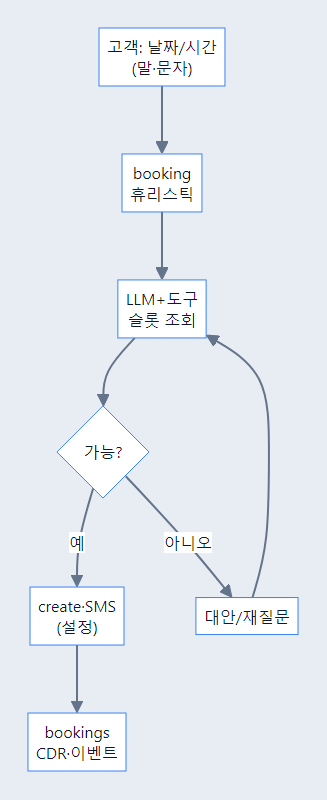

*소스: [`17-journey-4-6-booking.md`](diagrams/system-overview/17-journey-4-6-booking.md)*

#### 도식 ②: 시스템 (기존)


*소스: [`07-booking-tools.md`](diagrams/system-overview/07-booking-tools.md)*

#### User story (절 맨 하단)

##### US-4.6-1 — 고객이 말이나 문자로 빈 시간을 찾는다

**BMAD Story Card**  
- **As a** 예약을 잡으려는 고객  
- **I want** 자연어로 가능한 시간을 물어보고 후보를 받고 싶다  
- **So that** 메뉴를 여러 번 누르지 않고 예약 가능성을 빠르게 확인할 수 있다

**처리 flow**

```mermaid
flowchart LR
  ask["고객 시간 문의"] --> parse["날짜·시간 해석"]
  parse --> lookup["슬롯 조회"]
  lookup --> candidates["가능 후보 안내"]
```

고객은 상담 가능 시간, 방문 예약, 콜백 시간을 잡기 위해 메뉴를 여러 번 누르거나 다시 전화를 걸고 싶지 않다. “내일 오후에 가능한 시간 있어요?”처럼 자연어로 말하거나 문자로 보내면 바로 가능한 선택지를 듣고 싶다.

시스템은 **booking 도구**, **LLM**, **SQLite/캘린더 연동**을 사용한다. 고객의 날짜·시간 표현을 해석한 뒤 실제 슬롯을 조회하고, 가능한 시간이 없으면 대안을 제시한다.

고객은 통화나 문자 흐름을 끊지 않고 가능한 시간을 확인한다. 운영자는 단순 시간 문의를 자동화해 수기 응대 부담을 줄인다.

**수용 기준(문서 수준)**
- 자연어 시간 표현이 슬롯 조회로 이어지는 흐름이 포함된다.
- 가능한 시간이 없을 때 대안을 제시하는 필요가 설명된다.

##### US-4.6-2 — 고객이 예약을 확정하고 알림을 받는다

**BMAD Story Card**  
- **As a** 예약 시간을 선택한 고객  
- **I want** 선택한 시간을 즉시 확정하고 알림을 받고 싶다  
- **So that** 예약이 실제로 잡혔는지 불안하지 않다

**처리 flow**

```mermaid
flowchart LR
  select["고객 후보 선택"] --> create["예약 생성"]
  create --> event["booking_created 이벤트"]
  event --> notify["SMS 또는 안내"]
  notify --> confirmed["확정 경험"]
```

후보 시간을 들은 고객은 바로 확정 여부를 알고 싶다. “접수해둘게요”처럼 모호한 답변만 들으면 실제 예약이 되었는지 다시 확인하게 된다.

시스템은 선택된 슬롯을 예약 DB 또는 캘린더에 반영하고, `booking_created` 같은 이벤트를 남긴다. 설정에 따라 문자 알림이나 TTS 확인 멘트를 제공한다.

고객은 예약이 완료되었다는 확실한 경험을 얻고, 운영자는 예약 확정 기록을 기준으로 후속 처리를 할 수 있다.

**수용 기준(문서 수준)**
- 예약 생성과 확인 알림 흐름이 포함된다.
- 확정 경험과 운영 기록의 필요가 설명된다.

##### US-4.6-3 — 고객이 예약을 변경하거나 취소한다

**BMAD Story Card**  
- **As a** 기존 예약을 바꾸려는 고객  
- **I want** 말이나 문자로 변경·취소 요청을 처리하고 싶다  
- **So that** 다시 전화하거나 상담원을 기다리지 않고 일정을 조정할 수 있다

**처리 flow**

```mermaid
flowchart LR
  request["변경·취소 요청"] --> identify["예약 식별"]
  identify --> validate["변경 가능 확인"]
  validate --> update["예약 변경·취소"]
  update --> notify["결과 안내"]
```

예약은 생성보다 변경과 취소에서 CS가 많이 발생한다. 고객은 “내일 예약을 모레로 바꿔줘”처럼 간단히 말하고 싶지만, 시스템은 기존 예약을 정확히 찾아야 한다.

시스템은 고객 식별 정보와 예약 후보를 확인하고, 변경 가능 정책을 검토한 뒤 예약을 업데이트한다. 결과는 이벤트와 알림으로 남긴다.

효과는 재통화 감소와 일정 관리 효율 향상이다. 고객은 자기 일정 변화에 맞춰 빠르게 조정할 수 있다.

**수용 기준(문서 수준)**
- 기존 예약 식별, 정책 확인, 업데이트 흐름이 포함된다.
- 변경·취소 결과 안내와 이벤트 기록 필요가 설명된다.

##### US-4.6-4 — 고객이 예약 알림 SMS를 받는다

**BMAD Story Card**  
- **As a** 예약을 잊기 쉬운 고객  
- **I want** 예약 확정이나 리마인드를 문자로 받고 싶다  
- **So that** 통화 후에도 일정 정보를 다시 확인할 수 있다

**처리 flow**

```mermaid
flowchart LR
  booking["예약 확정"] --> message["알림 메시지 생성"]
  message --> sms["SMS 발송"]
  sms --> customer["고객 재확인"]
```

전화로 들은 예약 시간은 놓치기 쉽다. 고객은 통화가 끝난 뒤에도 예약 정보를 확인할 수 있는 문자 알림을 기대한다.

시스템은 예약 생성·변경 이벤트를 기준으로 알림 문구를 만들고, 설정된 SMS/RCS 연동을 통해 발송한다. 실패 시 이벤트로 남겨 운영자가 확인할 수 있어야 한다.

고객은 일정을 다시 확인할 수 있고, 운영자는 노쇼와 확인 전화를 줄일 수 있다.

**수용 기준(문서 수준)**
- 예약 이벤트가 알림 발송으로 이어지는 흐름이 설명된다.
- 노쇼 감소와 고객 재확인 효과가 포함된다.

##### US-4.6-5 — 운영자가 예약 이벤트로 품질과 분쟁을 추적한다

**BMAD Story Card**  
- **As a** 예약 운영·CS 담당자  
- **I want** 슬롯 조회, 확정, 변경, 알림 발송이 이벤트로 남길 원한다  
- **So that** 예약 분쟁이나 자동화 실패가 생겨도 어느 단계에서 문제가 났는지 설명할 수 있다

**처리 flow**

```mermaid
flowchart LR
  bookingFlow["예약 처리"] --> eventLog["booking 이벤트"]
  eventLog --> cdr["CDR·대화 로그"]
  cdr --> review["CS 확인"]
  review --> improve["정책 개선"]
```

운영자는 “AI가 예약했다고 했는데 실제로는 안 됐다” 같은 분쟁을 피하려면 예약 단계별 기록이 필요하다. 단순 대화 로그만으로는 슬롯 조회, 확정, 변경, 알림 발송 중 어디서 문제가 났는지 알기 어렵다.

시스템은 `booking_*` 이벤트, CDR, 도구 호출 결과를 남긴다. 운영자는 이벤트를 기준으로 고객 요청, 조회 결과, 확정 여부, 알림 발송 여부를 따라가며 문제를 확인한다.

효과는 **감사 가능성**과 **CS 처리 속도 향상**이다. 예약 자동화가 실패하더라도 어디서 실패했는지 설명할 수 있고, 성공률을 기준으로 도구와 대화 정책을 개선할 수 있다.

**수용 기준(문서 수준)**
- 예약 단계별 이벤트와 CDR 연결이 설명된다.
- 분쟁 대응과 자동화 개선 효과가 포함된다.

---

### 4.7 문자 (SIP MESSAGE)

**이 기능이 쓰이는 이유 (배경)**  
**같은 고객**이 **전화** 없이 **문자**로 **문의**할 때, **RTP**·**STT** 없이 **텍스트**로 **에이전트**에 **넣**으면 **지연**·**비용**이 **줄**고, **채널**을 **골랐다**는 **경험**이 유지된다. **SIP MESSAGE** **수신** 후 **텍스트 파이프라인**(의도·RAG)으로 가고, **응답**을 **또** 보낼 때 **무한 루프**를 막기 위한 **헤더**(구현)가 있다.

**핵심 페르소나**  
- **고객**: **시끄럽지** 않게, **쉬는** 중에 **짧게** 문의.  
- **웹 상담**: **통화** **후** **같은** **사건**·**쓰레드**로 **문자**를 **담**고 싶다.

**의존·사용하는 능력**  
SIP MESSAGE, 텍스트 에이전트, `X-PBX-Skip-AI-Reply` 등(구현·리포트).

**시간순 과정(요약)**  
1. **문자** **수신** → **STT 생략** → **의도/지식** 동일 **스택**.  
2. **답** **반송** 시 **루프** 방지 **플래그** 검토.  
3. (선택) **웹**과 **ID**·**콜** **연동**.

**이때 느끼는 경험·효과**  
**멀티채널** **일원화** **인상**, **채널마다** **또** **설명**하지 않는 **CS** **품질**.

#### 도식 ①: Journey

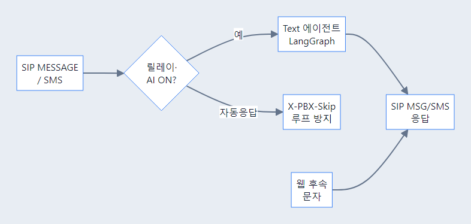

*소스: [`18-journey-4-7-sms.md`](diagrams/system-overview/18-journey-4-7-sms.md)*

#### 도식 ②: 시스템 (기존)


*소스: [`08-sip-message-sequence.md`](diagrams/system-overview/08-sip-message-sequence.md)*

#### User story (절 맨 하단)

##### US-4.7-1 — 고객이 전화 없이도 같은 수준의 AI 응답을 받는다

**BMAD Story Card**  
- **As a** 문자 채널을 선호하는 고객  
- **I want** 전화를 걸지 않아도 같은 지식과 페르소나의 AI 답변을 받고 싶다  
- **So that** 상황에 맞는 채널을 선택하면서도 상담 품질은 유지할 수 있다

**처리 flow**

```mermaid
flowchart LR
  sms["SIP MESSAGE"] --> textAgent["텍스트 에이전트"]
  textAgent --> intent["의도 분류"]
  intent --> rag["RAG·페르소나"]
  rag --> reply["문자 응답"]
```

고객은 이동 중이거나 조용한 환경에 있을 때 전화보다 문자를 선호할 수 있다. 이때 문자 채널이 별도 시스템처럼 동작하면 같은 질문을 다시 설명해야 하고, 전화와 다른 품질의 답을 받게 된다.

시스템은 **SIP MESSAGE**, **텍스트 에이전트**, **의도/RAG 공통 스택**을 사용한다. 문자 입력은 RTP와 STT를 거치지 않고 바로 텍스트 파이프라인으로 들어가며, 전화 AI와 같은 지식·페르소나·의도 분기를 공유한다. 응답 발송 시에는 루프 방지 헤더를 확인한다.

고객은 채널만 문자로 바뀌었을 뿐, 같은 조직의 AI가 같은 기준으로 답한다고 느낀다. 이는 채널 선택권과 접근성을 높인다.

**수용 기준(문서 수준)**
- SIP MESSAGE가 텍스트 에이전트와 공통 지식 흐름으로 연결되는 점이 포함된다.
- 전화 없이도 같은 상담 품질을 경험하는 효과가 설명된다.

##### US-4.7-2 — 상담사가 통화와 문자를 같은 사건 흐름에서 본다

**BMAD Story Card**  
- **As a** 웹 상담사  
- **I want** 통화 이력과 문자 이력을 같은 사건 흐름에서 보고 싶다  
- **So that** 고객이 채널을 바꿔도 맥락을 잃지 않고 이어서 처리할 수 있다

**처리 flow**

```mermaid
flowchart LR
  call["통화 이력"] --> caseId["사건 ID"]
  sms["문자 이력"] --> caseId
  caseId --> web["웹 상담 화면"]
  web --> context["맥락 기반 응대"]
```

상담사는 고객이 전화 후 문자로 이어서 문의하거나, 문자 후 전화를 걸 때 같은 사건으로 이어 보길 원한다. 이력이 분리되면 고객은 같은 설명을 반복하고 상담사는 맥락을 놓친다.

시스템은 메시지 이벤트와 콜/사건 식별자를 연결하고, 웹 UI에서 관련 이력을 함께 보여주는 흐름을 전제로 한다. 상담사는 문자 응답, 통화 이력, AI 요약을 한 맥락에서 확인할 수 있다.

효과는 **반복 설명 감소**, **처리 시간 단축**, **상담 품질 일관성**이다. 고객은 “채널을 바꿔도 이어지는 서비스”를 경험한다.

**수용 기준(문서 수준)**
- 통화와 문자 이력이 사건 ID로 연결되는 흐름이 설명된다.
- 상담사의 맥락 유지와 고객 반복 설명 감소 효과가 포함된다.

##### US-4.7-3 — 시스템이 문자 응답 루프를 방지한다

**BMAD Story Card**  
- **As a** 문자 채널 운영자  
- **I want** AI가 보낸 응답이 다시 AI 입력으로 순환하지 않게 하고 싶다  
- **So that** 무한 응답 루프와 불필요한 비용을 막을 수 있다

**처리 flow**

```mermaid
flowchart LR
  outbound["AI 문자 응답"] --> header["Skip 헤더 부여"]
  header --> receive["재수신 검사"]
  receive --> skip["AI 재처리 차단"]
```

문자 채널에서는 시스템이 보낸 메시지가 다시 수신 이벤트로 들어오는 루프가 생길 수 있다. 이 경우 AI가 자기 응답에 다시 답하면서 비용과 고객 혼란이 증가한다.

시스템은 `X-PBX-Skip-AI-Reply` 같은 헤더나 메타데이터를 사용해 자체 발송 메시지를 구분한다. 재수신 시 해당 플래그가 있으면 AI 응답 생성을 건너뛴다.

운영자는 메시지 폭주와 불필요한 LLM 호출을 막고, 고객은 중복 답변을 받지 않는다.

**수용 기준(문서 수준)**
- 루프 방지 헤더의 목적과 처리 흐름이 포함된다.
- 비용·중복 응답 방지 효과가 설명된다.

##### US-4.7-4 — 상담사가 웹에서 문자 후속 답변을 처리한다

**BMAD Story Card**  
- **As a** 웹 상담사  
- **I want** AI가 처리하지 못한 문자 문의를 웹에서 이어받고 싶다  
- **So that** 고객은 문자 채널을 유지하면서도 사람의 답변을 받을 수 있다

**처리 flow**

```mermaid
flowchart LR
  smsQuestion["문자 문의"] --> aiFail["AI 처리 어려움"]
  aiFail --> hitl["상담사 알림"]
  hitl --> webReply["웹 답변 작성"]
  webReply --> smsOut["문자 발송"]
```

문자 문의도 AI가 답하기 어려운 경우가 있다. 이때 고객에게 전화를 요구하기보다 상담사가 같은 문자 채널에서 답할 수 있으면 경험이 자연스럽다.

시스템은 AI 신뢰도가 낮거나 정책상 사람이 필요한 문자 문의를 웹 상담 화면에 올린다. 상담사는 답변을 작성하고, 시스템은 이를 문자 응답으로 보낸다.

효과는 채널 유지와 정확도 향상이다. 고객은 문자로 시작한 문의를 문자로 끝낼 수 있다.

**수용 기준(문서 수준)**
- AI 실패 문자 문의가 웹 상담사로 넘어가는 흐름이 설명된다.
- 고객이 채널을 유지하는 경험과 정확도 향상이 포함된다.

##### US-4.7-5 — 운영자가 문자 채널 품질을 분석한다

**BMAD Story Card**  
- **As a** 멀티채널 운영자  
- **I want** 문자 문의의 의도, 응답 시간, AI/HITL 비율을 보고 싶다  
- **So that** 전화와 문자 중 어떤 채널에서 병목이 생기는지 알 수 있다

**처리 flow**

```mermaid
flowchart LR
  smsEvents["문자 이벤트"] --> metrics["응답 시간·의도·HITL"]
  metrics --> dashboard["운영 대시보드"]
  dashboard --> channelTune["채널 정책 조정"]
```

문자 채널이 도입되면 운영자는 전화와 별도로 문자 응답 품질을 봐야 한다. 문자 응답이 늦거나 HITL 비율이 높으면 고객은 전화보다 더 답답하게 느낄 수 있다.

시스템은 문자 수신, AI 응답, 상담사 개입, 루프 차단 이벤트를 지표로 남긴다. 운영자는 의도별 응답 시간과 실패율을 보고 지식 보강이나 상담사 배치를 조정한다.

효과는 채널별 품질 관리다. 고객은 어떤 채널을 선택해도 예측 가능한 응답을 받는다.

**수용 기준(문서 수준)**
- 문자 채널 전용 품질 지표가 필요한 이유가 설명된다.
- 운영자가 지표를 기반으로 정책을 조정하는 흐름이 포함된다.

---

### 4.8 Outbound (발신 캠페인)

**이 기능이 쓰이는 이유 (배경)**  
**리마인드**·**회수**·**알림**을 **고객이 먼저** 걸게만 두지 않고, **서버/업무**가 **대기열**·**윈도**를 지키며 **전화**를 **건다**. 수신 측은 **곧 인입(§4.1)**과 **같은** **AI**·**착신 정책**(§4.10)을 **경험**할 수 있어 **채널** **일치**에 유리하다. **미션이** 먼저 **정해지면** **의도**를 **짧게** **우회**하는 **경로**가 있을 수 있다(리포트).

**핵심 페르소나**  
- **캠페인 담당**: **API/스케줄**로 **볼륨**·**재시도**·**최대 동시** **통제**.  
- **수신 고객**: “**누가 왜**” **전화**했는지 **같은** **브랜드** **음성**으로 **듣는다**.

**의존·사용하는 능력**  
`OutboundCallManager`·**대기열**·**상태**·(선택) **캘린더**·리포트.

**시간순 과정(요약)**  
1. **작업** **등록** (번호·**미션**·**슬롯**).  
2. **순서**·**한도**에 따라 **OUT** **INVITE**.  
3. **연결** 시 **인입** **동일** **파이프라인**(TTS/AI/사람).

**이때 느끼는 경험·효과**  
**no-show**·**미회신** **감소**, **콜센터** **선제** **부담** **이동**.

#### 도식 ①: Journey

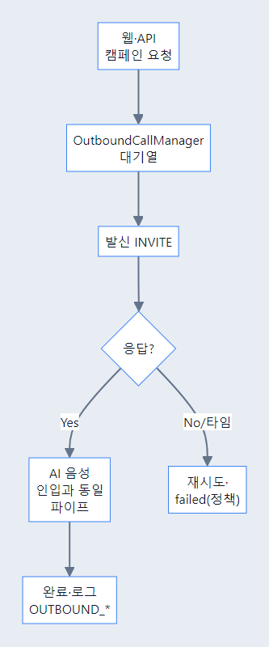

*소스: [`19-journey-4-8-outbound.md`](diagrams/system-overview/19-journey-4-8-outbound.md)*

#### 도식 ②: 시스템 (기존)


*소스: [`11-outbound-campaign.md`](diagrams/system-overview/11-outbound-campaign.md)*

#### User story (절 맨 하단)

##### US-4.8-1 — 캠페인 담당자가 발신 작업을 등록한다

**BMAD Story Card**  
- **As a** 캠페인·운영 담당자  
- **I want** 대상 번호와 미션을 등록해 서버 발신 작업을 만들고 싶다  
- **So that** 반복 안내 전화를 수동으로 걸지 않고 캠페인 단위로 운영할 수 있다

**처리 flow**

```mermaid
flowchart LR
  operator["캠페인 담당"] --> createJob["발신 작업 등록"]
  createJob --> queue["대기열 저장"]
  queue --> policy["발신 정책 적용"]
  policy --> ready["발신 준비"]
```

캠페인 담당자는 예약 리마인드, 미납 안내, 이벤트 안내처럼 고객이 먼저 전화하지 않아도 전달해야 하는 업무가 있다. 사람이 일일이 전화를 걸면 시간대, 재시도, 최대 동시 통화, 실패 처리 관리가 어렵다.

시스템은 **OutboundCallManager**, **API/웹 등록**, **대기열**, **재시도 정책**, **최대 동시 통화 제한**을 사용한다. 담당자는 대상 번호와 미션을 등록하고, 시스템은 정책에 맞춰 발신 준비 상태로 둔다.

효과는 발신 업무의 캠페인화다. 담당자는 전체 발신 상태를 보고 캠페인을 조정하고, 고객은 필요한 안내를 선제적으로 받는다.

**수용 기준(문서 수준)**
- 발신 작업 등록과 대기열 저장 흐름이 포함된다.
- 수동 발신을 캠페인 운영으로 바꾸는 가치가 설명된다.

##### US-4.8-2 — 시스템이 대기열과 재시도로 발신을 제어한다

**BMAD Story Card**  
- **As a** 발신 운영자  
- **I want** 최대 동시 통화와 재시도 정책을 지키며 발신되길 원한다  
- **So that** 과도한 발신이나 실패 누락 없이 안정적으로 캠페인을 진행할 수 있다

**처리 flow**

```mermaid
flowchart LR
  queue["발신 대기열"] --> limit["동시 통화 제한"]
  limit --> dial["OUT INVITE"]
  dial --> failCheck["실패 여부"]
  failCheck --> retry["재시도 예약"]
  failCheck --> connected["연결 성공"]
```

대량 발신은 동시에 너무 많이 걸면 시스템과 상담원이 모두 부담을 받는다. 반대로 실패한 번호를 관리하지 않으면 도달률이 낮아진다.

시스템은 대기열에서 작업을 꺼내 최대 동시 통화 수를 확인하고, 실패 시 재시도 정책을 적용한다. 연결 성공, 실패, 포기 상태를 구분해 남긴다.

효과는 안정적인 발신 운영이다. 운영자는 캠페인 속도와 실패 처리를 통제할 수 있다.

**수용 기준(문서 수준)**
- 대기열, 동시 제한, 재시도 흐름이 설명된다.
- 안정성과 도달률 관리 효과가 포함된다.

##### US-4.8-3 — 수신 고객이 낯선 자동 전화가 아니라 동일한 브랜드 경험을 듣는다

**BMAD Story Card**  
- **As a** 서버 발신 전화를 받은 고객  
- **I want** 누가 왜 전화했는지 같은 브랜드 톤으로 즉시 이해하고 싶다  
- **So that** 발신 캠페인을 스팸이 아니라 기존 서비스의 안내 흐름으로 받아들일 수 있다

**처리 flow**

```mermaid
flowchart LR
  answer["고객 수신"] --> greeting["브랜드 인사"]
  greeting --> mission["캠페인 목적 안내"]
  mission --> aiTalk["AI 응대"]
  aiTalk --> action["예약 변경·확인·종료"]
```

고객은 전화를 받았을 때 누가 왜 전화했는지 빠르게 이해해야 한다. 발신 캠페인이 인입 AI와 전혀 다른 말투나 흐름이면 스팸처럼 느껴질 수 있다.

시스템은 동일한 **B2BUA**, **RTP**, **AI 음성**, **페르소나**, 필요 시 **착신 제어 정책**을 사용한다. 연결 직후 캠페인 미션을 바탕으로 안내 목적을 밝히고, 고객 반응에 따라 AI 응답, 예약 변경, 사람 연결로 이어진다.

고객은 “모르는 자동전화”보다 **기존 서비스와 같은 톤의 안내 전화**를 경험한다. 비즈니스는 리마인드·회수·이용률을 높이면서도 브랜드 신뢰를 유지할 수 있다.

**수용 기준(문서 수준)**
- 수신 직후 브랜드 인사와 미션 안내 흐름이 포함된다.
- 발신 캠페인을 스팸이 아닌 서비스 경험으로 만드는 효과가 설명된다.

##### US-4.8-4 — 수신 고객이 필요하면 사람에게 연결된다

**BMAD Story Card**  
- **As a** 발신 안내를 듣다가 상담이 필요한 고객  
- **I want** 자동 안내 중에도 사람에게 연결될 수 있길 원한다  
- **So that** 안내만으로 해결되지 않는 문제를 바로 처리할 수 있다

**처리 flow**

```mermaid
flowchart LR
  outboundAi["Outbound AI 안내"] --> needHelp["고객 상담 요청"]
  needHelp --> policy["전환 가능 확인"]
  policy --> transfer["상담원 연결"]
  transfer --> resolve["문제 해결"]
```

발신 캠페인은 안내가 목적이지만, 고객이 문의하거나 이의를 제기할 수 있다. 이때 “이 번호로 다시 전화하세요”만 안내하면 경험이 끊긴다.

시스템은 고객 발화에서 상담 요청을 감지하고, 운영 시간과 상담원 상태를 확인한 뒤 Transfer 또는 HITL로 연결한다. 전환이 불가하면 콜백 예약이나 문자 후속 안내를 제공할 수 있다.

고객은 선제 안내 중에도 문제 해결 경로가 열려 있다고 느낀다.

**수용 기준(문서 수준)**
- Outbound 중 사람 연결 요청이 처리되는 흐름이 설명된다.
- 전환 불가 시 대안 안내 필요가 포함된다.

##### US-4.8-5 — 캠페인 담당자가 발신 상태와 성과를 추적한다

**BMAD Story Card**  
- **As a** 캠페인 성과를 보는 운영자  
- **I want** 발신 성공, 실패, 재시도, 고객 반응 상태를 보고 싶다  
- **So that** 캠페인의 도달률과 후속 조치 대상을 판단할 수 있다

**처리 flow**

```mermaid
flowchart LR
  callResult["발신 결과"] --> status["상태 집계"]
  status --> dashboard["캠페인 대시보드"]
  dashboard --> followUp["후속 조치"]
  dashboard --> optimize["정책 최적화"]
```

캠페인은 전화를 거는 것으로 끝나지 않는다. 누가 받았고, 실패했으며, 어떤 고객이 후속 조치가 필요한지 알아야 한다.

시스템은 발신 시도, 응답, 실패, 재시도, AI 응대 결과, 사람 전환 여부를 상태로 남긴다. 운영자는 상태를 기준으로 재시도 정책이나 캠페인 대상을 조정한다.

효과는 캠페인 운영의 폐쇄 루프다. 발신 결과가 다음 캠페인 개선으로 이어진다.

**수용 기준(문서 수준)**
- 발신 상태와 성과 추적 항목이 설명된다.
- 후속 조치와 정책 최적화 효과가 포함된다.

---

### 4.9 연결음 (Ringback)

**이 기능이 쓰이는 이유 (배경)**  
**착신**까지 **잠시** 걸리는 동안 **아무 소리**도 없으면 **끊긴** 느낌이 난다. **얼리 미디어**·**TTS 인사**·**짧은 음원**(Suno 등)으로 “**연결 중**” **브랜딩**과 대기 **체감**을 완화한다. **200 OK**로 **인간**이 받거나 **AI**가 인수하는 **시점**에 **연결음**을 끊어 **이중 재생**이 없게 한다(§4.1·정책).

**핵심 페르소나**  
- **발신 고객**: **빈** **대기**보다 **음성**·**로고** **느낌**의 **짧은** **신호**.  
- **마케팅/운영**: **인사 TTS** + **음원** **믹스** (Suno 콜백 **공인 URL**·ngrok 등, 리포트).

**의존·사용하는 능력**  
2차 **INVITE**·**early media**·(선택) **Suno** 파이프·TTS.

**시간순 과정(요약)**  
1. **기다리는** **동안** **연결음** **스트림**.  
2. **200 OK** **또는** **AI** **투입** **확정** **시** **정지/페이드**.

**이때 느끼는 경험·효과**  
**이탈**·**“끊겼나?”** **민원** **감소** (톤·볼륨·트리거 **튜닝** 필요).

#### 도식 ①: Journey

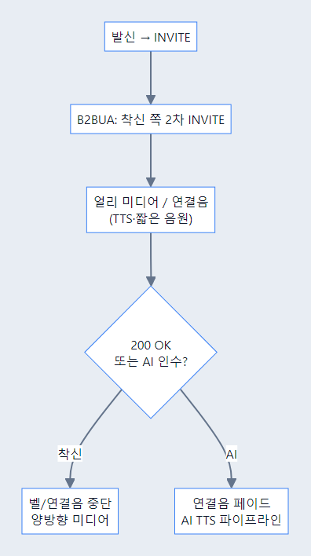

*소스: [`20-journey-4-9-ringback.md`](diagrams/system-overview/20-journey-4-9-ringback.md)*

#### 도식 ②: 시스템 (기존)


*소스: [`09-ringback-suno.md`](diagrams/system-overview/09-ringback-suno.md)*

**배포**: Suno 콜백은 **공인 URL** 필요(예: ngrok).

#### User story (절 맨 하단)

##### US-4.9-1 — 발신 고객이 대기 중에도 통화가 살아 있음을 느낀다

**BMAD Story Card**  
- **As a** 대표번호에 전화를 건 고객  
- **I want** 상대가 받기 전에도 연결 중임을 알 수 있는 소리를 듣고 싶다  
- **So that** 통화가 끊겼다고 오해하지 않고 기다릴 수 있다

**처리 flow**

```mermaid
flowchart LR
  dial["고객 발신"] --> early["early media 시작"]
  early --> ringback["연결음 재생"]
  ringback --> answer["사람 또는 AI 응답"]
  answer --> stop["연결음 중단"]
```

고객이 전화를 걸었는데 몇 초 동안 아무 소리도 들리지 않으면 통화가 끊겼거나 시스템이 멈췄다고 느낄 수 있다. 특히 대표번호나 AI PBX에서는 연결 전 침묵이 불안과 이탈로 이어진다.

시스템은 **early media**, **Ringback**, **TTS 인사**, 필요 시 **짧은 음원**을 사용한다. 착신 레그가 만들어지는 동안 고객에게 “연결 중”임을 알려 주는 음성을 보내고, 사람이 받거나 AI가 인수하는 순간 연결음을 멈춘다.

고객은 기다리는 동안에도 서비스가 응답하고 있음을 느낀다. 효과는 **대기 이탈 감소**, **끊김 오해 감소**, **브랜드 첫인상 개선**이다.

**수용 기준(문서 수준)**
- early media와 연결음 시작·중단 흐름이 포함된다.
- 고객 대기 불안 감소 효과가 설명된다.

##### US-4.9-2 — 운영자가 연결 대기 구간을 브랜드 경험으로 설계한다

**BMAD Story Card**  
- **As a** 마케팅·운영 담당자  
- **I want** 연결 대기 중 TTS 인사와 짧은 음원으로 브랜드 톤을 전달하고 싶다  
- **So that** 대기 시간이 단순 침묵이 아니라 안내와 브랜딩의 구간이 된다

**처리 flow**

```mermaid
flowchart LR
  profile["브랜드 인사 설정"] --> tts["TTS 인사"]
  profile --> music["짧은 음원"]
  tts --> mix["대기음 구성"]
  music --> mix
  mix --> caller["고객 청취"]
```

운영·마케팅은 연결음이 단순 삐 소리가 아니라, 조직의 톤을 보여 주는 짧은 경험이 되길 원한다. 예를 들어 “곧 상담을 연결해 드릴게요”라는 TTS와 짧은 브랜드 음원을 조합할 수 있다.

시스템은 **TTS 인사**, **Suno 등 음원 생성**, **AnnouncementProfile**, **greeting_override**와 연결될 수 있다. 운영자는 상황별 인사말과 음원을 준비하고, 배포 환경에서는 콜백 URL·파일 변환·볼륨을 확인한다.

결과적으로 고객의 대기 체감이 줄고, 운영자는 대기 구간을 안내·브랜딩·정책 전달의 공간으로 활용할 수 있다.

**수용 기준(문서 수준)**
- TTS 인사와 음원이 대기 경험으로 구성되는 흐름이 설명된다.
- 브랜딩과 대기 체감 감소 효과가 포함된다.

##### US-4.9-3 — 시스템이 AI 또는 사람 응답 시 연결음을 멈춘다

**BMAD Story Card**  
- **As a** 연결을 기다리는 고객  
- **I want** 실제 응답이 시작되면 연결음이 겹치지 않길 원한다  
- **So that** 상담원이나 AI 첫 말을 놓치지 않는다

**처리 flow**

```mermaid
flowchart LR
  ringback["연결음 재생"] --> answerSignal["200 OK 또는 AI 인수"]
  answerSignal --> fade["정지·페이드"]
  fade --> media["실제 음성 미디어"]
```

연결음은 대기 중에는 도움이 되지만, 사람이 받거나 AI가 인수한 뒤에도 계속 나오면 첫 인사가 묻힌다. 고객은 누가 말하는지 혼란스러워질 수 있다.

시스템은 200 OK, AI 파이프라인 시작, Transfer 성공 같은 신호를 기준으로 연결음을 중단하거나 페이드한다. 이후 실제 RTP 미디어만 고객에게 들려야 한다.

효과는 첫 응답 명확성이다. 고객은 대기음에서 실제 대화로 자연스럽게 넘어간다.

**수용 기준(문서 수준)**
- 연결음 중단 트리거와 실제 미디어 전환 흐름이 포함된다.
- 이중 재생 방지 효과가 설명된다.

##### US-4.9-4 — 운영자가 Suno/TTS 음원 배포를 관리한다

**BMAD Story Card**  
- **As a** 연결음 콘텐츠 운영자  
- **I want** 생성된 음원과 TTS 파일이 배포 환경에서 재생 가능한지 확인하고 싶다  
- **So that** 고객에게 깨진 파일이나 잘못된 볼륨의 연결음이 나가지 않는다

**처리 flow**

```mermaid
flowchart LR
  create["음원 생성"] --> callback["콜백 URL 수신"]
  callback --> convert["파일 변환·검증"]
  convert --> deploy["배포"]
  deploy --> playback["연결음 재생"]
```

Suno 같은 외부 음원 생성이나 TTS 파일은 생성 자체보다 배포 검증이 중요하다. 파일 포맷, 볼륨, 길이, 콜백 URL 접근성이 맞지 않으면 실제 통화에서 재생되지 않는다.

운영자는 공인 URL, 파일 변환, 재생 테스트, 롤백 파일을 확인한다. 시스템은 실패 시 기본 연결음이나 TTS로 대체할 수 있어야 한다.

효과는 연결음 배포 안정성이다. 고객은 깨진 대기음이 아니라 정상적인 안내를 듣는다.

**수용 기준(문서 수준)**
- 외부 음원 생성부터 배포 검증까지의 흐름이 설명된다.
- 실패 시 대체 연결음 필요가 포함된다.

##### US-4.9-5 — 운영자가 연결음 성과를 튜닝한다

**BMAD Story Card**  
- **As a** 대기 경험을 관리하는 운영자  
- **I want** 연결음 길이, 볼륨, 이탈률, 민원을 보고 조정하고 싶다  
- **So that** 대기음이 고객 경험을 개선하는지 확인할 수 있다

**처리 flow**

```mermaid
flowchart LR
  playbackLog["연결음 로그"] --> metrics["이탈·민원·재생 시간"]
  metrics --> review["운영 리뷰"]
  review --> tune["볼륨·길이·문구 조정"]
```

좋은 연결음도 너무 길거나 시끄러우면 불편하다. 운영자는 연결음이 실제로 이탈을 줄이는지, 민원을 늘리지 않는지 확인해야 한다.

시스템은 연결음 재생 시간, 응답 전 이탈, 고객 민원, 음원 버전 정보를 지표로 남긴다. 운영자는 이 지표를 보고 문구, 볼륨, 길이를 조정한다.

효과는 대기 경험의 지속 개선이다. 연결음은 단순 파일이 아니라 운영 가능한 CX 요소가 된다.

**수용 기준(문서 수준)**
- 연결음 품질 지표와 튜닝 흐름이 포함된다.
- 고객 이탈·민원 감소 목표가 설명된다.

---

### 4.10 착신 제어

**이 기능이 쓰이는 이유 (배경)**  
**같은 대표번호**라도 **식당**·**B2B**·**콜센터**마다 “곧 **사람**” vs “**N초 후 AI**” vs “**첫 응답 AI**”가 **다르다**. **시간**·**휴일**·**전달**·**링 그룹**을 **DB 규칙**으로 모델링해, **B2BUA/CallManager**가 **첫 벨**·**2차 INVITE**·**다음 단계**(§3.3) **결정**에 쓴다. **SIP 헌트** 동시/순차 **세부**는 **릴리스마다** **확인**(리포트).

**핵심 페르소나**  
- **IT/관리**: **업무**·**휴일**·**오버플로** **정책**을 **한곳**에 둔다.  
- **고객**: **기다릴지**·**AI**에 **맡길지**가 **조직**이 약속한 것과 **맞기**를 바란다.

**의존·사용하는 능력**  
**SQLite(등)** **규칙**, `direct` / `no_answer_ai` / `immediate_ai` / `forward_*` / `ring_group`, `AnnouncementProfile`·`greeting_override`.

**시간순 과정(요약)**  
1. 콜 **알림** 시 **규칙** **매칭**(시간·모델).  
2. **모델**에 따라 **즉시 인간**·**N초 후**·**AI**·**다른 대상** **벨**.  
3. (선택) **맞**는 **인사 TTS** **오버라이드**.

**이때 느끼는 경험·효과**  
야간·피크 **누락**이 줄고, **사전**에 **밝힌** **정책**과 **실제** 첫 **응답**이 **맞**으면 **기대 관리**에 **도움**이 된다.

#### 도식 ①: Journey

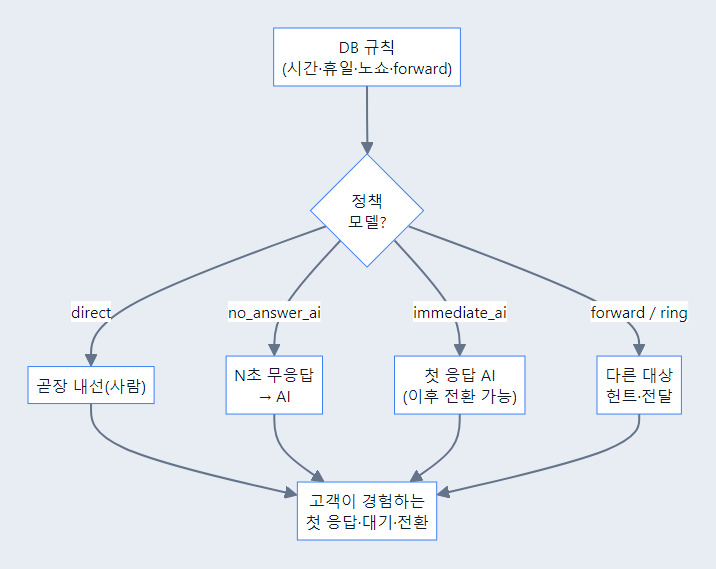

*소스: [`21-journey-4-10-callcontrol.md`](diagrams/system-overview/21-journey-4-10-callcontrol.md)*

#### 도식 ②: 시스템 (기존)


*소스: [`10-call-control-priority.md`](diagrams/system-overview/10-call-control-priority.md)*

> **주의**: 링 그룹 **SIP** 동시/순차는 제품·리포트 **최신** 본 뒤 배포.

| 모델 | 경험에 대응 |
|------|-------------|
| `direct` | 곧장 인간 |
| `no_answer_ai` | N초 **무응답** 후 AI |
| `immediate_ai` | 첫 응답 **AI** (이후 사람 가능) |
| `forward_*` / `ring_group` | **전달**·**헌트** |

`AnnouncementProfile` + `greeting_override`로 **같은 규칙**에 **맞는** 인사 TTS.

#### User story (절 맨 하단)

##### US-4.10-1 — 업무 시간에는 상담원에게 곧장 연결한다

**BMAD Story Card**  
- **As a** 대표번호 정책을 관리하는 IT 관리자  
- **I want** 업무 시간에는 고객을 상담원에게 직접 연결하고 싶다  
- **So that** 사람이 받을 수 있는 시간에는 가장 빠른 상담 경험을 제공할 수 있다

**처리 flow**

```mermaid
flowchart LR
  inbound["인입 콜"] --> rule["업무 시간 규칙"]
  rule --> direct["direct 모델"]
  direct --> agent["상담원 내선"]
  agent --> answer["사람 응답"]
```

관리자는 업무 시간에는 상담원에게 바로 연결하고 싶다. 사람이 응대 가능한 시간에도 AI가 먼저 받으면 고객은 불필요한 자동응답을 거친다고 느낄 수 있다.

시스템은 **DB 규칙**과 `direct` 모델을 사용해 시간대와 대상 내선을 확인한다. 조건이 맞으면 B2BUA가 상담원 내선으로 2차 INVITE를 보내고 직접 연결한다.

효과는 빠른 사람 상담과 고객 대기 감소다. 관리자는 정책을 한곳에서 제어하면서도 업무 시간의 상담 우선 경험을 유지한다.

**수용 기준(문서 수준)**
- 업무 시간 direct 모델과 상담원 연결 흐름이 설명된다.
- 빠른 사람 상담 경험의 가치가 포함된다.

##### US-4.10-2 — 무응답 시 AI가 인수한다

**BMAD Story Card**  
- **As a** 대표번호에 전화한 고객  
- **I want** 상담원이 받지 않아도 일정 시간 뒤 AI가 응대하길 원한다  
- **So that** 기다리기만 하다가 전화를 끊지 않고 문의를 남길 수 있다

**처리 flow**

```mermaid
flowchart LR
  inbound["인입 콜"] --> ring["상담원 호출"]
  ring --> timeout["N초 무응답"]
  timeout --> noAnswerAi["no_answer_ai"]
  noAnswerAi --> ai["AI 응대"]
```

고객은 어떤 조직에 전화했을 때 계속 벨만 울리면 포기하기 쉽다. 무응답 후 AI가 응대하면 사람 연결이 실패해도 문의 접수와 기본 안내는 가능하다.

시스템은 `no_answer_ai` 정책과 타이머를 사용한다. 상담원이 N초 동안 받지 않으면 AI 음성 파이프라인을 시작하고, 고객 질문을 의도 분류·RAG·예약·HITL 흐름으로 보낸다.

고객은 기다림 끝에 응답을 받고, 운영자는 부재 중 통화를 접수 가능한 이벤트로 전환한다.

**수용 기준(문서 수준)**
- 무응답 타이머와 AI 인수 흐름이 설명된다.
- 고객 이탈 감소와 운영상 미응답 보완 효과가 포함된다.

##### US-4.10-3 — 야간·휴일에는 AI가 첫 응답을 맡는다

**BMAD Story Card**  
- **As a** 야간이나 휴일에 전화한 고객  
- **I want** 상담원이 없는 시간에도 즉시 안내를 받고 싶다  
- **So that** 영업시간 밖에도 기본 정보 확인이나 접수를 할 수 있다

**처리 flow**

```mermaid
flowchart LR
  inbound["야간 인입"] --> schedule["시간·휴일 규칙"]
  schedule --> immediateAi["immediate_ai"]
  immediateAi --> greeting["정책 인사말"]
  greeting --> aiTalk["AI 응대"]
```

야간·휴일에는 사람이 받지 않는 것이 자연스러울 수 있다. 하지만 아무 안내 없이 끊기거나 계속 대기하면 고객은 서비스가 닫힌 이유를 알 수 없다.

시스템은 시간·휴일 규칙을 보고 `immediate_ai` 모델을 적용한다. 첫 응답부터 AI가 인사하고, 가능한 업무 범위와 후속 조치를 안내한다.

고객은 영업시간 밖에도 기본 안내와 접수 경험을 얻고, 운영자는 야간 누락을 줄인다.

**수용 기준(문서 수준)**
- 시간·휴일 규칙이 immediate_ai로 이어지는 흐름이 포함된다.
- 야간 고객 안내와 접수 효과가 설명된다.

##### US-4.10-4 — 전달·링 그룹으로 여러 대상에게 착신한다

**BMAD Story Card**  
- **As a** 대표번호 운영자  
- **I want** 특정 상황에서 다른 번호나 링 그룹으로 전화를 전달하고 싶다  
- **So that** 한 사람이 못 받아도 다른 담당자가 받을 수 있다

**처리 flow**

```mermaid
flowchart LR
  inbound["인입 콜"] --> rule["전달·링 그룹 규칙"]
  rule --> targetList["대상 목록"]
  targetList --> ringGroup["순차·동시 호출"]
  ringGroup --> answered["응답 대상 연결"]
```

대표번호는 한 명의 상담원에게만 의존하면 누락이 생긴다. 부서, 지점, 당직자에 따라 다른 번호나 여러 내선으로 전달해야 할 수 있다.

시스템은 `forward_*` 또는 `ring_group` 모델을 사용해 대상 목록과 우선순위를 결정한다. 동시/순차 호출 세부는 릴리스 정책에 맞춰 적용하고, 응답한 대상과 발신 고객을 연결한다.

효과는 착신 성공률 향상이다. 고객은 조직 내부 배치와 무관하게 응답 가능성이 높은 경로로 연결된다.

**수용 기준(문서 수준)**
- forward/ring_group 모델이 대상 목록 호출로 이어지는 흐름이 설명된다.
- 착신 성공률 향상과 누락 감소 효과가 포함된다.

##### US-4.10-5 — 정책별 인사말이 첫 응답 경험을 맞춘다

**BMAD Story Card**  
- **As a** 대표번호 경험을 관리하는 운영자  
- **I want** 착신 정책에 따라 다른 인사말을 들려주고 싶다  
- **So that** 고객이 왜 기다리는지, 왜 AI가 받는지 자연스럽게 이해할 수 있다

**처리 flow**

```mermaid
flowchart LR
  matchedRule["착신 규칙 매칭"] --> greetingProfile["AnnouncementProfile"]
  greetingProfile --> override["greeting_override"]
  override --> tts["정책별 인사 TTS"]
  tts --> customer["고객 첫 응답"]
```

같은 AI 응답이라도 업무 시간 외 안내, 무응답 후 AI 인수, 즉시 AI 응대는 고객에게 다르게 설명되어야 한다. 인사말이 맞지 않으면 고객은 정책을 이해하지 못하고 불만을 느낄 수 있다.

시스템은 `AnnouncementProfile`과 `greeting_override`를 사용해 규칙별 인사말을 적용한다. 예를 들어 야간에는 “영업시간이 종료되어 AI가 안내합니다”처럼 정책을 설명할 수 있다.

고객은 실제 응답이 조직의 약속과 맞는다고 느끼고, 운영자는 첫 응답 경험을 정책 단위로 관리할 수 있다.

**수용 기준(문서 수준)**
- 착신 정책과 인사말 오버라이드의 연결 흐름이 설명된다.
- 고객 기대 관리와 CS 감소 효과가 포함된다.

---

## 5. 기술 스택

| 층 | 기술 |
|----|------|
| **런타임** | Python 3.11+, **asyncio** |
| **API** | **FastAPI**, structlog |
| **실시간** | **python-socketio** / aiohttp |
| **SIP/RTP** | 자체 B2BUA + RTP (코덱·SDP 조작) |
| **Voice 프레임워크** | **Pipecat** (VAD, STT/TTS 프레임, 파이프라인) |
| **에이전트** | **LangGraph** + **LangChain** tools, **checkpointer** (SQLite 권장 패키지) |
| **LLM/STT/TTS** | **Google Cloud** (Gemini, STT, TTS) |
| **벡터 DB** | **ChromaDB** + **sentence-transformers** 계열 임베딩 |
| **관계 DB** | **SQLite** (예약, 착신제어, 통화 기록 등) |
| **프론트** | **Next.js** (App Router), **TypeScript**, Tailwind, **Zustand** 등 |
| **통화음 생성** | **Suno API** (sunoapi.org), **pydub**/ffmpeg(디코딩) |

**외부 옵션**: **ngrok** (Suno·웹훅), **Google Calendar OAuth** (예약·캘린더), **SMS/RCS** 연동(리포트·`booking_notify`·`end_call_sms` 등).

---

## 부록

- **API·이벤트·CDR 상세 표** — 백업 문서 [`SYSTEM_OVERVIEW_2026-04-27_before_rewrite.md`](SYSTEM_OVERVIEW_2026-04-27_before_rewrite.md) §4, §5.
- **날짜별 구현/장애 기록** — `docs/reports/YYYY-MM/`.
- **설계 세부** — `docs/design/` (프로젝트에 있을 때).
- **다이어그램 자산** — PNG: `docs/images/system-overview/` · Mermaid 소스: `docs/diagrams/system-overview/` (재생성은 [README](diagrams/system-overview/README.md)).

---

*이 문서는 고수준 **아키텍처**와 **기능**을 한데 묶은 **시스템 개요**에 초점을 맞췄다. 경계 조건·플래그·엔드포인트·API 상세는 코드와 `docs/reports` 리포트를 병행한다.*
