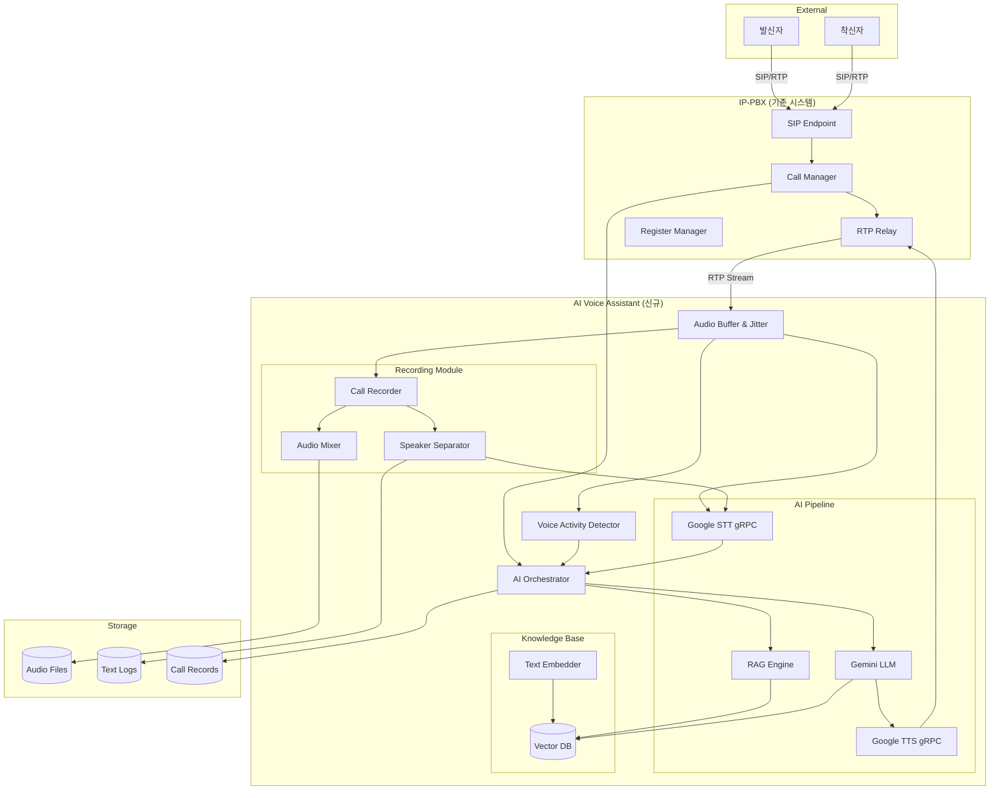
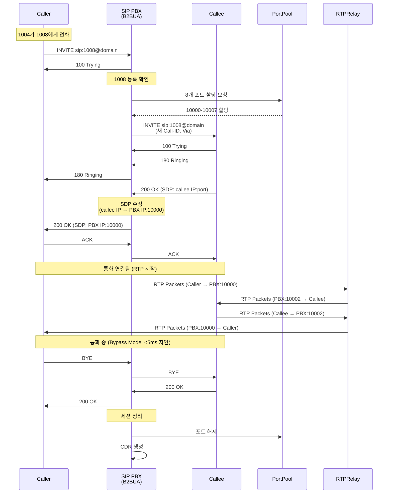
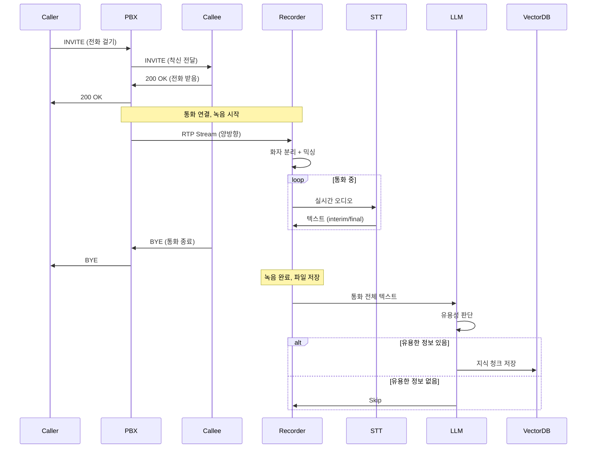
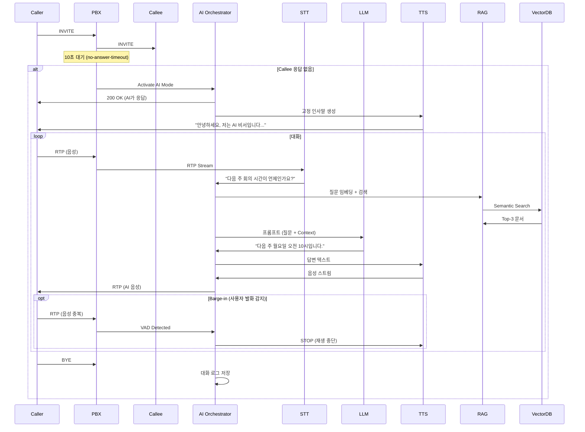
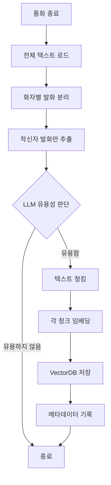
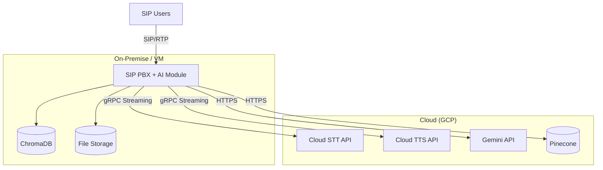
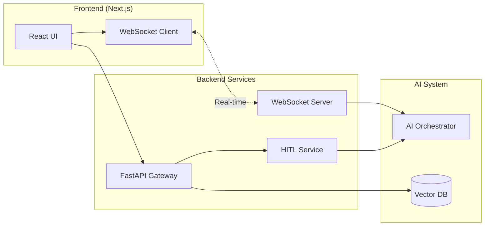
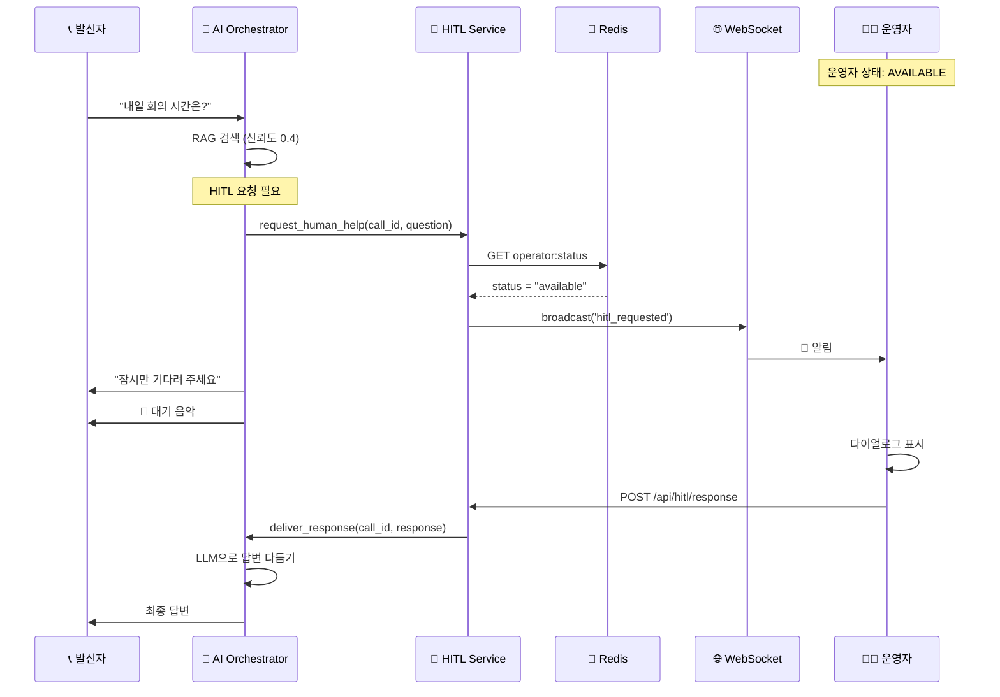
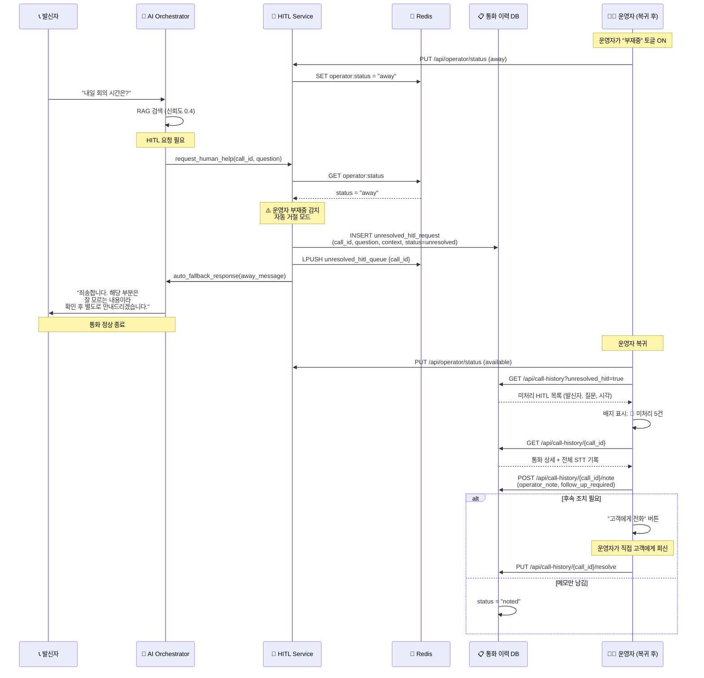
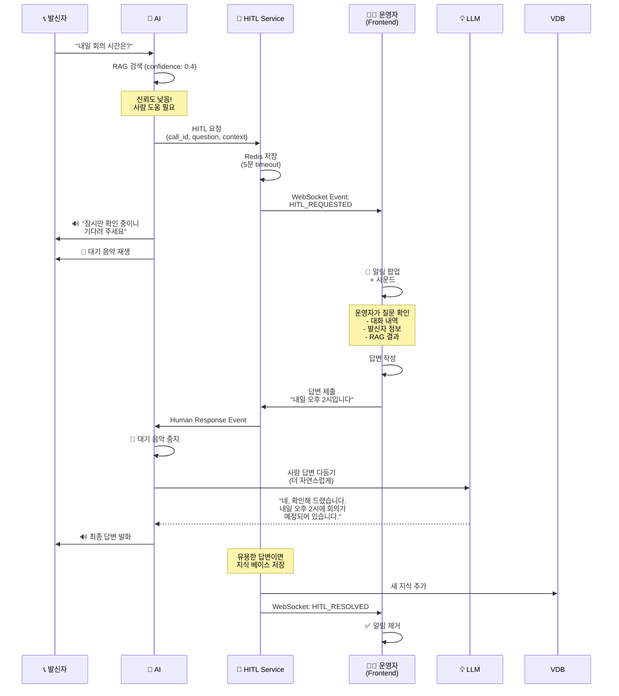

# SIP PBX + AI Voice Assistant - 완전한 Backend 아키텍처

## 📋 문서 정보

| 항목 | 내용 |
|-----|------|
| **문서 버전** | v2.0 |
| **최종 업데이트** | 2025-01-06 |
| **작성자** | Winston (Architect) |
| **프로젝트명** | SIP PBX B2BUA + AI Voice Assistant + Frontend Control Center |
| **상태** | Production Ready |

### 변경 이력

| 날짜 | 버전 | 설명 | 작성자 |
|-----|------|------|-------|
| 2025-01-05 | v1.0 | 초기 아키텍처 문서 작성 (AI 보이스봇) | Winston |
| 2025-01-06 | v2.0 | SIP PBX B2BUA 내용 통합, 전체 Backend 통합 문서 | Winston |

---

## 📌 문서 목적

> **이 문서는 Backend 시스템의 모든 것을 담고 있습니다.**
> 
> - ✅ **SIP PBX B2BUA 코어**: SIP 시그널링, RTP 릴레이, 통화 관리
> - ✅ **AI Voice Assistant**: STT/TTS/LLM, RAG, 지식 베이스
> - ✅ **Backend API Services**: FastAPI Gateway, WebSocket, HITL
> 
> Frontend 관련 내용은 **[Frontend Architecture](frontend-architecture.md)** 문서를 참조하세요.

---

## 1. 시스템 개요 (Overview)

## 1. 시스템 개요 (Overview)

### 1.1 프로젝트 배경

본 시스템은 **엔터프라이즈급 SIP B2BUA (Back-to-Back User Agent) 전화 교환 시스템**을 기반으로, **AI 음성 비서 기능**을 통합한 차세대 통신 플랫폼입니다.

#### 핵심 구성 요소

```
┌─────────────────────────────────────────────────────────────────┐
│                      COMPLETE BACKEND SYSTEM                     │
├─────────────────────────────────────────────────────────────────┤
│                                                                  │
│  ┌──────────────────────┐      ┌──────────────────────┐        │
│  │   SIP PBX B2BUA      │◄────►│  AI Voice Assistant  │        │
│  │   (Core System)      │      │  (Extension)         │        │
│  ├──────────────────────┤      ├──────────────────────┤        │
│  │ • SIP Signaling      │      │ • STT/TTS/LLM        │        │
│  │ • RTP Relay          │      │ • RAG Engine         │        │
│  │ • Call Management    │      │ • Knowledge Base     │        │
│  │ • Port Pool          │      │ • HITL Service       │        │
│  │ • CDR Generation     │      │ • Call Recording     │        │
│  └──────────────────────┘      └──────────────────────┘        │
│           ▲                             ▲                       │
│           │                             │                       │
│           └─────────┬───────────────────┘                       │
│                     ▼                                           │
│         ┌──────────────────────┐                               │
│         │  Backend API Gateway │                               │
│         │  (FastAPI + Socket.IO)│                               │
│         └──────────────────────┘                               │
│                     ▲                                           │
└─────────────────────┼───────────────────────────────────────────┘
                      │
              ┌───────┴────────┐
              │   Frontend     │
              │  (Next.js)     │
              └────────────────┘
```

### 1.2 시스템 계층 구조

#### Layer 1: SIP PBX Core (기존 시스템)
**역할**: 표준 SIP 통신 프로토콜 처리
- SIP B2BUA 엔진 (INVITE, BYE, ACK, PRACK, UPDATE, REGISTER, CANCEL, OPTIONS)
- RTP Bypass Relay (<5ms 지연)
- 동적 포트 관리 (10,000-20,000 포트 풀)
- SDP 협상 및 미디어 조정
- Transaction 및 Dialog 관리
- CDR (Call Detail Record) 생성

#### Layer 2: AI Voice Assistant (신규 확장)
**역할**: 지능형 음성 응대 및 자동화
- 부재중 자동 응답 (10초 타임아웃)
- Google Cloud STT/TTS 스트리밍
- Gemini 1.5 Flash LLM 대화 생성
- RAG (Retrieval Augmented Generation)
- Vector DB 지식 베이스
- 통화 녹음 및 지식 추출
- Barge-in 지원 (VAD 기반)

#### Layer 3: Backend API Services (신규)
**역할**: Frontend 연동 및 실시간 통신
- FastAPI REST API Gateway
- Socket.IO WebSocket Server
- HITL (Human-in-the-Loop) Service
- 운영자 상태 관리
- 통화 이력 관리
- PostgreSQL/Redis 통합

### 1.3 핵심 목표

### 1.3 핵심 목표

#### 🎯 SIP B2BUA 기본 통화 시나리오
1. **표준 SIP 통화 처리**
   - REGISTER: 사용자 등록 및 인증
   - INVITE: 통화 설정 (양방향 독립 leg)
   - BYE: 통화 종료
   - CANCEL: 통화 취소
   - UPDATE/PRACK: 세션 업데이트 및 신뢰성 응답

2. **저지연 RTP Relay**
   - Bypass 모드: 직접 relay (<5ms)
   - 양방향 독립 RTP 스트림
   - 동적 포트 할당 (통화당 8개 포트)
   - Jitter Buffer 및 패킷 재정렬

3. **통화 기록 및 모니터링**
   - CDR 생성 (JSON Lines)
   - Webhook 이벤트 알림
   - Prometheus 메트릭
   - 구조화된 로깅

#### 🎯 일반 통화 시나리오 (녹음 및 지식 추출)
1. **통화 녹음 및 텍스트 변환**
   - 양방향 RTP 스트림을 화자 분리하여 STT 변환
   - 믹싱된 오디오 파일 + 텍스트 파일 저장
   
2. **지식 베이스 자동 구축**
   - LLM(Gemini)이 통화 내용 분석
   - 유용한 정보 판단 시 Vector DB에 자동 저장
   - 착신자의 말하는 내용을 AI 보이스봇의 지식으로 활용

#### 🤖 AI 보이스봇 시나리오
1. **부재중 자동 응답**
   - 착신자가 10초 이내 응답 없을 시 PBX가 직접 호 수신
   - 고정 인사말로 응대 시작 (설정 가능)

2. **실시간 대화 처리**
   - RTP ↔ Google gRPC 스트리밍 직접 연결 (최소 지연)
   - VAD 기반 Barge-in 지원 (사용자 발화 시 TTS 즉시 중단)
   - RAG 기반 지능형 답변 생성

3. **Human-in-the-Loop (HITL)**
   - AI 신뢰도 낮을 시 운영자 개입 요청
   - Frontend 실시간 알림
   - 운영자 부재중 모드 지원

4. **통화 기록**
   - AI 보이스봇 응대 내용도 녹음 및 로깅

### 1.4 기술 스택 요약

| 레이어 | 기술 |
|-------|-----|
| **기존 PBX** | Python 3.11+, asyncio, SIP/RTP |
| **AI 음성** | Google Cloud STT/TTS (gRPC Streaming) |
| **LLM** | Google Gemini (Text Generation) |
| **Vector DB** | Pinecone / ChromaDB |
| **오디오 처리** | PyAudio, pydub, ffmpeg |
| **오케스트레이션** | Python asyncio, aiohttp |

---

## 2. 시스템 아키텍처

### 2.1 High-Level 아키텍처



### 2.2 시스템 컴포넌트

#### 2.2.1 SIP PBX B2BUA Core (기반 시스템)

**SIP Endpoint** ✅
- **역할**: SIP 프로토콜 메시지 처리 (RFC 3261)
- **지원 메서드**:
  - REGISTER: 사용자 등록/해제
  - INVITE: 통화 설정
  - BYE: 통화 종료
  - ACK: 200 OK 확인 응답
  - CANCEL: 진행 중인 INVITE 취소
  - PRACK: 신뢰성 있는 provisional 응답 (RFC 3262)
  - UPDATE: 세션 업데이트 (RFC 3311)
  - OPTIONS: Keep-alive 및 헬스 체크
- **B2BUA 동작**:
  - Caller → PBX (leg 1)
  - PBX → Callee (leg 2)
  - 각 leg은 독립적인 SIP dialog
  - 각 leg은 독립적인 Call-ID, Via 헤더
- **구현 파일**: `src/sip_core/sip_endpoint.py`

**Call Manager** ✅
- **기존 기능**:
  - 통화 생명주기 관리 (생성 → 활성 → 종료)
  - 통화 상태 추적 (CallSession)
  - Dialog 관리 (Call-ID, From/To 태그)
  - Transaction 관리
  - SDP 협상 조정
- **신규 기능 (AI 확장)**:
  - 부재중 타임아웃 감지 (10초 설정 가능)
  - AI 보이스봇 모드 활성화 플래그
  - RTP 스트림을 AI Orchestrator로 라우팅
  - AI 활성화 통화 집합 관리 (`ai_enabled_calls`)
- **구현 파일**: `src/sip_core/call_manager.py`

**Register Manager** ✅
- **역할**: 사용자 등록 정보 관리
- **기능**:
  - REGISTER 요청 처리
  - 사용자 정보 저장 (username, IP, port, contact)
  - 등록 해제 (Expires: 0)
  - 등록된 사용자 목록 추적
  - Contact URI 관리
- **구현 파일**: `src/sip_core/register_handler.py`

**Transaction Manager** ✅
- **역할**: SIP Transaction 상태 관리
- **기능**:
  - INVITE Transaction (Client/Server)
  - Non-INVITE Transaction
  - Timer 관리 (T1, T2, T4)
  - Retransmission 처리
  - Transaction 종료 및 정리

**RTP Relay** ✅
- **기존 기능**:
  - RTP 패킷 중계 (Bypass 모드)
  - 양방향 RTP 스트림 관리
  - <5ms 저지연 relay
  - RTCP 처리
- **신규 기능 (AI 확장)**:
  - RTP 패킷을 AI 모듈로 복제 (Tee)
  - 양방향 스트림 분리 (caller/callee)
  - AI 응답 RTP 주입
  - AI 모드 세션 관리
- **구현 파일**: `src/media/rtp_relay.py`

**Port Pool Manager** ✅
- **역할**: 동적 포트 할당 및 관리
- **기능**:
  - 10,000-20,000 범위 포트 풀
  - 통화당 8개 포트 할당
  - 포트 상태 추적 (사용중/사용가능)
  - 통화 종료 시 포트 해제
  - 포트 고갈 감지 및 알림
- **구현 파일**: `src/media/port_pool.py`

**SDP Parser/Manipulator** ✅
- **역할**: SDP 파싱 및 수정
- **기능**:
  - SDP 파싱 (c=, m=, a= 라인)
  - 미디어 포트 교체 (B2BUA IP:포트)
  - 코덱 협상 (G.711, Opus)
  - RTP/RTCP 포트 매핑
  - Direction 속성 처리 (sendrecv, sendonly, recvonly)
- **구현 파일**: `src/media/sdp_parser.py`

**Codec Support** ✅
- **지원 코덱**:
  - G.711 μ-law (PCMU) - payload 0
  - G.711 A-law (PCMA) - payload 8
  - Opus - payload 96-127 (dynamic)
- **기능**:
  - 코덱 디코딩/인코딩
  - Jitter Buffer
  - 패킷 순서 재정렬
  - 패킷 손실 보정
- **구현 파일**: `src/media/codec/`

**CDR Generator** ✅
- **역할**: 통화 상세 기록 생성
- **출력 형식**: JSON Lines
- **기록 정보**:
  - call_id, caller, callee
  - start_time, end_time, duration
  - codec, sample_rate
  - termination_reason
  - ai_handled (AI 응대 여부)
- **저장 위치**: `data/cdr/`

**Webhook Notifier** ✅
- **역할**: 외부 시스템 알림
- **이벤트 종류**:
  - call_started
  - call_ended
  - call_failed
  - ai_activated
- **전송 방식**: HTTP POST (JSON)
- **Retry 정책**: 3회 재시도, Exponential Backoff

**Prometheus Metrics** ✅
- **메트릭 종류**:
  - `active_calls_total` - 현재 활성 통화 수
  - `call_duration_seconds` - 통화 시간 히스토그램
  - `rtp_packets_total` - RTP 패킷 수
  - `sip_requests_total` - SIP 요청 수 (메서드별)
  - `port_pool_usage` - 포트 사용률
  - `ai_activated_calls_total` - AI 활성화 통화 수
- **Endpoint**: `/metrics` (HTTP)

#### 2.2.2 AI Orchestrator (신규)

**책임:**
- 전체 AI 통화 흐름 제어
- 상태 머신 관리 (IDLE → GREETING → LISTENING → THINKING → SPEAKING)
- VAD 이벤트 기반 Barge-in 처리
- 고정 인사말 재생
- RAG 검색 및 LLM 프롬프트 조립

**주요 인터페이스:**
```python
class AIOrchestrator:
    async def handle_call(self, call_id: str, caller_info: CallerInfo)
    async def on_audio_packet(self, rtp_packet: RTPPacket)
    async def on_vad_detected(self, speech_detected: bool)
    async def on_stt_result(self, text: str, is_final: bool)
    async def generate_response(self, user_text: str) -> str
    async def play_greeting(self)
    async def stop_speaking()  # Barge-in
```

**의존성:**
- Google STT gRPC Client
- Google TTS gRPC Client
- Gemini LLM Client
- RAG Engine
- VectorDB Client
- Call Recorder

#### 2.2.3 Audio Buffer & Jitter (신규)

**책임:**
- UDP RTP 패킷을 TCP gRPC 스트림으로 변환
- 지터 버퍼링 (20-60ms)
- 샘플레이트 변환 (8kHz telephony → 16kHz STT)
- 패킷 순서 재정렬 및 손실 보정

**기술 스택:**
- `asyncio.Queue` 기반 버퍼
- `audioop` / `pydub` 샘플레이트 변환
- RTP sequence number 기반 재정렬

#### 2.2.4 Voice Activity Detector (VAD) (신규)

**책임:**
- 실시간 음성 활동 감지
- Barge-in 트리거
- STT 문장 경계 보조

**기술 옵션:**
1. **WebRTC VAD** (경량, 빠름) ⭐ 추천
2. **Silero VAD** (정확도 높음, ONNX)
3. **Google STT 내장 VAD** (별도 모듈 불필요)

**구현:**
```python
from webrtcvad import Vad

vad = Vad(mode=3)  # 0-3, 3이 가장 민감
is_speech = vad.is_speech(audio_frame, sample_rate=16000)
```

#### 2.2.5 Call Recorder (신규)

**책임:**
- 양방향 RTP 스트림 녹음
- 화자 분리 (caller/callee 별도 채널)
- 오디오 믹싱 (단일 파일)
- STT 텍스트 로그 저장

**출력 파일:**
```
/recordings/{call_id}/
  ├── mixed.wav           # 믹싱된 오디오
  ├── caller.wav          # 발신자 오디오
  ├── callee.wav          # 착신자 오디오 (or AI)
  ├── transcript.txt      # 전체 대화 텍스트
  └── metadata.json       # 통화 메타데이터
```

**기술:**
- `ffmpeg` / `pydub` 오디오 처리
- 실시간 스트리밍 녹음 (메모리 효율)

#### 2.2.6 Google STT gRPC Client (신규)

**책임:**
- RTP 오디오 → 텍스트 실시간 변환
- Streaming Recognition
- Interim/Final 결과 구분

**설정:**
```python
recognition_config = {
    "encoding": "LINEAR16",
    "sample_rate_hertz": 16000,
    "language_code": "ko-KR",
    "model": "telephony",  # 전화 음성 최적화
    "use_enhanced": True,
    "enable_automatic_punctuation": True,
    "enable_word_time_offsets": True
}
```

**API:**
- `speech.StreamingRecognize` (gRPC Bidirectional Streaming)

#### 2.2.7 Google TTS gRPC Client (신규)

**책임:**
- 텍스트 → 음성 실시간 생성
- Neural2 음성 모델 사용
- RTP 형식으로 스트리밍 출력

**설정:**
```python
voice_config = {
    "language_code": "ko-KR",
    "name": "ko-KR-Neural2-A",  # 여성 목소리
    "ssml_gender": "FEMALE"
}

audio_config = {
    "audio_encoding": "LINEAR16",
    "sample_rate_hertz": 16000,
    "speaking_rate": 1.0,
    "pitch": 0.0
}
```

**API:**
- `texttospeech.StreamingSynthesize` (gRPC)

#### 2.2.8 Gemini LLM Client (신규)

**책임:**
- 사용자 의도 파악
- 통화 내용 유용성 판단
- RAG 기반 답변 생성
- 대화 컨텍스트 유지

**프롬프트 구조:**
```
System: 당신은 {착신자 이름}의 AI 비서입니다. 
발신자의 질문에 친절하고 정확하게 답변하세요.

Context (from RAG):
{관련 문서 3개}

Conversation History:
User: 안녕하세요
AI: 안녕하세요, 무엇을 도와드릴까요?
User: {현재 사용자 질문}

Instructions:
1. Context를 기반으로 답변
2. 모르면 "확실하지 않습니다"라고 솔직히 답변
3. 자연스럽고 간결하게 (1-2 문장)
```

**API:**
- `generativeai.GenerativeModel("gemini-pro")`

#### 2.2.9 RAG Engine (신규)

**책임:**
- 사용자 질문 임베딩
- VectorDB 시맨틱 검색
- Top-K 관련 문서 검색 (K=3)
- 컨텍스트 재순위화 (Reranking)

**워크플로우:**
```python
async def search_knowledge(query: str) -> List[Document]:
    # 1. 질문 임베딩
    query_embedding = await embedder.embed(query)
    
    # 2. Vector 검색
    results = await vector_db.search(
        vector=query_embedding,
        top_k=5,
        filter={"owner": callee_id}  # 착신자 전용 지식
    )
    
    # 3. Reranking (선택)
    reranked = rerank_by_relevance(query, results)
    
    return reranked[:3]
```

#### 2.2.10 Vector DB (신규)

**책임:**
- 통화 내용 임베딩 저장
- 시맨틱 검색
- 사용자별 네임스페이스 관리

**옵션 비교:**

| 항목 | Pinecone | ChromaDB | Qdrant |
|-----|----------|----------|--------|
| **배포** | 클라우드 (SaaS) | 로컬/클라우드 | 로컬/클라우드 |
| **확장성** | ⭐⭐⭐⭐⭐ | ⭐⭐⭐ | ⭐⭐⭐⭐ |
| **가격** | 유료 (무료 티어) | 오픈소스 무료 | 오픈소스 무료 |
| **설정** | 쉬움 | 매우 쉬움 | 보통 |
| **추천** | 프로덕션 | 개발/프로토타입 | 프로덕션 |

**⭐ 추천: ChromaDB** (초기 개발) → **Pinecone** (프로덕션)

**스키마:**
```python
{
    "id": "call_123_chunk_5",
    "embedding": [0.1, 0.2, ...],  # 1536-dim (OpenAI) or 768-dim (Sentence Transformers)
    "metadata": {
        "call_id": "call_123",
        "speaker": "callee",
        "timestamp": "2025-01-05T10:30:00Z",
        "owner": "user_1004",
        "text": "다음 주 월요일 회의는 오전 10시입니다.",
        "chunk_index": 5
    }
}
```

#### 2.2.11 Text Embedder (신규)

**책임:**
- 텍스트 → 벡터 임베딩 변환
- 통화 내용 청킹 (Chunking)

**옵션:**

1. **OpenAI Embeddings** (`text-embedding-3-small`)
   - 차원: 1536
   - 품질: ⭐⭐⭐⭐⭐
   - 비용: $0.02 / 1M tokens
   
2. **Sentence Transformers** (`paraphrase-multilingual-mpnet-base-v2`)
   - 차원: 768
   - 품질: ⭐⭐⭐⭐
   - 비용: 무료 (로컬)
   - **⭐ 추천** (한국어 지원 우수)

3. **Google Vertex AI Embeddings**
   - Gemini 통합 용이

**청킹 전략:**
```python
# 시맨틱 청킹 (문장 기준)
from langchain.text_splitter import RecursiveCharacterTextSplitter

splitter = RecursiveCharacterTextSplitter(
    chunk_size=500,
    chunk_overlap=50,
    separators=["\n\n", "\n", ". ", " "]
)
chunks = splitter.split_text(transcript)
```

---

## 3. 데이터 모델

### 3.1 SIP B2BUA 데이터 모델

#### CallSession (기존)

```python
@dataclass
class CallSession:
    """통화 세션 정보"""
    call_id: str                      # B2BUA 내부 Call ID
    caller: str                       # From URI (발신자)
    callee: str                       # To URI (착신자)
    state: CallState                  # 통화 상태
    
    # Leg 정보
    caller_leg: Leg                   # Caller <-> PBX leg
    callee_leg: Leg                   # PBX <-> Callee leg
    
    # 미디어 정보
    media_session_id: Optional[str]   # 미디어 세션 ID
    allocated_ports: List[int]        # 할당된 포트 목록
    
    # 타임스탬프
    start_time: datetime
    ringing_time: Optional[datetime]
    answer_time: Optional[datetime]
    end_time: Optional[datetime]
    
    # 신규 필드 (AI 확장)
    is_ai_handled: bool = False
    ai_activated_at: Optional[datetime] = None
    no_answer_timeout: int = 10       # 초
    recording_path: Optional[str] = None
    transcript_path: Optional[str] = None
```

#### Leg (SIP Dialog)

```python
@dataclass
class Leg:
    """SIP Leg (Dialog) 정보"""
    call_id: str                      # SIP Call-ID 헤더
    from_uri: str                     # From URI
    to_uri: str                       # To URI
    from_tag: str                     # From 태그
    to_tag: Optional[str]             # To 태그 (200 OK 이후)
    
    # Transaction 정보
    branch: str                       # Via 브랜치 파라미터
    cseq: int                         # CSeq 번호
    
    # Contact 정보
    contact: Optional[str]            # Contact URI
    remote_target: Optional[str]      # Target URI (요청 대상)
    
    # 상태
    direction: Direction              # INBOUND / OUTBOUND
    state: LegState                   # INITIAL, CALLING, RINGING, ESTABLISHED, TERMINATED
```

#### CallState (Enum)

```python
class CallState(str, Enum):
    """통화 상태"""
    INITIAL = "initial"               # 초기 상태
    CALLING = "calling"               # INVITE 전송됨
    RINGING = "ringing"               # 180 Ringing 수신
    ESTABLISHED = "established"       # 200 OK, 통화 중
    TERMINATING = "terminating"       # BYE 전송/수신
    TERMINATED = "terminated"         # 종료됨
    FAILED = "failed"                 # 실패 (4xx, 5xx, 6xx)
    CANCELLED = "cancelled"           # CANCEL로 취소됨
```

#### MediaSession

```python
@dataclass
class MediaSession:
    """미디어 세션 정보"""
    session_id: str
    call_id: str
    
    # RTP 포트 할당
    caller_rtp_port: int              # Caller → PBX RTP 포트
    caller_rtcp_port: int             # Caller → PBX RTCP 포트
    callee_rtp_port: int              # PBX → Callee RTP 포트
    callee_rtcp_port: int             # PBX → Callee RTCP 포트
    
    # Caller/Callee 실제 주소
    caller_addr: tuple[str, int]      # (IP, port)
    callee_addr: tuple[str, int]      # (IP, port)
    
    # 코덱 정보
    codec: str                        # "PCMU", "PCMA", "opus"
    sample_rate: int                  # 8000, 16000, 48000
    
    # 통계
    packets_sent: int = 0
    packets_received: int = 0
    bytes_sent: int = 0
    bytes_received: int = 0
```

### 3.2 Call Session (AI 확장)

```python
@dataclass
class CallSession:
    call_id: str
    caller: str
    callee: str
    start_time: datetime
    end_time: Optional[datetime]
    state: CallState
    
    # 신규 필드
    is_ai_handled: bool = False
    ai_activated_at: Optional[datetime] = None
    no_answer_timeout: int = 10  # 초
    recording_path: Optional[str] = None
    transcript_path: Optional[str] = None
```

### 3.2 AI Conversation

```python
@dataclass
class AIConversation:
    session_id: str
    call_id: str
    messages: List[ConversationMessage]
    context_documents: List[Document]
    started_at: datetime
    ended_at: Optional[datetime]
    
@dataclass
class ConversationMessage:
    role: Literal["user", "assistant", "system"]
    content: str
    timestamp: datetime
    audio_file: Optional[str] = None
```

### 3.3 Recording Metadata

```python
@dataclass
class RecordingMetadata:
    call_id: str
    recording_id: str
    start_time: datetime
    duration_seconds: float
    
    # 파일 경로
    mixed_audio_path: str
    caller_audio_path: str
    callee_audio_path: str
    transcript_path: str
    
    # 통계
    total_turns: int
    caller_speak_time: float
    callee_speak_time: float
    
    # AI 플래그
    is_ai_conversation: bool
    knowledge_extracted: bool
```

### 3.4 Knowledge Document

```python
@dataclass
class KnowledgeDocument:
    id: str
    source_call_id: str
    owner_user_id: str
    text: str
    embedding: List[float]
    
    # 메타데이터
    extracted_at: datetime
    speaker: Literal["caller", "callee"]
    confidence_score: float  # LLM 유용성 판단 점수
    
    # 분류
    category: Optional[str]  # "약속", "정보", "지시" 등
    keywords: List[str]
```

---

## 4. 핵심 워크플로우

### 4.1 표준 SIP B2BUA 통화 흐름



**주요 특징:**
- ✅ 완전한 B2BUA 동작 (양쪽 독립 leg)
- ✅ 동적 포트 할당 (통화당 8개)
- ✅ SDP 조작으로 RTP를 PBX 경유
- ✅ Bypass 모드 RTP Relay (<5ms)
- ✅ CDR 자동 생성

### 4.2 일반 통화 시나리오 (녹음 및 지식 추출)



### 4.2 일반 통화 시나리오 (녹음 및 지식 추출)


### 4.3 AI 보이스봇 시나리오 (부재중 응답)



### 4.4 지식 추출 워크플로우



**LLM 유용성 판단 프롬프트:**
```
다음 통화 내용을 분석하여 향후 AI 비서가 활용할 수 있는 
유용한 정보가 있는지 판단하세요.

유용한 정보 예시:
- 약속 일정
- 연락처 정보
- 업무 지시사항
- 자주 묻는 질문에 대한 답변
- 개인 선호도

통화 내용:
{transcript}

출력 형식:
{
  "is_useful": true/false,
  "confidence": 0.0-1.0,
  "reason": "판단 이유",
  "extracted_info": [
    {
      "text": "추출할 텍스트",
      "category": "약속|정보|지시|기타",
      "keywords": ["키워드1", "키워드2"]
    }
  ]
}
```

---

## 5. SIP PBX B2BUA 구현 상태

### 5.1 구현 완료 기능 ✅

#### 1. 사용자 등록 관리
- ✅ REGISTER 요청 처리
- ✅ 사용자 정보 저장 (username, IP, port, contact)
- ✅ 등록 해제 (Expires: 0)
- ✅ 등록된 사용자 목록 추적
- ✅ Contact URI 관리

#### 2. B2BUA 통화 처리
- ✅ INVITE 요청 수신 및 발신자에게 100 Trying 응답
- ✅ 수신자(callee) 등록 상태 확인
- ✅ 수신자에게 새로운 INVITE 전송 (독립적인 Call-ID, Via 헤더)
- ✅ 수신자의 180 Ringing을 발신자에게 전달
- ✅ 수신자의 200 OK를 발신자에게 전달
- ✅ ACK 처리 (양방향)
- ✅ BYE 처리 (양방향)
- ✅ CANCEL 처리 (진행 중인 INVITE 취소)
- ✅ UPDATE 처리 (세션 업데이트, RFC 3311)
- ✅ PRACK 처리 (신뢰성 있는 provisional 응답, RFC 3262)
- ✅ OPTIONS 처리 (Keep-alive 및 헬스 체크)

#### 3. 미디어 처리
- ✅ SDP 파싱 및 조작
- ✅ 미디어 포트 동적 할당 (10,000-20,000 포트 풀)
- ✅ RTP Bypass 모드 (직접 relay, <5ms 저지연)
- ✅ 코덱 디코딩 지원 (G.711 PCMU/PCMA, Opus)
- ✅ Jitter Buffer (패킷 재정렬 및 지연 보정)
- ✅ 양방향 RTP 스트림 관리

#### 4. 세션 관리
- ✅ 통화 상태 추적 (CallSession)
- ✅ Dialog 관리 (Call-ID, From/To 태그)
- ✅ Transaction 관리 (INVITE, Non-INVITE)
- ✅ 세션 타임아웃 및 정리
- ✅ Leg 독립 관리 (caller leg, callee leg)

#### 5. 이벤트 및 알림
- ✅ 통화 이벤트 생성 (시작, 종료, 실패)
- ✅ Webhook 알림 (HTTP POST)
- ✅ CDR (Call Detail Record) 생성 (JSON Lines)
- ✅ 구조화된 로깅 (structlog)

#### 6. 모니터링
- ✅ Prometheus 메트릭 (통화 수, 지연시간, 에러율)
- ✅ 활성 통화 수 추적
- ✅ 포트 사용률 모니터링
- ✅ HTTP 헬스체크 엔드포인트 (/health, /ready)

### 5.2 미구현 기능 (향후 계획) ⚠️

#### 1. 보안 기능
- ❌ SIP TLS (SIPS) 암호화
- ❌ SRTP (Secure RTP) 미디어 암호화
- ❌ SIP Digest Authentication

#### 2. 추가 SIP 메서드
- ❌ SUBSCRIBE/NOTIFY (이벤트 구독)
- ❌ PUBLISH (상태 게시)
- ❌ MESSAGE (인스턴트 메시지)
- ❌ INFO (세션 내 정보 전송)
- ❌ REFER (통화 전환)

#### 3. 고급 기능
- ❌ 실시간 통화 품질 모니터링 (MOS 점수)
- ❌ Media Transcoding (코덱 변환)
- ❌ Conference Bridge (다자간 통화)
- ❌ IVR (Interactive Voice Response)

### 5.3 성능 및 제한사항

#### 검증된 성능
- **동시 통화**: 100호 목표 (현재 테스트 완료: 소규모)
- **SIP 응답 시간**: <100ms
- **RTP Bypass 지연**: <5ms
- **메모리**: 통화당 ~10MB
- **CPU**: 통화당 ~1-2% (4-Core 기준)

#### 알려진 제한사항
- IPv4만 지원 (IPv6 미지원)
- UDP 전송만 지원 (TCP/TLS 미지원)
- 단일 코덱 협상 (transcoding 미지원)
- NAT 트래버설 부분 지원 (STUN/TURN 미지원)

---

## 6. 기술 스택 상세

### 6.1 전체 기술 스택

| 카테고리 | 기술 | 버전 | 용도 | 선정 이유 |
|---------|------|------|------|----------|
| **언어** | Python | 3.11+ | 전체 시스템 | 기존 PBX와 통일, AI 라이브러리 풍부 |
| **비동기** | asyncio | 3.11+ | 이벤트 루프 | 실시간 처리, 높은 동시성 |
| **SIP/RTP** | 기존 구현 | - | 통신 프로토콜 | 기존 PBX 활용 |
| **STT** | Google Cloud Speech-to-Text | v2 | 음성→텍스트 | 한국어 우수, 전화 모델, Streaming |
| **TTS** | Google Cloud Text-to-Speech | v2 | 텍스트→음성 | 자연스러운 Neural2, Streaming |
| **LLM** | Google Gemini Pro | 1.5 | 대화 생성 | 무료 티어, 빠른 응답, 한국어 |
| **Embedding** | Sentence Transformers | 2.2+ | 텍스트 임베딩 | 무료, 로컬, 한국어 우수 |
| **Vector DB** | ChromaDB → Pinecone | 0.4+ / - | 벡터 검색 | 개발 용이 → 프로덕션 확장성 |
| **오디오** | pydub, ffmpeg | 0.25+ / 6.0+ | 오디오 처리 | 범용성, 성능 |
| **VAD** | webrtcvad | 2.0+ | 음성 감지 | 경량, 빠름, 검증됨 |
| **gRPC** | grpcio | 1.60+ | Google API 통신 | 양방향 스트리밍, 저지연 |
| **HTTP** | aiohttp | 3.9+ | 비동기 HTTP | 기존 PBX와 통일 |
| **설정** | Pydantic, PyYAML | 2.5+ / 6.0+ | 설정 관리 | 기존 PBX와 통일 |
| **모니터링** | Prometheus | - | 메트릭 수집 | 기존 PBX 통합 |
| **로깅** | structlog | 24.1+ | 구조화 로그 | 기존 PBX와 통일 |
| **테스트** | pytest, pytest-asyncio | 7.4+ | 테스팅 | 기존 PBX와 통일 |

### 5.2 Google Cloud 서비스

#### STT (Speech-to-Text)

**API:** `google-cloud-speech v2`

**모델:**
- `telephony` - 전화 음성 최적화
- `latest_long` - 긴 오디오 (백업)

**주요 설정:**
```python
streaming_config = speech.StreamingRecognitionConfig(
    config=speech.RecognitionConfig(
        encoding=speech.RecognitionConfig.AudioEncoding.LINEAR16,
        sample_rate_hertz=16000,
        language_code="ko-KR",
        model="telephony",
        use_enhanced=True,
        enable_automatic_punctuation=True,
    ),
    interim_results=True,  # 중간 결과
    single_utterance=False,  # 연속 인식
)
```

**비용:**
- Standard 모델: $0.006 / 15초
- Enhanced 모델: $0.009 / 15초
- 월 60분 무료

#### TTS (Text-to-Speech)

**API:** `google-cloud-texttospeech v2`

**음성:**
- `ko-KR-Neural2-A` (여성, 자연스러움) ⭐ 추천
- `ko-KR-Neural2-B` (남성)
- `ko-KR-Neural2-C` (남성, 공식적)

**주요 설정:**
```python
synthesis_input = texttospeech.SynthesisInput(text=text)
voice = texttospeech.VoiceSelectionParams(
    language_code="ko-KR",
    name="ko-KR-Neural2-A",
    ssml_gender=texttospeech.SsmlVoiceGender.FEMALE
)
audio_config = texttospeech.AudioConfig(
    audio_encoding=texttospeech.AudioEncoding.LINEAR16,
    sample_rate_hertz=16000,
    speaking_rate=1.0,  # 속도
    pitch=0.0,  # 음높이
)
```

**비용:**
- Neural2: $16 / 1M 문자
- 월 100만 문자 무료

#### Gemini (LLM)

**API:** `google-generativeai`

**모델:**
- `gemini-pro` - 텍스트 전용 ⭐ 추천
- `gemini-pro-vision` - 이미지 (미사용)

**주요 설정:**
```python
model = genai.GenerativeModel('gemini-pro')
generation_config = {
    "temperature": 0.7,  # 창의성
    "top_p": 0.8,
    "top_k": 40,
    "max_output_tokens": 200,  # 짧은 답변
}
```

**비용:**
- 무료 티어: 60 requests/minute
- 유료: $0.00025 / 1K characters

### 5.3 Vector DB 비교 및 선택

#### 옵션 1: ChromaDB (개발/프로토타입) ⭐

**장점:**
- 초기 설정 5분 이내
- 로컬 실행 (SQLite)
- Python 네이티브
- 무료

**단점:**
- 확장성 제한
- 고가용성 없음

**설치:**
```bash
pip install chromadb
```

**사용:**
```python
import chromadb

client = chromadb.Client()
collection = client.create_collection("knowledge_base")

# 저장
collection.add(
    embeddings=[[0.1, 0.2, ...]],
    documents=["다음 주 회의는 10시입니다"],
    metadatas=[{"owner": "user_1004"}],
    ids=["doc1"]
)

# 검색
results = collection.query(
    query_embeddings=[[0.15, 0.22, ...]],
    n_results=3
)
```

#### 옵션 2: Pinecone (프로덕션) ⭐⭐

**장점:**
- 자동 확장
- 고가용성 (99.9% SLA)
- 빠른 검색 (<100ms)
- 관리형 서비스

**단점:**
- 유료 (무료 티어: 1 index, 1GB)
- 외부 의존성

**설치:**
```bash
pip install pinecone-client
```

**사용:**
```python
import pinecone

pinecone.init(api_key="YOUR_API_KEY", environment="us-west1-gcp")
index = pinecone.Index("knowledge-base")

# 저장
index.upsert(vectors=[
    ("doc1", [0.1, 0.2, ...], {"owner": "user_1004", "text": "..."})
])

# 검색
results = index.query(
    vector=[0.15, 0.22, ...],
    top_k=3,
    filter={"owner": "user_1004"}
)
```

**⭐ 권장 전략:**
1. **Phase 1 (개발):** ChromaDB
2. **Phase 2 (프로덕션):** Pinecone

---

## 7. 시스템 설정

### 7.1 설정 파일 구조 (config/config.yaml)

```yaml
# SIP PBX B2BUA Core 설정
sip_pbx:
  sip:
    host: "0.0.0.0"
    port: 5060
    transport: "UDP"                 # UDP만 지원 (현재)
    user_agent: "SIP-PBX-B2BUA/2.0"
    
  rtp:
    port_range_start: 10000
    port_range_end: 20000
    bypass_mode: true                # RTP 직접 relay (<5ms)
    jitter_buffer_ms: 60
    
  timeouts:
    invite_timeout: 60               # INVITE 응답 타임아웃 (초)
    bye_timeout: 32                  # BYE 응답 타임아웃 (초)
    register_expires: 3600           # REGISTER 만료 시간 (초)
    session_cleanup: 300             # 세션 정리 주기 (초)
    
  codec:
    preference:
      - "PCMU"                       # G.711 μ-law (우선순위 1)
      - "PCMA"                       # G.711 A-law (우선순위 2)
      - "opus"                       # Opus (우선순위 3)
    
  monitoring:
    prometheus_enabled: true
    prometheus_port: 9090
    webhook_url: "http://localhost:8080/webhook"
    cdr_path: "./data/cdr/"
    
# AI Voice Assistant 설정 (확장)
ai_voicebot:
  enabled: true
  
  # 부재중 설정
  no_answer_timeout: 10  # 초 (PBX가 대기하는 시간)
  
  # 고정 인사말
  greeting_message: "안녕하세요, 저는 AI 비서입니다. 무엇을 도와드릴까요?"
  
  # Google Cloud
  google_cloud:
    project_id: "sip-pbx-ai"
    credentials_path: "config/gcp-key.json"
    
    stt:
      model: "telephony"             # 전화 음성 최적화
      language_code: "ko-KR"
      sample_rate: 16000
      enable_enhanced: true
      enable_automatic_punctuation: true
      
    tts:
      voice_name: "ko-KR-Neural2-A"  # 여성 목소리
      speaking_rate: 1.0
      pitch: 0.0
      
    gemini:
      model: "gemini-2.5-flash"      # 최신 Flash 모델
      api_key: "AIzaSy..."           # API 키 (또는 env에서 로드)
      temperature: 0.5
      max_output_tokens: 150
      system_prompt: |
        당신은 전화 응대 AI 비서입니다.
        규칙:
        1. 1~2문장으로 간결하게 답변하세요.
        2. 불필요한 인사말이나 부연 설명을 생략하세요.
        3. 질문의 핵심만 명확하게 전달하세요.
        4. 모르는 내용은 솔직히 "잘 모르겠습니다"라고 답변하세요.
  
  # Vector DB
  vector_db:
    provider: "chromadb"             # chromadb | pinecone
    
    # ChromaDB 설정
    chromadb:
      persist_directory: "./data/chromadb"
      
    # Pinecone 설정 (프로덕션)
    pinecone:
      api_key: "${PINECONE_API_KEY}"
      environment: "us-west1-gcp"
      index_name: "knowledge-base"
      dimension: 768                 # Sentence Transformers
  
  # Embedding
  embedding:
    model: "paraphrase-multilingual-mpnet-base-v2"
    dimension: 768
    batch_size: 32
    
  # RAG
  rag:
    top_k: 3
    similarity_threshold: 0.7
    reranking_enabled: false
    
  # 녹음
  recording:
    enabled: true
    output_dir: "./recordings"
    format: "wav"
    sample_rate: 16000
    
    # 지식 추출
    knowledge_extraction:
      enabled: true
      min_confidence: 0.7            # LLM 판단 최소 신뢰도
      chunk_size: 500
      chunk_overlap: 50
  
  # VAD
  vad:
    enabled: true
    mode: 3                          # 0-3, 3이 가장 민감
    frame_duration_ms: 30
    
  # Barge-in
  barge_in:
    enabled: true
    vad_threshold: 0.5
    
  # 오디오 버퍼
  audio_buffer:
    jitter_buffer_ms: 60
    max_buffer_size: 100             # 패킷
    
  # 로깅
  logging:
    log_conversations: true
    log_audio: true
    log_level: "INFO"

# Backend API Services 설정
backend_api:
  fastapi:
    host: "0.0.0.0"
    port: 8000
    cors_origins:
      - "http://localhost:3000"      # Frontend URL
    jwt_secret: "${JWT_SECRET}"
    jwt_algorithm: "HS256"
    jwt_expiration: 3600             # 1시간
    
  socketio:
    host: "0.0.0.0"
    port: 8001
    cors_allowed_origins: "*"
    
  database:
    postgres:
      host: "localhost"
      port: 5432
      database: "sip_pbx"
      user: "postgres"
      password: "${POSTGRES_PASSWORD}"
      
    redis:
      host: "localhost"
      port: 6379
      db: 0
      password: "${REDIS_PASSWORD}"
      
  hitl:
    enabled: true
    timeout_seconds: 60              # HITL 응답 대기 시간
    hold_music: "./media/hold_music.wav"
    away_message: "죄송합니다. 해당 부분은 잘 모르는 내용이라 확인 후 별도로 안내드리겠습니다."
```

### 7.2 환경 변수

```.env
# Google Cloud
GOOGLE_APPLICATION_CREDENTIALS=./credentials/gcp-key.json
GCP_PROJECT_ID=your-gcp-project

# Pinecone (프로덕션)
PINECONE_API_KEY=your-pinecone-key
PINECONE_ENVIRONMENT=us-west1-gcp

# OpenAI (임베딩 대안)
OPENAI_API_KEY=your-openai-key
```

---

## 8. 프로젝트 구조

```
sip-pbx/
├── src/
│   ├── sip_core/                       # ✅ SIP PBX B2BUA Core
│   │   ├── __init__.py
│   │   ├── sip_endpoint.py             # SIP 엔드포인트 (RFC 3261)
│   │   ├── call_manager.py             # ✏️ 통화 관리자 (AI 확장)
│   │   ├── register_handler.py         # REGISTER 핸들러
│   │   ├── cancel_handler.py           # CANCEL 핸들러
│   │   ├── prack_handler.py            # PRACK 핸들러 (RFC 3262)
│   │   ├── update_handler.py           # UPDATE 핸들러 (RFC 3311)
│   │   └── models/
│   │       ├── call_session.py         # ✏️ CallSession (AI 확장)
│   │       └── enums.py                # CallState, LegState 등
│   │
│   ├── media/                          # ✅ 미디어 처리
│   │   ├── __init__.py
│   │   ├── rtp_relay.py                # ✏️ RTP Relay (AI 확장)
│   │   ├── rtp_packet.py               # RTP 패킷 파서
│   │   ├── session_manager.py          # 미디어 세션 관리
│   │   ├── port_pool.py                # 포트 풀 관리
│   │   ├── sdp_parser.py               # SDP 파서/조작기
│   │   ├── media_session.py            # MediaSession 모델
│   │   └── codec/
│   │       ├── g711.py                 # G.711 코덱
│   │       ├── opus.py                 # Opus 코덱
│   │       ├── jitter_buffer.py        # Jitter Buffer
│   │       └── decoder.py              # 코덱 디코더
│   │
│   ├── repositories/                   # ✅ 데이터 저장소
│   │   ├── call_state_repository.py    # 통화 상태 저장소
│   │   └── user_repository.py          # 사용자 저장소
│   │
│   ├── events/                         # ✅ 이벤트 시스템
│   │   ├── event_emitter.py            # 이벤트 발행
│   │   ├── webhook_notifier.py         # Webhook 알림
│   │   └── cdr_generator.py            # CDR 생성
│   │
│   ├── ai_voicebot/                    # 🆕 AI 모듈
│   │   ├── __init__.py
│   │   ├── orchestrator.py             # AI Orchestrator
│   │   ├── audio_buffer.py             # Audio Buffer & Jitter
│   │   ├── vad_detector.py             # Voice Activity Detector
│   │   ├── factory.py                  # AI 모듈 초기화 팩토리
│   │   │
│   │   ├── recording/                  # 녹음 모듈
│   │   │   ├── recorder.py             # Call Recorder
│   │   │   ├── mixer.py                # Audio Mixer
│   │   │   └── separator.py            # Speaker Separator
│   │   │
│   │   ├── ai_pipeline/                # AI 파이프라인
│   │   │   ├── stt_client.py           # Google STT gRPC
│   │   │   ├── tts_client.py           # Google TTS gRPC
│   │   │   ├── llm_client.py           # Gemini LLM
│   │   │   └── rag_engine.py           # RAG Engine
│   │   │
│   │   ├── knowledge/                  # 지식 베이스
│   │   │   ├── vector_db.py            # Vector DB 추상화
│   │   │   ├── chromadb_client.py      # ChromaDB 구현
│   │   │   ├── pinecone_client.py      # Pinecone 구현
│   │   │   ├── embedder.py             # Text Embedder
│   │   │   └── knowledge_extractor.py  # 지식 추출 로직
│   │   │
│   │   └── models/                     # AI 데이터 모델
│   │       ├── conversation.py
│   │       ├── knowledge.py
│   │       └── recording.py
│   │
│   ├── api/                            # 🆕 Backend API Services
│   │   ├── __init__.py
│   │   ├── main.py                     # FastAPI 엔트리포인트
│   │   ├── models.py                   # API 데이터 모델
│   │   └── routers/
│   │       ├── auth.py                 # 인증 API
│   │       ├── calls.py                # 통화 API
│   │       ├── knowledge.py            # 지식 베이스 CRUD API
│   │       ├── hitl.py                 # HITL API
│   │       ├── metrics.py              # 메트릭 API
│   │       ├── operator.py             # 운영자 상태 API
│   │       └── call_history.py         # 통화 이력 API
│   │
│   ├── websocket/                      # 🆕 WebSocket Server
│   │   ├── __init__.py
│   │   ├── server.py                   # Socket.IO 서버
│   │   └── manager.py                  # 연결 관리자
│   │
│   ├── services/                       # 🆕 비즈니스 로직 서비스
│   │   └── hitl.py                     # HITL Service
│   │
│   ├── common/                         # ✅ 공통 모듈
│   │   ├── logger.py                   # 구조화된 로깅
│   │   ├── exceptions.py               # 커스텀 예외
│   │   └── utils.py                    # 유틸리티 함수
│   │
│   └── main.py                         # ✏️ 메인 엔트리포인트 (AI 초기화)
│
├── config/
│   └── config.yaml                     # ✏️ 통합 설정 파일
│
├── credentials/                        # 🆕 인증 정보
│   ├── gcp-key.json                    # Google Cloud 키
│   └── .gitignore                      # 인증 파일 제외
│
├── data/                               # ✅ 데이터 저장
│   ├── chromadb/                       # ChromaDB 데이터
│   ├── knowledge/                      # 지식 백업
│   └── cdr/                            # CDR JSON Lines
│
├── recordings/                         # 🆕 녹음 파일
│   └── {call_id}/
│       ├── mixed.wav
│       ├── caller.wav
│       ├── callee.wav
│       ├── transcript.txt
│       └── metadata.json
│
├── frontend/                           # 🆕 Frontend (Next.js)
│   ├── app/
│   ├── components/
│   ├── lib/
│   ├── store/
│   ├── types/
│   └── package.json
│
├── migrations/                         # 🆕 Database Migrations
│   └── 001_create_unresolved_hitl_requests.sql
│
├── tests/
│   ├── sip_core/                       # SIP PBX 테스트
│   │   ├── test_call_manager.py
│   │   ├── test_sip_endpoint.py
│   │   └── test_register_handler.py
│   ├── media/                          # 미디어 테스트
│   │   ├── test_rtp_relay.py
│   │   ├── test_sdp_parser.py
│   │   └── test_port_pool.py
│   ├── ai_voicebot/                    # 🆕 AI 테스트
│   │   ├── test_orchestrator.py
│   │   ├── test_stt_client.py
│   │   ├── test_rag_engine.py
│   │   └── ...
│   ├── api/                            # 🆕 API 테스트
│   │   └── test_hitl_routes.py
│   └── integration/                    # 통합 테스트
│       └── test_full_call_flow.py
│
├── docs/
│   ├── ai-voicebot-architecture.md     # 🆕 이 문서 (통합 Backend 아키텍처)
│   ├── frontend-architecture.md        # 🆕 Frontend 아키텍처
│   ├── SYSTEM_OVERVIEW.md              # 시스템 개요
│   ├── B2BUA_STATUS.md                 # B2BUA 구현 상태
│   └── guides/
│       ├── google-api-setup.md
│       ├── gemini-model-comparison.md
│       └── ai-response-time-analysis.md
│
├── requirements.txt                    # ✏️ Python 의존성 (통합)
├── README.md                           # ✏️ 프로젝트 소개 (통합)
├── DOCUMENTATION.md                    # 🆕 문서 가이드
├── start-all.ps1                       # 🆕 전체 시스템 실행 스크립트
└── .env                                # 환경 변수
```

### 8.1 핵심 파일 설명

#### SIP PBX Core
- `sip_endpoint.py`: SIP 프로토콜 메시지 처리, B2BUA leg 관리
- `call_manager.py`: 통화 생명주기 관리, AI 모드 활성화
- `rtp_relay.py`: RTP 패킷 relay, AI 모듈 연동
- `port_pool.py`: 10,000-20,000 포트 동적 할당

#### AI Voice Assistant
- `orchestrator.py`: AI 대화 흐름 제어, 상태 머신
- `stt_client.py` / `tts_client.py`: Google Cloud 스트리밍 API
- `llm_client.py`: Gemini 1.5 Flash 통합
- `rag_engine.py`: Vector DB 검색 및 RAG

#### Backend API Services
- `api/main.py`: FastAPI 엔트리포인트, CORS, JWT 인증
- `websocket/server.py`: Socket.IO 실시간 통신
- `services/hitl.py`: HITL 로직, 운영자 상태 관리

---

## 9. 핵심 코드 구조

```python
# src/ai_voicebot/orchestrator.py

import asyncio
from enum import Enum
from typing import Optional
from .audio_buffer import AudioBuffer
from .vad_detector import VADDetector
from .ai_pipeline.stt_client import STTClient
from .ai_pipeline.tts_client import TTSClient
from .ai_pipeline.llm_client import LLMClient
from .ai_pipeline.rag_engine import RAGEngine

class AIState(Enum):
    IDLE = "idle"
    GREETING = "greeting"
    LISTENING = "listening"
    THINKING = "thinking"
    SPEAKING = "speaking"
    ENDED = "ended"

class AIOrchestrator:
    def __init__(self, config):
        self.config = config
        self.state = AIState.IDLE
        
        # 컴포넌트 초기화
        self.audio_buffer = AudioBuffer(config.audio_buffer)
        self.vad = VADDetector(config.vad)
        self.stt = STTClient(config.google_cloud.stt)
        self.tts = TTSClient(config.google_cloud.tts)
        self.llm = LLMClient(config.google_cloud.gemini)
        self.rag = RAGEngine(config.rag, config.vector_db)
        
        # 대화 상태
        self.conversation_history = []
        self.current_user_speech = ""
        self.is_speaking = False
        
    async def handle_call(self, call_id: str, caller_info: dict):
        """AI 통화 처리 메인 로직"""
        self.state = AIState.GREETING
        
        # 1. 고정 인사말 재생
        await self.play_greeting()
        
        # 2. 대화 루프 시작
        self.state = AIState.LISTENING
        
        # STT 스트리밍 시작
        asyncio.create_task(self.stt_stream_task())
        
        # TTS 재생 태스크
        self.tts_task = None
        
    async def on_audio_packet(self, rtp_packet):
        """RTP 패킷 수신"""
        # 버퍼에 추가
        await self.audio_buffer.add_packet(rtp_packet)
        
        # VAD 검사
        audio_frame = await self.audio_buffer.get_frame()
        is_speech = self.vad.detect(audio_frame)
        
        if is_speech and self.state == AIState.SPEAKING:
            # Barge-in: 사용자 발화 감지, TTS 중단
            await self.stop_speaking()
            self.state = AIState.LISTENING
            
        # STT로 전달
        await self.stt.send_audio(audio_frame)
        
    async def on_stt_result(self, text: str, is_final: bool):
        """STT 결과 수신"""
        if not is_final:
            # Interim result
            self.current_user_speech = text
            return
            
        # Final result
        user_text = text
        self.conversation_history.append({
            "role": "user",
            "content": user_text
        })
        
        # 답변 생성
        await self.generate_and_speak_response(user_text)
        
    async def generate_and_speak_response(self, user_text: str):
        """답변 생성 및 재생"""
        self.state = AIState.THINKING
        
        # 1. RAG 검색
        context_docs = await self.rag.search(user_text)
        
        # 2. LLM 프롬프트 조립
        prompt = self._build_prompt(user_text, context_docs)
        
        # 3. LLM 호출
        response_text = await self.llm.generate(prompt)
        
        # 4. 대화 기록
        self.conversation_history.append({
            "role": "assistant",
            "content": response_text
        })
        
        # 5. TTS 재생
        await self.speak(response_text)
        
    async def speak(self, text: str):
        """TTS 음성 재생"""
        self.state = AIState.SPEAKING
        self.is_speaking = True
        
        # TTS 스트리밍 생성
        audio_stream = await self.tts.synthesize_stream(text)
        
        # RTP로 전송
        async for audio_chunk in audio_stream:
            if not self.is_speaking:  # Barge-in 체크
                break
            await self.send_rtp(audio_chunk)
            
        self.is_speaking = False
        self.state = AIState.LISTENING
        
    async def stop_speaking(self):
        """TTS 재생 중단 (Barge-in)"""
        self.is_speaking = False
        await self.tts.stop()
        
    async def play_greeting(self):
        """고정 인사말 재생"""
        greeting_text = self.config.greeting_message
        await self.speak(greeting_text)
        
    def _build_prompt(self, user_text: str, context_docs: list) -> str:
        """LLM 프롬프트 조립"""
        context_str = "\n\n".join([
            f"- {doc.text}" for doc in context_docs
        ])
        
        history_str = "\n".join([
            f"{msg['role']}: {msg['content']}"
            for msg in self.conversation_history[-5:]  # 최근 5턴
        ])
        
        prompt = f"""당신은 AI 비서입니다. 다음 정보를 기반으로 답변하세요.

관련 정보:
{context_str}

대화 이력:
{history_str}
User: {user_text}

답변 (1-2 문장, 친절하고 간결하게):"""
        
        return prompt
```

### 8.2 Call Manager 확장

```python
# src/sip_core/call_manager.py (기존 코드 확장)

from ..ai_voicebot.orchestrator import AIOrchestrator

class CallManager:
    def __init__(self, config):
        # 기존 초기화
        ...
        
        # AI 모듈 초기화
        if config.ai_voicebot.enabled:
            self.ai_orchestrator = AIOrchestrator(config.ai_voicebot)
        else:
            self.ai_orchestrator = None
            
        self.no_answer_timeout = config.ai_voicebot.no_answer_timeout
        
    async def handle_invite(self, request):
        """INVITE 처리 (확장)"""
        caller = request.headers["From"]
        callee = request.headers["To"]
        
        # 기존 로직: callee에게 INVITE 전달
        await self.send_invite_to_callee(callee, request)
        
        # 🆕 타이머 시작: no-answer-timeout
        timeout_task = asyncio.create_task(
            self._wait_for_answer(request, timeout=self.no_answer_timeout)
        )
        
    async def _wait_for_answer(self, request, timeout: int):
        """부재중 타이머"""
        await asyncio.sleep(timeout)
        
        session = self.get_session(request.call_id)
        
        if session.state == CallState.RINGING:
            # 10초 동안 응답 없음 → AI 모드 활성화
            logger.info(f"No answer timeout, activating AI mode: {request.call_id}")
            await self._activate_ai_mode(session)
            
    async def _activate_ai_mode(self, session):
        """AI 보이스봇 활성화"""
        if not self.ai_orchestrator:
            # AI 비활성화 상태 → 480 Temporarily Unavailable
            await self.send_response(session, 480, "Temporarily Unavailable")
            return
            
        # 1. callee에게 보낸 INVITE CANCEL
        await self.send_cancel_to_callee(session)
        
        # 2. caller에게 200 OK 응답 (PBX가 직접 응답)
        await self.send_200_ok_to_caller(session)
        
        # 3. RTP 세션 설정 (PBX ↔ Caller)
        await self.setup_rtp_session(session)
        
        # 4. AI Orchestrator에게 호 전달
        await self.ai_orchestrator.handle_call(
            call_id=session.call_id,
            caller_info={
                "caller": session.caller,
                "callee": session.callee,
            }
        )
        
        # 5. RTP를 AI로 라우팅
        self.rtp_relay.set_ai_mode(session.call_id, self.ai_orchestrator)
```

### 8.3 RTP Relay 확장

```python
# src/media/rtp_relay.py (기존 코드 확장)

class RTPRelay:
    def __init__(self):
        # 기존 초기화
        ...
        self.ai_sessions = {}  # call_id -> AIOrchestrator
        
    def set_ai_mode(self, call_id: str, ai_orchestrator):
        """AI 모드 활성화"""
        self.ai_sessions[call_id] = ai_orchestrator
        
    async def handle_rtp_packet(self, packet: RTPPacket):
        """RTP 패킷 처리 (확장)"""
        # 기존 로직: Bypass 모드 relay
        ...
        
        # 🆕 AI 모드 체크
        if packet.call_id in self.ai_sessions:
            ai = self.ai_sessions[packet.call_id]
            
            # Caller → PBX → AI
            if packet.direction == "caller_to_pbx":
                await ai.on_audio_packet(packet)
                
            # AI → PBX → Caller는 AI Orchestrator에서 직접 전송
```

---

## 9. 배포 및 운영

### 9.1 배포 아키텍처



**권장 배포 환경:**
- **개발**: 로컬 VM + ChromaDB + Google Cloud APIs
- **프로덕션**: Kubernetes + Pinecone + Google Cloud APIs

### 9.2 리소스 요구사항

| 컴포넌트 | CPU | 메모리 | 디스크 | 네트워크 |
|---------|-----|-------|-------|---------|
| **PBX (기존)** | 2 Core | 2GB | 10GB | 100Mbps |
| **AI Module** | 2 Core | 4GB | 50GB | 100Mbps |
| **ChromaDB** | 1 Core | 2GB | 100GB | - |
| **합계** | 4-6 Core | 8GB | 160GB | 100Mbps |

**예상 부하 (100 동시 통화 기준):**
- CPU: 50-70%
- 메모리: 6-7GB
- 네트워크: 50Mbps (outbound to Google Cloud)

### 9.3 모니터링

#### 신규 Prometheus 메트릭

```python
# AI 관련 메트릭
ai_active_conversations = Gauge('ai_active_conversations', 'Active AI conversations')
ai_conversation_duration = Histogram('ai_conversation_duration_seconds', 'AI conversation duration')
ai_response_time = Histogram('ai_response_time_seconds', 'AI response generation time')

# Google Cloud API
stt_latency = Histogram('stt_latency_seconds', 'STT API latency')
tts_latency = Histogram('tts_latency_seconds', 'TTS API latency')
llm_latency = Histogram('llm_latency_seconds', 'LLM API latency')

# Vector DB
vector_search_latency = Histogram('vector_search_latency_seconds', 'Vector search latency')
knowledge_documents_total = Gauge('knowledge_documents_total', 'Total knowledge documents')

# 녹음
recordings_total = Counter('recordings_total', 'Total recordings')
knowledge_extracted_total = Counter('knowledge_extracted_total', 'Knowledge extraction count')
```

#### Grafana 대시보드

**패널 추가:**
1. AI 활성 대화 수
2. AI 응답 시간 분포
3. STT/TTS/LLM API 지연시간
4. Vector DB 검색 지연
5. 지식 문서 증가 추이
6. 녹음 파일 저장 상태

### 9.4 로깅

```python
# 구조화 로그 예시
logger.info("ai_conversation_started", 
    call_id=call_id,
    caller=caller,
    callee=callee,
    mode="ai_voicebot"
)

logger.info("ai_response_generated",
    call_id=call_id,
    user_text=user_text,
    response_text=response_text,
    context_docs_count=len(context_docs),
    generation_time_ms=gen_time,
    rag_search_time_ms=search_time
)

logger.info("knowledge_extracted",
    call_id=call_id,
    chunks_count=len(chunks),
    confidence=confidence,
    category=category
)
```

---

## 10. 보안 및 프라이버시

### 10.1 데이터 보안

#### 통화 녹음 보호
- **암호화**: 디스크 저장 시 AES-256 암호화
- **접근 제어**: 사용자별 격리 (owner 필터)
- **보관 기간**: 설정 가능 (기본 90일), 자동 삭제

#### Vector DB 보안
- **네임스페이스 격리**: 사용자별 분리
- **쿼리 필터**: `owner` 필드 강제 적용
- **접근 로그**: 모든 검색 기록

#### Google Cloud API
- **Service Account**: 최소 권한 원칙
- **API Key 관리**: Secret Manager 사용
- **감사 로그**: Cloud Audit Logs 활성화

### 10.2 개인정보 보호

#### GDPR/개인정보보호법 준수
1. **명시적 동의**: 녹음 및 AI 처리 동의 필요
2. **투명성**: AI 비서임을 명확히 고지
3. **열람/삭제 권리**: API 제공
4. **데이터 최소화**: 필요한 정보만 저장

#### PII 처리
- **STT 필터링**: 개인식별정보 마스킹 (선택)
- **로그 제외**: 전화번호, 주소 등 민감 정보
- **VectorDB 저장 전**: LLM으로 PII 제거 검토

### 10.3 Prompt Injection 방어

```python
def sanitize_user_input(text: str) -> str:
    """Prompt Injection 방지"""
    # 1. 시스템 명령어 패턴 제거
    text = re.sub(r'(ignore|forget|disregard)\s+(previous|all|above)', '', text, flags=re.IGNORECASE)
    
    # 2. 길이 제한
    text = text[:500]
    
    # 3. 특수 문자 이스케이프
    text = text.replace("{", "").replace("}", "")
    
    return text
```

---

## 11. 성능 최적화

### 11.1 지연시간 최소화

#### 목표 지연시간
- **전체 응답**: <2초 (사용자 질문 → AI 답변 시작)
  - STT: <500ms
  - RAG 검색: <200ms
  - LLM 생성: <1000ms
  - TTS 시작: <300ms

#### 최적화 전략

1. **Streaming 활용**
   - STT: Interim results 즉시 처리
   - TTS: 첫 청크 즉시 재생 (전체 생성 대기 X)
   - LLM: Streaming API 사용 (가능 시)

2. **병렬 처리**
```python
# RAG 검색과 동시에 이전 컨텍스트 로드
context_docs, history = await asyncio.gather(
    rag.search(user_text),
    load_conversation_history(call_id)
)
```

3. **캐싱**
   - 고정 인사말 TTS 미리 생성
   - 자주 묻는 질문 답변 캐싱
   - Embedding 모델 메모리 로드

4. **Connection Pooling**
   - Google Cloud gRPC 연결 재사용
   - Vector DB 연결 풀

### 11.2 비용 최적화

#### Google Cloud 비용 추정 (월 1000 통화 기준)

| 서비스 | 사용량 | 비용 |
|-------|-------|-----|
| **STT** | 1000 통화 × 3분 = 3000분 | $18 |
| **TTS** | 1000 응답 × 100자 = 100K자 | $1.6 |
| **Gemini** | 1000 요청 × 500자 = 500K자 | $0.125 |
| **합계** | - | **~$20/월** |

#### 절약 전략
1. **STT**: Enhanced 모델 필요 시만 사용
2. **TTS**: 고정 응답 미리 생성
3. **Gemini**: 프롬프트 길이 최적화
4. **무료 티어**: 초기 개발 시 활용

### 11.3 확장성

#### 수평 확장 (Scale-out)
- **Stateless 설계**: AI Orchestrator 무상태
- **Session Affinity**: 통화 단위 고정 (Load Balancer)
- **Shared Storage**: 녹음 파일 S3/GCS

#### 수직 확장 (Scale-up)
- CPU: 동시 통화 증가 시 4 → 8 Core
- 메모리: Embedding 모델 로드 시 8 → 16GB

---

## 12. 테스트 전략

### 12.1 단위 테스트

```python
# tests/ai_voicebot/test_orchestrator.py

import pytest
from src.ai_voicebot.orchestrator import AIOrchestrator

@pytest.mark.asyncio
async def test_greeting_playback():
    """고정 인사말 재생 테스트"""
    orchestrator = AIOrchestrator(mock_config)
    
    await orchestrator.handle_call("call_123", {"caller": "1004"})
    
    assert orchestrator.state == AIState.LISTENING
    assert len(orchestrator.conversation_history) == 1
    assert orchestrator.conversation_history[0]["role"] == "assistant"
    
@pytest.mark.asyncio
async def test_barge_in():
    """Barge-in 동작 테스트"""
    orchestrator = AIOrchestrator(mock_config)
    orchestrator.state = AIState.SPEAKING
    orchestrator.is_speaking = True
    
    # 사용자 발화 감지
    await orchestrator.on_vad_detected(speech_detected=True)
    
    assert orchestrator.is_speaking == False
    assert orchestrator.state == AIState.LISTENING
```

### 12.2 통합 테스트

```python
# tests/integration/test_ai_workflow.py

@pytest.mark.integration
async def test_full_ai_conversation():
    """전체 AI 대화 흐름 테스트"""
    # 1. 부재중 호 시뮬레이션
    call = await pbx.receive_invite("1004", "1008")
    
    # 2. 10초 대기 (no-answer-timeout)
    await asyncio.sleep(10)
    
    # 3. AI 모드 활성화 확인
    assert call.is_ai_handled == True
    
    # 4. 사용자 음성 입력
    await call.send_audio(load_audio("test_question.wav"))
    
    # 5. AI 응답 확인
    response = await call.wait_for_response(timeout=5)
    assert response is not None
    assert len(response.text) > 0
```

### 12.3 성능 테스트

```python
# tests/performance/test_latency.py

@pytest.mark.benchmark
async def test_response_latency():
    """응답 지연시간 테스트"""
    orchestrator = AIOrchestrator(config)
    
    start = time.time()
    await orchestrator.generate_and_speak_response("다음 주 회의 시간이 언제인가요?")
    latency = time.time() - start
    
    # 목표: 2초 이내
    assert latency < 2.0
```

---

## 13. 향후 개선 사항 (Roadmap)

### Phase 1: MVP (현재)
- ✅ 기본 AI 보이스봇 구현
- ✅ 녹음 및 지식 추출
- ✅ Google Cloud AI 통합
- ✅ ChromaDB 로컬 개발

### Phase 2: 기능 강화 (3개월)
- 📋 **감정 인식**: STT + 감정 분석
- 📋 **다국어 지원**: 영어, 중국어 추가
- 📋 **통화 요약**: 통화 종료 후 자동 요약
- 📋 **Pinecone 마이그레이션**: 프로덕션 전환

### Phase 3: 고도화 (6개월)
- 📋 **Multi-turn 컨텍스트**: 긴 대화 메모리
- 📋 **Action API**: 일정 등록, 메일 전송 등
- 📋 **Voice Cloning**: 착신자 목소리 학습
- 📋 **Dashboard**: 관리자 UI

### Phase 4: 엔터프라이즈 (12개월)
- 📋 **Fine-tuning LLM**: 도메인 특화 모델
- 📋 **On-premise LLM**: 데이터 주권
- 📋 **A/B Testing**: 응답 품질 개선
- 📋 **Analytics**: 통화 인사이트

---

## 14. 체크리스트

### 14.1 개발 체크리스트

- [ ] **환경 설정**
  - [ ] Google Cloud 프로젝트 생성
  - [ ] Service Account 키 발급
  - [ ] API 활성화 (STT, TTS, Gemini)
  - [ ] ChromaDB 설치
  - [ ] 의존성 설치 (`requirements.txt`)

- [ ] **기존 PBX 확장**
  - [ ] Call Manager: 부재중 타이머 추가
  - [ ] Call Manager: AI 모드 활성화 로직
  - [ ] RTP Relay: AI 모듈 연동

- [ ] **AI 모듈 구현**
  - [ ] AI Orchestrator 핵심 로직
  - [ ] Audio Buffer & Jitter
  - [ ] VAD 통합
  - [ ] STT gRPC Client
  - [ ] TTS gRPC Client
  - [ ] Gemini LLM Client
  - [ ] RAG Engine
  - [ ] Vector DB 추상화
  - [ ] ChromaDB 구현
  - [ ] Text Embedder
  - [ ] Call Recorder
  - [ ] Knowledge Extractor

- [ ] **테스트**
  - [ ] 단위 테스트 (80% 커버리지)
  - [ ] 통합 테스트 (핵심 시나리오)
  - [ ] 성능 테스트 (지연시간 목표)
  - [ ] 부하 테스트 (100 동시 통화)

- [ ] **문서화**
  - [ ] API 문서 (Swagger/OpenAPI)
  - [ ] 운영 매뉴얼
  - [ ] 트러블슈팅 가이드

### 14.2 배포 체크리스트

- [ ] **인프라**
  - [ ] VM/Kubernetes 클러스터 준비
  - [ ] 네트워크 설정 (방화벽, 로드 밸런서)
  - [ ] 저장소 설정 (녹음 파일, ChromaDB)
  - [ ] Secret 관리 (API 키)

- [ ] **모니터링**
  - [ ] Prometheus 메트릭 수집
  - [ ] Grafana 대시보드 생성
  - [ ] 알람 설정 (에러율, 지연시간)
  - [ ] 로그 수집 (ELK/Loki)

- [ ] **보안**
  - [ ] 암호화 키 설정
  - [ ] 접근 제어 정책
  - [ ] 감사 로그 활성화
  - [ ] 개인정보 동의 프로세스

- [ ] **운영**
  - [ ] 백업 정책 수립
  - [ ] 장애 대응 프로세스
  - [ ] 비용 모니터링
  - [ ] 성능 튜닝

---

## 15. FAQ

### Q1: 기존 PBX 사용자에게 영향이 있나요?
**A**: 아니요. AI 기능은 **착신자가 응답하지 않을 때만** 활성화됩니다. 일반 통화는 기존 방식대로 동작합니다.

### Q2: 녹음 파일 저장 용량은?
**A**: 10분 통화 기준:
- Mixed WAV: ~10MB
- Caller/Callee 각 WAV: ~10MB
- 텍스트: ~10KB
- **총 ~30MB/통화**

100 통화/일 = **3GB/일**, **90GB/월**

### Q3: Google Cloud 비용이 걱정됩니다.
**A**: 무료 티어로 시작 가능:
- STT: 월 60분 무료
- TTS: 월 100만 문자 무료
- Gemini: 60 requests/minute 무료

유료 전환 시 월 1000 통화 기준 **~$20**

### Q4: On-premise LLM 사용 가능한가요?
**A**: 네. Ollama + Llama 3 등으로 대체 가능합니다. 단, GPU 필요 (V100 이상 권장)

### Q5: 한국어 성능이 걱정됩니다.
**A**: Google STT/TTS는 한국어 최상위 수준입니다. Gemini도 한국어 우수합니다.

### Q6: Vector DB는 언제 Pinecone으로 전환하나요?
**A**: 
- **개발/프로토타입**: ChromaDB (무료, 간단)
- **프로덕션 (1000+ 통화)**: Pinecone (확장성, SLA)

---

## 16. 참고 자료

### 16.1 Google Cloud 문서
- [Speech-to-Text Streaming](https://cloud.google.com/speech-to-text/docs/streaming-recognize)
- [Text-to-Speech gRPC](https://cloud.google.com/text-to-speech/docs/reference/rpc)
- [Gemini API](https://ai.google.dev/docs)

### 16.2 Vector DB
- [ChromaDB Getting Started](https://docs.trychroma.com/getting-started)
- [Pinecone Python Client](https://docs.pinecone.io/docs/python-client)

### 16.3 오픈소스
- [Sentence Transformers](https://www.sbert.net/)
- [webrtcvad](https://github.com/wiseman/py-webrtcvad)
- [pydub](https://github.com/jiaaro/pydub)

---

## 17. 다음 단계

### 즉시 실행
1. **Google Cloud 설정** (1시간)
   ```bash
   # GCP 프로젝트 생성
   gcloud projects create sip-pbx-ai
   
   # API 활성화
   gcloud services enable speech.googleapis.com
   gcloud services enable texttospeech.googleapis.com
   gcloud services enable generativelanguage.googleapis.com
   
   # Service Account 키 생성
   gcloud iam service-accounts create sip-pbx-ai-sa
   gcloud iam service-accounts keys create credentials/gcp-key.json \
     --iam-account sip-pbx-ai-sa@sip-pbx-ai.iam.gserviceaccount.com
   ```

2. **의존성 설치** (10분)
   ```bash
   pip install google-cloud-speech google-cloud-texttospeech \
               google-generativeai chromadb sentence-transformers \
               webrtcvad pydub
   ```

3. **간단한 STT/TTS 테스트** (30분)
   ```python
   # tests/quick_test_google_apis.py
   from google.cloud import speech, texttospeech
   
   # STT 테스트
   client = speech.SpeechClient()
   # ... 테스트 코드
   
   # TTS 테스트
   client = texttospeech.TextToSpeechClient()
   # ... 테스트 코드
   ```

### 1주차
- AI Orchestrator 기본 구조 구현
- STT/TTS 클라이언트 구현
- 고정 인사말 재생 테스트

### 2주차
- LLM 통합 (Gemini)
- RAG Engine 구현
- ChromaDB 연동

### 3주차
- Call Manager 확장
- RTP Relay 연동
- 통합 테스트

### 4주차
- 녹음 기능 구현
- 지식 추출 로직
- 성능 테스트 및 최적화

---

## 18. Frontend Control Center (신규)

### 18.1 개요

AI 보이스봇 시스템의 **운영 및 모니터링을 위한 웹 기반 관리 콘솔**을 제공합니다.

#### 핵심 기능

1. **실시간 통화 모니터링**
   - 활성 통화 목록 및 상태
   - 실시간 STT 트랜스크립트 표시
   - AI 응답 (TTS) 실시간 확인

2. **지식 베이스 관리 (Vector DB CRUD)**
   - ➕ 새 지식 추가
   - ✏️ 기존 지식 수정
   - 🗑️ 불필요한 지식 삭제
   - 🔍 지식 검색 및 필터링
   - 📊 지식 사용 통계

3. **Human-in-the-Loop (HITL)** ⭐
   - AI가 답변 못 찾을 때 운영자에게 실시간 알림
   - 통화 상대는 대기 음악 청취
   - 운영자가 답변 제공 → AI가 다듬어서 발화
   - 유용한 답변은 지식 베이스에 자동 저장

4. **분석 대시보드**
   - 통화량, AI 신뢰도, 응답 시간
   - HITL 요청 빈도 및 해결 시간
   - 비용 추적 (STT/TTS/LLM)

### 18.2 아키텍처 개요



### 18.3 기술 스택

| 레이어 | 기술 |
|-------|-----|
| **Frontend** | Next.js 14, React 18, Tailwind CSS, shadcn/ui |
| **State** | Zustand (global state) |
| **Real-time** | Socket.IO Client |
| **API Client** | TanStack Query (React Query) |
| **Backend API** | FastAPI, Socket.IO (Python) |
| **Database** | PostgreSQL (user/call logs), Redis (real-time state) |

### 18.4 주요 화면

#### Dashboard
- 활성 통화 수, HITL 대기 수, AI 신뢰도
- 실시간 통화 리스트
- HITL 긴급 알림

#### Live Call Monitor
- 개별 통화의 실시간 트랜스크립트
- 사용자 발화 (STT) + AI 응답 (TTS)
- HITL 개입 버튼

#### Knowledge Manager
- Vector DB 항목 목록 (카테고리별)
- 검색, 추가, 수정, 삭제
- 사용 통계 (어떤 지식이 많이 활용되는지)

#### HITL Queue
- 대기 중인 도움 요청 목록
- 질문, 대화 컨텍스트, 발신자 정보
- 답변 작성 인터페이스

### 18.5 상세 문서

전체 Frontend 아키텍처는 별도 문서를 참조하세요:

📄 **[Frontend Architecture 상세 문서](frontend-architecture.md)**

---

## 19. Human-in-the-Loop (HITL) Workflow

### 19.1 HITL 트리거 조건

AI가 다음 상황에서 사람의 도움을 요청합니다:

1. **낮은 신뢰도**
   - RAG 검색 점수 < 0.6
   - LLM 생성 신뢰도 < 0.5

2. **명시적 요청**
   - "담당자와 통화하고 싶어요"
   - "실제 사람과 얘기하고 싶어요"

3. **민감한 주제**
   - 계약, 결제, 환불, 클레임 등
   - 설정 파일에서 키워드 관리

4. **복잡한 질문**
   - NLP 분석 결과 복잡도 > 0.7
   - 다단계 추론 필요

### 19.2 운영자 상태 관리 (신규 기능) ⭐

#### 운영자 상태 정의

```python
class OperatorStatus(str, Enum):
    AVAILABLE = "available"   # 대기 중 - HITL 요청 즉시 처리
    AWAY = "away"            # 부재중 - HITL 자동 거절 + 통화 이력 기록
    BUSY = "busy"            # 통화 중 - HITL 대기열 추가
    OFFLINE = "offline"      # 오프라인
```

#### HITL 동작 모드

| 운영자 상태 | HITL 요청 발생 시 동작 | AI 응답 |
|------------|---------------------|---------|
| **AVAILABLE** | Frontend 알림 + 대기 음악 | "잠시만 기다려 주세요" |
| **AWAY** | 통화 이력 기록 + 자동 거절 | "확인 후 별도 안내드리겠습니다" |
| **BUSY** | 대기열 추가 (타임아웃 적용) | "잠시만 기다려 주세요" |
| **OFFLINE** | 통화 이력 기록 + 자동 거절 | "확인 후 별도 안내드리겠습니다" |

### 19.3 HITL 프로세스 - 운영자 대기 중



### 19.4 HITL 프로세스 - 운영자 부재중 (신규) ⭐



### 19.5 통화 이력 미처리 HITL 요청 데이터 모델

```python
class UnresolvedHITLRequest(BaseModel):
    """미처리 HITL 요청 (통화 이력)"""
    request_id: str = Field(default_factory=lambda: str(uuid4()))
    call_id: str
    caller_id: str
    callee_id: str
    
    # HITL 요청 정보
    user_question: str                    # 사용자 질문
    conversation_history: List[Dict]      # 이전 대화 내용
    rag_results: List[Dict]               # RAG 검색 결과
    ai_confidence: float                  # AI 신뢰도
    
    # 상태 관리
    timestamp: datetime                   # 요청 발생 시각
    status: str = "unresolved"            # unresolved | noted | resolved | contacted
    
    # 운영자 처리
    operator_note: Optional[str] = None   # 운영자 메모
    follow_up_required: bool = False      # 후속 조치 필요 여부
    follow_up_phone: Optional[str] = None # 회신 전화번호
    
    # 처리 완료 정보
    noted_at: Optional[datetime] = None
    noted_by: Optional[str] = None
    resolved_at: Optional[datetime] = None
    resolved_by: Optional[str] = None
```

### 19.6 Frontend UI 변경사항

#### Dashboard 운영자 상태 토글

```tsx
// 대시보드 상단에 운영자 상태 토글 추가
<Card className="col-span-12">
  <CardContent className="flex items-center justify-between p-4">
    <div className="flex items-center gap-4">
      <span className="text-sm font-medium">운영자 상태:</span>
      <Badge variant={status === 'available' ? 'success' : 'secondary'}>
        {status === 'available' ? '🟢 대기중' : '🔴 부재중'}
      </Badge>
      <Switch
        checked={status === 'available'}
        onCheckedChange={(checked) => updateStatus(checked ? 'available' : 'away')}
      />
    </div>
    
    {unresolvedCount > 0 && (
      <Alert variant="warning">
        ⚠️ 미처리 HITL 요청 {unresolvedCount}건
        <Button onClick={() => router.push('/call-history?filter=unresolved')}>
          확인하기
        </Button>
      </Alert>
    )}
  </CardContent>
</Card>
```

#### 통화 이력 페이지 미처리 HITL 필터

```tsx
// 통화 이력 페이지에 미처리 HITL 필터 탭 추가
<Tabs defaultValue="all">
  <TabsList>
    <TabsTrigger value="all">전체 통화</TabsTrigger>
    <TabsTrigger value="unresolved">
      미처리 HITL 
      <Badge className="ml-2">{unresolvedCount}</Badge>
    </TabsTrigger>
    <TabsTrigger value="noted">메모 작성됨</TabsTrigger>
    <TabsTrigger value="resolved">처리 완료</TabsTrigger>
  </TabsList>
  
  <TabsContent value="unresolved">
    <DataTable
      columns={unresolvedHITLColumns}
      data={unresolvedHITLRequests}
      onRowClick={(row) => showCallDetail(row.call_id)}
    />
  </TabsContent>
</Tabs>
```

### 19.7 HITL Service 코드 수정사항

#### HITLService에 운영자 상태 확인 로직 추가

```python
async def request_human_help(
    self,
    call_id: str,
    question: str,
    context: Dict[str, Any],
    urgency: str = 'medium',
    timeout_seconds: int = 300
) -> bool:
    """
    HITL 요청 생성 (운영자 상태 확인 추가)
    """
    # 운영자 상태 확인 (신규)
    operator_status = await self.redis_client.get("operator:status")
    
    if operator_status in ['away', 'offline']:
        logger.warning("Operator is away/offline - auto fallback",
                      call_id=call_id,
                      operator_status=operator_status)
        
        # 통화 이력에 미처리 HITL 요청 기록
        unresolved_request = UnresolvedHITLRequest(
            call_id=call_id,
            caller_id=context.get('caller_id'),
            callee_id=context.get('callee_id'),
            user_question=question,
            conversation_history=context.get('conversation_history', []),
            rag_results=context.get('rag_results', []),
            ai_confidence=context.get('ai_confidence', 0.0),
            timestamp=datetime.now(),
            status='unresolved'
        )
        
        # DB에 저장
        await self.db.execute(
            """
            INSERT INTO unresolved_hitl_requests
            (request_id, call_id, caller_id, callee_id, user_question,
             conversation_history, rag_results, ai_confidence, timestamp, status)
            VALUES (:request_id, :call_id, :caller_id, :callee_id, :user_question,
                    :conversation_history, :rag_results, :ai_confidence, :timestamp, :status)
            """,
            unresolved_request.dict()
        )
        
        # Redis 큐에 추가
        await self.redis_client.lpush(
            "unresolved_hitl_queue",
            unresolved_request.request_id
        )
        
        # AI Orchestrator에 자동 거절 응답 전달
        away_message = await self.redis_client.get("operator:away_message") or \
                      "죄송합니다. 해당 부분은 잘 모르는 내용이라 확인 후 별도로 안내드리겠습니다."
        
        return False  # HITL 요청 거절 (자동 fallback)
    
    # 기존 로직 (운영자 대기 중)
    # ... (기존 코드 유지)



### 19.3 대기 경험 (Hold Experience)

#### 초기 멘트 (0초)
```
"잠시만 확인 중이니 기다려 주세요. 곧 답변 드리겠습니다."
```

#### 대기 음악 (0~15초)
- 부드러운 배경 음악 재생
- 루프 재생
- 볼륨 조절 가능

#### 중간 업데이트 (15초)
```
"곧 답변 드리겠습니다. 잠시만 더 기다려 주세요."
```

#### 추가 대기 (30초)
```
"조금만 더 기다려 주시면 답변 드리겠습니다."
```

#### 타임아웃 (60초)
```
"죄송합니다. 지금은 확인이 어렵습니다. 
나중에 다시 전화 주시거나, [담당자 번호]로 연락 주세요."
```
→ 통화 종료 또는 음성사서함 전환

### 19.4 HITL 답변 가이드라인

운영자를 위한 답변 작성 가이드:

#### ✅ 좋은 답변
- **간결하고 명확**: "내일 오후 2시에 회의가 있습니다"
- **핵심만 전달**: 불필요한 인사말 생략 (AI가 자동 추가)
- **정확한 정보**: 확실한 정보만 제공

#### ❌ 피해야 할 답변
- 너무 길거나 복잡한 설명
- 불확실한 정보 ("아마도...", "~인 것 같습니다")
- 지나친 격식 (AI가 자연스럽게 다듬음)

#### 예시

**운영자 입력:**
```
내일 오후 2시, 본사 3층 회의실
```

**AI 최종 발화:**
```
확인해 드렸습니다. 내일 오후 2시에 본사 3층 회의실에서 
회의가 예정되어 있습니다. 다른 궁금하신 점이 있으신가요?
```

### 19.5 HITL 메트릭

시스템이 자동 추적하는 지표:

1. **HITL 요청 빈도**
   - 전체 통화 대비 HITL 요청 비율
   - 목표: <10%

2. **평균 응답 시간**
   - 운영자가 답변하기까지 걸린 시간
   - 목표: <30초

3. **해결률**
   - HITL 요청 중 성공적으로 해결된 비율
   - 목표: >95%

4. **지식 기여도**
   - HITL 답변 중 지식 베이스에 추가된 비율
   - 목표: >70%

---

## 20. Frontend-Backend Integration

### 20.1 새로운 Backend 서비스

기존 IP-PBX 백엔드에 다음 서비스가 추가됩니다:

#### 1. API Gateway (FastAPI)

```python
# backend/api/main.py

from fastapi import FastAPI
from fastapi.middleware.cors import CORSMiddleware

app = FastAPI(title="AI Voicebot API")

# CORS 설정
app.add_middleware(
    CORSMiddleware,
    allow_origins=["http://localhost:3000"],  # Frontend URL
    allow_credentials=True,
    allow_methods=["*"],
    allow_headers=["*"],
)

# Routes
app.include_router(auth_router, prefix="/api/auth")
app.include_router(knowledge_router, prefix="/api/knowledge")
app.include_router(calls_router, prefix="/api/calls")
app.include_router(hitl_router, prefix="/api/hitl")
app.include_router(metrics_router, prefix="/api/metrics")
```

#### 2. WebSocket Server (Socket.IO)

```python
# backend/websocket/server.py

import socketio

sio = socketio.AsyncServer(
    async_mode='aiohttp',
    cors_allowed_origins='*'
)

@sio.event
async def connect(sid, environ, auth):
    """클라이언트 연결"""
    token = auth.get('token')
    user = await verify_jwt_token(token)
    if not user:
        return False
    
    await sio.save_session(sid, {'user': user})
    await sio.enter_room(sid, f"role_{user.role}")
    return True
```

#### 3. HITL Service

```python
# backend/services/hitl.py

class HITLService:
    """Human-in-the-Loop 관리"""
    
    async def request_human_help(
        self,
        call_id: str,
        question: str,
        context: dict,
        urgency: str = 'medium'
    ):
        """AI가 사람의 도움을 요청"""
        # Redis에 저장
        await self.redis.setex(
            f"hitl:{call_id}",
            300,  # 5분
            json.dumps({
                'call_id': call_id,
                'question': question,
                'context': context,
                'urgency': urgency,
                'timestamp': datetime.now().isoformat()
            })
        )
        
        # Frontend에 알림
        await self.websocket.emit('hitl_requested', {
            'call_id': call_id,
            'question': question,
            'urgency': urgency
        }, room='operators')
        
        # AI Orchestrator에 대기 멘트 시작 신호
        orchestrator = self.ai_orchestrators[call_id]
        await orchestrator.start_hold_experience()
```

### 20.2 AI Orchestrator 확장

기존 `AIOrchestrator`에 HITL 지원 기능 추가:

```python
# src/ai_voicebot/orchestrator.py

class AIOrchestrator:
    # ... 기존 코드 ...
    
    async def _generate_and_speak_response(self, user_text: str):
        """답변 생성 (HITL 지원)"""
        self.state = AIState.THINKING
        
        # 1. RAG 검색
        context_docs = await self.rag.search(user_text, owner_filter=self.callee_id)
        context_texts = [doc.text for doc in context_docs]
        
        # 2. 신뢰도 확인
        max_confidence = max([doc.score for doc in context_docs], default=0.0)
        
        # 3. HITL 트리거 조건 확인
        if max_confidence < 0.6 or self._is_sensitive_topic(user_text):
            logger.info("Low confidence, requesting HITL", 
                       call_id=self.call_id, 
                       confidence=max_confidence)
            
            # HITL 요청
            await self.request_human_help(user_text, context_docs)
            
            # 사람 응답 대기
            human_response = await self.wait_for_human_response(timeout=60)
            
            if human_response:
                # 사람의 답변을 LLM으로 다듬기
                response_text = await self.llm.refine_human_response(
                    human_response,
                    user_text,
                    context_texts
                )
            else:
                # 타임아웃: 기본 답변
                response_text = "죄송합니다. 지금은 확인이 어렵습니다."
        else:
            # 일반 LLM 응답
            response_text = await self.llm.generate_response(
                user_text=user_text,
                context_docs=context_texts,
                system_prompt=self.config.google_cloud.gemini.system_prompt
            )
        
        # 4. 응답 발화
        await self._speak(response_text)
    
    async def request_human_help(self, question: str, rag_results: list):
        """사람의 도움 요청"""
        await hitl_service.request_human_help(
            call_id=self.call_id,
            question=question,
            context={
                'previous_messages': self.conversation_history[-5:],
                'rag_results': [doc.dict() for doc in rag_results],
                'caller_info': self.caller_info
            },
            urgency='high' if max([r.score for r in rag_results], default=0) < 0.3 else 'medium'
        )
        
        # 대기 경험 시작
        await self.hold_manager.start_hold(self.call_id)
    
    async def wait_for_human_response(self, timeout: int = 60) -> Optional[str]:
        """사람의 응답 대기"""
        self.hitl_response_event = asyncio.Event()
        self.hitl_response = None
        
        try:
            await asyncio.wait_for(
                self.hitl_response_event.wait(),
                timeout=timeout
            )
            return self.hitl_response
        except asyncio.TimeoutError:
            logger.warning("HITL timeout", call_id=self.call_id)
            await self.hold_manager.end_hold(self.call_id)
            return None
    
    async def handle_human_response(self, response_text: str, operator_id: str):
        """Frontend에서 받은 사람의 응답 처리"""
        logger.info("Human response received", 
                   call_id=self.call_id,
                   operator=operator_id)
        
        self.hitl_response = response_text
        self.hitl_response_event.set()
        
        # 대기 경험 종료
        await self.hold_manager.end_hold(self.call_id)
```

### 20.3 실시간 이벤트 브로드캐스팅

AI Orchestrator가 중요 이벤트를 Frontend로 전송:

```python
# AI Orchestrator 내부

async def _on_stt_result(self, text: str, is_final: bool):
    """STT 결과 → Frontend로 전송"""
    await websocket_manager.broadcast_to_call(
        self.call_id,
        'stt_transcript',
        {
            'call_id': self.call_id,
            'text': text,
            'is_final': is_final,
            'timestamp': datetime.now().isoformat()
        }
    )
    
    # 기존 로직 계속...

async def _speak(self, text: str):
    """TTS 시작 → Frontend로 전송"""
    await websocket_manager.broadcast_to_call(
        self.call_id,
        'tts_started',
        {
            'call_id': self.call_id,
            'text': text,
            'timestamp': datetime.now().isoformat()
        }
    )
    
    # TTS 실행
    # ...
    
    await websocket_manager.broadcast_to_call(
        self.call_id,
        'tts_completed',
        {
            'call_id': self.call_id,
            'timestamp': datetime.now().isoformat()
        }
    )
```

### 20.4 배포 구조

```
┌─────────────────────────────────────────────────────┐
│                   Nginx / Load Balancer             │
│                   (SSL Termination)                 │
└─────────┬───────────────────────────────┬───────────┘
          │                               │
          ↓                               ↓
┌─────────────────────┐       ┌─────────────────────┐
│  Frontend (Next.js) │       │   Backend Services  │
│   Port: 3000        │       │                     │
│   - Vercel / VM     │       │   - FastAPI (8000)  │
│   - Static Assets   │       │   - WebSocket (8001)│
│   - SSR             │       │   - AI Orchestrator │
└─────────────────────┘       │   - SIP/RTP         │
                              │   - PostgreSQL      │
                              │   - Redis           │
                              └─────────────────────┘
```

---

## 21. 업데이트된 시스템 로드맵

### Phase 1: Core AI Voicebot (완료 예정)
- ✅ AI Orchestrator
- ✅ STT/TTS/LLM 통합
- ✅ RAG Engine
- ✅ 통화 녹음

### Phase 2: Frontend & HITL (신규) ⭐
**기간: 4주**

#### Week 1: Frontend 기초
- Next.js 프로젝트 설정
- 인증 시스템 (JWT)
- Dashboard 레이아웃
- REST API 클라이언트

#### Week 2: 실시간 모니터링
- WebSocket 연동
- 활성 통화 목록
- 실시간 트랜스크립트 표시
- 기본 HITL UI

#### Week 3: 지식 베이스 관리
- Vector DB CRUD API
- Knowledge Manager UI
- 검색 및 필터링
- 카테고리 관리

#### Week 4: HITL 완성 & 운영자 부재중 모드 (신규) ⭐
- **운영자 상태 관리 시스템**
  - 대기중/부재중/통화중/오프라인 상태 토글
  - 부재중 시 HITL 자동 거절 + 통화 이력 기록
  - 미처리 HITL 요청 관리 UI
- HITL 워크플로우 완성
- 알림 시스템 (브라우저 + 사운드)
- 운영자 교육 자료
- 통합 테스트

**📄 관련 설계 문서**: [운영자 부재중 모드 설계](OPERATOR-AWAY-MODE-DESIGN.md)

### Phase 3: 고도화 (향후)
- 모바일 앱 (React Native)
- 다국어 지원
- 고급 분석 대시보드
- CRM 연동

---

**문서 작성 완료**

이 아키텍처 문서는 현재 IP-PBX 시스템을 기반으로 **AI 실시간 통화 응대 시스템 + Frontend Control Center + Human-in-the-Loop**를 확장 구현하기 위한 완전한 기술 청사진입니다.

### 📚 관련 문서

- 📄 **[Frontend Architecture 상세](frontend-architecture.md)** - 웹 콘솔 전체 설계
- 📄 **[Gemini Model Comparison](gemini-model-comparison.md)** - Flash vs Pro 비교
- 📄 **[Response Time Analysis](ai-response-time-analysis.md)** - 성능 분석

**질문이 있으시거나 특정 섹션을 더 상세히 설명해드려야 할 부분이 있으면 말씀해주세요!** 🏗️

