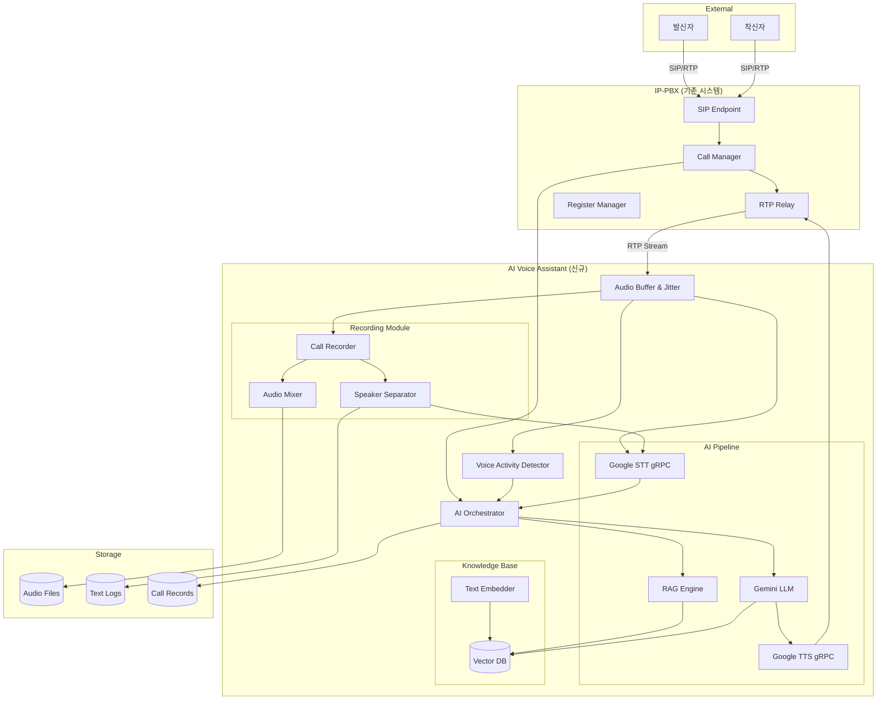
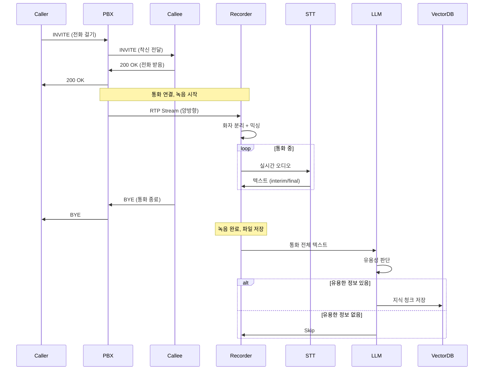
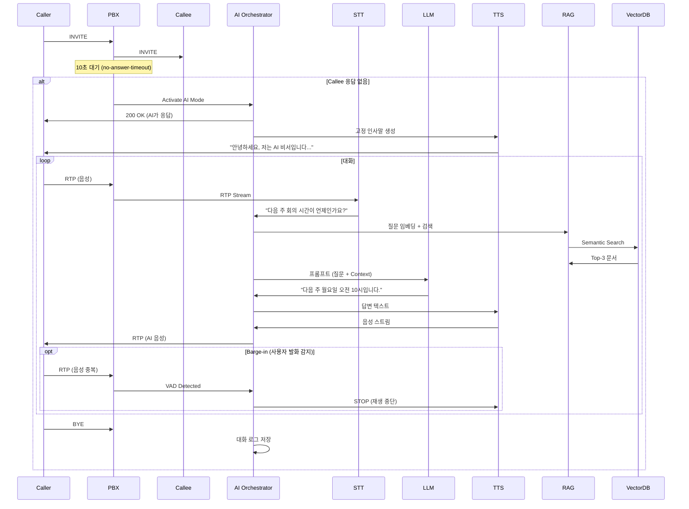
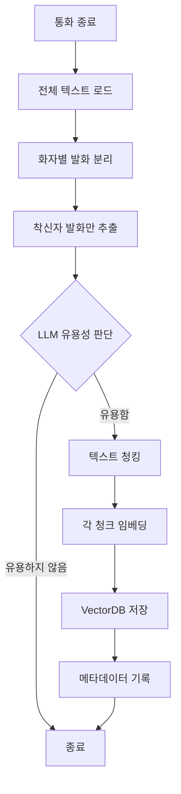
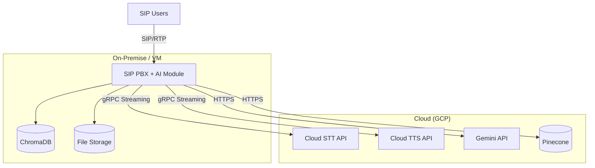

# AI 실시간 통화 응대 시스템 - 아키텍처 문서

## 📋 문서 정보

| 항목 | 내용 |
|-----|------|
| **문서 버전** | v1.0 |
| **작성일** | 2025-01-05 |
| **작성자** | Winston (Architect) |
| **프로젝트명** | AI Voice Assistant Extension for SIP PBX |
| **상태** | Draft |

### 변경 이력

| 날짜 | 버전 | 설명 | 작성자 |
|-----|------|------|-------|
| 2025-01-05 | v1.0 | 초기 아키텍처 문서 작성 | Winston |

---

## 1. 개요 (Overview)

### 1.1 프로젝트 배경

본 프로젝트는 **현재 운영 중인 IP-PBX 시스템**을 확장하여, 착신자가 부재 중일 때 AI가 자동으로 전화를 받아 응대하는 **지능형 음성 비서 시스템**을 구축합니다.

### 1.2 핵심 목표

#### 🎯 일반 통화 시나리오
1. **통화 녹음 및 텍스트 변환**
   - 양방향 RTP 스트림을 화자 분리하여 STT 변환
   - 믹싱된 오디오 파일 + 텍스트 파일 저장
   
2. **지식 베이스 자동 구축**
   - LLM(Gemini)이 통화 내용 분석
   - 유용한 정보 판단 시 Vector DB에 자동 저장
   - 착신자의 말하는 내용을 AI 보이스봇의 지식으로 활용

#### 🤖 AI 보이스봇 시나리오
1. **부재중 자동 응답**
   - 착신자가 10초 이내 응답 없을 시 PBX가 직접 호 수신
   - 고정 인사말로 응대 시작 (설정 가능)

2. **실시간 대화 처리**
   - RTP ↔ Google gRPC 스트리밍 직접 연결 (최소 지연)
   - VAD 기반 Barge-in 지원 (사용자 발화 시 TTS 즉시 중단)
   - RAG 기반 지능형 답변 생성

3. **통화 기록**
   - AI 보이스봇 응대 내용도 녹음 및 로깅

### 1.3 기술 스택 요약

| 레이어 | 기술 |
|-------|-----|
| **기존 PBX** | Python 3.11+, asyncio, SIP/RTP |
| **AI 음성** | Google Cloud STT/TTS (gRPC Streaming) |
| **LLM** | Google Gemini (Text Generation) |
| **Vector DB** | Pinecone / ChromaDB |
| **오디오 처리** | PyAudio, pydub, ffmpeg |
| **오케스트레이션** | Python asyncio, aiohttp |

---

## 2. 시스템 아키텍처

### 2.1 High-Level 아키텍처



### 2.2 시스템 컴포넌트

#### 2.2.1 기존 PBX 컴포넌트 (확장)

**Call Manager (확장)**
- **기존 기능**: SIP B2BUA, 통화 라우팅
- **신규 기능**: 
  - 부재중 타임아웃 감지 (10초 설정 가능)
  - AI 보이스봇 모드 활성화 플래그
  - RTP 스트림을 AI Orchestrator로 라우팅

**RTP Relay (확장)**
- **기존 기능**: RTP 패킷 중계
- **신규 기능**:
  - RTP 패킷을 AI 모듈로 복제 (Tee)
  - 양방향 스트림 분리 (caller/callee)
  - AI 응답 RTP 주입

#### 2.2.2 AI Orchestrator (신규)

**책임:**
- 전체 AI 통화 흐름 제어
- 상태 머신 관리 (IDLE → GREETING → LISTENING → THINKING → SPEAKING)
- VAD 이벤트 기반 Barge-in 처리
- 고정 인사말 재생
- RAG 검색 및 LLM 프롬프트 조립

**주요 인터페이스:**
```python
class AIOrchestrator:
    async def handle_call(self, call_id: str, caller_info: CallerInfo)
    async def on_audio_packet(self, rtp_packet: RTPPacket)
    async def on_vad_detected(self, speech_detected: bool)
    async def on_stt_result(self, text: str, is_final: bool)
    async def generate_response(self, user_text: str) -> str
    async def play_greeting(self)
    async def stop_speaking()  # Barge-in
```

**의존성:**
- Google STT gRPC Client
- Google TTS gRPC Client
- Gemini LLM Client
- RAG Engine
- VectorDB Client
- Call Recorder

#### 2.2.3 Audio Buffer & Jitter (신규)

**책임:**
- UDP RTP 패킷을 TCP gRPC 스트림으로 변환
- 지터 버퍼링 (20-60ms)
- 샘플레이트 변환 (8kHz telephony → 16kHz STT)
- 패킷 순서 재정렬 및 손실 보정

**기술 스택:**
- `asyncio.Queue` 기반 버퍼
- `audioop` / `pydub` 샘플레이트 변환
- RTP sequence number 기반 재정렬

#### 2.2.4 Voice Activity Detector (VAD) (신규)

**책임:**
- 실시간 음성 활동 감지
- Barge-in 트리거
- STT 문장 경계 보조

**기술 옵션:**
1. **WebRTC VAD** (경량, 빠름) ⭐ 추천
2. **Silero VAD** (정확도 높음, ONNX)
3. **Google STT 내장 VAD** (별도 모듈 불필요)

**구현:**
```python
from webrtcvad import Vad

vad = Vad(mode=3)  # 0-3, 3이 가장 민감
is_speech = vad.is_speech(audio_frame, sample_rate=16000)
```

#### 2.2.5 Call Recorder (신규)

**책임:**
- 양방향 RTP 스트림 녹음
- 화자 분리 (caller/callee 별도 채널)
- 오디오 믹싱 (단일 파일)
- STT 텍스트 로그 저장

**출력 파일:**
```
/recordings/{call_id}/
  ├── mixed.wav           # 믹싱된 오디오
  ├── caller.wav          # 발신자 오디오
  ├── callee.wav          # 착신자 오디오 (or AI)
  ├── transcript.txt      # 전체 대화 텍스트
  └── metadata.json       # 통화 메타데이터
```

**기술:**
- `ffmpeg` / `pydub` 오디오 처리
- 실시간 스트리밍 녹음 (메모리 효율)

#### 2.2.6 Google STT gRPC Client (신규)

**책임:**
- RTP 오디오 → 텍스트 실시간 변환
- Streaming Recognition
- Interim/Final 결과 구분

**설정:**
```python
recognition_config = {
    "encoding": "LINEAR16",
    "sample_rate_hertz": 16000,
    "language_code": "ko-KR",
    "model": "telephony",  # 전화 음성 최적화
    "use_enhanced": True,
    "enable_automatic_punctuation": True,
    "enable_word_time_offsets": True
}
```

**API:**
- `speech.StreamingRecognize` (gRPC Bidirectional Streaming)

#### 2.2.7 Google TTS gRPC Client (신규)

**책임:**
- 텍스트 → 음성 실시간 생성
- Neural2 음성 모델 사용
- RTP 형식으로 스트리밍 출력

**설정:**
```python
voice_config = {
    "language_code": "ko-KR",
    "name": "ko-KR-Neural2-A",  # 여성 목소리
    "ssml_gender": "FEMALE"
}

audio_config = {
    "audio_encoding": "LINEAR16",
    "sample_rate_hertz": 16000,
    "speaking_rate": 1.0,
    "pitch": 0.0
}
```

**API:**
- `texttospeech.StreamingSynthesize` (gRPC)

#### 2.2.8 Gemini LLM Client (신규)

**책임:**
- 사용자 의도 파악
- 통화 내용 유용성 판단
- RAG 기반 답변 생성
- 대화 컨텍스트 유지

**프롬프트 구조:**
```
System: 당신은 {착신자 이름}의 AI 비서입니다. 
발신자의 질문에 친절하고 정확하게 답변하세요.

Context (from RAG):
{관련 문서 3개}

Conversation History:
User: 안녕하세요
AI: 안녕하세요, 무엇을 도와드릴까요?
User: {현재 사용자 질문}

Instructions:
1. Context를 기반으로 답변
2. 모르면 "확실하지 않습니다"라고 솔직히 답변
3. 자연스럽고 간결하게 (1-2 문장)
```

**API:**
- `generativeai.GenerativeModel("gemini-pro")`

#### 2.2.9 RAG Engine (신규)

**책임:**
- 사용자 질문 임베딩
- VectorDB 시맨틱 검색
- Top-K 관련 문서 검색 (K=3)
- 컨텍스트 재순위화 (Reranking)

**워크플로우:**
```python
async def search_knowledge(query: str) -> List[Document]:
    # 1. 질문 임베딩
    query_embedding = await embedder.embed(query)
    
    # 2. Vector 검색
    results = await vector_db.search(
        vector=query_embedding,
        top_k=5,
        filter={"owner": callee_id}  # 착신자 전용 지식
    )
    
    # 3. Reranking (선택)
    reranked = rerank_by_relevance(query, results)
    
    return reranked[:3]
```

#### 2.2.10 Vector DB (신규)

**책임:**
- 통화 내용 임베딩 저장
- 시맨틱 검색
- 사용자별 네임스페이스 관리

**옵션 비교:**

| 항목 | Pinecone | ChromaDB | Qdrant |
|-----|----------|----------|--------|
| **배포** | 클라우드 (SaaS) | 로컬/클라우드 | 로컬/클라우드 |
| **확장성** | ⭐⭐⭐⭐⭐ | ⭐⭐⭐ | ⭐⭐⭐⭐ |
| **가격** | 유료 (무료 티어) | 오픈소스 무료 | 오픈소스 무료 |
| **설정** | 쉬움 | 매우 쉬움 | 보통 |
| **추천** | 프로덕션 | 개발/프로토타입 | 프로덕션 |

**⭐ 추천: ChromaDB** (초기 개발) → **Pinecone** (프로덕션)

**스키마:**
```python
{
    "id": "call_123_chunk_5",
    "embedding": [0.1, 0.2, ...],  # 1536-dim (OpenAI) or 768-dim (Sentence Transformers)
    "metadata": {
        "call_id": "call_123",
        "speaker": "callee",
        "timestamp": "2025-01-05T10:30:00Z",
        "owner": "user_1004",
        "text": "다음 주 월요일 회의는 오전 10시입니다.",
        "chunk_index": 5
    }
}
```

#### 2.2.11 Text Embedder (신규)

**책임:**
- 텍스트 → 벡터 임베딩 변환
- 통화 내용 청킹 (Chunking)

**옵션:**

1. **OpenAI Embeddings** (`text-embedding-3-small`)
   - 차원: 1536
   - 품질: ⭐⭐⭐⭐⭐
   - 비용: $0.02 / 1M tokens
   
2. **Sentence Transformers** (`paraphrase-multilingual-mpnet-base-v2`)
   - 차원: 768
   - 품질: ⭐⭐⭐⭐
   - 비용: 무료 (로컬)
   - **⭐ 추천** (한국어 지원 우수)

3. **Google Vertex AI Embeddings**
   - Gemini 통합 용이

**청킹 전략:**
```python
# 시맨틱 청킹 (문장 기준)
from langchain.text_splitter import RecursiveCharacterTextSplitter

splitter = RecursiveCharacterTextSplitter(
    chunk_size=500,
    chunk_overlap=50,
    separators=["\n\n", "\n", ". ", " "]
)
chunks = splitter.split_text(transcript)
```

---

## 3. 데이터 모델

### 3.1 Call Session (확장)

```python
@dataclass
class CallSession:
    call_id: str
    caller: str
    callee: str
    start_time: datetime
    end_time: Optional[datetime]
    state: CallState
    
    # 신규 필드
    is_ai_handled: bool = False
    ai_activated_at: Optional[datetime] = None
    no_answer_timeout: int = 10  # 초
    recording_path: Optional[str] = None
    transcript_path: Optional[str] = None
```

### 3.2 AI Conversation

```python
@dataclass
class AIConversation:
    session_id: str
    call_id: str
    messages: List[ConversationMessage]
    context_documents: List[Document]
    started_at: datetime
    ended_at: Optional[datetime]
    
@dataclass
class ConversationMessage:
    role: Literal["user", "assistant", "system"]
    content: str
    timestamp: datetime
    audio_file: Optional[str] = None
```

### 3.3 Recording Metadata

```python
@dataclass
class RecordingMetadata:
    call_id: str
    recording_id: str
    start_time: datetime
    duration_seconds: float
    
    # 파일 경로
    mixed_audio_path: str
    caller_audio_path: str
    callee_audio_path: str
    transcript_path: str
    
    # 통계
    total_turns: int
    caller_speak_time: float
    callee_speak_time: float
    
    # AI 플래그
    is_ai_conversation: bool
    knowledge_extracted: bool
```

### 3.4 Knowledge Document

```python
@dataclass
class KnowledgeDocument:
    id: str
    source_call_id: str
    owner_user_id: str
    text: str
    embedding: List[float]
    
    # 메타데이터
    extracted_at: datetime
    speaker: Literal["caller", "callee"]
    confidence_score: float  # LLM 유용성 판단 점수
    
    # 분류
    category: Optional[str]  # "약속", "정보", "지시" 등
    keywords: List[str]
```

---

## 4. 핵심 워크플로우

### 4.1 일반 통화 시나리오 (녹음 및 지식 추출)



### 4.2 AI 보이스봇 시나리오 (부재중 응답)



### 4.3 지식 추출 워크플로우



**LLM 유용성 판단 프롬프트:**
```
다음 통화 내용을 분석하여 향후 AI 비서가 활용할 수 있는 
유용한 정보가 있는지 판단하세요.

유용한 정보 예시:
- 약속 일정
- 연락처 정보
- 업무 지시사항
- 자주 묻는 질문에 대한 답변
- 개인 선호도

통화 내용:
{transcript}

출력 형식:
{
  "is_useful": true/false,
  "confidence": 0.0-1.0,
  "reason": "판단 이유",
  "extracted_info": [
    {
      "text": "추출할 텍스트",
      "category": "약속|정보|지시|기타",
      "keywords": ["키워드1", "키워드2"]
    }
  ]
}
```

---

## 5. 기술 스택 상세

### 5.1 전체 기술 스택

| 카테고리 | 기술 | 버전 | 용도 | 선정 이유 |
|---------|------|------|------|----------|
| **언어** | Python | 3.11+ | 전체 시스템 | 기존 PBX와 통일, AI 라이브러리 풍부 |
| **비동기** | asyncio | 3.11+ | 이벤트 루프 | 실시간 처리, 높은 동시성 |
| **SIP/RTP** | 기존 구현 | - | 통신 프로토콜 | 기존 PBX 활용 |
| **STT** | Google Cloud Speech-to-Text | v2 | 음성→텍스트 | 한국어 우수, 전화 모델, Streaming |
| **TTS** | Google Cloud Text-to-Speech | v2 | 텍스트→음성 | 자연스러운 Neural2, Streaming |
| **LLM** | Google Gemini Pro | 1.5 | 대화 생성 | 무료 티어, 빠른 응답, 한국어 |
| **Embedding** | Sentence Transformers | 2.2+ | 텍스트 임베딩 | 무료, 로컬, 한국어 우수 |
| **Vector DB** | ChromaDB → Pinecone | 0.4+ / - | 벡터 검색 | 개발 용이 → 프로덕션 확장성 |
| **오디오** | pydub, ffmpeg | 0.25+ / 6.0+ | 오디오 처리 | 범용성, 성능 |
| **VAD** | webrtcvad | 2.0+ | 음성 감지 | 경량, 빠름, 검증됨 |
| **gRPC** | grpcio | 1.60+ | Google API 통신 | 양방향 스트리밍, 저지연 |
| **HTTP** | aiohttp | 3.9+ | 비동기 HTTP | 기존 PBX와 통일 |
| **설정** | Pydantic, PyYAML | 2.5+ / 6.0+ | 설정 관리 | 기존 PBX와 통일 |
| **모니터링** | Prometheus | - | 메트릭 수집 | 기존 PBX 통합 |
| **로깅** | structlog | 24.1+ | 구조화 로그 | 기존 PBX와 통일 |
| **테스트** | pytest, pytest-asyncio | 7.4+ | 테스팅 | 기존 PBX와 통일 |

### 5.2 Google Cloud 서비스

#### STT (Speech-to-Text)

**API:** `google-cloud-speech v2`

**모델:**
- `telephony` - 전화 음성 최적화
- `latest_long` - 긴 오디오 (백업)

**주요 설정:**
```python
streaming_config = speech.StreamingRecognitionConfig(
    config=speech.RecognitionConfig(
        encoding=speech.RecognitionConfig.AudioEncoding.LINEAR16,
        sample_rate_hertz=16000,
        language_code="ko-KR",
        model="telephony",
        use_enhanced=True,
        enable_automatic_punctuation=True,
    ),
    interim_results=True,  # 중간 결과
    single_utterance=False,  # 연속 인식
)
```

**비용:**
- Standard 모델: $0.006 / 15초
- Enhanced 모델: $0.009 / 15초
- 월 60분 무료

#### TTS (Text-to-Speech)

**API:** `google-cloud-texttospeech v2`

**음성:**
- `ko-KR-Neural2-A` (여성, 자연스러움) ⭐ 추천
- `ko-KR-Neural2-B` (남성)
- `ko-KR-Neural2-C` (남성, 공식적)

**주요 설정:**
```python
synthesis_input = texttospeech.SynthesisInput(text=text)
voice = texttospeech.VoiceSelectionParams(
    language_code="ko-KR",
    name="ko-KR-Neural2-A",
    ssml_gender=texttospeech.SsmlVoiceGender.FEMALE
)
audio_config = texttospeech.AudioConfig(
    audio_encoding=texttospeech.AudioEncoding.LINEAR16,
    sample_rate_hertz=16000,
    speaking_rate=1.0,  # 속도
    pitch=0.0,  # 음높이
)
```

**비용:**
- Neural2: $16 / 1M 문자
- 월 100만 문자 무료

#### Gemini (LLM)

**API:** `google-generativeai`

**모델:**
- `gemini-pro` - 텍스트 전용 ⭐ 추천
- `gemini-pro-vision` - 이미지 (미사용)

**주요 설정:**
```python
model = genai.GenerativeModel('gemini-pro')
generation_config = {
    "temperature": 0.7,  # 창의성
    "top_p": 0.8,
    "top_k": 40,
    "max_output_tokens": 200,  # 짧은 답변
}
```

**비용:**
- 무료 티어: 60 requests/minute
- 유료: $0.00025 / 1K characters

### 5.3 Vector DB 비교 및 선택

#### 옵션 1: ChromaDB (개발/프로토타입) ⭐

**장점:**
- 초기 설정 5분 이내
- 로컬 실행 (SQLite)
- Python 네이티브
- 무료

**단점:**
- 확장성 제한
- 고가용성 없음

**설치:**
```bash
pip install chromadb
```

**사용:**
```python
import chromadb

client = chromadb.Client()
collection = client.create_collection("knowledge_base")

# 저장
collection.add(
    embeddings=[[0.1, 0.2, ...]],
    documents=["다음 주 회의는 10시입니다"],
    metadatas=[{"owner": "user_1004"}],
    ids=["doc1"]
)

# 검색
results = collection.query(
    query_embeddings=[[0.15, 0.22, ...]],
    n_results=3
)
```

#### 옵션 2: Pinecone (프로덕션) ⭐⭐

**장점:**
- 자동 확장
- 고가용성 (99.9% SLA)
- 빠른 검색 (<100ms)
- 관리형 서비스

**단점:**
- 유료 (무료 티어: 1 index, 1GB)
- 외부 의존성

**설치:**
```bash
pip install pinecone-client
```

**사용:**
```python
import pinecone

pinecone.init(api_key="YOUR_API_KEY", environment="us-west1-gcp")
index = pinecone.Index("knowledge-base")

# 저장
index.upsert(vectors=[
    ("doc1", [0.1, 0.2, ...], {"owner": "user_1004", "text": "..."})
])

# 검색
results = index.query(
    vector=[0.15, 0.22, ...],
    top_k=3,
    filter={"owner": "user_1004"}
)
```

**⭐ 권장 전략:**
1. **Phase 1 (개발):** ChromaDB
2. **Phase 2 (프로덕션):** Pinecone

---

## 6. 시스템 설정

### 6.1 설정 파일 구조 (config/ai_config.yaml)

```yaml
ai_voicebot:
  enabled: true
  
  # 부재중 설정
  no_answer_timeout: 10  # 초
  
  # 고정 인사말
  greeting_message: "안녕하세요, 저는 AI 비서입니다. 무엇을 도와드릴까요?"
  
  # Google Cloud
  google_cloud:
    project_id: "your-gcp-project"
    credentials_path: "credentials/gcp-key.json"
    
    stt:
      model: "telephony"
      language_code: "ko-KR"
      enable_enhanced: true
      
    tts:
      voice_name: "ko-KR-Neural2-A"
      speaking_rate: 1.0
      pitch: 0.0
      
    gemini:
      model: "gemini-pro"
      temperature: 0.7
      max_output_tokens: 200
  
  # Vector DB
  vector_db:
    provider: "chromadb"  # chromadb | pinecone
    
    # ChromaDB 설정
    chromadb:
      persist_directory: "./data/chromadb"
      
    # Pinecone 설정 (프로덕션)
    pinecone:
      api_key: "${PINECONE_API_KEY}"
      environment: "us-west1-gcp"
      index_name: "knowledge-base"
      dimension: 768  # Sentence Transformers
  
  # Embedding
  embedding:
    model: "paraphrase-multilingual-mpnet-base-v2"
    dimension: 768
    batch_size: 32
    
  # RAG
  rag:
    top_k: 3
    similarity_threshold: 0.7
    reranking_enabled: false
    
  # 녹음
  recording:
    enabled: true
    output_dir: "./recordings"
    format: "wav"
    sample_rate: 16000
    
    # 지식 추출
    knowledge_extraction:
      enabled: true
      min_confidence: 0.7  # LLM 판단 최소 신뢰도
      chunk_size: 500
      chunk_overlap: 50
  
  # VAD
  vad:
    enabled: true
    mode: 3  # 0-3, 3이 가장 민감
    frame_duration_ms: 30
    
  # Barge-in
  barge_in:
    enabled: true
    vad_threshold: 0.5
    
  # 오디오 버퍼
  audio_buffer:
    jitter_buffer_ms: 60
    max_buffer_size: 100  # 패킷
    
  # 로깅
  logging:
    log_conversations: true
    log_audio: true
    log_level: "INFO"
```

### 6.2 환경 변수

```.env
# Google Cloud
GOOGLE_APPLICATION_CREDENTIALS=./credentials/gcp-key.json
GCP_PROJECT_ID=your-gcp-project

# Pinecone (프로덕션)
PINECONE_API_KEY=your-pinecone-key
PINECONE_ENVIRONMENT=us-west1-gcp

# OpenAI (임베딩 대안)
OPENAI_API_KEY=your-openai-key
```

---

## 7. 프로젝트 구조

```
sip-pbx/
├── src/
│   ├── ai_voicebot/                    # 🆕 AI 모듈
│   │   ├── __init__.py
│   │   ├── orchestrator.py             # AI Orchestrator
│   │   ├── audio_buffer.py             # Audio Buffer & Jitter
│   │   ├── vad_detector.py             # Voice Activity Detector
│   │   │
│   │   ├── recording/                  # 녹음 모듈
│   │   │   ├── recorder.py             # Call Recorder
│   │   │   ├── mixer.py                # Audio Mixer
│   │   │   └── separator.py            # Speaker Separator
│   │   │
│   │   ├── ai_pipeline/                # AI 파이프라인
│   │   │   ├── stt_client.py           # Google STT gRPC
│   │   │   ├── tts_client.py           # Google TTS gRPC
│   │   │   ├── llm_client.py           # Gemini LLM
│   │   │   └── rag_engine.py           # RAG Engine
│   │   │
│   │   ├── knowledge/                  # 지식 베이스
│   │   │   ├── vector_db.py            # Vector DB 추상화
│   │   │   ├── chromadb_client.py      # ChromaDB 구현
│   │   │   ├── pinecone_client.py      # Pinecone 구현
│   │   │   ├── embedder.py             # Text Embedder
│   │   │   └── knowledge_extractor.py  # 지식 추출 로직
│   │   │
│   │   └── models/                     # AI 데이터 모델
│   │       ├── conversation.py
│   │       ├── knowledge.py
│   │       └── recording.py
│   │
│   ├── sip_core/                       # 기존 PBX (확장)
│   │   ├── call_manager.py             # ✏️ AI 모드 추가
│   │   ├── sip_endpoint.py
│   │   └── ...
│   │
│   ├── media/                          # 기존 미디어 (확장)
│   │   ├── rtp_relay.py                # ✏️ AI 모듈 연동
│   │   ├── session_manager.py
│   │   └── ...
│   │
│   └── main.py                         # ✏️ AI 모듈 초기화
│
├── config/
│   ├── config.yaml                     # 기존 설정
│   └── ai_config.yaml                  # 🆕 AI 설정
│
├── credentials/                        # 🆕 인증 정보
│   ├── gcp-key.json                    # Google Cloud 키
│   └── .gitignore                      # 인증 파일 제외
│
├── recordings/                         # 🆕 녹음 파일
│   └── {call_id}/
│       ├── mixed.wav
│       ├── caller.wav
│       ├── callee.wav
│       ├── transcript.txt
│       └── metadata.json
│
├── data/                               # 🆕 데이터 저장
│   ├── chromadb/                       # ChromaDB 데이터
│   └── knowledge/                      # 지식 백업
│
├── tests/
│   ├── ai_voicebot/                    # 🆕 AI 테스트
│   │   ├── test_orchestrator.py
│   │   ├── test_stt_client.py
│   │   ├── test_rag_engine.py
│   │   └── ...
│   └── ...
│
├── docs/
│   ├── architecture.md                 # 기존 아키텍처
│   └── ai-voicebot-architecture.md     # 🆕 이 문서
│
├── requirements.txt                    # ✏️ AI 패키지 추가
└── README.md                           # ✏️ AI 기능 안내
```

---

## 8. 핵심 코드 구조

### 8.1 AI Orchestrator (핵심)

```python
# src/ai_voicebot/orchestrator.py

import asyncio
from enum import Enum
from typing import Optional
from .audio_buffer import AudioBuffer
from .vad_detector import VADDetector
from .ai_pipeline.stt_client import STTClient
from .ai_pipeline.tts_client import TTSClient
from .ai_pipeline.llm_client import LLMClient
from .ai_pipeline.rag_engine import RAGEngine

class AIState(Enum):
    IDLE = "idle"
    GREETING = "greeting"
    LISTENING = "listening"
    THINKING = "thinking"
    SPEAKING = "speaking"
    ENDED = "ended"

class AIOrchestrator:
    def __init__(self, config):
        self.config = config
        self.state = AIState.IDLE
        
        # 컴포넌트 초기화
        self.audio_buffer = AudioBuffer(config.audio_buffer)
        self.vad = VADDetector(config.vad)
        self.stt = STTClient(config.google_cloud.stt)
        self.tts = TTSClient(config.google_cloud.tts)
        self.llm = LLMClient(config.google_cloud.gemini)
        self.rag = RAGEngine(config.rag, config.vector_db)
        
        # 대화 상태
        self.conversation_history = []
        self.current_user_speech = ""
        self.is_speaking = False
        
    async def handle_call(self, call_id: str, caller_info: dict):
        """AI 통화 처리 메인 로직"""
        self.state = AIState.GREETING
        
        # 1. 고정 인사말 재생
        await self.play_greeting()
        
        # 2. 대화 루프 시작
        self.state = AIState.LISTENING
        
        # STT 스트리밍 시작
        asyncio.create_task(self.stt_stream_task())
        
        # TTS 재생 태스크
        self.tts_task = None
        
    async def on_audio_packet(self, rtp_packet):
        """RTP 패킷 수신"""
        # 버퍼에 추가
        await self.audio_buffer.add_packet(rtp_packet)
        
        # VAD 검사
        audio_frame = await self.audio_buffer.get_frame()
        is_speech = self.vad.detect(audio_frame)
        
        if is_speech and self.state == AIState.SPEAKING:
            # Barge-in: 사용자 발화 감지, TTS 중단
            await self.stop_speaking()
            self.state = AIState.LISTENING
            
        # STT로 전달
        await self.stt.send_audio(audio_frame)
        
    async def on_stt_result(self, text: str, is_final: bool):
        """STT 결과 수신"""
        if not is_final:
            # Interim result
            self.current_user_speech = text
            return
            
        # Final result
        user_text = text
        self.conversation_history.append({
            "role": "user",
            "content": user_text
        })
        
        # 답변 생성
        await self.generate_and_speak_response(user_text)
        
    async def generate_and_speak_response(self, user_text: str):
        """답변 생성 및 재생"""
        self.state = AIState.THINKING
        
        # 1. RAG 검색
        context_docs = await self.rag.search(user_text)
        
        # 2. LLM 프롬프트 조립
        prompt = self._build_prompt(user_text, context_docs)
        
        # 3. LLM 호출
        response_text = await self.llm.generate(prompt)
        
        # 4. 대화 기록
        self.conversation_history.append({
            "role": "assistant",
            "content": response_text
        })
        
        # 5. TTS 재생
        await self.speak(response_text)
        
    async def speak(self, text: str):
        """TTS 음성 재생"""
        self.state = AIState.SPEAKING
        self.is_speaking = True
        
        # TTS 스트리밍 생성
        audio_stream = await self.tts.synthesize_stream(text)
        
        # RTP로 전송
        async for audio_chunk in audio_stream:
            if not self.is_speaking:  # Barge-in 체크
                break
            await self.send_rtp(audio_chunk)
            
        self.is_speaking = False
        self.state = AIState.LISTENING
        
    async def stop_speaking(self):
        """TTS 재생 중단 (Barge-in)"""
        self.is_speaking = False
        await self.tts.stop()
        
    async def play_greeting(self):
        """고정 인사말 재생"""
        greeting_text = self.config.greeting_message
        await self.speak(greeting_text)
        
    def _build_prompt(self, user_text: str, context_docs: list) -> str:
        """LLM 프롬프트 조립"""
        context_str = "\n\n".join([
            f"- {doc.text}" for doc in context_docs
        ])
        
        history_str = "\n".join([
            f"{msg['role']}: {msg['content']}"
            for msg in self.conversation_history[-5:]  # 최근 5턴
        ])
        
        prompt = f"""당신은 AI 비서입니다. 다음 정보를 기반으로 답변하세요.

관련 정보:
{context_str}

대화 이력:
{history_str}
User: {user_text}

답변 (1-2 문장, 친절하고 간결하게):"""
        
        return prompt
```

### 8.2 Call Manager 확장

```python
# src/sip_core/call_manager.py (기존 코드 확장)

from ..ai_voicebot.orchestrator import AIOrchestrator

class CallManager:
    def __init__(self, config):
        # 기존 초기화
        ...
        
        # AI 모듈 초기화
        if config.ai_voicebot.enabled:
            self.ai_orchestrator = AIOrchestrator(config.ai_voicebot)
        else:
            self.ai_orchestrator = None
            
        self.no_answer_timeout = config.ai_voicebot.no_answer_timeout
        
    async def handle_invite(self, request):
        """INVITE 처리 (확장)"""
        caller = request.headers["From"]
        callee = request.headers["To"]
        
        # 기존 로직: callee에게 INVITE 전달
        await self.send_invite_to_callee(callee, request)
        
        # 🆕 타이머 시작: no-answer-timeout
        timeout_task = asyncio.create_task(
            self._wait_for_answer(request, timeout=self.no_answer_timeout)
        )
        
    async def _wait_for_answer(self, request, timeout: int):
        """부재중 타이머"""
        await asyncio.sleep(timeout)
        
        session = self.get_session(request.call_id)
        
        if session.state == CallState.RINGING:
            # 10초 동안 응답 없음 → AI 모드 활성화
            logger.info(f"No answer timeout, activating AI mode: {request.call_id}")
            await self._activate_ai_mode(session)
            
    async def _activate_ai_mode(self, session):
        """AI 보이스봇 활성화"""
        if not self.ai_orchestrator:
            # AI 비활성화 상태 → 480 Temporarily Unavailable
            await self.send_response(session, 480, "Temporarily Unavailable")
            return
            
        # 1. callee에게 보낸 INVITE CANCEL
        await self.send_cancel_to_callee(session)
        
        # 2. caller에게 200 OK 응답 (PBX가 직접 응답)
        await self.send_200_ok_to_caller(session)
        
        # 3. RTP 세션 설정 (PBX ↔ Caller)
        await self.setup_rtp_session(session)
        
        # 4. AI Orchestrator에게 호 전달
        await self.ai_orchestrator.handle_call(
            call_id=session.call_id,
            caller_info={
                "caller": session.caller,
                "callee": session.callee,
            }
        )
        
        # 5. RTP를 AI로 라우팅
        self.rtp_relay.set_ai_mode(session.call_id, self.ai_orchestrator)
```

### 8.3 RTP Relay 확장

```python
# src/media/rtp_relay.py (기존 코드 확장)

class RTPRelay:
    def __init__(self):
        # 기존 초기화
        ...
        self.ai_sessions = {}  # call_id -> AIOrchestrator
        
    def set_ai_mode(self, call_id: str, ai_orchestrator):
        """AI 모드 활성화"""
        self.ai_sessions[call_id] = ai_orchestrator
        
    async def handle_rtp_packet(self, packet: RTPPacket):
        """RTP 패킷 처리 (확장)"""
        # 기존 로직: Bypass 모드 relay
        ...
        
        # 🆕 AI 모드 체크
        if packet.call_id in self.ai_sessions:
            ai = self.ai_sessions[packet.call_id]
            
            # Caller → PBX → AI
            if packet.direction == "caller_to_pbx":
                await ai.on_audio_packet(packet)
                
            # AI → PBX → Caller는 AI Orchestrator에서 직접 전송
```

---

## 9. 배포 및 운영

### 9.1 배포 아키텍처



**권장 배포 환경:**
- **개발**: 로컬 VM + ChromaDB + Google Cloud APIs
- **프로덕션**: Kubernetes + Pinecone + Google Cloud APIs

### 9.2 리소스 요구사항

| 컴포넌트 | CPU | 메모리 | 디스크 | 네트워크 |
|---------|-----|-------|-------|---------|
| **PBX (기존)** | 2 Core | 2GB | 10GB | 100Mbps |
| **AI Module** | 2 Core | 4GB | 50GB | 100Mbps |
| **ChromaDB** | 1 Core | 2GB | 100GB | - |
| **합계** | 4-6 Core | 8GB | 160GB | 100Mbps |

**예상 부하 (100 동시 통화 기준):**
- CPU: 50-70%
- 메모리: 6-7GB
- 네트워크: 50Mbps (outbound to Google Cloud)

### 9.3 모니터링

#### 신규 Prometheus 메트릭

```python
# AI 관련 메트릭
ai_active_conversations = Gauge('ai_active_conversations', 'Active AI conversations')
ai_conversation_duration = Histogram('ai_conversation_duration_seconds', 'AI conversation duration')
ai_response_time = Histogram('ai_response_time_seconds', 'AI response generation time')

# Google Cloud API
stt_latency = Histogram('stt_latency_seconds', 'STT API latency')
tts_latency = Histogram('tts_latency_seconds', 'TTS API latency')
llm_latency = Histogram('llm_latency_seconds', 'LLM API latency')

# Vector DB
vector_search_latency = Histogram('vector_search_latency_seconds', 'Vector search latency')
knowledge_documents_total = Gauge('knowledge_documents_total', 'Total knowledge documents')

# 녹음
recordings_total = Counter('recordings_total', 'Total recordings')
knowledge_extracted_total = Counter('knowledge_extracted_total', 'Knowledge extraction count')
```

#### Grafana 대시보드

**패널 추가:**
1. AI 활성 대화 수
2. AI 응답 시간 분포
3. STT/TTS/LLM API 지연시간
4. Vector DB 검색 지연
5. 지식 문서 증가 추이
6. 녹음 파일 저장 상태

### 9.4 로깅

```python
# 구조화 로그 예시
logger.info("ai_conversation_started", 
    call_id=call_id,
    caller=caller,
    callee=callee,
    mode="ai_voicebot"
)

logger.info("ai_response_generated",
    call_id=call_id,
    user_text=user_text,
    response_text=response_text,
    context_docs_count=len(context_docs),
    generation_time_ms=gen_time,
    rag_search_time_ms=search_time
)

logger.info("knowledge_extracted",
    call_id=call_id,
    chunks_count=len(chunks),
    confidence=confidence,
    category=category
)
```

---

## 10. 보안 및 프라이버시

### 10.1 데이터 보안

#### 통화 녹음 보호
- **암호화**: 디스크 저장 시 AES-256 암호화
- **접근 제어**: 사용자별 격리 (owner 필터)
- **보관 기간**: 설정 가능 (기본 90일), 자동 삭제

#### Vector DB 보안
- **네임스페이스 격리**: 사용자별 분리
- **쿼리 필터**: `owner` 필드 강제 적용
- **접근 로그**: 모든 검색 기록

#### Google Cloud API
- **Service Account**: 최소 권한 원칙
- **API Key 관리**: Secret Manager 사용
- **감사 로그**: Cloud Audit Logs 활성화

### 10.2 개인정보 보호

#### GDPR/개인정보보호법 준수
1. **명시적 동의**: 녹음 및 AI 처리 동의 필요
2. **투명성**: AI 비서임을 명확히 고지
3. **열람/삭제 권리**: API 제공
4. **데이터 최소화**: 필요한 정보만 저장

#### PII 처리
- **STT 필터링**: 개인식별정보 마스킹 (선택)
- **로그 제외**: 전화번호, 주소 등 민감 정보
- **VectorDB 저장 전**: LLM으로 PII 제거 검토

### 10.3 Prompt Injection 방어

```python
def sanitize_user_input(text: str) -> str:
    """Prompt Injection 방지"""
    # 1. 시스템 명령어 패턴 제거
    text = re.sub(r'(ignore|forget|disregard)\s+(previous|all|above)', '', text, flags=re.IGNORECASE)
    
    # 2. 길이 제한
    text = text[:500]
    
    # 3. 특수 문자 이스케이프
    text = text.replace("{", "").replace("}", "")
    
    return text
```

---

## 11. 성능 최적화

### 11.1 지연시간 최소화

#### 목표 지연시간
- **전체 응답**: <2초 (사용자 질문 → AI 답변 시작)
  - STT: <500ms
  - RAG 검색: <200ms
  - LLM 생성: <1000ms
  - TTS 시작: <300ms

#### 최적화 전략

1. **Streaming 활용**
   - STT: Interim results 즉시 처리
   - TTS: 첫 청크 즉시 재생 (전체 생성 대기 X)
   - LLM: Streaming API 사용 (가능 시)

2. **병렬 처리**
```python
# RAG 검색과 동시에 이전 컨텍스트 로드
context_docs, history = await asyncio.gather(
    rag.search(user_text),
    load_conversation_history(call_id)
)
```

3. **캐싱**
   - 고정 인사말 TTS 미리 생성
   - 자주 묻는 질문 답변 캐싱
   - Embedding 모델 메모리 로드

4. **Connection Pooling**
   - Google Cloud gRPC 연결 재사용
   - Vector DB 연결 풀

### 11.2 비용 최적화

#### Google Cloud 비용 추정 (월 1000 통화 기준)

| 서비스 | 사용량 | 비용 |
|-------|-------|-----|
| **STT** | 1000 통화 × 3분 = 3000분 | $18 |
| **TTS** | 1000 응답 × 100자 = 100K자 | $1.6 |
| **Gemini** | 1000 요청 × 500자 = 500K자 | $0.125 |
| **합계** | - | **~$20/월** |

#### 절약 전략
1. **STT**: Enhanced 모델 필요 시만 사용
2. **TTS**: 고정 응답 미리 생성
3. **Gemini**: 프롬프트 길이 최적화
4. **무료 티어**: 초기 개발 시 활용

### 11.3 확장성

#### 수평 확장 (Scale-out)
- **Stateless 설계**: AI Orchestrator 무상태
- **Session Affinity**: 통화 단위 고정 (Load Balancer)
- **Shared Storage**: 녹음 파일 S3/GCS

#### 수직 확장 (Scale-up)
- CPU: 동시 통화 증가 시 4 → 8 Core
- 메모리: Embedding 모델 로드 시 8 → 16GB

---

## 12. 테스트 전략

### 12.1 단위 테스트

```python
# tests/ai_voicebot/test_orchestrator.py

import pytest
from src.ai_voicebot.orchestrator import AIOrchestrator

@pytest.mark.asyncio
async def test_greeting_playback():
    """고정 인사말 재생 테스트"""
    orchestrator = AIOrchestrator(mock_config)
    
    await orchestrator.handle_call("call_123", {"caller": "1004"})
    
    assert orchestrator.state == AIState.LISTENING
    assert len(orchestrator.conversation_history) == 1
    assert orchestrator.conversation_history[0]["role"] == "assistant"
    
@pytest.mark.asyncio
async def test_barge_in():
    """Barge-in 동작 테스트"""
    orchestrator = AIOrchestrator(mock_config)
    orchestrator.state = AIState.SPEAKING
    orchestrator.is_speaking = True
    
    # 사용자 발화 감지
    await orchestrator.on_vad_detected(speech_detected=True)
    
    assert orchestrator.is_speaking == False
    assert orchestrator.state == AIState.LISTENING
```

### 12.2 통합 테스트

```python
# tests/integration/test_ai_workflow.py

@pytest.mark.integration
async def test_full_ai_conversation():
    """전체 AI 대화 흐름 테스트"""
    # 1. 부재중 호 시뮬레이션
    call = await pbx.receive_invite("1004", "1008")
    
    # 2. 10초 대기 (no-answer-timeout)
    await asyncio.sleep(10)
    
    # 3. AI 모드 활성화 확인
    assert call.is_ai_handled == True
    
    # 4. 사용자 음성 입력
    await call.send_audio(load_audio("test_question.wav"))
    
    # 5. AI 응답 확인
    response = await call.wait_for_response(timeout=5)
    assert response is not None
    assert len(response.text) > 0
```

### 12.3 성능 테스트

```python
# tests/performance/test_latency.py

@pytest.mark.benchmark
async def test_response_latency():
    """응답 지연시간 테스트"""
    orchestrator = AIOrchestrator(config)
    
    start = time.time()
    await orchestrator.generate_and_speak_response("다음 주 회의 시간이 언제인가요?")
    latency = time.time() - start
    
    # 목표: 2초 이내
    assert latency < 2.0
```

---

## 13. 향후 개선 사항 (Roadmap)

### Phase 1: MVP (현재)
- ✅ 기본 AI 보이스봇 구현
- ✅ 녹음 및 지식 추출
- ✅ Google Cloud AI 통합
- ✅ ChromaDB 로컬 개발

### Phase 2: 기능 강화 (3개월)
- 📋 **감정 인식**: STT + 감정 분석
- 📋 **다국어 지원**: 영어, 중국어 추가
- 📋 **통화 요약**: 통화 종료 후 자동 요약
- 📋 **Pinecone 마이그레이션**: 프로덕션 전환

### Phase 3: 고도화 (6개월)
- 📋 **Multi-turn 컨텍스트**: 긴 대화 메모리
- 📋 **Action API**: 일정 등록, 메일 전송 등
- 📋 **Voice Cloning**: 착신자 목소리 학습
- 📋 **Dashboard**: 관리자 UI

### Phase 4: 엔터프라이즈 (12개월)
- 📋 **Fine-tuning LLM**: 도메인 특화 모델
- 📋 **On-premise LLM**: 데이터 주권
- 📋 **A/B Testing**: 응답 품질 개선
- 📋 **Analytics**: 통화 인사이트

---

## 14. 체크리스트

### 14.1 개발 체크리스트

- [ ] **환경 설정**
  - [ ] Google Cloud 프로젝트 생성
  - [ ] Service Account 키 발급
  - [ ] API 활성화 (STT, TTS, Gemini)
  - [ ] ChromaDB 설치
  - [ ] 의존성 설치 (`requirements.txt`)

- [ ] **기존 PBX 확장**
  - [ ] Call Manager: 부재중 타이머 추가
  - [ ] Call Manager: AI 모드 활성화 로직
  - [ ] RTP Relay: AI 모듈 연동

- [ ] **AI 모듈 구현**
  - [ ] AI Orchestrator 핵심 로직
  - [ ] Audio Buffer & Jitter
  - [ ] VAD 통합
  - [ ] STT gRPC Client
  - [ ] TTS gRPC Client
  - [ ] Gemini LLM Client
  - [ ] RAG Engine
  - [ ] Vector DB 추상화
  - [ ] ChromaDB 구현
  - [ ] Text Embedder
  - [ ] Call Recorder
  - [ ] Knowledge Extractor

- [ ] **테스트**
  - [ ] 단위 테스트 (80% 커버리지)
  - [ ] 통합 테스트 (핵심 시나리오)
  - [ ] 성능 테스트 (지연시간 목표)
  - [ ] 부하 테스트 (100 동시 통화)

- [ ] **문서화**
  - [ ] API 문서 (Swagger/OpenAPI)
  - [ ] 운영 매뉴얼
  - [ ] 트러블슈팅 가이드

### 14.2 배포 체크리스트

- [ ] **인프라**
  - [ ] VM/Kubernetes 클러스터 준비
  - [ ] 네트워크 설정 (방화벽, 로드 밸런서)
  - [ ] 저장소 설정 (녹음 파일, ChromaDB)
  - [ ] Secret 관리 (API 키)

- [ ] **모니터링**
  - [ ] Prometheus 메트릭 수집
  - [ ] Grafana 대시보드 생성
  - [ ] 알람 설정 (에러율, 지연시간)
  - [ ] 로그 수집 (ELK/Loki)

- [ ] **보안**
  - [ ] 암호화 키 설정
  - [ ] 접근 제어 정책
  - [ ] 감사 로그 활성화
  - [ ] 개인정보 동의 프로세스

- [ ] **운영**
  - [ ] 백업 정책 수립
  - [ ] 장애 대응 프로세스
  - [ ] 비용 모니터링
  - [ ] 성능 튜닝

---

## 15. FAQ

### Q1: 기존 PBX 사용자에게 영향이 있나요?
**A**: 아니요. AI 기능은 **착신자가 응답하지 않을 때만** 활성화됩니다. 일반 통화는 기존 방식대로 동작합니다.

### Q2: 녹음 파일 저장 용량은?
**A**: 10분 통화 기준:
- Mixed WAV: ~10MB
- Caller/Callee 각 WAV: ~10MB
- 텍스트: ~10KB
- **총 ~30MB/통화**

100 통화/일 = **3GB/일**, **90GB/월**

### Q3: Google Cloud 비용이 걱정됩니다.
**A**: 무료 티어로 시작 가능:
- STT: 월 60분 무료
- TTS: 월 100만 문자 무료
- Gemini: 60 requests/minute 무료

유료 전환 시 월 1000 통화 기준 **~$20**

### Q4: On-premise LLM 사용 가능한가요?
**A**: 네. Ollama + Llama 3 등으로 대체 가능합니다. 단, GPU 필요 (V100 이상 권장)

### Q5: 한국어 성능이 걱정됩니다.
**A**: Google STT/TTS는 한국어 최상위 수준입니다. Gemini도 한국어 우수합니다.

### Q6: Vector DB는 언제 Pinecone으로 전환하나요?
**A**: 
- **개발/프로토타입**: ChromaDB (무료, 간단)
- **프로덕션 (1000+ 통화)**: Pinecone (확장성, SLA)

---

## 16. 참고 자료

### 16.1 Google Cloud 문서
- [Speech-to-Text Streaming](https://cloud.google.com/speech-to-text/docs/streaming-recognize)
- [Text-to-Speech gRPC](https://cloud.google.com/text-to-speech/docs/reference/rpc)
- [Gemini API](https://ai.google.dev/docs)

### 16.2 Vector DB
- [ChromaDB Getting Started](https://docs.trychroma.com/getting-started)
- [Pinecone Python Client](https://docs.pinecone.io/docs/python-client)

### 16.3 오픈소스
- [Sentence Transformers](https://www.sbert.net/)
- [webrtcvad](https://github.com/wiseman/py-webrtcvad)
- [pydub](https://github.com/jiaaro/pydub)

---

## 17. 다음 단계

### 즉시 실행
1. **Google Cloud 설정** (1시간)
   ```bash
   # GCP 프로젝트 생성
   gcloud projects create sip-pbx-ai
   
   # API 활성화
   gcloud services enable speech.googleapis.com
   gcloud services enable texttospeech.googleapis.com
   gcloud services enable generativelanguage.googleapis.com
   
   # Service Account 키 생성
   gcloud iam service-accounts create sip-pbx-ai-sa
   gcloud iam service-accounts keys create credentials/gcp-key.json \
     --iam-account sip-pbx-ai-sa@sip-pbx-ai.iam.gserviceaccount.com
   ```

2. **의존성 설치** (10분)
   ```bash
   pip install google-cloud-speech google-cloud-texttospeech \
               google-generativeai chromadb sentence-transformers \
               webrtcvad pydub
   ```

3. **간단한 STT/TTS 테스트** (30분)
   ```python
   # tests/quick_test_google_apis.py
   from google.cloud import speech, texttospeech
   
   # STT 테스트
   client = speech.SpeechClient()
   # ... 테스트 코드
   
   # TTS 테스트
   client = texttospeech.TextToSpeechClient()
   # ... 테스트 코드
   ```

### 1주차
- AI Orchestrator 기본 구조 구현
- STT/TTS 클라이언트 구현
- 고정 인사말 재생 테스트

### 2주차
- LLM 통합 (Gemini)
- RAG Engine 구현
- ChromaDB 연동

### 3주차
- Call Manager 확장
- RTP Relay 연동
- 통합 테스트

### 4주차
- 녹음 기능 구현
- 지식 추출 로직
- 성능 테스트 및 최적화

---

**문서 작성 완료**

이 아키텍처 문서는 현재 IP-PBX 시스템을 기반으로 AI 실시간 통화 응대 시스템을 확장 구현하기 위한 완전한 기술 청사진입니다.

**질문이 있으시거나 특정 섹션을 더 상세히 설명해드려야 할 부분이 있으면 말씀해주세요!** 🏗️

