# SIP PBX + AI Voice Assistant - 완전한 Backend 아키텍처

## 📋 문서 정보

| 항목 | 내용 |
|-----|------|
| **문서 버전** | v5.1 |
| **최종 업데이트** | 2026-02-19 |
| **작성자** | Winston (Architect) |
| **프로젝트명** | SIP PBX B2BUA + AI Voice Assistant + Frontend Control Center |
| **상태** | Production Ready |

### 변경 이력

| 날짜 | 버전 | 설명 | 작성자 |
|-----|------|------|-------|
| 2025-01-05 | v1.0 | 초기 아키텍처 문서 작성 (AI 보이스봇) | Winston |
| 2025-01-06 | v2.0 | SIP PBX B2BUA 내용 통합, 전체 Backend 통합 문서 | Winston |
| 2026-02-13 | v3.0 | AI 인사말/Capability, Knowledge Extraction v2, AI 호 연결(Transfer) 통합 (섹션 23~25) | AI Assistant |
| 2026-01-29 | v4.0 | AI Outbound Call (목적지향 대화, TaskTracker, OutboundCallManager) 구현 및 통합 (섹션 26) | AI Assistant |
| 2026-02-13 | v5.0 | **멀티테넌트 RAG 아키텍처** - VectorDB 기반 OrganizationInfoManager, owner 필터, 테넌트별 데이터 격리, Frontend 멀티테넌트 지원 (섹션 27) | AI Assistant |
| 2026-02-19 | v5.1 | **TTS→RTP 파이프라인·Phase 타이밍** (4.3.2a), **RAG 부족 시 HITL 대응 플로우** (19.1a) 설계 반영. 참고: docs/reports/TTS_RTP_AND_HITL_DESIGN.md | AI Assistant |

---

## 📌 문서 목적

> **이 문서는 Backend 시스템의 모든 것을 담고 있습니다.**
> 
> - ✅ **SIP PBX B2BUA 코어**: SIP 시그널링, RTP 릴레이, 통화 관리
> - ✅ **AI Voice Assistant**: STT/TTS/LLM, RAG, 지식 베이스
> - ✅ **AI 인사말 + Capability 가이드**: 2-Phase Greeting, VectorDB Capability 관리
> - ✅ **Knowledge Extraction v2**: 멀티스텝 추출 파이프라인, 자동 승인
> - ✅ **AI 호 연결 (Call Transfer)**: B2BUA 3pcc, RTP Bridge, Transfer API
> - ✅ **AI Outbound Call**: 목적지향 대화, TaskTracker, OutboundCallManager, Goal-Oriented LLM
> - ✅ **Backend API Services**: FastAPI Gateway, WebSocket, HITL
> - ✅ **TTS→RTP 파이프라인·Phase 타이밍**: Pipecat 큐잉·변수 정의·Phase1→Phase2 대기 (섹션 4.3.2a)
> - ✅ **RAG 부족 시 HITL 대응**: 모른다 명시 → HITL 요청 → timeout/응답에 따른 문구·종료·피드백 (섹션 19.1a)
> 
> Frontend 관련 내용은 **[Frontend Architecture](frontend-architecture.md)** 문서를 참조하세요.  
> 상세 설계: **[TTS_RTP_AND_HITL_DESIGN.md](../reports/TTS_RTP_AND_HITL_DESIGN.md)** (TTS→RTP 변수 정의, RAG 부족 HITL 플로우).

---

## 1. 시스템 개요 (Overview)

## 1. 시스템 개요 (Overview)

### 1.1 프로젝트 배경

본 시스템은 **엔터프라이즈급 SIP B2BUA (Back-to-Back User Agent) 전화 교환 시스템**을 기반으로, **AI 음성 비서 기능**을 통합한 차세대 통신 플랫폼입니다.

#### 핵심 구성 요소

```
┌─────────────────────────────────────────────────────────────────┐
│                      COMPLETE BACKEND SYSTEM                     │
├─────────────────────────────────────────────────────────────────┤
│                                                                  │
│  ┌──────────────────────┐      ┌──────────────────────┐        │
│  │   SIP PBX B2BUA      │◄────►│  AI Voice Assistant  │        │
│  │   (Core System)      │      │  (Extension)         │        │
│  ├──────────────────────┤      ├──────────────────────┤        │
│  │ • SIP Signaling      │      │ • STT/TTS/LLM        │        │
│  │ • RTP Relay          │      │ • RAG Engine         │        │
│  │ • Call Management    │      │ • Knowledge Base     │        │
│  │ • Port Pool          │      │ • HITL Service       │        │
│  │ • CDR Generation     │      │ • Call Recording     │        │
│  └──────────────────────┘      └──────────────────────┘        │
│           ▲                             ▲                       │
│           │                             │                       │
│           └─────────┬───────────────────┘                       │
│                     ▼                                           │
│         ┌──────────────────────┐                               │
│         │  Backend API Gateway │                               │
│         │  (FastAPI + Socket.IO)│                               │
│         └──────────────────────┘                               │
│                     ▲                                           │
└─────────────────────┼───────────────────────────────────────────┘
                      │
              ┌───────┴────────┐
              │   Frontend     │
              │  (Next.js)     │
              └────────────────┘
```

### 1.2 시스템 계층 구조

#### Layer 1: SIP PBX Core (기존 시스템)
**역할**: 표준 SIP 통신 프로토콜 처리
- SIP B2BUA 엔진 (INVITE, BYE, ACK, PRACK, UPDATE, REGISTER, CANCEL, OPTIONS)
- RTP Bypass Relay (<5ms 지연)
- 동적 포트 관리 (10,000-20,000 포트 풀)
- SDP 협상 및 미디어 조정
- Transaction 및 Dialog 관리
- CDR (Call Detail Record) 생성

#### Layer 2: AI Voice Assistant (확장)
**역할**: 지능형 음성 응대 및 자동화
- 부재중 자동 응답 (10초 타임아웃)
- 2-Phase AI 인사말 (고정 + VectorDB Capability 가이드 멘트)
- Google Cloud STT/TTS 스트리밍
- Gemini 2.5 Flash LLM 대화 생성
- RAG (Retrieval Augmented Generation)
- Vector DB 지식 베이스 + Capability 관리
- 통화 녹음 및 지식 추출 v2 (멀티스텝 파이프라인)
- **AI 호 연결 (Call Transfer)** - B2BUA 기반 3pcc 전환
- Barge-in 지원 (VAD 기반)

#### Layer 3: Backend API Services (확장)
**역할**: Frontend 연동 및 실시간 통신
- FastAPI REST API Gateway
- Socket.IO WebSocket Server
- HITL (Human-in-the-Loop) Service
- 운영자 상태 관리
- 통화 이력 관리
- Capability CRUD API
- **Transfer API** (`/api/transfers/` - 호 전환 상태/이력/통계)
- Extraction Review API (`/api/extractions/` - 지식 추출 리뷰)
- PostgreSQL/Redis 통합

### 1.3 핵심 목표

### 1.3 핵심 목표

#### 🎯 SIP B2BUA 기본 통화 시나리오
1. **표준 SIP 통화 처리**
   - REGISTER: 사용자 등록 및 인증
   - INVITE: 통화 설정 (양방향 독립 leg)
   - BYE: 통화 종료
   - CANCEL: 통화 취소
   - UPDATE/PRACK: 세션 업데이트 및 신뢰성 응답

2. **저지연 RTP Relay**
   - Bypass 모드: 직접 relay (<5ms)
   - 양방향 독립 RTP 스트림
   - 동적 포트 할당 (통화당 8개 포트)
   - Jitter Buffer 및 패킷 재정렬

3. **통화 기록 및 모니터링**
   - CDR 생성 (JSON Lines)
   - Webhook 이벤트 알림
   - Prometheus 메트릭
   - 구조화된 로깅

#### 🎯 일반 통화 시나리오 (녹음 및 지식 추출)
1. **통화 녹음 및 텍스트 변환**
   - 양방향 RTP 스트림을 화자 분리하여 STT 변환
   - 믹싱된 오디오 파일 + 텍스트 파일 저장
   
2. **지식 베이스 자동 구축**
   - LLM이 통화 전사에서 지식정보를 정제(추출·분류). 맥락 파악을 위해 **전체 전사(발신자+착신자)** 를 LLM에 전달하고, **저장은 착신자 발화만** 추출. 긴 통화는 `judgment_max_input_chars`(설정 가능)로 입력 길이 제한.
   - 정제 결과가 기준을 만족하면 Vector DB에 자동 저장.
   - 상세: [KNOWLEDGE_MANAGEMENT_DESIGN.md](../design/KNOWLEDGE_MANAGEMENT_DESIGN.md)

#### 🤖 AI 응대 모드 (AI Attendant Mode)
1. **트리거 방식**
   - **타이머 기반**: `no_answer_timeout` 설정으로 착신자 무응답 시 자동 AI 응답
   - **수동 부재중 설정**: 웹 API (`/api/operator/status`)로 부재중 상태 설정 시 즉시 AI 응답

2. **RTP 스트림 AI 연결**
   - 발신자 RTP ↔ AI Engine 양방향 연결
   - RTP Relay Worker가 AI 모드 활성화 시 발신자 RTP를 AI Orchestrator로 라우팅
   - AI에서 생성한 오디오를 발신자에게 RTP로 전송

3. **실시간 STT/TTS 파이프라인**
   - RTP → STT → LLM → TTS → RTP
   - Google Cloud STT/TTS gRPC 스트리밍 직접 연결 (최소 지연)
   - VAD 기반 Barge-in 지원 (사용자 발화 시 TTS 즉시 중단)
   - RAG 기반 지능형 답변 생성

4. **AI 통화 종료 처리**
   - BYE 수신 시 AI 세션 정리
   - RTP Relay Worker 중지
   - Knowledge Extraction 트리거

5. **Knowledge Extraction (지식 정제)**
   - 통화 종료 후 전사 로드 → LLM에 **전체 전사**(맥락) 전달 → 지식 정제(착신자 발화만 저장 대상 추출) → VectorDB 저장.
   - 착신자 발화 내용을 AI 보이스봇의 지식으로 활용. 상세: [KNOWLEDGE_MANAGEMENT_DESIGN.md](../design/KNOWLEDGE_MANAGEMENT_DESIGN.md)

6. **Human-in-the-Loop (HITL)**
   - AI 신뢰도 낮을 시 운영자 개입 요청
   - Frontend 실시간 알림
   - 운영자 부재중 모드 지원

7. **통화 기록**
   - AI 보이스봇 응대 내용도 녹음 및 로깅

### 1.4 기술 스택 요약

| 레이어 | 기술 |
|-------|-----|
| **기존 PBX** | Python 3.11+, asyncio, SIP/RTP |
| **AI 음성** | Google Cloud STT/TTS (gRPC Streaming) |
| **LLM** | Google Gemini (Text Generation) |
| **Vector DB** | Pinecone / ChromaDB |
| **오디오 처리** | PyAudio, pydub, ffmpeg |
| **오케스트레이션** | Python asyncio, aiohttp |

---

## 2. 시스템 아키텍처

### 2.1 High-Level 아키텍처


### 2.2 시스템 컴포넌트

#### 2.2.1 SIP PBX B2BUA Core (기반 시스템)

**SIP Endpoint** ✅
- **역할**: SIP 프로토콜 메시지 처리 (RFC 3261)
- **지원 메서드**:
  - REGISTER: 사용자 등록/해제
  - INVITE: 통화 설정
  - BYE: 통화 종료
  - ACK: 200 OK 확인 응답
  - CANCEL: 진행 중인 INVITE 취소
  - PRACK: 신뢰성 있는 provisional 응답 (RFC 3262)
  - UPDATE: 세션 업데이트 (RFC 3311)
  - OPTIONS: Keep-alive 및 헬스 체크
- **B2BUA 동작**:
  - Caller → PBX (leg 1)
  - PBX → Callee (leg 2)
  - 각 leg은 독립적인 SIP dialog
  - 각 leg은 독립적인 Call-ID, Via 헤더
- **구현 파일**: `src/sip_core/sip_endpoint.py`

**Call Manager** ✅
- **기존 기능**:
  - 통화 생명주기 관리 (생성 → 활성 → 종료)
  - 통화 상태 추적 (CallSession)
  - Dialog 관리 (Call-ID, From/To 태그)
  - Transaction 관리
  - SDP 협상 조정
- **신규 기능 (AI 확장)**:
  - 부재중 타임아웃 감지 (10초 설정 가능)
  - AI 보이스봇 모드 활성화 플래그
  - RTP 스트림을 AI Orchestrator로 라우팅
  - AI 활성화 통화 집합 관리 (`ai_enabled_calls`)
- **구현 파일**: `src/sip_core/call_manager.py`

**Register Manager** ✅
- **역할**: 사용자 등록 정보 관리
- **기능**:
  - REGISTER 요청 처리
  - 사용자 정보 저장 (username, IP, port, contact)
  - 등록 해제 (Expires: 0)
  - 등록된 사용자 목록 추적
  - Contact URI 관리
- **구현 파일**: `src/sip_core/register_handler.py`

**Transaction Manager** ✅
- **역할**: SIP Transaction 상태 관리
- **기능**:
  - INVITE Transaction (Client/Server)
  - Non-INVITE Transaction
  - Timer 관리 (T1, T2, T4)
  - Retransmission 처리
  - Transaction 종료 및 정리

**RTP Relay** ✅
- **기존 기능**:
  - RTP 패킷 중계 (Bypass 모드)
  - 양방향 RTP 스트림 관리
  - <5ms 저지연 relay
  - RTCP 처리
- **신규 기능 (AI 확장)**:
  - RTP 패킷을 AI 모듈로 복제 (Tee)
  - 양방향 스트림 분리 (caller/callee)
  - AI 응답 RTP 주입
  - AI 모드 세션 관리
- **구현 파일**: `src/media/rtp_relay.py`

**Port Pool Manager** ✅
- **역할**: 동적 포트 할당 및 관리
- **기능**:
  - 10,000-20,000 범위 포트 풀
  - 통화당 8개 포트 할당
  - 포트 상태 추적 (사용중/사용가능)
  - 통화 종료 시 포트 해제
  - 포트 고갈 감지 및 알림
- **구현 파일**: `src/media/port_pool.py`

**SDP Parser/Manipulator** ✅
- **역할**: SDP 파싱 및 수정
- **기능**:
  - SDP 파싱 (c=, m=, a= 라인)
  - 미디어 포트 교체 (B2BUA IP:포트)
  - 코덱 협상 (G.711, Opus)
  - RTP/RTCP 포트 매핑
  - Direction 속성 처리 (sendrecv, sendonly, recvonly)
- **구현 파일**: `src/media/sdp_parser.py`

**Codec Support** ✅
- **지원 코덱**:
  - G.711 μ-law (PCMU) - payload 0
  - G.711 A-law (PCMA) - payload 8
  - Opus - payload 96-127 (dynamic)
- **기능**:
  - 코덱 디코딩/인코딩
  - Jitter Buffer
  - 패킷 순서 재정렬
  - 패킷 손실 보정
- **구현 파일**: `src/media/codec/`

**CDR Generator** ✅
- **역할**: 통화 상세 기록 생성
- **출력 형식**: JSON Lines
- **기록 정보**:
  - call_id, caller, callee
  - start_time, end_time, duration
  - codec, sample_rate
  - termination_reason
  - ai_handled (AI 응대 여부)
- **저장 위치**: `data/cdr/`

**Webhook Notifier** ✅
- **역할**: 외부 시스템 알림
- **이벤트 종류**:
  - call_started
  - call_ended
  - call_failed
  - ai_activated
- **전송 방식**: HTTP POST (JSON)
- **Retry 정책**: 3회 재시도, Exponential Backoff

**Prometheus Metrics** ✅
- **메트릭 종류**:
  - `active_calls_total` - 현재 활성 통화 수
  - `call_duration_seconds` - 통화 시간 히스토그램
  - `rtp_packets_total` - RTP 패킷 수
  - `sip_requests_total` - SIP 요청 수 (메서드별)
  - `port_pool_usage` - 포트 사용률
  - `ai_activated_calls_total` - AI 활성화 통화 수
- **Endpoint**: `/metrics` (HTTP)

#### 2.2.2 AI Orchestrator (신규)

**책임:**
- 전체 AI 통화 흐름 제어
- 상태 머신 관리 (IDLE → GREETING → LISTENING → THINKING → SPEAKING)
- VAD 이벤트 기반 Barge-in 처리
- 고정 인사말 재생
- RAG 검색 및 LLM 프롬프트 조립

**주요 인터페이스:**
```python
class AIOrchestrator:
    async def handle_call(self, call_id: str, caller_info: CallerInfo)
    async def on_audio_packet(self, rtp_packet: RTPPacket)
    async def on_vad_detected(self, speech_detected: bool)
    async def on_stt_result(self, text: str, is_final: bool)
    async def generate_response(self, user_text: str) -> str
    async def play_greeting(self)
    async def stop_speaking()  # Barge-in
```

**의존성:**
- Google STT gRPC Client
- Google TTS gRPC Client
- Gemini LLM Client
- RAG Engine
- VectorDB Client
- Call Recorder

#### 2.2.3 Audio Buffer & Jitter (신규)

**책임:**
- UDP RTP 패킷을 TCP gRPC 스트림으로 변환
- 지터 버퍼링 (20-60ms)
- 샘플레이트 변환 (8kHz telephony → 16kHz STT)
- 패킷 순서 재정렬 및 손실 보정

**기술 스택:**
- `asyncio.Queue` 기반 버퍼
- `audioop` / `pydub` 샘플레이트 변환
- RTP sequence number 기반 재정렬

#### 2.2.4 Voice Activity Detector (VAD) (신규)

**책임:**
- 실시간 음성 활동 감지
- Barge-in 트리거
- STT 문장 경계 보조

**기술 옵션:**
1. **WebRTC VAD** (경량, 빠름) ⭐ 추천
2. **Silero VAD** (정확도 높음, ONNX)
3. **Google STT 내장 VAD** (별도 모듈 불필요)

**구현:**
```python
from webrtcvad import Vad

vad = Vad(mode=3)  # 0-3, 3이 가장 민감
is_speech = vad.is_speech(audio_frame, sample_rate=16000)
```

#### 2.2.5 Call Recorder (신규)

**구현 파일**: `src/ai_voicebot/recording/recorder.py`

**책임:**
- 양방향 RTP 스트림 녹음
- 화자 분리 (caller/callee 별도 채널)
- 오디오 믹싱 (단일 파일)
- STT 텍스트 로그 저장

**구현 상태:**
- ✅ **AI 통화 녹음**: 완전 구현됨
- ❌ **SIP 일반 통화 (사람-사람) 녹음**: 미구현 (RTP Relay 레벨에서 캡처 필요)

**출력 파일:**
```
/recordings/{call_id}/
  ├── mixed.wav           # 믹싱된 오디오
  ├── caller.wav          # 발신자 오디오
  ├── callee.wav          # 착신자 오디오 (or AI)
  ├── transcript.txt      # 전체 대화 텍스트
  └── metadata.json       # 통화 메타데이터
```

**기술:**
- `ffmpeg` / `pydub` 오디오 처리
- 실시간 스트리밍 녹음 (메모리 효율)

**AI 통화 녹음 흐름:**
```python
# AIOrchestrator에서 통화 시작 시
await self.recorder.start_recording(call_id)

# 통화 종료 시
metadata = await self.recorder.stop_recording()
transcript = self._build_transcript()
await self.recorder.save_transcript(call_id, transcript)
```

#### 2.2.5.1 SIP Call Recorder (미구현 - 필요)

**목적**: SIP 일반 통화 (사람-사람) 녹음

**필요 파일**: `src/sip_core/sip_call_recorder.py` (신규 생성 필요)

**주요 기능:**
- RTP Relay 레벨에서 패킷 캡처
- G.711 → PCM 변환
- 양방향 스트림 분리 및 WAV 저장
- Call Manager 통합

**통합 포인트:**
```python
# src/sip_core/call_manager.py
class CallManager:
    def __init__(self, ...):
        self.sip_recorder = SIPCallRecorder(output_dir="./recordings")
    
    async def handle_invite(self, request: SIPRequest):
        # RTP Relay 설정
        rtp_relay_a, rtp_relay_b = await self._setup_rtp_relays()
        
        # 녹음 시작
        await self.sip_recorder.start_recording(
            call_id=call_id,
            rtp_stream_a=rtp_relay_a,
            rtp_stream_b=rtp_relay_b
        )
    
    async def handle_bye(self, call_id: str):
        # 녹음 중지 및 저장
        metadata = await self.sip_recorder.stop_recording(call_id)
        await self._save_call_history(call_id, metadata)
```

#### 2.2.6 Google STT gRPC Client (신규)

**책임:**
- RTP 오디오 → 텍스트 실시간 변환
- Streaming Recognition
- Interim/Final 결과 구분

**설정:**
```python
recognition_config = {
    "encoding": "LINEAR16",
    "sample_rate_hertz": 16000,
    "language_code": "ko-KR",
    "model": "telephony",  # 전화 음성 최적화
    "use_enhanced": True,
    "enable_automatic_punctuation": True,
    "enable_word_time_offsets": True
}
```

**API:**
- `speech.StreamingRecognize` (gRPC Bidirectional Streaming)

#### 2.2.7 Google TTS gRPC Client (신규)

**책임:**
- 텍스트 → 음성 실시간 생성
- Neural2 음성 모델 사용
- RTP 형식으로 스트리밍 출력

**설정:**
```python
voice_config = {
    "language_code": "ko-KR",
    "name": "ko-KR-Neural2-A",  # 여성 목소리
    "ssml_gender": "FEMALE"
}

audio_config = {
    "audio_encoding": "LINEAR16",
    "sample_rate_hertz": 16000,
    "speaking_rate": 1.0,
    "pitch": 0.0
}
```

**API:**
- `texttospeech.StreamingSynthesize` (gRPC)

#### 2.2.8 Gemini LLM Client (신규)

**책임:**
- 사용자 의도 파악
- 통화 내용 지식 정제 (추출·분류)
- RAG 기반 답변 생성
- 대화 컨텍스트 유지

**프롬프트 구조:**
```
System: 당신은 {착신자 이름}의 AI 비서입니다. 
발신자의 질문에 친절하고 정확하게 답변하세요.

Context (from RAG):
{관련 문서 3개}

Conversation History:
User: 안녕하세요
AI: 안녕하세요, 무엇을 도와드릴까요?
User: {현재 사용자 질문}

Instructions:
1. Context를 기반으로 답변
2. 모르면 "확실하지 않습니다"라고 솔직히 답변
3. 자연스럽고 간결하게 (1-2 문장)
```

**API:**
- `generativeai.GenerativeModel("gemini-2.5-flash")`

#### 2.2.9 RAG Engine (신규)

**책임:**
- 사용자 질문 임베딩
- VectorDB 시맨틱 검색
- Top-K 관련 문서 검색 (K=3)
- 컨텍스트 재순위화 (Reranking)

**워크플로우:**
```python
async def search_knowledge(query: str) -> List[Document]:
    # 1. 질문 임베딩
    query_embedding = await embedder.embed(query)
    
    # 2. Vector 검색
    results = await vector_db.search(
        vector=query_embedding,
        top_k=5,
        filter={"owner": callee_id}  # 착신자 전용 지식
    )
    
    # 3. Reranking (선택)
    reranked = rerank_by_relevance(query, results)
    
    return reranked[:3]
```

#### 2.2.10 Vector DB (신규)

**책임:**
- 통화 내용 임베딩 저장
- 시맨틱 검색
- 사용자별 네임스페이스 관리

**옵션 비교:**

| 항목 | Pinecone | ChromaDB | Qdrant |
|-----|----------|----------|--------|
| **배포** | 클라우드 (SaaS) | 로컬/클라우드 | 로컬/클라우드 |
| **확장성** | ⭐⭐⭐⭐⭐ | ⭐⭐⭐ | ⭐⭐⭐⭐ |
| **가격** | 유료 (무료 티어) | 오픈소스 무료 | 오픈소스 무료 |
| **설정** | 쉬움 | 매우 쉬움 | 보통 |
| **추천** | 프로덕션 | 개발/프로토타입 | 프로덕션 |

**⭐ 추천: ChromaDB** (초기 개발) → **Pinecone** (프로덕션)

**스키마:**
```python
{
    "id": "call_123_chunk_5",
    "embedding": [0.1, 0.2, ...],  # 1536-dim (OpenAI) or 768-dim (Sentence Transformers)
    "metadata": {
        "call_id": "call_123",
        "speaker": "callee",
        "timestamp": "2025-01-05T10:30:00Z",
        "owner": "user_1004",
        "text": "다음 주 월요일 회의는 오전 10시입니다.",
        "chunk_index": 5
    }
}
```

#### 2.2.11 Text Embedder (신규)

**책임:**
- 텍스트 → 벡터 임베딩 변환
- 통화 내용 청킹 (Chunking)

**옵션:**

1. **OpenAI Embeddings** (`text-embedding-3-small`)
   - 차원: 1536
   - 품질: ⭐⭐⭐⭐⭐
   - 비용: $0.02 / 1M tokens
   
2. **Sentence Transformers** (`paraphrase-multilingual-mpnet-base-v2`)
   - 차원: 768
   - 품질: ⭐⭐⭐⭐
   - 비용: 무료 (로컬)
   - **⭐ 추천** (한국어 지원 우수)

3. **Google Vertex AI Embeddings**
   - Gemini 통합 용이

**청킹 전략:**
```python
# 시맨틱 청킹 (문장 기준)
from langchain.text_splitter import RecursiveCharacterTextSplitter

splitter = RecursiveCharacterTextSplitter(
    chunk_size=500,
    chunk_overlap=50,
    separators=["\n\n", "\n", ". ", " "]
)
chunks = splitter.split_text(transcript)
```

---

## 3. 데이터 모델

### 3.1 SIP B2BUA 데이터 모델

#### CallSession (기존)

```python
@dataclass
class CallSession:
    """통화 세션 정보"""
    call_id: str                      # B2BUA 내부 Call ID
    caller: str                       # From URI (발신자)
    callee: str                       # To URI (착신자)
    state: CallState                  # 통화 상태
    
    # Leg 정보
    caller_leg: Leg                   # Caller <-> PBX leg
    callee_leg: Leg                   # PBX <-> Callee leg
    
    # 미디어 정보
    media_session_id: Optional[str]   # 미디어 세션 ID
    allocated_ports: List[int]        # 할당된 포트 목록
    
    # 타임스탬프
    start_time: datetime
    ringing_time: Optional[datetime]
    answer_time: Optional[datetime]
    end_time: Optional[datetime]
    
    # 신규 필드 (AI 확장)
    is_ai_handled: bool = False
    ai_activated_at: Optional[datetime] = None
    no_answer_timeout: int = 10       # 초
    recording_path: Optional[str] = None
    transcript_path: Optional[str] = None
```

#### Leg (SIP Dialog)

```python
@dataclass
class Leg:
    """SIP Leg (Dialog) 정보"""
    call_id: str                      # SIP Call-ID 헤더
    from_uri: str                     # From URI
    to_uri: str                       # To URI
    from_tag: str                     # From 태그
    to_tag: Optional[str]             # To 태그 (200 OK 이후)
    
    # Transaction 정보
    branch: str                       # Via 브랜치 파라미터
    cseq: int                         # CSeq 번호
    
    # Contact 정보
    contact: Optional[str]            # Contact URI
    remote_target: Optional[str]      # Target URI (요청 대상)
    
    # 상태
    direction: Direction              # INBOUND / OUTBOUND
    state: LegState                   # INITIAL, CALLING, RINGING, ESTABLISHED, TERMINATED
```

#### CallState (Enum)

```python
class CallState(str, Enum):
    """통화 상태"""
    INITIAL = "initial"               # 초기 상태
    CALLING = "calling"               # INVITE 전송됨
    RINGING = "ringing"               # 180 Ringing 수신
    ESTABLISHED = "established"       # 200 OK, 통화 중
    TERMINATING = "terminating"       # BYE 전송/수신
    TERMINATED = "terminated"         # 종료됨
    FAILED = "failed"                 # 실패 (4xx, 5xx, 6xx)
    CANCELLED = "cancelled"           # CANCEL로 취소됨
```

#### MediaSession

```python
@dataclass
class MediaSession:
    """미디어 세션 정보"""
    session_id: str
    call_id: str
    
    # RTP 포트 할당
    caller_rtp_port: int              # Caller → PBX RTP 포트
    caller_rtcp_port: int             # Caller → PBX RTCP 포트
    callee_rtp_port: int              # PBX → Callee RTP 포트
    callee_rtcp_port: int             # PBX → Callee RTCP 포트
    
    # Caller/Callee 실제 주소
    caller_addr: tuple[str, int]      # (IP, port)
    callee_addr: tuple[str, int]      # (IP, port)
    
    # 코덱 정보
    codec: str                        # "PCMU", "PCMA", "opus"
    sample_rate: int                  # 8000, 16000, 48000
    
    # 통계
    packets_sent: int = 0
    packets_received: int = 0
    bytes_sent: int = 0
    bytes_received: int = 0
```

### 3.2 Call Session (AI 확장)

```python
@dataclass
class CallSession:
    call_id: str
    caller: str
    callee: str
    start_time: datetime
    end_time: Optional[datetime]
    state: CallState
    
    # 신규 필드
    is_ai_handled: bool = False
    ai_activated_at: Optional[datetime] = None
    no_answer_timeout: int = 10  # 초
    recording_path: Optional[str] = None
    transcript_path: Optional[str] = None
```

### 3.2 AI Conversation

```python
@dataclass
class AIConversation:
    session_id: str
    call_id: str
    messages: List[ConversationMessage]
    context_documents: List[Document]
    started_at: datetime
    ended_at: Optional[datetime]
    
@dataclass
class ConversationMessage:
    role: Literal["user", "assistant", "system"]
    content: str
    timestamp: datetime
    audio_file: Optional[str] = None
```

### 3.3 Recording Metadata

```python
@dataclass
class RecordingMetadata:
    call_id: str
    recording_id: str
    start_time: datetime
    duration_seconds: float
    
    # 파일 경로
    mixed_audio_path: str
    caller_audio_path: str
    callee_audio_path: str
    transcript_path: str
    
    # 통계
    total_turns: int
    caller_speak_time: float
    callee_speak_time: float
    
    # AI 플래그
    is_ai_conversation: bool
    knowledge_extracted: bool
```

### 3.4 Knowledge Document

```python
@dataclass
class KnowledgeDocument:
    id: str
    source_call_id: str
    owner_user_id: str
    text: str
    embedding: List[float]
    
    # 메타데이터
    extracted_at: datetime
    speaker: Literal["caller", "callee"]
    confidence_score: float  # LLM 지식 정제 신뢰도
    
    # 분류
    category: Optional[str]  # "약속", "정보", "지시" 등
    keywords: List[str]
```

---

## 4. 핵심 워크플로우

### 4.1 표준 SIP B2BUA 통화 흐름

```mermaid
sequenceDiagram
    participant Caller
    participant PBX as SIP PBX<br/>(B2BUA)
    participant Callee
    participant PortPool
    participant RTPRelay
    
    Note over Caller: 1004가 1008에게 전화
    
    Caller->>PBX: INVITE sip:1008@domain
    PBX->>Caller: 100 Trying
    
    Note over PBX: 1008 등록 확인
    
    PBX->>PortPool: 8개 포트 할당 요청
    PortPool-->>PBX: 10000-10007 할당
    
    PBX->>Callee: INVITE sip:1008@domain<br/>(새 Call-ID, Via)
    Callee->>PBX: 100 Trying
    Callee->>PBX: 180 Ringing
    PBX->>Caller: 180 Ringing
    
    Callee->>PBX: 200 OK (SDP: callee IP:port)
    Note over PBX: SDP 수정<br/>(callee IP → PBX IP:10000)
    PBX->>Caller: 200 OK (SDP: PBX IP:10000)
    
    Caller->>PBX: ACK
    PBX->>Callee: ACK
    
    Note over Caller,Callee: 통화 연결됨 (RTP 시작)
    
    Caller->>RTPRelay: RTP Packets (Caller → PBX:10000)
    RTPRelay->>Callee: RTP Packets (PBX:10002 → Callee)
    Callee->>RTPRelay: RTP Packets (Callee → PBX:10002)
    RTPRelay->>Caller: RTP Packets (PBX:10000 → Caller)
    
    Note over Caller,Callee: 통화 중 (Bypass Mode, <5ms 지연)
    
    Caller->>PBX: BYE
    PBX->>Callee: BYE
    Callee->>PBX: 200 OK
    PBX->>Caller: 200 OK
    
    Note over PBX: 세션 정리
    PBX->>PortPool: 포트 해제
    PBX->>PBX: CDR 생성
```



**주요 특징:**
- ✅ 완전한 B2BUA 동작 (양쪽 독립 leg)
- ✅ 동적 포트 할당 (통화당 8개)
- ✅ SDP 조작으로 RTP를 PBX 경유
- ✅ Bypass 모드 RTP Relay (<5ms)
- ✅ CDR 자동 생성

### 4.2 일반 통화 시나리오 (녹음 및 지식 추출)

```mermaid
sequenceDiagram
    participant Caller
    participant PBX
    participant Callee
    participant Recorder
    participant STT
    participant LLM
    participant VectorDB
    
    Caller->>PBX: INVITE (전화 걸기)
    PBX->>Callee: INVITE (착신 전달)
    Callee->>PBX: 200 OK (전화 받음)
    PBX->>Caller: 200 OK
    
    Note over PBX,Recorder: 통화 연결, 녹음 시작
    
    PBX->>Recorder: RTP Stream (양방향)
    Recorder->>Recorder: 화자 분리 + 믹싱
    
    loop 통화 중
        Recorder->>STT: 실시간 오디오
        STT->>Recorder: 텍스트 (interim/final)
    end
    
    Callee->>PBX: BYE (통화 종료)
    PBX->>Caller: BYE
    
    Note over Recorder: 녹음 완료, 파일 저장
    
    Recorder->>LLM: 통화 전체 전사 (발신자+착신자, 맥락)
    LLM->>LLM: 지식 정제 (저장은 착신자 발화만)
    
    alt 저장할 지식 있음
        LLM->>VectorDB: 지식 청크 저장
    else 없음
        LLM->>Recorder: Skip
    end
```



### 4.3 AI 응대 모드 (AI Attendant Mode)

#### 4.3.1 트리거 방식

**1. 타이머 기반 자동 전환**
- `no_answer_timeout` 설정 시간 내 착신자 무응답 시 자동 AI 응답
- 기본값: 10초 (설정 가능)
- Call Manager가 타이머 관리 및 AI 모드 활성화

**2. 수동 부재중 설정**
- 웹 API (`POST /api/operator/status`)로 부재중 상태 설정
- OperatorStatusManager가 상태 관리
- 부재중 상태 설정 시 즉시 AI 응답 모드 활성화

#### 4.3.2 RTP 스트림 AI 연결

**구현 컴포넌트**:
- `RTPRelayWorker`: AI 모드 지원 RTP Relay
- `AIOrchestrator`: AI 통화 오케스트레이션
- `_setup_ai_rtp_relay()`: AI RTP Relay 설정 메서드

**데이터 플로우**:
```
[Caller RTP] → [RTP Relay Worker] → [AI Orchestrator]
                                    ↓
                            [STT Streaming]
                                    ↓
                            [LLM Processing]
                                    ↓
                            [TTS Synthesis]
                                    ↓
                            [RTP Relay Worker] → [Caller RTP]
```

#### 4.3.2a TTS→RTP 전송 흐름 및 Phase 타이밍 (Pipecat)

Pipecat 기반 AI 응대 시, TTS 오디오가 발신자 RTP로 나가기까지의 파이프라인과 Phase1→Phase2 인사말 타이밍은 아래와 같다.

**파이프라인 순서**

```
TTS(Google) → TTSEndFrameForwarder → TTSCompleteNotifier → SIPPBXOutputTransport
                                                                  ↓
                                              send_audio_to_caller(pcm) → RTP Relay
                                                                  ↓
                                              _pipecat_outgoing_queue.put_nowait(패킷들)
                                                                  ↓
                                              _pipecat_outgoing_sender_loop: 20ms마다 1패킷 sendto()
```

- **Output (SIPPBXOutputTransport)**: 오디오 프레임마다 PCM을 RTP 패킷으로 쪼개 **발송 큐**에 넣기만 하고 반환한다. 실제 UDP 전송은 **발송 루프**가 20ms 간격으로 수행한다.
- **Notifier (TTSCompleteNotifier)**: 동일 오디오 프레임의 재생 길이(바이트→초)를 누적해, EndFrame 시 `last_tts_duration_sec`와 이벤트를 설정한다.

**변수 정의 (로그·동기화 해석용)**

| 변수 | 설정 위치 | 의미 |
|------|-----------|------|
| **last_tts_duration_sec** | TTSCompleteNotifier | 해당 응답(Start~End) 구간에서 TTS가 내보낸 **모든 오디오 프레임**의 재생 길이 합(초). "이 응답 음원이 몇 초짜리인가". |
| **bytes_sent** | SIPPBXOutputTransport | 해당 응답 구간에서 `send_audio_to_caller()`로 **발송 큐에 넣은** PCM 바이트 합. 실제 UDP 전송 완료량이 아님. |
| **duration_sec** (Output 로그) | SIPPBXOutputTransport | `bytes_sent / (16000*2)` = 16kHz 16bit 기준 큐에 넣은 양을 초로 환산. Phase1→Phase2 대기 시 `KEY_LAST_RTP_SENT_SEC`로 사용. |
| **tts_rtp_duration_mismatch** | Output(EndFrame 시) | Notifier의 `last_tts_duration_sec`와 Output의 `duration_sec` 차이가 10% 이상일 때 경고. |

**Phase1 → Phase2 시간 계산**

- **목적**: Phase1 인사말 TTS가 전화기에서 재생될 시간만큼 기다린 뒤 Phase2(Capability 가이드)를 보내기 위함.
- **흐름**:
  1. RAGLLMProcessor가 Phase1 텍스트를 보내고 `event.wait()`로 대기.
  2. Notifier가 Phase1의 EndFrame을 보면 재생 길이를 `last_tts_duration_sec`에 넣고 `event.set()`.
  3. 파이프라인 순서가 Notifier → Output이므로, RAG에서는 `event.wait()` 직후 **0.05초 sleep** 후 `KEY_LAST_RTP_SENT_SEC`를 pop해 Output이 값을 쓸 시간을 준다.
  4. `rtp_sent_sec`가 있으면 `gap_sec = rtp_sent_sec + PHASE_GAP_BUFFER_SEC`로 대기, 없으면 Notifier 누적값 + 버퍼로 대기.

**끊김(choppy) 가능 원인 및 개선 방향**

- 발송 루프가 20ms마다 한 패킷만 보내므로, TTS가 청크를 늦게 주면 큐가 잠깐 비어 끊김처럼 들릴 수 있음.
- 큐가 가득 찬 경우 `put_nowait` 실패 시 해당 청크의 패킷이 누락될 수 있음(경고 후 break). 개선 시 큐 크기 유지, 누락 시 재시도 또는 블로킹 옵션 검토.
- 상세 설계: `docs/reports/TTS_RTP_AND_HITL_DESIGN.md`.

#### 4.3.3 시퀀스 다이어그램

**시나리오 1: 타이머 기반 자동 전환**

```mermaid
sequenceDiagram
    participant Caller as 발신자
    participant SIPEndpoint as SIP Endpoint
    participant CallManager as Call Manager
    participant Callee as 착신자
    participant AIOrch as AI Orchestrator
    participant RTPRelay as RTP Relay
    participant STT as STT Service
    participant LLM as LLM Service
    participant TTS as TTS Service
    
    Caller->>SIPEndpoint: INVITE (to callee)
    SIPEndpoint->>CallManager: Create call session
    SIPEndpoint->>Callee: INVITE (B2BUA leg)
    SIPEndpoint->>Caller: 100 Trying
    SIPEndpoint->>Caller: 180 Ringing
    
    Note over SIPEndpoint,Callee: no_answer_timeout 대기 (기본 10초)
    
    alt Callee 응답 없음 (타임아웃)
        CallManager->>CallManager: handle_no_answer_timeout()
        CallManager->>AIOrch: handle_incoming_call()
        AIOrch->>AIOrch: generate_ai_sdp()
        AIOrch-->>CallManager: AI SDP
        CallManager-->>SIPEndpoint: AI SDP
        SIPEndpoint->>Caller: 200 OK (with AI SDP)
        Caller->>SIPEndpoint: ACK
        
        Note over Caller,TTS: RTP 스트림 시작
        SIPEndpoint->>RTPRelay: Setup AI RTP Relay
        RTPRelay->>RTPRelay: set_ai_mode(True)
        
        loop 대화 루프
            Caller->>RTPRelay: RTP Audio (Caller → AI)
            RTPRelay->>AIOrch: on_audio_packet()
            AIOrch->>STT: Streaming STT
            STT-->>AIOrch: Text
            AIOrch->>LLM: Generate response
            LLM-->>AIOrch: Response text
            AIOrch->>TTS: Synthesize speech
            TTS-->>AIOrch: Audio data
            AIOrch->>RTPRelay: send_ai_audio()
            RTPRelay->>Caller: RTP Audio (AI → Caller)
        end
        
        Caller->>SIPEndpoint: BYE
        SIPEndpoint->>AIOrch: Cleanup session
        AIOrch->>AIOrch: Trigger knowledge extraction
        SIPEndpoint->>Caller: 200 OK
    else Callee 응답
        Callee->>SIPEndpoint: 200 OK
        SIPEndpoint->>Caller: 200 OK
        Note over Caller,Callee: 일반 통화 진행
    end
```


**시나리오 2: 수동 부재중 설정**

```mermaid
sequenceDiagram
    participant Operator as 운영자
    participant API as API Gateway
    participant StatusMgr as Operator Status Manager
    participant Caller as 발신자
    participant SIPEndpoint as SIP Endpoint
    participant CallManager as Call Manager
    participant AIOrch as AI Orchestrator
    
    Note over Operator,StatusMgr: 부재중 상태 설정
    Operator->>API: POST /api/operator/status<br/>{status: "AWAY"}
    API->>StatusMgr: set_status(user_id, AWAY)
    StatusMgr-->>API: Status updated
    
    Note over Caller,AIOrch: 통화 수신 시 즉시 AI 응답
    Caller->>SIPEndpoint: INVITE (to callee)
    SIPEndpoint->>StatusMgr: Check operator status
    StatusMgr-->>SIPEndpoint: AWAY status
    
    SIPEndpoint->>CallManager: Trigger AI mode immediately
    CallManager->>AIOrch: handle_incoming_call()
    AIOrch-->>CallManager: AI SDP
    SIPEndpoint->>Caller: 200 OK (with AI SDP)
    Caller->>SIPEndpoint: ACK
    
    Note over Caller,AIOrch: AI 통화 시작
```


#### 4.3.4 주요 메서드

**SIP Endpoint**:
- `_handle_ai_call()`: AI 모드 호 처리
- `_setup_ai_rtp_relay()`: AI RTP Relay 설정
- `_send_ai_200_ok()`: AI 200 OK 응답 전송

**AI Orchestrator**:
- `handle_incoming_call()`: AI 통화 처리
- `generate_ai_sdp()`: AI SDP 생성
- `on_audio_packet()`: RTP 오디오 패킷 수신
- `set_rtp_callback()`: RTP 전송 콜백 설정

**Call Manager**:
- `handle_no_answer_timeout()`: 타이머 기반 AI 모드 활성화
- `trigger_knowledge_extraction()`: Knowledge Extraction 트리거

**Operator Status Manager**:
- `set_status()`: 운영자 상태 설정
- `is_away()`: 부재중 상태 확인

### 4.4 Knowledge Extraction Flow (AI 응대 모드)

**트리거 시점**: 통화 종료 후 자동 실행

**처리 플로우**:

```mermaid
sequenceDiagram
    participant CallManager as Call Manager
    participant STT as STT Service
    participant LLM as LLM Service
    participant VectorDB as Vector DB
    
    Note over CallManager,VectorDB: 통화 종료 후 자동 실행
    
    CallManager->>CallManager: trigger_knowledge_extraction()
    CallManager->>STT: Load transcript.txt
    STT-->>CallManager: Transcript text
    
    CallManager->>LLM: Extract Q&A pairs<br/>(from callee speech)
    LLM-->>CallManager: Q&A pairs
    
    CallManager->>LLM: 지식 정제 (전체 전사 맥락, 저장은 착신자만)
    LLM-->>CallManager: extracted_info (착신자 발화만)
    
    CallManager->>VectorDB: Store knowledge<br/>(with embeddings)
    VectorDB-->>CallManager: Success
    
    Note over CallManager,VectorDB: Knowledge available for<br/>future AI calls
```


**구현 메서드**:
- `CallManager.trigger_knowledge_extraction()`: Knowledge Extraction 트리거
- `KnowledgeExtractor.extract_from_call()`: 통화에서 지식 추출 (LLM에는 **전체 전사** 전달, 저장 후보는 착신자만)
- `KnowledgeExtractor._filter_by_speaker()`: 착신자 발화 필터링 (최소 길이 검사 등)
- `LLM.judge_usefulness(transcript=전체전사, speaker=callee)`: 지식 정제 (맥락용 전체 전사, 출력은 착신자 발화만)

### 4.5 지식 추출 워크플로우 (일반 통화)

```mermaid
flowchart TD
    A[통화 종료] --> B[전체 전사 로드]
    B --> C[착신자 발화 길이 검사]
    C --> D[LLM에 전체 전사 전달 (맥락)]
    
    D --> E{LLM 지식 정제}
    E -->|저장할 지식 있음<br/>(착신자 발화만 추출)| F[텍스트 청킹]
    E -->|없음| Z[종료]
    
    F --> G[각 청크 임베딩]
    G --> H[VectorDB 저장]
    H --> I[메타데이터 기록]
    I --> Z
```

> **지식 정제** 상세(입력=전체 전사·저장=착신자만, 출력 스키마, 카테고리, 토큰/길이 처리)는 **§24.4 지식 정제 (Knowledge Refinement)** 및 설계서 [KNOWLEDGE_MANAGEMENT_DESIGN.md](../design/KNOWLEDGE_MANAGEMENT_DESIGN.md), [USEFULNESS_JUDGMENT_DESIGN.md](../reports/USEFULNESS_JUDGMENT_DESIGN.md) 참조.

**LLM 지식 정제 (요약):**
- **입력**: 통화 **전체 전사**(발신자+착신자) — 맥락 파악용. 길이 제한은 `judgment_max_input_chars`(기본 6000자).
- **저장 대상**: **착신자(callee) 발화만** `extracted_info[].text`에 넣음. 프롬프트에 명시.
- 출력: `is_useful`, `confidence`, `reason`, `extracted_info[]` (text, category, keywords, contains_pii). 카테고리: FAQ|이슈해결|약속|정보|지시|선호도|기타.

---

## 5. SIP PBX B2BUA 구현 상태

### 5.1 구현 완료 기능 ✅

#### 1. 사용자 등록 관리
- ✅ REGISTER 요청 처리
- ✅ 사용자 정보 저장 (username, IP, port, contact)
- ✅ 등록 해제 (Expires: 0)
- ✅ 등록된 사용자 목록 추적
- ✅ Contact URI 관리

#### 2. B2BUA 통화 처리
- ✅ INVITE 요청 수신 및 발신자에게 100 Trying 응답
- ✅ 수신자(callee) 등록 상태 확인
- ✅ 수신자에게 새로운 INVITE 전송 (독립적인 Call-ID, Via 헤더)
- ✅ 수신자의 180 Ringing을 발신자에게 전달
- ✅ 수신자의 200 OK를 발신자에게 전달
- ✅ ACK 처리 (양방향)
- ✅ BYE 처리 (양방향)
- ✅ CANCEL 처리 (진행 중인 INVITE 취소)
- ✅ UPDATE 처리 (세션 업데이트, RFC 3311)
- ✅ PRACK 처리 (신뢰성 있는 provisional 응답, RFC 3262)
- ✅ OPTIONS 처리 (Keep-alive 및 헬스 체크)

#### 3. 미디어 처리
- ✅ SDP 파싱 및 조작
- ✅ 미디어 포트 동적 할당 (10,000-20,000 포트 풀)
- ✅ RTP Bypass 모드 (직접 relay, <5ms 저지연)
- ✅ 코덱 디코딩 지원 (G.711 PCMU/PCMA, Opus)
- ✅ Jitter Buffer (패킷 재정렬 및 지연 보정)
- ✅ 양방향 RTP 스트림 관리

#### 4. 세션 관리
- ✅ 통화 상태 추적 (CallSession)
- ✅ Dialog 관리 (Call-ID, From/To 태그)
- ✅ Transaction 관리 (INVITE, Non-INVITE)
- ✅ 세션 타임아웃 및 정리
- ✅ Leg 독립 관리 (caller leg, callee leg)

#### 5. 이벤트 및 알림
- ✅ 통화 이벤트 생성 (시작, 종료, 실패)
- ✅ Webhook 알림 (HTTP POST)
- ✅ CDR (Call Detail Record) 생성 (JSON Lines)
- ✅ 구조화된 로깅 (structlog)

#### 6. 모니터링
- ✅ Prometheus 메트릭 (통화 수, 지연시간, 에러율)
- ✅ 활성 통화 수 추적
- ✅ 포트 사용률 모니터링
- ✅ HTTP 헬스체크 엔드포인트 (/health, /ready)

### 5.2 미구현 기능 (향후 계획) ⚠️

#### 1. 보안 기능
- ❌ SIP TLS (SIPS) 암호화
- ❌ SRTP (Secure RTP) 미디어 암호화
- ❌ SIP Digest Authentication

#### 2. 추가 SIP 메서드
- ❌ SUBSCRIBE/NOTIFY (이벤트 구독)
- ❌ PUBLISH (상태 게시)
- ❌ MESSAGE (인스턴트 메시지)
- ❌ INFO (세션 내 정보 전송)
- ❌ REFER (통화 전환)

#### 3. 고급 기능
- ❌ 실시간 통화 품질 모니터링 (MOS 점수)
- ❌ Media Transcoding (코덱 변환)
- ❌ Conference Bridge (다자간 통화)
- ❌ IVR (Interactive Voice Response)

### 5.3 성능 및 제한사항

#### 검증된 성능
- **동시 통화**: 100호 목표 (현재 테스트 완료: 소규모)
- **SIP 응답 시간**: <100ms
- **RTP Bypass 지연**: <5ms
- **메모리**: 통화당 ~10MB
- **CPU**: 통화당 ~1-2% (4-Core 기준)

#### 알려진 제한사항
- IPv4만 지원 (IPv6 미지원)
- UDP 전송만 지원 (TCP/TLS 미지원)
- 단일 코덱 협상 (transcoding 미지원)
- NAT 트래버설 부분 지원 (STUN/TURN 미지원)

---

## 6. 기술 스택 상세

### 6.1 전체 기술 스택

| 카테고리 | 기술 | 버전 | 용도 | 선정 이유 |
|---------|------|------|------|----------|
| **언어** | Python | 3.11+ | 전체 시스템 | 기존 PBX와 통일, AI 라이브러리 풍부 |
| **비동기** | asyncio | 3.11+ | 이벤트 루프 | 실시간 처리, 높은 동시성 |
| **SIP/RTP** | 기존 구현 | - | 통신 프로토콜 | 기존 PBX 활용 |
| **STT** | Google Cloud Speech-to-Text | v2 | 음성→텍스트 | 한국어 우수, 전화 모델, Streaming |
| **TTS** | Google Cloud Text-to-Speech | v2 | 텍스트→음성 | 자연스러운 Neural2, Streaming |
| **LLM** | Google Gemini 2.5 Flash | Latest | 대화 생성 | 무료 티어, 빠른 응답, 한국어 |
| **Embedding** | Sentence Transformers | 2.2+ | 텍스트 임베딩 | 무료, 로컬, 한국어 우수 |
| **Vector DB** | ChromaDB → Pinecone | 0.4+ / - | 벡터 검색 | 개발 용이 → 프로덕션 확장성 |
| **오디오** | pydub, ffmpeg | 0.25+ / 6.0+ | 오디오 처리 | 범용성, 성능 |
| **VAD** | webrtcvad | 2.0+ | 음성 감지 | 경량, 빠름, 검증됨 |
| **gRPC** | grpcio | 1.60+ | Google API 통신 | 양방향 스트리밍, 저지연 |
| **HTTP** | aiohttp | 3.9+ | 비동기 HTTP | 기존 PBX와 통일 |
| **설정** | Pydantic, PyYAML | 2.5+ / 6.0+ | 설정 관리 | 기존 PBX와 통일 |
| **모니터링** | Prometheus | - | 메트릭 수집 | 기존 PBX 통합 |
| **로깅** | structlog | 24.1+ | 구조화 로그 | 기존 PBX와 통일 |
| **테스트** | pytest, pytest-asyncio | 7.4+ | 테스팅 | 기존 PBX와 통일 |

### 5.2 Google Cloud 서비스

#### STT (Speech-to-Text)

**API:** `google-cloud-speech v2`

**모델:**
- `telephony` - 전화 음성 최적화
- `latest_long` - 긴 오디오 (백업)

**주요 설정:**
```python
streaming_config = speech.StreamingRecognitionConfig(
    config=speech.RecognitionConfig(
        encoding=speech.RecognitionConfig.AudioEncoding.LINEAR16,
        sample_rate_hertz=16000,
        language_code="ko-KR",
        model="telephony",
        use_enhanced=True,
        enable_automatic_punctuation=True,
    ),
    interim_results=True,  # 중간 결과
    single_utterance=False,  # 연속 인식
)
```

**비용:**
- Standard 모델: $0.006 / 15초
- Enhanced 모델: $0.009 / 15초
- 월 60분 무료

#### TTS (Text-to-Speech)

**API:** `google-cloud-texttospeech v2`

**음성:**
- `ko-KR-Neural2-A` (여성, 자연스러움) ⭐ 추천
- `ko-KR-Neural2-B` (남성)
- `ko-KR-Neural2-C` (남성, 공식적)

**주요 설정:**
```python
synthesis_input = texttospeech.SynthesisInput(text=text)
voice = texttospeech.VoiceSelectionParams(
    language_code="ko-KR",
    name="ko-KR-Neural2-A",
    ssml_gender=texttospeech.SsmlVoiceGender.FEMALE
)
audio_config = texttospeech.AudioConfig(
    audio_encoding=texttospeech.AudioEncoding.LINEAR16,
    sample_rate_hertz=16000,
    speaking_rate=1.0,  # 속도
    pitch=0.0,  # 음높이
)
```

**비용:**
- Neural2: $16 / 1M 문자
- 월 100만 문자 무료

#### Gemini (LLM)

**API:** `google-generativeai`

**모델:**
- `gemini-2.5-flash` - 최신 Flash 모델 ⭐ 추천 (빠르고 저렴)
- `gemini-1.5-pro` - Pro 모델 (높은 품질, 복잡한 작업용)

**주요 설정:**
```python
model = genai.GenerativeModel('gemini-2.5-flash')
generation_config = {
    "temperature": 0.7,  # 창의성
    "top_p": 0.8,
    "top_k": 40,
    "max_output_tokens": 200,  # 짧은 답변
}
```

**비용:**
- 무료 티어: 60 requests/minute
- 유료: $0.00025 / 1K characters

### 5.3 Vector DB 비교 및 선택

#### 옵션 1: ChromaDB (개발/프로토타입) ⭐

**장점:**
- 초기 설정 5분 이내
- 로컬 실행 (SQLite)
- Python 네이티브
- 무료

**단점:**
- 확장성 제한
- 고가용성 없음

**설치:**
```bash
pip install chromadb
```

**사용:**
```python
import chromadb

client = chromadb.Client()
collection = client.create_collection("knowledge_base")

# 저장
collection.add(
    embeddings=[[0.1, 0.2, ...]],
    documents=["다음 주 회의는 10시입니다"],
    metadatas=[{"owner": "user_1004"}],
    ids=["doc1"]
)

# 검색
results = collection.query(
    query_embeddings=[[0.15, 0.22, ...]],
    n_results=3
)
```

#### 옵션 2: Pinecone (프로덕션) ⭐⭐

**장점:**
- 자동 확장
- 고가용성 (99.9% SLA)
- 빠른 검색 (<100ms)
- 관리형 서비스

**단점:**
- 유료 (무료 티어: 1 index, 1GB)
- 외부 의존성

**설치:**
```bash
pip install pinecone-client
```

**사용:**
```python
import pinecone

pinecone.init(api_key="YOUR_API_KEY", environment="us-west1-gcp")
index = pinecone.Index("knowledge-base")

# 저장
index.upsert(vectors=[
    ("doc1", [0.1, 0.2, ...], {"owner": "user_1004", "text": "..."})
])

# 검색
results = index.query(
    vector=[0.15, 0.22, ...],
    top_k=3,
    filter={"owner": "user_1004"}
)
```

**⭐ 권장 전략:**
1. **Phase 1 (개발):** ChromaDB
2. **Phase 2 (프로덕션):** Pinecone

---

## 7. 시스템 설정

### 7.1 설정 파일 구조 (config/config.yaml)

```yaml
# SIP PBX B2BUA Core 설정
sip_pbx:
  sip:
    host: "0.0.0.0"
    port: 5060
    transport: "UDP"                 # UDP만 지원 (현재)
    user_agent: "SIP-PBX-B2BUA/2.0"
    
  rtp:
    port_range_start: 10000
    port_range_end: 20000
    bypass_mode: true                # RTP 직접 relay (<5ms)
    jitter_buffer_ms: 60
    
  timeouts:
    invite_timeout: 60               # INVITE 응답 타임아웃 (초)
    bye_timeout: 32                  # BYE 응답 타임아웃 (초)
    register_expires: 3600           # REGISTER 만료 시간 (초)
    session_cleanup: 300             # 세션 정리 주기 (초)
    
  codec:
    preference:
      - "PCMU"                       # G.711 μ-law (우선순위 1)
      - "PCMA"                       # G.711 A-law (우선순위 2)
      - "opus"                       # Opus (우선순위 3)
    
  monitoring:
    prometheus_enabled: true
    prometheus_port: 9090
    webhook_url: "http://localhost:8080/webhook"
    cdr_path: "./data/cdr/"
    
# AI Voice Assistant 설정 (확장)
ai_voicebot:
  enabled: true
  
  # 부재중 설정
  no_answer_timeout: 10  # 초 (PBX가 대기하는 시간)
  
  # 고정 인사말
  greeting_message: "안녕하세요, 저는 AI 비서입니다. 무엇을 도와드릴까요?"
  
  # Google Cloud
  google_cloud:
    project_id: "sip-pbx-ai"
    credentials_path: "config/gcp-key.json"
    
    stt:
      model: "telephony"             # 전화 음성 최적화
      language_code: "ko-KR"
      sample_rate: 16000
      enable_enhanced: true
      enable_automatic_punctuation: true
      
    tts:
      voice_name: "ko-KR-Neural2-A"  # 여성 목소리
      speaking_rate: 1.0
      pitch: 0.0
      
    gemini:
      model: "gemini-2.5-flash"      # 최신 Flash 모델
      api_key: "AIzaSy..."           # API 키 (또는 env에서 로드)
      temperature: 0.5
      max_output_tokens: 150
      system_prompt: |
        당신은 전화 응대 AI 비서입니다.
        규칙:
        1. 1~2문장으로 간결하게 답변하세요.
        2. 불필요한 인사말이나 부연 설명을 생략하세요.
        3. 질문의 핵심만 명확하게 전달하세요.
        4. 모르는 내용은 솔직히 "잘 모르겠습니다"라고 답변하세요.
  
  # Vector DB
  vector_db:
    provider: "chromadb"             # chromadb | pinecone
    
    # ChromaDB 설정
    chromadb:
      persist_directory: "./data/chromadb"
      
    # Pinecone 설정 (프로덕션)
    pinecone:
      api_key: "${PINECONE_API_KEY}"
      environment: "us-west1-gcp"
      index_name: "knowledge-base"
      dimension: 768                 # Sentence Transformers
  
  # Embedding
  embedding:
    model: "paraphrase-multilingual-mpnet-base-v2"
    dimension: 768
    batch_size: 32
    
  # RAG
  rag:
    top_k: 3
    similarity_threshold: 0.7
    reranking_enabled: false
    
  # 녹음
  recording:
    enabled: true
    output_dir: "./recordings"
    format: "wav"
    sample_rate: 16000
    
    # 지식 추출
    knowledge_extraction:
      enabled: true
      min_confidence: 0.7            # LLM 판단 최소 신뢰도
      chunk_size: 500
      chunk_overlap: 50
  
  # VAD
  vad:
    enabled: true
    mode: 3                          # 0-3, 3이 가장 민감
    frame_duration_ms: 30
    
  # Barge-in
  barge_in:
    enabled: true
    vad_threshold: 0.5
    
  # 오디오 버퍼
  audio_buffer:
    jitter_buffer_ms: 60
    max_buffer_size: 100             # 패킷
    
  # 로깅
  logging:
    log_conversations: true
    log_audio: true
    log_level: "INFO"

# Backend API Services 설정
backend_api:
  fastapi:
    host: "0.0.0.0"
    port: 8000
    cors_origins:
      - "http://localhost:3000"      # Frontend URL
    jwt_secret: "${JWT_SECRET}"
    jwt_algorithm: "HS256"
    jwt_expiration: 3600             # 1시간
    
  socketio:
    host: "0.0.0.0"
    port: 8001
    cors_allowed_origins: "*"
    
  database:
    postgres:
      host: "localhost"
      port: 5432
      database: "sip_pbx"
      user: "postgres"
      password: "${POSTGRES_PASSWORD}"
      
    redis:
      host: "localhost"
      port: 6379
      db: 0
      password: "${REDIS_PASSWORD}"
      
  hitl:
    enabled: true
    timeout_seconds: 60              # HITL 응답 대기 시간
    hold_music: "./media/hold_music.wav"
    away_message: "죄송합니다. 해당 부분은 잘 모르는 내용이라 확인 후 별도로 안내드리겠습니다."
```

### 7.2 환경 변수

```.env
# Google Cloud
GOOGLE_APPLICATION_CREDENTIALS=./credentials/gcp-key.json
GCP_PROJECT_ID=your-gcp-project

# Pinecone (프로덕션)
PINECONE_API_KEY=your-pinecone-key
PINECONE_ENVIRONMENT=us-west1-gcp

# OpenAI (임베딩 대안)
OPENAI_API_KEY=your-openai-key
```

---

## 8. 프로젝트 구조

```
sip-pbx/
├── src/
│   ├── sip_core/                       # ✅ SIP PBX B2BUA Core
│   │   ├── __init__.py
│   │   ├── sip_endpoint.py             # SIP 엔드포인트 (RFC 3261)
│   │   ├── call_manager.py             # ✏️ 통화 관리자 (AI 확장)
│   │   ├── register_handler.py         # REGISTER 핸들러
│   │   ├── cancel_handler.py           # CANCEL 핸들러
│   │   ├── prack_handler.py            # PRACK 핸들러 (RFC 3262)
│   │   ├── update_handler.py           # UPDATE 핸들러 (RFC 3311)
│   │   └── models/
│   │       ├── call_session.py         # ✏️ CallSession (AI 확장)
│   │       └── enums.py                # CallState, LegState 등
│   │
│   ├── media/                          # ✅ 미디어 처리
│   │   ├── __init__.py
│   │   ├── rtp_relay.py                # ✏️ RTP Relay (AI 확장)
│   │   ├── rtp_packet.py               # RTP 패킷 파서
│   │   ├── session_manager.py          # 미디어 세션 관리
│   │   ├── port_pool.py                # 포트 풀 관리
│   │   ├── sdp_parser.py               # SDP 파서/조작기
│   │   ├── media_session.py            # MediaSession 모델
│   │   └── codec/
│   │       ├── g711.py                 # G.711 코덱
│   │       ├── opus.py                 # Opus 코덱
│   │       ├── jitter_buffer.py        # Jitter Buffer
│   │       └── decoder.py              # 코덱 디코더
│   │
│   ├── repositories/                   # ✅ 데이터 저장소
│   │   ├── call_state_repository.py    # 통화 상태 저장소
│   │   └── user_repository.py          # 사용자 저장소
│   │
│   ├── events/                         # ✅ 이벤트 시스템
│   │   ├── event_emitter.py            # 이벤트 발행
│   │   ├── webhook_notifier.py         # Webhook 알림
│   │   └── cdr_generator.py            # CDR 생성
│   │
│   ├── ai_voicebot/                    # 🆕 AI 모듈
│   │   ├── __init__.py
│   │   ├── orchestrator.py             # AI Orchestrator
│   │   ├── audio_buffer.py             # Audio Buffer & Jitter
│   │   ├── vad_detector.py             # Voice Activity Detector
│   │   ├── factory.py                  # AI 모듈 초기화 팩토리
│   │   │
│   │   ├── recording/                  # 녹음 모듈
│   │   │   ├── recorder.py             # Call Recorder
│   │   │   ├── mixer.py                # Audio Mixer
│   │   │   └── separator.py            # Speaker Separator
│   │   │
│   │   ├── ai_pipeline/                # AI 파이프라인
│   │   │   ├── stt_client.py           # Google STT gRPC
│   │   │   ├── tts_client.py           # Google TTS gRPC
│   │   │   ├── llm_client.py           # Gemini LLM
│   │   │   └── rag_engine.py           # RAG Engine
│   │   │
│   │   ├── knowledge/                  # 지식 베이스
│   │   │   ├── vector_db.py            # Vector DB 추상화
│   │   │   ├── chromadb_client.py      # ChromaDB 구현
│   │   │   ├── pinecone_client.py      # Pinecone 구현
│   │   │   ├── embedder.py             # Text Embedder
│   │   │   └── knowledge_extractor.py  # 지식 추출 로직
│   │   │
│   │   └── models/                     # AI 데이터 모델
│   │       ├── conversation.py
│   │       ├── knowledge.py
│   │       └── recording.py
│   │
│   ├── api/                            # 🆕 Backend API Services
│   │   ├── __init__.py
│   │   ├── main.py                     # FastAPI 엔트리포인트
│   │   ├── models.py                   # API 데이터 모델
│   │   └── routers/
│   │       ├── auth.py                 # 인증 API
│   │       ├── calls.py                # 통화 API
│   │       ├── knowledge.py            # 지식 베이스 CRUD API
│   │       ├── hitl.py                 # HITL API
│   │       ├── metrics.py              # 메트릭 API
│   │       ├── operator.py             # 운영자 상태 API
│   │       └── call_history.py         # 통화 이력 API
│   │
│   ├── websocket/                      # 🆕 WebSocket Server
│   │   ├── __init__.py
│   │   ├── server.py                   # Socket.IO 서버
│   │   └── manager.py                  # 연결 관리자
│   │
│   ├── services/                       # 🆕 비즈니스 로직 서비스
│   │   └── hitl.py                     # HITL Service
│   │
│   ├── common/                         # ✅ 공통 모듈
│   │   ├── logger.py                   # 구조화된 로깅
│   │   ├── exceptions.py               # 커스텀 예외
│   │   └── utils.py                    # 유틸리티 함수
│   │
│   └── main.py                         # ✏️ 메인 엔트리포인트 (AI 초기화)
│
├── config/
│   └── config.yaml                     # ✏️ 통합 설정 파일
│
├── credentials/                        # 🆕 인증 정보
│   ├── gcp-key.json                    # Google Cloud 키
│   └── .gitignore                      # 인증 파일 제외
│
├── data/                               # ✅ 데이터 저장
│   ├── chromadb/                       # ChromaDB 데이터
│   ├── knowledge/                      # 지식 백업
│   └── cdr/                            # CDR JSON Lines
│
├── recordings/                         # 🆕 녹음 파일
│   └── {call_id}/
│       ├── mixed.wav
│       ├── caller.wav
│       ├── callee.wav
│       ├── transcript.txt
│       └── metadata.json
│
├── frontend/                           # 🆕 Frontend (Next.js)
│   ├── app/
│   ├── components/
│   ├── lib/
│   ├── store/
│   ├── types/
│   └── package.json
│
├── migrations/                         # 🆕 Database Migrations
│   └── 001_create_unresolved_hitl_requests.sql
│
├── tests/
│   ├── sip_core/                       # SIP PBX 테스트
│   │   ├── test_call_manager.py
│   │   ├── test_sip_endpoint.py
│   │   └── test_register_handler.py
│   ├── media/                          # 미디어 테스트
│   │   ├── test_rtp_relay.py
│   │   ├── test_sdp_parser.py
│   │   └── test_port_pool.py
│   ├── ai_voicebot/                    # 🆕 AI 테스트
│   │   ├── test_orchestrator.py
│   │   ├── test_stt_client.py
│   │   ├── test_rag_engine.py
│   │   └── ...
│   ├── api/                            # 🆕 API 테스트
│   │   └── test_hitl_routes.py
│   └── integration/                    # 통합 테스트
│       └── test_full_call_flow.py
│
├── docs/
│   ├── ai-voicebot-architecture.md     # 🆕 이 문서 (통합 Backend 아키텍처)
│   ├── frontend-architecture.md        # 🆕 Frontend 아키텍처
│   ├── SYSTEM_OVERVIEW.md              # 시스템 개요
│   ├── B2BUA_STATUS.md                 # B2BUA 구현 상태
│   └── guides/
│       ├── google-api-setup.md
│       ├── gemini-model-comparison.md
│       └── ai-response-time-analysis.md
│
├── requirements.txt                    # ✏️ Python 의존성 (통합)
├── README.md                           # ✏️ 프로젝트 소개 (통합)
├── DOCUMENTATION.md                    # 🆕 문서 가이드
├── start-all.ps1                       # 🆕 전체 시스템 실행 스크립트
└── .env                                # 환경 변수
```

### 8.1 핵심 파일 설명

#### SIP PBX Core
- `sip_endpoint.py`: SIP 프로토콜 메시지 처리, B2BUA leg 관리
- `call_manager.py`: 통화 생명주기 관리, AI 모드 활성화
- `rtp_relay.py`: RTP 패킷 relay, AI 모듈 연동
- `port_pool.py`: 10,000-20,000 포트 동적 할당

#### AI Voice Assistant
- `orchestrator.py`: AI 대화 흐름 제어, 상태 머신
- `stt_client.py` / `tts_client.py`: Google Cloud 스트리밍 API
- `llm_client.py`: Gemini 2.5 Flash 통합
- `rag_engine.py`: Vector DB 검색 및 RAG

#### Backend API Services
- `api/main.py`: FastAPI 엔트리포인트, CORS, JWT 인증
- `websocket/server.py`: Socket.IO 실시간 통신
- `services/hitl.py`: HITL 로직, 운영자 상태 관리

---

## 9. 핵심 코드 구조

```python
# src/ai_voicebot/orchestrator.py

import asyncio
from enum import Enum
from typing import Optional
from .audio_buffer import AudioBuffer
from .vad_detector import VADDetector
from .ai_pipeline.stt_client import STTClient
from .ai_pipeline.tts_client import TTSClient
from .ai_pipeline.llm_client import LLMClient
from .ai_pipeline.rag_engine import RAGEngine

class AIState(Enum):
    IDLE = "idle"
    GREETING = "greeting"
    LISTENING = "listening"
    THINKING = "thinking"
    SPEAKING = "speaking"
    ENDED = "ended"

class AIOrchestrator:
    def __init__(self, config):
        self.config = config
        self.state = AIState.IDLE
        
        # 컴포넌트 초기화
        self.audio_buffer = AudioBuffer(config.audio_buffer)
        self.vad = VADDetector(config.vad)
        self.stt = STTClient(config.google_cloud.stt)
        self.tts = TTSClient(config.google_cloud.tts)
        self.llm = LLMClient(config.google_cloud.gemini)
        self.rag = RAGEngine(config.rag, config.vector_db)
        
        # 대화 상태
        self.conversation_history = []
        self.current_user_speech = ""
        self.is_speaking = False
        
    async def handle_call(self, call_id: str, caller_info: dict):
        """AI 통화 처리 메인 로직"""
        self.state = AIState.GREETING
        
        # 1. 고정 인사말 재생
        await self.play_greeting()
        
        # 2. 대화 루프 시작
        self.state = AIState.LISTENING
        
        # STT 스트리밍 시작
        asyncio.create_task(self.stt_stream_task())
        
        # TTS 재생 태스크
        self.tts_task = None
        
    async def on_audio_packet(self, rtp_packet):
        """RTP 패킷 수신"""
        # 버퍼에 추가
        await self.audio_buffer.add_packet(rtp_packet)
        
        # VAD 검사
        audio_frame = await self.audio_buffer.get_frame()
        is_speech = self.vad.detect(audio_frame)
        
        if is_speech and self.state == AIState.SPEAKING:
            # Barge-in: 사용자 발화 감지, TTS 중단
            await self.stop_speaking()
            self.state = AIState.LISTENING
            
        # STT로 전달
        await self.stt.send_audio(audio_frame)
        
    async def on_stt_result(self, text: str, is_final: bool):
        """STT 결과 수신"""
        if not is_final:
            # Interim result
            self.current_user_speech = text
            return
            
        # Final result
        user_text = text
        self.conversation_history.append({
            "role": "user",
            "content": user_text
        })
        
        # 답변 생성
        await self.generate_and_speak_response(user_text)
        
    async def generate_and_speak_response(self, user_text: str):
        """답변 생성 및 재생"""
        self.state = AIState.THINKING
        
        # 1. RAG 검색
        context_docs = await self.rag.search(user_text)
        
        # 2. LLM 프롬프트 조립
        prompt = self._build_prompt(user_text, context_docs)
        
        # 3. LLM 호출
        response_text = await self.llm.generate(prompt)
        
        # 4. 대화 기록
        self.conversation_history.append({
            "role": "assistant",
            "content": response_text
        })
        
        # 5. TTS 재생
        await self.speak(response_text)
        
    async def speak(self, text: str):
        """TTS 음성 재생"""
        self.state = AIState.SPEAKING
        self.is_speaking = True
        
        # TTS 스트리밍 생성
        audio_stream = await self.tts.synthesize_stream(text)
        
        # RTP로 전송
        async for audio_chunk in audio_stream:
            if not self.is_speaking:  # Barge-in 체크
                break
            await self.send_rtp(audio_chunk)
            
        self.is_speaking = False
        self.state = AIState.LISTENING
        
    async def stop_speaking(self):
        """TTS 재생 중단 (Barge-in)"""
        self.is_speaking = False
        await self.tts.stop()
        
    async def play_greeting(self):
        """고정 인사말 재생"""
        greeting_text = self.config.greeting_message
        await self.speak(greeting_text)
        
    def _build_prompt(self, user_text: str, context_docs: list) -> str:
        """LLM 프롬프트 조립"""
        context_str = "\n\n".join([
            f"- {doc.text}" for doc in context_docs
        ])
        
        history_str = "\n".join([
            f"{msg['role']}: {msg['content']}"
            for msg in self.conversation_history[-5:]  # 최근 5턴
        ])
        
        prompt = f"""당신은 AI 비서입니다. 다음 정보를 기반으로 답변하세요.

관련 정보:
{context_str}

대화 이력:
{history_str}
User: {user_text}

답변 (1-2 문장, 친절하고 간결하게):"""
        
        return prompt
```

### 8.2 Call Manager 확장

```python
# src/sip_core/call_manager.py (기존 코드 확장)

from ..ai_voicebot.orchestrator import AIOrchestrator

class CallManager:
    def __init__(self, config):
        # 기존 초기화
        ...
        
        # AI 모듈 초기화
        if config.ai_voicebot.enabled:
            self.ai_orchestrator = AIOrchestrator(config.ai_voicebot)
        else:
            self.ai_orchestrator = None
            
        self.no_answer_timeout = config.ai_voicebot.no_answer_timeout
        
    async def handle_invite(self, request):
        """INVITE 처리 (확장)"""
        caller = request.headers["From"]
        callee = request.headers["To"]
        
        # 기존 로직: callee에게 INVITE 전달
        await self.send_invite_to_callee(callee, request)
        
        # 🆕 타이머 시작: no-answer-timeout
        timeout_task = asyncio.create_task(
            self._wait_for_answer(request, timeout=self.no_answer_timeout)
        )
        
    async def _wait_for_answer(self, request, timeout: int):
        """부재중 타이머"""
        await asyncio.sleep(timeout)
        
        session = self.get_session(request.call_id)
        
        if session.state == CallState.RINGING:
            # 10초 동안 응답 없음 → AI 모드 활성화
            logger.info(f"No answer timeout, activating AI mode: {request.call_id}")
            await self._activate_ai_mode(session)
            
    async def _activate_ai_mode(self, session):
        """AI 보이스봇 활성화"""
        if not self.ai_orchestrator:
            # AI 비활성화 상태 → 480 Temporarily Unavailable
            await self.send_response(session, 480, "Temporarily Unavailable")
            return
            
        # 1. callee에게 보낸 INVITE CANCEL
        await self.send_cancel_to_callee(session)
        
        # 2. caller에게 200 OK 응답 (PBX가 직접 응답)
        await self.send_200_ok_to_caller(session)
        
        # 3. RTP 세션 설정 (PBX ↔ Caller)
        await self.setup_rtp_session(session)
        
        # 4. AI Orchestrator에게 호 전달
        await self.ai_orchestrator.handle_call(
            call_id=session.call_id,
            caller_info={
                "caller": session.caller,
                "callee": session.callee,
            }
        )
        
        # 5. RTP를 AI로 라우팅
        self.rtp_relay.set_ai_mode(session.call_id, self.ai_orchestrator)
```

### 8.3 RTP Relay 확장

```python
# src/media/rtp_relay.py (기존 코드 확장)

class RTPRelay:
    def __init__(self):
        # 기존 초기화
        ...
        self.ai_sessions = {}  # call_id -> AIOrchestrator
        
    def set_ai_mode(self, call_id: str, ai_orchestrator):
        """AI 모드 활성화"""
        self.ai_sessions[call_id] = ai_orchestrator
        
    async def handle_rtp_packet(self, packet: RTPPacket):
        """RTP 패킷 처리 (확장)"""
        # 기존 로직: Bypass 모드 relay
        ...
        
        # 🆕 AI 모드 체크
        if packet.call_id in self.ai_sessions:
            ai = self.ai_sessions[packet.call_id]
            
            # Caller → PBX → AI
            if packet.direction == "caller_to_pbx":
                await ai.on_audio_packet(packet)
                
            # AI → PBX → Caller는 AI Orchestrator에서 직접 전송
```

---

## 9. 배포 및 운영

### 9.1 배포 아키텍처


**권장 배포 환경:**
- **개발**: 로컬 VM + ChromaDB + Google Cloud APIs
- **프로덕션**: Kubernetes + Pinecone + Google Cloud APIs

### 9.2 리소스 요구사항

| 컴포넌트 | CPU | 메모리 | 디스크 | 네트워크 |
|---------|-----|-------|-------|---------|
| **PBX (기존)** | 2 Core | 2GB | 10GB | 100Mbps |
| **AI Module** | 2 Core | 4GB | 50GB | 100Mbps |
| **ChromaDB** | 1 Core | 2GB | 100GB | - |
| **합계** | 4-6 Core | 8GB | 160GB | 100Mbps |

**예상 부하 (100 동시 통화 기준):**
- CPU: 50-70%
- 메모리: 6-7GB
- 네트워크: 50Mbps (outbound to Google Cloud)

### 9.3 모니터링

#### 신규 Prometheus 메트릭

```python
# AI 관련 메트릭
ai_active_conversations = Gauge('ai_active_conversations', 'Active AI conversations')
ai_conversation_duration = Histogram('ai_conversation_duration_seconds', 'AI conversation duration')
ai_response_time = Histogram('ai_response_time_seconds', 'AI response generation time')

# Google Cloud API
stt_latency = Histogram('stt_latency_seconds', 'STT API latency')
tts_latency = Histogram('tts_latency_seconds', 'TTS API latency')
llm_latency = Histogram('llm_latency_seconds', 'LLM API latency')

# Vector DB
vector_search_latency = Histogram('vector_search_latency_seconds', 'Vector search latency')
knowledge_documents_total = Gauge('knowledge_documents_total', 'Total knowledge documents')

# 녹음
recordings_total = Counter('recordings_total', 'Total recordings')
knowledge_extracted_total = Counter('knowledge_extracted_total', 'Knowledge extraction count')
```

#### Grafana 대시보드

**패널 추가:**
1. AI 활성 대화 수
2. AI 응답 시간 분포
3. STT/TTS/LLM API 지연시간
4. Vector DB 검색 지연
5. 지식 문서 증가 추이
6. 녹음 파일 저장 상태

### 9.4 로깅

```python
# 구조화 로그 예시
logger.info("ai_conversation_started", 
    call_id=call_id,
    caller=caller,
    callee=callee,
    mode="ai_voicebot"
)

logger.info("ai_response_generated",
    call_id=call_id,
    user_text=user_text,
    response_text=response_text,
    context_docs_count=len(context_docs),
    generation_time_ms=gen_time,
    rag_search_time_ms=search_time
)

logger.info("knowledge_extracted",
    call_id=call_id,
    chunks_count=len(chunks),
    confidence=confidence,
    category=category
)
```

#### 주요 진행 구분 (progress)

`app.log`에서 **주요 진행사항**만 빠르게 보고 싶을 때는 `progress` 필드로 필터링한다. 구조화 로그에 `progress`가 포함된 이벤트만 모으면 된다.

| progress | 의미 | 대표 이벤트 |
|----------|------|-------------|
| **llm** | LLM 질의/답변 | `langgraph_agent_result`, `LLM response generated`, `⏱️ [TIMING] 전체 응답 파이프라인` |
| **stt** | STT 결과 | `rag_llm_user_input`, `STT transcription completed`, `✅ [STT Flow] STT completed` |
| **tts** | TTS 결과 | `greeting_phase1_sent`, `greeting_phase2_sent`, `streaming_tts_gateway_flushed`, `tts_complete_notifier_signalled` |
| **rag** | RAG 처리 결과 | `rag_search_results`, `adaptive_rag_no_results`, `⏱️ [TIMING] adaptive_rag 완료` |
| **call** | 전화 이벤트 | `invite_received`, `200_ok_received_*`, `ack_received_*`, `bye_received_*`, `call_terminated`, `ai_voicebot_activated`, `ai_call_ended` |

**예: JSON 로그에서 progress로 필터**

```bash
# LLM 관련만
jq -c 'select(.progress == "llm")' logs/app.log

# 전화 이벤트만
jq -c 'select(.progress == "call")' logs/app.log

# RAG + LLM
jq -c 'select(.progress == "rag" or .progress == "llm")' logs/app.log
```

Windows PowerShell 등에서 `Select-String` 사용 예:

```powershell
Select-String -Path logs\app.log -Pattern '"progress":\s*"call"'
```

---

## 10. 보안 및 프라이버시

### 10.1 데이터 보안

#### 통화 녹음 보호
- **암호화**: 디스크 저장 시 AES-256 암호화
- **접근 제어**: 사용자별 격리 (owner 필터)
- **보관 기간**: 설정 가능 (기본 90일), 자동 삭제

#### Vector DB 보안
- **네임스페이스 격리**: 사용자별 분리
- **쿼리 필터**: `owner` 필드 강제 적용
- **접근 로그**: 모든 검색 기록

#### Google Cloud API
- **Service Account**: 최소 권한 원칙
- **API Key 관리**: Secret Manager 사용
- **감사 로그**: Cloud Audit Logs 활성화

### 10.2 개인정보 보호

#### GDPR/개인정보보호법 준수
1. **명시적 동의**: 녹음 및 AI 처리 동의 필요
2. **투명성**: AI 비서임을 명확히 고지
3. **열람/삭제 권리**: API 제공
4. **데이터 최소화**: 필요한 정보만 저장

#### PII 처리
- **STT 필터링**: 개인식별정보 마스킹 (선택)
- **로그 제외**: 전화번호, 주소 등 민감 정보
- **VectorDB 저장 전**: LLM으로 PII 제거 검토

### 10.3 Prompt Injection 방어

```python
def sanitize_user_input(text: str) -> str:
    """Prompt Injection 방지"""
    # 1. 시스템 명령어 패턴 제거
    text = re.sub(r'(ignore|forget|disregard)\s+(previous|all|above)', '', text, flags=re.IGNORECASE)
    
    # 2. 길이 제한
    text = text[:500]
    
    # 3. 특수 문자 이스케이프
    text = text.replace("{", "").replace("}", "")
    
    return text
```

---

## 11. 성능 최적화

### 11.1 지연시간 최소화

#### 목표 지연시간
- **전체 응답**: <2초 (사용자 질문 → AI 답변 시작)
  - STT: <500ms
  - RAG 검색: <200ms
  - LLM 생성: <1000ms
  - TTS 시작: <300ms

#### 최적화 전략

1. **Streaming 활용**
   - STT: Interim results 즉시 처리
   - TTS: 첫 청크 즉시 재생 (전체 생성 대기 X)
   - LLM: Streaming API 사용 (가능 시)

2. **병렬 처리**
```python
# RAG 검색과 동시에 이전 컨텍스트 로드
context_docs, history = await asyncio.gather(
    rag.search(user_text),
    load_conversation_history(call_id)
)
```

3. **캐싱**
   - 고정 인사말 TTS 미리 생성
   - 자주 묻는 질문 답변 캐싱
   - Embedding 모델 메모리 로드

4. **Connection Pooling**
   - Google Cloud gRPC 연결 재사용
   - Vector DB 연결 풀

### 11.2 비용 최적화

#### Google Cloud 비용 추정 (월 1000 통화 기준)

| 서비스 | 사용량 | 비용 |
|-------|-------|-----|
| **STT** | 1000 통화 × 3분 = 3000분 | $18 |
| **TTS** | 1000 응답 × 100자 = 100K자 | $1.6 |
| **Gemini** | 1000 요청 × 500자 = 500K자 | $0.125 |
| **합계** | - | **~$20/월** |

#### 절약 전략
1. **STT**: Enhanced 모델 필요 시만 사용
2. **TTS**: 고정 응답 미리 생성
3. **Gemini**: 프롬프트 길이 최적화
4. **무료 티어**: 초기 개발 시 활용

### 11.3 확장성

#### 수평 확장 (Scale-out)
- **Stateless 설계**: AI Orchestrator 무상태
- **Session Affinity**: 통화 단위 고정 (Load Balancer)
- **Shared Storage**: 녹음 파일 S3/GCS

#### 수직 확장 (Scale-up)
- CPU: 동시 통화 증가 시 4 → 8 Core
- 메모리: Embedding 모델 로드 시 8 → 16GB

---

## 12. 테스트 전략

### 12.1 단위 테스트

```python
# tests/ai_voicebot/test_orchestrator.py

import pytest
from src.ai_voicebot.orchestrator import AIOrchestrator

@pytest.mark.asyncio
async def test_greeting_playback():
    """고정 인사말 재생 테스트"""
    orchestrator = AIOrchestrator(mock_config)
    
    await orchestrator.handle_call("call_123", {"caller": "1004"})
    
    assert orchestrator.state == AIState.LISTENING
    assert len(orchestrator.conversation_history) == 1
    assert orchestrator.conversation_history[0]["role"] == "assistant"
    
@pytest.mark.asyncio
async def test_barge_in():
    """Barge-in 동작 테스트"""
    orchestrator = AIOrchestrator(mock_config)
    orchestrator.state = AIState.SPEAKING
    orchestrator.is_speaking = True
    
    # 사용자 발화 감지
    await orchestrator.on_vad_detected(speech_detected=True)
    
    assert orchestrator.is_speaking == False
    assert orchestrator.state == AIState.LISTENING
```

### 12.2 통합 테스트

```python
# tests/integration/test_ai_workflow.py

@pytest.mark.integration
async def test_full_ai_conversation():
    """전체 AI 대화 흐름 테스트"""
    # 1. 부재중 호 시뮬레이션
    call = await pbx.receive_invite("1004", "1008")
    
    # 2. 10초 대기 (no-answer-timeout)
    await asyncio.sleep(10)
    
    # 3. AI 모드 활성화 확인
    assert call.is_ai_handled == True
    
    # 4. 사용자 음성 입력
    await call.send_audio(load_audio("test_question.wav"))
    
    # 5. AI 응답 확인
    response = await call.wait_for_response(timeout=5)
    assert response is not None
    assert len(response.text) > 0
```

### 12.3 성능 테스트

```python
# tests/performance/test_latency.py

@pytest.mark.benchmark
async def test_response_latency():
    """응답 지연시간 테스트"""
    orchestrator = AIOrchestrator(config)
    
    start = time.time()
    await orchestrator.generate_and_speak_response("다음 주 회의 시간이 언제인가요?")
    latency = time.time() - start
    
    # 목표: 2초 이내
    assert latency < 2.0
```

---

## 13. 향후 개선 사항 (Roadmap)

### Phase 1: MVP (완료) ✅
- ✅ 기본 AI 보이스봇 구현
- ✅ 녹음 및 지식 추출
- ✅ Google Cloud AI 통합
- ✅ ChromaDB 로컬 개발

### Phase 2: Dashboard + HITL (완료) ✅
- ✅ Frontend Dashboard (Next.js)
- ✅ Human-in-the-Loop 워크플로우
- ✅ Knowledge Manager UI
- ✅ WebSocket 실시간 모니터링

### Phase 3: AI 인사말 + Capability + Knowledge v2 (완료) ✅
- ✅ **2-Phase AI 인사말**: 고정 인사말 + VectorDB Capability 가이드 멘트
- ✅ **Capability 관리**: CRUD API + Frontend UI + response_type 분기
- ✅ **Knowledge Extraction v2**: 멀티스텝 파이프라인 + 자동 승인

### Phase 4: AI 호 연결 (완료) ✅
- ✅ **B2BUA Call Transfer**: TransferManager 3pcc 패턴
- ✅ **RTP Bridge 모드**: 발신자 ↔ 서버 ↔ 착신자 미디어 경로
- ✅ **Transfer REST API + WebSocket**: 실시간 전환 상태 모니터링
- ✅ **Frontend 전환 이력 페이지**: 통계 + 필터링 테이블

### Phase 5: AI Outbound Call (완료) ✅
- ✅ **OutboundCallManager**: 발신 콜 생명주기 관리 (대기열, 발신, 재시도)
- ✅ **SIP Endpoint 확장**: Outbound INVITE 발신 + 응답 처리 + BYE
- ✅ **TaskTracker**: 확인 사항 진행 상태 추적 (answered/pending/unclear/refused)
- ✅ **AI Orchestrator Outbound Mode**: 목적지향 대화 + LLM Structured Output
- ✅ **Outbound REST API + WebSocket**: 실시간 상태 + 결과 조회
- ✅ **Frontend UI**: 발신 요청 폼 + 이력 + 결과 상세 (대화록/답변)

### Phase 6: 기능 강화 (향후)
- 📋 **감정 인식**: STT + 감정 분석
- 📋 **다국어 지원**: 영어, 중국어 추가
- 📋 **Attended Transfer**: 상담 후 전환
- 📋 **Conference Call**: 3자 통화
- 📋 **예약 발신**: 특정 시간에 자동 발신
- 📋 **대량 발신 캠페인**: CSV 업로드 일괄 발신

### Phase 7: 엔터프라이즈 (향후)
- 📋 **Fine-tuning LLM**: 도메인 특화 모델
- 📋 **On-premise LLM**: 데이터 주권
- 📋 **A/B Testing**: 응답 품질 개선
- 📋 **Analytics**: 통화 인사이트
- 📋 **CRM 연동**: Salesforce, HubSpot
- 📋 **모바일 앱**: React Native

---

## 14. 체크리스트

### 14.1 개발 체크리스트

- [ ] **환경 설정**
  - [ ] Google Cloud 프로젝트 생성
  - [ ] Service Account 키 발급
  - [ ] API 활성화 (STT, TTS, Gemini)
  - [ ] ChromaDB 설치
  - [ ] 의존성 설치 (`requirements.txt`)

- [ ] **기존 PBX 확장**
  - [ ] Call Manager: 부재중 타이머 추가
  - [ ] Call Manager: AI 모드 활성화 로직
  - [ ] RTP Relay: AI 모듈 연동

- [ ] **AI 모듈 구현**
  - [ ] AI Orchestrator 핵심 로직
  - [ ] Audio Buffer & Jitter
  - [ ] VAD 통합
  - [ ] STT gRPC Client
  - [ ] TTS gRPC Client
  - [ ] Gemini LLM Client
  - [ ] RAG Engine
  - [ ] Vector DB 추상화
  - [ ] ChromaDB 구현
  - [ ] Text Embedder
  - [ ] Call Recorder
  - [ ] Knowledge Extractor

- [ ] **테스트**
  - [ ] 단위 테스트 (80% 커버리지)
  - [ ] 통합 테스트 (핵심 시나리오)
  - [ ] 성능 테스트 (지연시간 목표)
  - [ ] 부하 테스트 (100 동시 통화)

- [ ] **문서화**
  - [ ] API 문서 (Swagger/OpenAPI)
  - [ ] 운영 매뉴얼
  - [ ] 트러블슈팅 가이드

### 14.2 배포 체크리스트

- [ ] **인프라**
  - [ ] VM/Kubernetes 클러스터 준비
  - [ ] 네트워크 설정 (방화벽, 로드 밸런서)
  - [ ] 저장소 설정 (녹음 파일, ChromaDB)
  - [ ] Secret 관리 (API 키)

- [ ] **모니터링**
  - [ ] Prometheus 메트릭 수집
  - [ ] Grafana 대시보드 생성
  - [ ] 알람 설정 (에러율, 지연시간)
  - [ ] 로그 수집 (ELK/Loki)

- [ ] **보안**
  - [ ] 암호화 키 설정
  - [ ] 접근 제어 정책
  - [ ] 감사 로그 활성화
  - [ ] 개인정보 동의 프로세스

- [ ] **운영**
  - [ ] 백업 정책 수립
  - [ ] 장애 대응 프로세스
  - [ ] 비용 모니터링
  - [ ] 성능 튜닝

---

## 15. FAQ

### Q1: 기존 PBX 사용자에게 영향이 있나요?
**A**: 아니요. AI 기능은 **착신자가 응답하지 않을 때만** 활성화됩니다. 일반 통화는 기존 방식대로 동작합니다.

### Q2: 녹음 파일 저장 용량은?
**A**: 10분 통화 기준:
- Mixed WAV: ~10MB
- Caller/Callee 각 WAV: ~10MB
- 텍스트: ~10KB
- **총 ~30MB/통화**

100 통화/일 = **3GB/일**, **90GB/월**

### Q3: Google Cloud 비용이 걱정됩니다.
**A**: 무료 티어로 시작 가능:
- STT: 월 60분 무료
- TTS: 월 100만 문자 무료
- Gemini: 60 requests/minute 무료

유료 전환 시 월 1000 통화 기준 **~$20**

### Q4: On-premise LLM 사용 가능한가요?
**A**: 네. Ollama + Llama 3 등으로 대체 가능합니다. 단, GPU 필요 (V100 이상 권장)

### Q5: 한국어 성능이 걱정됩니다.
**A**: Google STT/TTS는 한국어 최상위 수준입니다. Gemini도 한국어 우수합니다.

### Q6: Vector DB는 언제 Pinecone으로 전환하나요?
**A**: 
- **개발/프로토타입**: ChromaDB (무료, 간단)
- **프로덕션 (1000+ 통화)**: Pinecone (확장성, SLA)

---

## 16. 참고 자료

### 16.1 Google Cloud 문서
- [Speech-to-Text Streaming](https://cloud.google.com/speech-to-text/docs/streaming-recognize)
- [Text-to-Speech gRPC](https://cloud.google.com/text-to-speech/docs/reference/rpc)
- [Gemini API](https://ai.google.dev/docs)

### 16.2 Vector DB
- [ChromaDB Getting Started](https://docs.trychroma.com/getting-started)
- [Pinecone Python Client](https://docs.pinecone.io/docs/python-client)

### 16.3 오픈소스
- [Sentence Transformers](https://www.sbert.net/)
- [webrtcvad](https://github.com/wiseman/py-webrtcvad)
- [pydub](https://github.com/jiaaro/pydub)

---

## 17. 다음 단계

### 즉시 실행
1. **Google Cloud 설정** (1시간)
   ```bash
   # GCP 프로젝트 생성
   gcloud projects create sip-pbx-ai
   
   # API 활성화
   gcloud services enable speech.googleapis.com
   gcloud services enable texttospeech.googleapis.com
   gcloud services enable generativelanguage.googleapis.com
   
   # Service Account 키 생성
   gcloud iam service-accounts create sip-pbx-ai-sa
   gcloud iam service-accounts keys create credentials/gcp-key.json \
     --iam-account sip-pbx-ai-sa@sip-pbx-ai.iam.gserviceaccount.com
   ```

2. **의존성 설치** (10분)
   ```bash
   pip install google-cloud-speech google-cloud-texttospeech \
               google-generativeai chromadb sentence-transformers \
               webrtcvad pydub
   ```

3. **간단한 STT/TTS 테스트** (30분)
   ```python
   # tests/quick_test_google_apis.py
   from google.cloud import speech, texttospeech
   
   # STT 테스트
   client = speech.SpeechClient()
   # ... 테스트 코드
   
   # TTS 테스트
   client = texttospeech.TextToSpeechClient()
   # ... 테스트 코드
   ```

### 1주차
- AI Orchestrator 기본 구조 구현
- STT/TTS 클라이언트 구현
- 고정 인사말 재생 테스트

### 2주차
- LLM 통합 (Gemini)
- RAG Engine 구현
- ChromaDB 연동

### 3주차
- Call Manager 확장
- RTP Relay 연동
- 통합 테스트

### 4주차
- 녹음 기능 구현
- 지식 추출 로직
- 성능 테스트 및 최적화

---

## 18. Frontend Control Center (신규)

### 18.1 개요

AI 보이스봇 시스템의 **운영 및 모니터링을 위한 웹 기반 관리 콘솔**을 제공합니다.

#### 핵심 기능

1. **실시간 통화 모니터링**
   - 활성 통화 목록 및 상태
   - 실시간 STT 트랜스크립트 표시
   - AI 응답 (TTS) 실시간 확인

2. **지식 베이스 관리 (Vector DB CRUD)**
   - ➕ 새 지식 추가
   - ✏️ 기존 지식 수정
   - 🗑️ 불필요한 지식 삭제
   - 🔍 지식 검색 및 필터링
   - 📊 지식 사용 통계

3. **Human-in-the-Loop (HITL)** ⭐
   - AI가 답변 못 찾을 때 운영자에게 실시간 알림
   - 통화 상대는 대기 음악 청취
   - 운영자가 답변 제공 → AI가 다듬어서 발화
   - 유용한 답변은 지식 베이스에 자동 저장

4. **분석 대시보드**
   - 통화량, AI 신뢰도, 응답 시간
   - HITL 요청 빈도 및 해결 시간
   - 비용 추적 (STT/TTS/LLM)

### 18.2 아키텍처 개요


### 18.3 기술 스택

| 레이어 | 기술 |
|-------|-----|
| **Frontend** | Next.js 14, React 18, Tailwind CSS, shadcn/ui |
| **State** | Zustand (global state) |
| **Real-time** | Socket.IO Client |
| **API Client** | TanStack Query (React Query) |
| **Backend API** | FastAPI, Socket.IO (Python) |
| **Database** | PostgreSQL (user/call logs), Redis (real-time state) |

### 18.4 주요 화면

#### Dashboard
- 활성 통화 수, HITL 대기 수, AI 신뢰도
- 실시간 통화 리스트
- HITL 긴급 알림

#### Live Call Monitor
- 개별 통화의 실시간 트랜스크립트
- 사용자 발화 (STT) + AI 응답 (TTS)
- HITL 개입 버튼

#### Knowledge Manager
- Vector DB 항목 목록 (카테고리별)
- 검색, 추가, 수정, 삭제
- 사용 통계 (어떤 지식이 많이 활용되는지)

#### HITL Queue
- 대기 중인 도움 요청 목록
- 질문, 대화 컨텍스트, 발신자 정보
- 답변 작성 인터페이스

### 18.5 상세 문서

전체 Frontend 아키텍처는 별도 문서를 참조하세요:

📄 **[Frontend Architecture 상세 문서](frontend-architecture.md)**

---

## 19. Human-in-the-Loop (HITL) Workflow

### 19.1 HITL 트리거 조건

AI가 다음 상황에서 사람의 도움을 요청합니다:

1. **낮은 신뢰도**
   - RAG 검색 점수 < 0.6
   - LLM 생성 신뢰도 < 0.5

2. **명시적 요청**
   - "담당자와 통화하고 싶어요"
   - "실제 사람과 얘기하고 싶어요"

3. **민감한 주제**
   - 계약, 결제, 환불, 클레임 등
   - 설정 파일에서 키워드 관리

4. **복잡한 질문**
   - NLP 분석 결과 복잡도 > 0.7
   - 다단계 추론 필요

### 19.1a RAG/지식 부족 시 HITL 대응 플로우 ⭐

RAG 검색 결과가 없거나 confidence가 낮을 때, "모른다"를 명시하고 HITL로 담당자 문의 후 timeout/응답에 따라 처리하는 플로우다.

**목표 플로우 (요구 방향)**

| 단계 | 조건 | 동작 |
|------|------|------|
| 1 | 모르는 내용 | 모른다고 명시적으로 답변 |
| 2 | 확인 필요 | "관련 내용 확인하겠으니 잠시만 기다려 주세요" → HITL로 Frontend 담당자에게 문의 (question, context, call_id, timeout) |
| 3 | HITL timeout | "확인이 지연되고 있습니다. 확인되는 대로 연락 드리겠습니다." TTS 재생 후 통화 종료; Frontend에 timeout 피드백 |
| 4 | HITL 응답 수신 | 담당자 답변 텍스트를 LLM에 "고객에게 전달할 문장으로 정리" 요청 후 TTS로 고객 안내 |
| 0 | 지식 있음 | 기존처럼 RAG+LLM 응답만 사용 |

**설계 요약**

| 단계 | 조건 | 동작 |
|------|------|------|
| RAG/LLM | 검색 결과 없음 또는 confidence < 임계값 | "해당 내용은 확인이 필요합니다. 잠시만 기다려 주세요." + HITL 요청 발송 |
| HITL | 담당자 응답 수신 (timeout 내) | 응답 텍스트를 LLM으로 고객용 문장 정리 후 TTS 재생 |
| HITL | timeout | 정해진 문구 TTS 재생, 통화 종료, Frontend에 `hitl_timeout` 등 피드백 |
| 사전 답변 | 지식 있음 | 기존 RAG+LLM 응답만 사용 |

**구현 시 필요한 것**

- **RAG/LLM 쪽**: confidence 또는 검색 점수/결과 없음 판단 시, 기존 HITL 요청 API와 동일한 형식으로 `hitl_requested` 이벤트 발생.
- **HITL 응답 수신 시**: 해당 call_id에 대해 담당자 답변 텍스트를 LLM 한 번 거쳐 고객용 문장으로 정리한 뒤 TTS 재생.
- **HITL timeout 시**: 정해진 문구 TTS 재생, 통화 종료, Frontend에 `hitl_timeout` 피드백 (기존 이벤트 활용).
- **Frontend**: 담당자 입력 UI, timeout 표시/피드백은 기존 HITL 플로우와 통합.

상세 설계: `docs/reports/TTS_RTP_AND_HITL_DESIGN.md`.

### 19.2 운영자 상태 관리 (신규 기능) ⭐

#### 운영자 상태 정의

```python
class OperatorStatus(str, Enum):
    AVAILABLE = "available"   # 대기 중 - HITL 요청 즉시 처리
    AWAY = "away"            # 부재중 - HITL 자동 거절 + 통화 이력 기록
    BUSY = "busy"            # 통화 중 - HITL 대기열 추가
    OFFLINE = "offline"      # 오프라인
```

#### HITL 동작 모드

| 운영자 상태 | HITL 요청 발생 시 동작 | AI 응답 |
|------------|---------------------|---------|
| **AVAILABLE** | Frontend 알림 + 대기 음악 | "잠시만 기다려 주세요" |
| **AWAY** | 통화 이력 기록 + 자동 거절 | "확인 후 별도 안내드리겠습니다" |
| **BUSY** | 대기열 추가 (타임아웃 적용) | "잠시만 기다려 주세요" |
| **OFFLINE** | 통화 이력 기록 + 자동 거절 | "확인 후 별도 안내드리겠습니다" |

### 19.3 HITL 프로세스 - 운영자 대기 중

```mermaid
sequenceDiagram
    participant C as 📞 발신자
    participant AI as 🤖 AI Orchestrator
    participant HITL as 🔧 HITL Service
    participant Redis as 💾 Redis
    participant WS as 🌐 WebSocket
    participant Frontend as 👨‍💻 운영자

    Note over Frontend: 운영자 상태: AVAILABLE

    C->>AI: "내일 회의 시간은?"
    AI->>AI: RAG 검색 (신뢰도 0.4)
    
    Note over AI: HITL 요청 필요
    
    AI->>HITL: request_human_help(call_id, question)
    HITL->>Redis: GET operator:status
    Redis-->>HITL: status = "available"
    
    HITL->>WS: broadcast('hitl_requested')
    WS->>Frontend: 🔔 알림
    
    AI->>C: "잠시만 기다려 주세요"
    AI->>C: 🎵 대기 음악
    
    Frontend->>Frontend: 다이얼로그 표시
    Frontend->>HITL: POST /api/hitl/response
    HITL->>AI: deliver_response(call_id, response)
    
    AI->>AI: LLM으로 답변 다듬기
    AI->>C: 최종 답변
```



### 19.4 HITL 프로세스 - 운영자 부재중 (신규) ⭐

```mermaid
sequenceDiagram
    participant C as 📞 발신자
    participant AI as 🤖 AI Orchestrator
    participant HITL as 🔧 HITL Service
    participant Redis as 💾 Redis
    participant CallHistory as 📋 통화 이력 DB
    participant Frontend as 👨‍💻 운영자 (복귀 후)

    Note over Frontend: 운영자가 "부재중" 토글 ON
    Frontend->>HITL: PUT /api/operator/status (away)
    HITL->>Redis: SET operator:status = "away"
    
    C->>AI: "내일 회의 시간은?"
    AI->>AI: RAG 검색 (신뢰도 0.4)
    
    Note over AI: HITL 요청 필요
    
    AI->>HITL: request_human_help(call_id, question)
    HITL->>Redis: GET operator:status
    Redis-->>HITL: status = "away"
    
    Note over HITL: ⚠️ 운영자 부재중 감지<br/>자동 거절 모드
    
    HITL->>CallHistory: INSERT unresolved_hitl_request<br/>(call_id, question, context, status=unresolved)
    HITL->>Redis: LPUSH unresolved_hitl_queue {call_id}
    HITL->>AI: auto_fallback_response(away_message)
    
    AI->>C: "죄송합니다. 해당 부분은<br/>잘 모르는 내용이라<br/>확인 후 별도로 안내드리겠습니다."
    
    Note over C,AI: 통화 정상 종료
    
    Note over Frontend: 운영자 복귀
    Frontend->>HITL: PUT /api/operator/status (available)
    Frontend->>CallHistory: GET /api/call-history?unresolved_hitl=true
    CallHistory-->>Frontend: 미처리 HITL 목록 (발신자, 질문, 시각)
    
    Frontend->>Frontend: 배지 표시: 🔴 미처리 5건
    
    Frontend->>CallHistory: GET /api/call-history/{call_id}
    CallHistory-->>Frontend: 통화 상세 + 전체 STT 기록
    
    Frontend->>CallHistory: POST /api/call-history/{call_id}/note<br/>(operator_note, follow_up_required)
    
    alt 후속 조치 필요
        Frontend->>Frontend: "고객에게 전화" 버튼
        Note over Frontend: 운영자가 직접 고객에게 회신
        Frontend->>CallHistory: PUT /api/call-history/{call_id}/resolve
    else 메모만 남김
        CallHistory->>CallHistory: status = "noted"
    end
```



### 19.5 통화 이력 미처리 HITL 요청 데이터 모델

```python
class UnresolvedHITLRequest(BaseModel):
    """미처리 HITL 요청 (통화 이력)"""
    request_id: str = Field(default_factory=lambda: str(uuid4()))
    call_id: str
    caller_id: str
    callee_id: str
    
    # HITL 요청 정보
    user_question: str                    # 사용자 질문
    conversation_history: List[Dict]      # 이전 대화 내용
    rag_results: List[Dict]               # RAG 검색 결과
    ai_confidence: float                  # AI 신뢰도
    
    # 상태 관리
    timestamp: datetime                   # 요청 발생 시각
    status: str = "unresolved"            # unresolved | noted | resolved | contacted
    
    # 운영자 처리
    operator_note: Optional[str] = None   # 운영자 메모
    follow_up_required: bool = False      # 후속 조치 필요 여부
    follow_up_phone: Optional[str] = None # 회신 전화번호
    
    # 처리 완료 정보
    noted_at: Optional[datetime] = None
    noted_by: Optional[str] = None
    resolved_at: Optional[datetime] = None
    resolved_by: Optional[str] = None
```

### 19.6 Frontend UI 변경사항

#### Dashboard 운영자 상태 토글

```tsx
// 대시보드 상단에 운영자 상태 토글 추가
<Card className="col-span-12">
  <CardContent className="flex items-center justify-between p-4">
    <div className="flex items-center gap-4">
      <span className="text-sm font-medium">운영자 상태:</span>
      <Badge variant={status === 'available' ? 'success' : 'secondary'}>
        {status === 'available' ? '🟢 대기중' : '🔴 부재중'}
      </Badge>
      <Switch
        checked={status === 'available'}
        onCheckedChange={(checked) => updateStatus(checked ? 'available' : 'away')}
      />
    </div>
    
    {unresolvedCount > 0 && (
      <Alert variant="warning">
        ⚠️ 미처리 HITL 요청 {unresolvedCount}건
        <Button onClick={() => router.push('/call-history?filter=unresolved')}>
          확인하기
        </Button>
      </Alert>
    )}
  </CardContent>
</Card>
```

#### 통화 이력 페이지 미처리 HITL 필터

```tsx
// 통화 이력 페이지에 미처리 HITL 필터 탭 추가
<Tabs defaultValue="all">
  <TabsList>
    <TabsTrigger value="all">전체 통화</TabsTrigger>
    <TabsTrigger value="unresolved">
      미처리 HITL 
      <Badge className="ml-2">{unresolvedCount}</Badge>
    </TabsTrigger>
    <TabsTrigger value="noted">메모 작성됨</TabsTrigger>
    <TabsTrigger value="resolved">처리 완료</TabsTrigger>
  </TabsList>
  
  <TabsContent value="unresolved">
    <DataTable
      columns={unresolvedHITLColumns}
      data={unresolvedHITLRequests}
      onRowClick={(row) => showCallDetail(row.call_id)}
    />
  </TabsContent>
</Tabs>
```

### 19.7 HITL Service 코드 수정사항

#### HITLService에 운영자 상태 확인 로직 추가

```python
async def request_human_help(
    self,
    call_id: str,
    question: str,
    context: Dict[str, Any],
    urgency: str = 'medium',
    timeout_seconds: int = 300
) -> bool:
    """
    HITL 요청 생성 (운영자 상태 확인 추가)
    """
    # 운영자 상태 확인 (신규)
    operator_status = await self.redis_client.get("operator:status")
    
    if operator_status in ['away', 'offline']:
        logger.warning("Operator is away/offline - auto fallback",
                      call_id=call_id,
                      operator_status=operator_status)
        
        # 통화 이력에 미처리 HITL 요청 기록
        unresolved_request = UnresolvedHITLRequest(
            call_id=call_id,
            caller_id=context.get('caller_id'),
            callee_id=context.get('callee_id'),
            user_question=question,
            conversation_history=context.get('conversation_history', []),
            rag_results=context.get('rag_results', []),
            ai_confidence=context.get('ai_confidence', 0.0),
            timestamp=datetime.now(),
            status='unresolved'
        )
        
        # DB에 저장
        await self.db.execute(
            """
            INSERT INTO unresolved_hitl_requests
            (request_id, call_id, caller_id, callee_id, user_question,
             conversation_history, rag_results, ai_confidence, timestamp, status)
            VALUES (:request_id, :call_id, :caller_id, :callee_id, :user_question,
                    :conversation_history, :rag_results, :ai_confidence, :timestamp, :status)
            """,
            unresolved_request.dict()
        )
        
        # Redis 큐에 추가
        await self.redis_client.lpush(
            "unresolved_hitl_queue",
            unresolved_request.request_id
        )
        
        # AI Orchestrator에 자동 거절 응답 전달
        away_message = await self.redis_client.get("operator:away_message") or \
                      "죄송합니다. 해당 부분은 잘 모르는 내용이라 확인 후 별도로 안내드리겠습니다."
        
        return False  # HITL 요청 거절 (자동 fallback)
    
    # 기존 로직 (운영자 대기 중)
    # ... (기존 코드 유지)

```mermaid
sequenceDiagram
    participant C as 📞 발신자
    participant A as 🤖 AI
    participant H as 🔧 HITL Service
    participant F as 👨‍💻 운영자<br/>(Frontend)
    participant L as 💡 LLM
    
    C->>A: "내일 회의 시간은?"
    A->>A: RAG 검색 (confidence: 0.4)
    
    Note over A: 신뢰도 낮음!<br/>사람 도움 필요
    
    A->>H: HITL 요청<br/>(call_id, question, context)
    H->>H: Redis 저장<br/>(5분 timeout)
    H->>F: WebSocket Event:<br/>HITL_REQUESTED
    
    A->>C: 🔊 "잠시만 확인 중이니<br/>기다려 주세요"
    A->>C: 🎵 대기 음악 재생
    
    F->>F: 🔔 알림 팝업<br/>+ 사운드
    Note over F: 운영자가 질문 확인<br/>- 대화 내역<br/>- 발신자 정보<br/>- RAG 결과
    
    F->>F: 답변 작성
    F->>H: 답변 제출<br/>"내일 오후 2시입니다"
    
    H->>A: Human Response Event
    A->>A: 🎵 대기 음악 중지
    
    A->>L: 사람 답변 다듬기<br/>(더 자연스럽게)
    L-->>A: "네, 확인해 드렸습니다.<br/>내일 오후 2시에 회의가<br/>예정되어 있습니다."
    
    A->>C: 🔊 최종 답변 발화
    
    Note over H: 유용한 답변이면<br/>지식 베이스 저장
    H->>VDB: 새 지식 추가
    
    H->>F: WebSocket: HITL_RESOLVED
    F->>F: ✅ 알림 제거
```



### 19.3 대기 경험 (Hold Experience)

#### 초기 멘트 (0초)
```
"잠시만 확인 중이니 기다려 주세요. 곧 답변 드리겠습니다."
```

#### 대기 음악 (0~15초)
- 부드러운 배경 음악 재생
- 루프 재생
- 볼륨 조절 가능

#### 중간 업데이트 (15초)
```
"곧 답변 드리겠습니다. 잠시만 더 기다려 주세요."
```

#### 추가 대기 (30초)
```
"조금만 더 기다려 주시면 답변 드리겠습니다."
```

#### 타임아웃 (60초)
```
"죄송합니다. 지금은 확인이 어렵습니다. 
나중에 다시 전화 주시거나, [담당자 번호]로 연락 주세요."
```
→ 통화 종료 또는 음성사서함 전환

### 19.4 HITL 답변 가이드라인

운영자를 위한 답변 작성 가이드:

#### ✅ 좋은 답변
- **간결하고 명확**: "내일 오후 2시에 회의가 있습니다"
- **핵심만 전달**: 불필요한 인사말 생략 (AI가 자동 추가)
- **정확한 정보**: 확실한 정보만 제공

#### ❌ 피해야 할 답변
- 너무 길거나 복잡한 설명
- 불확실한 정보 ("아마도...", "~인 것 같습니다")
- 지나친 격식 (AI가 자연스럽게 다듬음)

#### 예시

**운영자 입력:**
```
내일 오후 2시, 본사 3층 회의실
```

**AI 최종 발화:**
```
확인해 드렸습니다. 내일 오후 2시에 본사 3층 회의실에서 
회의가 예정되어 있습니다. 다른 궁금하신 점이 있으신가요?
```

### 19.5 HITL 메트릭

시스템이 자동 추적하는 지표:

1. **HITL 요청 빈도**
   - 전체 통화 대비 HITL 요청 비율
   - 목표: <10%

2. **평균 응답 시간**
   - 운영자가 답변하기까지 걸린 시간
   - 목표: <30초

3. **해결률**
   - HITL 요청 중 성공적으로 해결된 비율
   - 목표: >95%

4. **지식 기여도**
   - HITL 답변 중 지식 베이스에 추가된 비율
   - 목표: >70%

---

## 20. Frontend-Backend Integration

### 20.1 새로운 Backend 서비스

기존 IP-PBX 백엔드에 다음 서비스가 추가됩니다:

#### 1. API Gateway (FastAPI)

```python
# backend/api/main.py

from fastapi import FastAPI
from fastapi.middleware.cors import CORSMiddleware

app = FastAPI(title="AI Voicebot API")

# CORS 설정
app.add_middleware(
    CORSMiddleware,
    allow_origins=["http://localhost:3000"],  # Frontend URL
    allow_credentials=True,
    allow_methods=["*"],
    allow_headers=["*"],
)

# Routes
app.include_router(auth_router, prefix="/api/auth")
app.include_router(knowledge_router, prefix="/api/knowledge")
app.include_router(calls_router, prefix="/api/calls")
app.include_router(hitl_router, prefix="/api/hitl")
app.include_router(metrics_router, prefix="/api/metrics")
```

#### 2. WebSocket Server (Socket.IO)

```python
# backend/websocket/server.py

import socketio

sio = socketio.AsyncServer(
    async_mode='aiohttp',
    cors_allowed_origins='*'
)

@sio.event
async def connect(sid, environ, auth):
    """클라이언트 연결"""
    token = auth.get('token')
    user = await verify_jwt_token(token)
    if not user:
        return False
    
    await sio.save_session(sid, {'user': user})
    await sio.enter_room(sid, f"role_{user.role}")
    return True
```

#### 3. HITL Service

```python
# backend/services/hitl.py

class HITLService:
    """Human-in-the-Loop 관리"""
    
    async def request_human_help(
        self,
        call_id: str,
        question: str,
        context: dict,
        urgency: str = 'medium'
    ):
        """AI가 사람의 도움을 요청"""
        # Redis에 저장
        await self.redis.setex(
            f"hitl:{call_id}",
            300,  # 5분
            json.dumps({
                'call_id': call_id,
                'question': question,
                'context': context,
                'urgency': urgency,
                'timestamp': datetime.now().isoformat()
            })
        )
        
        # Frontend에 알림
        await self.websocket.emit('hitl_requested', {
            'call_id': call_id,
            'question': question,
            'urgency': urgency
        }, room='operators')
        
        # AI Orchestrator에 대기 멘트 시작 신호
        orchestrator = self.ai_orchestrators[call_id]
        await orchestrator.start_hold_experience()
```

### 20.2 AI Orchestrator 확장

기존 `AIOrchestrator`에 HITL 지원 기능 추가:

```python
# src/ai_voicebot/orchestrator.py

class AIOrchestrator:
    # ... 기존 코드 ...
    
    async def _generate_and_speak_response(self, user_text: str):
        """답변 생성 (HITL 지원)"""
        self.state = AIState.THINKING
        
        # 1. RAG 검색
        context_docs = await self.rag.search(user_text, owner_filter=self.callee_id)
        context_texts = [doc.text for doc in context_docs]
        
        # 2. 신뢰도 확인
        max_confidence = max([doc.score for doc in context_docs], default=0.0)
        
        # 3. HITL 트리거 조건 확인
        if max_confidence < 0.6 or self._is_sensitive_topic(user_text):
            logger.info("Low confidence, requesting HITL", 
                       call_id=self.call_id, 
                       confidence=max_confidence)
            
            # HITL 요청
            await self.request_human_help(user_text, context_docs)
            
            # 사람 응답 대기
            human_response = await self.wait_for_human_response(timeout=60)
            
            if human_response:
                # 사람의 답변을 LLM으로 다듬기
                response_text = await self.llm.refine_human_response(
                    human_response,
                    user_text,
                    context_texts
                )
            else:
                # 타임아웃: 기본 답변
                response_text = "죄송합니다. 지금은 확인이 어렵습니다."
        else:
            # 일반 LLM 응답
            response_text = await self.llm.generate_response(
                user_text=user_text,
                context_docs=context_texts,
                system_prompt=self.config.google_cloud.gemini.system_prompt
            )
        
        # 4. 응답 발화
        await self._speak(response_text)
    
    async def request_human_help(self, question: str, rag_results: list):
        """사람의 도움 요청"""
        await hitl_service.request_human_help(
            call_id=self.call_id,
            question=question,
            context={
                'previous_messages': self.conversation_history[-5:],
                'rag_results': [doc.dict() for doc in rag_results],
                'caller_info': self.caller_info
            },
            urgency='high' if max([r.score for r in rag_results], default=0) < 0.3 else 'medium'
        )
        
        # 대기 경험 시작
        await self.hold_manager.start_hold(self.call_id)
    
    async def wait_for_human_response(self, timeout: int = 60) -> Optional[str]:
        """사람의 응답 대기"""
        self.hitl_response_event = asyncio.Event()
        self.hitl_response = None
        
        try:
            await asyncio.wait_for(
                self.hitl_response_event.wait(),
                timeout=timeout
            )
            return self.hitl_response
        except asyncio.TimeoutError:
            logger.warning("HITL timeout", call_id=self.call_id)
            await self.hold_manager.end_hold(self.call_id)
            return None
    
    async def handle_human_response(self, response_text: str, operator_id: str):
        """Frontend에서 받은 사람의 응답 처리"""
        logger.info("Human response received", 
                   call_id=self.call_id,
                   operator=operator_id)
        
        self.hitl_response = response_text
        self.hitl_response_event.set()
        
        # 대기 경험 종료
        await self.hold_manager.end_hold(self.call_id)
```

### 20.3 실시간 이벤트 브로드캐스팅

AI Orchestrator가 중요 이벤트를 Frontend로 전송:

```python
# AI Orchestrator 내부

async def _on_stt_result(self, text: str, is_final: bool):
    """STT 결과 → Frontend로 전송"""
    await websocket_manager.broadcast_to_call(
        self.call_id,
        'stt_transcript',
        {
            'call_id': self.call_id,
            'text': text,
            'is_final': is_final,
            'timestamp': datetime.now().isoformat()
        }
    )
    
    # 기존 로직 계속...

async def _speak(self, text: str):
    """TTS 시작 → Frontend로 전송"""
    await websocket_manager.broadcast_to_call(
        self.call_id,
        'tts_started',
        {
            'call_id': self.call_id,
            'text': text,
            'timestamp': datetime.now().isoformat()
        }
    )
    
    # TTS 실행
    # ...
    
    await websocket_manager.broadcast_to_call(
        self.call_id,
        'tts_completed',
        {
            'call_id': self.call_id,
            'timestamp': datetime.now().isoformat()
        }
    )
```

### 20.4 배포 구조

```
┌─────────────────────────────────────────────────────┐
│                   Nginx / Load Balancer             │
│                   (SSL Termination)                 │
└─────────┬───────────────────────────────┬───────────┘
          │                               │
          ↓                               ↓
┌─────────────────────┐       ┌─────────────────────┐
│  Frontend (Next.js) │       │   Backend Services  │
│   Port: 3000        │       │                     │
│   - Vercel / VM     │       │   - FastAPI (8000)  │
│   - Static Assets   │       │   - WebSocket (8001)│
│   - SSR             │       │   - AI Orchestrator │
└─────────────────────┘       │   - SIP/RTP         │
                              │   - PostgreSQL      │
                              │   - Redis           │
                              └─────────────────────┘
```

---

## 21. 통화 녹음 재생 시스템

### 21.1 현재 구현 상태

#### ✅ 구현 완료

**1. AI 통화 녹음**
- 파일: `src/ai_voicebot/recording/recorder.py`
- 기능: 양방향 RTP 녹음, 화자 분리, 믹싱, 트랜스크립트 저장
- 통합: AI Orchestrator에 완전 통합

**2. 통화 이력 API**
- 파일: `src/api/routers/call_history.py`
- 엔드포인트:
  - `GET /api/call-history` - 목록 조회 (페이지네이션, 필터)
  - `GET /api/call-history/{call_id}` - 상세 조회 (트랜스크립트 포함)
  - `POST /api/call-history/{call_id}/note` - 메모 추가
  - `PUT /api/call-history/{call_id}/resolve` - 처리 완료

**3. Frontend 통화 이력 UI**
- 파일: `frontend/app/call-history/page.tsx`
- 기능: 목록 표시, HITL 필터, 상세 다이얼로그, 트랜스크립트 표시

#### ❌ 미구현 항목 (우선순위 HIGH)

**1. SIP 일반 통화 녹음**
- 문제: 사람-사람 통화는 녹음 안됨
- 필요: RTP Relay 레벨에서 패킷 캡처
- 예상 작업: 1-2일

**2. 녹음 파일 제공 API**
- 문제: 파일이 저장되지만 Frontend 접근 불가
- 필요: 파일 다운로드 + 스트리밍 API (Range 헤더 지원)
- 예상 작업: 0.5일

**3. Frontend 녹음 재생 UI**
- 문제: 녹음 재생 페이지 없음
- 필요: Wavesurfer.js 통합, Waveform 시각화
- 예상 작업: 1-2일

**4. AI 처리 과정 조회 API**
- 문제: RAG/LLM 로그가 DB에 저장 안됨
- 필요: `ai_insights` API 및 테이블
- 예상 작업: 1일

### 21.2 Recording API 설계

**신규 파일**: `src/api/routers/recordings.py`

```python
"""
Recording Files API - 녹음 파일 제공 및 스트리밍
"""

from fastapi import APIRouter, HTTPException, Request
from fastapi.responses import FileResponse, StreamingResponse
from pathlib import Path
import re

router = APIRouter(prefix="/api/recordings", tags=["recordings"])
RECORDINGS_DIR = Path("./recordings")

@router.get("/{call_id}/mixed.wav")
async def get_mixed_recording(call_id: str):
    """믹싱된 녹음 파일 다운로드"""
    file_path = RECORDINGS_DIR / call_id / "mixed.wav"
    if not file_path.exists():
        raise HTTPException(status_code=404, detail="Recording not found")
    
    return FileResponse(
        path=file_path,
        media_type="audio/wav",
        filename=f"{call_id}_mixed.wav"
    )

@router.get("/{call_id}/stream")
async def stream_recording(call_id: str, request: Request):
    """
    녹음 파일 스트리밍 (Range 헤더 지원)
    Wavesurfer.js에서 사용
    """
    file_path = RECORDINGS_DIR / call_id / "mixed.wav"
    if not file_path.exists():
        raise HTTPException(status_code=404, detail="Recording not found")
    
    file_size = file_path.stat().st_size
    
    # Range 헤더 파싱
    range_header = request.headers.get("range")
    if range_header:
        range_match = re.match(r"bytes=(\d+)-(\d*)", range_header)
        if range_match:
            start = int(range_match.group(1))
            end = int(range_match.group(2)) if range_match.group(2) else file_size - 1
            
            def iterfile():
                with open(file_path, "rb") as f:
                    f.seek(start)
                    remaining = end - start + 1
                    while remaining > 0:
                        chunk_size = min(8192, remaining)
                        chunk = f.read(chunk_size)
                        if not chunk:
                            break
                        remaining -= len(chunk)
                        yield chunk
            
            headers = {
                "Content-Range": f"bytes {start}-{end}/{file_size}",
                "Accept-Ranges": "bytes",
                "Content-Length": str(end - start + 1),
                "Content-Type": "audio/wav"
            }
            
            return StreamingResponse(
                iterfile(),
                status_code=206,  # Partial Content
                headers=headers
            )
    
    # Range 헤더 없으면 전체 파일 반환
    def iterfile():
        with open(file_path, "rb") as f:
            yield from f
    
    return StreamingResponse(
        iterfile(),
        media_type="audio/wav",
        headers={
            "Accept-Ranges": "bytes",
            "Content-Length": str(file_size)
        }
    )

@router.get("/{call_id}/transcript")
async def get_transcript(call_id: str):
    """트랜스크립트 파일"""
    file_path = RECORDINGS_DIR / call_id / "transcript.txt"
    if not file_path.exists():
        raise HTTPException(status_code=404, detail="Transcript not found")
    
    return FileResponse(
        path=file_path,
        media_type="text/plain",
        filename=f"{call_id}_transcript.txt"
    )

@router.get("/{call_id}/metadata")
async def get_metadata(call_id: str):
    """메타데이터 파일"""
    file_path = RECORDINGS_DIR / call_id / "metadata.json"
    if not file_path.exists():
        raise HTTPException(status_code=404, detail="Metadata not found")
    
    import json
    with open(file_path, "r") as f:
        metadata = json.load(f)
    
    return metadata
```

**라우터 등록**:
```python
# src/api/main.py
from .routers import recordings

app.include_router(recordings.router)
```

### 21.3 AI Insights API 설계

**신규 파일**: `src/api/routers/ai_insights.py`

```python
"""
AI Insights API - 통화별 AI 처리 과정 조회
"""

from fastapi import APIRouter, HTTPException, Depends
from pydantic import BaseModel
from typing import List, Optional
from datetime import datetime

router = APIRouter(prefix="/api/ai-insights", tags=["ai-insights"])

class RAGSearchResult(BaseModel):
    """RAG 검색 결과"""
    timestamp: datetime
    user_question: str
    search_results: List[dict]
    top_score: float
    rag_context_used: str

class LLMProcessLog(BaseModel):
    """LLM 처리 로그"""
    timestamp: datetime
    input_prompt: str
    output_text: str
    confidence: float
    latency_ms: int
    tokens_used: int

class AIInsightsResponse(BaseModel):
    """AI 처리 과정 전체"""
    call_id: str
    rag_searches: List[RAGSearchResult]
    llm_processes: List[LLMProcessLog]
    total_confidence_avg: float

@router.get("/{call_id}", response_model=AIInsightsResponse)
async def get_ai_insights(call_id: str, db=Depends(get_db)):
    """
    통화별 AI 처리 과정 조회
    
    Returns:
        RAG 검색, LLM 처리 히스토리
    """
    if not db:
        raise HTTPException(status_code=503, detail="Database not available")
    
    # RAG 검색 히스토리 조회
    rag_query = """
        SELECT * FROM rag_search_history
        WHERE call_id = :call_id
        ORDER BY timestamp ASC
    """
    rag_results = await db.fetch_all(rag_query, {"call_id": call_id})
    
    # LLM 처리 로그 조회
    llm_query = """
        SELECT * FROM llm_process_logs
        WHERE call_id = :call_id
        ORDER BY timestamp ASC
    """
    llm_results = await db.fetch_all(llm_query, {"call_id": call_id})
    
    # 평균 신뢰도 계산
    confidences = [log["confidence"] for log in llm_results]
    avg_confidence = sum(confidences) / len(confidences) if confidences else 0.0
    
    return AIInsightsResponse(
        call_id=call_id,
        rag_searches=[RAGSearchResult(**row) for row in rag_results],
        llm_processes=[LLMProcessLog(**row) for row in llm_results],
        total_confidence_avg=avg_confidence
    )
```

**필요 DB 테이블**:
```sql
-- RAG 검색 히스토리
CREATE TABLE rag_search_history (
    id SERIAL PRIMARY KEY,
    call_id VARCHAR REFERENCES call_history(call_id),
    timestamp TIMESTAMP DEFAULT NOW(),
    user_question TEXT,
    search_results JSONB,
    top_score FLOAT,
    rag_context_used TEXT
);

-- LLM 처리 로그
CREATE TABLE llm_process_logs (
    id SERIAL PRIMARY KEY,
    call_id VARCHAR REFERENCES call_history(call_id),
    timestamp TIMESTAMP DEFAULT NOW(),
    input_prompt TEXT,
    output_text TEXT,
    confidence FLOAT,
    latency_ms INT,
    tokens_used INT
);
```

### 21.4 Frontend 녹음 재생 UI

**신규 파일**: `frontend/app/calls/[id]/page.tsx`

```typescript
/**
 * Call Detail Page with Recording Player
 * 통화 상세 페이지 - 녹음 재생, 트랜스크립트, AI 처리 과정
 */

'use client';

import { useState, useEffect, useRef } from 'react';
import { useParams, useRouter } from 'next/navigation';
import axios from 'axios';
import { toast } from 'sonner';
import WaveSurfer from 'wavesurfer.js';
import { Card, CardHeader, CardTitle, CardContent } from '@/components/ui/card';
import { Button } from '@/components/ui/button';
import { Badge } from '@/components/ui/badge';
import { Tabs, TabsList, TabsTrigger, TabsContent } from '@/components/ui/tabs';
import { ScrollArea } from '@/components/ui/scroll-area';
import { 
  Play, Pause, SkipBack, SkipForward, Download, ArrowLeft
} from 'lucide-react';

const API_URL = process.env.NEXT_PUBLIC_API_URL || 'http://localhost:8000';

export default function CallDetailPage() {
  const params = useParams();
  const router = useRouter();
  const callId = params?.id as string;

  const waveformRef = useRef<HTMLDivElement>(null);
  const wavesurferRef = useRef<WaveSurfer | null>(null);

  const [callDetail, setCallDetail] = useState<any>(null);
  const [transcripts, setTranscripts] = useState<any[]>([]);
  const [aiInsights, setAIInsights] = useState<any>(null);
  const [isLoading, setIsLoading] = useState(true);
  const [isPlaying, setIsPlaying] = useState(false);
  const [currentTime, setCurrentTime] = useState(0);
  const [duration, setDuration] = useState(0);

  useEffect(() => {
    fetchCallDetail();
    initWavesurfer();

    return () => {
      if (wavesurferRef.current) {
        wavesurferRef.current.destroy();
      }
    };
  }, [callId]);

  const fetchCallDetail = async () => {
    setIsLoading(true);
    try {
      const token = localStorage.getItem('token');

      // 통화 상세 정보
      const detailResponse = await axios.get(
        `${API_URL}/api/call-history/${callId}`,
        { headers: { Authorization: `Bearer ${token}` } }
      );

      setCallDetail(detailResponse.data.call_info);
      setTranscripts(detailResponse.data.transcripts);

      // AI 처리 과정 (AI 통화인 경우)
      if (detailResponse.data.call_info.type === 'ai_call') {
        try {
          const insightsResponse = await axios.get(
            `${API_URL}/api/ai-insights/${callId}`,
            { headers: { Authorization: `Bearer ${token}` } }
          );
          setAIInsights(insightsResponse.data);
        } catch (error) {
          console.log('AI insights not available');
        }
      }
    } catch (error) {
      console.error('Failed to fetch call detail:', error);
      toast.error('통화 정보 조회 실패');
    } finally {
      setIsLoading(false);
    }
  };

  const initWavesurfer = () => {
    if (!waveformRef.current) return;

    const wavesurfer = WaveSurfer.create({
      container: waveformRef.current,
      waveColor: '#4F46E5',
      progressColor: '#818CF8',
      cursorColor: '#312E81',
      barWidth: 2,
      barRadius: 3,
      cursorWidth: 1,
      height: 100,
      barGap: 2,
    });

    // 녹음 파일 로드
    wavesurfer.load(`${API_URL}/api/recordings/${callId}/stream`);

    // 이벤트 리스너
    wavesurfer.on('ready', () => {
      setDuration(wavesurfer.getDuration());
    });

    wavesurfer.on('audioprocess', () => {
      setCurrentTime(wavesurfer.getCurrentTime());
    });

    wavesurfer.on('finish', () => {
      setIsPlaying(false);
    });

    wavesurferRef.current = wavesurfer;
  };

  const togglePlayPause = () => {
    if (wavesurferRef.current) {
      wavesurferRef.current.playPause();
      setIsPlaying(!isPlaying);
    }
  };

  const skipBackward = () => {
    if (wavesurferRef.current) {
      const currentTime = wavesurferRef.current.getCurrentTime();
      wavesurferRef.current.setTime(Math.max(0, currentTime - 10));
    }
  };

  const skipForward = () => {
    if (wavesurferRef.current) {
      const currentTime = wavesurferRef.current.getCurrentTime();
      const duration = wavesurferRef.current.getDuration();
      wavesurferRef.current.setTime(Math.min(duration, currentTime + 10));
    }
  };

  const downloadRecording = () => {
    window.open(`${API_URL}/api/recordings/${callId}/mixed.wav`, '_blank');
  };

  const formatTime = (seconds: number) => {
    const mins = Math.floor(seconds / 60);
    const secs = Math.floor(seconds % 60);
    return `${mins}:${secs.toString().padStart(2, '0')}`;
  };

  if (isLoading) {
    return <div>로딩 중...</div>;
  }

  return (
    <div className="min-h-screen bg-gray-50">
      {/* Header */}
      <header className="bg-white shadow-sm">
        <div className="max-w-7xl mx-auto px-4 sm:px-6 lg:px-8 py-4">
          <div className="flex items-center gap-4">
            <Button variant="ghost" onClick={() => router.push('/call-history')}>
              <ArrowLeft className="w-4 h-4 mr-2" />
              뒤로
            </Button>
            <h1 className="text-2xl font-bold text-gray-900">
              통화 상세 - {callId}
            </h1>
          </div>
        </div>
      </header>

      {/* Main Content */}
      <main className="max-w-7xl mx-auto px-4 sm:px-6 lg:px-8 py-8">
        {/* Call Info */}
        <Card className="mb-6">
          <CardHeader>
            <CardTitle>통화 정보</CardTitle>
          </CardHeader>
          <CardContent>
            <div className="grid grid-cols-2 md:grid-cols-4 gap-4">
              <div>
                <p className="text-sm text-gray-600">발신자</p>
                <p className="font-semibold">{callDetail?.caller_id}</p>
              </div>
              <div>
                <p className="text-sm text-gray-600">수신자</p>
                <p className="font-semibold">{callDetail?.callee_id}</p>
              </div>
              <div>
                <p className="text-sm text-gray-600">통화 시간</p>
                <p className="font-semibold">
                  {callDetail && new Date(callDetail.start_time).toLocaleString()}
                </p>
              </div>
              <div>
                <p className="text-sm text-gray-600">통화 유형</p>
                <Badge variant={callDetail?.type === 'ai_call' ? 'default' : 'secondary'}>
                  {callDetail?.type === 'ai_call' ? 'AI 응대' : '일반 통화'}
                </Badge>
              </div>
            </div>
          </CardContent>
        </Card>

        {/* Recording Player */}
        <Card className="mb-6">
          <CardHeader>
            <CardTitle>녹음 재생</CardTitle>
          </CardHeader>
          <CardContent>
            {/* Waveform */}
            <div ref={waveformRef} className="mb-4" />

            {/* Time Display */}
            <div className="flex justify-between text-sm text-gray-600 mb-4">
              <span>{formatTime(currentTime)}</span>
              <span>{formatTime(duration)}</span>
            </div>

            {/* Controls */}
            <div className="flex items-center justify-center gap-4">
              <Button variant="outline" size="sm" onClick={skipBackward}>
                <SkipBack className="w-4 h-4" />
              </Button>
              <Button size="lg" onClick={togglePlayPause}>
                {isPlaying ? (
                  <Pause className="w-6 h-6" />
                ) : (
                  <Play className="w-6 h-6" />
                )}
              </Button>
              <Button variant="outline" size="sm" onClick={skipForward}>
                <SkipForward className="w-4 h-4" />
              </Button>
              <Button variant="outline" size="sm" onClick={downloadRecording}>
                <Download className="w-4 h-4" />
              </Button>
            </div>
          </CardContent>
        </Card>

        {/* Tabs: Transcript, AI Insights */}
        <Tabs defaultValue="transcript">
          <TabsList>
            <TabsTrigger value="transcript">대화 내용</TabsTrigger>
            {callDetail?.type === 'ai_call' && (
              <TabsTrigger value="ai-insights">AI 처리 과정</TabsTrigger>
            )}
          </TabsList>

          <TabsContent value="transcript">
            <Card>
              <CardHeader>
                <CardTitle>대화 트랜스크립트</CardTitle>
              </CardHeader>
              <CardContent>
                <ScrollArea className="h-96">
                  <div className="space-y-4">
                    {transcripts.map((t, i) => (
                      <div
                        key={i}
                        className={`flex ${t.speaker === 'user' ? 'justify-end' : 'justify-start'}`}
                      >
                        <div
                          className={`max-w-[70%] rounded-lg p-3 ${
                            t.speaker === 'user'
                              ? 'bg-blue-100 text-blue-900'
                              : 'bg-gray-200 text-gray-900'
                          }`}
                        >
                          <p className="text-xs text-gray-600 mb-1">
                            {t.speaker === 'user' ? '발신자' : 'AI'} ·{' '}
                            {new Date(t.timestamp).toLocaleTimeString()}
                          </p>
                          <p>{t.text}</p>
                        </div>
                      </div>
                    ))}
                  </div>
                </ScrollArea>
              </CardContent>
            </Card>
          </TabsContent>

          {callDetail?.type === 'ai_call' && (
            <TabsContent value="ai-insights">
              <Card>
                <CardHeader>
                  <CardTitle>AI 처리 과정</CardTitle>
                </CardHeader>
                <CardContent>
                  {aiInsights && (
                    <div className="space-y-4">
                      <div>
                        <h3 className="font-semibold mb-2">RAG 검색</h3>
                        {aiInsights.rag_searches.map((search: any, i: number) => (
                          <div key={i} className="bg-gray-50 p-3 rounded mb-2">
                            <p className="text-sm font-medium">{search.user_question}</p>
                            <p className="text-xs text-gray-600">
                              신뢰도: {(search.top_score * 100).toFixed(0)}%
                            </p>
                          </div>
                        ))}
                      </div>
                      
                      <div>
                        <h3 className="font-semibold mb-2">LLM 처리</h3>
                        {aiInsights.llm_processes.map((process: any, i: number) => (
                          <div key={i} className="bg-gray-50 p-3 rounded mb-2">
                            <p className="text-sm">{process.output_text}</p>
                            <p className="text-xs text-gray-600">
                              지연: {process.latency_ms}ms · 
                              신뢰도: {(process.confidence * 100).toFixed(0)}%
                            </p>
                          </div>
                        ))}
                      </div>
                      
                      <div>
                        <p className="text-sm text-gray-600">
                          평균 신뢰도: {(aiInsights.total_confidence_avg * 100).toFixed(0)}%
                        </p>
                      </div>
                    </div>
                  )}
                </CardContent>
              </Card>
            </TabsContent>
          )}
        </Tabs>
      </main>
    </div>
  );
}
```

**필요 패키지 설치**:
```bash
cd frontend
npm install wavesurfer.js
```

### 21.5 스토리지 요구사항

**녹음 파일 크기 (10분 통화 기준)**:
- Mixed WAV: ~10MB
- Caller/Callee WAV: 각 ~10MB
- Transcript: ~10KB
- Metadata: ~2KB
- **총**: ~30MB/통화

**예상 스토리지**:
- 일일 100 통화: 3GB/일
- 월 3,000 통화: 90GB/월
- 보관 기간 90일: ~270GB

**권장 스토리지**:
- 개발: 100GB SSD
- 프로덕션: 1TB HDD 또는 S3

### 21.6 구현 우선순위

**Phase 1: 필수 기능 (1주)**
1. SIP 일반 통화 녹음 구현 (1-2일)
2. Recording API 구현 (0.5일)
3. Frontend 재생 UI 구현 (1-2일)

**Phase 2: 고도화 (1주)**
4. AI Insights API 구현 (1일)
5. RAG/LLM 로깅 추가 (1일)
6. CDR 통합 (0.5일)

---

## 22. 업데이트된 시스템 로드맵

### Phase 1: Core AI Voicebot (완료 예정)
- ✅ AI Orchestrator
- ✅ STT/TTS/LLM 통합
- ✅ RAG Engine
- ✅ 통화 녹음 (AI 통화만)

### Phase 2: Frontend & HITL ⭐
**기간: 4주**

#### Week 1: Frontend 기초
- ✅ Next.js 프로젝트 설정
- ✅ 인증 시스템 (JWT)
- ✅ Dashboard 레이아웃
- ✅ REST API 클라이언트

#### Week 2: 실시간 모니터링
- ✅ WebSocket 연동
- ✅ 활성 통화 목록
- ✅ 실시간 트랜스크립트 표시
- ✅ 기본 HITL UI

#### Week 3: 지식 베이스 관리
- ✅ Vector DB CRUD API
- ✅ Knowledge Manager UI
- ✅ 검색 및 필터링
- ✅ 카테고리 관리

#### Week 4: HITL 완성 & 운영자 부재중 모드 ⭐
- ✅ 운영자 상태 관리 시스템
- ✅ 부재중 시 HITL 자동 거절 + 통화 이력 기록
- ✅ 미처리 HITL 요청 관리 UI
- ✅ HITL 워크플로우 완성
- ✅ 알림 시스템 (브라우저 + 사운드)

### Phase 3: 통화 녹음 재생 시스템 (신규) 🎙️
**기간: 2주**

#### Week 1: Recording & Playback
- [ ] SIP 일반 통화 녹음 구현 (1-2일)
- [ ] Recording API 구현 (0.5일)
- [ ] Frontend 녹음 재생 UI (Wavesurfer.js) (1-2일)
- [ ] CDR 통합 (0.5일)

#### Week 2: AI Insights
- [ ] AI Insights API 구현 (1일)
- [ ] RAG/LLM 로깅 추가 (1일)
- [ ] Frontend AI 처리 과정 UI (1일)
- [ ] 통합 테스트 및 최적화 (2일)

**📄 관련 설계**: 섹션 21 참조

### Phase 4: AI 인사말 + Capability 가이드 (구현 완료) ✅
**기간: 1주 | 상태: 완료 (2026-01-29)**

- ✅ 2-Phase AI 인사말 (고정 인사말 + VectorDB 기반 가이드 멘트)
- ✅ VectorDB Capability 스키마 확장 (response_type, transfer_to, phone_display 등)
- ✅ Capability CRUD REST API + Frontend 관리 UI
- ✅ AI Orchestrator 인사말 흐름 통합

### Phase 5: Knowledge Extraction v2 고도화 (구현 완료) ✅
**기간: 1주 | 상태: 완료 (2026-01-29)**

- ✅ 멀티스텝 추출 파이프라인 (요약 → QA 추출 → 엔티티 추출)
- ✅ 품질 검증 (Hallucination Check + 중복 검증)
- ✅ 자동 승인 로직 (confidence ≥ 0.9)
- ✅ Extraction Review UI (Frontend)

### Phase 6: AI 호 연결 (Call Transfer) (구현 완료) ✅
**기간: 2주 | 상태: 구현 완료 (2026-02-13)**

- ✅ TransferManager 핵심 클래스 (전환 생명주기 관리)
- ✅ B2BUA Transfer INVITE 발신 + 응답 처리
- ✅ RTP Relay Bridge 모드 (발신자↔서버↔착신자)
- ✅ AI Orchestrator Transfer Intent 감지 (RAG response_type=transfer)
- ✅ Transfer REST API + WebSocket 실시간 이벤트
- ✅ Frontend 호 전환 이력 페이지

### Phase 7: AI Outbound Call (구현 완료) ✅
**기간: 2주 | 상태: 구현 완료 (2026-01-29)**

- ✅ OutboundCallManager 핵심 클래스 (발신 콜 생명주기)
- ✅ SIP Endpoint Outbound INVITE 발신 + 응답/BYE 처리
- ✅ TaskTracker (확인 사항 진행 상태 추적)
- ✅ AI Orchestrator Outbound Mode (목적지향 대화 + Structured Output)
- ✅ Outbound REST API (`/api/outbound/`) + WebSocket 이벤트
- ✅ Frontend UI (발신 요청 폼 + 이력 + 결과 상세)

### Phase 8: 고도화 (향후)
- 모바일 앱 (React Native)
- 다국어 지원
- 고급 분석 대시보드
- CRM 연동
- Attended Transfer (상담 후 전환)
- Conference Call (3자 통화)
- 예약 발신 / 대량 캠페인

---

## 23. AI 인사말 + Capability 가이드 시스템

> **관련 설계서**: [ai-greeting-and-capability-guide.md](../design/ai-greeting-and-capability-guide.md)

### 23.1 개요

AI Voicebot의 인사말을 **2-Phase** 방식으로 개선하고, VectorDB 기반 Capability 관리 시스템을 도입하여 발신자에게 가능한 서비스를 안내한다.

### 23.2 2-Phase AI 인사말 흐름

```
┌─────────────────────────────────────────────────────────────┐
│                    2-Phase Greeting                          │
├─────────────────────────────────────────────────────────────┤
│                                                              │
│  Phase 1: 고정 인사말 (config.yaml)                          │
│  ┌──────────────────────────────────────────────────┐       │
│  │ "안녕하세요, AI 비서입니다. 무엇을 도와드릴까요?" │       │
│  └──────────────────────────────────────────────────┘       │
│       │                                                      │
│       │ (Phase 2를 병렬 생성)                                │
│       ▼                                                      │
│  Phase 2: 가이드 멘트 (VectorDB → LLM 요약)                 │
│  ┌──────────────────────────────────────────────────┐       │
│  │ "저는 오시는길 안내, 주차 안내, 영업시간 안내,     │       │
│  │  개발부서 호 연결을 도와드릴 수 있어요.            │       │
│  │  어떤 것이 궁금하신가요?"                          │       │
│  └──────────────────────────────────────────────────┘       │
│                                                              │
└─────────────────────────────────────────────────────────────┘
```

### 23.3 VectorDB Capability 스키마

```python
# doc_type = "capability"
metadata = {
    "doc_type": "capability",
    "display_name": "개발부서 호 연결",       # 사용자에게 표시
    "category": "transfer",                   # location, hours, transfer 등
    "response_type": "info|api_call|transfer|collect",  # 동작 분기
    "keywords": "개발부서,개발팀,개발",       # 검색 키워드 (쉼표 구분)
    "priority": 5,                            # 가이드 멘트 순서
    "is_active": True,                        # 활성/비활성
    "transfer_to": "8001",                    # transfer 전용: 대상 번호
    "phone_display": "8001",                  # transfer 전용: 표시 번호
    "owner": "callee_username",               # 소유자 (착신자별 분리)
}
```

### 23.4 response_type 별 동작 분기

| response_type | 동작 | 예시 |
|---------------|------|------|
| `info` | RAG 검색 → LLM 답변 → TTS 발화 | "오시는길", "영업시간" |
| `transfer` | RAG로 대상 확인 → TransferManager 위임 | "개발부서 연결" |
| `api_call` | 외부 API 호출 → 결과 안내 (향후) | "예약 확인" |
| `collect` | 정보 수집 대화 (향후) | "메시지 남기기" |

### 23.5 구현 파일

| 파일 | 역할 |
|------|------|
| `src/ai_voicebot/orchestrator/ai_orchestrator.py` | `play_greeting()` 2-Phase 구현, `_generate_capability_guide()` |
| `src/services/knowledge_service.py` | `add_capability()`, `get_all_capabilities()` |
| `src/api/routers/capabilities.py` | Capability CRUD REST API |
| `frontend/app/capabilities/` | Capability 관리 UI (목록/추가/수정) |

---

## 24. Knowledge Extraction v2 (멀티스텝 파이프라인)

> **관련 설계서**: [knowledge-extraction-upgrade.md](../design/knowledge-extraction-upgrade.md)

### 24.1 개요

기존 단일 LLM 호출 방식(v1)에서 **멀티스텝 파이프라인(v2)**으로 업그레이드하여 추출 정밀도와 품질을 향상시킨다.

### 24.2 v1 vs v2 비교

| 항목 | v1 (기존) | v2 (고도화) |
|------|-----------|-------------|
| 추출 방식 | 단일 LLM judge_usefulness | 멀티스텝 (요약 → QA → 엔티티) |
| 품질 검증 | confidence ≥ 0.7만 체크 | Hallucination Check + 중복 검증 |
| 카테고리 | 5종 하드코딩 | LLM 동적 분류 |
| 청킹 | 고정 500자 | Semantic Chunking |
| 자동 승인 | 없음 (전부 수동) | confidence ≥ 0.9 자동 승인 |

### 24.3 v2 파이프라인

```
통화 종료 → WAV 녹음
  → Google STT (화자 분리) → transcript.txt
    → Step 1: 대화 요약 (summarize)
      → Step 2: QA 쌍 추출 (qa_extract)
        → Step 3: 엔티티 추출 (entity_extract)
          → 품질 검증 (hallucination_check + deduplication)
            → confidence ≥ 0.9: 자동 승인 → VectorDB upsert
            → confidence < 0.9: Extraction Review Queue → Frontend에서 수동 승인/거절
```

### 24.4 지식 정제 (Knowledge Refinement)

> **관련 설계서**: [KNOWLEDGE_MANAGEMENT_DESIGN.md](../design/KNOWLEDGE_MANAGEMENT_DESIGN.md), [USEFULNESS_JUDGMENT_DESIGN.md](../reports/USEFULNESS_JUDGMENT_DESIGN.md)

- **목적**: 통화 종료 후 전사를 분석해 VectorDB에 저장할 지식(통화정보 중 지식정보)을 정제하여, 노이즈 저장을 줄이고 FAQ/지식 품질을 유지한다.
- **파이프라인 위치**: 정규 통화(사람–사람) 종료 후 — 녹음/전사 완료 → Knowledge Extractor가 **전체 전사** 로드 → `judge_usefulness(transcript=전체전사, speaker=callee, call_id)` 호출. LLM에는 **전체 전사(발신자+착신자)** 를 맥락으로 전달하고, **저장 후보는 착신자(callee) 발화만** 추출. (AI 통화는 정책에 따라 스킵 가능.)

**입력**

| 항목 | 타입 | 설명 |
|------|------|------|
| `transcript` | string | **전체 전사**(발신자+착신자). 맥락 파악용. 길이 제한: `judgment_max_input_chars`(기본 6000자). |
| `speaker` | string | `"caller"` \| `"callee"` \| `"both"` (로깅·메타데이터·저장 대상 지정: 저장은 착신자만) |
| `call_id` | string | 통화 ID (로그·CDR·저장 메타데이터 연계용) |

**출력 스키마 (Judgment Result)**

| 필드 | 타입 | 필수 | 설명 |
|------|------|------|------|
| `is_useful` | boolean | ✅ | 저장할 가치가 있으면 `true` |
| `confidence` | float [0, 1] | ✅ | 판단 신뢰도 (예: `min_confidence` 미만 시 저장 스킵) |
| `reason` | string | ✅ | 판단 이유 (50자 이내 권장) |
| `extracted_info` | array | ✅ | 추출 정보 목록; 비어 있으면 호출 측에서 전체 텍스트 청킹 등 폴백 가능 |
| `extracted_info[].text` | string | ✅ | 저장 후보 텍스트 (원문에 명시된 내용만, 환각 금지) |
| `extracted_info[].category` | string | ✅ | 아래 카테고리 Enum 중 하나 |
| `extracted_info[].keywords` | string[] | 권장 | 검색·필터링용 키워드 |
| `extracted_info[].contains_pii` | boolean | 선택 | 개인정보 포함 여부 (익명화/검토 대상 플래그용) |

**카테고리 Enum**

| 값 | 설명 |
|----|------|
| `FAQ` | 재사용 가능한 질문·답변 쌍 |
| `이슈해결` | 문의/불만에 대한 해결 방법·다음 단계가 명확한 경우 |
| `약속` | 일시·장소·담당자 등 구체적 약속 |
| `정보` | 영업시간, 절차, 조건 등 사실 정보 |
| `지시` | 업무 지시, "항상 A로 해주세요" 등 |
| `선호도` | "B는 싫어합니다" 등 재사용 가능한 선호 |
| `기타` | 위에 해당하지 않으나 재사용 가능한 정보 |

**판단 기준 요약**

- **유용하다고 판단할 경우 (`is_useful = true`)**: 실행 가능한 Q&A, 재사용 가능한 FAQ, 이슈 해결 내용, 약속·일정·연락처, 업무 지시·선호도 등.
- **유용하지 않다고 판단할 경우 (`is_useful = false`)**: PII만 있는 경우, 인사·맥락만, 미해결·유보만, 원문에 없는 환각 금지(원문에 명시된 내용만 추출).

**설정**

| 설정 | 권장값 | 설명 |
|------|--------|------|
| `judgment_max_input_chars` | 6000 (기본) | LLM에 전달하는 전체 전사 길이 제한. 긴 통화 시 앞부분만 전달해 토큰/비용·지연 제어. |
| `judgment_max_output_tokens` | 1024 이상 (필요 시 2048) | JSON 잘림 방지; `reason` 50자 이내 유지 시 토큰 증가 제한적 |
| `temperature` (judgment 전용) | 0.2 ~ 0.3 | 일관된 판단·JSON 형식 유지 |
| `min_confidence` (호출 측) | 0.7 등 | 이 값 미만이면 저장 스킵 |

**실패·잘림 처리**

- **JSON 파싱 실패**: 기본값 반환 `{ "is_useful": false, "confidence": 0.0, "reason": "...", "extracted_info": [] }` → 저장 스킵, 로그로 원인 추적.
- **응답 잘림 (finish_reason = MAX_TOKENS)**: `judgment_max_output_tokens` 상향; `reason` 50자 이내 제한; 필요 시 재시도 1회 후 실패하면 위 기본값 적용.

**향후 확장 (참고)**

- **누적 기반 추출**: 여러 통화에서 동일/유사 주제 클러스터링 후 요약·중복 제거하여 지식 저장.
- **검토 워크플로**: 추출 결과를 UI로 검토(승인/수정/거절)한 뒤 VectorDB 반영.

### 24.5 설정 (config.yaml)

```yaml
ai_voicebot:
  recording:
    knowledge_extraction:
      enabled: true
      version: "v2"
      steps:
        summarize: true
        qa_extract: true
        entity_extract: true
      quality:
        min_confidence: 0.7
        hallucination_check: true
        deduplication: true
        dedup_threshold: 0.92
      auto_approve:
        enabled: true
        min_confidence: 0.9
```

### 24.6 구현 파일

| 파일 | 역할 |
|------|------|
| `src/ai_voicebot/knowledge/knowledge_extractor.py` | v1/v2 추출 파이프라인 |
| `src/services/knowledge_service.py` | Extraction Review Queue 관리 |
| `src/api/routers/extractions.py` | Extraction Review REST API |
| `frontend/app/extractions/page.tsx` | Extraction Review UI (승인/거절) |

---

## 25. AI 호 연결 (Call Transfer) 시스템

> **관련 설계서**: [ai-call-transfer.md](../design/ai-call-transfer.md)

### 25.1 개요

AI Voicebot이 발신자의 요청에 따라 특정 부서/담당자에게 **호를 연결(Transfer)**하는 기능. B2BUA 기반 3자 호 제어(RFC 3725 3pcc 패턴)로 미디어 경로를 **발신자 ↔ 서버 ↔ 착신자**로 유지한다.

### 25.2 시스템 아키텍처

```
┌──────────┐                ┌────────────────────────────────────┐              ┌──────────┐
│  Caller  │  ←── RTP ──→  │          SIP PBX Server            │  ←── RTP ──→ │ Transfer │
│  (발신자) │                │  ┌─────────────────────────────┐   │              │  Target  │
│          │  ←── SIP ──→  │  │  AI Orchestrator            │   │  ←── SIP ──→ │ (착신자) │
└──────────┘                │  │  ├─ RAG: transfer intent 감지│   │              └──────────┘
                            │  │  └─ TTS: 안내 멘트 재생      │   │
                            │  ├─────────────────────────────┤   │
                            │  │  TransferManager (NEW)      │   │
                            │  │  ├─ initiate_transfer()     │   │
                            │  │  ├─ on_transfer_answered()  │   │
                            │  │  └─ on_bye_received()       │   │
                            │  ├─────────────────────────────┤   │
                            │  │  RTPRelayWorker             │   │
                            │  │  ├─ AI Mode → Bridge Mode   │   │
                            │  │  └─ Caller ↔ Server ↔ Callee│   │
                            │  └─────────────────────────────┘   │
                            └────────────────────────────────────┘
```

### 25.3 전환 상태 머신

```
                         ┌───────────────────┐
                         │    AI_MODE        │  발신자와 AI 대화 중
                         │    (기존 상태)     │
                         └────────┬──────────┘
                                  │ "개발부서 연결해줘"
                                  │ (RAG: response_type=transfer, score≥0.75)
                                  ▼
                         ┌───────────────────┐
                         │ TRANSFER_ANNOUNCE │  안내 멘트 TTS 재생
                         │                   │  "개발부서로 전화 연결하겠습니다..."
                         └────────┬──────────┘
                                  │ INVITE 발신
                                  ▼
                         ┌───────────────────┐
            ┌──timeout──►│ TRANSFER_RINGING  │  착신 대기 (30초)
            │            │                   │  대기 안내 재생
            │            └────────┬──────────┘
            │                     │ 200 OK
            ▼                     ▼
   ┌────────────────┐   ┌───────────────────┐
   │ TRANSFER_FAILED│   │   TRANSFERRED     │  Bridge 모드
   │                │   │                   │  Caller ↔ Server ↔ Callee
   │ AI 모드 복귀   │   │                   │
   └────────────────┘   └───────────────────┘
```

### 25.4 핵심 컴포넌트

#### 25.4.1 TransferManager (`src/sip_core/transfer_manager.py`)

```python
class TransferManager:
    """B2BUA Transfer 생명주기 관리"""
    
    active_transfers: Dict[str, TransferRecord]   # call_id → 전환 기록
    transfer_leg_map: Dict[str, str]              # transfer_leg_call_id → call_id
    
    async def initiate_transfer(call_id, transfer_to, department_name, ...)
    async def on_transfer_answered(transfer_leg_call_id, callee_sdp)
    async def on_transfer_rejected(transfer_leg_call_id, status_code)
    async def on_bye_received(leg_call_id, initiator)
    async def cancel_transfer(call_id, reason)
```

#### 25.4.2 TransferRecord (`src/sip_core/models/transfer.py`)

```python
@dataclass
class TransferRecord:
    transfer_id: str          # "xfer-abc123"
    call_id: str              # 원래 호 ID
    transfer_leg_call_id: str # 전환 레그 Call-ID
    department_name: str      # "개발부서"
    transfer_to: str          # "8001" or "sip:8001@pbx"
    phone_display: str        # "8001"
    state: TransferState      # ANNOUNCE → RINGING → CONNECTED/FAILED
    initiated_at: datetime
    connected_at: datetime
    duration_seconds: int
```

#### 25.4.3 RTP Relay Bridge 모드 (`src/media/rtp_relay.py`)

```python
class RelayMode:
    BYPASS = "bypass"    # 기존: Caller ↔ Callee
    AI = "ai"            # 기존: Caller ↔ AI
    BRIDGE = "bridge"    # 신규: Caller ↔ Server ↔ New Callee
    HOLD = "hold"        # 신규: 대기 상태

class RTPRelayWorker:
    async def set_bridge_mode(callee_ip, callee_rtp_port, bridge_rtp_port)
    async def stop_bridge_mode()
```

Bridge 모드 패킷 흐름:
```
Caller Audio RTP →  caller_audio_rtp 소켓 수신
                    → bridge_callee_transport.sendto(data, callee_addr)

Callee Audio RTP →  bridge_callee_rtp 소켓 수신
                    → caller_audio_transport.sendto(data, caller_addr)
```

### 25.5 SDP 구성 (검증 완료)

Transfer INVITE의 SDP는 **AI 200 OK SDP (단말 테스트 완료)**와 동일한 형식을 사용:

```
v=0
o=- {session_id} {session_version} IN IP4 {b2bua_ip}
s=Talk
c=IN IP4 {b2bua_ip}
t=0 0
m=audio {bridge_port} RTP/AVP 0 8 101
a=rtpmap:101 telephone-event/8000
a=rtcp:{bridge_rtcp_port}
```

- `s=Talk`: 단말 호환성 검증 완료 값
- PT 0/8: well-known static type (RFC 3551) → rtpmap 생략
- `sendrecv`: RFC 3264 기본값 → 생략
- `a=rtcp`: RFC 3605 명시적 RTCP 포트

### 25.6 AI Intent 감지 흐름

```python
# ai_orchestrator.py - generate_and_speak_response()

documents = await self.rag.search(query=user_text, ...)
top_doc = documents[0]

response_type = top_doc.metadata.get('response_type', 'info')
similarity_score = top_doc.score

if response_type == "transfer" and similarity_score >= 0.75:
    # Transfer Intent → TransferManager에 위임
    await self._handle_transfer_intent(user_text, top_doc)
else:
    # 일반 응답 → LLM → TTS
    response = await self.llm.generate_response(...)
    await self.speak(response)
```

### 25.7 API 엔드포인트

| Method | Path | 설명 |
|--------|------|------|
| GET | `/api/transfers/` | 전환 목록 (활성 + 이력) |
| GET | `/api/transfers/active` | 활성 전환만 조회 |
| GET | `/api/transfers/stats` | 전환 통계 (성공률, 평균 링 시간) |
| GET | `/api/transfers/{id}` | 개별 전환 상세 |

### 25.8 WebSocket 이벤트

| 이벤트 | 트리거 |
|--------|--------|
| `transfer_initiated` | 전환 시작 (안내 멘트) |
| `transfer_ringing` | INVITE 발신 완료 |
| `transfer_connected` | 착신자 응답 (Bridge 활성) |
| `transfer_failed` | 실패 (timeout, reject) |
| `transfer_ended` | 종료 (BYE) |

### 25.9 설정 (config.yaml)

```yaml
ai_voicebot:
  transfer:
    enabled: true
    ring_timeout: 30
    announcement_mode: "template"
    announcement_template: >
      {department}로 전화 연결하겠습니다.
      연결되는 전화번호는 {phone}입니다.
      연결되는 동안 잠시만 기다려주세요.
    waiting_message: "연결 중입니다. 잠시만 기다려주세요."
    retry_enabled: true
    max_retries: 2
    min_similarity_threshold: 0.75
```

### 25.10 구현 파일 목록

| 파일 | 역할 | 상태 |
|------|------|------|
| `src/sip_core/models/enums.py` | `TransferState` enum 추가 | ✅ |
| `src/sip_core/models/transfer.py` | `TransferRecord` 데이터 모델 | ✅ New |
| `src/sip_core/transfer_manager.py` | TransferManager 핵심 클래스 | ✅ New |
| `src/sip_core/sip_endpoint.py` | Transfer INVITE/ACK/BYE/CANCEL 발신, 응답 처리, Bridge 전환 | ✅ |
| `src/media/rtp_relay.py` | `RelayMode`, `set_bridge_mode()`, Bridge 패킷 라우팅 | ✅ |
| `src/ai_voicebot/orchestrator/ai_orchestrator.py` | Transfer intent 감지, `_handle_transfer_intent()` | ✅ |
| `src/sip_core/call_manager.py` | TransferManager ↔ AI Orchestrator 연결 | ✅ |
| `src/config/models.py` | `TransferConfig` 모델 | ✅ |
| `config/config.yaml` | `ai_voicebot.transfer` 섹션 | ✅ |
| `src/api/routers/transfers.py` | Transfer REST API | ✅ New |
| `src/api/main.py` | `/api/transfers` 라우터 등록 | ✅ |
| `src/api/models.py` | `phone_display` 필드 추가 | ✅ |
| `src/services/knowledge_service.py` | `phone_display` 메타데이터 지원 | ✅ |
| `src/api/routers/capabilities.py` | 개발부서 시드 데이터 + `phone_display` | ✅ |
| `frontend/app/transfers/page.tsx` | 호 전환 이력 페이지 | ✅ New |
| `frontend/app/dashboard/page.tsx` | 네비게이션에 "호 전환" 추가 | ✅ |
| `frontend/app/capabilities/add/page.tsx` | 표시 번호 입력 필드 추가 | ✅ |

---

**문서 작성 완료**

이 아키텍처 문서는 현재 IP-PBX 시스템을 기반으로 **AI 실시간 통화 응대 시스템 + Frontend Control Center + Human-in-the-Loop + AI 호 연결 + AI Outbound Call**을 확장 구현하기 위한 완전한 기술 청사진입니다.

### 📚 관련 문서

- 📄 **[Voice AI Conversation Engine 상세설계서](voice-ai-conversation-engine.md)** - Pipecat + Smart Turn + LangGraph Agentic RAG 통합 설계
- 📄 **[Technical Architecture](technical-architecture.md)** - 인프라/배포/보안/모니터링 기술 아키텍처
- 📄 **[Frontend Architecture 상세](frontend-architecture.md)** - 웹 콘솔 전체 설계
- 📄 **[AI 호 연결 설계서](../design/ai-call-transfer.md)** - Call Transfer 상세 설계 (B2BUA 3pcc, 시퀀스, Edge Case)
- 📄 **[AI 인사말 + Capability 가이드 설계서](../design/ai-greeting-and-capability-guide.md)** - 2-Phase Greeting + VectorDB Capability
- 📄 **[Knowledge Extraction v2 설계서](../design/knowledge-extraction-upgrade.md)** - 멀티스텝 추출 파이프라인
- 📄 **[AI Outbound Call 설계서](../design/ai-outbound-call.md)** - 목적지향 AI 발신, TaskTracker, OutboundCallManager
- 📄 **[Gemini Model Comparison](../guides/gemini-model-comparison.md)** - Flash vs Pro 비교
- 📄 **[Response Time Analysis](../analysis/ai-response-time-analysis.md)** - 성능 분석

---

## 26. AI Outbound Call 시스템

> **관련 설계서**: [ai-outbound-call.md](../design/ai-outbound-call.md)

### 26.1 개요

AI Outbound Call은 **서버가 주도적으로 고객에게 전화를 걸어 특정 목적의 대화를 수행**하는 기능입니다.
운영자가 웹 UI에서 발신번호, 착신번호, 통화 목적, 확인 사항을 입력하면 AI가 자동으로 전화를 걸어 목적지향 대화를 수행하고, 결과(답변, 대화록, 요약)를 웹에서 확인할 수 있습니다.

### 26.2 핵심 특징

| 구분 | 설명 |
|------|------|
| **Server-Initiated Call** | SIP INVITE를 서버에서 직접 발신 (기존 Transfer와 동일 SDP 형식 재활용) |
| **Goal-Oriented Dialogue** | LLM Structured Output으로 태스크 완료 자동 감지 |
| **TaskTracker** | 확인 사항별 상태 추적 (pending → answered/refused) |
| **자동 재시도** | 미응답/통화중 시 설정에 따라 자동 재발신 |
| **결과 웹 조회** | 답변 결과, AI 요약, 전체 대화록을 웹 UI에서 확인 |

### 26.3 아키텍처

```
┌──────────────────────────────────────────────────────────────┐
│                    AI Outbound Call Flow                       │
├──────────────────────────────────────────────────────────────┤
│                                                                │
│  [Web UI]  POST /api/outbound/                                │
│     │                                                          │
│     ▼                                                          │
│  [OutboundCallManager]                                        │
│     │  ● 대기열 관리                                           │
│     │  ● 동시 콜 수 제한                                       │
│     │  ● 자동 재시도                                           │
│     ▼                                                          │
│  [SIPEndpoint.send_outbound_invite()]                         │
│     │  ● INVITE 발신 (검증된 SDP)                              │
│     │  ● 180/200/4xx 응답 처리                                 │
│     ▼                                                          │
│  200 OK → [AI Orchestrator (Outbound Mode)]                   │
│     │  ● 인사말 + 목적 전달                                    │
│     │  ● 확인 사항 순차 질문                                    │
│     │  ● [TASK_STATE] JSON으로 진행률 추적                     │
│     │  ● 태스크 완료 시 끝인사 → BYE                           │
│     ▼                                                          │
│  [OutboundCallResult]                                         │
│     │  ● answers: 확인 사항별 응답                              │
│     │  ● transcript: 전체 대화록                                │
│     │  ● summary: AI 생성 요약                                  │
│     ▼                                                          │
│  [Web UI]  GET /api/outbound/{id}/result                      │
│                                                                │
└──────────────────────────────────────────────────────────────┘
```

### 26.4 핵심 컴포넌트

#### OutboundCallManager (`src/sip_core/outbound_manager.py`)
- 발신 콜 전체 생명주기 관리 (QUEUED → DIALING → RINGING → CONNECTED → COMPLETED)
- 대기열 + 동시 통화 수 제한 (기본 5개)
- 링 타임아웃 (30초) + 최대 통화 시간 (5분) 타이머
- 자동 재시도 (미응답/통화중, 최대 2회, 5분 간격)
- SIP Endpoint / AI Orchestrator와 콜백 패턴으로 연동

#### TaskTracker (`src/ai_voicebot/orchestrator/task_tracker.py`)
- 확인 사항별 상태 추적: `pending` → `answered` / `unclear` / `refused`
- LLM 응답의 `[TASK_STATE]...[/TASK_STATE]` 태그 파싱
- 모든 사항 완료(answered/refused) 시 `is_all_completed()` = True
- `strip_task_tags()`로 TTS 재생 전 태그 제거

#### AI Orchestrator Outbound Mode (`src/ai_voicebot/orchestrator/ai_orchestrator.py`)
- `handle_outbound_call()`: 아웃바운드 전용 대화 루프
- `_build_outbound_system_prompt()`: 목적/확인 사항/규칙/[TASK_STATE] JSON 형식 포함
- `_generate_outbound_response()`: LLM 응답 생성 + TaskTracker 업데이트 + 완료 감지
- `_finalize_outbound()`: 통화 요약 생성 + OutboundCallManager에 결과 통보
- `get_partial_outbound_result()`: 상대방이 먼저 끊었을 때 부분 결과 수집

### 26.5 SDP 구성

기존 Transfer INVITE와 동일한 **검증된 SDP** 형식을 재활용합니다:

```
v=0
o=- {session_id} {session_id} IN IP4 {b2bua_ip}
s=Talk
c=IN IP4 {b2bua_ip}
t=0 0
m=audio {media_port} RTP/AVP 0 8 101
a=rtpmap:101 telephone-event/8000
a=rtcp:{rtcp_port}
```

### 26.6 데이터 모델

```python
# src/sip_core/models/outbound.py

class OutboundCallState(str, Enum):
    QUEUED = "queued"        # 대기열
    DIALING = "dialing"      # INVITE 발신 중
    RINGING = "ringing"      # 180 수신
    CONNECTED = "connected"  # 200 OK, AI 대화 중
    COMPLETED = "completed"  # 정상 완료
    NO_ANSWER = "no_answer"  # 미응답
    BUSY = "busy"            # 486
    REJECTED = "rejected"    # 603
    FAILED = "failed"        # 오류
    CANCELLED = "cancelled"  # 취소

@dataclass
class OutboundCallRecord:
    outbound_id: str          # "ob-xxxxxxxx"
    call_id: str              # SIP Call-ID
    caller_number: str
    callee_number: str
    purpose: str
    questions: List[str]
    state: OutboundCallState
    result: Optional[OutboundCallResult]
    attempt_count: int
    ...

@dataclass
class OutboundCallResult:
    answers: List[QuestionAnswer]   # 확인 사항별 응답
    summary: str                     # AI 생성 요약
    task_completed: bool             # 모든 사항 수집 완료
    transcript: List[TranscriptEntry]  # 대화록
    duration_seconds: int
    ai_turns: int
    customer_turns: int
```

### 26.7 LLM 시스템 프롬프트 (Goal-Oriented)

```
당신은 {display_name}의 AI 비서입니다.
고객에게 전화를 걸어 아래 목적과 확인 사항을 처리해야 합니다.

## 통화 목적
{purpose}

## 확인해야 할 사항
  1. {question_1}
  2. {question_2}
  ...

## 대화 규칙
1. 확인 사항을 하나씩 자연스럽게 질문하세요.
2. 답변이 불명확하면 정중하게 다시 확인하세요.
3. 모든 확인 사항에 대한 답변을 받으면 감사 인사 후 마무리하세요.
...

## 응답 시 내부 태스크 상태
[TASK_STATE]{"questions": [{"id": "q1", "status": "answered", "answer": "답변 요약"}], "all_completed": false, "should_end_call": false}[/TASK_STATE]
```

### 26.8 API 엔드포인트

| Method | Endpoint | 설명 |
|--------|----------|------|
| `POST` | `/api/outbound/` | 아웃바운드 콜 생성 |
| `GET` | `/api/outbound/` | 콜 목록 (활성 + 이력) |
| `GET` | `/api/outbound/active` | 활성 콜만 조회 |
| `GET` | `/api/outbound/stats` | 통계 |
| `GET` | `/api/outbound/{id}` | 개별 콜 상세 |
| `GET` | `/api/outbound/{id}/result` | 통화 결과 (답변 + 대화록 + 요약) |
| `POST` | `/api/outbound/{id}/cancel` | 콜 취소 |
| `POST` | `/api/outbound/{id}/retry` | 재시도 |

### 26.9 WebSocket 이벤트

| 이벤트 | 설명 |
|--------|------|
| `outbound_queued` | 대기열에 추가됨 |
| `outbound_dialing` | INVITE 발신 시작 |
| `outbound_ringing` | 180 Ringing 수신 |
| `outbound_connected` | 200 OK → AI 대화 시작 |
| `outbound_completed` | 통화 정상 완료 |
| `outbound_failed` | 발신 실패 |
| `outbound_cancelled` | 운영자 취소 |
| `outbound_retry_scheduled` | 자동 재시도 예정 |

### 26.10 config.yaml 설정

```yaml
ai_voicebot:
  outbound:
    enabled: true
    max_concurrent_calls: 5
    ring_timeout: 30
    max_call_duration: 300
    retry:
      enabled: true
      max_retries: 2
      retry_interval: 300
      retry_on: ["no_answer", "busy"]
    ai:
      greeting_template: "안녕하세요, {display_name} AI 비서입니다. {purpose} 관련하여 연락드렸습니다."
      closing_template: "확인 감사합니다. 좋은 하루 되세요."
      max_turns: 20
      task_completion_check: true
    result:
      save_transcript: true
      save_recording: true
      generate_summary: true
```

### 26.11 Transfer vs Outbound 비교

| 항목 | Transfer (호 전환) | Outbound (AI 발신) |
|------|-------------------|-------------------|
| **트리거** | AI가 사용자 의도 감지 | 운영자가 웹 UI에서 요청 |
| **원래 호** | 있음 (발신자-서버) | 없음 (서버가 직접 발신) |
| **AI 역할** | 안내 후 Bridge 모드 전환 | 전체 통화를 목적지향 대화로 수행 |
| **미디어** | AI → Bridge (발신자↔착신자) | AI 모드 유지 (서버↔고객) |
| **대화 목표** | 없음 (연결이 목표) | 확인 사항 수집 + 태스크 완료 |
| **결과** | 연결 성공/실패 | 답변 + 대화록 + AI 요약 |
| **재시도** | 선택적 (max_retries) | 자동 (미응답/통화중) |
| **BYE 주체** | 발신자 또는 착신자 | AI (태스크 완료 시) |

### 26.12 구현 파일 목록

**Backend:**
- `src/sip_core/models/enums.py` - OutboundCallState enum 추가
- `src/sip_core/models/outbound.py` - 데이터 모델 (OutboundCallRecord, OutboundCallResult, QuestionAnswer, TranscriptEntry)
- `src/sip_core/outbound_manager.py` - OutboundCallManager 핵심 클래스
- `src/sip_core/sip_endpoint.py` - send_outbound_invite/cancel/bye, handle_outbound_response 추가
- `src/sip_core/call_manager.py` - OutboundCallManager ↔ AI Orchestrator 연결
- `src/ai_voicebot/orchestrator/task_tracker.py` - TaskTracker 클래스
- `src/ai_voicebot/orchestrator/ai_orchestrator.py` - Outbound 모드 확장 (handle_outbound_call 등)
- `src/config/models.py` - OutboundConfig, OutboundRetryConfig, OutboundAIConfig
- `config/config.yaml` - outbound 섹션 추가
- `src/api/routers/outbound.py` - REST API 엔드포인트
- `src/api/main.py` - outbound 라우터 등록

**Frontend:**
- `frontend/app/outbound/page.tsx` - 아웃바운드 콜 이력 페이지
- `frontend/app/outbound/new/page.tsx` - 새 발신 요청 폼
- `frontend/app/outbound/[outbound_id]/page.tsx` - 통화 결과 상세 페이지
- `frontend/app/dashboard/page.tsx` - 네비게이션에 "AI 발신" 링크 추가

---

## 27. 멀티테넌트 RAG 아키텍처 (Multi-Tenant)

> **구현 완료**: 2026-02-13  
> **설계 문서**: `docs/design/multi-tenant-rag-and-dashboard.md`

### 27.1 개요

하나의 SIP PBX 시스템에서 여러 조직(테넌트)을 동시에 지원하는 멀티테넌트 아키텍처입니다. 각 테넌트는 **SIP 착신번호(callee)를 `owner` 식별자**로 사용하여 데이터를 완전히 격리합니다.

**핵심 변경 사항**:
- `OrganizationInfoManager`를 JSON 파일 기반에서 **VectorDB(ChromaDB) 기반**으로 전환
- LangGraph ConversationState에 `_owner` 필드 추가
- 모든 RAG 검색에 `owner_filter` 적용
- Frontend 전체 페이지에 테넌트 필터 적용
- Seed data 시스템으로 초기 테넌트 자동 생성

### 27.2 테넌트 식별 흐름

```
SIP INVITE (to 1003) 
  → CallManager: callee = "1003"
    → PipelineBuilder: owner = callee = "1003"
      → create_org_manager(owner="1003", knowledge_service)
        → VectorDB에서 tenant_config WHERE owner="1003" 조회
        → VectorDB에서 capabilities WHERE owner="1003" 조회
      → RAGLLMProcessor(owner="1003")
        → ConversationAgent(owner="1003")
          → LangGraph state._owner = "1003"
            → adaptive_rag_node: search(owner_filter="1003")
            → step_back_node: search(owner_filter="1003")
```

### 27.3 OrganizationInfoManager 리팩토링

**Before (v4.0)**: JSON 파일 기반 싱글톤
```python
# data/organization_info.json 을 읽어서 설정 제공
class OrganizationInfoManager:
    _instance = None  # 싱글톤
    def __init__(self, json_path="data/organization_info.json"):
        self.data = json.load(open(json_path))
```

**After (v5.0)**: VectorDB 기반, 테넌트별 동적 생성
```python
# src/ai_voicebot/knowledge/organization_info.py
class OrganizationInfoManager:
    def __init__(self, owner: str, knowledge_service):
        self.owner = owner
        self.knowledge_service = knowledge_service
        # 인스턴스마다 다른 테넌트 데이터 보유

async def create_org_manager(owner: str, knowledge_service) -> OrganizationInfoManager:
    """비동기 팩토리 함수: VectorDB에서 테넌트 설정 로드"""
    manager = OrganizationInfoManager(owner, knowledge_service)
    
    # 1. tenant_config 컬렉션에서 조직 설정 로드
    config = knowledge_service.get_tenant_config(owner)
    manager.org_name = config["org_name"]
    manager.greeting_templates = config["greeting_templates"]
    manager.system_prompt = config["system_prompt"]
    
    # 2. capabilities 컬렉션에서 AI 기능 로드
    caps = knowledge_service.get_capabilities(owner)
    manager.capabilities = caps
    
    return manager
```

### 27.4 LangGraph 멀티테넌트 확장

```python
# src/ai_voicebot/langgraph/state.py
class ConversationState(TypedDict):
    messages: Annotated[list, add_messages]
    user_input: str
    ai_response: str
    confidence: float
    rag_results: list
    _owner: str  # 멀티테넌트: callee ID (NEW)

# src/ai_voicebot/langgraph/nodes/adaptive_rag.py
async def adaptive_rag_node(state: ConversationState):
    owner = state.get("_owner", "")
    results = await rag_engine.search(
        query=state["user_input"],
        owner_filter=owner  # 테넌트별 데이터만 검색
    )
    return {"rag_results": results, "confidence": calc_confidence(results)}

# src/ai_voicebot/langgraph/nodes/step_back_prompt.py
async def step_back_node(state: ConversationState):
    owner = state.get("_owner", "")
    results = await rag_engine.search(
        query=step_back_query,
        owner_filter=owner  # 테넌트별 데이터만 검색
    )
    return {"rag_results": results}
```

### 27.5 VectorDB 컬렉션 구조

| 컬렉션 | 용도 | owner 필수 | 주요 필드 |
|--------|------|-----------|----------|
| `tenant_config` | 테넌트 조직 설정 | Yes | org_name, greeting_templates, system_prompt, language |
| `capabilities` | AI 응대 가능 기능 | Yes | capability_name, description |
| `knowledge` | 지식 베이스 (Q&A) | Yes | question, answer, type, source |
| `faq` | 자주 묻는 질문 | Yes | question, answer |

### 27.6 Seed Data (초기 테넌트)

서버 시작 시 `seed_data.py`가 자동 실행되어 아래 테넌트를 시딩합니다:

| owner | 조직명 | 언어 | 기능 |
|-------|-------|------|------|
| `1003` | 이탈리안 비스트로 | ko | 메뉴 안내, 예약, 영업시간, 위치, 주차 |
| `1004` | 한국 기상청 | ko | 현재 날씨, 주간 예보, 기상 특보, 미세먼지, 자외선 지수 |

시딩 후 **legacy data cleanup**: `owner` 필드가 없는 기존 문서를 자동 삭제합니다.

### 27.7 API 멀티테넌트 지원

**신규 API**:
- `GET /api/tenants` - 전체 테넌트 목록
- `GET /api/tenants/{owner}` - 특정 테넌트 설정 조회
- `PUT /api/tenants/{owner}` - 테넌트 설정 수정
- `POST /api/auth/login` - 내선번호 기반 로그인

**기존 API 확장** (owner/callee 파라미터 추가):
- `GET /api/knowledge?owner={owner}`
- `GET /api/call-history?callee={callee}`
- `GET /api/extractions/?owner={owner}`
- `GET /api/extractions/stats?owner={owner}`
- `GET /api/ai-services?owner={owner}`

### 27.8 Frontend 멀티테넌트 지원

**인증 방식**: 내선번호(Extension) 기반 로그인
```
로그인 → POST /api/auth/login {extension: "1003"}
       → 응답: {owner: "1003", name: "이탈리안 비스트로", ...}
       → localStorage.setItem('tenant', JSON.stringify(response))
```

**페이지별 테넌트 필터링**:
```typescript
// 모든 페이지 공통 패턴
const tenantStr = localStorage.getItem('tenant');
const tenant = tenantStr ? JSON.parse(tenantStr) : null;

// API 호출 시 owner 파라미터 전달
const response = await fetch(`/api/knowledge?owner=${tenant.owner}`);
```

### 27.9 구현 파일 목록

**Backend:**
- `src/ai_voicebot/knowledge/organization_info.py` - VectorDB 기반 OrganizationInfoManager
- `src/ai_voicebot/langgraph/state.py` - ConversationState에 `_owner` 추가
- `src/ai_voicebot/langgraph/agent.py` - owner 주입
- `src/ai_voicebot/langgraph/nodes/adaptive_rag.py` - owner_filter 적용
- `src/ai_voicebot/langgraph/nodes/step_back_prompt.py` - owner_filter 적용
- `src/ai_voicebot/pipecat/processors/rag_processor.py` - owner 파라미터
- `src/ai_voicebot/pipecat/pipeline_builder.py` - callee→owner 추출, 동적 OIM 생성
- `src/sip_core/call_manager.py` - org_manager=None (PipelineBuilder에서 생성)
- `src/services/knowledge_service.py` - owner 필터 지원
- `src/services/seed_data.py` - 초기 테넌트 시딩 + legacy 정리
- `src/api/routers/tenants.py` - 테넌트 CRUD API
- `src/api/routers/call_history.py` - callee 필터 추가
- `src/api/routers/extractions.py` - owner 필터 추가

**Frontend:**
- `frontend/app/login/page.tsx` - 내선번호 기반 로그인 (테넌트 자동 로드)
- `frontend/app/dashboard/page.tsx` - 테넌트별 대시보드
- `frontend/app/knowledge/page.tsx` - 테넌트별 지식 관리
- `frontend/app/ai-services/page.tsx` - 테넌트별 AI 서비스 관리
- `frontend/app/call-history/page.tsx` - 테넌트별 통화 이력
- `frontend/app/extractions/page.tsx` - 테넌트별 추출 이력

**삭제된 파일:**
- `data/organization_info.json` - VectorDB로 완전 마이그레이션됨

