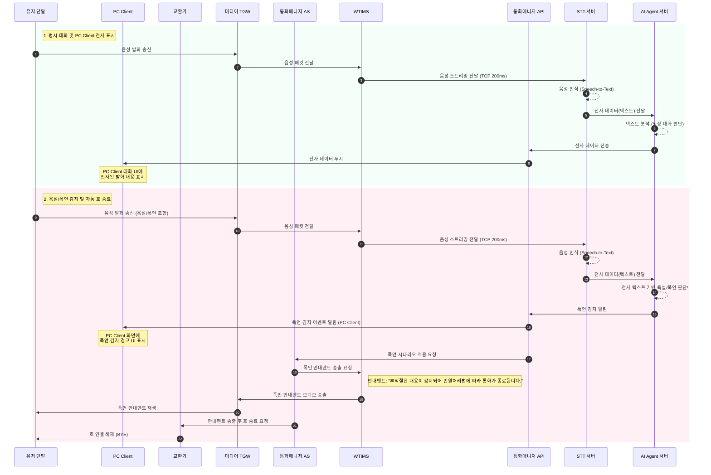

# 클라우드 STT 연동 콜 플로우 (음성 AI Agent)

본 문서는 음성 AI Agent(Cloud)와 STT/AI 서버 통합 구성 시의 평시 대화 및 폭언 감지 상황에 대한 시나리오 흐름을 설명합니다.

## 시퀀스 다이어그램

## 시나리오 설명

1. **평시 대화 전사 (PC Client 표시)**
   - 발화자의 음성은 WTIMS를 거쳐 클라우드의 STT 서버로 전송됩니다.
   - STT 서버는 인식된 텍스트를 AI Agent 서버로 전달합니다. 
   - AI Agent 서버는 대화를 분석하여 정상 대화로 판단하면 통화매니저 API를 통해 PC Client에 전사 데이터를 푸시합니다.
   - PC Client는 수신된 텍스트 데이터를 사용자 대화 UI에 실시간으로 표시합니다.

2. **욕설/폭언 시 호 종료 흐름**
   - 발화자의 대화 내용에 욕설 또는 폭언이 포함된 경우, STT에서 변환된 텍스트를 바탕으로 AI Agent가 이를 즉시 판단합니다.
   - AI Agent는 통화매니저 API를 통해 PC Client로 폭언 발생 알림을 전송하여 화면에 경고를 표시하도록 합니다.
   - 또한, 통화매니저 API는 통화매니저 AS에 폭언 시나리오 적용을 요청합니다.
   - 통화매니저 AS는 WTIMS에 명령을 내려 **"부적절한 내용이 감지되어 민원처리법에 따라 통화가 종료됩니다."** 라는 폭언 안내멘트를 고객 측에 송출합니다.
   - 멘트 송출 완료 후, 통화매니저 AS는 교환기를 통해 호를 강제로 종료(Disconnect) 합니다.
