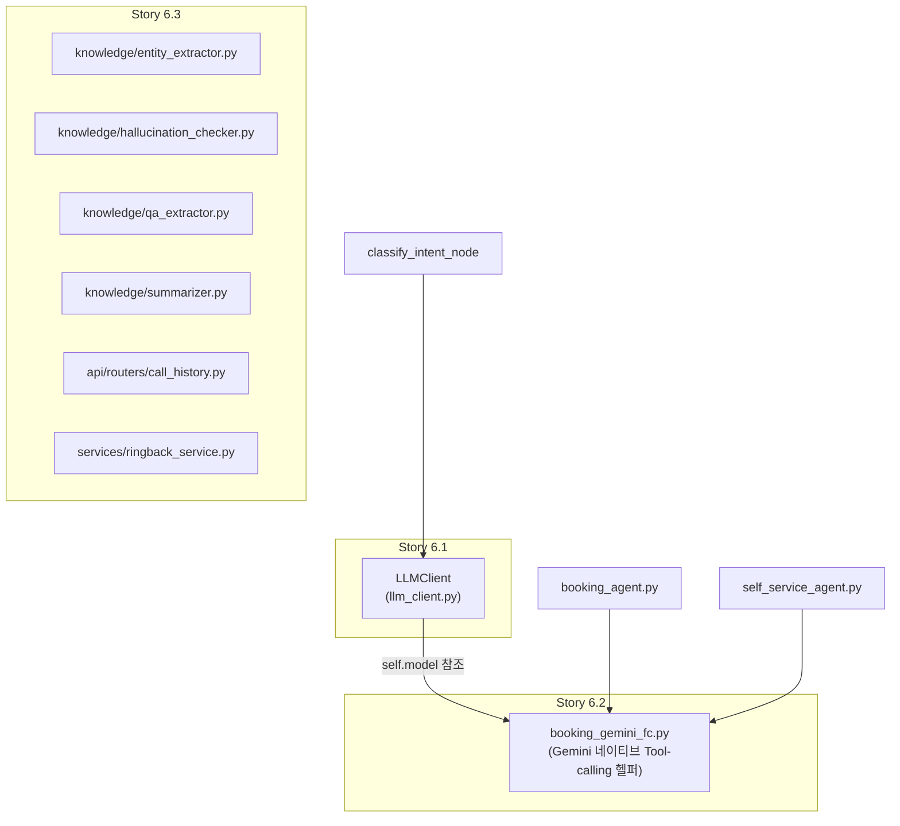

# Gemini SDK 마이그레이션(`google-generativeai` → `google-genai`) — Architecture

**작성일**: 2026-07-24
**버전**: 0.1 (초안)
**상태**: 초안 — Epic A~D 구현 착수 전
**관련 문서**:
- [../product/gemini-genai-migration-prd.md](../product/gemini-genai-migration-prd.md) — 본 문서의 상위 PRD
- [../product/gemini-genai-migration-brief.md](../product/gemini-genai-migration-brief.md)
- [coding-standards.md](coding-standards.md) §4~§6 — Tool-calling 3단계 폴백·검증 방법론
- [../reports/2026-07/2026-07-24_google_genai_thinking_off_spike_validation.md](../reports/2026-07/2026-07-24_google_genai_thinking_off_spike_validation.md) — 스파이크 검증·코드 인벤토리
- [../../src/ai_voicebot/ai_pipeline/llm_client.py](../../src/ai_voicebot/ai_pipeline/llm_client.py)
- [../../src/ai_voicebot/langgraph/booking_gemini_fc.py](../../src/ai_voicebot/langgraph/booking_gemini_fc.py)

---

## 1. 설계 원칙

1. **호출부 무변경(CR1)**: `LLMClient`의 8개 공개 메서드와 `booking_gemini_fc.py`의 5개 공개
   함수는 시그니처·반환 타입을 바꾸지 않는다. SDK 차이는 이 두 파일 내부에서 전부 흡수한다.
2. **어댑터는 얇게**: `google-genai`가 이미 `types.GenerateContentConfig`/`types.ThinkingConfig`
   등으로 `google-generativeai`와 유사한 개념 모델을 제공하므로, 별도 추상화 레이어(예: 벤더 중립
   `LLMBackend` 인터페이스)를 새로 만들지 않는다(Non-Goal, 과설계 방지).
3. **단계적 치환**: 4개 Epic(A~D) 순서대로 파일 단위 치환 → 각 Epic마다 회귀 테스트 + 실서버
   cross-check(coding-standards.md §6)를 거친 뒤 다음 Epic 착수.

## 2. 컴포넌트 변경 지도

`booking_gemini_fc.py`는 `LLMClient.model`(현재 `genai.GenerativeModel`)을 참조해 tools가 붙은
새 모델 객체를 만드는 구조이므로, Story 6.1에서 `LLMClient.model`의 타입이 바뀌면 Story 6.2의
`build_booking_generative_model()`도 함께 갱신해야 한다(6.1/6.2 순서 의존성).

## 3. `LLMClient` 내부 치환 매핑 (Story 6.1)

| 기존 (`google-generativeai`)                                                             | 신규 (`google-genai`)                                                                                                                                                                                                                 |
| ---------------------------------------------------------------------------------------- | ------------------------------------------------------------------------------------------------------------------------------------------------------------------------------------------------------------------------------------- |
| `genai.configure(api_key=...)`                                                           | `genai.Client(api_key=...)` — 인스턴스 보관(`self._client`)                                                                                                                                                                           |
| `genai.GenerativeModel(model_name=...)`                                                  | 모델명을 문자열로 보관(`self._model_name`), 호출 시마다 `client.models.generate_content(model=self._model_name, ...)`                                                                                                                 |
| `genai.types.GenerationConfig(**kw)`                                                     | `genai.types.GenerateContentConfig(**kw)`                                                                                                                                                                                             |
| `genai.types.ThinkingConfig(thinking_budget=0)`                                          | 동일 이름·필드, 신규 SDK에서 정식 지원(스파이크로 검증 완료)                                                                                                                                                                          |
| `self.model.generate_content(prompt, generation_config=cfg)`                             | `self._client.models.generate_content(model=self._model_name, contents=prompt, config=cfg)`                                                                                                                                           |
| 스트리밍: `self.model.generate_content(..., stream=True)` (또는 유사)                    | `self._client.models.generate_content_stream(model=..., contents=..., config=...)`                                                                                                                                                    |
| `response.text`                                                                          | 동일(`response.text`) — 신규 SDK도 동일 프로퍼티 제공(스파이크 스크립트로 확인)                                                                                                                                                       |
| `response.candidates[0].finish_reason` (정수: 1=STOP/2=MAX_TOKENS/3=SAFETY/4=RECITATION) | `response.candidates[0].finish_reason` — **enum 표현이 다를 수 있음(NFR1)**. Epic A 구현 시 실제 값 타입을 직접 출력해 확인 후, 기존 `fr_map` 정수 매핑 로직을 유지할지 enum명 기반으로 바꿀지 결정한다(추측 금지, 코드로 직접 확인). |

### 3.1 응답 필드 정규화(NFR1) 처리 위치

`generate_response()`의 `finish_reason` 판별 블록, `generate_help_items_json()`의 candidate
파싱 블록 — 이 두 곳에 `_normalize_finish_reason(response)` 같은 작은 private 헬퍼를 추가해
정수/enum 어느 쪽이 와도 `"STOP"|"MAX_TOKENS"|"SAFETY"|"RECITATION"` 문자열로 통일 반환하도록
한다(신규 모듈 분리 불필요, `llm_client.py` 내부 private 함수로 충분).

## 4. Tool-calling 재구현 (Story 6.2) — `booking_gemini_fc.py`

| 기존 (`glm` = `google.ai.generativelanguage`)               | 신규 (`google.genai.types`)                                                                                                                                                                                                                                                                                                                                                                                                                                                                      |
| ----------------------------------------------------------- | ------------------------------------------------------------------------------------------------------------------------------------------------------------------------------------------------------------------------------------------------------------------------------------------------------------------------------------------------------------------------------------------------------------------------------------------------------------------------------------------------ |
| `glm.Type.STRING/NUMBER/INTEGER/BOOLEAN/OBJECT/ARRAY`       | `types.Type.STRING/NUMBER/INTEGER/BOOLEAN/OBJECT/ARRAY`                                                                                                                                                                                                                                                                                                                                                                                                                                          |
| `glm.Schema(type=..., properties=..., required=...)`        | `types.Schema(type=..., properties=..., required=...)`                                                                                                                                                                                                                                                                                                                                                                                                                                           |
| `glm.Tool(function_declarations=[...])`                     | `types.Tool(function_declarations=[...])`                                                                                                                                                                                                                                                                                                                                                                                                                                                        |
| `glm.FunctionDeclaration(name=, description=, parameters=)` | `types.FunctionDeclaration(name=, description=, parameters=)`                                                                                                                                                                                                                                                                                                                                                                                                                                    |
| `genai.GenerativeModel(model_name, tools=[glm_tool])`       | `client.models.generate_content(model=..., contents=..., config=types.GenerateContentConfig(tools=[genai_tool]))` — 신규 SDK는 "tools가 붙은 모델 객체"가 아니라 **호출마다 config에 tools를 실어 보내는 방식**이므로 `build_booking_generative_model()`의 반환 타입이 "GenerativeModel 인스턴스"에서 "재사용 가능한 tools 설정 dict/객체"로 바뀐다 — **이는 함수의 반환 타입 변경이므로 호출부(`booking_agent.py` 등)의 사용 방식도 함께 확인해야 한다(CR1 예외 가능성, PRD FR3 재검토 필요).** |
| `response.candidates[0].content.parts[i].function_call`     | 동일 경로 유지 예상(신규 SDK도 `parts[i].function_call` 제공) — Epic B 구현 시 직접 확인                                                                                                                                                                                                                                                                                                                                                                                                         |

> **⚠️ 설계 결정 필요 사항(Story 작성 시 먼저 해결할 것)**: `google-genai`는 `GenerativeModel`
> 같은 "tools가 미리 바인딩된 재사용 객체" 개념이 약하고, 호출마다 `config`에 tools를 실어
> 보내는 stateless 스타일에 가깝다. `build_booking_generative_model()` 이름이 암시하는 "모델
> 객체 생성 후 재사용" 패턴을 유지할지, 아니면 "tools 설정을 만들어 두고 매 호출 시
> `invoke_booking_model_with_gemini_fc()`에서 `generate_content`에 함께 전달"하는 방식으로
> 재설계할지는 **Story 6.2 착수 시 스파이크로 먼저 검증**한 뒤 결정한다(PRD FR3에 반영 예정,
> 이 문서는 방향성만 제시).

### 4.1 스키마 변환 회귀 위험 (2026-07-21 버그 재발 방지)

`_json_schema_to_glm_schema()`(현재 `st in ("object", "") ` 조건 분기, `Any` 타입 파라미터를
STRING으로 취급하도록 이미 한 번 수정된 이력 있음)를 `_json_schema_to_genai_schema()`로
재작성할 때, 동일 조건 분기(`Any` 타입 → JSON Schema에 `type` 키 없음 → OBJECT로 오분류하지
않도록)를 반드시 유지한다. `test_booking_gemini_fc_schema.py`(11건)를 신규 함수명 기준으로
그대로 이식해 회귀를 방지한다(PRD FR4).

## 5. Story 6.3 — 주변 모듈

`knowledge/entity_extractor.py`, `hallucination_checker.py`, `qa_extractor.py`,
`summarizer.py`는 각각 지역 `import google.generativeai as genai` 후 자체적으로
`genai.GenerativeModel(...).generate_content(...)`를 호출하는 독립적인 소규모 경로다(공유
`LLMClient` 인스턴스를 쓰지 않음 — 확인 필요, Story 착수 시 각 파일에서 실제로 `LLMClient`를
재사용하는지 아니면 자체 클라이언트를 만드는지 직접 확인할 것). 각 파일 내부에서 §3의 매핑
표와 동일한 방식으로 개별 치환한다. `call_history.py`/`ringback_service.py`도 동일.

## 6. 검증 전략

1. **단위 테스트**: Story별로 신규 SDK 응답을 흉내 낸 mock으로 `LLMClient`/
   `booking_gemini_fc.py` 어댑터 로직 검증(기존 mock 테스트를 `google-genai` 응답 객체 형태로
   갱신).
2. **스키마 회귀**: `test_booking_gemini_fc_schema.py` 이식 버전으로 `Any` 타입 파라미터
   오분류 재발 방지 검증(§4.1).
3. **실서버 통합 검증(Story 6.2/6.4 필수)**: `start-all.ps1`로 서버 기동(사용자 승인 후) →
   booking/self_service 시나리오 재실행 → `logs/call_data_record_*.log` cross-check
   (coding-standards.md §6) → tool_trace 정상 확인.
4. **TTFT 실측 비교(Story 6.4)**: `/api/ai-pipeline/test/converse` QA 하네스로 마이그레이션
   전후 TTFT를 비교해 스파이크 실측 수준(≤1초대) 재현을 확인.
5. **완전 제거 확인(Story 6.4)**: `grep -r "import google.generativeai" src/`,
   `grep -r "from google.ai import generativelanguage" src/` 결과가 0건이어야 한다(PRD FR7).

*최종 업데이트: 2026-07-24*
