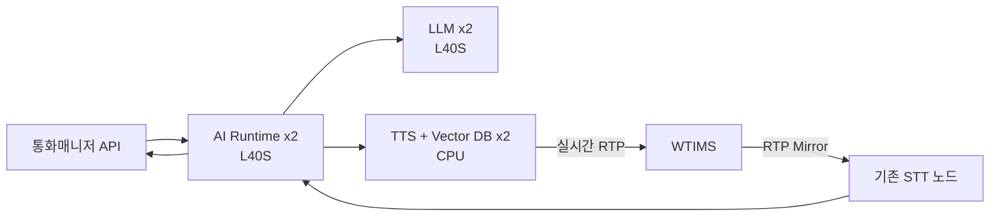

# 지능망 AI Call Agent CAPEX·OPEX 견적 산출서

**작성일**: 2026-09-16  
**버전**: 1.0  
**상태**: Draft ROM 견적  
**관련 문서**: [상용 적용 상세 아키텍처](production-deployment-architecture.md), [마스터 PRD](../product/prd.md)

## 1. 목적과 견적 범위

본 견적은 지능망 환경에서 AI를 이용해 고객 문의를 실시간으로 이해하고 응대하는 **AI Call Agent** 도입을 위한 예산 초안이다. 음성 인식 결과를 AI Runtime이 세션별로 처리하고, LLM이 의도 판단과 답변을 생성하며, 합성된 음성은 기존 WTIMS를 통해 통화에 실시간 전송한다.

| 구분    |              예산 | 산정 범위                                                   |
| ------- | ----------------: | ----------------------------------------------------------- |
| CAPEX   |   **2억 원 이내** | 신규 서버 6대 구매비. 기존 STT 노드와 기존 메모리 DB는 제외 |
| OPEX    |   **2억 원 이내** | 기능 개발, 기존 시스템 연동, 통합 시험의 초기 개발비        |
| MM 단가 | **1,200만 원/MM** | OPEX 금액 산식의 고정 단가                                  |

본 문서의 OPEX는 월간 전력, 상면, 하드웨어 유지보수, 모델 라이선스 또는 외부 API 종량제와 같은 반복 운영비가 아니라 **초기 기능 개발비**를 뜻한다. 반복 운영비는 실제 장비 전력, 계약 조건, 호출량이 확정된 후 별도 산정한다.

## 2. 목표 구성

기존 STT 노드와 메모리 DB는 이미 가용하다는 전제다. 신규 물리 서버는 역할별 2대, 총 6대로 구성하며 각 역할은 Active-Active로 운용한다.

| 역할             |      대수 | 구성 원칙                                                 | GPU            |
| ---------------- | --------: | --------------------------------------------------------- | -------------- |
| LLM              |         2 | 의도 분류, RAG 기반 답변 생성, Tool 호출 판단을 이중화    | L40S x1/노드   |
| TTS + DB(Vector) |         2 | CPU 기반 TTS 처리와 Vector DB를 동일 노드에 배치          | 미장착         |
| AI Runtime       |         2 | 세션 오케스트레이션, 모델 호출, 기존 시스템 연동을 이중화 | L40S x1/노드   |
| 기존 STT         | 기존 자산 | RTP 스트림 인식, AI Runtime으로 텍스트 전달               | 기존 장비 사용 |
| 기존 메모리 DB   | 기존 자산 | 세션 및 대화 문맥 저장                                    | 기존 장비 사용 |

> L40S는 LLM과 AI Runtime에만 장착한다. TTS 전용 GPU 서버는 본 견적에 포함하지 않으며, TTS와 Vector DB는 CPU 서버 2대에 통합한다.

## 3. CAPEX 산정

### 3.1 역할별 하드웨어 사양과 금액

단가는 2026년 상용 아키텍처의 L40S 및 서버 플랫폼 ROM을 재사용해 구성별로 조정한 값이다. 실제 발주가는 제조사, 이중화 전원, 랙, 보증, 네트워크 장비 및 조달 조건에 따라 달라질 수 있다.

| 역할             |  대수 | 노드당 권장 사양                                    | 노드당 ROM |           합계 ROM |
| ---------------- | ----: | --------------------------------------------------- | ---------: | -----------------: |
| LLM              |     2 | 32 vCPU, RAM 256 GB, L40S x1, SSD/HDD 2 TB, 1 Gbps  | 3,900만 원 |         7,800만 원 |
| TTS + DB(Vector) |     2 | 24 vCPU, RAM 128 GB, GPU 없음, SSD/HDD 4 TB, 1 Gbps | 2,050만 원 |         4,100만 원 |
| AI Runtime       |     2 | 24 vCPU, RAM 128 GB, L40S x1, SSD/HDD 2 TB, 10 Gbps | 4,000만 원 |         8,000만 원 |
| **CAPEX 합계**   | **6** |                                                     |            | **1억 9,900만 원** |

### 3.2 CAPEX 포함·제외 기준

| 구분                      | 포함 여부 | 설명                                                |
| ------------------------- | --------- | --------------------------------------------------- |
| L40S GPU                  | 포함      | LLM 2장, AI Runtime 2장만 포함                      |
| TTS 전용 GPU 서버         | 제외      | TTS는 TTS + DB(Vector) CPU 통합 노드에서 처리       |
| STT 노드                  | 제외      | 기존 장비 및 기존 예산 사용                         |
| 메모리 DB                 | 제외      | 기존 자산 사용                                      |
| Vector DB                 | 포함      | TTS + DB(Vector) 노드의 스토리지와 운영 구성에 포함 |
| 전용 L4/L7 장비, 랙, 상면 | 제외      | 기존 망 또는 별도 인프라 견적 대상                  |

CAPEX는 $1.99억원$으로 예산 $2억원$ 안에 있으며, 잔여 $100만원$은 견적 오차를 흡수하기에 충분하지 않다. 실제 구매 단계에서는 CPU·스토리지 옵션을 고정한 뒤 리셀러 견적을 받아 예산 초과 여부를 재확인해야 한다.

## 4. OPEX 산정 기준

OPEX는 $1\,MM = 1,200만원$으로 환산한다. 역할별 개발 항목은 설계, 구현, 단위·통합 시험, 운영 인수 기준을 포함한다.

$$
16.5\,MM \times 12,000,000\text{원/MM} = 198,000,000\text{원}
$$

## 5. 신규 노드별 개발 기능

### 5.1 LLM 노드: 3.5 MM, 4,200만 원

| 개발 사항               |      MM |           금액 | 내용                                                  |
| ----------------------- | ------: | -------------: | ----------------------------------------------------- |
| 모델 서빙 구성          |     0.8 |       960만 원 | L40S 기반 모델 로딩, API 엔드포인트, 모델 버전 관리   |
| 의도 분류·응답 프롬프트 |     1.0 |     1,200만 원 | 고객 문의 의도 판단, RAG 문맥 주입, 응대 문장 생성    |
| Tool 호출 안전 제어     |     0.9 |     1,080만 원 | 허용된 업무 API만 호출, 파라미터 검증, 실행 이력 기록 |
| 성능·장애 관측          |     0.8 |       960만 원 | TTFT, 토큰 처리량, 오류율, 모델 장애 시 상태 기록     |
| **소계**                | **3.5** | **4,200만 원** |                                                       |

### 5.2 TTS + DB(Vector) 노드: 3.0 MM, 3,600만 원

| 개발 사항                 |      MM |           금액 | 내용                                                    |
| ------------------------- | ------: | -------------: | ------------------------------------------------------- |
| CPU TTS 서비스 구성       |     0.7 |       840만 원 | 스트리밍 합성 요청, 음성 포맷 변환, 음성 캐시           |
| Vector DB 스키마·색인     |     0.8 |       960만 원 | 고객 업무 지식, FAQ, 정책 문서의 임베딩·메타데이터 관리 |
| RAG 검색 인터페이스       |     0.7 |       840만 원 | AI Runtime의 질의에 대한 검색, 테넌트·문서 범위 필터링  |
| 데이터 백업·복구·모니터링 |     0.8 |       960만 원 | 색인 상태, 저장소 사용량, 백업 및 복구 절차             |
| **소계**                  | **3.0** | **3,600만 원** |                                                         |

### 5.3 AI Runtime 노드: 5.0 MM, 6,000만 원

| 개발 사항                |      MM |           금액 | 내용                                                   |
| ------------------------ | ------: | -------------: | ------------------------------------------------------ |
| 통화 세션 오케스트레이션 |     1.4 |     1,680만 원 | call_id 기반 세션 생성, 상태 관리, 노드 간 분산        |
| STT·LLM·TTS 파이프라인   |     1.3 |     1,560만 원 | 인식 텍스트 입력, RAG·LLM 호출, TTS 요청의 비동기 연결 |
| 고객 응대 정책·HITL      |     0.9 |     1,080만 원 | 금칙어·위험 문의 처리, 상담원 이관, 응답 정책 적용     |
| GPU 추론 워커·장애 복구  |     0.7 |       840만 원 | L40S 워커 상태 확인, 큐 제어, 실패 세션 복구           |
| 통합 로그·추적           |     0.7 |       840만 원 | 통화 단위 이벤트, 지연 구간, 결과 감사 로그            |
| **소계**                 | **5.0** | **6,000만 원** |                                                        |

## 6. 기존 시스템 연동 개발

아래 항목은 기존 장비를 교체하지 않고 AI Call Agent와 연결하기 위한 개발비다.

| 기존 연동 기능                                     |      MM |           금액 | 개발 범위                                                               |
| -------------------------------------------------- | ------: | -------------: | ----------------------------------------------------------------------- |
| STT ↔ AI Runtime 연동 및 처리                      |     1.5 |     1,800만 원 | STT 최종·중간 인식 결과 수신, 세션 매핑, 순서 보장, 지연·오류 처리      |
| TTS ↔ WTIMS 연동 및 RTP 실시간 전송                |     1.5 |     1,800만 원 | 합성 음성 스트림 변환, RTP 패킷화, 재생 완료·중단 동기화, 품질 로그     |
| 통화매니저 API ↔ AI Runtime 연동 및 처리 현황 전달 |     1.5 |     1,800만 원 | 통화 시작·종료 이벤트, AI 처리 상태, 상담원 이관 상태, 인증·재전송 규약 |
| **기존 연동 소계**                                 | **4.5** | **5,400만 원** |                                                                         |

## 7. 공통 통합·검증

| 개발 사항                   |      MM |           금액 | 내용                                                        |
| --------------------------- | ------: | -------------: | ----------------------------------------------------------- |
| 종단 통합 시험 및 운영 인수 |     1.0 |     1,200만 원 | 고객 문의 시나리오, 장애 전환, RTP 품질, API 상태 전달 검증 |
| 부하·보안·관측 기준 검증    |     0.5 |       600만 원 | 동시 세션, 접근 제어, 로그·대시보드 기준 점검               |
| **소계**                    | **1.5** | **1,800만 원** |                                                             |

## 8. OPEX 합계

| 구분                       |       MM |               금액 |
| -------------------------- | -------: | -----------------: |
| LLM 노드 개발              |      3.5 |         4,200만 원 |
| TTS + DB(Vector) 노드 개발 |      3.0 |         3,600만 원 |
| AI Runtime 노드 개발       |      5.0 |         6,000만 원 |
| 기존 시스템 연동           |      4.5 |         5,400만 원 |
| 공통 통합·검증             |      1.5 |         1,800만 원 |
| **OPEX 합계**              | **16.5** | **1억 9,800만 원** |

OPEX는 예산 $2억원$ 대비 $200만원$의 여유가 남는다. 범위가 추가되면 단가를 낮춰 맞추기보다, 우선순위가 낮은 기능을 별도 단계로 분리하거나 추가 예산을 승인받아야 한다.

## 9. 의사결정 전 확인 사항

1. CPU 기반 TTS의 동시 합성 수와 음질이 목표 통화량을 충족하는지 PoC 부하 시험으로 확인한다.
2. AI Runtime의 L40S 사용 목적(로컬 보조 모델, 임베딩 또는 GPU 가속 처리)을 모델·처리량 기준으로 확정한다.
3. Vector DB와 TTS의 동일 노드 배치가 디스크 I/O와 지연에 미치는 영향을 측정한다.
4. WTIMS RTP 규격, 코덱, 패킷 주기와 통화매니저 API의 상태 이벤트 계약을 기존 시스템 담당자와 확정한다.
5. 월간 전력·상면·유지보수·모델 라이선스·외부 API 비용은 사용량 가정 확정 후 별도 운영비 견적으로 보완한다.

*최종 업데이트: 2026-09-16*