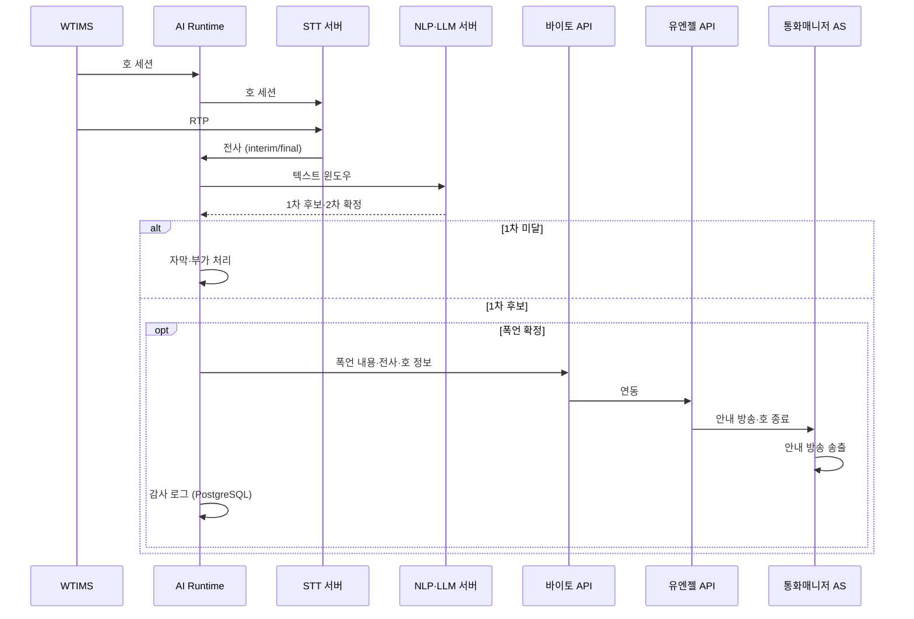
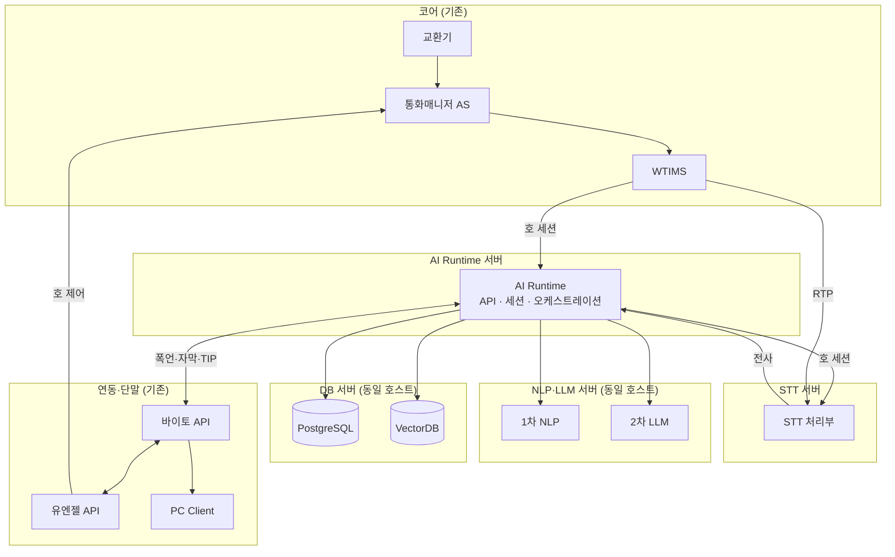

# 통화매니저 실시간 STT 도입을 통한 폭언 감지 기능 개발

## 문서 범위

통화매니저·AI 통화비서에 **실시간 STT**를 도입하고, 전사 텍스트로 **폭언·욕설을 감지**해 가입자를 보호하는 아키텍처를 정의한다.

| 구분 | 내용 |
|------|------|
| **목적** | 실시간 STT 기반 폭언·욕설 감지 → 바이토(수집) → 유엔젤 → 통화매니저 AS(호 종료 안내·호 종료) |
| **신규** | AI Runtime, STT, NLP·LLM(동일 서버), PostgreSQL·VectorDB(동일 서버) |
| **기존 활용** | 교환기, 통화매니저 AS, WTIMS, 유엔젤/바이토 API, PC Client |
| **범위 외** | TTS, NL-IVR, Cloud STT/LLM API, **가동 후 운용비**(전력·상면·유지보수·Cloud 종량제) |
| **성능·용량** | Busy Hour **시간당 15,000명·약 4.17 CPS·동시 500호** (§3.2, [production-deployment-architecture.md](./production-deployment-architecture.md) §4·§5) |
| **CAPEX·서버 근거** | 동 상용 문서 §6.3·§11.2 (온프레미스·EMS·TTS 제외, **8대**) |

동일 STT 인프라로 자막·TIP·스팸·CID 등 부가 기능을 제공할 수 있으나, 본 문서의 **아키텍처 중심**은 폭언·욕설 감지 경로이다.

---

## 도입 비용 요약 (CAPEX + 초기 SW)

| 구분 | ROM | 상세 |
|------|-----|------|
| **CAPEX** (서버·HW 8대) | **약 1.96억 원** | §4.1 (권장 **1.6억 ~ 2.4억 원**, ±20%) |
| **초기 SW 개발** | **약 9.6억 원** | AI Call Agent **7.15억** (§5.2) + 기존 노드 **2.45억** (§5.3) |
| **합계** | **약 11.6억 원** | 권장 **약 10.7억 ~ 12.3억 원** |

---

## 1. 제공되는 기능 (사용자 관점)

호 종료 안내 방송은 **통화매니저 AS** 기존 음성으로 재생한다(AI Call Agent TTS 미사용).

| # | 기능 | 가치 | 실현 수단 |
|---|------|------|-----------|
| 1 | **폭언·욕설 실시간 감지 및 호 종료 안내** *(핵심)* | 통화 중 폭언·욕설 감지 후 정책에 따라 안내 방송·호 종료로 가입자 보호 | STT → 1차 NLP → 2차 LLM → 바이토 → 유엔젤 → 통화매니저 AS |
| 2 | **실시간 통화 자막** | interim/final·화자 구분 자막(폭언 감지 입력) | STT 스트리밍, RTP 미러 |
| 3 | **실시간 대화 TIP** | 맥락 맞는 정책·FAQ 힌트 | VectorDB + LLM |
| 4 | **주의·블랙·스팸 사전 알림** | 인입 시 위험 번호 안내 | RDB·스팸 레지스트리 |
| 5 | **자동 연락처 등록** | 통화 기반 연락처 반영 | RDB·[`CID 구현 보고서`](../reports/2026-04/2026-04-21_1340_CID_DUAL_LINE_CONTACTS_STATS_IMPL.md) |
| 6 | **CID 맥락·의도** | 벨 직후 직전 통화 요약·의도 태그 | caller-context API, 통화 후 LLM |

### 1.1 폭언·욕설 감지 흐름



| 단계 | 주체 | 처리 |
|------|------|------|
| 수집 | WTIMS → AI Runtime → STT(세션), WTIMS → STT(RTP) | 호 세션은 Runtime 경유, RTP는 STT 직연, 전사는 Runtime 수신 |
| 1차 | 경량 NLP | 금칙어·패턴·경량 분류, 저지연 후보 |
| 2차 | LLM | 문맥 기반 확정, 오탐 완화 |
| 조치 | 바이토 → 유엔젤 → 통화매니저 AS | 폭언 수집, 호 종료 안내·호 종료 |
| 사후 | AI Runtime, NLP·LLM, PostgreSQL | 감사 로그, 통화 종료 후 요약·최종 판단 |

---

## 2. 아키텍처

### 2.1 논리 계층

```
┌──────────────────────────────────────────────────────────────┐
│  단말·API           바이토 API ── PC Client                  │
│                     유엔젤 API                               │
├──────────────────────────────────────────────────────────────┤
│  AI (신규)          AI Runtime ─ STT 서버                    │
│                     NLP·LLM (동일 서버) · PG·Vector (동일 서버)│
├──────────────────────────────────────────────────────────────┤
│  코어 (기존)        교환기 ─ 통화매니저 AS ─ WTIMS           │
└──────────────────────────────────────────────────────────────┘
```

| 계층 | 구성 | 역할 |
|------|------|------|
| **코어** | 교환기, 통화매니저 AS, WTIMS | 호 설정, RTP 미러 원천, **호 종료 안내 방송** |
| **AI** | AI Runtime, STT 서버, NLP·LLM 서버, DB 서버 | 세션·전사·폭언 감지, 이력·TIP·스팸 |
| **연동·단말** | 유엔젤 API, 바이토 API, PC Client | 수집·호 제어 지시, 자막·CID·경고 UI |

### 2.2 물리 구성

신규 AI 측은 **물리 서버 4종**으로 나눈다. **호 세션**과 **RTP** 경로는 분리한다.

| 구분 | 경로 | 설명 |
|------|------|------|
| **호 세션** | WTIMS → **AI Runtime** → **STT 서버** | 호 ID·발신번호·화자 매핑 등 세션·제어 정보 |
| **RTP** | WTIMS → **STT 서버** | 음성 스트림 직연(AI Runtime 경유 없음) |
| **전사** | STT 서버 → **AI Runtime** | interim/final 텍스트·메타 |



### 2.3 데이터 경로

| ID | 경로 | 트리거 |
|----|------|--------|
| P-0 | WTIMS → AI Runtime → STT (호 세션), WTIMS → STT (RTP) | 통화 시작 |
| P-1 | STT → AI Runtime → NLP·LLM → 바이토 → 유엔젤 → 통화매니저 AS | 폭언 2차 확정 |
| P-2 | STT → AI Runtime → 바이토 → PC Client | 상시(자막) |
| P-3 | AI Runtime → VectorDB → NLP·LLM → 바이토 → PC | TIP 요청 |
| P-4 | AI Runtime ↔ PostgreSQL (DB 서버) | 이력·감사·스팸·연락처 |
| P-5 | 인입 시 PostgreSQL 조회 → AI Runtime → 바이토 → PC | 스팸·주의 번호 |

### 2.4 설계 원칙

1. **폭언 감지 우선** — STT·1차 NLP·2차 LLM·외부 연동(P-1)을 최우선 경로로 설계한다.
2. **시그널·미디어 분리** — **호 세션**은 WTIMS → AI Runtime → STT, **RTP**는 WTIMS → STT 직연.
3. **역할별 서버 배치** — AI Runtime(세션·API), STT(음성·전사), **NLP·LLM 동일 서버**, **PostgreSQL·VectorDB 동일 서버**.
4. **온프레미스 전용** — STT·LLM 모두 자체 GPU 서버에 구축(Cloud API 미사용).
5. **코어 비침해** — 교환기·통화매니저 AS·WTIMS 구조는 유지하고, AI는 세션·RTP 미러·API 연동으로만 접근한다.

---

## 3. AI Call Agent — 노드별 기능

신규·추가되는 AI 측 구성만 기술한다. 코어·API·단말은 기존 자산이다.

| 서버 종류 | 구성 대수 | 이중화 | 기능 | 연관 §1 |
|-----------|-----------|--------|------|---------|
| **AI Runtime** *(API·세션 통합)* | **2** | All-Active | WTIMS 호 세션, STT 세션 연계, 전사·폭언 오케스트레이션, 바이토/유엔젤 | #1~#6 |
| **STT** | **2** | All-Active | WTIMS RTP 직연·호 세션, interim/final 전사 | #1, #2 |
| **NLP·LLM** *(동일 호스트)* | **2** | All-Active | 1차 NLP·2차 LLM(확정·요약·TIP·스팸·CID) | #1, #3, #4, #6 |
| **DB** *(PostgreSQL·VectorDB 동거)* | **2** | Primary + Standby | 이력·폭언 감사·스팸·연락처 / 지식·TIP 벡터 검색 | #1, #3, #4~#6 |

**합계: 신규 물리 서버 8대** (교환기·통화매니저 AS·WTIMS·EMS·TTS 제외). **성능·용량 전제**는 **§3.2**를 본다.

### 3.2 성능·용량 기준 (가상 시나리오)

본 절은 [production-deployment-architecture.md](./production-deployment-architecture.md) **빠른 참조 §4(성능 및 용량 산정 기준)·§5(노드별 성능 및 수용량 매트릭스)** 를 본 문서 **4종 서버·8대** 구성에 맞게 요약한 것이다. 산식·벤치 정본은 상용 문서 **§6.1**을 본다.

#### 처리 용량 목표

| 항목 | 값 |
|------|-----|
| **시간당 수용 가입자** | **15,000명** (유저당 1시간 1통화, 평균 통화 **120초**) |
| **지속 CPS** | 약 **4.17** INVITE/s |
| **실효 동시 통화 상한** | **500호** (전체) · 그중 AI 응대 약 **100호** (20%) |
| **실효 병목** | **AI Runtime 동시 세션**(통화 **1:1** 세션, 클러스터 벤치 **500**) |

#### 기준 시나리오 (Busy Hour)

| 가정 | 내용 |
|------|------|
| 발화 | **10초당 1회** (통화당 약 12회) |
| 통화 구성 | AI 응대 **20%** · 유저간 통화 **80%** |
| STT | 모든 통화에서 **RTP 미러 연속 인식**(CID·자막·폭언 감지) |
| STT 벤치 단위 | **동시 ASR 스트림 1개** = RTP 미러 디코딩 채널 1개 (통화 1건 ≠ 스트림 1개) |
| 호당 STT 스트림 | 유저간 **2**/호 · AI **1**/호 → 가중 평균 **1.8 스트림/호** |
| LLM | AI 호 발화당 **1.2회** 질의(호당 **14.4회**) + 유저간 종료 시 요약 **1회**/호 · 폭언 **2차 LLM**은 위 부하에 **추가** |
| Runtime | 유저간·AI 공통 **오케스트레이션 세션 1개/호** |

**500호 부하 시 합산 검증(참조 문서와 동일):** STT **약 900** 동시 스트림(500×1.8), LLM **약 15.3 QPS**(운영 상한 **20 QPS** 대비 **약 76%** — 폭언 2차 LLM·피크 시 **벤치 재확인**), Runtime **500** 세션(벤치와 동일 → **실효 상한**).

#### 노드별 성능·수용량 매트릭스

본 문서에 **해당하는 노드만** 기재한다(TTS·AIR GW·별도 API/Realtime 제외). **API·WSS** 는 **AI Runtime 2대**에 통합 반영한다.

| 시스템 노드 | 성능 측정 단위 | 클러스터 벤치마크 | 호당 부하 (§6.1 동일) | 최대 수용 동시호 (단독 역산) | 시간당 가입자 | 구성 대수 |
|-------------|----------------|-------------------|----------------------|------------------------------|---------------|-----------|
| **AI Runtime** *(API·세션 통합)* | 동시 세션 | **500** | **1 세션/호** | **500호** | **15,000명** | **2** All-Active |
| **STT** | 동시 스트림 | **1,250** (625/노드) | 평균 **1.8**/호 · 유저간 **2** · AI **1** | **694호** *(1.8 스트림/호 가정)* | 20,820명 | **2** All-Active |
| **NLP·LLM** *(동일 호스트)* | 추론 QPS | **25** (운영 **20**) | 평균 **≈0.031 QPS/호** · AI **0.12** · 유저간 **≈0.008** | **652호** | 19,560명 | **2** All-Active |
| **PostgreSQL·Qdrant** *(동거)* | TPS / 검색 QPS | PG·Vector 각 벤치 별도 | 경로별(§6.1·§7) — 호당 단일치 비권장 | 500호 부하 시 **여유**(참조 §6.4) | — | **2** P+S |

> **해석:** 표의 **최대 수용 동시호**는 노드별 **단독 역산**이다. 본 구성에서는 **AI Runtime 500호**가 **실효 상한**이며, STT(694호)·LLM(652호)은 그보다 크나 **LLM은 500호 시 운영 QPS 여유가 STT·Runtime보다 좁다**. 호당 **1.0 스트림**이면 STT 단독 한계는 **약 1,250동시 통화**까지 상승(다른 병목 전제). **1차 NLP**는 LLM 서버 CPU 부하로 소량 반영(벤치 LLM 여유 내).

---

## 4. CAPEX (서버·HW, 온프레미스)

**서버·HW 구매비(CAPEX)만** ROM으로 산정한다. **초기 SW 개발비**는 **§5**를 본다.

산정 근거: [production-deployment-architecture.md](./production-deployment-architecture.md) **§6.3(스펙)·§11.2(역할별 단가)**. 상용 16노드 구성에서 **TTS·AIR GW·API/Realtime(별도)·EMS** 를 제외하고, 본 문서의 **4종·8대** 배치(NLP·LLM 동거, PostgreSQL·Qdrant 동거, API는 AI Runtime에 통합)로 재매핑했다.

### 4.1 서버 종류별 구성 대수

| 서버 종류 | 구성 대수 | 이중화 | 권장 스펙(노드당, 요약) | 노드당 ROM | 합계 ROM |
|-----------|-----------|--------|-------------------------|------------|----------|
| **AI Runtime** *(API·세션 통합)* | **2** | All-Active | 16 vCPU, 64 GB RAM, HDD 1 TB, 1 Gbps | 약 1,042만 원 | **약 2,084만 원** |
| **STT** | **2** | All-Active | 32 vCPU, 128 GB RAM, **L40S×1**, HDD 2 TB, 10 Gbps | 약 2,995만 원 | **약 5,990만 원** |
| **NLP·LLM** *(동일 호스트)* | **2** | All-Active | 32 vCPU, 256 GB RAM, **L40S×1**, HDD 2 TB, 1 Gbps | 약 3,804만 원 | **약 7,608만 원** |
| **DB** *(PostgreSQL·Qdrant 동거)* | **2** | Primary + Standby | 24 vCPU, 128 GB RAM, HDD 4 TB, 1 Gbps | 약 1,950만 원 | **약 3,900만 원** |
| **합계** | **8대** | — | — | — | **약 1억 9,582만 원** |

> **DB 노드당 ROM**: 참조 문서 PostgreSQL HA(약 1,662만)와 Qdrant(약 1,090만)를 **동일 호스트**로 합산·소폭 절감한 ROM(스펙은 PostgreSQL HA 기준, VectorDB 워크로드 동거). **NLP·LLM 노드당 ROM**: 상용 문서 LLM **L40S×1** 기준(약 3,804만/노드, GPU·1슬롯 플랫폼 차감). **CAPEX 합계**는 상단 **「도입 비용 요약」** 참조.

---

## 5. OPEX — 초기 SW 개발비 (운용비 제외)

**본 절의 OPEX**는 **월간 운용비가 아닌** 초기 **소프트웨어 개발비 ROM**이다. **전력·상면·유지보수·Cloud API 종량제**는 포함하지 않는다.

| 구분 | 산정 |
|------|------|
| **신규 AI Call Agent** | [prd.md](../product/prd.md) **§개발 공수(MM)** → **§5.1~5.2** |
| **기존 노드 변경·연동** | 통화매니저 AS·WTIMS·유엔젤 API·바이토 API·PC Client 제품 측 개발 — **§5.3** (AI Call Agent **55 MM과 이중 계상 없음**) |

**단가(AI Call Agent MM 환산):** [production-deployment-architecture.md](./production-deployment-architecture.md) **§11.4** — **약 1,300만 원/MM**.

**기존 노드 ROM** 은 상용 문서 **§11.3** 및 본 문서 연동 범위를 바탕으로 하며, **확정 견적이 없는 항목은 ROM(예상 범위)** 로 표기한다.

### 5.1 서버별 개발 공수 (MM) — 기능 배분 포함

[prd.md](../product/prd.md) **기능(Epic·Phase)별 MM** 및 본 문서 **§1** 범위를 맞춰 **55.0 MM**으로 재산정했다(TTS·NL-IVR·부재중 응대·Phase 4 등 **제외**). Epic 상세는 **§5.5**를 본다.

| 서버 | MM | §1 기능별 MM 배분 |
|------|-----|-------------------|
| **AI Runtime** *(API·세션 통합)* | **19.0** | **#1** 6.5 · **#2** 1.5 · **#3** 1.0 · **#4** 0.8 · **#5** 0.5 · **#6** 1.2 · **공통** 7.5 |
| **STT** | **9.0** | **#1** 2.5 · **#2** 5.0 · **공통** 1.5 |
| **NLP·LLM** *(동일 호스트)* | **12.0** | **#1** 5.0 · **#3** 2.5 · **#4** 1.5 · **#5** 1.0 · **#6** 1.5 · **공통** 0.5 |
| **DB** *(PostgreSQL·VectorDB 동거)* | **5.0** | **#1** 1.0 · **#3** 1.2 · **#4** 1.0 · **#5** 0.8 · **#6** 0.5 · **공통** 0.5 |
| | **45.0** | 기능별 배분 소계(서버 합) |
| **공통·통합·검증** *(전 서버)* | **10.0** | 시뮬레이터·E2E·§3.2 부하 (**#1~#6** 교차) |
| **합계** | **55.0** | |

### 5.2 AI Call Agent 개발비 ROM

| 항목 | MM | 단가 | 금액 (ROM) |
|------|-----|------|------------|
| AI Call Agent SW (신규 8대·§1 기능) | **55.0** | 약 1,300만 원/MM | **약 7.15억 원** |

> **참고:** 레포 **잔여 구현 비율**이 크면 [prd.md](../product/prd.md) 가이드대로 MM·금액을 재계산한다. AI 측 **바이토/유엔젤/WTIMS 연동 클라이언트·규약**은 55 MM에 포함되고, **기존 제품 코드 변경**은 §5.3에만 잡는다.

### 5.3 기존 노드·연동 개발비 ROM

대상 호에 대해 **실시간 STT·폭언 감지·호 종료** 가 동작하도록, **기존에 운영 중인 노드**에서 추가·변경하는 개발이다.

| # | 노드 | 개발·연동 범위 (본 문서) | 금액 (ROM) | 비고 |
|---|------|--------------------------|------------|------|
| 1 | **WTIMS** | 해당 호에 대해 **AI Runtime**으로 **세션·제어 연동**; **STT 서버**로 **RTP 미러** 전송(§2.2). CM에서 받은 호 맥락 릴레이·STT 세션 연계 | **약 0.7억 원** | [production-deployment-architecture.md](./production-deployment-architecture.md) **§11.3** 과거 산출 이력. 본 설계는 **AIR GW·TTS 재생 경로 없음** — 최종 범위 확정 시 재검증 |
| 2 | **통화매니저 AS** · **통화매니저 API (유엔젤)** | 해당 호 **시그널·세션 정보를 WTIMS로 연동 전달**; **폭언 확정** 시 유엔젤 경유 **안내 방송 송출·호 종료** 등 망 제어(§1.1) | **약 0.9억 원** *(예상)* | 확정 전. 범위: CM↔WT 세션 릴레이 + 유엔젤↔AI/바이토 호제어 API·장애/재시도. **권장 범위 약 0.7억 ~ 1.1억 원** |
| 3 | **통화매니저 API (바이토)** · **PC Client** | AI Runtime(바이토 경유) **실시간 STT(interim/final)** 수신·**PC Client 자막** 표시; **폭언** 시 **별도 담당자 알림**(이벤트·팝업·이력 등) | **약 0.85억 원** *(예상)* | 확정 전. 범위: WSS/REST·기존 클라이언트 연동 정합 + 폭언 알림 UX. **권장 범위 약 0.7억 ~ 1.0억 원** |
| | **기존 노드 소계** | | **약 2.45억 원** | WTIMS 확정분 + 유엔젤·CM·바이토·PC **ROM 합산** |

**예상 ROM 산출 참고 (항목 2·3):** 상용 문서에서 **MM 미산출**인 코어·바이토 과제에 대해, PRD **§11.4** 단가(**약 1,300만 원/MM**)로 **연동·호제어·화면** 규모를 **ROM용 MM**으로 환산한 값이다(확정 견적 아님).

| 노드 | ROM용 MM (참고) | 환산 (×1,300만 원) |
|------|-----------------|-------------------|
| 통화매니저 AS + 유엔젤 API | 약 **7.0 MM** | 약 **0.9억 원** |
| 바이토 API + PC Client | 약 **6.5 MM** | 약 **0.85억 원** |

### 5.4 초기 SW 개발비 합계

| 구분 | ROM |
|------|-----|
| AI Call Agent SW (§5.2) | **약 7.15억 원** |
| 기존 노드·연동 (§5.3) | **약 2.45억 원** |
| **SW 개발 합계** | **약 9.6억 원** |

※ CAPEX·전체 합계는 문서 상단 **「도입 비용 요약」** 참조.

### 5.5 기능별 개발 공수 상세 (MM)

[prd.md](../product/prd.md) **「기능(Epic·Phase)별 MM」** 을 본 문서 범위에 맞게 **축소·재배분**한 상세표이다. **합계 55.0 MM**은 §5.1과 동일하다. **기존 노드 개발**은 §5.3에만 반영한다.

| 기능 영역 | Epic / Phase | §1 | 담당 서버 | MM | 비고 |
|-----------|--------------|-----|-----------|-----|------|
| 실시간 STT·트랜스크립트·Diarization·RTP mirror | Epic **1.1** | #1, #2 | STT, AI Runtime | **8.0** | 온프레미스 ASR·gRPC·품질·회귀 |
| STT 품질·모델별 검증·부하 | Epic **1.1** | #2 | STT | **1.0** | §3.2 시나리오 정합 |
| **1차 NLP**·폭언·욕설 후보·규칙 엔진 | *(본편)* | #1 | NLP·LLM | **1.5** | PRD 서버 표에 없던 본편 가산 |
| **2차 LLM**·폭언 확정·문맥·오탐 완화 | Epic **1.3** | #1 | NLP·LLM | **3.5** | RAG·추론 경로 일부 |
| 폭언 **바이토 수집**·**유엔젤**·통화매니저 AS 연동 | *(본편)* | #1 | AI Runtime | **5.5** | 호 종료 안내·이벤트 |
| 세션·오케스트레이션·WTIMS↔STT 시그널 | Epic **2.1** | #1, #2 | AI Runtime | **3.5** | NL-IVR·TTS·Pipecat **제외** |
| VectorDB·임베딩·지식 저장 파이프라인 | Epic **1.2** | #3 | DB | **2.5** | Qdrant·PostgreSQL 동거 |
| RAG·TIP·LLM 추론·출처 표시 | Epic **1.3** | #3 | NLP·LLM, AI Runtime | **3.0** | |
| 지식 적재·문서·운영 UI | Phase **1** | #3 | DB, AI Runtime | **1.0** | |
| 스팸·주의·블랙·공용 레지스트리 | *(본편)* | #4 | DB, NLP·LLM, AI Runtime | **3.0** | |
| `caller_contacts`·자동 연락처 | *(본편)* | #5 | DB, NLP·LLM, AI Runtime | **2.5** | |
| CID·caller-context·통화 후 의도·요약 | Epic **2.1** | #6 | DB, NLP·LLM, AI Runtime | **4.0** | |
| API·Realtime·바이토·PC(WSS/REST) | Epic **2.2** | #1~#6 | AI Runtime | **2.5** | 별도 API 노드 없이 Runtime 통합 |
| Tool Calling·외부 API 프레임워크 | Epic **2.1** | #3, #4 | AI Runtime | **1.0** | |
| HITL·폭언·TIP 저신뢰 검토 | Epic **3.1** | #1, #3 | AI Runtime | **1.5** | 선택 운영 |
| 사후 리뷰·라벨링·통화이력 | Epic **3.1** | #1, #6 | DB, AI Runtime | **1.0** | |
| Shadowing(실시간 가이드) | Epic **3.2** | — | — | **0** | 본편 범위 외 |
| 부재중 AI 응대·설정 | Phase **1** | — | — | **0** | 본편 범위 외 |
| Tool-calling Agent·Multi-Agent | Phase **4** | — | — | **0** | 본편 범위 외 |
| **공통**·보안·관측·시뮬레이터·연동 E2E·부하(§3.2) | Cross-cutting | 전체 | 전 서버 | **10.0** | PRD **13.5** → TTS E2E 제외 축소 |
| **합계** | | | | **55.0** | PRD Epic 합계 **72.0** 대비 |

#### Phase 소계 (참고)

| Phase | PRD MM | 본 문서 MM | 비고 |
|-------|--------|------------|------|
| Phase 1 (STT·Vector·RAG·지식) | 19.0 | **16.5** | 부재중 2.0 제외, 폭언·NLP 가산 반영 |
| Phase 2 (Intent·Tool·운영 UI) | 20.5 | **12.5** | NL-IVR·Pipecat 대부분 제외 |
| Phase 3 (HITL·리뷰·Shadowing) | 10.5 | **2.5** | Shadowing 제외, HITL 최소 |
| Phase 4 (Agent) | 8.5 | **0** | 제외 |
| Cross-cutting | 13.5 | **10.0** | |
| 본편 전용(폭언 NLP·연동 등) | — | **12.5** | Epic 표에 없던 본편 항목 |
| **합계** | **72.0** | **55.0** | |

---

## 부록

### A. 참고 문서

[production-deployment-architecture.md](./production-deployment-architecture.md) · [prd.md](../product/prd.md) (서버별 MM **v3.6**, 합계 72.0) · [prd-detailed-phase1-4.md](../product/prd-detailed-phase1-4.md) · [CALL_HISTORY_AND_CONTENT_DESIGN.md](../design/CALL_HISTORY_AND_CONTENT_DESIGN.md)

### B. 부가 기능 요약

**스팸 공유** — STT·LLM 분류 → 공용 DB upsert → 타 가입자 착신 시 조회 → PC 표시.

**VectorDB** — 메뉴얼·FAQ 청크 임베딩, TIP용 RAG, 운영자 HITL(선택).

**SIP PBX** — Webhook, CDR, Prometheus 등 기존 기능은 AI와 병행.

### C. PRD 대비 범위 외

| 항목 | 비고 |
|------|------|
| NL-IVR·Dynamic ARS (AI TTS) | 텍스트·폭언 감지 중심 |
| Active RAG 통화 주도 | TIP 보조만 |
| 멀티 에이전트 (Phase 4) | 별도 검토 |
| 오디오 직접 감정 분석 | STT+LLM 중심, 옵션 |
