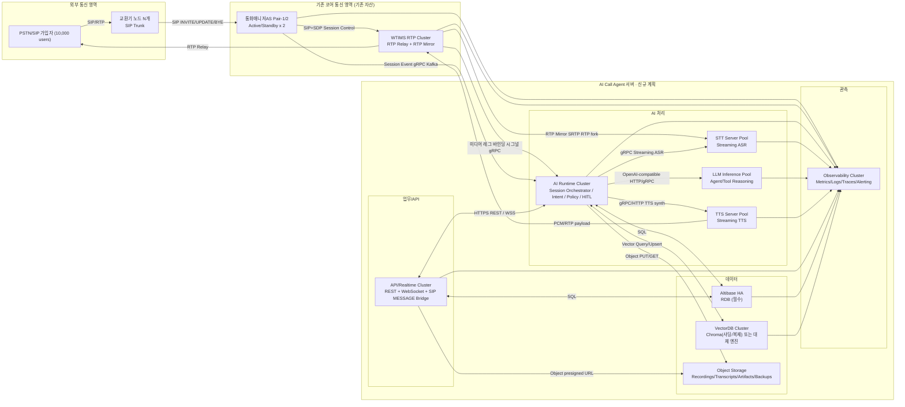
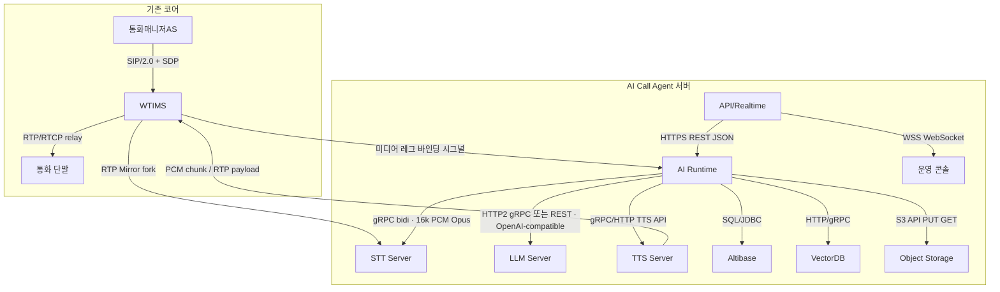
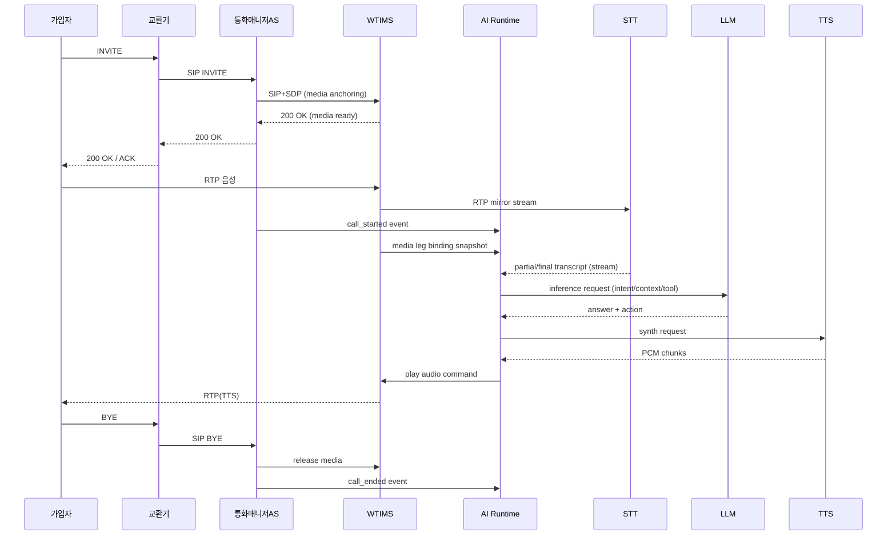
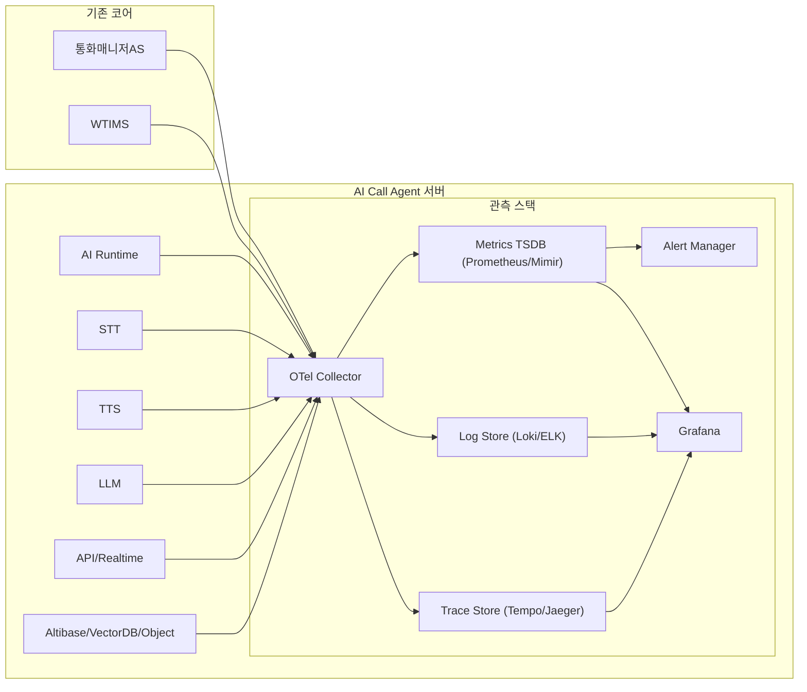

# SmartPBX AI - Production Deployment Architecture
## 상용 적용 상세 아키텍처 (기존 교환기/통화매니저AS/WTIMS 활용)

본 문서는 실제 상용 목표 용량을 기준으로, 이미 보유한 통신 노드(교환기, 통화매니저AS, WTIMS)를 활용하여 AI 확장 계층(STT/TTS/LLM/API/Runtime/DB/관측)을 설계한다.

| 항목 | 내용 |
|------|------|
| 용량 목표 | 가입자 10,000명, 50 CPS, 평균 통화 유지 120초 |
| 동시세션 산정 | `50 CPS x 120s = 6,000 동시 세션` |
| 기존 자산 | 교환기 N개, 통화매니저AS 2 Pair(A/S), WTIMS RTP 서버 |
| 신규 구축 | **AI Call Agent 서버** 묶음: STT, TTS, LLM, AI Runtime, API/Realtime, 데이터(Altibase/VectorDB/Object), Observability |
| DB 제약 | RDB는 Altibase 사용 필수 |

---

## 1) 설계 전제 및 해석

### 1.1 용량 해석

- **동시세션**: 6,000호 (Busy Hour 기준)
- **CPS**: 50 INVITE/s 지속 유입
- **AI 적용률 가정**: 70% (나머지는 단순 연결/전달/정책 처리)
- **실시간 AI 활성 구간 가정**:
  - STT 활성 스트림: `6,000 x 0.7 = 4,200`
  - TTS 활성 채널: `6,000 x 0.7 x 0.6 = 2,520`
  - LLM 동시 생성 요청: `6,000 x 0.7 x 0.15 = 630`

### 1.2 기존 노드 활용 원칙

1. **LB 없음**: 외부 교환기 N개가 분산 진입점 역할 수행
2. **SIP Core 신규 구축 없음**: 통화매니저AS(Active/Standby 2 Pair) 활용
3. **RTP Core 신규 구축 없음**: WTIMS가 RTP Relay 수행
4. **신규 개발 포인트**: WTIMS RTP 복제(fork/mirror) -> STT 파이프라인 연계 + **미디어 레그 바인딩 시그널** -> AI Runtime 연계(호 처리 시작 시 미디어·세션 상관관계 확보)

---

### 1.3 런타임 경계·책임 분리 (초안)

배포 단위 **AI Call Agent 서버** 안에서도, 운영·장애·스케일 관점에서 다음 **런타임 경계**를 구분해 두면 추후 서비스 분할·팀 경계·릴리즈 전략을 정하기 쉽다.

| 경계 | 주요 책임 | 비고 |
|------|-----------|------|
| **미디어 평면** | WTIMS: RTP relay/mirror, 플레이아웃 슬롯, 코덱·타임스탬프 단위 제어 | 지연·버퍼·패킷 손실에 민감 |
| **세션·시그널 평면** | 통화매니저AS: SIP 상태·호 진행, 세션 ID 권위 | 권위 있는 호 생명주기 이벤트 |
| **미디어 바인딩 시그널** | WTIMS → AI Runtime: 미디어 레그 준비·갱신·해제, mirror/STT/TTS와 연결할 식별자 | SIP 전체를 복제하지 않고 **미디어 관점 스냅샷**만 전달 |
| **오케스트레이션** | AI Runtime: 의도·정책·HITL·추론 라우팅 | 허브 비대화 방지를 위해 내부 모듈·API 세분화 검토 |
| **추론 평면** | STT / TTS / LLM | GPU·큐·모델 버전 단위 스케일 |
| **북남 API** | API/Realtime: REST/WSS·운영 UI·SIP MESSAGE 브릿지 | 인증·레이트리밋·공격면이 코어와 다름 |
| **데이터 평면** | Altibase·VectorDB·Object Storage | 트랜잭션·벡터 검색·Blob 용도 분리 |

**API ↔ Altibase 직접 SQL**은 가능하지만, 스키마·트랜잭션 경계가 AI Runtime 경유와 달라지지 않도록 **읽기 전용 조회·CQRS·권한 모델**을 초기에 고정하는 것을 권장한다.

---

### 1.4 호 처리 시작: 세션 시그널과 미디어 시그널 (WTIMS → AI Runtime)

현재 문서는 **WTIMS → STT(RTP mirror)** 미디어 경로가 명시되어 있다. 실제 호 처리에서는 AI Runtime이 **호 단위 컨텍스트**(어떤 세션의 어떤 미디어 레그인지, 어떤 mirror 엔드포인트와 상관되는지)를 먼저 알아야 STT·TTS·정책이 같은 호에 매핑된다.

**제안: 통화매니저AS 이벤트와 WTIMS 시그널을 함께 쓴다.**

| 출처 | 역할 | AI Runtime이 받는 정보 예시 |
|------|------|------------------------------|
| **통화매니저AS → AI Runtime** | 호 생명주기 권위·비즈니스 세션 | `call_id`/`dialog_id`, 방향, 서비스 플래그, 정책 이벤트, 종료 |
| **WTIMS → AI Runtime** | 미디어 레그 준비·갱신·해제 | mirror 대상 SSRC/포트·코덱·레그 키, STT로 붙일 스트림 식별자, TTS 삽입 슬롯 식별자, 세션 상관 ID·CM 이벤트와 동일 키 |

**왜 WTIMS에서 보내는가:** 미디어 앵커·포크 타이밍·코덱 협상 결과는 **WTIMS가 최종적으로 안다**. CM 이벤트만으로는 “mirror가 실제로 언제 유효한가”“어떤 RTP 레그가 STT와 1:1인가”를 보장하기 어렵다.

**연동 형태(초안):** gRPC 스트리밍 또는 이벤트 버스에 **정렬 가능한 세션 키**(CM과 동일한 `call_id` 등)를 포함. 순서는 **호 단위로 직렬화**(같은 호의 CM 이벤트와 WT 이벤트가 서로 앞서지 않도록 파티션 키 설계).

**주의:** CM 이벤트와 WT 이벤트가 **중복·역전**할 수 있으므로, AI Runtime은 **상태 머신**(예: `signaled` → `media_ready` → `active` → `closing`)으로 병합하고, 미디어 미준비 시 STT 구독을 지연한다.

---

## 2) 전체 배포 구조 (Mermaid)

### 구조 설명

- 교환기 N개가 외부 트래픽을 분산하므로 별도 LB를 두지 않는다.
- 통화매니저AS는 SIP 세션 상태 머신/호제어를 담당하고, WTIMS는 RTP 실시간 중계를 담당한다.
- **AI Call Agent 서버**는 STT·TTS·LLM·AI Runtime·API/Realtime·데이터 계층·관측 계층을 하나의 신규 구축 묶음으로 본다. 그 안에서 AI Runtime이 통화 이벤트 기반으로 STT/LLM/TTS를 호출하고, 결과 음성을 다시 WTIMS로 전달한다.
- 호 처리 시작 시에는 **통화매니저AS의 세션 이벤트**와 **WTIMS의 미디어 레그 바인딩 시그널**을 함께 받아 호 단위 컨텍스트를 맞춘다(§1.4).
- Altibase는 거래성 데이터(세션, 정책, 예약, 이력), VectorDB는 의미 검색, Object Storage는 대용량 비정형·버전 지속 데이터를 담당한다(§7.3).

---

## 3) 프로토콜/연동 규격 상세

### 연동 규격 제안

- **교환기 <-> 통화매니저AS**: SIP Trunk (UDP/TCP/TLS)
- **통화매니저AS <-> WTIMS**: SIP/SDP 제어 + RTP/RTCP
- **통화매니저AS -> AI Runtime**: 세션·호 생명주기 이벤트(gRPC/Kafka 등), `call_id` 등 상관 식별자
- **WTIMS -> AI Runtime**: 미디어 레그 바인딩·갱신·해제 시그널(gRPC 권장), CM 이벤트와 동일 상관 키·mirror/STT/TTS 바인딩 메타데이터
- **WTIMS -> STT**: RTP mirror stream (codec normalized PCM 16k 권장)
- **AI Runtime <-> STT**: gRPC bidirectional streaming
- **AI Runtime <-> LLM**: OpenAI-compatible REST 또는 gRPC inference API
- **AI Runtime <-> TTS**: gRPC streaming synth (chunked PCM 반환)
- **API/Realtime <-> 운영 콘솔**: HTTPS REST + WSS 이벤트
- **AI/API <-> Altibase**: JDBC/ODBC(SQL)
- **AI <-> VectorDB**: query/upsert API (HTTP/gRPC)
- **AI/API <-> Object Storage**: S3-compatible API

---

## 4) 통화 처리 시퀀스 (Mermaid Sequence)

STT·LLM·TTS·AI Runtime 참여자는 **AI Call Agent 서버** 소속 컴포넌트로 본다. 교환기·통화매니저AS·WTIMS는 기존 코어다.

---

## 5) 서버 역할별 권장 모델 및 스펙

아래 역할군은 **AI Call Agent 서버**를 구성하는 신규 계획 노드다. 기존 코어(교환기·통화매니저AS·WTIMS)는 제외한다.

## 5.1 STT 서버 (내부 구축)

- **권장 모델**
  - 1순위: `NVIDIA NeMo Conformer-CTC (ko fine-tune)`
  - 2순위: `Whisper-large-v3-turbo` (추론 최적화 필요)
- **권장 형태**: GPU inference + gRPC streaming
- **서버 스펙(노드당)**: 32 vCPU / 128 GB RAM / GPU L40S 1장 이상 / NVMe 1 TB
- **처리량 가정**: 600 동시 스트림/노드

## 5.2 TTS 서버 (내부 구축)

- **권장 모델**
  - 1순위: `FastSpeech2 + HiFi-GAN` (한국어 화자 튜닝)
  - 2순위: `VITS 계열` (자연스러움 우선)
- **권장 형태**: gRPC streaming synth + 캐시
- **서버 스펙(노드당)**: 24 vCPU / 96 GB RAM / GPU L40S 1장 / NVMe 1 TB
- **처리량 가정**: 500 동시 합성 채널/노드

## 5.3 LLM 서버 (내부 구축)

- **권장 모델**
  - 운영 기본: `Qwen2.5-14B-Instruct` 또는 `Llama-3.1-8B-Instruct` (저지연)
  - 고정밀 풀: `Qwen2.5-32B` 또는 동급 (복잡 질의 전용)
- **권장 형태**: OpenAI-compatible endpoint + vLLM/TGI
- **서버 스펙(노드당)**: 32 vCPU / 256 GB RAM / GPU L40S 2장 이상 / NVMe 2 TB
- **처리량 가정**: 80 동시 생성 요청/노드 (평균 128~256 tokens)

## 5.4 AI Runtime 서버

- **역할**: 세션 오케스트레이션, 정책 판단, HITL, 도구 호출, STT/TTS/LLM 라우팅
- **서버 스펙(노드당)**: 16 vCPU / 64 GB RAM / NVMe 500 GB
- **처리량 가정**: 1,200 동시 세션/노드

## 5.5 API/Realtime 서버

- **역할**: REST API, 운영 UI, WebSocket 이벤트, SIP MESSAGE 브릿지
- **연동규격**: HTTPS(JSON), WSS, 내부 gRPC/HTTP
- **서버 스펙(노드당)**: 16 vCPU / 32 GB RAM / NVMe 500 GB
- **처리량 가정**: 2,500 동시 WS + 400 rps

---

## 6) 6,000 동시세션 기준 서버 산정표

| 구분 | 계층 | 동시 부하 산정 | 노드당 처리량 가정 | 필요 Active 노드 | 권장 구성(여유 포함) |
|------|------|----------------|--------------------|------------------|----------------------|
| 기존 코어 | 통화매니저AS | 기존 코어 사용 | 기존 Pair 용량 기준 | 기존 2 Pair 활용 | 추가 구축 없음 |
| 기존 코어 | WTIMS RTP | 6,000 RTP 세션 | 800 세션/노드 | 8 | 8 Active + 2 Standby |
| AI Call Agent 서버 | STT | 4,200 스트림 | 600/노드 | 7 | 7 Active + 2 Standby |
| AI Call Agent 서버 | TTS | 2,520 채널 | 500/노드 | 6 | 6 Active + 2 Standby |
| AI Call Agent 서버 | LLM | 630 동시 생성 | 80/노드 | 8 | 8 Active + 2 Standby |
| AI Call Agent 서버 | AI Runtime | 6,000 세션 | 1,200/노드 | 5 | 5 Active + 1 Standby |
| AI Call Agent 서버 | API/Realtime | 10,000 user, 6,000 WS peak | 2,500 WS/노드 | 4 | 4 Active + 1 Standby |
| AI Call Agent 서버 | Altibase | 세션/정책/이력 | DB HA 기준 | 2 | Primary + Standby + Read Replica(권장) |
| AI Call Agent 서버 | VectorDB | 고QPS 검색/업서트 | 200 QPS/샤드 가정 | 4 샤드 | 4 Active + 2 Replica |
| AI Call Agent 서버 | Object Storage | 녹음/아티팩트 저장 | 대역폭 중심 | 2 | 2 Active 또는 관리형 |
| AI Call Agent 서버 | Observability | 전 계층 수집 | 수집량 기준 | 2 | 2 Active(수집/조회 분리 권장) |

> 상기 수치는 초기 계획치이며, 반드시 스테이징에서 50 CPS/120초/6,000 동시세션 부하로 재검증한다.

### 6.1 서버 스펙 최종 요약표 (권장)

| 구분 | 서버 역할 | 권장 대수 (Active+Standby) | CPU | RAM | GPU | 스토리지 | NIC | 비고 |
|------|-----------|-----------------------------|-----|-----|-----|----------|-----|------|
| 기존 코어 | 통화매니저AS | 기존 2 Pair 활용 | 기존 사양 | 기존 사양 | - | 기존 사양 | 기존 사양 | 신규 구축 없음 |
| 기존 코어 | WTIMS RTP | 8 + 2 | 24 vCPU | 64 GB | - | NVMe 1 TB | 10 Gbps | RTP Relay + RTP Mirror |
| AI Call Agent 서버 | STT Server | 7 + 2 | 32 vCPU | 128 GB | L40S x1 | NVMe 1 TB | 10 Gbps | gRPC streaming ASR |
| AI Call Agent 서버 | TTS Server | 6 + 2 | 24 vCPU | 96 GB | L40S x1 | NVMe 1 TB | 10 Gbps | gRPC streaming TTS |
| AI Call Agent 서버 | LLM Server | 8 + 2 | 32 vCPU | 256 GB | L40S x2 | NVMe 2 TB | 25 Gbps | vLLM/TGI 추론 풀 |
| AI Call Agent 서버 | AI Runtime | 5 + 1 | 16 vCPU | 64 GB | - | NVMe 500 GB | 10 Gbps | 세션 오케스트레이션 |
| AI Call Agent 서버 | API/Realtime | 4 + 1 | 16 vCPU | 32 GB | - | NVMe 500 GB | 10 Gbps | REST/WSS 게이트웨이 |
| AI Call Agent 서버 | Altibase | 2 + 1(읽기복제) | 24 vCPU | 128 GB | - | NVMe 2 TB (고IOPS) | 10 Gbps | Primary/Standby/Read |
| AI Call Agent 서버 | VectorDB | 4 + 2 | 24 vCPU | 128 GB | 선택(0~1) | NVMe 2 TB | 10 Gbps | 샤드+레플리카 |
| AI Call Agent 서버 | Object Storage | 2 이상 | 16 vCPU | 64 GB | - | HDD 20 TB + SSD Cache | 10 Gbps | S3 API 호환 |
| AI Call Agent 서버 | Observability | 2 + 1 | 16 vCPU | 64 GB | - | NVMe 2 TB | 10 Gbps | OTel/TSDB/Log/Trace |

### 6.2 목표 용량 대비 계산 체크

- 동시세션 목표: `6,000`
- WTIMS 유효 수용량: `8 active x 800 = 6,400` (약 6.7% 여유, standby 별도)
- STT 유효 수용량: `7 active x 600 = 4,200` (AI 적용률 70% 가정과 정합)
- TTS 유효 수용량: `6 active x 500 = 3,000` (동시 합성 2,520 가정 대비 여유)
- LLM 유효 수용량: `8 active x 80 = 640` (동시 생성 630 가정, 피크 대응은 standby 승격 권장)

---

## 7) DB/스토리지 설계 포인트

### 7.1 Altibase (필수 RDB)

- 저장 대상: 세션 상태, 정책, 예약, 사용자/권한, 운영 이벤트 인덱스
- 구성: Primary/Standby + Read Replica
- 요구사항: WAL/로그 백업, 장애 전환 자동화, PITR 리허설

### 7.2 VectorDB 성능 고려

- Chroma 단일 노드 운영은 6,000 세션 규모에서 병목 가능성이 높다.
- 권장:
  - Chroma 사용 시 샤딩/리드 레플리카/캐시 계층 필수
  - 고부하 검색이 핵심이면 Milvus/Qdrant 계열 PoC 병행 권장

### 7.3 Object Storage 역할

**단순 통화 녹음 전용이 아니다.** Blob·대용량·장기 보관에 적합한 객체를 두는 계층으로, 녹음 외에도 AI 파이프라인 부산물·캐시·아카이브·백업을 포괄한다. RDB·벡터DB와 역할이 겹치지 않게 **“파일 단위·버전·대용량”** 을 기준으로 둔다.

| 용도 | 설명 |
|------|------|
| 통화 녹음 | 원본·혼합 WAV/MP4 등 대용량 미디어, 법적·품질 분쟁 대비 |
| STT 부산물 | 세그먼트 JSON, 화자 분리 청크 등 재처리·디버깅용 중간물 |
| TTS 캐시 | 동일 문구 반복 시 합성 결과 재사용·비용 절감 |
| 모델 입출력 아카이브 | 규정 준수 범위 내 프롬프트·응답·로그 스냅샷 보관 |
| 아티팩트·프로비저닝 | 지식 파일 업로드, 배치 임포트 원본 등 API에서 presigned URL로 오프로드 |
| 백업·스냅샷 | DB 덤프 아닌 **객체 단위** 장기 보관·재해 복구 보조 |

요약하면 Object Storage는 **“통화 파일 저장소”가 아니라 AI·운영 데이터의 Blob 계층**이며, 세션의 권위 있는 상태는 Altibase, 의미 검색은 VectorDB가 담당한다.

---

## 8) Observability 상세

### 핵심 모니터링 지표

- SIP: INVITE 성공률, 4xx/5xx 비율, CPS 실시간
- RTP: packet loss, jitter, one-way delay, mirror backlog
- STT/TTS: p95 latency, timeout ratio, stream drop ratio
- LLM: TTFT, tokens/sec, queue depth, error ratio
- AI Runtime: 세션당 처리시간, HITL 전환율, 실패 복구율
- API/WS: rps, ws fanout delay, reconnect rate
- DB: query p95, lock wait, replication lag

---

## 9) 상용 적용 체크리스트

- [ ] 교환기 N개 -> 통화매니저AS 라우팅 정책 검증
- [ ] WTIMS RTP mirror 기능 개발/검증 완료
- [ ] WTIMS → AI Runtime 미디어 레그 바인딩 시그널 규약·순서·상관 ID 검증
- [ ] Internal STT/TTS/LLM API 스펙 확정(gRPC/REST)
- [ ] AI Runtime 장애 격리(서킷브레이커/타임아웃/재시도) 적용
- [ ] Altibase HA 및 백업/복구 리허설 완료
- [ ] VectorDB 샤딩/복제/캐시 정책 반영
- [ ] 6,000 동시세션 + 50 CPS 부하테스트 통과
- [ ] 관측 대시보드/알람 임계치 운영팀 인수

---

## 10) 결론

본 구조는 기존 통신 코어(교환기/통화매니저AS/WTIMS)를 최대한 재활용하면서, 신규 **AI Call Agent 서버** 묶음(STT/TTS/LLM/Runtime/API/데이터/관측)을 내부화해 주권과 확장성을 확보하는 설계다.  
핵심 성공 요소는 `WTIMS RTP mirror 안정화`, **WTIMS→AI Runtime 미디어 레그 시그널과 통화매니저AS 세션 이벤트의 상관**, `AI Call Agent 서버 프로토콜 표준화`, `6,000 세션 실부하 검증`이다.

