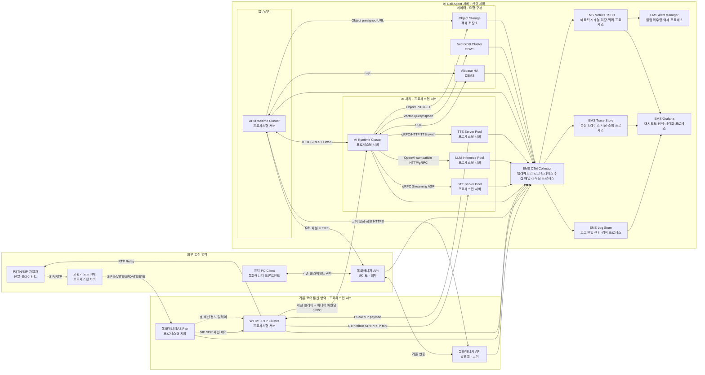
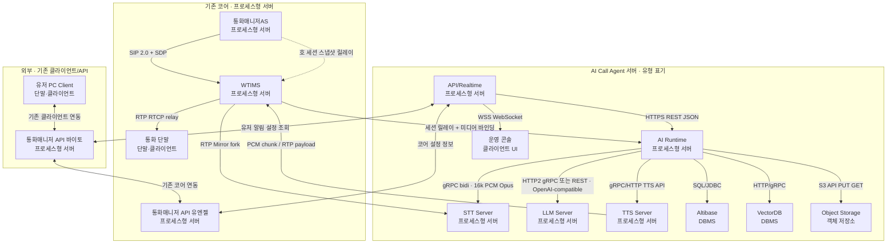
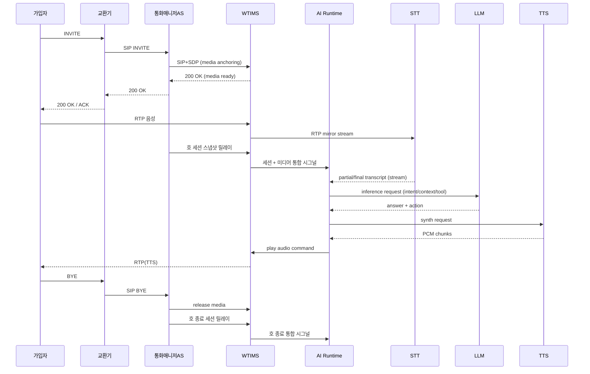
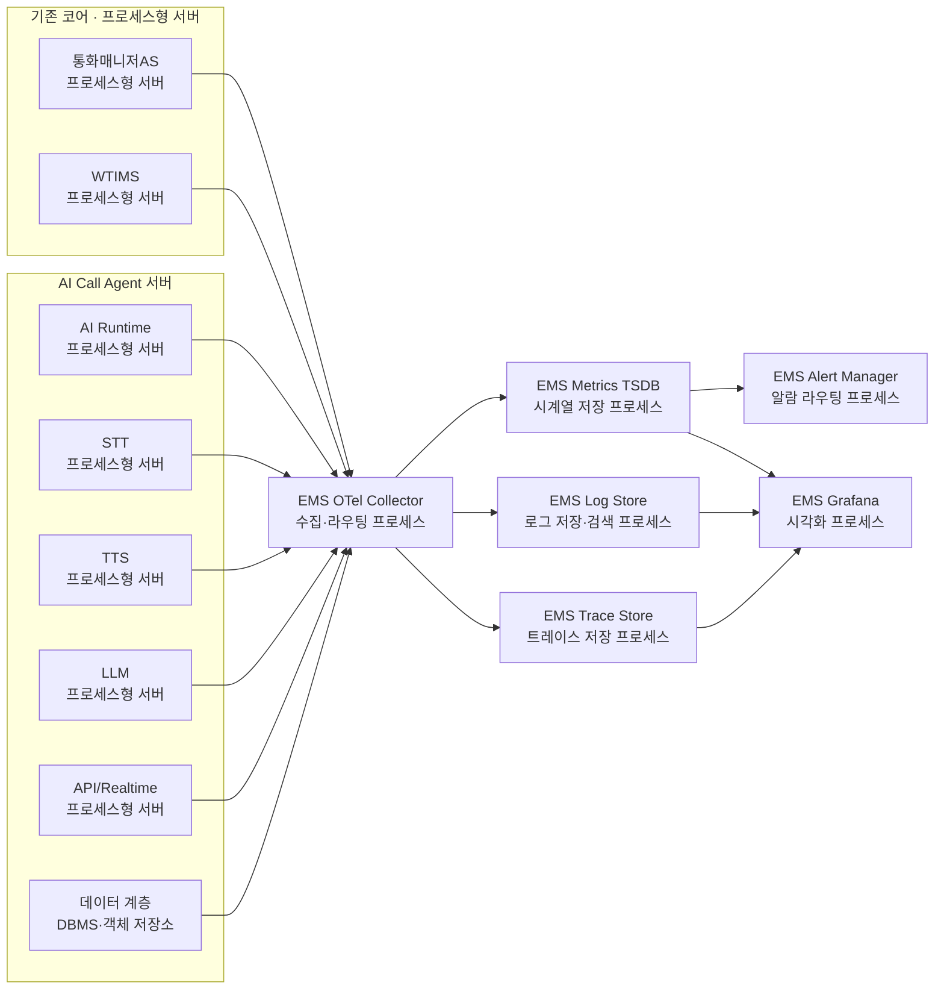

# SmartPBX AI - Production Deployment Architecture
## 상용 적용 상세 아키텍처 (기존 교환기/통화매니저AS/WTIMS 활용)

본 문서는 실제 상용 목표 용량을 기준으로, 이미 보유한 통신 노드(교환기, 통화매니저AS, WTIMS)를 활용하여 AI 확장 계층(STT/TTS/LLM/API/Runtime/DB/**EMS**)을 설계한다.

| 항목 | 내용 |
|------|------|
| 용량 목표 | 가입자 10,000명, 50 CPS, 평균 통화 유지 120초 |
| 동시세션 산정 | `50 CPS x 120s = 6,000 동시 세션` |
| 기존 자산 | 교환기 N개, 통화매니저AS 2 Pair(A/S), WTIMS RTP 서버, **통화매니저 API(유엔젤·코어)** , **통화매니저 API(바이토·외부)** , 유저 PC Client ↔ 바이토 ↔ 유엔젤 기존 연동 |
| 신규 구축 | **AI Call Agent** 신규 계층: STT, TTS, LLM, AI Runtime, API/Realtime, 데이터(Altibase/VectorDB/Object), **EMS**(관측·모니터링 — OTel Collector·Metrics TSDB·Log Store·Trace Store·Alert Manager·Grafana **각각 별도 프로세스**) |
| DB 제약 | RDB는 Altibase 사용 필수 |

---

## 1) 설계 전제 및 해석

### 1.1 용량 해석

- **동시세션**: 6,000호 (Busy Hour 기준)
- **CPS**: 50 INVITE/s 지속 유입
- **AI 적용률 가정**: 70% (나머지는 단순 연결/전달/정책 처리)
- **실시간 AI 활성 구간 가정**:
  - STT 활성 스트림: `6,000 x 0.7 = 4,200`
  - TTS 활성 채널: `6,000 x 0.7 x 0.6 = 2,520`
  - LLM 동시 생성 요청: `6,000 x 0.7 x 0.15 = 630`

### 1.2 기존 노드 활용 원칙

1. **LB 없음**: 외부 교환기 N개가 분산 진입점 역할 수행
2. **SIP Core 신규 구축 없음**: 통화매니저AS(Active/Standby 2 Pair) 활용
3. **RTP Core 신규 구축 없음**: WTIMS가 RTP Relay 수행
4. **신규 개발 포인트**: 통화매니저AS → WTIMS **호 세션 릴레이** + WTIMS RTP 복제 fork/mirror → STT + **WTIMS → AI Runtime 통합 시그널**(세션·미디어)로 호 컨텍스트 단일 진입

---

### 1.3 런타임 경계·책임 분리 (초안)

배포 단위 **AI Call Agent 서버** 안에서도, 운영·장애·스케일 관점에서 다음 **런타임 경계**를 구분해 두면 추후 서비스 분할·팀 경계·릴리즈 전략을 정하기 쉽다.

| 경계 | 주요 책임 | 비고 |
|------|-----------|------|
| **미디어 평면** | WTIMS: RTP relay/mirror, 플레이아웃 슬롯, 코덱·타임스탬프 단위 제어 | 지연·버퍼·패킷 손실에 민감 |
| **세션·시그널 평면** | 통화매니저AS: SIP 상태·호 진행, 세션 ID 권위 | 권위 있는 호 생명주기 이벤트 |
| **세션·미디어 통합 릴레이** | WTIMS → AI Runtime만 단일 진입: 통화매니저AS에서 받은 호 세션 정보를 합쳐 전달 + 미디어 레그 바인딩 | AI Runtime은 **WTIMS 한 경로**만 구독하면 됨(§1.4) |
| **오케스트레이션** | AI Runtime: 의도·정책·HITL·추론 라우팅 | 허브 비대화 방지를 위해 내부 모듈·API 세분화 검토 |
| **추론 평면** | STT / TTS / LLM | GPU·큐·모델 버전 단위 스케일 |
| **외부 API** | API/Realtime: **외부**(브라우저·파트너·운영망)에서 접근하는 REST/WSS·SIP MESSAGE 브릿지 | 코어·내부 서비스와 달리 인증·레이트리밋·공격면을 따로 둔다 |
| **데이터 평면** | Altibase·VectorDB·Object Storage | 트랜잭션·벡터 검색·Blob 용도 분리 |

**API ↔ Altibase 직접 SQL**은 가능하지만, 스키마·트랜잭션 경계가 AI Runtime 경유와 달라지지 않도록 **읽기 전용 조회·CQRS·권한 모델**을 초기에 고정하는 것을 권장한다.

---

### 1.4 호 처리: 통화매니저AS → WTIMS → AI Runtime 릴레이

호 **세션 권위**는 통화매니저AS에 있고, **미디어 앵커·mirror·코덱** 권위는 WTIMS에 있다. AI Runtime이 두 소스를 **각각 직접** 구독하면 연동 지점이 늘고, 이벤트 순서·역전을 AIR에서 병합해야 한다.

**본 문서의 확정 설계:** 통화매니저AS가 AI Runtime에 **직접 연결하지 않는다.** 호에 대한 세션·정책 정보는 **통화매니저AS → WTIMS**로 먼저 전달·릴레이되고, **WTIMS → AI Runtime** 단일 경로로 **세션 필드 + 미디어 레그 바인딩**을 합친 시그널을 보낸다.

| 단계 | 역할 |
|------|------|
| **통화매니저AS → WTIMS** | **SIP 2.0 + SDP + RTP/RTCP**만으로 호·미디어 세션을 제어한다. AI에 필요한 스냅샷·생명주기·정책 식별자는 **JSON 채널이 아니라** SIP 메시지·SDP 본문·**협의된 SIP/SDP 확장**으로 WTIMS에 전달한다. |
| **WTIMS → AI Runtime** | **SIP/SDP로 CM과 맺은 세션**에서 해석한 컨텍스트와, WT의 mirror·STT·TTS 슬롯 메타를 **한 페이로드 또는 동일 스트림**으로 AIR에 전달한다. 외부 API는 **WT→AIR 한 경로**로 단순화한다. |

**장점:** AI Runtime 연동·보안·버저닝·재시도 정책을 **WT→AIR 한 계약**으로 모을 수 있고, CM/AIR 이벤트 역전 문제를 **WT 내부에서 정렬**할 여지가 생긴다.

**주의:** WTIMS는 세션 정보를 **CM으로부터 받아 릴레이**하는 책임을 갖는다. WT 장애 시 AIR로 가는 통합 시그널도 영향을 받으므로 WT HA·백프레셔를 설계한다. 미디어 미준비 시에는 AIR가 STT 구독을 지연하는 등 **상태 머신**은 그대로 유지한다.

---

### 1.5 기존 통화매니저 API·PC Client와 AI Call Agent API 연동

상용 환경에는 이미 다음 **기존 서버·클라이언트**가 존재하며, AI Call Agent의 **API/Realtime Cluster**는 이들과 **별도로 연계**해야 한다.

| 구분 | 구성요소 | 역할 |
|------|-----------|------|
| 기존 코어 | **통화매니저 API 서버(유엔젤)** | 코어 통신 망 내 REST 등으로 **코어 쪽 설정·상태·정보 조회** 등 제공 |
| 외부·중계 | **통화매니저 API 서버(바이토)** | 외부·중계 구역에서 동작하는 API 게이트; **유저 PC Client**와 직접 연동 |
| 단말 | **유저 PC Client** | 통화매니저 프론트엔드 역할; **바이토 API**에 접속 |

**기존 호출 경로(변경 없음):** 유저 PC Client ↔ **바이토 API** ↔ **유엔젤 API**(코어 내부 연동은 조직 표준에 따름).

**AI Call Agent 연결(API/Realtime와의 관계):**

1. **유엔젤 API와 연동** — 코어 통신과 관련된 **설정 반영·상태·정보 조회**가 필요할 때 AI 측 API가 유엔젤 API를 호출하거나, 조직 정책에 따라 **역방향 노티**를 받는다.
2. **바이토 API와 연동** — **유저 PC Client**에 AI 관련 **정보 전달**(알림·목록·설정 화면 데이터), 사용자의 **설정·정보 조회** 요청을 AI 기능과 매핑할 때 바이토 경유 또는 API/Realtime ↔ 바이토 간 규약으로 처리한다.

즉 **운영 콘솔 웹(문서상 별도)** 과 별개로, **실사용자 UI는 유저 PC Client → 바이토 → 유엔젤** 축이며, AI 기능은 **API/Realtime이 유엔젤·바이토 둘 다**와 계약을 맞춘다.

---

## 2) 전체 배포 구조 (Mermaid)



### 구조 설명

- 교환기 N개가 외부 트래픽을 분산하므로 별도 LB를 두지 않는다.
- 통화매니저AS는 SIP 세션 상태 머신/호제어를 담당하고, WTIMS는 RTP 실시간 중계를 담당한다.
- **AI Call Agent 서버** 범위에는 STT·TTS·LLM·AI Runtime·API/Realtime·데이터 계층·**EMS**가 포함된다. **EMS**는 예전 **관측 서버** 역할을 대신하는 명칭이며, **한 박스가 아니라** OTel·Metrics TSDB·Log·Trace·Alert·Grafana **각각을 독립 프로세스**로 둔다. AI Runtime이 통화 이벤트 기반으로 STT/LLM/TTS를 호출하고, 결과 음성을 다시 WTIMS로 전달한다.
- 호 처리 시 세션·미디어 컨텍스트는 **통화매니저AS → WTIMS → AI Runtime**으로 릴레이된다. AI Runtime은 **WTIMS 한 진입점**만 구독한다(§1.4).
- Altibase는 거래성 데이터(세션, 정책, 예약, 이력), VectorDB는 의미 검색, Object Storage는 대용량 비정형·버전 지속 데이터를 담당한다(§7.3).
- 위 Mermaid 박스는 **첫 줄=이름, 둘째 줄=§2.0 구성요소 유형**을 병기했다. **EMS**는 OTel Collector·Metrics TSDB·Log·Trace·Alert·Grafana를 **각각 별도 노드**로 표시한다.
- 도표상 동일한 박스로 보일 수 있으나, 실제로는 **프로세스형 서버·DBMS·객체 저장소·단말/클라이언트**로 구분한다(§2.0).
- 기존 **통화매니저 API(유엔젤·바이토)** 및 **유저 PC Client**와 AI **API/Realtime** 연계는 §1.5 및 본 절 Mermaid를 참고한다.

### 2.0 구성요소 유형 (프로세스 서버 · DBMS · 저장소)

아키텍처 다이어그램의 노드는 모두 “서버 한 대”로 읽히기 쉬우므로, 아래 **형태**로 먼저 구분한다.

| 형태 | 설명 | 해당 예시 (본 문서) |
|------|------|---------------------|
| **프로세스형 서버** | OS 위에 애플리케이션/데몬이 **상시 구동**되는 컴퓨트 노드. CPU·메모리로 요청·스트림을 처리한다. | 교환기 SW, 통화매니저AS, WTIMS, AI Runtime, STT/LLM/TTS, API/Realtime, **EMS**(OTel·TSDB·Log·Trace·Alert·Grafana 각각) |
| **DBMS** | **데이터베이스 엔진**이 상주하고, 클라이언트는 SQL 또는 전용 API로 접속한다. 트랜잭션·인덱스·질의 최적화가 책임이다. | Altibase RDB, VectorDB |
| **객체 저장소** | 블롭·파일 단위 저장, **S3 호환 API**로 PUT/GET. 밑단은 분산 스토리지·디스크 풀일 수 있으나, 아키텍처 표기에서는 **저장 서비스 계층**으로 둔다. | Object Storage |
| **단말·클라이언트** | 우리 쪽에서 상시 서버 프로세스를 띄우는 대상이 아님. | PSTN/SIP 가입자 단말, 통화 단말, **운영 콘솔** 웹 브라우저 |

**구분 시 유의**

- **프로세스형 서버 ≠ “그 안에 DB가 없다”**: 서버 프로세스가 내장 DB를 쓸 수는 있으나, 본 문서에서 **Altibase·VectorDB**는 **별도 DBMS 노드**로 표기한다.
- **객체 저장소 ≠ SAN/NAS 디스크만**: 물리 디스크·어플라이언스가 아니라 **객체 API를 제공하는 저장 스택**(및 그 클러스터)을 의미한다.
- **EMS**(Enterprise Monitoring System, 본 문서 통칭): 과거 **관측 서버** 구역을 대신하는 이름이다. 메트릭·로그·트레이스·알람·대시보드를 담당하며, 구성 요소는 **각각 별도 프로세스(데몬)** 로 배치한다(§2 전개도·§8).

### 2.1 노드·서버별 역할

| 구분 | 형태 | 노드·서버 | 수행 역할 |
|------|------|-----------|-----------|
| 외부 | 단말·클라이언트 | PSTN/SIP 가입자 | 발신·착신 호·미디어 단말 |
| 외부 | 프로세스형 서버 | 교환기 노드 N개 | SIP Trunk 진입·분산·코어로 라우팅, 외부와 코어 사이 게이트 |
| 기존 코어 | 프로세스형 서버 | 통화매니저AS | SIP 세션 상태·호 제어·WTIMS로 SDP/미디어 앵커 제어, **호 세션 스냅샷을 WTIMS로 릴레이**해 AI 경로를 단순화 |
| 기존 코어 | 프로세스형 서버 | WTIMS | RTP/RTCP 릴레이·미러·플레이아웃, STT용 RTP fork, **CM 세션 정보 + 미디어 레그 바인딩을 통합하여 AI Runtime에 단일 시그널** |
| 기존 코어 | 프로세스형 서버 | 통화매니저 API · 유엔젤 | 코어 망 **REST 등** — 코어 통신 **설정·상태·정보 조회**; AI **API/Realtime**과 연동 |
| 외부 | 프로세스형 서버 | 통화매니저 API · 바이토 | 외부·중계 구역 API — **유저 PC Client**와 연동, **유엔젤 API**와 기존 연동 |
| 외부 | 단말·클라이언트 | 유저 PC Client | 통화매니저 **데스크톱·프론트엔드**; **바이토 API**에 접속 |
| AI Call Agent | 프로세스형 서버 | AI Runtime | 호 단위 오케스트레이션·정책·의도·HITL·추론 라우팅, STT/LLM/TTS 호출·WTIMS 재생 명령·DB/스토리지 연계 |
| AI Call Agent | 프로세스형 서버 | STT Server | RTP 미러 또는 오디오 스트림 수신·실시간 문자 변환·부분/최종 텍스트 스트리밍 |
| AI Call Agent | 프로세스형 서버 | LLM Server | 프롬프트 기반 추론·도구/함수 호출 응답·OpenAI 호환 API 제공 |
| AI Call Agent | 프로세스형 서버 | TTS Server | 텍스트→음성 스트리밍 합성·PCM 청크 반환 |
| AI Call Agent | 프로세스형 서버 | API/Realtime | AI Runtime·DB·EMS와 연계; **유엔젤 API**와 코어 설정·조회, **바이토 API**와 유저 PC 경로의 정보·설정 연계 §1.5 |
| AI Call Agent | 단말·클라이언트 | 운영 콘솔 | 브라우저 UI·모니터링·설정·실시간 이벤트 구독 — **유저 PC Client·바이토와 별 축** |
| AI Call Agent | DBMS | Altibase | 트랜잭션형 세션·정책·이력·권한 등 RDB 권위 데이터 |
| AI Call Agent | DBMS | VectorDB | 지식·임베딩 검색·유사도 기반 조회·업서트 |
| AI Call Agent | 객체 저장소 | Object Storage | 녹음·아티팩트·캐시·백업 등 Blob·대용량 객체 저장 |
| AI Call Agent | 프로세스형 서버 | EMS · OTel Collector | 텔레메트리·로그·트레이스 수집·라우팅 |
| AI Call Agent | 프로세스형 서버 | EMS · Metrics TSDB | 메트릭 시계열 저장·쿼리(Prometheus/Mimir 등) |
| AI Call Agent | 프로세스형 서버 | EMS · Log Store | 로그 인입·저장·검색(Loki/ELK 등) |
| AI Call Agent | 프로세스형 서버 | EMS · Trace Store | 분산 트레이스 저장·조회(Tempo/Jaeger 등) |
| AI Call Agent | 프로세스형 서버 | EMS · Alert Manager | 알람 라우팅·억제 |
| AI Call Agent | 프로세스형 서버 | EMS · Grafana | 대시보드·시각화 |

상세 모델·스펙은 §5, 스토리지 용도는 §7 참고.

---

## 3) 프로토콜/연동 규격 상세



### 3.1 연동 규격의 범위

**연동 규격**은 두 컴포넌트가 데이터를 주고받을 때 따르는 **계약**이다. 다음을 문서·스키마 버전과 함께 고정하는 것을 권장한다.

- **전송**: TLS 필수 구간, 내부망은 mTLS 또는 네트워크 분리 + 서비스 계정
- **식별·상관**: `call_id`, `trace_id`·W3C `traceparent`, 스트림·레그 단위 `stream_id` / `leg_id`
- **스키마 버전**: gRPC·Kafka·REST 등 **문자 기반 페이로드**에 `specversion` 또는 `schema_version`. **통화매니저AS ↔ WTIMS** 구간은 SIP/SDP이므로 이 항목의 적용 대상이 아니다.
- **멱등·재시도**: HTTP `Idempotency-Key`, 메시지 소비는 최소 한 번 + 업스트림 멱등 설계
- **오류**: HTTP 상태·gRPC `status`, 애플리케이션 오류 코드·재시도 가능 여부
- **시간 제약**: STT/미디어는 저지연, LLM은 큐·타임아웃 별도, 이벤트는 소비 지연 허용 범위 명시

아래 **예제는 설계·프로토타입용 의사 샘플**이며, 필드명·타입은 실제 구현 시 proto/OpenAPI로 확정한다.

### 3.2 연동 규격 요약표

연결 **양단의 형태**(프로세스형 서버 / DBMS / 객체 저장소 / 단말)는 §2.0·§2.1과 같다. DBMS·객체 저장소는 **접속 클라이언트가 프로세스형 서버**인 경우가 많다.

| 연동 | 프로토콜·형식 | 방향 | 핵심 내용 |
|------|----------------|------|-----------|
| 교환기 ↔ 통화매니저AS | SIP 2.0, SDP, UDP/TCP/TLS | 양방향 | Trunk, INVITE/ACK/BYE, 코덱·미디어 협상 |
| 통화매니저AS ↔ WTIMS | **SIP 2.0 + SDP + RTP/RTCP** | 양방향 | 미디어 앵커·세션 제어; 호 상관·테넌트 등 AI 연계 메타는 **SIP 헤더·SDP 속성·협의된 SDP 필드** 등으로 전달. **CM↔WT 구간은 JSON 페이로드 규격으로 두지 않는다.** WT는 여기서 확보한 세션 정보와 미디어 메타를 합쳐 AIR로 내보낸다 |
| WTIMS → AI Runtime | gRPC 또는 Kafka JSON 스트림 | WT→AIR | **세션 릴레이 필드 + 미디어 레그 바인딩** 통합, `call_id` 필수. AIR는 CM 직접 연동 없음 |
| WTIMS → STT | RTP 또는 SRTP 미러 | WT→STT | PCM 16 kHz mono 등 사전 합의 코덱 |
| AI Runtime ↔ STT | gRPC bidi, 오디오 프레임 + 메타 | 양방향 | 세션 메타 첫 프레임·부분/최종 텍스트 스트림 |
| AI Runtime ↔ LLM | HTTPS JSON OpenAI 호환 또는 gRPC | AIR→LLM | `/v1/chat/completions` 등, 스트리밍 옵션 |
| AI Runtime ↔ TTS | gRPC 또는 HTTP 스트리밍 | AIR→TTS | 텍스트 입력·PCM 청크 출력 |
| TTS → WTIMS | 제어 채널 + 페이로드 | TTS→WT | 재생 슬롯·버퍼 식별자 합의 |
| API/Realtime ↔ AI Runtime | HTTPS JSON, 내부 gRPC | 양방향 | 운영·세션 제어·조회 |
| API/Realtime ↔ 통화매니저 API 유엔젤 | HTTPS REST 등·사내 규약 | 양방향 | **코어** 통신 설정·상태·정보 조회·반영 |
| API/Realtime ↔ 통화매니저 API 바이토 | HTTPS REST 등·사내 규약 | 양방향 | **유저 PC Client** 경로로 정보 전달·설정·조회 연계 |
| 유저 PC Client ↔ 통화매니저 API 바이토 | 기존 클라이언트 프로토콜 | 양방향 | 데스크톱 프론트엔드 — AI 확장 전제 유지 |
| 통화매니저 API 바이토 ↔ 유엔젤 | 기존 연동 규약 | 양방향 | 조직 내 표준 유지 |
| API/Realtime ↔ 운영 콘솔 | HTTPS, WSS JSON | 양방향 | 구독 토픽·이벤트 페이로드 스키마 |
| AI Runtime·API ↔ Altibase | JDBC/SQL, 커넥션 풀 | 클라이언트→DB | 트랜잭션 경계·읽기 전용 계정 분리 권장 |
| AI Runtime ↔ VectorDB | HTTP/gRPC JSON | AIR→VDB | 컬렉션·벡터 차원·메타데이터 |
| AI Runtime·API ↔ Object Storage | S3 API, presigned URL | 클라이언트→OBJ | 버킷·키 규칙·수명·IAM |

### 3.3 연동 규격 예제

#### A. 통화매니저AS ↔ WTIMS (SIP/SDP 예시)

CM과 WT 사이 호·미디어 제어는 **JSON이 아니라 SIP와 SDP**(데이터는 RTP/RTCP)로 한다. 아래는 의사 샘플이며, `Call-ID`·SDP의 `c=`/`m=`/`a=` 등 실제 필드와 조직 내 확장 헤더 규약으로 확정한다.

```http
INVITE sip:media@wtims.example.com SIP/2.0
Via: SIP/2.0/UDP cm.example.com;branch=z9hG4bK776asdhds
Max-Forwards: 70
From: <sip:+821012345678@cm.example.com>;tag=1928301774
To: <sip:media@wtims.example.com>
Call-ID: cm-7f3a9b2c-001@cm.example.com
CSeq: 1 INVITE
Contact: <sip:cm.example.com:5060>
Content-Type: application/sdp
X-Tenant-Id: tenant-01

v=0
o=CM 123456789 123456789 IN IP4 203.0.113.10
s=SmartPBX
c=IN IP4 203.0.113.20
t=0 0
m=audio 49170 RTP/AVP 0 8
a=rtpmap:0 PCMU/8000
```

DNIS·서비스 프로파일 등은 **별도 JSON 파일이 아니라** SIP `Request-URI`/`To`, `P-` 또는 사내 확장 헤더·SDP `a=` 라인 등으로 옮길지 정책으로 확정한다.

#### B. WTIMS → AI Runtime 통합 시그널 (세션 릴레이 + 미디어 레그)

WTIMS가 **SIP/SDP로 CM과 맺은 세션**에서 해석한 필드와 자체 미디어 메타를 **한 페이로드**로 AIR에 전달하는 예이다(gRPC·Kafka 등 **WT→AIR만 JSON/바이너리 규약**). 미디어 미준비 구간은 `media` 생략 또는 `state`로 표현할 수 있다.

```json
{
  "schema_version": "1.0",
  "event_type": "call.context_and_media",
  "occurred_at": "2026-05-07T12:34:56.801Z",
  "call_id": "cm-7f3a9b2c-001",
  "session_relay": {
    "direction": "inbound",
    "service_profile": "ai_voice_agent",
    "dnis": "023331234",
    "tenant_id": "tenant-01"
  },
  "leg_id": "wt-leg-a1",
  "mirror": {
    "stt_stream_key": "stt-stream-9x4k",
    "codec": "pcm_s16le",
    "sample_rate_hz": 16000,
    "channels": 1
  },
  "tts": {
    "inject_slot_id": "tts-slot-3"
  }
}
```

#### C. AI Runtime ↔ STT gRPC 스트림 첫 메타데이터 (개념 예시, JSON 등가)

스트림 오픈 직후 한 번 보내는 헤더 프레임 개념이다.

```json
{
  "call_id": "cm-7f3a9b2c-001",
  "stt_stream_key": "stt-stream-9x4k",
  "language": "ko-KR",
  "partial_results": true
}
```

#### D. AI Runtime → LLM OpenAI 호환 Chat Completion (요청 예시)

```http
POST /v1/chat/completions HTTP/1.1
Host: llm-internal.example.com
Authorization: Bearer ${SERVICE_TOKEN}
Content-Type: application/json
```

```json
{
  "model": "qwen2.5-14b-instruct",
  "stream": true,
  "messages": [
    { "role": "system", "content": "You are a call-center assistant. Reply in Korean." },
    { "role": "user", "content": "예약 가능한 시간 알려줘." }
  ]
}
```

#### E. AI Runtime → TTS 스트리밍 합성 시작 (바디 예시)

```json
{
  "voice_id": "ko-KR-female-01",
  "text": "내일 오전 10시로 예약했습니다.",
  "audio_format": "pcm_s16le",
  "sample_rate_hz": 16000,
  "call_id": "cm-7f3a9b2c-001"
}
```

#### F. AI Runtime → WTIMS 재생 명령 (제어 API 예시)

실제 전송은 사내 RPC·REST 중 선택; 페이로드 개념만 정리한다.

```json
{
  "call_id": "cm-7f3a9b2c-001",
  "inject_slot_id": "tts-slot-3",
  "action": "enqueue_pcm",
  "seq_base": 1000,
  "total_frames_hint": 2400
}
```

#### G. API/Realtime → AI Runtime 내부 조회 (REST 예시)

```http
GET /internal/v1/sessions/cm-7f3a9b2c-001/summary HTTP/1.1
Host: api-realtime.internal
X-Service-Auth: Bearer ${API_TOKEN}
```

#### H. 운영 콘솔 WebSocket 이벤트 (서버 → 브라우저)

```json
{
  "type": "call.event",
  "call_id": "cm-7f3a9b2c-001",
  "payload": {
    "state": "active",
    "hitl_pending": false
  }
}
```

#### I. VectorDB 문서 업서트 (HTTP JSON 예시)

```json
{
  "collection": "kb_prod",
  "id": "doc-uuid-1234",
  "embedding": [0.01, -0.02, 0.003],
  "metadata": { "source": "faq", "tenant_id": "tenant-01" }
}
```

임베딩 벡터는 차원에 맞는 실수 배열로 전송한다.

#### J. Object Storage presigned PUT 발급 응답 (개념)

```json
{
  "method": "PUT",
  "url": "https://obj.example.com/bucket/rec/cm-7f3a9b2c/mix.wav?X-Amz-Algorithm=...",
  "headers": {
    "Content-Type": "audio/wav"
  },
  "expires_at": "2026-05-07T12:44:56Z"
}
```

### 3.4 연동 규격 제안 (체크리스트)

- **통화매니저 API 유엔젤 ↔ AI API/Realtime**: 코어 설정·조회 스키마·인증·레이트리밋 §1.5
- **통화매니저 API 바이토 ↔ AI API/Realtime**: 유저 PC 경로 정보·설정 연계 스키마 §1.5
- **교환기 <-> 통화매니저AS**: SIP Trunk (UDP/TCP/TLS)
- **통화매니저AS <-> WTIMS**: **SIP 2.0 + SDP + RTP/RTCP**만 사용. 호 세션·스냅샷·생명주기 표현도 **동일 구간의 SIP/SDP·협의 헤더**로 한다(JSON 전용 CM↔WT 채널 없음). AIR 직접 연동 없음
- **WTIMS -> AI Runtime**: 세션 릴레이 + 미디어 레그 바인딩 **통합 시그널**(gRPC/Kafka 등), `call_id` 상관·갱신·해제 포함
- **WTIMS -> STT**: RTP mirror stream (codec normalized PCM 16k 권장)
- **AI Runtime <-> STT**: gRPC bidirectional streaming
- **AI Runtime <-> LLM**: OpenAI-compatible REST 또는 gRPC inference API
- **AI Runtime <-> TTS**: gRPC streaming synth (chunked PCM 반환)
- **API/Realtime <-> 운영 콘솔**: HTTPS REST + WSS 이벤트
- **AI/API <-> Altibase**: JDBC/ODBC(SQL)
- **AI <-> VectorDB**: query/upsert API (HTTP/gRPC)
- **AI/API <-> Object Storage**: S3-compatible API

---

## 4) 통화 처리 시퀀스 (Mermaid Sequence)

STT·LLM·TTS·AI Runtime 참여자는 **AI Call Agent 서버** 소속 컴포넌트로 본다. 교환기·통화매니저AS·WTIMS는 기존 코어다.



---

## 5) 서버 역할별 권장 모델 및 스펙

아래 역할군은 **AI Call Agent 서버**를 구성하는 신규 계획 노드다. 기존 코어(교환기·통화매니저AS·WTIMS)는 제외한다.  
**통화매니저 API(유엔젤·바이토)** 및 **유저 PC Client**는 §1.5 기존 자산이며 본 절 노드 스펙 표에는 포함하지 않는다.

## 5.1 STT 서버 (내부 구축)

- **권장 모델**
  - 1순위: `NVIDIA NeMo Conformer-CTC (ko fine-tune)`
  - 2순위: `Whisper-large-v3-turbo` (추론 최적화 필요)
- **권장 형태**: GPU inference + gRPC streaming
- **서버 스펙(노드당)**: 32 vCPU / 128 GB RAM / GPU L40S 1장 이상 / NVMe 1 TB
- **처리량 가정**: 600 동시 스트림/노드

## 5.2 TTS 서버 (내부 구축)

- **권장 모델**
  - 1순위: `FastSpeech2 + HiFi-GAN` (한국어 화자 튜닝)
  - 2순위: `VITS 계열` (자연스러움 우선)
- **권장 형태**: gRPC streaming synth + 캐시
- **서버 스펙(노드당)**: 24 vCPU / 96 GB RAM / GPU L40S 1장 / NVMe 1 TB
- **처리량 가정**: 500 동시 합성 채널/노드

## 5.3 LLM 서버 (내부 구축)

- **권장 모델**
  - 운영 기본: `Qwen2.5-14B-Instruct` 또는 `Llama-3.1-8B-Instruct` (저지연)
  - 고정밀 풀: `Qwen2.5-32B` 또는 동급 (복잡 질의 전용)
- **권장 형태**: OpenAI-compatible endpoint + vLLM/TGI
- **서버 스펙(노드당)**: 32 vCPU / 256 GB RAM / GPU L40S 2장 이상 / NVMe 2 TB
- **처리량 가정**: 80 동시 생성 요청/노드 (평균 128~256 tokens)

## 5.4 AI Runtime 서버

- **역할**: 세션 오케스트레이션, 정책 판단, HITL, 도구 호출, STT/TTS/LLM 라우팅
- **서버 스펙(노드당)**: 16 vCPU / 64 GB RAM / NVMe 500 GB
- **처리량 가정**: 1,200 동시 세션/노드

## 5.5 API/Realtime 서버

- **역할**: REST API, 운영 UI, WebSocket 이벤트, SIP MESSAGE 브릿지
- **레거시 연동**: 통화매니저 API 유엔젤(코어)·바이토(외부)와 코어 설정·조회 및 유저 PC 경로 알림·설정 연계는 REST 등 규약을 §1.5와 운영 협의로 확정한다.
- **연동규격**: HTTPS(JSON), WSS, 내부 gRPC/HTTP
- **서버 스펙(노드당)**: 16 vCPU / 32 GB RAM / NVMe 500 GB
- **처리량 가정**: 2,500 동시 WS + 400 rps

---

## 6) 6,000 동시세션 기준 서버 산정표

| 구분 | 계층 | 동시 부하 산정 | 노드당 처리량 가정 | 필요 Active 노드 | 권장 구성(여유 포함) |
|------|------|----------------|--------------------|------------------|----------------------|
| 기존 코어 | 통화매니저AS | 기존 코어 사용 | 기존 Pair 용량 기준 | 기존 2 Pair 활용 | 추가 구축 없음 |
| 기존 코어 | WTIMS RTP | 6,000 RTP 세션 | 800 세션/노드 | 8 | 8 Active + 2 Standby |
| AI Call Agent 서버 | STT | 4,200 스트림 | 600/노드 | 7 | 7 Active + 2 Standby |
| AI Call Agent 서버 | TTS | 2,520 채널 | 500/노드 | 6 | 6 Active + 2 Standby |
| AI Call Agent 서버 | LLM | 630 동시 생성 | 80/노드 | 8 | 8 Active + 2 Standby |
| AI Call Agent 서버 | AI Runtime | 6,000 세션 | 1,200/노드 | 5 | 5 Active + 1 Standby |
| AI Call Agent 서버 | API/Realtime | 10,000 user, 6,000 WS peak | 2,500 WS/노드 | 4 | 4 Active + 1 Standby |
| AI Call Agent 서버 | Altibase | 세션/정책/이력 | DB HA 기준 | 2 | Primary + Standby + Read Replica(권장) |
| AI Call Agent 서버 | VectorDB | 고QPS 검색/업서트 | 200 QPS/샤드 가정 | 4 샤드 | 4 Active + 2 Replica |
| AI Call Agent 서버 | Object Storage | 녹음/아티팩트 저장 | 대역폭 중심 | 2 | 2 Active 또는 관리형 |
| AI Call Agent 서버 | EMS · OTel Collector | 전 계층 텔레메트리 인입 | 수집 파이프 처리량 | 2 | 2 Active + 1 Standby |
| AI Call Agent 서버 | EMS · Metrics TSDB | 메트릭 장기 저장·알람 입력 | 시계열 카드널리티 | 2 | HA 페어 권장 |
| AI Call Agent 서버 | EMS · Log Store | 로그 인입·보관 | 초당 로그량·보존기간 | 2 | 샤딩·복제 |
| AI Call Agent 서버 | EMS · Trace Store | 트레이스 저장·조회 | 스팬 수신량 | 2 | HA 또는 분산 |
| AI Call Agent 서버 | EMS · Alert Manager | 알람 라우팅 | 규칙·채널 수 | 1 | Active + Standby |
| AI Call Agent 서버 | EMS · Grafana | 대시보드·조회 UI | 동시 조회·패널 수 | 2 | Active 이중화 또는 무중단 배포 |

> 상기 수치는 초기 계획치이며, 반드시 스테이징에서 50 CPS/120초/6,000 동시세션 부하로 재검증한다.

### 6.1 서버 스펙 최종 요약표 (권장)

| 구분 | 서버 역할 | 권장 대수 (Active+Standby) | CPU | RAM | GPU | 스토리지 | NIC | 비고 |
|------|-----------|-----------------------------|-----|-----|-----|----------|-----|------|
| 기존 코어 | 통화매니저AS | 기존 2 Pair 활용 | 기존 사양 | 기존 사양 | - | 기존 사양 | 기존 사양 | 신규 구축 없음 |
| 기존 코어 | WTIMS RTP | 8 + 2 | 24 vCPU | 64 GB | - | NVMe 1 TB | 10 Gbps | RTP Relay + RTP Mirror |
| AI Call Agent 서버 | STT Server | 7 + 2 | 32 vCPU | 128 GB | L40S x1 | NVMe 1 TB | 10 Gbps | gRPC streaming ASR |
| AI Call Agent 서버 | TTS Server | 6 + 2 | 24 vCPU | 96 GB | L40S x1 | NVMe 1 TB | 10 Gbps | gRPC streaming TTS |
| AI Call Agent 서버 | LLM Server | 8 + 2 | 32 vCPU | 256 GB | L40S x2 | NVMe 2 TB | 25 Gbps | vLLM/TGI 추론 풀 |
| AI Call Agent 서버 | AI Runtime | 5 + 1 | 16 vCPU | 64 GB | - | NVMe 500 GB | 10 Gbps | 세션 오케스트레이션 |
| AI Call Agent 서버 | API/Realtime | 4 + 1 | 16 vCPU | 32 GB | - | NVMe 500 GB | 10 Gbps | REST/WSS 게이트웨이 |
| AI Call Agent 서버 | Altibase | 2 + 1(읽기복제) | 24 vCPU | 128 GB | - | NVMe 2 TB (고IOPS) | 10 Gbps | Primary/Standby/Read |
| AI Call Agent 서버 | VectorDB | 4 + 2 | 24 vCPU | 128 GB | 선택(0~1) | NVMe 2 TB | 10 Gbps | 샤드+레플리카 |
| AI Call Agent 서버 | Object Storage | 2 이상 | 16 vCPU | 64 GB | - | HDD 20 TB + SSD Cache | 10 Gbps | S3 API 호환 |
| AI Call Agent 서버 | EMS · OTel Collector | 2 + 1 | 8 vCPU | 32 GB | - | NVMe 500 GB | 10 Gbps | 수집·배압·라우팅 |
| AI Call Agent 서버 | EMS · Metrics TSDB | 2 + 1 | 16 vCPU | 64 GB | - | NVMe 2 TB | 10 Gbps | Prom/Mimir 등 |
| AI Call Agent 서버 | EMS · Log Store | 2 + 1 | 16 vCPU | 64 GB | - | NVMe 2 TB | 10 Gbps | Loki/ELK 등 |
| AI Call Agent 서버 | EMS · Trace Store | 2 + 0 | 16 vCPU | 64 GB | - | NVMe 1 TB | 10 Gbps | Tempo/Jaeger 등 |
| AI Call Agent 서버 | EMS · Alert Manager | 1 + 1 | 8 vCPU | 16 GB | - | NVMe 200 GB | 1 Gbps | Alertmanager |
| AI Call Agent 서버 | EMS · Grafana | 2 + 0 | 8 vCPU | 32 GB | - | NVMe 200 GB | 10 Gbps | 대시보드·읽기 |

### 6.2 목표 용량 대비 계산 체크

- 동시세션 목표: `6,000`
- WTIMS 유효 수용량: `8 active x 800 = 6,400` (약 6.7% 여유, standby 별도)
- STT 유효 수용량: `7 active x 600 = 4,200` (AI 적용률 70% 가정과 정합)
- TTS 유효 수용량: `6 active x 500 = 3,000` (동시 합성 2,520 가정 대비 여유)
- LLM 유효 수용량: `8 active x 80 = 640` (동시 생성 630 가정, 피크 대응은 standby 승격 권장)

---

## 7) DB/스토리지 설계 포인트

### 7.1 Altibase (필수 RDB)

- 저장 대상: 세션 상태, 정책, 예약, 사용자/권한, 운영 이벤트 인덱스
- 구성: Primary/Standby + Read Replica
- 요구사항: WAL/로그 백업, 장애 전환 자동화, PITR 리허설

### 7.2 VectorDB 성능 고려

- Chroma 단일 노드 운영은 6,000 세션 규모에서 병목 가능성이 높다.
- 권장:
  - Chroma 사용 시 샤딩/리드 레플리카/캐시 계층 필수
  - 고부하 검색이 핵심이면 Milvus/Qdrant 계열 PoC 병행 권장

### 7.3 Object Storage 역할

**단순 통화 녹음 전용이 아니다.** Blob·대용량·장기 보관에 적합한 객체를 두는 계층으로, 녹음 외에도 AI 파이프라인 부산물·캐시·아카이브·백업을 포괄한다. RDB·벡터DB와 역할이 겹치지 않게 **“파일 단위·버전·대용량”** 을 기준으로 둔다.

| 용도 | 설명 |
|------|------|
| 통화 녹음 | 원본·혼합 WAV/MP4 등 대용량 미디어, 법적·품질 분쟁 대비 |
| STT 부산물 | 세그먼트 JSON, 화자 분리 청크 등 재처리·디버깅용 중간물 |
| TTS 캐시 | 동일 문구 반복 시 합성 결과 재사용·비용 절감 |
| 모델 입출력 아카이브 | 규정 준수 범위 내 프롬프트·응답·로그 스냅샷 보관 |
| 아티팩트·프로비저닝 | 지식 파일 업로드, 배치 임포트 원본 등 API에서 presigned URL로 오프로드 |
| 백업·스냅샷 | DB 덤프 아닌 **객체 단위** 장기 보관·재해 복구 보조 |

요약하면 Object Storage는 **“통화 파일 저장소”가 아니라 AI·운영 데이터의 Blob 계층**이며, 세션의 권위 있는 상태는 Altibase, 의미 검색은 VectorDB가 담당한다.

---

## 8) EMS(Enterprise Monitoring System) 상세

**EMS**는 본 문서에서 **관측 서버**(메트릭·로그·트레이스·알람·대시보드) 역할을 통칭한다. **단일 “관측 서버 묶음”으로 그리지 않고**, 아래 **프로세스(서비스·데몬) 단위**로 나누어 배포·스케일한다.

| EMS 프로세스 | 담당 기능 | 제품 예시 |
|--------------|-----------|-----------|
| OTel Collector | 메트릭·로그·트레이스 수집·배압·라우팅 | OpenTelemetry Collector |
| Metrics TSDB | 메트릭 시계열 저장·쿼리·알람 소스 | Prometheus, Mimir |
| Log Store | 로그 인입·색인·검색 | Loki, ELK |
| Trace Store | 분산 트레이스 저장·조회 | Tempo, Jaeger |
| Alert Manager | 알람 라우팅·억제·통합 | Alertmanager 등 |
| Grafana | 대시보드·시각화·탐색 UI | Grafana |



### 핵심 모니터링 지표

- SIP: INVITE 성공률, 4xx/5xx 비율, CPS 실시간
- RTP: packet loss, jitter, one-way delay, mirror backlog
- STT/TTS: p95 latency, timeout ratio, stream drop ratio
- LLM: TTFT, tokens/sec, queue depth, error ratio
- AI Runtime: 세션당 처리시간, HITL 전환율, 실패 복구율
- API/WS: rps, ws fanout delay, reconnect rate
- DB: query p95, lock wait, replication lag

---

## 9) 상용 적용 체크리스트

- [ ] 교환기 N개 -> 통화매니저AS 라우팅 정책 검증
- [ ] WTIMS RTP mirror 기능 개발/검증 완료
- [ ] 통화매니저AS→WTIMS 호 세션 릴레이 및 WTIMS→AI Runtime **통합 시그널** 규약·순서·`call_id` 상관 검증
- [ ] Internal STT/TTS/LLM API 스펙 확정(gRPC/REST)
- [ ] AI Runtime 장애 격리(서킷브레이커/타임아웃/재시도) 적용
- [ ] 통화매니저 API 유엔젤 ↔ AI API/Realtime 연동(코어 설정·정보 조회, 인증·레이트리밋) 검증
- [ ] 통화매니저 API 바이토 ↔ AI API/Realtime 연동(유저 PC Client 정보·설정·조회 경로) 검증
- [ ] Altibase HA 및 백업/복구 리허설 완료
- [ ] VectorDB 샤딩/복제/캐시 정책 반영
- [ ] 6,000 동시세션 + 50 CPS 부하테스트 통과
- [ ] EMS 대시보드·알람 임계치 운영팀 인수(Grafana·Alert Manager 등)

---

## 10) 결론

본 구조는 기존 통신 코어(교환기/통화매니저AS/WTIMS)를 최대한 재활용하면서, 신규 **AI Call Agent** 계층(STT/TTS/LLM/Runtime/API/데이터 및 **EMS** — 관측 프로세스 6종)을 내부화해 주권과 확장성을 확보하는 설계다.  
기존 **통화매니저 API(유엔젤·바이토)** 및 **유저 PC Client**와의 연계는 코어·외부 역할을 분리해 AI **API/Realtime**이 유엔젤로 코어 정보를, 바이토로 유저 단 정보를 오케스트레이션한다(§1.5).  
핵심 성공 요소는 `WTIMS RTP mirror 안정화`, **통화매니저AS→WTIMS→AI Runtime 세션 릴레이 및 WT→AIR 통합 시그널 규약**, `AI Call Agent 서버 프로토콜 표준화`, `6,000 세션 실부하 검증`이다.

