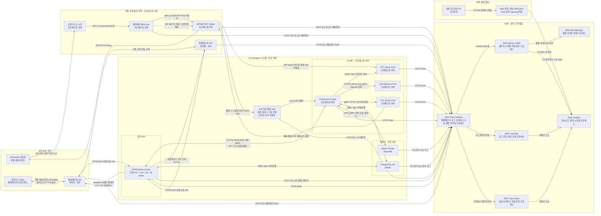
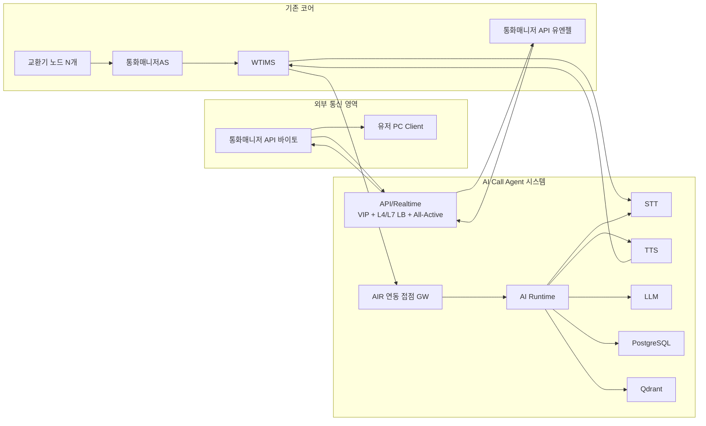
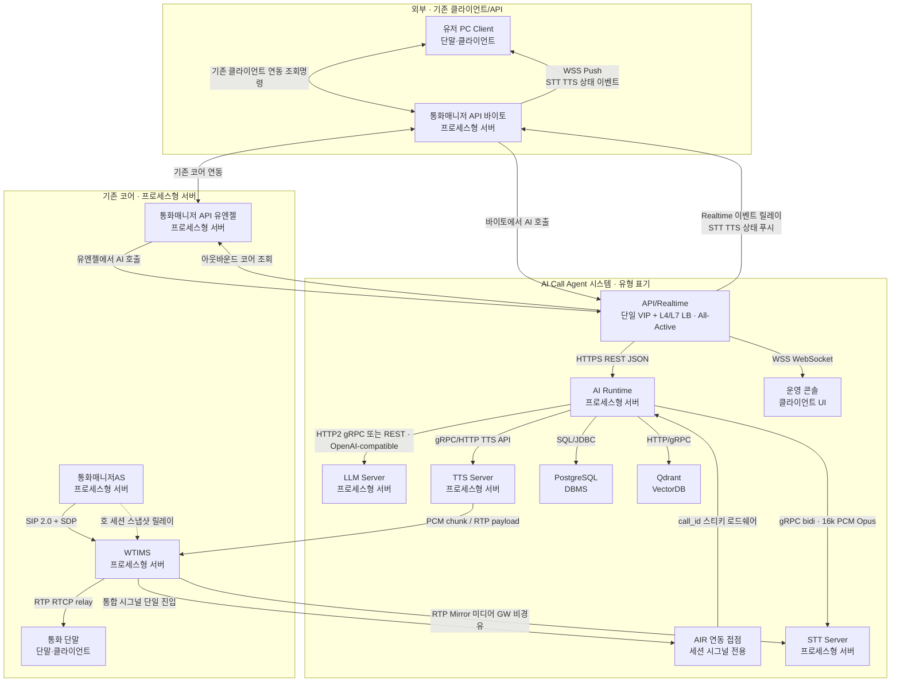
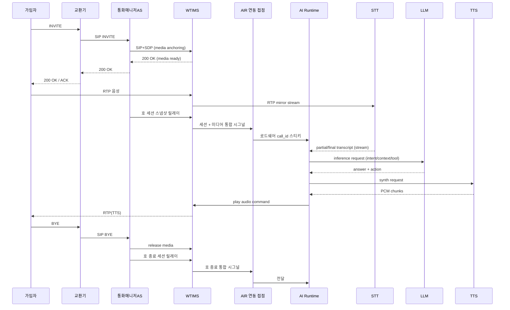
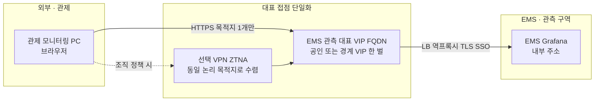
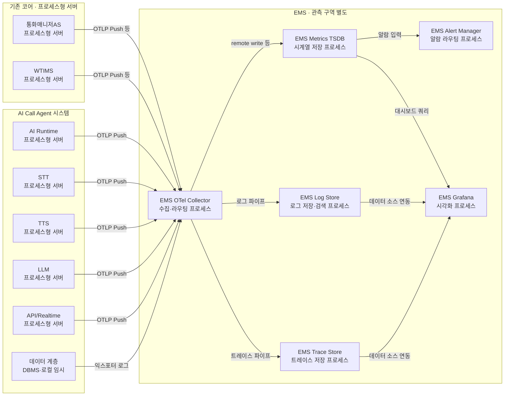

# SmartPBX AI - Production Deployment Architecture
## 상용 적용 상세 아키텍처 (기존 교환기/통화매니저AS/WTIMS 활용)

본 문서는 실제 상용 목표 용량을 기준으로, 이미 보유한 통신 노드(교환기, 통화매니저AS, WTIMS)를 활용하여 AI 확장 계층(**AI Call Agent 시스템**: STT/TTS/LLM/API/Runtime/DB — **전용 NAS/Blob 없음**, 비파일 데이터는 PostgreSQL·**Qdrant(VectorDB)**)과 **EMS**(관측, 별도 구역)를 설계한다.

| 항목 | 내용 |
|------|------|
| 용량 목표 | 가입자 100,000명, **20 CPS(보수)**, 평균 통화 유지 120초 |
| 동시세션 산정 | `약 20.8 CPS x 120s ≈ 2,500 동시 세션` |
| 기존 자산 | 교환기 N개, 통화매니저AS 2 Pair(A/S), WTIMS RTP 서버, **통화매니저 API(유엔젤·코어)** , **통화매니저 API(바이토·외부)** , 유저 PC Client ↔ 바이토 ↔ 유엔젤 기존 연동 |
| 신규 구축 | **AI Call Agent 시스템**(STT, TTS, LLM, AI Runtime, API/Realtime, 데이터 PostgreSQL/**Qdrant**) · 경계 **AIR GW**·**API/Realtime 단일 접점(VIP) + L4/L7 LB 뒤 All-Active** · **EMS** 별도 구역(관측 — OTel·Metrics·Log·Trace·Alert·Grafana **각각 별도 프로세스**) — **공유 파일 스토리지(NAS)는 초기 생략** §7.3 |
| DB 제약 | RDB는 **PostgreSQL HA(최소 Primary+Standby)** 기준, 필요 시 Read Replica로 읽기 분산 |

**관련 문서**: 현재 **개발 리포** 구현 세부·런타임 스택은 [technical-architecture.md](./technical-architecture.md)를 본다. 월별 변경·완료 보고서 요약은 [reports/README.md](../reports/README.md).

---

## 1) 설계 전제 및 해석

### 1.1 용량 해석

- **동시세션**: 2,500호 (Busy Hour 기준)
- **CPS**: 약 20 INVITE/s 지속 유입(보수 20)
- **AI 적용률 가정**: 100% (WTIMS에서 AI 응대 호만 전달)
- **실시간 AI 활성 구간 가정**:
  - STT 활성 세션: `2,500` (AI 호 기준 상시 점유)
  - TTS 동시 합성 기준: 서버 처리량 기준으로 산정(`1,000 세션/노드`, 3 Active = 3,000)
  - LLM 동시 생성 요청: §5.3 계산식 기준(발화 빈도·질의수 가정)

### 1.2 기존 노드 활용 원칙

1. **LB 없음**: 외부 교환기 N개가 분산 진입점 역할 수행
2. **SIP Core 신규 구축 없음**: 통화매니저AS(Active/Standby 2 Pair) 활용
3. **RTP Core 신규 구축 없음**: WTIMS가 RTP Relay 수행
4. **신규 개발 포인트**: 통화매니저AS → WTIMS **호 세션 릴레이** + WTIMS RTP 복제 fork/mirror → STT + **WTIMS → AIR 연동 접점 → AI Runtime 통합 시그널**(세션·미디어)로 호 컨텍스트 단일 진입

---

### 1.3 런타임 경계·책임 분리 (초안)

배포 단위 **AI Call Agent 시스템**(서버 모음) 안에서도, 운영·장애·스케일 관점에서 다음 **런타임 경계**를 구분해 두면 추후 서비스 분할·팀 경계·릴리즈 전략을 정하기 쉽다.

| 경계 | 주요 책임 | 비고 |
|------|-----------|------|
| **미디어 평면** | WTIMS: RTP relay/mirror, 플레이아웃 슬롯, 코덱·타임스탬프 단위 제어 | 지연·버퍼·패킷 손실에 민감 |
| **세션·시그널 평면** | 통화매니저AS: SIP 상태·호 진행, 세션 ID 권위 | 권위 있는 호 생명주기 이벤트 |
| **세션·미디어 통합 릴레이** | WTIMS → **AIR 연동 접점** → AI Runtime: 통화매니저AS에서 받은 호 세션 정보를 합쳐 전달 + 미디어 레그 바인딩 | 코어는 접점 **단일 주소**만 노출; AIR는 접점 뒤 클러스터(§1.4·§2.2) |
| **오케스트레이션** | AI Runtime: 의도·정책·HITL·추론 라우팅 | 허브 비대화 방지를 위해 내부 모듈·API 세분화 검토 |
| **추론 평면** | STT / TTS / LLM | GPU·큐·모델 버전 단위 스케일 |
| **외부 API** | API/Realtime: **단일 접점 VIP/FQDN + L4/L7 LB 뒤 All-Active** 로 유엔젤·바이토·운영망이 REST/WSS 접근 | 인증·레이트리밋·노출면을 단일 접점에 수렴(§1.6) |
| **데이터 평면** | PostgreSQL·**Qdrant(VectorDB)** + **노드 로컬 임시**(캐시·부산물) | 트랜잭션·벡터 검색; **통화 녹음은 WTIMS** · 공유 NAS는 **선택** §7.3 |

**API ↔ PostgreSQL 직접 SQL**은 가능하지만, 스키마·트랜잭션 경계가 AI Runtime 경유와 달라지지 않도록 **읽기 전용 조회·CQRS·권한 모델**을 초기에 고정하는 것을 권장한다.

---

### 1.4 호 처리: 통화매니저AS → WTIMS → AI Runtime 릴레이

호 **세션 권위**는 통화매니저AS에 있고, **미디어 앵커·mirror·코덱** 권위는 WTIMS에 있다. AI Runtime이 두 소스를 **각각 직접** 구독하면 연동 지점이 늘고, 이벤트 순서·역전을 AIR에서 병합해야 한다.

**본 문서의 확정 설계:** 통화매니저AS가 AI Runtime에 **직접 연결하지 않는다.** 호에 대한 세션·정책 정보는 **통화매니저AS → WTIMS**로 먼저 전달·릴레이되고, **WTIMS → AI Runtime** 경로로 **세션 필드 + 미디어 레그 바인딩**을 합친 시그널을 보낸다.

**코어 통신 영역 ↔ AI Call Agent 시스템 접점:** WTIMS는 AI Runtime 노드 목록을 직접 들고 **개별 노드로 분산 발신하지 않는다.** 두 구역 사이에는 **단일 연동 접점**(VIP·FQDN 한 벌에 대응하는 **AIR 연동 계층**: L4/L7 LB, gRPC/HTTP 게이트웨이, 또는 동등한 **로드쉐어**)을 두어, WT는 그 접점에만 붙고 접점이 **`call_id` 기준 스티키·일관 해시**로 AIR 클러스터에 부하를 나눈다(§2.2). AI Call Agent **내부**(예: AIR→STT/LLM/TTS, API→AIR)는 동일 구역 내 단순 로드밸런싱을 적용할 수 있다.

| 단계 | 역할 |
|------|------|
| **통화매니저AS → WTIMS** | **SIP 2.0 + SDP + RTP/RTCP**만으로 호·미디어 세션을 제어한다. AI에 필요한 스냅샷·생명주기·정책 식별자는 **JSON 채널이 아니라** SIP 메시지·SDP 본문·**협의된 SIP/SDP 확장**으로 WTIMS에 전달한다. |
| **WTIMS → AIR 연동 접점 → AI Runtime** | **SIP/SDP로 CM과 맺은 세션**에서 해석한 컨텍스트와, WT의 mirror·STT·TTS 슬롯 메타를 **한 페이로드 또는 동일 스트림**으로 **단일 연동 접점**에 보내고, 접점이 규약에 따라 **적절한 AIR 인스턴스**로 전달한다. 외부 API는 **WT→AIR 한 계약**으로 단순화한다. |

**장점:** AI Runtime 연동·보안·버저닝·재시도 정책을 **WT→AIR 한 계약**으로 모을 수 있고, CM/AIR 이벤트 역전 문제를 **WT 내부에서 정렬**할 여지가 생긴다. 구역 경계에는 **연동 주소 단일화**로 운영·방화벽·장애 전환을 단순화한다.

**주의:** WTIMS는 세션 정보를 **CM으로부터 받아 릴레이**하는 책임을 갖는다. WT 장애 시 AIR로 가는 통합 시그널도 영향을 받으므로 WT HA·백프레셔를 설계한다. 미디어 미준비 시에는 AIR가 STT 구독을 지연하는 등 **상태 머신**은 그대로 유지한다.

**제어·통합 시그널 평면 vs 미디어(RTP) 평면 (GW 적용 범위)**

| 평면 | 내용 | GW(AIR 연동 접점) 경유 여부 |
|------|------|------------------------------|
| **통합 시그널** | `call_id`·세션 스냅샷·미디어 **레그 바인딩 메타**(키·슬롯 ID·코덱 요약 등) — 저대역·저빈도 gRPC/Kafka 스트림 | **경유** — 코어↔신규 구역 **단일 주소·로드쉐어** 목적 |
| **미디어(RTP/PCM 대역)** | RTP Mirror → STT, TTS 재생 → WTIMS 등 **초당 수 kb~Mb 스루풋** | **비경유** — WTIMS는 이미 §2 도표처럼 **STT·WT와 직접** 미디어 경로를 유지하고, GW에 RTP를 끌고 오지 않는다 |
| **AIR↔STT gRPC** | 오디오 스트림·부분 텍스트 — AIR가 STT 풀과 **내부 구역**에서 직접 | GW와 무관 |

이 구분은 일반적인 **SBC/미디어 프록시 vs 시그널링** 분리와 같다. GW를 미디어까지 통과시키면 **이중 홉 지연·버퍼·단일 장애점·대역폭 비용**만 커지므로, **세션 오케스트레이션 메시지만 GW**, **페이로드 미디어는 기존 미디어 앵커·풀 직결**이 타당하다.

---

### 1.5 기존 통화매니저 API·PC Client와 AI Call Agent API 연동

상용 환경에는 이미 다음 **기존 서버·클라이언트**가 존재하며, AI Call Agent의 **API/Realtime Cluster**는 이들과 **별도로 연계**해야 한다.

| 구분 | 구성요소 | 역할 |
|------|-----------|------|
| 기존 코어 | **통화매니저 API 서버(유엔젤)** | 코어 통신 망 내 REST 등으로 **코어 쪽 설정·상태·정보 조회** 등 제공 |
| 외부·중계 | **통화매니저 API 서버(바이토)** | 외부·중계 구역에서 동작하는 API 게이트; **유저 PC Client**와 직접 연동 |
| 단말 | **유저 PC Client** | 통화매니저 프론트엔드 역할; **바이토 API**에 접속 |

**기존 호출 경로(변경 없음):** 유저 PC Client ↔ **바이토 API** ↔ **유엔젤 API**(코어 내부 연동은 조직 표준에 따름).

**AI Call Agent 연결(API/Realtime와의 관계):**

1. **유엔젤 API와 연동** — 코어 통신과 관련된 **설정 반영·상태·정보 조회**가 필요할 때 AI 측 API가 유엔젤 API를 호출하거나, 조직 정책에 따라 **역방향 노티**를 받는다.
2. **바이토 API와 연동** — **유저 PC Client**에 AI 관련 **정보 전달**(알림·목록·설정 화면 데이터), 사용자의 **설정·정보 조회** 요청을 AI 기능과 매핑할 때 바이토 경유 또는 API/Realtime ↔ 바이토 간 규약으로 처리한다.

**통화매니저 API(유엔젤·바이토) → API/Realtime 호출:** 유엔젤·바이토 서버가 **AI Call Agent의 API/Realtime을 호출**할 때(코어 연계·설정 연동·바이토 경유 트리거 등)에는 **API/Realtime 단일 접점 VIP/FQDN** 으로만 진입하고, 뒤쪽은 **L4/L7 LB를 거쳐 All-Active API/Realtime 노드**로 분산한다(§1.6). **반대 방향**인 **API/Realtime → 유엔젤·바이토**(코어 조회·바이토 연계 조회 등 **아웃바운드**)는 존·방화벽 정책에 따라 서버 간 HTTPS 등으로 직접 허용할 수 있다(동일 규약·mTLS 권장).

즉 **운영 콘솔 웹(문서상 별도)** 과 별개로, **실사용자 UI는 유저 PC Client → 바이토 → 유엔젤** 축이며, AI 기능은 **API/Realtime이 유엔젤·바이토와 계약**을 맞춘다. AI로 들어오는 HTTP(S)/WSS 호출은 **API/Realtime 단일 접점 VIP 한 주소**에 수렴한다.

### 1.6 API/Realtime 단일 접점(VIP) + L4/L7 LB + All-Active

**통화매니저 API 서버(유엔젤·바이토)** 가 API/Realtime을 호출할 때, 코어↔신규 구역 경계에서 연동 주소·TLS·인증·레이트리밋을 한 벌로 맞추기 위해 **API/Realtime 단일 접점(VIP/FQDN 1개)** 으로 수렴한다. VIP 뒤에는 **L4 LB + (선택) L7/API Gateway**를 두고 API/Realtime 노드는 **All-Active**로 운영한다.

| 요소 | 역할 |
|------|------|
| **단일 진입** | 방화벽·WAF·ACL을 **API/Realtime 단일 접점 주소**에만 개방; 유엔젤·바이토가 **같은 목적지**를 바라보게 조직 DNS·라우팅 정리 |
| **TLS·신뢰** | 공인 또는 사내 인증서 종료, **mTLS**(서버 간 신뢰)·클라이언트 인증서 선택 |
| **정책** | OAuth2/JWT·API Key·IP 허용목록, **레이트리밋**, 요청 크기 제한 |
| **라우팅** | 단일 VIP 뒤 **L4 LB(TCP pass-through)** + 필요 시 **L7(인증/레이트리밋/WAF)** 로 전달. API/Realtime 노드는 **All-Active**로 분산(세션형은 스티키 또는 토큰 affinity) |
| **구현 원칙** | **LB 직접 개발은 비권장**. 상용/오픈소스 검증 LB(HAProxy, NGINX, Envoy, 클라우드 LB 등) 사용 권장 |
| **아웃바운드(반대 방향)** | **API/Realtime → 유엔젤·바이토** 호출은 별도 존 연동으로 직접 허용 — 표 §3.2 |

**운영 콘솔**(신규 존 동일 망)·**순수 내부 마이크로서비스**만 API를 쓰는 경우에는 조직 정책에 따라 내부 LB만 쓸 수 있으나, **통화매니저 API 서버에서 AI로 오는 호출**은 위 **단일 접점 정책**과 맞춘다.

---

## 2) 전체 배포 구조 (Mermaid)



### 구조 설명

- 교환기 N개는 **기존 코어**에서 외부(PSTN/SIP) 트래픽을 분산·중계하므로 별도 LB를 두지 않는다(도표상 **외부 통신 영역**이 아닌 **기존 코어**에 둔다).
- 통화매니저AS는 SIP 세션 상태 머신/호제어를 담당하고, WTIMS는 RTP 실시간 중계를 담당한다.
- **AI Call Agent 시스템**은 STT·TTS·LLM·AI Runtime·API/Realtime·데이터 계층(PostgreSQL·Qdrant) 등 **신규 서버 모음**을 가리킨다. **통화 녹음 파일은 기존 WTIMS**에서 수행·보관하며, AI 계층은 **전용 공유 파일 스토리지 없이** 노드 **로컬 임시**로 부산물·캐시를 처리한다(§7.3). **EMS**(관측)는 같은 업무 도메인과 연계되지만 **별도 구역**으로 두고, OTel Collector·Metrics TSDB·Log·Trace·Alert·Grafana를 **각각 독립 프로세스**로 배포한다. AI Runtime이 통화 이벤트 기반으로 STT/LLM/TTS를 호출하고, 결과 음성을 다시 WTIMS로 전달한다.
- 호의 **통합 시그널**(세션 스냅샷·`call_id`·레그 바인딩 메타)은 **통화매니저AS → WTIMS → AIR 연동 접점 GW → AI Runtime**으로 릴레이된다. 코어(WT)는 GW **한 주소**만 사용한다(§1.4). **RTP 미디어**(Mirror→STT, TTS→WT 등)는 **GW를 거치지 않고** WTIMS가 STT·AIR·WT 간 직접 경로를 유지한다(§1.4 표).
- PostgreSQL은 거래성 데이터(세션, 정책, 예약, 이력), **Qdrant**는 의미 검색을 담당한다. **녹음 미디어는 WTIMS**가 담당하고, 그 외 파일성 부산물은 **각 서버 로컬 디스크**를 사용한다(§7.3).
- 위 Mermaid 화살표 라벨은 **연동 규격**(프로토콜·형식·상관 키)을 요약한 것이며, 세부 필드는 §3 연동 규격표·예제와 일치시킨다.
- 위 Mermaid 박스는 **첫 줄=이름, 둘째 줄=§2.0 구성요소 유형**을 병기했다. **EMS** 서브그래프는 AI Call Agent 시스템과 **분리**하여 표시한다.
- 도표상 동일한 박스로 보일 수 있으나, 실제로는 **프로세스형 서버·DBMS·단말/클라이언트**로 구분한다(§2.0).
- **WTIMS → AI Runtime**은 기존 코어와 신규 시스템의 **경계**이므로, AIR 노드 다수에 WT가 직접 붙지 않고 **AIR 연동 접점**(단일 VIP/FQDN에 대응하는 LB·게이트웨이)을 두어 **연동 노드·주소를 단일화**한다. 내부 풀(STT·LLM·TTS 등) 간 부하는 동일 구역 내 일반 로드밸런싱으로 처리한다(§2.2).
- 기존 **통화매니저 API(유엔젤·바이토)** 및 **유저 PC Client**와 AI **API/Realtime** 연계는 §1.5 및 본 절 Mermaid를 참고한다.
- **유엔젤·바이토**가 **API/Realtime을 호출**할 때는 **API/Realtime 단일 접점 VIP/FQDN**(§1.6)으로 수렴한다. **API/Realtime이 유엔젤·바이토를 호출**하는 **아웃바운드**는 존 정책에 따라 직접(HTTPS 등) 연결할 수 있다.
- **관제 모니터링 PC**는 EMS 백엔드(OTel/TSDB/Log/Trace)에 직접 붙지 않고, **EMS 관측 대표 VIP/FQDN(또는 EMS 관측 Ingress)** 을 거쳐 **Grafana**로만 접근한다(§8.1).

### 2.3 EMS 제외 옵션(대안 배포도)

EMS를 외부 공용 관제나 기존 전사 관제로 대체하는 경우, 아래처럼 **코어 + AI Call Agent 시스템**만으로도 운영할 수 있다.



### 2.0 구성요소 유형 (프로세스 서버 · DBMS)

아키텍처 다이어그램의 노드는 모두 “서버 한 대”로 읽히기 쉬우므로, 아래 **형태**로 먼저 구분한다.

| 형태 | 설명 | 해당 예시 (본 문서) |
|------|------|---------------------|
| **프로세스형 서버** | OS 위에 애플리케이션/데몬이 **상시 구동**되는 컴퓨트 노드. CPU·메모리로 요청·스트림을 처리한다. | 교환기 SW, 통화매니저AS, WTIMS, **AIR 연동 접점**(LB/GW), AI Runtime, STT/LLM/TTS, API/Realtime · **EMS**는 동일 형태이나 배포 구역은 별도(§2 도표) |
| **DBMS** | **데이터베이스 엔진**이 상주하고, 클라이언트는 SQL 또는 전용 API로 접속한다. 트랜잭션·인덱스·질의 최적화가 책임이다. | PostgreSQL RDB, Qdrant(VectorDB) |
| **단말·클라이언트** | 우리 쪽에서 상시 서버 프로세스를 띄우는 대상이 아님. | PSTN/SIP 가입자 단말, 통화 단말, **운영 콘솔** 웹 브라우저, **관제 모니터링 PC**(Grafana 클라이언트, §8.1) |

**구분 시 유의**

- **프로세스형 서버 ≠ “그 안에 DB가 없다”**: 서버 프로세스가 내장 DB를 쓸 수는 있으나, 본 문서에서 **PostgreSQL·Qdrant**는 **별도 DBMS 노드**로 표기한다.
- **파일·녹음**: **통화 녹음은 WTIMS**가 기존 책임. AI 신규 계층에는 **전용 NAS/Blob 저장소를 두지 않고** STT·AIR·API 등 **로컬 임시 디스크** + 운영 정리 정책(§7.3). 향후 공유 스토리지 필요 시 별도 과제.
- **EMS**(Enterprise Monitoring System, 본 문서 통칭): 과거 **관측 서버** 구역을 대신하는 이름이다. 메트릭·로그·트레이스·알람·대시보드를 담당하며, 구성 요소는 **각각 별도 프로세스(데몬)** 로 배치한다(§2 전개도·§8).

### 2.1 노드·서버별 역할

| 구분 | 형태 | 노드·서버 | 수행 역할 |
|------|------|-----------|-----------|
| 외부 | 단말·클라이언트 | PSTN/SIP 가입자 | 발신·착신 호·미디어 단말 |
| 기존 코어 | 프로세스형 서버 | 교환기 노드 N개 | SIP Trunk 진입·분산·통화매니저AS로 라우팅(도표상 **기존 코어** 영역) |
| 기존 코어 | 프로세스형 서버 | 통화매니저AS | SIP 세션 상태·호 제어·WTIMS로 SDP/미디어 앵커 제어, **호 세션 스냅샷을 WTIMS로 릴레이**해 AI 경로를 단순화 |
| 기존 코어 | 프로세스형 서버 | WTIMS | RTP/RTCP 릴레이·미러·플레이아웃, STT용 RTP fork, **통화 녹음(기존)**, **CM 세션 정보 + 미디어 레그 바인딩을 통합 시그널로 AIR 연동 접점(단일 주소)으로 전달** §2.2 |
| 기존 코어 | 프로세스형 서버 | 통화매니저 API · 유엔젤 | 코어 망 **REST 등** — 코어 통신 **설정·상태·정보 조회**; **AI 호출 시** **API/Realtime 단일 접점**으로 진입 §1.6 |
| 외부 | 프로세스형 서버 | 통화매니저 API · 바이토 | 외부·중계 구역 API — **유저 PC Client**와 연동, **유엔젤 API**와 기존 연동; **AI 호출 시** **API/Realtime 단일 접점** §1.6 |
| 외부 | 단말·클라이언트 | 유저 PC Client | 통화매니저 **데스크톱·프론트엔드**; **바이토 API**에 접속 |
| 외부·관제 | 단말·클라이언트 | 관제 모니터링 PC | **Grafana**(선택 **EMS 관측 Ingress**)로 EMS 모니터링 · TSDB·Loki 직접 접속 금지 §8.1 |
| AI Call Agent 시스템 | 프로세스형 서버 | AIR 연동 접점 GW | 코어(WT)와 신규(AIR) 구역 **단일 연동 주소** · **세션·통합 시그널만** · RTP 미디어 비경유 §1.4·§2.2 |
| AI Call Agent 시스템 | 프로세스형 서버 | API/Realtime 단일 접점(VIP+LB) | 유엔젤·바이토→**API/Realtime** **단일 진입** · LB 뒤 All-Active · TLS·레이트리밋 §1.6 |
| AI Call Agent 시스템 | 프로세스형 서버 | AI Runtime | 호 단위 오케스트레이션·정책·의도·HITL·추론 라우팅, STT/LLM/TTS 호출·WTIMS 재생 명령·DB/스토리지 연계 · 접점 뒤 N대 확장 §2.2 |
| AI Call Agent 시스템 | 프로세스형 서버 | STT Server | RTP 미러 또는 오디오 스트림 수신·실시간 문자 변환·부분/최종 텍스트 스트리밍 |
| AI Call Agent 시스템 | 프로세스형 서버 | LLM Server | 프롬프트 기반 추론·도구/함수 호출 응답·OpenAI 호환 API 제공 |
| AI Call Agent 시스템 | 프로세스형 서버 | TTS Server | 텍스트→음성 스트리밍 합성·PCM 청크 반환 |
| AI Call Agent 시스템 | 프로세스형 서버 | API/Realtime | AI Runtime·DB와 연계 · 아웃바운드로 유엔젤·바이토 호출 §1.5 · **인바운드는 단일 접점(VIP+LB) 뒤 All-Active** §1.6 · EMS는 별 구역 |
| AI Call Agent 시스템 | 단말·클라이언트 | 운영 콘솔 | 브라우저 UI·모니터링·설정·실시간 이벤트 구독 — **유저 PC Client·바이토와 별 축** |
| AI Call Agent 시스템 | DBMS | PostgreSQL HA | 트랜잭션형 세션·정책·이력·권한 등 RDB 권위 데이터 · **최소 2노드(Primary/Standby)** |
| AI Call Agent 시스템 | DBMS | Qdrant Cluster | 지식·임베딩 검색·유사도 기반 조회·업서트 · **최소 2 Active** |
| EMS | 프로세스형 서버 | EMS · OTel Collector | 텔레메트리·로그·트레이스 수집·라우팅 · AI Call Agent 시스템 및 코어에서 OTLP 등으로 인입 |
| EMS | 프로세스형 서버 | EMS · Metrics TSDB | 메트릭 시계열 저장·쿼리(Prometheus/Mimir 등) |
| EMS | 프로세스형 서버 | EMS · Log Store | 로그 인입·저장·검색(Loki/ELK 등) |
| EMS | 프로세스형 서버 | EMS · Trace Store | 분산 트레이스 저장·조회(Tempo/Jaeger 등) |
| EMS | 프로세스형 서버 | EMS · Alert Manager | 알람 라우팅·억제 |
| EMS | 프로세스형 서버 | EMS · Grafana | 대시보드·시각화 |

상세 모델·스펙은 §5, 스토리지 용도는 §7 참고.

### 2.2 부하분산: 구역 경계(WTIMS→AIR)와 내부 풀

**원칙**

- **내부 노드 간**(AI Call Agent 시스템 안에서 AIR→STT·LLM·TTS, API→AIR 등)은 동일 보안·네트워크 존 안에서 **일반적인 로드밸런싱**(라운드로빈·최소 연결·헬스 기반)을 적용할 수 있다.
- **기존 코어 통신 영역 ↔ AI Call Agent 시스템** 접점인 **WTIMS → AI Runtime**은 연동 주소·계약·방화벽 홀을 **한 벌로 고정**할 필요가 있으므로, **AIR 연동 접점**을 두어 **단일화**한다. WTIMS는 이 접점의 **FQDN/VIP 한 개만** 알면 되고, 다수 AIR 인스턴스로의 **로드쉐어**는 접점에서 수행한다.

**AIR 연동 접점(권장 구조)**

| 요소 | 역할 |
|------|------|
| **단일 진입 주소** | WT 클러스터가 바라보는 **하나의 VIP 또는 FQDN**(예: `air-ingest.prod.internal`) — 코어↔신규 구역 방화벽·ACL도 이 주소만 허용하면 된다. |
| **로드쉐어 계층** | L4/L7 LB, **Envoy/nginx Plus**, 전용 **gRPC 게이트웨이**, 또는 동등 기능 — **`call_id`(또는 동등 세션 키) 기준 일관 해시·세션 스티키**로 AIR N대에 분산 |
| **AIR 클러스터** | 접점 뒤에서만 수평 확장; WT는 AIR IP 목록을 보유하지 않음 |

**미디어 평면은 GW 비경유:** GW는 **통합 시그널·저대역 스트림**만 처리한다. RTP Mirror·PCM 파이프는 **WTIMS ↔ STT**(및 TTS 재생 경로)가 직접 이어지며, §2 도표의 `WT→STT` 엣지가 그 역할이다. 이렇게 해야 지연·버퍼·대역폭 낭비를 피한다.

**호 단위 고정:** 한 통화는 **`call_id`당 단일 AIR 인스턴스**에 바인딩한다. 접점이 동일 `call_id`를 항상 동일 AIR로 보내도록 해 **세션 상태·미디어 오케스트레이션**이 한 노드에 머문다.

**비권장(경계 구간):** WT 프로세스가 AIR 목록을 직접 들고 호마다 노드를 고르는 방식은 **연동 지점이 WT 전 노드에 분산**되어 방화벽·버저닝·장애 시 공조가 어렵다. 불가피할 경우에만 검토하고, 그래도 **논리 주소는 단일 접점으로 노출**하는 편이 운영에 유리하다.

**AIR 장애 시:** 접점에서 헬스 체크 후 다른 AIR로 보내면 세션 연속성이 깨질 수 있으므로, **동일 호 재바인딩 정책**(짧은 재시도·세션 복구 스키마)을 계약에 포함하거나, 상태를 PostgreSQL 등에 두는 **완화 스티키**와 트레이드오프를 명시한다(§3).

STT·LLM·TTS 풀은 AIR가 **동일 호에 대해** 저지연으로 호출할 수 있도록 같은 존 또는 근접 네트워크에 두고, AIR 간 부하는 **세션 수 기준**으로 산정한다(§6).

---

## 3) 프로토콜/연동 규격 상세



### 3.1 연동 규격의 범위

**연동 규격**은 두 컴포넌트가 데이터를 주고받을 때 따르는 **계약**이다. 다음을 문서·스키마 버전과 함께 고정하는 것을 권장한다.

- **전송**: TLS 필수 구간, 내부망은 mTLS 또는 네트워크 분리 + 서비스 계정
- **식별·상관**: `call_id`, `trace_id`·W3C `traceparent`, 스트림·레그 단위 `stream_id` / `leg_id`
- **스키마 버전**: gRPC·Kafka·REST 등 **문자 기반 페이로드**에 `specversion` 또는 `schema_version`. **통화매니저AS ↔ WTIMS** 구간은 SIP/SDP이므로 이 항목의 적용 대상이 아니다.
- **멱등·재시도**: HTTP `Idempotency-Key`, 메시지 소비는 최소 한 번 + 업스트림 멱등 설계
- **오류**: HTTP 상태·gRPC `status`, 애플리케이션 오류 코드·재시도 가능 여부
- **시간 제약**: STT/미디어는 저지연, LLM은 큐·타임아웃 별도, 이벤트는 소비 지연 허용 범위 명시

아래 **예제는 설계·프로토타입용 의사 샘플**이며, 필드명·타입은 실제 구현 시 proto/OpenAPI로 확정한다.

### 3.2 연동 규격 요약표

연결 **양단의 형태**(프로세스형 서버 / DBMS / 단말)는 §2.0·§2.1과 같다. DBMS는 **접속 클라이언트가 프로세스형 서버**인 경우가 많다.

| 연동 | 프로토콜·형식 | 방향 | 핵심 내용 |
|------|----------------|------|-----------|
| 교환기 ↔ 통화매니저AS | SIP 2.0, SDP, UDP/TCP/TLS | 양방향 | Trunk, INVITE/ACK/BYE, 코덱·미디어 협상 |
| 통화매니저AS ↔ WTIMS | **SIP 2.0 + SDP + RTP/RTCP** | 양방향 | 미디어 앵커·세션 제어; 호 상관·테넌트 등 AI 연계 메타는 **SIP 헤더·SDP 속성·협의된 SDP 필드** 등으로 전달. **CM↔WT 구간은 JSON 페이로드 규격으로 두지 않는다.** WT는 여기서 확보한 세션 정보와 미디어 메타를 합쳐 **AIR 연동 접점**으로 내보낸다 |
| WTIMS → AIR 연동 접점 | gRPC 또는 Kafka 등 §3 예제와 동일 규약 | WT→GW | **코어↔신규 구역 단일 주소**(VIP/FQDN); WT는 AIR 노드 목록 미보유 |
| AIR 연동 접점 → AI Runtime | 동상 내부 전달 | GW→AIR | **`call_id` 일관 해시·세션 스티키**로 AIR N대 로드쉐어 §2.2 |
| WTIMS → STT | RTP 또는 SRTP 미러 | WT→STT | PCM 16 kHz mono 등 사전 합의 코덱 |
| AI Runtime ↔ STT | gRPC bidi, 오디오 프레임 + 메타 | 양방향 | 세션 메타 첫 프레임·부분/최종 텍스트 스트림 |
| AI Runtime ↔ LLM | HTTPS JSON OpenAI 호환 또는 gRPC | AIR→LLM | `/v1/chat/completions` 등, 스트리밍 옵션 |
| AI Runtime ↔ TTS | gRPC 또는 HTTP 스트리밍 | AIR→TTS | 텍스트 입력·PCM 청크 출력 |
| TTS → WTIMS | 제어 채널 + 페이로드 | TTS→WT | 재생 슬롯·버퍼 식별자 합의 |
| API/Realtime ↔ AI Runtime | HTTPS JSON, 내부 gRPC | 양방향 | 운영·세션 제어·조회 |
| 통화매니저 API 유엔젤·바이토 → API/Realtime 단일 접점(VIP+LB) | HTTPS·WSS·mTLS | 인바운드→AI | **단일 VIP/FQDN**; LB 뒤 **All-Active** API/Realtime 노드로 공통 진입 §1.6 |
| API/Realtime → 통화매니저 API 유엔젤 | HTTPS REST 등·사내 규약 | **아웃바운드** | **AI가 코어** 설정·상태·정보 **조회·반영** |
| API/Realtime → 통화매니저 API 바이토 | HTTPS REST 등 | **아웃바운드** | **AI가 바이토**로 유저 경로 연계·조회 |
| 관제 PC → EMS Grafana | HTTPS TLS · 브라우저 | 외부→EMS | **대표 VIP/FQDN 단일 접점** · VPN 또는 **EMS 관측 Ingress** · **SSO·Viewer RBAC** §8.1 |
| 관제 PC ⊄ Prometheus/Loki/Tempo 직접 | — | 금지 | 백엔드 UI 포트는 비관제망에서 차단; Grafana 단일 접점 |
| 유저 PC Client ↔ 통화매니저 API 바이토 | 기존 클라이언트 프로토콜 | 양방향 | 데스크톱 프론트엔드 — AI 확장 전제 유지 |
| 통화매니저 API 바이토 ↔ 유엔젤 | 기존 연동 규약 | 양방향 | 조직 내 표준 유지 |
| API/Realtime ↔ 운영 콘솔 | HTTPS, WSS JSON | 양방향 | 구독 토픽·이벤트 페이로드 스키마 |
| AI Runtime·API ↔ PostgreSQL | JDBC/SQL, 커넥션 풀 | 클라이언트→DB | 쓰기 Primary 고정, 읽기 Replica 분리(선택) · 트랜잭션 경계·권한 분리 |
| AI Runtime ↔ Qdrant | HTTP/gRPC JSON | AIR→VDB | 컬렉션·벡터 차원·메타데이터 |
| AI Runtime·API ↔ 노드 로컬 디스크 | OS 파일 API·내부 업로드 REST(선택) | 동일 노드 또는 서비스 로컬 경로 | STT 부산물·지식 임포트 임시·캐시 등 — **통화 녹음은 WTIMS** · 운영 정리·쿼터 §7.3 |

### 3.3 연동 규격 예제

#### A. 통화매니저AS ↔ WTIMS (SIP/SDP 예시)

CM과 WT 사이 호·미디어 제어는 **JSON이 아니라 SIP와 SDP**(데이터는 RTP/RTCP)로 한다. 아래는 의사 샘플이며, `Call-ID`·SDP의 `c=`/`m=`/`a=` 등 실제 필드와 조직 내 확장 헤더 규약으로 확정한다.

```http
INVITE sip:media@wtims.example.com SIP/2.0
Via: SIP/2.0/UDP cm.example.com;branch=z9hG4bK776asdhds
Max-Forwards: 70
From: <sip:+821012345678@cm.example.com>;tag=1928301774
To: <sip:media@wtims.example.com>
Call-ID: cm-7f3a9b2c-001@cm.example.com
CSeq: 1 INVITE
Contact: <sip:cm.example.com:5060>
Content-Type: application/sdp
X-Tenant-Id: tenant-01

v=0
o=CM 123456789 123456789 IN IP4 203.0.113.10
s=SmartPBX
c=IN IP4 203.0.113.20
t=0 0
m=audio 49170 RTP/AVP 0 8
a=rtpmap:0 PCMU/8000
```

DNIS·서비스 프로파일 등은 **별도 JSON 파일이 아니라** SIP `Request-URI`/`To`, `P-` 또는 사내 확장 헤더·SDP `a=` 라인 등으로 옮길지 정책으로 확정한다.

#### B. WTIMS → AIR 연동 접점 → AI Runtime 통합 시그널 (세션 릴레이 + 미디어 레그)

WTIMS가 **SIP/SDP로 CM과 맺은 세션**에서 해석한 필드와 자체 미디어 메타를 **한 페이로드**로 **AIR 연동 접점**에 보내고, 접점이 **`call_id` 로드쉐어**로 적절한 AIR 인스턴스에 전달한다(gRPC·Kafka 등 **WT→GW 구간 JSON/바이너리 규약**). 미디어 미준비 구간은 `media` 생략 또는 `state`로 표현할 수 있다.

```json
{
  "schema_version": "1.0",
  "event_type": "call.context_and_media",
  "occurred_at": "2026-05-07T12:34:56.801Z",
  "call_id": "cm-7f3a9b2c-001",
  "session_relay": {
    "direction": "inbound",
    "service_profile": "ai_voice_agent",
    "dnis": "023331234",
    "tenant_id": "tenant-01"
  },
  "leg_id": "wt-leg-a1",
  "mirror": {
    "stt_stream_key": "stt-stream-9x4k",
    "codec": "pcm_s16le",
    "sample_rate_hz": 16000,
    "channels": 1
  },
  "tts": {
    "inject_slot_id": "tts-slot-3"
  }
}
```

#### C. AI Runtime ↔ STT gRPC 스트림 첫 메타데이터 (개념 예시, JSON 등가)

스트림 오픈 직후 한 번 보내는 헤더 프레임 개념이다.

```json
{
  "call_id": "cm-7f3a9b2c-001",
  "stt_stream_key": "stt-stream-9x4k",
  "language": "ko-KR",
  "partial_results": true
}
```

#### D. AI Runtime → LLM OpenAI 호환 Chat Completion (요청 예시)

```http
POST /v1/chat/completions HTTP/1.1
Host: llm-internal.example.com
Authorization: Bearer ${SERVICE_TOKEN}
Content-Type: application/json
```

```json
{
  "model": "qwen2.5-14b-instruct",
  "stream": true,
  "messages": [
    { "role": "system", "content": "You are a call-center assistant. Reply in Korean." },
    { "role": "user", "content": "예약 가능한 시간 알려줘." }
  ]
}
```

#### E. AI Runtime → TTS 스트리밍 합성 시작 (바디 예시)

```json
{
  "voice_id": "ko-KR-female-01",
  "text": "내일 오전 10시로 예약했습니다.",
  "audio_format": "pcm_s16le",
  "sample_rate_hz": 16000,
  "call_id": "cm-7f3a9b2c-001"
}
```

#### F. AI Runtime → WTIMS 재생 명령 (제어 API 예시)

실제 전송은 사내 RPC·REST 중 선택; 페이로드 개념만 정리한다.

```json
{
  "call_id": "cm-7f3a9b2c-001",
  "inject_slot_id": "tts-slot-3",
  "action": "enqueue_pcm",
  "seq_base": 1000,
  "total_frames_hint": 2400
}
```

#### G. API/Realtime → AI Runtime 내부 조회 (REST 예시)

```http
GET /internal/v1/sessions/cm-7f3a9b2c-001/summary HTTP/1.1
Host: api-realtime.internal
X-Service-Auth: Bearer ${API_TOKEN}
```

#### H. 운영 콘솔 WebSocket 이벤트 (서버 → 브라우저)

```json
{
  "type": "call.event",
  "call_id": "cm-7f3a9b2c-001",
  "payload": {
    "state": "active",
    "hitl_pending": false
  }
}
```

#### I. Qdrant 문서 업서트 (HTTP JSON 예시)

```json
{
  "collection": "kb_prod",
  "id": "doc-uuid-1234",
  "embedding": [0.01, -0.02, 0.003],
  "metadata": { "source": "faq", "tenant_id": "tenant-01" }
}
```

임베딩 벡터는 차원에 맞는 실수 배열로 전송한다.

#### J. 로컬 임시 파일 — API가 반환하는 업로드·처리 대상 (개념)

**통화 녹음 원본은 WTIMS**가 담당한다. AI 계층에서는 노드 **로컬 디스크**에 임시·부산물을 두고, 필요 시 사내 REST가 스트림을 받아 **해당 인스턴스 로컬 경로에 쓰기**한다. 초기에는 **전용 공유 스토리지(NAS/Blob) 없음**(§7.3).

```json
{
  "storage": "local_ephemeral",
  "host_hint": "api-realtime-03",
  "relative_path": "/var/lib/ai-call-agent/uploads/tenant-01/2026/05/import-batch.tgz",
  "uri_internal": "https://api.internal/v1/files/upload?tenant_id=tenant-01",
  "retention_policy": "purge_after_days_or_on_success"
}
```

### 3.4 연동 규격 제안 (체크리스트)

- **유엔젤·바이토 → API/Realtime 단일 접점(VIP+LB)**(인바운드): 단일 VIP·TLS·레이트리밋 · LB 뒤 All-Active §1.6
- **API/Realtime → 유엔젤·바이토**(아웃바운드): 코어·바이토 조회 연계 §1.5
- **교환기 <-> 통화매니저AS**: SIP Trunk (UDP/TCP/TLS)
- **통화매니저AS <-> WTIMS**: **SIP 2.0 + SDP + RTP/RTCP**만 사용. 호 세션·스냅샷·생명주기 표현도 **동일 구간의 SIP/SDP·협의 헤더**로 한다(JSON 전용 CM↔WT 채널 없음). AIR 직접 연동 없음
- **WTIMS → AIR 연동 접점**: 세션 릴레이 + 미디어 레그 바인딩 **통합 시그널**(gRPC/Kafka 등), **단일 주소** · `call_id` 상관·갱신·해제 포함 · **RTP 미디어는 GW 비경유**
- **AIR 연동 접점 → AI Runtime**: **`call_id` 일관 해시·스티키** 로드쉐어 §2.2
- **WTIMS -> STT**: RTP mirror stream (codec normalized PCM 16k 권장) · **미디어 평면 직결**
- **AI Runtime <-> STT**: gRPC bidirectional streaming
- **AI Runtime <-> LLM**: OpenAI-compatible REST 또는 gRPC inference API
- **AI Runtime <-> TTS**: gRPC streaming synth (chunked PCM 반환)
- **API/Realtime <-> 운영 콘솔**: HTTPS REST + WSS 이벤트
- **AI/API <-> PostgreSQL**: JDBC/ODBC(SQL)
- **AI <-> Qdrant(VectorDB)**: query/upsert API (HTTP/gRPC)
- **AI/API ↔ 로컬 임시 스토리지**: 노드 로컬 디스크·운영 정리 정책; 공유 NAS/Blob는 도입 시 별도 과제 §7.3
- **관제 PC → Grafana / EMS 관측 Ingress**: HTTPS · **대표 VIP 단일 접점** · SSO · Viewer RBAC §8.1

---

## 4) 통화 처리 시퀀스 (Mermaid Sequence)

STT·LLM·TTS·AI Runtime 참여자는 **AI Call Agent 시스템** 소속 컴포넌트로 본다. 교환기·통화매니저AS·WTIMS는 기존 코어다. 아래 시퀀스에서 **AIR 연동 접점**(LB/GW)은 WT와 AIR 클러스터 사이 **단일 논리 진입**으로 표기했으며, 실제 배포는 §2·§2.2와 같다.



---

## 5) 서버 역할별 권장 모델 및 스펙

아래 역할군은 **AI Call Agent 시스템**을 구성하는 신규 계획 노드다. 기존 코어(교환기·통화매니저AS·WTIMS)는 제외한다.  
**통화매니저 API(유엔젤·바이토)** 및 **유저 PC Client**는 §1.5 기존 자산이며 본 절 노드 스펙 표에는 포함하지 않는다.

## 5.1 STT 서버 (내부 구축)

- **권장 모델**
  - 1순위: `NVIDIA NeMo Conformer-CTC (ko fine-tune)`
  - 2순위: `Whisper-large-v3-turbo` (추론 최적화 필요)
- **권장 형태**: GPU inference + gRPC streaming
- **서버 스펙(노드당)**: 32 vCPU / 128 GB RAM / GPU L40S 1장 이상 / NVMe 1 TB
- **처리량 가정(벤치)**: **625 동시세션/노드**
- **기준 구분**: 위 처리량은 **벤치 기준치**이며, 운영 시에는 목표 상한을 **80% 이내(권장 500/노드)** 로 관리한다.

## 5.2 TTS 서버 (내부 구축)

- **권장 모델**
  - 1순위: `FastSpeech2 + HiFi-GAN` (한국어 화자 튜닝)
  - 2순위: `VITS 계열` (자연스러움 우선)
- **권장 형태**: gRPC streaming synth + 캐시
- **서버 스펙(노드당)**: 24 vCPU / 96 GB RAM / GPU L40S 1장 / NVMe 1 TB
- **처리량 가정(벤치)**: **1,000 동시세션/노드**
- **기준 구분**: 위 처리량은 **벤치 기준치**이며, 운영 시에는 목표 상한을 **80% 이내(권장 800/노드)** 로 관리한다.

## 5.3 LLM 서버 (내부 구축)

- **권장 모델**
  - 운영 기본: `Qwen2.5-14B-Instruct` 또는 `Llama-3.1-8B-Instruct` (저지연)
  - 고정밀 풀: `Qwen2.5-32B` 또는 동급 (복잡 질의 전용)
- **권장 형태**: OpenAI-compatible endpoint + vLLM/TGI
- **서버 스펙(노드당)**: 32 vCPU / 256 GB RAM / GPU L40S 2장 이상 / NVMe 2 TB
- **처리량 가정**: 80 동시 생성 요청/노드 (평균 128~256 tokens)
- **발화/질의 가정(120초/호 기준)**:
  - `가정1` 유저 발화 1회당 LLM 질의 **1.2회**(직접 응답 1회 + 일부 턴 재질의 평균)
  - `가정2` 유저 발화 간격 **6초/회**(평균)
  - `가정3` 평균 통화시간 **120초/호**
- **계산 예시(2,500 동시세션, 20 CPS)**:
  - 호당 발화 수: `120 / 6 = 20`
  - 호당 LLM 질의 수: `20 x 1.2 = 24`
  - 클러스터 LLM 질의율: `20 CPS x 24 = 480 QPS`
  - 평균 응답시간 0.6초 가정 시 동시 생성: `480 x 0.6 = 288`
  - 노드당 80 동시 생성 기준 필요 Active: `ceil(288/80)=4`

## 5.4 AI Runtime 서버

- **역할**: 세션 오케스트레이션, 정책 판단, HITL, 도구 호출, STT/TTS/LLM 라우팅. WTIMS는 **AIR 연동 접점**을 통해서만 유입(§1.4·§2.2).
- **서버 스펙(노드당)**: 16 vCPU / 64 GB RAM / NVMe 500 GB
- **처리량 가정**: 2,500 동시 세션/노드(경량 오케스트레이션 기준)
- **배치 원칙**: `call_id` 스티키를 유지한 **All-Active 2노드 이상** 권장(롤링 배포/장애 전환 시 세션 분산)

## 5.5 API/Realtime 서버

- **역할**: REST API, 운영 UI, WebSocket 이벤트, SIP MESSAGE 브릿지
- **레거시 연동**: 통화매니저 API 유엔젤(코어)·바이토(외부)와의 **인바운드·아웃바운드** 규약은 §1.5·§1.6과 같이 — **유엔젤·바이토→AI 호출은 API/Realtime 단일 접점(VIP+LB)**, **AI→유엔젤·바이토 조회**는 존 정책에 따라 직접 REST 등.
- **연동규격**: HTTPS(JSON), WSS, 내부 gRPC/HTTP
- **서버 스펙(노드당)**: 16 vCPU / 32 GB RAM / NVMe 500 GB
- **처리량 가정**: 2,500 동시 WS + 400 rps
- **권장 접점 구성**: VIP 1개 + L4 LB(필수) + L7 정책 계층(선택), 백엔드는 **All-Active 2노드 이상**
- **장애 전환 운용(경량 권장)**:
  - 클라이언트 WSS 재연결은 지수 백오프 + 지터(예: 1s → 2s → 4s, 최대 10s)
  - 재연결 직후 `last_seq` 기반 누락 이벤트 재동기화 API 제공(최근 이벤트 재조회)
  - 페일오버 드릴 기준: reconnect 성공률, p95 재연결 시간, 누락 이벤트 복구율을 운영 SLI로 관리

---

## 6) 2,500 동시세션 기준 서버 산정표

| 구분 | 계층 | 동시 부하 산정 | 노드당 처리량 가정 | 필요 Active 노드 | 권장 구성(여유 포함) |
|------|------|----------------|--------------------|------------------|----------------------|
| 기존 코어 | 통화매니저AS | 기존 코어 사용 | 기존 Pair 용량 기준 | 기존 2 Pair 활용 | 추가 구축 없음 |
| 기존 코어 | WTIMS RTP | 2,500 RTP 세션 | 800 세션/노드 | 4 | 4 Active + 1 Standby |
| AI Call Agent 시스템 | AIR 연동 접점 GW | 코어→신규 단일 진입 · 통합 시그널만 | 제품·프로파일별 처리량 | 1 | 1 Active + 1 Standby |
| AI Call Agent 시스템 | STT | 2,500 세션(상시 점유) | **625/노드(벤치)** | 4 | **4 Active + 1 Standby** |
| AI Call Agent 시스템 | TTS | 2,500 세션 기준 합성 부하 | **1,000/노드(벤치)** | 3 | **3 Active + 1 Standby** |
| AI Call Agent 시스템 | LLM | 480 QPS / 288 동시 생성(가정) | 80 동시 생성/노드 | 4 | 4 Active + 1 Standby |
| AI Call Agent 시스템 | AI Runtime | 2,500 세션 | 2,500/노드 | 1 | **2 Active(All-Active)** · `call_id` 스티키 분산 §2.2 |
| AI Call Agent 시스템 | API/Realtime | 2,500 WS peak + 400 rps | 2,500 WS/노드 + 400 rps | 1 | **2 Active(All-Active)** · VIP+LB 단일 접점 §1.6 |
| AI Call Agent 시스템 | PostgreSQL HA | 세션/정책/이력 | 쓰기 Primary 기준 · 읽기 Replica 오프로딩(선택) | 2 | **최소** Primary + Standby(HA) · **권장** Read Replica 1대 추가 |
| AI Call Agent 시스템 | Qdrant(VectorDB) | **10만 고객 지식베이스 + 2,500 동시세션 조회/업서트** | 100 QPS/노드(보수) | 2 | **최소 2 Active** · 여유 필요 시 3번째 노드 증설 |
| EMS | EMS · OTel Collector | 전 계층 텔레메트리 인입 | 수집 파이프 처리량 | 2 | 2 Active + 1 Standby |
| EMS | EMS · Metrics TSDB | 메트릭 장기 저장·알람 입력 | 시계열 카드널리티 | 2 | HA 페어 권장 |
| EMS | EMS · Log Store | 로그 인입·보관 | 초당 로그량·보존기간 | 2 | 샤딩·복제 |
| EMS | EMS · Trace Store | 트레이스 저장·조회 | 스팬 수신량 | 2 | HA 또는 분산 |
| EMS | EMS · Alert Manager | 알람 라우팅 | 규칙·채널 수 | 1 | Active + Standby |
| EMS | EMS · Grafana | 대시보드·조회 UI | 동시 조회·패널 수 | 2 | Active 이중화 또는 무중단 배포 |

> 상기 수치는 초기 계획치이며, 반드시 스테이징에서 **20 CPS/120초/2,500 동시세션** 부하로 재검증한다.
> **표의 노드당 처리량 값은 벤치 기준치**이며, 운영 상한은 기본적으로 **80% 이내**로 관리한다(장애 전환·피크 구간은 일시 초과 허용).
> STT/TTS 노드 수는 사용자가 확정한 **벤치 수용량(STT 625/노드, TTS 1,000/노드)** 기준으로 산정했다.

### 6.1 서버 스펙 최종 요약표 (권장)

| 구분 | 서버 역할 | 권장 대수 (Active+Standby) | CPU | RAM | GPU | 스토리지 | NIC | 비고 |
|------|-----------|-----------------------------|-----|-----|-----|----------|-----|------|
| 기존 코어 | 통화매니저AS | 기존 2 Pair 활용 | 기존 사양 | 기존 사양 | - | 기존 사양 | 기존 사양 | 신규 구축 없음 |
| 기존 코어 | WTIMS RTP | 4 + 1 | 24 vCPU | 64 GB | - | NVMe 1 TB | 10 Gbps | RTP Relay + RTP Mirror |
| AI Call Agent 시스템 | AIR 연동 접점 GW | 1 + 1 | 8 vCPU | 32 GB | - | NVMe 200 GB | 10 Gbps | 세션 시그널만 · VIP 이중화 §2.2 |
| AI Call Agent 시스템 | STT Server | 4 + 1 | 32 vCPU | 128 GB | L40S x1 | NVMe 1 TB | 10 Gbps | gRPC streaming ASR · 625/노드(벤치) |
| AI Call Agent 시스템 | TTS Server | 3 + 1 | 24 vCPU | 96 GB | L40S x1 | NVMe 1 TB | 10 Gbps | gRPC streaming TTS · 1,000/노드(벤치) |
| AI Call Agent 시스템 | LLM Server | 4 + 1 | 32 vCPU | 256 GB | L40S x2 | NVMe 2 TB | 25 Gbps | vLLM/TGI 추론 풀 |
| AI Call Agent 시스템 | AI Runtime | 2 + 0(All-Active) | 16 vCPU | 64 GB | - | NVMe 500 GB | 10 Gbps | 세션 오케스트레이션 · `call_id` 스티키 분산 §2.2 |
| AI Call Agent 시스템 | API/Realtime (VIP+LB) | 2 + 0(All-Active) | 16 vCPU | 32 GB | - | NVMe 500 GB | 10 Gbps | REST/WSS 게이트웨이 · 1노드 장애 시 2,500 WS 유지 |
| AI Call Agent 시스템 | PostgreSQL HA | 2 + 0(최소) / 2 + 1(읽기분산) | 24 vCPU | 128 GB | - | NVMe 2 TB (고IOPS) | 10 Gbps | Primary/Standby + (선택) Read Replica |
| AI Call Agent 시스템 | Qdrant(VectorDB) | 2 + 0(최소) / 3 + 0(권장) | 16 vCPU | 64 GB | - | NVMe 1 TB | 10 Gbps | 2 Active 시작, 장애내성 강화 시 3노드 권장 |
| EMS | EMS · OTel Collector | 2 + 1 | 8 vCPU | 32 GB | - | NVMe 500 GB | 10 Gbps | 수집·배압·라우팅 |
| EMS | EMS · Metrics TSDB | 2 + 1 | 16 vCPU | 64 GB | - | NVMe 2 TB | 10 Gbps | Prom/Mimir 등 |
| EMS | EMS · Log Store | 2 + 1 | 16 vCPU | 64 GB | - | NVMe 2 TB | 10 Gbps | Loki/ELK 등 |
| EMS | EMS · Trace Store | 2 + 0 | 16 vCPU | 64 GB | - | NVMe 1 TB | 10 Gbps | Tempo/Jaeger 등 |
| EMS | EMS · Alert Manager | 1 + 1 | 8 vCPU | 16 GB | - | NVMe 200 GB | 1 Gbps | Alertmanager |
| EMS | EMS · Grafana | 2 + 0 | 8 vCPU | 32 GB | - | NVMe 200 GB | 10 Gbps | 대시보드·읽기 |

### 6.2 목표 용량 대비 계산 체크

- 동시세션 목표: `2,500`
- API/Realtime 유효 수용량: `2 active x 2,500 WS = 5,000` (정상 시), `1노드 장애 시 2,500 WS` 유지
- WTIMS 유효 수용량: `4 active x 800 = 3,200` (여유 확보, standby 별도)
- STT 유효 수용량(벤치): `4 active x 625 = 2,500` (요구 동시세션과 정합)
- TTS 유효 수용량(벤치): `3 active x 1,000 = 3,000` (요구 동시세션 대비 여유)
- LLM 유효 수용량: `4 active x 80 = 320` (계산 동시생성 288 가정 대비 여유)
- AI Runtime 유효 수용량: `2 active x 2,500 = 5,000` (정상 시), `1노드 장애 시 2,500` 유지

### 6.3 EMS 제외 시 서버 산정(옵션)

EMS를 본 시스템 범위에서 제외하면(외부 관제/기존 관제 사용), 아래처럼 **AI Call Agent 시스템 + 코어 필수 노드**만 산정한다.

| 구분 | 서버 역할 | 권장 대수 |
|------|-----------|-----------|
| 기존 코어 | WTIMS RTP | 4 + 1 |
| AI Call Agent 시스템 | AIR 연동 접점 GW | 1 + 1 |
| AI Call Agent 시스템 | STT Server | 4 + 1 |
| AI Call Agent 시스템 | TTS Server | 3 + 1 |
| AI Call Agent 시스템 | LLM Server | 4 + 1 |
| AI Call Agent 시스템 | AI Runtime | 2 + 0 |
| AI Call Agent 시스템 | API/Realtime (VIP+LB) | 2 + 0 |
| AI Call Agent 시스템 | PostgreSQL HA | 2 + 0 |
| AI Call Agent 시스템 | Qdrant(VectorDB) | 2 + 0 |

> 참고: 위 옵션은 EMS 전용 노드(Collector/TSDB/Log/Trace/Alert/Grafana) 15대를 제외한 구성이다.

---

## 7) DB/스토리지 설계 포인트

### 7.1 PostgreSQL (권장 RDB, HA 기준)

- 저장 대상: 세션 상태, 정책, 예약, 사용자/권한, 운영 이벤트 인덱스
- 최소 HA 구성: **Primary + Standby (2대)** — 자동 장애 전환(예: Patroni/repmgr 계열) 기준
- 읽기/쓰기 분산: **쓰기=Primary 고정**, **읽기=Read Replica(선택)** 로 분리 가능. 초기에는 2대로 시작하고 조회 부하가 커지면 Replica 1대 추가 권장
- 요구사항: WAL 아카이브·백업, 장애 전환 자동화, PITR 리허설, 연결 풀러(PgBouncer 등) 적용

### 7.2 VectorDB 선정: Qdrant (10만 고객·최소 구성)

- **선정 DB:** Qdrant를 VectorDB 표준으로 확정한다.
- **선정 이유:** 10만 고객 규모 지식/임베딩 데이터와 2,500 동시세션 환경에서, 운영 복잡도 대비 성능·가용성 균형이 좋다.
- **최소 구성:** **Qdrant 2노드(모두 Active)** 로 시작한다. 초기 목표는 비용 최소화이며, 장애내성(합의/쿼럼) 강화를 원하면 3노드로 증설한다.
- **용량 기준(초기):** 노드당 100 QPS(검색+업서트 혼합, 보수 가정)로 산정해 클러스터 약 200 QPS. 지연 목표(p95) 초과 또는 장애내성 강화 필요 시 3번째 노드를 추가한다.
- **주의:** 2노드 구성은 장애내성/합의 측면에서 제한이 있으므로, 무중단 가용성 요구가 높아지면 3노드 전환을 우선한다.
- **운영 규칙:** 핫 컬렉션 분리, 스냅샷/복구 리허설, 인덱스 재구성 창구 분리(업무시간 외) 정책을 기본으로 둔다.

### 7.3 파일·Blob 계층 — 초기: 전용 NAS/Blob 없음

**통화 녹음**(원본·혼합 WAV 등 법적·품질 보관이 필요한 미디어)은 **기존 WTIMS**에서 수행·보관한다. AI Call Agent 시스템에는 **초기 단계에서 전용 NAS·객체 스토어(Blob) 클러스터를 두지 않는다.**

AI 신규 계층에서 필요한 **파일성 데이터**는 아래처럼 **각 서비스 노드의 로컬 디스크(임시·캐시·부산물)** 로 처리하고, 테넌트·경로·보존 기간·디스크 쿼터·정리(cron/수명 정책)를 운영 규칙으로 둔다.

| 용도 | 담당 |
|------|------|
| 통화 녹음 | **WTIMS**(기존) — AI 측 별도 저장소 불필요 |
| STT 부산물·디버그 덤프 | AIR·STT 등 **해당 노드 로컬** — 재처리 필요 시 운영 정책으로 복사·아카이브 |
| TTS 캐시·임시 합성 버퍼 | **해당 노드 로컬** |
| 지식 업로드·배치 임포트 원본 | API/Runtime **인스턴스 로컬** 또는 단기 처리 후 Qdrant/파이프라인 반영 후 삭제 |
| DB·벡터 권위 데이터 | PostgreSQL·Qdrant(§7.1·§7.2) |

**향후:** 다중 AZ·공유 아카이브·대용량 Blob 트래픽 등으로 **NAS(SMB/NFS) 또는 S3 호환 객체 스토어**가 필요해지면 **별도 설계 과제**로 도입한다.

---

## 8) EMS(Enterprise Monitoring System) 상세

**EMS**는 본 문서에서 **관측 서버**(메트릭·로그·트레이스·알람·대시보드) 역할을 통칭한다. **단일 “관측 서버 묶음”으로 그리지 않고**, 아래 **프로세스(서비스·데몬) 단위**로 나누어 배포·스케일한다.

| EMS 프로세스 | 담당 기능 | 제품 예시 |
|--------------|-----------|-----------|
| OTel Collector | 메트릭·로그·트레이스 수집·배압·라우팅 | OpenTelemetry Collector |
| Metrics TSDB | 메트릭 시계열 저장·쿼리·알람 소스 | Prometheus, Mimir |
| Log Store | 로그 인입·색인·검색 | Loki, ELK |
| Trace Store | 분산 트레이스 저장·조회 | Tempo, Jaeger |
| Alert Manager | 알람 라우팅·억제·통합 | Alertmanager 등 |
| Grafana | 대시보드·시각화·탐색 UI | Grafana |

### 8.1 외부 관제 모니터링 PC → EMS 접근

**전제:** OTel Collector·Metrics TSDB·Log Store·Trace Store·Alert Manager 등 EMS **백엔드**는 **관측 전용 네트워크 존**에 두고, 인터넷 또는 일반 사무망에 **직접 포트 개방하지 않는다.** 외부(타 부서망·NOC·재택)에서 쓰는 **관제 모니터링 PC**는 **브라우저 기반 조회**를 주 경로로 한다.

**외부 → 대표 IP(VIP) 단일 접점(필수 고려):** 관제 PC가 **외부 네트워크**에 있을 때, 방화벽·NAT·ACL·DNS를 **백엔드 EMS 노드 여러 개가 아니라 “대표 주소 한 벌”**로만 맞춘다.

| 항목 | 설계 포인트 |
|------|-------------|
| **대표 접점** | **공인 IP 1개** 또는 **가상 IP(VIP) 1개**에 매핑되는 **단일 FQDN**(예: `grafana-ems.company.com`) — 브라우저·북마크·방화벽 허용 목록을 이 주소만으로 통일 |
| **구현** | 경계에 **EMS 관측 Ingress**(L4/L7 LB **Active/Standby 풀 앞단 VIP**) 또는 동등 장비가 대표 IP를 소유하고, 뒤쪽 Grafana·(선택) SSO만 내부 전달 |
| **VPN·ZTNA** 사용 시 | 물리적으로 VPN 허브·ZTNA 포털이 있더라도, 관제자가 **실제로 HTTPS를 여는 목적지**는 조직 정책상 **논리적으로 단일 FQDN/VIP**로 수렴시키는 것을 권장(분산된 Grafana 실IP 직접 접속 금지) |
| **API/Realtime 단일 접점(§1.6)과 관계** | **별도 대표 IP·별도 FQDN** — 업무 API와 관제 UI의 노출면·인증·장애 영향 분리 |

**운영자가 실제로 여는 것(권장)**

| 접근 목적 | 접점 | 비고 |
|-----------|------|------|
| 대시보드·실시간 패널 | **Grafana** `https://` — 반드시 위 **대표 VIP/FQDN 단일 접점** 경유 | 운영·관제의 **주 접점** |
| 로그·트레이스 탐색 | Grafana **Explore**(데이터 소스는 Loki·Tempo 등 **백엔드로만** 연결) | 직접 Loki/Tempo UI 포트를 PC에서 열지 않음 |
| 알람 확인 | Grafana 알림 또는 Alertmanager 연동 **아웃바운드**(메일·메신저·티켓); 필요 시 읽기 전용 웹 UI는 Grafana 플러그인·외부 티켓으로 | 관제 PC는 **수신** 위주 |

**네트워크 경로(조직 표준 중 선택·병행)**

| 방식 | 설명 |
|------|------|
| **VPN / 폐쇄망 참여** | 관제 PC가 운영 VPN으로 EMS 존 라우팅 가능하게 한 뒤 Grafana VIP 접속 |
| **EMS 관측 Ingress** | DMZ 또는 관제망 경계에 **대표 IP(VIP) 한 개 + 단일 FQDN**으로 **L7 단일 진입** — TLS 종료·WAF·SSO 후 내부 Grafana로 **역프록시**. **API/Realtime 단일 접점(§1.6)** 과 **대표 IP·FQDN·방화벽·인증 정책을 분리**한다 |
| **ZTNA / Zero Trust** | 클라우드 브로커 경유로 Grafana만 게시 |
| **전용 회선·MPLS** | NOC ↔ DC 고정 경로 |

**보안·계정**

- **TLS** 필수, 가능하면 **SSO**(SAML/OIDC)·내부 **LDAP/AD** 연동.
- Grafana **RBAC**: 관제 PC 사용자는 기본 **Viewer(읽기 전용)**; 대시보드 편집은 소수 Editor.
- Prometheus·Loki·Tempo **네이티브 UI 포트**는 관제 PC에서 직접 접근 불가(방화벽 **거부**), 필요 시 **점프 호스트·관리자만** 별도 절차.

**요약:** 관제 PC는 **EMS 백엔드 실IP 목록이 아니라 “대표 IP(VIP) 한 접점 → Grafana” 한 줄**로 들어오게 설계하고, 나머지 스택은 수집·저장 전용으로 남긴다.





### 핵심 모니터링 지표

- SIP: INVITE 성공률, 4xx/5xx 비율, CPS 실시간
- RTP: packet loss, jitter, one-way delay, mirror backlog
- STT/TTS: p95 latency, timeout ratio, stream drop ratio
- LLM: TTFT, tokens/sec, queue depth, error ratio
- AI Runtime: 세션당 처리시간, HITL 전환율, 실패 복구율
- API/WS: rps, ws fanout delay, reconnect rate
- API/WS Failover: reconnect p95, reconnect success ratio, 이벤트 누락 복구율(`last_seq` 재동기화)
- DB: query p95, lock wait, replication lag

---

## 9) 상용 적용 체크리스트

- [ ] 교환기 N개 -> 통화매니저AS 라우팅 정책 검증
- [ ] WTIMS RTP mirror 기능 개발/검증 완료
- [ ] 통화매니저AS→WTIMS 호 세션 릴레이 및 WTIMS→**AIR 연동 접점**→AI Runtime **통합 시그널** 규약·순서·`call_id` 상관 검증
- [ ] WTIMS→**AIR 연동 접점** 단일 주소(VIP/FQDN)·방화벽 홀·인증서 확정; 접점→AIR **`call_id` 로드쉐어** 및 장애 시 세션 정책 검증(§2.2)
- [ ] **미디어 경로** RTP Mirror·TTS 재생이 GW를 경유하지 않음을 네트워크·방화벽 설계서와 일치 검증(§1.4)
- [ ] **유엔젤·바이토 → API/Realtime 단일 접점(VIP+LB)** 단일 주소·mTLS 또는 API Key·레이트리밋·LB 라우팅 검증(§1.6)
- [ ] Internal STT/TTS/LLM API 스펙 확정(gRPC/REST)
- [ ] AI Runtime 장애 격리(서킷브레이커/타임아웃/재시도) 적용
- [ ] 통화매니저 API 유엔젤 ↔ AI: **인바운드 단일 접점(VIP+LB)**·**아웃바운드 코어 조회** 경로·인증 분리 검증(§1.5·§1.6)
- [ ] 통화매니저 API 바이토 ↔ AI: **인바운드 단일 접점(VIP+LB)**·**아웃바운드 바이토 연계** 검증(§1.5·§1.6)
- [ ] API/Realtime 장애 전환 시 WSS 재연결 백오프/지터 정책 검증(재접속 폭주 방지)
- [ ] `last_seq` 기반 이벤트 재동기화 API(누락 복구) 검증
- [ ] API/Realtime All-Active + LB 장애 전환 드릴: reconnect p95·성공률·누락 복구율 기준 통과
- [ ] PostgreSQL HA(Primary/Standby) 및 백업/복구·장애전환 리허설 완료
- [ ] PostgreSQL Read/Write 라우팅 정책(쓰기 Primary 고정, 읽기 Replica 선택) 적용·검증
- [ ] Qdrant 2 Active 운영 기준 성능(100 QPS/노드 가정) 및 스냅샷/복구 리허설 완료
- [ ] **로컬 임시 스토리지**: AIR·STT·API 등 노드별 디스크 쿼터·경로 규칙·보존·정리 정책 검증; **녹음은 WTIMS**(§7.3)
- [ ] 2,500 동시세션 + 20 CPS 부하테스트 통과
- [ ] EMS 대시보드·알람 임계치 운영팀 인수(Grafana·Alert Manager 등)
- [ ] **외부 관제 PC** → **EMS 관측 대표 IP(VIP) 단일 접점**·Grafana(또는 **EMS 관측 Ingress** 동일 FQDN)·VPN/ZTNA·TLS·SSO·Grafana RBAC·백엔드 직접 포트 차단 검증(§8.1)

---

## 10) 결론

본 구조는 기존 통신 코어(교환기/통화매니저AS/WTIMS)를 최대한 재활용하면서, 신규 **AI Call Agent 시스템**(STT/TTS/LLM/Runtime/API/데이터 — **통화 녹음은 WTIMS**, 파일 부산물은 **노드 로컬 임시**·§7.3)과 **EMS**(관측 프로세스 6종 — 배포 구역은 별도)를 내부화해 주권과 확장성을 확보하는 설계다.  
기존 **통화매니저 API(유엔젤·바이토)** 및 **유저 PC Client**와의 연계는 코어·외부 역할을 분리하고, **유엔젤·바이토 → API/Realtime**은 **단일 접점(VIP+LB)**(§1.6), **API/Realtime → 유엔젤·바이토** 아웃바운드는 직접 조회·연계한다(§1.5).  
핵심 성공 요소는 `WTIMS RTP mirror 안정화`, **통화매니저AS→WTIMS→AIR GW→AI Runtime**(세션 시그널만 GW · 미디어 RTP 비경유)·**유엔젤·바이토→API/Realtime 단일 접점(VIP+LB)**(§1.6)·**외부 관제 PC→EMS 관측 대표 VIP 단일 접점→Grafana**(§8.1), `AI Call Agent 시스템·EMS 연동 규격 표준화`, `2,500 세션 실부하 검증`이다.

---

## 11) AI Call Agent 비용 산출

본 절은 (1) **AI Call Agent 시스템**의 **하드웨어 CAPEX**(§11.1·§11.2)와 (2) **AI Call Agent를 제외한** 기존 노드·외부 연계 측 **소프트웨어 개발 비용**(§11.3)을 구분한다. 개발 비용은 산출된 항목만 금액을 표시하고, 미산출 항목은 **항목·범위만 기재**하여 추후 공수·금액 산출 시 채운다.

### 11.1 단가 가정(USD) — 서버 하드웨어

아래는 **EMS 제외**, **AI Call Agent 시스템 서버 노드**만 대상으로, 2026-05 시점 웹 공개가를 기준으로 한 **러프오더(ROM) CAPEX**용 단가다.

- GPU: NVIDIA L40S 1장 **$9,000** (시장가 기준)
- CPU: AMD EPYC 9354 1개 **$2,700 ~ $3,400** (중앙값 $3,000 적용)
- 메모리: DDR5 ECC RDIMM 128GB 모듈 **$1,400** 수준
- 엔터프라이즈 NVMe(U.2) 1.6~1.9TB **$900 ~ $1,300** 구간
- 2U 서버 베어본(섀시+보드+이중 PSU) **$1,850 ~ $3,150** (중앙값 $2,500 적용)
- 환율: **1 USD = 1,471 KRW**(2026년 5월 초 레퍼런스)

### 11.2 역할별 서버 비용(EMS 제외)

| 구분 | 수량 | 노드당 단가(USD, 가정) | 합계(USD) | 합계(KRW, 1,471) |
|------|------|--------------------------|-----------|------------------|
| AIR 연동 접점 GW (CPU only) | 2 | $4,000 | $8,000 | 약 11,768,000원 |
| STT Server (L40S x1) | 5 | $16,600 | $83,000 | 약 122,093,000원 |
| TTS Server (L40S x1) | 4 | $16,000 | $64,000 | 약 94,144,000원 |
| LLM Server (L40S x2) | 5 | $28,200 | $141,000 | 약 207,411,000원 |
| AI Runtime (CPU only) | 2 | $6,800 | $13,600 | 약 20,005,600원 |
| API/Realtime (CPU only) | 2 | $6,800 | $13,600 | 약 20,005,600원 |
| PostgreSQL HA | 2 | $8,800 | $17,600 | 약 25,889,600원 |
| Qdrant(VectorDB) | 2 | $6,100 | $12,200 | 약 17,946,200원 |
| **총계(EMS 제외, AI Call Agent만)** | **24노드** | - | **$353,000** | **약 519,263,000원** |

> 범위 권고: 부품 단가 변동(리셀러/재고/환율/유지보수 포함 여부) 때문에 실제 발주가는 보통 **±20%** 편차가 발생한다.  
> 따라서 본 총액의 현실적 구매 범위는 **약 $282K ~ $424K (약 4.15억 ~ 6.24억원)**로 본다.

### 11.3 기존 노드·외부 연동 소프트웨어 개발(AI Call Agent 제외)

신규 **AI Call Agent 시스템** 자체 구축 비용과 별도로, **기존 통신 코어·외부 API 측**에서 본 아키텍처에 맞춘 **연동 기능 개발**이 필요하다. 금액이 확정된 항목만 표에 반영하고, 미산출 항목은 **추후 산출**로 두어 공수·예산 책정 시 보완한다.

| 구분 | 연동·개발 범위(요약) | 개발 금액(추정) | 비고 |
|------|----------------------|-----------------|------|
| 통화매니저 AS ↔ WTIMS | 호 세션·통합 시그널 등 CM↔WT 간 전달 규약 구현·검증(SIP/SDP 기반 합의와 일치) | **추후 산출** | 기존 노드 개발 |
| 통화매니저 API 유엔젤 ↔ API/Realtime | 설정 반영, 동작·상태 조회, AI 호출 트리거 등 인바운드/아웃바운드 REST·인증·버저닝 | **추후 산출** | 단일 VIP+LB 접점(§1.6)과 규약 정합 |
| WTIMS ↔ AIR 연동 접점 GW · RTP | 통합 시그널 단일 진입(GW), RTP Mirror→STT, TTS→WT 재생 경로 등 | **약 0.7억원**(과거 산출 이력) | 세부 범위·재검증 시 금액 조정 가능 |
| 통화매니저 API 바이토 ↔ API/Realtime | 설정·동작 조회, Realtime 이벤트 릴레이·유저 PC Client 경로와의 매핑 등 | **추후 산출** | 유엔젤과 역할 분리·중복 방지 |
| EMS(기존 노드·신규 스택 연동) | 아래 **필요 기능**에 대한 연동·설정·운영 반영 | **추후 산출** | EMS 미도입 시 본 행 범위는 축소 |

**통화매니저 AS · 통화매니저 API 유엔젤**

- **통화매니저 AS ↔ WTIMS**: 문서 §1.4·§2의 **통합 시그널**·호 세션 스냅샷 릴레이를 실제 제품 경로에 반영하는 개발·테스트. 금액은 **추후 산출**.
- **통화매니저 API 유엔젤 ↔ API/Realtime**: 코어 설정·상태 조회, AI 연동 호출, 아웃바운드 조회 규약 등. 금액은 **추후 산출**.

**WTIMS**

- **AIR 연동 접점 GW**: 단일 FQDN/VIP로의 시그널 인입, GW↔AI Runtime 경계와 방화벽·장애 정책에 맞춘 연동.
- **RTP**: Mirror(STT)·TTS 재생 등 미디어 평면. 과거 **약 0.7억원** 산출 이력이 있으나, 최종 스펙·부하 검증에 따라 재산출 권장.

**통화매니저 API 바이토**

- **API/Realtime**과의 설정·동작 조회, Realtime 푸시·바이토↔유저 PC Client 기존 연동과의 정합. 금액은 **추후 산출**.

**EMS**

- **필요 기능(간략)**: 기존 코어·AI Call Agent·API 컴포넌트에서 **OTLP(또는 동등)** 로 메트릭·로그·트레이스 인입, 수집 파이프라인·TSDB·로그 저장·트레이스 저장·알람·Grafana 대시보드·대표 VIP 접점과의 정합, (선택) 관제 PC·SSO·RBAC 연계.
- **개발 금액**: **추후 산출**. EMS를 도입하지 않거나 전사 관제로 대체할 경우 §11.3 표의 EMS 행 및 본 bullet 범위를 재정의한다.

### 11.4 단가 출처(웹 리서치) — §11.1·§11.2 하드웨어

- NVIDIA L40S 가격 참고: [GPUCost L40S](https://gpucost.org/gpu/l40s), [Hyperscalers L40S](https://www.hyperscalers.com/NVIDIA-L40S-GP-GPU-ADA-Lovelace-architecture-AI-Omniverse-Enterprise-Rendering-3D-Data-Science-Workstations), [Newegg L40S 검색](https://www.newegg.com/p/pl?d=l40s)
- AMD EPYC 9354 가격 참고: [AMD 제품 페이지](https://www.amd.com/en/products/processors/server/epyc/4th-generation-9004-and-8004-series/amd-epyc-9354.html), [Newegg EPYC 9354](https://www.newegg.com/amd-epyc-9354-socket-sp5/p/1WK-0184-00068), [CDW EPYC 9354](https://www.cdw.com/product/amd-epyc-9354-3.25-ghz-processor-oem/8275725)
- 메모리 가격 참고: [CDW 128GB DDR5 ECC RDIMM](https://www.cdw.com/product/128gb-ddr5-5600-2rx4-ecc-rdimm/8193650)
- NVMe 가격 참고: [CDW Solidigm 1.6TB U.2](https://www.cdw.com/product/solidigm-ssd-1.6-tb-u.2-pcie-4.0-x4-nvme/8560167), [CDW Cisco 1.9TB U.2](https://www.cdw.com/product/cisco-ssd-high-performance-medium-endurance-1.9-tb-u.2-pcie-nvme/8191598)
- 서버 베어본 가격 참고: [MITXPC Supermicro 6029P-TR](https://mitxpc.com/products/6029p-tr), [eBizPC Supermicro 6029P-TR](https://www.ebizpc.com/Supermicro-SYS-6029P-TR-SuperServer-p/sys-6029p-tr.htm), [RackmountPro 6029P-WTRT](https://www.rackmountpro.com/product/2549/6029P-WTRT.html)
- 환율 참고: [Exchange-Rates.org USD/KRW 2026](https://www.exchange-rates.org/exchange-rate-history/usd-krw-2026), [XE USD/KRW](https://www.xe.com/en/currencyconverter/convert/?Amount=1&From=USD&To=KRW)

