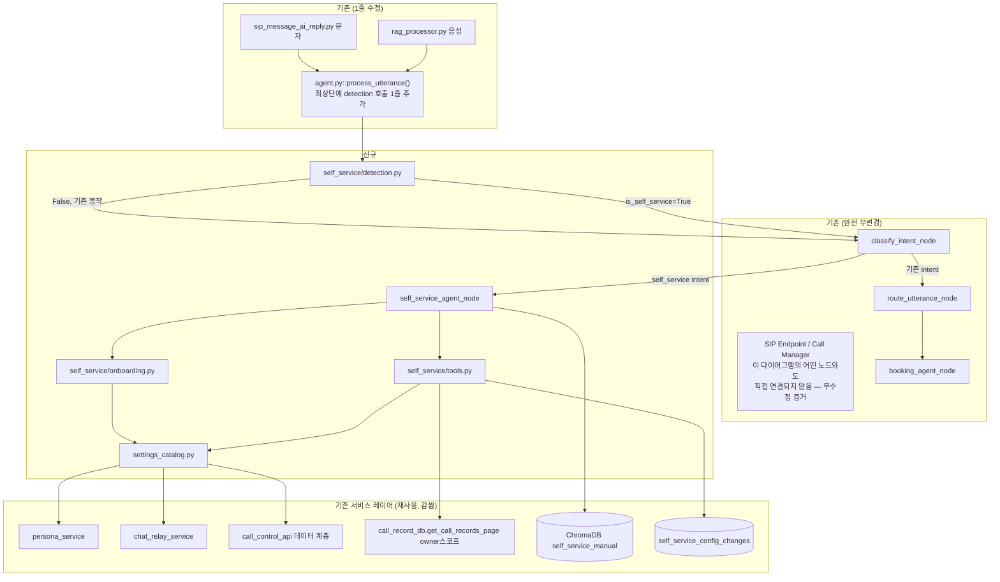

# 셀프서비스 AI 도우미 — Brownfield Enhancement Architecture

**작성일**: 2026-07-14
**버전**: 0.1 (Draft — 완성 초안, 팀 리뷰 필요)
**상태**: 초안 — Story 착수 전
**관련 문서**:
- [self-service-ai-assistant-prd.md](../product/self-service-ai-assistant-prd.md) — 본 아키텍처의 입력 PRD (FR1-11, NFR1-4, CR1-4, Epic 1 Story 1.1-1.9)
- [self-service-ai-assistant-brief.md](../product/self-service-ai-assistant-brief.md) — 상위 Project Brief
- [../design/INTENT_HANDLING_DESIGN.md](../design/INTENT_HANDLING_DESIGN.md)
- [../../src/ai_voicebot/langgraph/nodes/booking_agent.py](../../src/ai_voicebot/langgraph/nodes/booking_agent.py) — Tool-calling 참조 구현

> **생성 방식 안내**: BMAD `architect` 역할의 `brownfield-architecture-tmpl.yaml` 기준 완성 초안(YOLO 모드)입니다. PRD와 달리 본 문서는 **실제 코드베이스를 직접 추적**하여 통합 지점을 확정했으며, 그 과정에서 PRD의 가정 하나를 정정했습니다(§Enhancement Scope 참고). 보안(SIP 본인확인) 설계는 PRD와 동일하게 이번 반복 범위에서 제외합니다.

---

## Introduction

본 문서는 SmartPBX AI에 **셀프서비스 AI 도우미**(테넌트 관리자가 자기 번호로 통화/문자 시 AI가 사용법·설정·통계를 대화로 제공)를 추가하기 위한 아키텍처 청사진이다. 기존 아키텍처를 대체하지 않고 **보완**하며, 신규 컴포넌트가 기존 시스템과 충돌하는 지점에서는 기존 패턴을 우선한다.

### Existing Project Analysis

- **Primary Purpose**: SIP B2BUA + 실시간 음성 AI 통합 PBX 플랫폼 (LangGraph 오케스트레이션, ChromaDB RAG, Pipecat 음성 파이프라인).
- **Current Tech Stack**: Python 3.11+/FastAPI(REST), LangGraph(대화 그래프, AsyncSqliteSaver 체크포인터), ChromaDB(Vector/RAG), Pipecat(음성), Next.js(프론트엔드), Gemini 계열 LLM.
- **Architecture Style**: 모놀리식 단일 리포지토리, 테넌트(owner) 단위 논리적 격리(공유 인프라 + owner 필터).
- **Deployment Method**: 온프레미스 단일 인스턴스(`start-all.ps1`), 컨테이너 표준화는 로드맵 상 별도 트랙.

**Available Documentation**: [technical-architecture.md](technical-architecture.md), [ai-voicebot-architecture.md](ai-voicebot-architecture.md), [api-specification.md](../api/api-specification.md), [INTENT_HANDLING_DESIGN.md](../design/INTENT_HANDLING_DESIGN.md) — 모두 최신이며 document-project 재실행 불필요로 판단.

**Identified Constraints**:
- 모든 RAG·설정 조회는 `owner` 필터 기반 테넌트 격리를 반드시 통과해야 한다.
- LangGraph 그래프 진입점은 `classify_intent` 고정(`graph.set_entry_point("classify_intent")`) — 신규 레인도 이 노드를 거쳐야 한다(완전 우회 불가, 다만 LLM 호출은 조기 반환으로 생략 가능 — 기존 `outbound_purpose` 패턴과 동일).
- SIP REGISTER가 현재 무인증이라는 점은 알려진 이슈이며 본 반복 범위 밖(PRD와 동일 결정).

### Change Log

| Change    | Date       | Version | Description                                                                     | Author                        |
| --------- | ---------- | ------- | ------------------------------------------------------------------------------- | ----------------------------- |
| 초안 생성 | 2026-07-14 | 0.1     | PRD 기반 브라운필드 아키텍처 최초 작성, 셀프콜 감지 지점을 코드 추적으로 재확정 | Copilot (BMAD Architect 역할) |
| 구현 전 검토 | 2026-07-14 | 0.2     | Story 1.4~1.9 작성 과정에서 발견된 드리프트 반영: StatisticsCollector(전역 싱글턴, 부적합) → call_record_db(owner 스코프) 정정, `self_service/onboarding.py` 컴포넌트 보완, Source Tree에 `config/self_service_exclusions.yaml`·Story 1.9 라우터 파일 추가, `_route_after_classify`/`_LANGGRAPH_SCHEMA_VERSION=8` 실제 코드로 재검증 완료 | Copilot (BMAD Architect 역할) |

---

## Enhancement Scope and Integration Strategy

### Enhancement Overview

**Enhancement Type**: New Feature Addition (신규 대화 레인 + 범용 설정 카탈로그)
**Scope**: PRD Epic 1 전체(Story 1.1-1.9, SM 리뷰로 설정 카탈로그 구축을 Story 1.4로 앞당긴 재배치 반영)
**Integration Impact**: Significant — 기존 대화 그래프 진입 로직, 신규 서비스 레이어 조회 계층 확장

### ⚠️ PRD 가정 정정: 셀프콜 감지 지점

PRD·Brief는 감지 지점을 "SIP 레이어(`call_manager.py`/`sip_endpoint.py`)"로 가정했다. **코드 추적 결과, 더 정확하고 침습이 적은 지점을 확인했다:**

```
[음성]  rag_processor.py → self._agent.process_utterance(caller_number=self._caller_id, ...)
[문자]  sip_message_ai_reply.py → agent.process_utterance(text, caller_number=from_peer, ...)
                                         │
                                         ▼
              agent.py :: ConversationAgent.process_utterance()
              ── 두 채널이 공통으로 거치는 유일한 지점 ──
              이미 caller_number, self.owner(=kb_owner) 를 보유
```

두 채널(음성·문자) 모두 결국 `ConversationAgent.process_utterance()`를 호출하며, 이 시점에 이미 `caller_number`(발신측)와 `self.owner`/`_persona_owner`(착신측 테넌트)가 파라미터로 확보되어 있다. 따라서:

- **SIP 프로토콜 레이어(`call_manager.py`, `sip_endpoint.py`)는 전혀 수정할 필요가 없다.**
- 감지는 `src/common/sip_owner.py::normalize_owner_username()`(기존 유틸리티, 이미 양쪽 호출부에서 owner 정규화에 사용 중)로 `caller_number`와 `owner`를 정규화 후 비교하는 **순수 함수 한 번 호출**로 충분하다.

```python
# src/ai_voicebot/self_service/detection.py (신규, 순수 함수 — 단위 테스트 용이)
from src.common.sip_owner import normalize_owner_username

def is_self_service_session(caller_number: str, owner: str) -> bool:
    a = normalize_owner_username(caller_number)
    b = normalize_owner_username(owner)
    return bool(a) and bool(b) and a == b
```

이 정정은 CR1(기존 응대 경로 무영향)을 지키기 훨씬 쉽게 만든다 — SIP 트랜스포트 코드가 아예 변경되지 않으므로 회귀 위험이 구조적으로 낮아진다.

### Integration Approach

**Code Integration Strategy**: `agent.py::process_utterance()` 최상단에서 `is_self_service_session()` 호출 → `invoke_state["is_self_service_session"] = True/False`로 LangGraph state에 주입. 이후 `classify_intent_node`가 (기존 `outbound_purpose` 조기 반환 패턴과 동일하게) 이 플래그를 보고 LLM 호출 없이 즉시 `intent="self_service"`로 단축 반환 → `_route_after_classify`가 신규 `self_service_agent` 노드로 직행.

**Database Integration**: 신규 SQLite 테이블 `self_service_config_changes`(변경 이력 조회용, Story 1.9) 추가. 기존 서비스들이 사용하는 것과 동일한 DB 계층(SQLite 파일 기반)에 배치하여 별도 DB 엔진 도입 없음.

**API Integration**: 신규 REST 엔드포인트를 만들지 않는다. `self_service_tools.py`의 Tool 함수가 각 도메인의 **기존 라우터/서비스 함수를 직접 import**하여 호출한다(`booking_tools.py`가 `src.services.booking_service`를 직접 호출하는 것과 동일 패턴).

**UI Integration**: 신규 페이지 1개(`settings/ai-assistant`)만 추가, 기존 `settings/*` 레이아웃·컴포넌트 재사용.

### Compatibility Requirements

- **Existing API Compatibility**: 신규 REST 엔드포인트 없음 → 100% 호환.
- **Database Schema Compatibility**: 신규 테이블 1개 추가(무관계 독립 테이블) — 기존 스키마 변경 없음.
- **UI/UX Consistency**: 기존 Next.js App Router·컴포넌트 컨벤션 재사용.
- **Performance Impact**: `is_self_service_session()`은 문자열 비교 1회 수준(O(1), <1ms) — NFR1(응답 지연 유지)에 영향 없음.

---

## Tech Stack

### Existing Technology Stack

| Category            | Current Technology   | Version | Usage in Enhancement                                 | Notes                                                             |
| ------------------- | -------------------- | ------- | ---------------------------------------------------- | ----------------------------------------------------------------- |
| Backend Language    | Python               | 3.11+   | 신규 모듈 전부                                       | 기존과 동일                                                       |
| API Framework        | FastAPI               | —       | Story 1.9 전용 조회 API 1개 신규 추가(본 Epic 유일 예외) | 기존 라우터 패턴 재사용, 그 외 Story는 신규 엔드포인트 없음 |
| 대화 오케스트레이션 | LangGraph            | —       | 신규 노드 1개(`self_service_agent`) + state 필드 1개 | `agent.py` 그래프에 조건부 엣지 추가                              |
| Vector DB           | ChromaDB             | —       | 신규 doc_type(`self_service_manual`)                 | 기존 owner 필터 재사용                                            |
| 체크포인터          | AsyncSqliteSaver     | —       | 변경 없음                                            | `_LANGGRAPH_SCHEMA_VERSION` 증가만 필요                           |
| 프론트엔드          | Next.js (App Router) | —       | 신규 페이지 1개                                      | 기존 `settings/persona` 컨벤션 재사용                             |
| LLM                 | Gemini 계열          | —       | 변경 없음                                            | 프롬프트만 신규                                                   |

### New Technology Additions

없음 — 기존 스택만으로 구현 가능(설계 목표: "신규 인프라 투자 없이").

---

## Data Models and Schema Changes

### New Data Models

#### SelfServiceConfigChange

**Purpose**: 자동설정 Tool이 변경한 이력을 프론트엔드(Story 1.9)에서 효율적으로 조회하기 위한 저장소. `call_data_record`(JSONL 로그)에도 동일 이벤트를 기록하지만, 그것은 순차 로그 파일이라 "최근 변경 이력 N건 조회" UI에는 비효율적이므로 별도 인덱스 테이블을 둔다.

**Integration**: `call_data_record`(전체 트레이스, 로그 원칙 준수용)와 `self_service_config_changes`(조회용 인덱스) **이중 기록** — 하나가 source of truth 역할(테이블), 로그는 감사·디버깅용 전체 컨텍스트 보존.

**Key Attributes**:
- `id`: TEXT (PK, UUID) - 변경 레코드 ID
- `owner`: TEXT - 테넌트 ID
- `domain`: TEXT - 설정 도메인(persona/ai-escalation/call-control/chat-relay/contacts/general/integrations)
- `field`: TEXT - 변경된 필드명
- `old_value`: TEXT (JSON 직렬화) - 이전 값
- `new_value`: TEXT (JSON 직렬화) - 새 값
- `changed_at`: TEXT (ISO8601) - 변경 시각
- `call_id`: TEXT - 관련 통화/문자 세션 ID

**Relationships**:
- **With Existing**: `owner`는 기존 테넌트 식별자(`tenant_config.owner`)와 동일 값 도메인.
- **With New**: 없음(독립 테이블).

### Schema Integration Strategy

```
신규 테이블: self_service_config_changes (owner, domain, field, old_value, new_value, changed_at, call_id)
수정 테이블: 없음
신규 인덱스: (owner, changed_at DESC) — 최근 변경 이력 조회 최적화
마이그레이션: 기존 sip-pbx/migrations/ 컨벤션에 따라 신규 마이그레이션 파일 1개 추가
```

**Backward Compatibility**: 신규 독립 테이블이므로 기존 쿼리·스키마에 영향 없음.

---

## Component Architecture

### New Components

#### `self_service/detection.py`

**Responsibility**: 셀프콜/셀프문자 판별 순수 함수(`is_self_service_session`).
**Integration Points**: `agent.py::process_utterance()` 최상단에서 1회 호출.
**Key Interfaces**: `is_self_service_session(caller_number: str, owner: str) -> bool`
**Dependencies**: 기존 `src/common/sip_owner.py::normalize_owner_username` (기존 컴포넌트만 의존, 신규 의존성 없음)
**Technology Stack**: 순수 Python, 외부 I/O 없음(단위 테스트 용이 — 목업 불필요).

#### `self_service/settings_catalog.py`

**Responsibility**: 7개 설정 도메인(persona, ai-escalation, call-control, chat-relay, contacts, general, integrations) 각각의 (a) 조회 함수, (b) 변경 함수, (c) 필수/옵션 필드 스키마, (d) destructive 여부를 등록하는 레지스트리. `booking_tools.get_booking_settings`가 예약 도메인 하나에 대해 하던 역할을 전 도메인으로 일반화.
**Integration Points**: 각 도메인의 **기존** 조회/변경 함수를 감싼다(wrap) — 예: `chat-relay` 도메인은 기존 `src.services.chat_relay_service.get_chat_relay_settings`를 그대로 참조.
**Key Interfaces**:
- `list_domains() -> list[str]`
- `get_domain_schema(domain: str) -> dict` (필수/옵션 필드, 타입, destructive 플래그)
- `get_domain_value(domain: str, owner: str) -> dict`
- `update_domain_value(domain: str, owner: str, field: str, value: Any) -> dict`

**Dependencies**:
- **Existing Components**: `chat_relay_service.py`(chat-relay 도메인, 확인됨), `persona_service`(persona 도메인), `call_control_api.py`의 데이터 접근 로직(call-control 도메인) 등. **ai-escalation/contacts/general/integrations 4개 도메인의 정확한 백엔드 함수는 Story 1.4(설정 카탈로그 구축) 착수 시 각 라우터(`hitl.py`/`operator_status_api.py`, `caller_contacts.py`/`contact_folders.py`, `tenants.py`, `google_calendar.py` 등 후보)를 재검증하여 확정한다 — 현재는 프론트엔드 폴더 존재만 확인됨.**
- **New Components**: 없음(리프 컴포넌트)

#### `self_service/tools.py` (LangGraph Tool-calling)

**Responsibility**: `settings_catalog.py`/`onboarding.py`를 LangChain/LangGraph Tool 형태로 노출(`_make_tool` 패턴, `booking_tools.py`와 동일).
**Integration Points**: `self_service_agent.py`의 LLM에 bind.
**Key Interfaces**: `get_self_service_settings`, `update_self_service_setting`, `get_self_service_stats`, `get_onboarding_checklist`
**Dependencies**: `settings_catalog.py`, `self_service/onboarding.py`, **`src.common.call_record_db.get_call_records_page(owner=...)`**(통계 Tool — 아래 · 수정 참고)
**Technology Stack**: `booking_tools.py`와 동일한 `_make_tool(fn)` 래퍼.

> **수정(SM/Story 1.7 리뷰 반영)**: 초안은 통계 Tool이 `src/events/statistics.py::StatisticsCollector`를 재사용한다고 서술했으나, **코드 확인 결과 `StatisticsCollector`는 owner/테넌트 파라미터가 없는 전역 프로세스 싱글턴**임이 확인되어(PBX 운영 대시보드용, 테넌트별 분리 불가) 부적합하다. **실제 데이터 소스는 `owner` 파라미터를 지원하는 `src.common.call_record_db.get_call_records_page(owner=..., limit=..., offset=...)`**로 정정한다(`src/api/routers/metrics.py::_count_unresolved_calls`에서 실제 사용 확인됨).

#### `self_service/onboarding.py`

**Responsibility**: 설정 카탈로그 조회 결과를 바탕으로 도메인별 "미완료" 여부를 판정(온보딩 체크리스트, Story 1.5).
**Integration Points**: `self_service/tools.py`의 `get_onboarding_checklist` Tool이 호출.
**Key Interfaces**: `get_incomplete_domains(owner: str) -> list[dict]`
**Dependencies**:
- **Existing Components**: 없음(settings_catalog를 통해서만 간접 접근)
- **New Components**: `settings_catalog.py`(조회 전용, 쓰기 없음 — Story 1.4 IV1 원칙과 정합)

> **추가 이유(SM/Story 1.5 리뷰 반영)**: 초안은 온보딩 판정 로직을 별도 컴포넌트로 명시하지 않았으나, "카탈로그는 순수 조회, 온보딩 판정은 별도 관심사"로 관심사를 분리하기 위해 Story 작성 단계에서 신규 컴포넌트로 확정되었다(Story 1.4 IV1 "카탈로그의 조회 함수만 사용" 원칙 준수).

#### `langgraph/nodes/self_service_agent.py`

**Responsibility**: 셀프서비스 세션의 LLM+Tool 루프 실행(`booking_agent_node`와 병렬 구조).
**Integration Points**: `agent.py`의 `_build_state_graph()`에 노드·조건부 엣지 추가.
**Key Interfaces**: `async def self_service_agent_node(state: ConversationState) -> dict`
**Dependencies**:
- **Existing Components**: `call_context.py`(LLM 클라이언트 획득), `call_data_record_logger.py`(로깅)
- **New Components**: `self_service/tools.py`

### Component Interaction Diagram



> **다이어그램 정정(구현 전 검토, 2026-07-14)**: 초안은 `STATS[StatisticsCollector / CDR]`로 표기했으나 위 §self_service/tools.py 수정 사항대로 `call_record_db`로 교체했다. 또한 `agent.py`는 "완전 무변경"이 아니라 "1줄만 추가"이므로 별도 서브그래프로 분리해 정확도를 높였고, `SIP Endpoint`는 어떤 신규 노드와도 연결되지 않음을 명시적으로 표시해 "SIP 레이어 무수정"이라는 §Enhancement Scope의 핵심 주장을 다이어그램에서도 시각적으로 뒷받침하도록 했다. `self_service/onboarding.py`(OB)도 누락되어 있었기에 추가했다.

---

## Source Tree

### Existing Project Structure (관련 부분만)

```
sip-pbx/src/
  ai_voicebot/
    langgraph/
      agent.py                  # 그래프 빌더, process_utterance() 진입점
      state.py                  # ConversationState
      nodes/
        classify_intent.py
        route_utterance.py
        booking_agent.py        # 참조 패턴
      tools/
        booking_tools.py        # 참조 패턴
    knowledge/
      organization_info.py      # tenant_config 로드
  common/
    sip_owner.py                # normalize_owner_username (재사용)
    call_data_record_logger.py
  services/
    chat_relay_service.py       # get_chat_relay_settings (확인됨)
    sip_message_ai_reply.py     # 문자 채널 진입점
  events/
    statistics.py               # StatisticsCollector
  api/routers/
    call_control_api.py
    persona.py
    tenants.py
```

### New File Organization

```
sip-pbx/src/
  ai_voicebot/
    self_service/                        # 신규 패키지
    │   ├── __init__.py
    │   ├── detection.py                 # is_self_service_session()
    │   ├── settings_catalog.py          # 도메인 레지스트리(조회 Story 1.4 + 변경 Story 1.8)
    │   ├── onboarding.py                 # 온보딩 체크리스트 판정 로직(Story 1.5)
    │   └── tools.py                     # LangGraph Tool 래퍼
    ├── langgraph/
    │   ├── agent.py                     # 기존 파일 수정: process_utterance()에 detection 호출 추가,
    │   │                                #   _build_state_graph()에 노드/엣지 추가
    │   ├── state.py                     # 기존 파일 수정: is_self_service_session 필드 추가
    │   └── nodes/
    │       ├── classify_intent.py       # 기존 파일 수정: is_self_service_session 조기 반환 분기 추가
    │       └── self_service_agent.py    # 신규 (booking_agent.py 병렬 구조)
  api/routers/
    self_service_config_changes.py       # 신규(가칭) — Story 1.9 전용 조회 API 1개
                                          #   (본 Epic에서 유일하게 신규 REST 엔드포인트가 필요한 지점)
  migrations/
    00XX_self_service_config_changes.sql # 신규 마이그레이션

config/
  self_service_exclusions.yaml           # 신규 — 자동설정 제외 목록(destructive 항목, Story 1.8)

sip-pbx/frontend/app/settings/
  ai-assistant/                          # 신규 프론트엔드 페이지
  └── page.tsx
```

### Integration Guidelines

- **File Naming**: 기존 `booking_*` 컨벤션을 `self_service_*`로 미러링(패키지명은 `self_service/`로 통일해 booking처럼 파일명 접두어 대신 디렉터리로 응집).
- **Folder Organization**: LangGraph 노드/Tool은 각각 기존 `nodes/`, `tools/` 하위에 위치시켜 booking과 동일한 탐색 경험 유지. 순수 로직(`detection.py`, `settings_catalog.py`)만 별도 `self_service/` 패키지로 분리해 LangGraph 의존성과 도메인 로직을 분리.
- **Import/Export Patterns**: `settings_catalog.py`는 각 도메인 서비스 모듈을 **함수 내부 지연 import**로 참조(기존 `booking_tools.py`의 `from src.services.booking_service import ...` 패턴과 동일 — 순환 import 방지).

---

## Infrastructure and Deployment Integration

### Existing Infrastructure

**Current Deployment**: 단일 온프레미스 인스턴스, `start-all.ps1`로 SIP/API/WebSocket/Frontend 프로세스 기동.
**Infrastructure Tools**: 없음(컨테이너화 로드맵 별도 트랙).
**Environments**: 로컬 개발 환경 중심(운영 배포는 `production-deployment-architecture.md` 별도 문서).

### Enhancement Deployment Strategy

**Deployment Approach**: 기존 프로세스 재시작만으로 반영(신규 프로세스·포트 없음). 신규 마이그레이션은 서버 기동 전 1회 적용.
**Infrastructure Changes**: 없음.
**Pipeline Integration**: 기존 `start-all.ps1` 변경 불필요.

### Rollback Strategy

**Rollback Method**: 신규 코드는 `is_self_service_session=False` 경로에 전혀 개입하지 않으므로, 기능 자체를 롤백하려면 `agent.py`의 detection 호출과 `classify_intent`의 조기 분기만 되돌리면 된다(신규 테이블·프론트 페이지는 무해하게 방치 가능).
**Risk Mitigation**: `_LANGGRAPH_SCHEMA_VERSION` 증가로 체크포인터 캐시 무효화 — 배포 직후 기존 세션 캐시와 충돌 없음.
**Monitoring**: `call_data_record`의 `self_service_session_started`/`self_service_auto_config_applied` 이벤트 카운트를 배포 직후 모니터링하여 이상 트리거 여부 확인.

---

## Coding Standards

### Existing Standards Compliance

**Code Style**: structlog 기반 구조적 로깅, 함수 내부 지연 import(순환 참조 방지), Google-style 한글 docstring.
**Testing Patterns**: `sip-pbx/tests/`, `tests_new/` — pytest 기반.
**Documentation Style**: 파일 상단 목적 설명 docstring + 인라인 근거 주석(`.github/copilot-instructions.md` 로깅 원칙과 정합).

### Enhancement-Specific Standards

- **설정 카탈로그 등록 규칙**: 신규 설정 도메인/필드 추가 시 `settings_catalog.py`에 등록하지 않으면 자동설정 대상에서 제외된다 — 이 규칙을 코드 주석과 PR 체크리스트에 명시한다(FR11 근거).
- **Destructive 플래그 기본값**: 신규 도메인 등록 시 `destructive` 기본값은 `True`(안전측 실패) — 명시적으로 `False`로 지정한 경우만 자동설정 허용.

### Critical Integration Rules

- **Existing API Compatibility**: 신규 REST 엔드포인트 없음 원칙 유지(예외 시 별도 논의).
- **Database Integration**: 신규 테이블은 기존 테이블과 FK 관계 없음 — 조인 없는 독립 조회만 수행(단순성 우선).
- **Error Handling**: `self_service_tools.py`의 모든 Tool은 `booking_tools.py`와 동일하게 예외를 JSON `{"error": ...}` 문자열로 반환(LLM이 파싱 가능한 형태 유지).
- **Logging Consistency**: 모든 자동설정 실행은 `call_data_record`(전체 트레이스)와 `self_service_config_changes`(조회 인덱스) **양쪽에 기록**(§Data Models 참고).

---

## Testing Strategy

### Integration with Existing Tests

**Existing Test Framework**: pytest
**Test Organization**: `sip-pbx/tests/`, `tests_new/`
**Coverage Requirements**: 별도 강제 커버리지 수치 없음(기존 관행 유지) — 단, 회귀 검증(Integration Verification)은 PRD Story별 필수.

### New Testing Requirements

#### Unit Tests for New Components

- **Framework**: pytest
- **Location**: `tests_new/test_self_service_detection.py`, `tests_new/test_settings_catalog.py`
- **Coverage Target**: `detection.py`는 순수 함수이므로 100% 커버(입력 조합 전수 테스트 용이).
- **Integration with Existing**: 없음(외부 의존성 없는 순수 로직).

#### Integration Tests

- **Scope**: `agent.py::process_utterance()`가 self-service/일반 세션을 올바르게 분기하는지, `classify_intent_node`가 조기 반환 시 LLM을 호출하지 않는지.
- **Existing System Verification**: 기존 `question`/`booking` 등 intent 분류 테스트가 `is_self_service_session` 필드 추가 후에도 그대로 통과해야 한다.
- **New Feature Testing**: 7개 도메인 각각에 대해 조회/자동설정 왕복 테스트(카탈로그 커버리지 검증, PRD Story 1.8 IV3과 동일).

#### Regression Testing

- **Existing Feature Verification**: `booking`, `question`, `chitchat` 등 기존 intent 분류·RAG·HITL 파이프라인이 self-service 코드 추가 전후 동일 결과를 내는지 스냅샷 비교.
- **Automated Regression Suite**: 기존 `tests_new/` 스위트 전체 실행을 CI(또는 로컬 pre-merge)에 포함.
- **Manual Testing Requirements**: 실제 SIP 소프트폰으로 "자기 번호로 전화/문자" 시나리오 수동 검증(감지 로직이 실제 SIP 스택 값으로 정상 동작하는지).

---

## Security Integration

> **범위 안내**: 사용자 결정(2026-07-14)에 따라 SIP 본인확인 강화(REGISTER 인증 등)는 본 반복 범위에서 제외한다. 아래는 최소한의 "구현 위생" 수준만 다룬다 — 심층 보안 설계는 별도 트랙.

### Existing Security Measures

**Authentication**: REGISTER 무인증(알려진 이슈, 범위 밖).
**Authorization**: `owner` 필터 기반 테넌트 스코프 격리(RAG·설정 조회 전반에 일관 적용).
**Data Protection**: 특이사항 없음(기존 수준 유지).

### Enhancement Security Requirements

**New Security Measures**: 자동설정 Tool은 항상 `owner`(현재 셀프서비스 세션의 테넌트)로만 카탈로그를 조회/변경하며, 다른 테넌트의 owner 파라미터를 받아들이지 않는다(코드 레벨에서 `owner`를 세션 컨텍스트로 고정, LLM이 임의로 변경 불가하게 함수 시그니처 설계).
**Integration Points**: `settings_catalog.py`의 모든 함수는 `owner`를 첫 인자로 강제.
**Compliance Requirements**: 없음(내부 도구, 규제 대상 아님).

### Security Testing

**Existing Security Tests**: 없음(범위 밖).
**New Security Test Requirements**: 화이트/제외 목록 우회 시도(프롬프트 인젝션 유사 입력)가 실제 변경으로 이어지지 않는지 테스트(PRD Story 1.8 IV2).
**Penetration Testing**: 범위 밖(별도 트랙).

---

## Checklist Results Report

_(architect-checklist 실행 전 — 팀 리뷰 후 PO의 `po-master-checklist` 검증과 함께 진행 예정)_

---

## Next Steps

### Story Manager Handoff

다음 프롬프트로 `sm` 에이전트를 기동하여 Story 1.1부터 순차적으로 Dev Story를 생성해 주세요:

> 본 아키텍처([self-service-ai-assistant-architecture.md](self-service-ai-assistant-architecture.md))와 PRD([self-service-ai-assistant-prd.md](../product/self-service-ai-assistant-prd.md))를 기반으로 Epic 1의 Story 1.1(셀프콜/셀프문자 감지 및 세션 플래그)부터 `create-next-story` 태스크로 Dev Story를 작성해 주세요.
>
> **핵심 통합 지점(검증 완료)**: 감지 로직은 SIP 레이어가 아닌 `src/ai_voicebot/langgraph/agent.py::ConversationAgent.process_utterance()`에 위치하며, 신규 `src/ai_voicebot/self_service/detection.py::is_self_service_session()` 순수 함수를 호출한다. 기존 `src/common/sip_owner.py::normalize_owner_username()`을 재사용한다.
>
> **기존 시스템 무결성 우선**: `is_self_service_session=False`(일반 고객 응대) 경로는 코드 추가 전후 100% 동일하게 동작해야 한다. Story 1.1의 Integration Verification(IV1-IV3)을 반드시 만족해야 다음 Story로 진행한다.

### Developer Handoff

Dev 에이전트는 Story 파일(`docs/stories/1.x.*.md`)만으로 구현 가능해야 하며, 본 아키텍처 문서를 다시 참조할 필요가 없도록 SM이 Dev Notes에 충분한 컨텍스트를 포함해야 한다. 특히:
- `settings_catalog.py`의 ai-escalation/contacts/general/integrations 4개 도메인 백엔드 함수는 **Story 1.4 착수 시 재검증 필수**(본 문서에서 확정하지 않은 부분, §Component Architecture 참고).
- 모든 신규 Tool은 예외 시 `{"error": ...}` JSON 문자열 반환 원칙을 따른다(§Coding Standards).

---

*최종 업데이트: 2026-07-14*
