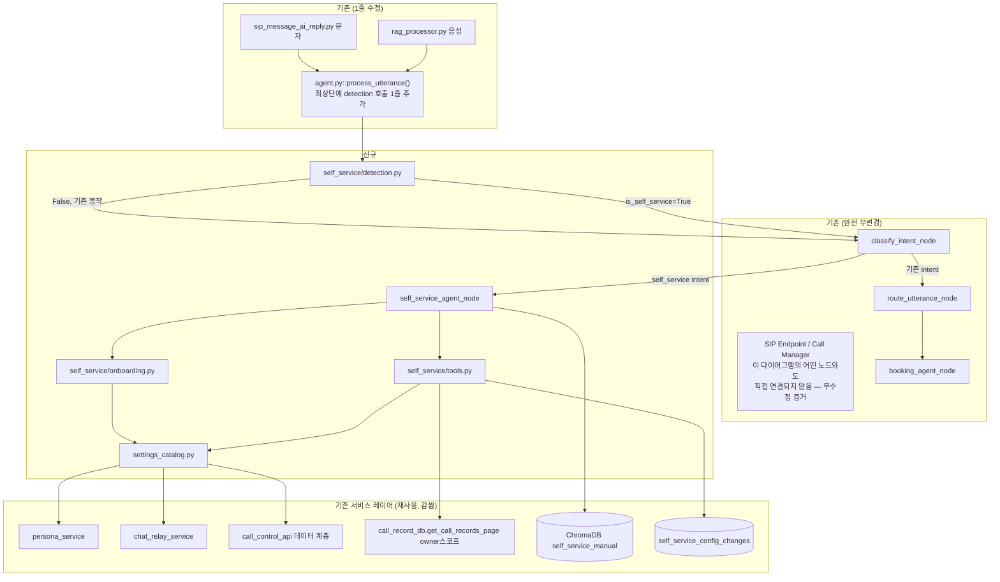
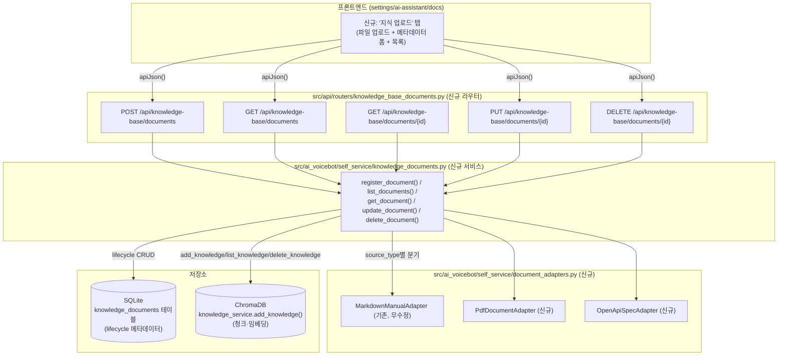
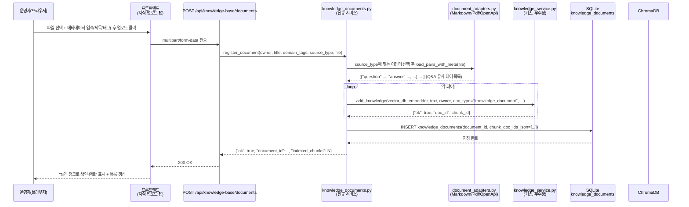
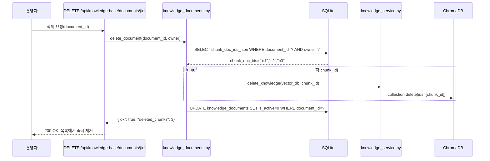
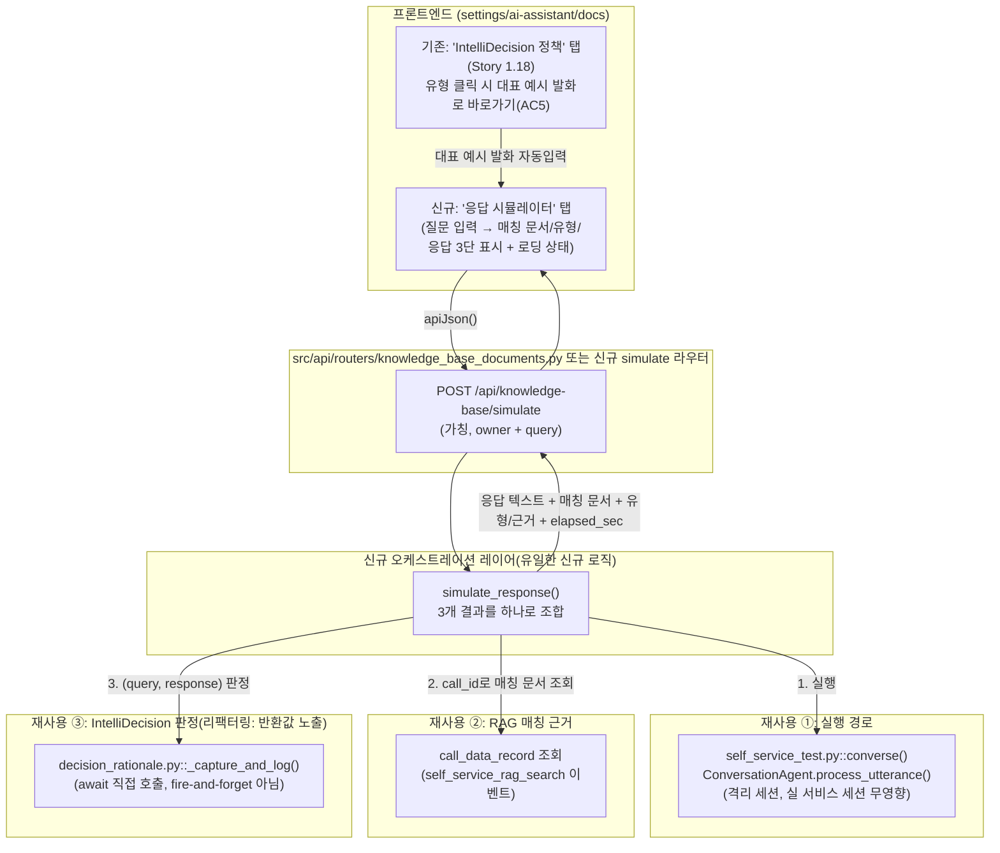
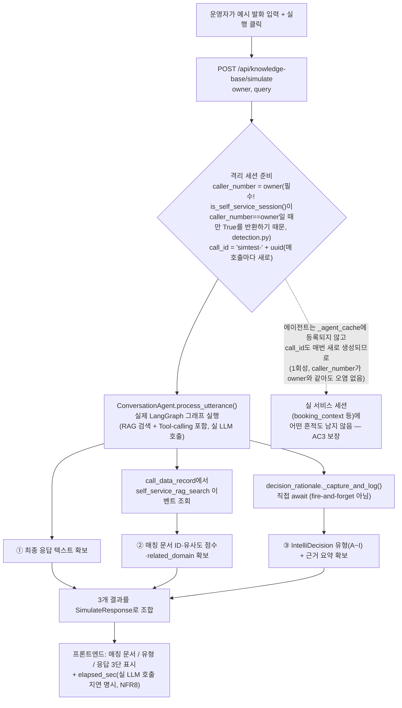

# 셀프서비스 AI 도우미 — Brownfield Enhancement Architecture

**작성일**: 2026-07-14
**버전**: 0.22 (2026-08-05 갱신 — Story 1.33 구현 완료: 유형 C 카탈로그 도메인별 병렬 하이브리드 RAG)
프롬프트 산문 자동 렌더링(Story 1.19))
**상태**: Epic 1(Story 1.1~1.19) 구현·실서버 검증 완료 + Epic 2(Story 2.1~2.8) 구현·실서버 검증 완료 + Story 1.23~1.25 구현 완료, 도메인 비종속 지식베이스 플랫폼(Story 1.26~1.29)는 설계만 반영(Draft)
**관련 문서**:
- [self-service-ai-assistant-prd.md](../product/self-service-ai-assistant-prd.md) — 본 아키텍처의 입력 PRD (FR1-11, NFR1-4, CR1-4, Epic 1 Story 1.1-1.9)
- [self-service-ai-assistant-brief.md](../product/self-service-ai-assistant-brief.md) — 상위 Project Brief
- [../design/INTENT_HANDLING_DESIGN.md](../design/INTENT_HANDLING_DESIGN.md)
- [../../src/ai_voicebot/langgraph/nodes/booking_agent.py](../../src/ai_voicebot/langgraph/nodes/booking_agent.py) — Tool-calling 참조 구현

> **생성 방식 안내**: BMAD `architect` 역할의 `brownfield-architecture-tmpl.yaml` 기준 완성 초안(YOLO 모드)입니다. PRD와 달리 본 문서는 **실제 코드베이스를 직접 추적**하여 통합 지점을 확정했으며, 그 과정에서 PRD의 가정 하나를 정정했습니다(§Enhancement Scope 참고). 보안(SIP 본인확인) 설계는 PRD와 동일하게 이번 반복 범위에서 제외합니다.

---

## Introduction

본 문서는 SmartPBX AI에 **셀프서비스 AI 도우미**(테넌트 관리자가 자기 번호로 통화/문자 시 AI가 사용법·설정·통계를 대화로 제공)를 추가하기 위한 아키텍처 청사진이다. 기존 아키텍처를 대체하지 않고 **보완**하며, 신규 컴포넌트가 기존 시스템과 충돌하는 지점에서는 기존 패턴을 우선한다.

### Existing Project Analysis

- **Primary Purpose**: SIP B2BUA + 실시간 음성 AI 통합 PBX 플랫폼 (LangGraph 오케스트레이션, ChromaDB RAG, Pipecat 음성 파이프라인).
- **Current Tech Stack**: Python 3.11+/FastAPI(REST), LangGraph(대화 그래프, AsyncSqliteSaver 체크포인터), ChromaDB(Vector/RAG), Pipecat(음성), Next.js(프론트엔드), Gemini 계열 LLM.
- **Architecture Style**: 모놀리식 단일 리포지토리, 테넌트(owner) 단위 논리적 격리(공유 인프라 + owner 필터).
- **Deployment Method**: 온프레미스 단일 인스턴스(`start-all.ps1`), 컨테이너 표준화는 로드맵 상 별도 트랙.

**Available Documentation**: [technical-architecture.md](technical-architecture.md), [ai-voicebot-architecture.md](ai-voicebot-architecture.md), [api-specification.md](../api/api-specification.md), [INTENT_HANDLING_DESIGN.md](../design/INTENT_HANDLING_DESIGN.md) — 모두 최신이며 document-project 재실행 불필요로 판단.

**Identified Constraints**:
- 모든 RAG·설정 조회는 `owner` 필터 기반 테넌트 격리를 반드시 통과해야 한다.
- LangGraph 그래프 진입점은 `classify_intent` 고정(`graph.set_entry_point("classify_intent")`) — 신규 레인도 이 노드를 거쳐야 한다(완전 우회 불가, 다만 LLM 호출은 조기 반환으로 생략 가능 — 기존 `outbound_purpose` 패턴과 동일).
- SIP REGISTER가 현재 무인증이라는 점은 알려진 이슈이며 본 반복 범위 밖(PRD와 동일 결정).

### Change Log

| Change                                                                               | Date       | Version | Description                                                                                                                                                                                                                                                                                                                                                                                                                                                                                                                                                            | Author                        |
| ------------------------------------------------------------------------------------ | ---------- | ------- | ---------------------------------------------------------------------------------------------------------------------------------------------------------------------------------------------------------------------------------------------------------------------------------------------------------------------------------------------------------------------------------------------------------------------------------------------------------------------------------------------------------------------------------------------------------------------- | ----------------------------- |
| 초안 생성                                                                            | 2026-07-14 | 0.1     | PRD 기반 브라운필드 아키텍처 최초 작성, 셀프콜 감지 지점을 코드 추적으로 재확정                                                                                                                                                                                                                                                                                                                                                                                                                                                                                        | Copilot (BMAD Architect 역할) |
| 구현 전 검토                                                                         | 2026-07-14 | 0.2     | Story 1.4~1.9 작성 과정에서 발견된 드리프트 반영: StatisticsCollector(전역 싱글턴, 부적합) → call_record_db(owner 스코프) 정정, `self_service/onboarding.py` 컴포넌트 보완, Source Tree에 `config/self_service_exclusions.yaml`·Story 1.9 라우터 파일 추가, `_route_after_classify`/`_LANGGRAPH_SCHEMA_VERSION=8` 실제 코드로 재검증 완료                                                                                                                                                                                                                              | Copilot (BMAD Architect 역할) |
| 범위 추가                                                                            | 2026-07-20 | 0.3     | 통화 이력 자연어 질의(Call History NLQ) 신규 컴포넌트 `self_service/call_history_query.py` 추가(PRD FR15/NFR5, Story 1.13) — 새 벡터 임베딩 없이 기존 `call_record_db.get_call_records_page` 구조화 검색/집계로 구현                                                                                                                                                                                                                                                                                                                                                   | Copilot (BMAD Architect 역할) |
| Epic 2 신설                                                                          | 2026-07-20 | 0.4     | 설정 카탈로그/Screen Graph 동적화(§Epic 2 Component Architecture 신설) — DB 저장소 + 함수 화이트리스트 레지스트리 패턴, 프론트엔드 다운로드/업로드 API, IntelliDecision 키워드 힌트 제거 방향 반영(PRD Epic 2, Story 2.1~2.8)                                                                                                                                                                                                                                                                                                                                          | Copilot (BMAD Architect 역할) |
| IntelliDecision 유형 C                                                               | 2026-07-23 | 0.5     | 유형 A/B가 다루지 않던 포괄적 도움 요청("뭘 할 수 있어?")을 위한 유형 C 신설(PRD FR25, Story 1.15) — 기본 시스템 프롬프트에 추가되어 3개 Tool-calling 폴백 경로 모두에 항상 적용, 매뉴얼 §9 콘텐츠도 함께 최신화                                                                                                                                                                                                                                                                                                                                                       | Copilot (BMAD Architect 역할) |
| IntelliDecision 유형 D~I                                                             | 2026-07-23 | 0.6     | 대화 수리·복구 패턴 6종(정정/실행취소/모호성해소/일괄처리/범위외설명/반복요청) 신설(PRD FR26, Story 1.16) — D/F/G/H/I는 프롬프트 규칙만 추가, E(Undo)만 신규 Tool 2개(`get_last_self_service_change`/`undo_last_self_service_change`) 추가                                                                                                                                                                                                                                                                                                                             | Copilot (BMAD Architect 역할) |
| 능력 레지스트리 구현                                                                 | 2026-07-23 | 0.7     | 유형 C 능력 안내를 하드코딩 문구에서 `settings_catalog` 실시간 데이터+Tool 정적 매핑 기반 동적 생성으로 전환(PRD FR27, Story 1.17) — 신규 캐시/신규 API/신규 프론트엔드 탭 없이 기존 `settings_catalog`/`/catalog`/`/screen-graph`/도움말 페이지를 그대로 재사용(결정 지원 리포트 권장안 채택), 매뉴얼 §9 축소                                                                                                                                                                                                                                                         | Copilot (BMAD Architect 역할) |
| IntelliDecision 정책 레지스트리                                                      | 2026-07-28 | 0.8     | 유형 A~I의 코드/이름/트리거 예시/Tool 필요 여부를 `intellidecision_policy.py` 정적 레지스트리로 데이터화, Screen Graph를 `knowledge_graph.py::traverse()`로 2-hop(도메인→writable 여부→적용 가능 유형)까지 확장(PRD FR28, Story 1.18), 읽기 전용 API+시각화 탭 추가                                                                                                                                                                                                                                                                                                    | Copilot (BMAD Architect 역할) |
| 프롬프트 산문 자동 렌더링                                                            | 2026-07-28 | 0.9     | 하드코딩 18개 응답 규칙을 `prompt_rules.py` 정적 리스트+센티널 토큰 기반 자동 렌더링으로 전환해 번호 재조정 함정을 구조적으로 해결(PRD FR29, Story 1.19)                                                                                                                                                                                                                                                                                                                                                                                                               | Copilot (BMAD Architect 역할) |
| IntelliDecision 판단 근거 투명성 설계                                                | 2026-07-29 | 0.10    | 판단 결과(유형 코드·근거 요약)를 별도 저장·프론트엔드 열람 가능하게 하는 설계 추가(PRD FR30/NFR6, Story 1.20~1.22) — 캡처 방식은 Story 1.20에서 스파이크로 결정 예정, 이번 갱신은 설계 옵션만 문서화                                                                                                                                                                                                                                                                                                                                                                   | Copilot (BMAD Architect 역할) |
| RAG·IntelliDecision 고도화 설계 방향                                                 | 2026-07-30 | 0.11    | 시장·연구 리서치([SELF_SERVICE_RAG_INTELLIDECISION_ADVANCEMENT_RESEARCH.md](../design/SELF_SERVICE_RAG_INTELLIDECISION_ADVANCEMENT_RESEARCH.md)) 반영(PRD FR31/NFR7). §Epic 1 확장에 「지식베이스 인벤토리 투명성」(신규 읽기 전용 API+탭, Story 1.23)/「IntelliDecision-RAG 매칭 정책 메타데이터」(`intellidecision_policy.py` 확장+trace 로깅, Story 1.24)/「매뉴얼 색인 소스 어댑터 일반화」(`manual_indexer.py` 리팩터링, Story 1.25) 설계 방향 신설 — 이번 갱신은 방향 문서화만, 구현은 각 Story 착수 시 진행                                                     | Copilot (BMAD Architect 역할) |
| Story 1.23/1.24 구현 완료                                                            | 2026-07-30 | 0.12    | 지식베이스 인벤토리 API+탭(Story 1.23), `IntentTypeSpec` RAG 매칭 메타데이터+`self_service_rag_matched` trace 로깅+프론트엔드 배지(Story 1.24) 코드·단위테스트 구현 완료(실서버 IV만 잔여) — 둘 다 순수 관측/메타데이터 추가로 응대 로직 무변경                                                                                                                                                                                                                                                                                                                        | Copilot (BMAD Architect 역할) |
| Story 1.25 구현 완료                                                                 | 2026-08-03 | 0.13    | `manual_indexer.py`에 `SourceAdapter` 프로토콜+`MarkdownManualAdapter`(기존 파서 그대로 이관) 도입, `index_self_service_manual(adapter=)` 옵션 파라미터로 확장(기존 호출부 무수정). 리팩터링 전후 동일성 직접 비교 단위테스트 추가. Contextual Retrieval은 별도 스파이크 선행 필요로 미착수 유지                                                                                                                                                                                                                                                                       | Copilot (BMAD Architect 역할) |
| 도메인 비종속 지식베이스 플랫폼 설계                                                 | 2026-08-04 | 0.14    | 사용자가 범위를 넘어서는 더 큰 전환을 요청 — 리서치 문서를 재작성([SELF_SERVICE_RAG_INTELLIDECISION_ADVANCEMENT_RESEARCH.md](../design/SELF_SERVICE_RAG_INTELLIDECISION_ADVANCEMENT_RESEARCH.md) v2.0)하고 신규 §로 반영(PRD FR32). 지식 문서 CRUD API/업로드 프론트(Story 1.26), 실제 LLM 응답 기반 응답 시뮬레이터(Story 1.27), `knowledge_graph.py` n-hop 일반화(Story 1.28), Contextual Retrieval 스파이크(Story 1.29) 설계 방향만 문서화 — 구현은 Story 착수 시 진행                                                                                              | Copilot (BMAD Architect 역할) |
| Story 1.26 상세 아키텍처 설계                                                        | 2026-08-04 | 0.15    | Story 1.26 착수 직전, 컴포넌트 다이어그램(mermaid)·`knowledge_documents` 테이블 스키마·API 계약표·업로드/삭제 시퀀스 다이어그램(mermaid)·참고문헌 매핑표 신설(기존 `self_service_catalog_config`/`SourceAdapter`/`knowledge_service` 패턴 재사용, 신규 아키텍처 패턴 없음)                                                                                                                                                                                                                                                                                             | Copilot (BMAD Architect 역할) |
| Story 1.27 상세 아키텍처 설계                                                        | 2026-08-04 | 0.16    | Story 1.27 착수 직전, 컴포넌트 다이어그램(mermaid)·시뮬레이션 요청/응답 시퀀스 다이어그램(mermaid)·IntelliDecision 판정 흐름도(flowchart)·API 계약표·참고문헌 매핑표 신설. 핵심 설계 결정: 기존 `POST /api/self-service/test/converse` 실행 경로를 그대로 재사용하고, `decision_rationale.py`의 fire-and-forget 비동기 캡처를 **동기 대기 가능한 형태로 리팩터링**(반환값 노출)해 시뮬레이터 응답에 유형·근거를 동기적으로 포함시키는 방향으로 확정                                                                                                                    | Copilot (BMAD Architect 역할) |
| Story 1.27 구현+IV 검증 완료                                                         | 2026-08-04 | 0.17    | 백엔드(`knowledge_base_simulate.py`)/프론트엔드("응답 시뮬레이터" 탭) 구현 완료. **실서버 IV 검증 중 설계 오류 발견·수정**: 격리를 위해 `caller_number`를 임의의 `sim-` 값으로 썼으나, `detection.py::is_self_service_session()`이 caller_number==owner일 때만 True를 반환해 self_service_agent 경로 자체를 타지 못하는 치명적 버그를 발견 — caller_number=owner로 수정하고 격리는 call_id+캐시 미등록으로만 보장하도록 재설계. `test/converse`와의 크로스체크(matched_doc_ids 완전 일치)로 AC2 최종 검증 완료                                                         | Copilot (BMAD Architect 역할) |
| Story 1.28 구현 완료                                                                 | 2026-08-04 | 0.18    | `knowledge_graph.py`를 노드 타입(`manual_qa`/`catalog_domain`/`frontend_screen`/`intent_type`+신규 `document`/`api_endpoint`/`procedure_step`) 및 엣지 타입(`rendered_by`/`writable`/`relates_to`+신규 `depends_on`/`documents`) 레지스트리로 일반화, 범용 `traverse_graph()` 구현. 기존 `traverse()`/`format_decision_hint()`는 이 엔진 위 얇은 래퍼로 재작성되어 Story 1.18과 바이트 단위 동일함을 직접비교 단위테스트로 검증(AC5). `relates_to` 엣지로 Story 1.26 업로드 문서를 `document` 노드로 실제 연결 검증, `rag_strategy_hint="graph_local"`을 유형 A에 적용 | Copilot (BMAD Dev 역할)       |
| Story 1.29 스파이크 실측 완료                                                        | 2026-08-04 | 0.19    | `scripts/spike_contextual_retrieval.py`로 owner 9001 매뉴얼 Q&A 52건에 대해 Contextual Retrieval을 실제 Gemini 호출로 실측(self-retrieval hit@1/hit@3 벤치마크). **결론: 미채택**(hit@1 94.23%→86.54%로 악화, 52회 호출·362.9초 비용만 추가) — 순수 파이썬 BM25는 hit@1/hit@3 100%로 벡터 검색 대비 우수해 후속 Story 검토 권장. 프로덕션 코드는 무변경(스파이크 스크립트만 신설)                                                                                                                                                                                      | Copilot (BMAD Dev 역할)       |
| FR33 계획 증분(업로드 통합·자동 지식베이스 구성·시뮬레이터 UX·유형 C 하이브리드 RAG) | 2026-08-04 | 0.20    | 사용자가 FR32 완료 후 잔여 정적 결합(설정 관리/지식 업로드 탭 이원화, 도메인 종속 카탈로그, 시뮬레이터 UX)을 지적하며 계획 수립 요청 → 신규 §"RAG·IntelliDecision 고도화 2단계"(아래) 추가(PRD FR33), Story 1.30(업로드 진입점 통합+시스템 표준 콘텐츠 구분)/1.31(업로드 기반 지식베이스 자동 구성)/1.32(시뮬레이터×IntelliDecision UX 통합)/1.33(유형 C 하이브리드 RAG) 설계 방향만 문서화 — 구현은 각 Story 착수 시 진행                                                                                                                                             | Copilot (BMAD Architect 역할) |
| Story 1.32 구현 완료 | 2026-08-05 | 0.21 | IntelliDecision 정책 탭(Story 1.18)을 유형 A~I 하위 탭 구조로 재편(AC1), 질문 예시마다 RAG/Tool 배지 추가(AC3, 기존 정책 메타데이터 재사용 — 신규 API 불필요). `knowledge_base_simulate.py`에 `hop_path`(traverse_graph 결과 직렬화) 추가(AC4-②). 응답 시뮬레이터 탭을 단일 결과에서 `simulateTurns` 배열 기반 멀티턴 대화로 전환(AC5). 질문 예시 목록은 Story 1.31 완료 전이라 정책의 `trigger_examples`(정적)를 그대로 사용(하위 호환 경로, 사용자 승인 후 동적화 여부 재검토 가능) | Copilot (BMAD Dev 역할) |
| Story 1.33 구현 완료 | 2026-08-05 | 0.22 | Task 1에서 `self_service_agent.py`가 유형 판정 전 단일 `rag_engine.search()` 호출만 함을 코드로 재확인(Story 1.24 IV 선례와 동일 패턴). 신규 `hybrid_rag.py`(`looks_like_broad_help_query()` 휴리스틱 + `search_hybrid_multi_domain()` — 카탈로그 도메인별 ChromaDB 직접 조회를 `asyncio.gather`로 병렬 실행)를 기존 RAG 검색과 병렬로 추가 실행하도록 배선, 결과는 기존 `rag_documents`에 병합되어 프롬프트/화면안내/trace/Story 1.32 hop_path 경로를 그대로 재사용(AC3 자동 충족, 코드 수정 불필요). `intellidecision_policy.py` 유형 C `rag_strategy_hint`를 `hybrid_multi_domain`으로 갱신(AC1) | Copilot (BMAD Dev 역할) |

---

## Enhancement Scope and Integration Strategy

### Enhancement Overview

**Enhancement Type**: New Feature Addition (신규 대화 레인 + 범용 설정 카탈로그)
**Scope**: PRD Epic 1 전체(Story 1.1-1.9, SM 리뷰로 설정 카탈로그 구축을 Story 1.4로 앞당긴 재배치 반영) +
Epic 1 확장(Story 1.10~1.19, IntelliDecision·Screen Graph·Call History NLQ 등) + Epic 2 전체
(Story 2.1~2.8, 설정 카탈로그/Screen Graph 동적화)
**Integration Impact**: Significant — 기존 대화 그래프 진입 로직, 신규 서비스 레이어 조회 계층 확장

### ⚠️ PRD 가정 정정: 셀프콜 감지 지점

PRD·Brief는 감지 지점을 "SIP 레이어(`call_manager.py`/`sip_endpoint.py`)"로 가정했다. **코드 추적 결과, 더 정확하고 침습이 적은 지점을 확인했다:**

```
[음성]  rag_processor.py → self._agent.process_utterance(caller_number=self._caller_id, ...)
[문자]  sip_message_ai_reply.py → agent.process_utterance(text, caller_number=from_peer, ...)
                                         │
                                         ▼
              agent.py :: ConversationAgent.process_utterance()
              ── 두 채널이 공통으로 거치는 유일한 지점 ──
              이미 caller_number, self.owner(=kb_owner) 를 보유
```

두 채널(음성·문자) 모두 결국 `ConversationAgent.process_utterance()`를 호출하며, 이 시점에 이미 `caller_number`(발신측)와 `self.owner`/`_persona_owner`(착신측 테넌트)가 파라미터로 확보되어 있다. 따라서:

- **SIP 프로토콜 레이어(`call_manager.py`, `sip_endpoint.py`)는 전혀 수정할 필요가 없다.**
- 감지는 `src/common/sip_owner.py::normalize_owner_username()`(기존 유틸리티, 이미 양쪽 호출부에서 owner 정규화에 사용 중)로 `caller_number`와 `owner`를 정규화 후 비교하는 **순수 함수 한 번 호출**로 충분하다.

```python
# src/ai_voicebot/self_service/detection.py (신규, 순수 함수 — 단위 테스트 용이)
from src.common.sip_owner import normalize_owner_username

def is_self_service_session(caller_number: str, owner: str) -> bool:
    a = normalize_owner_username(caller_number)
    b = normalize_owner_username(owner)
    return bool(a) and bool(b) and a == b
```

이 정정은 CR1(기존 응대 경로 무영향)을 지키기 훨씬 쉽게 만든다 — SIP 트랜스포트 코드가 아예 변경되지 않으므로 회귀 위험이 구조적으로 낮아진다.

### Integration Approach

**Code Integration Strategy**: `agent.py::process_utterance()` 최상단에서 `is_self_service_session()` 호출 → `invoke_state["is_self_service_session"] = True/False`로 LangGraph state에 주입. 이후 `classify_intent_node`가 (기존 `outbound_purpose` 조기 반환 패턴과 동일하게) 이 플래그를 보고 LLM 호출 없이 즉시 `intent="self_service"`로 단축 반환 → `_route_after_classify`가 신규 `self_service_agent` 노드로 직행.

**Database Integration**: 신규 SQLite 테이블 `self_service_config_changes`(변경 이력 조회용, Story 1.9) 추가. 기존 서비스들이 사용하는 것과 동일한 DB 계층(SQLite 파일 기반)에 배치하여 별도 DB 엔진 도입 없음.

**API Integration**: 신규 REST 엔드포인트를 만들지 않는다. `self_service_tools.py`의 Tool 함수가 각 도메인의 **기존 라우터/서비스 함수를 직접 import**하여 호출한다(`booking_tools.py`가 `src.services.booking_service`를 직접 호출하는 것과 동일 패턴).

**UI Integration**: 신규 페이지 1개(`settings/ai-assistant`)만 추가, 기존 `settings/*` 레이아웃·컴포넌트 재사용.

### Compatibility Requirements

- **Existing API Compatibility**: 신규 REST 엔드포인트 없음 → 100% 호환.
- **Database Schema Compatibility**: 신규 테이블 1개 추가(무관계 독립 테이블) — 기존 스키마 변경 없음.
- **UI/UX Consistency**: 기존 Next.js App Router·컴포넌트 컨벤션 재사용.
- **Performance Impact**: `is_self_service_session()`은 문자열 비교 1회 수준(O(1), <1ms) — NFR1(응답 지연 유지)에 영향 없음.

---

## Tech Stack

### Existing Technology Stack

| Category            | Current Technology   | Version | Usage in Enhancement                                     | Notes                                                       |
| ------------------- | -------------------- | ------- | -------------------------------------------------------- | ----------------------------------------------------------- |
| Backend Language    | Python               | 3.11+   | 신규 모듈 전부                                           | 기존과 동일                                                 |
| API Framework       | FastAPI              | —       | Story 1.9 전용 조회 API 1개 신규 추가(본 Epic 유일 예외) | 기존 라우터 패턴 재사용, 그 외 Story는 신규 엔드포인트 없음 |
| 대화 오케스트레이션 | LangGraph            | —       | 신규 노드 1개(`self_service_agent`) + state 필드 1개     | `agent.py` 그래프에 조건부 엣지 추가                        |
| Vector DB           | ChromaDB             | —       | 신규 doc_type(`self_service_manual`)                     | 기존 owner 필터 재사용                                      |
| 체크포인터          | AsyncSqliteSaver     | —       | 변경 없음                                                | `_LANGGRAPH_SCHEMA_VERSION` 증가만 필요                     |
| 프론트엔드          | Next.js (App Router) | —       | 신규 페이지 1개                                          | 기존 `settings/persona` 컨벤션 재사용                       |
| LLM                 | Gemini 계열          | —       | 변경 없음                                                | 프롬프트만 신규                                             |

### New Technology Additions

없음 — 기존 스택만으로 구현 가능(설계 목표: "신규 인프라 투자 없이").

---

## Data Models and Schema Changes

### New Data Models

#### SelfServiceConfigChange

**Purpose**: 자동설정 Tool이 변경한 이력을 프론트엔드(Story 1.9)에서 효율적으로 조회하기 위한 저장소. `call_data_record`(JSONL 로그)에도 동일 이벤트를 기록하지만, 그것은 순차 로그 파일이라 "최근 변경 이력 N건 조회" UI에는 비효율적이므로 별도 인덱스 테이블을 둔다.

**Integration**: `call_data_record`(전체 트레이스, 로그 원칙 준수용)와 `self_service_config_changes`(조회용 인덱스) **이중 기록** — 하나가 source of truth 역할(테이블), 로그는 감사·디버깅용 전체 컨텍스트 보존.

**Key Attributes**:
- `id`: TEXT (PK, UUID) - 변경 레코드 ID
- `owner`: TEXT - 테넌트 ID
- `domain`: TEXT - 설정 도메인(persona/ai-escalation/call-control/chat-relay/contacts/general/integrations)
- `field`: TEXT - 변경된 필드명
- `old_value`: TEXT (JSON 직렬화) - 이전 값
- `new_value`: TEXT (JSON 직렬화) - 새 값
- `changed_at`: TEXT (ISO8601) - 변경 시각
- `call_id`: TEXT - 관련 통화/문자 세션 ID

**Relationships**:
- **With Existing**: `owner`는 기존 테넌트 식별자(`tenant_config.owner`)와 동일 값 도메인.
- **With New**: 없음(독립 테이블).

### Schema Integration Strategy

```
신규 테이블: self_service_config_changes (owner, domain, field, old_value, new_value, changed_at, call_id)
수정 테이블: 없음
신규 인덱스: (owner, changed_at DESC) — 최근 변경 이력 조회 최적화
마이그레이션: 기존 sip-pbx/migrations/ 컨벤션에 따라 신규 마이그레이션 파일 1개 추가
```

**Backward Compatibility**: 신규 독립 테이블이므로 기존 쿼리·스키마에 영향 없음.

---

## Component Architecture

### New Components

#### `self_service/detection.py`

**Responsibility**: 셀프콜/셀프문자 판별 순수 함수(`is_self_service_session`).
**Integration Points**: `agent.py::process_utterance()` 최상단에서 1회 호출.
**Key Interfaces**: `is_self_service_session(caller_number: str, owner: str) -> bool`
**Dependencies**: 기존 `src/common/sip_owner.py::normalize_owner_username` (기존 컴포넌트만 의존, 신규 의존성 없음)
**Technology Stack**: 순수 Python, 외부 I/O 없음(단위 테스트 용이 — 목업 불필요).

#### `self_service/settings_catalog.py`

**Responsibility**: 7개 설정 도메인(persona, ai-escalation, call-control, chat-relay, contacts, general, integrations) 각각의 (a) 조회 함수, (b) 변경 함수, (c) 필수/옵션 필드 스키마, (d) destructive 여부를 등록하는 레지스트리. `booking_tools.get_booking_settings`가 예약 도메인 하나에 대해 하던 역할을 전 도메인으로 일반화.
**Integration Points**: 각 도메인의 **기존** 조회/변경 함수를 감싼다(wrap) — 예: `chat-relay` 도메인은 기존 `src.services.chat_relay_service.get_chat_relay_settings`를 그대로 참조.
**Key Interfaces**:
- `list_domains() -> list[str]`
- `get_domain_schema(domain: str) -> dict` (필수/옵션 필드, 타입, destructive 플래그)
- `get_domain_value(domain: str, owner: str) -> dict`
- `update_domain_value(domain: str, owner: str, field: str, value: Any) -> dict`

**Dependencies**:
- **Existing Components**: `chat_relay_service.py`(chat-relay 도메인, 확인됨), `persona_service`(persona 도메인), `call_control_api.py`의 데이터 접근 로직(call-control 도메인) 등. **ai-escalation/contacts/general/integrations 4개 도메인의 정확한 백엔드 함수는 Story 1.4(설정 카탈로그 구축) 착수 시 각 라우터(`hitl.py`/`operator_status_api.py`, `caller_contacts.py`/`contact_folders.py`, `tenants.py`, `google_calendar.py` 등 후보)를 재검증하여 확정한다 — 현재는 프론트엔드 폴더 존재만 확인됨.**
- **New Components**: 없음(리프 컴포넌트)

#### `self_service/tools.py` (LangGraph Tool-calling)

**Responsibility**: `settings_catalog.py`/`onboarding.py`를 LangChain/LangGraph Tool 형태로 노출(`_make_tool` 패턴, `booking_tools.py`와 동일).
**Integration Points**: `self_service_agent.py`의 LLM에 bind.
**Key Interfaces**: `get_self_service_settings`, `update_self_service_setting`, `get_self_service_stats`, `get_onboarding_checklist`
**Dependencies**: `settings_catalog.py`, `self_service/onboarding.py`, **`src.common.call_record_db.get_call_records_page(owner=...)`**(통계 Tool — 아래 · 수정 참고)
**Technology Stack**: `booking_tools.py`와 동일한 `_make_tool(fn)` 래퍼.

> **수정(SM/Story 1.7 리뷰 반영)**: 초안은 통계 Tool이 `src/events/statistics.py::StatisticsCollector`를 재사용한다고 서술했으나, **코드 확인 결과 `StatisticsCollector`는 owner/테넌트 파라미터가 없는 전역 프로세스 싱글턴**임이 확인되어(PBX 운영 대시보드용, 테넌트별 분리 불가) 부적합하다. **실제 데이터 소스는 `owner` 파라미터를 지원하는 `src.common.call_record_db.get_call_records_page(owner=..., limit=..., offset=...)`**로 정정한다(`src/api/routers/metrics.py::_count_unresolved_calls`에서 실제 사용 확인됨).

#### `self_service/onboarding.py`

**Responsibility**: 설정 카탈로그 조회 결과를 바탕으로 도메인별 "미완료" 여부를 판정(온보딩 체크리스트, Story 1.5).
**Integration Points**: `self_service/tools.py`의 `get_onboarding_checklist` Tool이 호출.
**Key Interfaces**: `get_incomplete_domains(owner: str) -> list[dict]`
**Dependencies**:
- **Existing Components**: 없음(settings_catalog를 통해서만 간접 접근)
- **New Components**: `settings_catalog.py`(조회 전용, 쓰기 없음 — Story 1.4 IV1 원칙과 정합)

> **추가 이유(SM/Story 1.5 리뷰 반영)**: 초안은 온보딩 판정 로직을 별도 컴포넌트로 명시하지 않았으나, "카탈로그는 순수 조회, 온보딩 판정은 별도 관심사"로 관심사를 분리하기 위해 Story 작성 단계에서 신규 컴포넌트로 확정되었다(Story 1.4 IV1 "카탈로그의 조회 함수만 사용" 원칙 준수).

#### `langgraph/nodes/self_service_agent.py`

**Responsibility**: 셀프서비스 세션의 LLM+Tool 루프 실행(`booking_agent_node`와 병렬 구조).
**Integration Points**: `agent.py`의 `_build_state_graph()`에 노드·조건부 엣지 추가.
**Key Interfaces**: `async def self_service_agent_node(state: ConversationState) -> dict`
**Dependencies**:
- **Existing Components**: `call_context.py`(LLM 클라이언트 획득), `call_data_record_logger.py`(로깅)
- **New Components**: `self_service/tools.py`

#### `self_service/intent_tier.py` (IntelliDecision, Story 1.10)

**Responsibility**: 설정 변경 관련 발화가 "탐색성(궁금해서 물어봄)"인지 "실행성(명확히 변경 요청)"인지에 대한
**참고용 힌트**를 발화 종결 어미 패턴으로 산출한다. 최종 판단은 이 힌트가 아니라 LLM이
`self_service_agent_node`의 시스템 프롬프트 지시(§few-shot 2건 포함)를 따라 내린다 —
`.github/copilot-instructions.md`의 "의도 분류는 키워드 매칭보다 LLM 판단을 우선한다" 원칙 준수.
**Integration Points**: `self_service_agent_node`가 시스템 프롬프트 조립 전에 호출해 힌트 문자열을
프롬프트에 삽입하고, `call_data_record`에 `self_service_intent_tier_hint` 이벤트로 로깅한다(사후 검증용).
**Key Interfaces**: `classify_intent_tier_hint(user_query: str) -> str` (`"actionable_hint"` |
`"informational_hint"` | `"unclear"` 중 하나, 예외 없이 항상 값 반환 — best-effort).
**Dependencies**: 없음(순수 함수, 외부 I/O 없음 — `self_service/detection.py`와 동일한 설계 원칙).
**Technology Stack**: 순수 Python 정규식/문자열 매칭. LLM 호출 없음(지연 시간 영향 없음, NFR1 준수).

#### `self_service/screen_graph.py` (Screen Graph, Story 1.11)

**Responsibility**: 설정 카탈로그 도메인 ↔ 프론트엔드 화면(라우트) ↔ 화면 내 UI 요소를 연결하는
**경량 명시적 지식 그래프**. `docs/design/SELF_SERVICE_SCREEN_GUIDED_GRAPHRAG_RESEARCH.md` 리서치
결론에 따라 Full GraphRAG(LLM 엔터티 추출 + Leiden 클러스터링)는 채택하지 않고, `settings_catalog.py`와
동일한 정적 레지스트리(`_register_screen()`) 패턴으로 구현한다 — 그래프 DB·추가 인프라 불필요.
**Integration Points**: `self_service_agent_node`가 RAG 검색 결과의 `related_domain`(매뉴얼 인덱서가
이미 부여, Story 1.3/어제 작업)으로 조회해 화면 안내 정보를 시스템 프롬프트에 주입(GraphRAG의
"Local Search" 패턴 재현 — 매뉴얼 Q&A → 도메인 → 화면 1-hop 확장). `settings_ai_assistant.py`
API가 동일 레지스트리를 프론트엔드(Story 1.12)에 노출.
**Key Interfaces**:
- `get_screen_for_domain(domain: str) -> Optional[ScreenEntry]`
- `describe_screen_for_conversation(domain: str) -> str` (대화체 안내 문구 생성, best-effort)
- `list_all_screens() -> List[ScreenEntry]` (프론트엔드 열람용)
**Dependencies**: 없음(순수 함수, 정적 등록 데이터만 참조 — 실제 프론트엔드 코드 조사 기반으로
수작업 등록, LLM 자동 추출 아님 → 환각 방지).
**Technology Stack**: 순수 Python dict 레지스트리. 프론트엔드 전용 화면이 없는 도메인(예: persona —
`ai-escalation`으로 리다이렉트된 레거시 화면만 있고 실제 name/description은 지식베이스에서 관리됨)은
등록하지 않아 "존재하지 않는 화면 안내" 리스크를 원천 차단한다.

#### `self_service/call_history_query.py` (Call History NLQ, Story 1.13)

**Responsibility**: 테넌트 관리자가 자연어로 질의하는 자기 번호(owner)의 통화 이력을 3가지 유형으로
응답한다 — (1) 키워드 검색, (2) 기간별 최다 발신 번호 집계, (3) 오늘자 미응답 번호 조회(PRD FR15).
PRD NFR5가 명시하듯, 이는 개념적으로는 RAG(자연어 질의 → 지식 소스 검색)이지만, 통화 이력은
이미 SQLite `call_records`에 구조화되어 있고 요약 텍스트(`call_summary`)까지 함께 저장되어 있으므로,
Screen Graph(Story 1.11)가 Full GraphRAG 대신 경량 정적 레지스트리를 택한 것과 동일한 원칙으로
**새 벡터 임베딩 파이프라인을 구축하지 않는다**(신규 인프라 투자 없이라는 브리프의 설계 목표와 정합).
**Integration Points**: `self_service/tools.py`가 3개 LangGraph Tool(`search_call_history_by_keyword`,
`get_top_caller`, `get_missed_calls_today`)로 노출해 `self_service_agent_node`의 LLM에 bind된다.
**Key Interfaces**:
- `search_call_history_by_keyword(owner: str, keyword: str, limit: int = 20) -> List[Dict]`
- `get_top_caller(owner: str, period: str) -> Dict` (period: "today"|"week"|"month")
- `get_missed_calls_today(owner: str) -> List[Dict]`
**Dependencies**:
- **Existing Components**: `src.common.call_record_db.get_call_records_page(owner=..., since=...)`
  (Story 1.7이 이미 검증한 동일 함수 재사용 — 새 파라미터·스키마 변경 없음).
- **New Components**: 없음(리프 컴포넌트, `settings_catalog.py`/`stats.py`와 독립).
**Technology Stack**: 순수 Python(인메모리 필터링/`collections.Counter` 집계), 외부 I/O 없음(SQL 조회 외).
기존 데이터 재사용으로 환각 방지(응답 근거가 항상 DB 원본 데이터).

> **미응답(missed call) 판정 주의**: `call_records`에는 명시적 "answered/missed" 플래그가 없다. 코드
> 조사 결과, `_cleanup_call()`(`sip_endpoint.py`)은 CANCEL(미응답 종료)도 동일 경로로 호출되며 이때
> `has_recording`(RTP 미디어 수신 여부)와 `is_ai_handled`는 모두 False로 남는다 — 따라서
> `has_recording=False AND is_ai_handled=False`를 "미응답" 프록시로 사용한다(Story 1.13 Task 0에서 실제
> 통화 데이터로 재검증 필요 — 사람이 직접 받았으나 녹음이 실패한 엣지 케이스는 오판될 수 있음).

---

## Epic 2 Component Architecture: 설정 카탈로그/Screen Graph 동적화

### 핵심 설계 결정: "메타데이터 동적화" vs "완전 노코드"

Epic 1의 `settings_catalog.py`/`screen_graph.py`는 도메인마다 (a) 실제 서비스 함수를 호출하는
`get_fn`/`update_fn`(**실행 로직**)과 (b) 스키마·라벨·허용값·화면 정보(**서술 메타데이터**)를
같은 Python 딕셔너리 안에 뒤섞어 등록했다. Epic 2는 이 둘을 명확히 분리한다.

```
[변경 전] Python 코드 안에 실행 로직 + 메타데이터가 함께 하드코딩
[변경 후] 실행 로직(콜러블)은 코드에 남고, "이름 → 콜러블" 화이트리스트만 코드에 유지
          서술 메타데이터(스키마/라벨/허용값/화면정보)는 DB로 이전 → 프론트엔드 편집 가능
```

**보안 원칙(중요)**: DB 설정이 참조할 수 있는 것은 코드에 미리 등록된 함수 **이름 문자열**뿐이다.
DB에 임의의 Python 표현식이나 새 함수 정의를 넣어 실행하는 구조는 **채택하지 않는다**(RCE 위험).
따라서 완전히 새로운 도메인(신규 서비스 로직)은 여전히 코드 배포가 필요하며, Epic 2가 동적화하는
범위는 "이미 존재하는 함수의 노출 방식(라벨·허용값·writable 여부·화면 안내 문구)"으로 한정된다.

### New Components (Epic 2)

#### `src/common/self_service_catalog_config_db.py`

**Responsibility**: 카탈로그·Screen Graph 메타데이터를 저장하는 SQLite 테이블
(`self_service_catalog_config`) CRUD + 버전 관리. 기존 `self_service_config_change_db.py`와
동일한 컨벤션(`booking.db` 공유, stdlib `logging.getLogger` 사용 — repo 메모 §로깅 컨벤션 참고).
**Key Interfaces**:
- `get_active_config() -> dict` (현재 활성 버전 전체 설정)
- `save_new_version(config: dict, uploaded_by: str) -> int` (신규 버전 저장, 아직 비활성)
- `activate_version(version_id: int) -> bool` (해당 버전을 활성화 = 롤백도 이 함수로 구현)
- `list_versions(limit: int = 20) -> list[dict]`
**Dependencies**: `src.booking.database.get_db()` (기존 공유 DB 파일, 신규 엔진 없음).

#### `src/ai_voicebot/self_service/catalog_config_loader.py`

**Responsibility**: `self_service_catalog_config_db`에서 활성 설정을 로드해 in-memory 캐시로
서빙하고, 업로드 시 캐시를 무효화한다. `settings_catalog.py`/`screen_graph.py`가 하드코딩
딕셔너리 대신 이 로더를 호출하도록 리팩터링된다(Story 2.2/2.3).
**Key Interfaces**:
- `get_cached_config() -> dict` (캐시 우선, 없으면 DB 조회 후 캐시)
- `invalidate_cache() -> None` (업로드/롤백 직후 호출)
- `validate_config(raw: dict) -> tuple[bool, list[str]]` (스키마 검증 — 필수 키, 타입,
  참조 함수명이 화이트리스트에 실재하는지 확인. 실패 사유 목록 반환)
**Dependencies**: `self_service_catalog_config_db.py`, 아래 함수 화이트리스트.

#### 함수 화이트리스트 레지스트리 (기존 `settings_catalog.py`/`screen_graph.py` 내부 확장)

기존 `_get_persona`/`_update_chat_relay` 등 실행 함수들은 그대로 코드에 남기되, 아래처럼 이름
문자열로 조회 가능한 딕셔너리에 등록한다(신규 함수 추가 시에도 여전히 코드 변경 필요 —
§Non-Goals와 일치):

```python
_GET_FN_REGISTRY: Dict[str, Callable] = {
    "get_persona": _get_persona,
    "get_chat_relay": _get_chat_relay,
    ...
}
_UPDATE_FN_REGISTRY: Dict[str, Callable] = {
    "update_persona": _update_persona,
    "update_chat_relay": _update_chat_relay,
    ...
}
```

DB 설정 레코드는 `get_fn_ref: "get_persona"`처럼 이름만 저장하며, 로더가 이 이름을 위 레지스트리에서
찾아 실제 콜러블로 치환한다. 이름이 레지스트리에 없으면 `validate_config()`가 즉시 거부한다.

#### `src/api/routers/settings_ai_assistant.py` (수정 — 신규 엔드포인트 추가)

**Responsibility**: FR18/FR19 — 설정 내보내기/가져오기 REST API.
**Key Interfaces**:
- `GET /api/settings/ai-assistant/catalog-config/export` (현재 활성 설정 JSON 반환)
- `POST /api/settings/ai-assistant/catalog-config/import` (업로드 파일 검증 후 신규 버전 저장,
  검증 실패 시 400 + 오류 목록 반환)
- `POST /api/settings/ai-assistant/catalog-config/activate/{version_id}` (롤백/버전 전환)
- `GET /api/settings/ai-assistant/catalog-config/versions` (버전 이력 목록)

#### 프론트엔드: `settings/ai-assistant/docs` 신규 탭 "설정 관리"(가칭)

기존 "이용 매뉴얼 Q&A"/"AI 변경 가능 설정"/"화면 안내" 탭에 이어 4번째 탭 추가. 다운로드 버튼,
업로드(파일 선택 + 미리보기 diff + 확정) UI, 버전 이력 표·롤백 버튼을 포함한다(Story 2.4/2.5).

### IntelliDecision 변경 (Story 2.6)

`self_service/intent_tier.py`(정규식 키워드 힌트)는 제거되거나 deprecated 처리된다.
`self_service_agent.py` 시스템 프롬프트의 `[발화 유형 참고 신호]` 섹션도 함께 제거된다. 대안으로
전용 분류 LLM 호출을 추가하는 방안은 **채택하지 않는다**(NFR1 지연 예산 보호 — 기존 메인 LLM
호출의 few-shot 지시만으로 충분한 정확도가 QA로 이미 실증되었기 때문, PRD §Non-Goals 참고).

### IntelliDecision 유형 C 추가 (Story 1.15, 2026-07-23)

FR12의 유형 A(탐색성)/유형 B(실행성)는 둘 다 "특정 기능·설정 하나"를 전제로 한 발화만
다룬다. "AI가 뭘 할 수 있어?"처럼 대상이 특정되지 않은 포괄적 질문은 두 유형 어디에도
명시적으로 대응하지 않아, 매뉴얼 RAG가 관련 Q&A를 우연히 찾지 못하면 일반 폴백 문구만
나가는 공백이 있었다(FR25). Story 2.6과 동일한 원칙(정규식 힌트·전용 분류 LLM 호출 추가
없이 메인 LLM의 시스템 프롬프트 지시만으로 판단)을 유지하며 **유형 C(포괄적 도움 요청)** 를
추가한다.

- 유형 C는 Tool 호출이 필요 없는 순수 안내형 응답이므로, Tool 바인딩 성공 여부에 따라 조립이
  갈리는 `_TOOL_USAGE_INSTRUCTION`이 아니라 항상 적용되는 `_SELF_SERVICE_SYSTEM_PROMPT_TEMPLATE`
  (기본 프롬프트)에 규칙을 추가한다 — bind_tools 성공/실패, Gemini 네이티브 FC, 프롬프트 전용
  폴백 3개 경로 모두에서 항상 동일하게 적용되어야 하기 때문(프로덕션에서 실제로 쓰이는 경로는
  Gemini 네이티브 FC, `LLMClient`가 `bind_tools()`를 지원하지 않는다는 사실은 §위 Tool-calling
  실행 방식 참고).
- 응답은 실제로 구현된 능력(설정 조회 7개 도메인/자동설정 3개 도메인/이용 통계/통화 이력
  NLQ/온보딩 체크리스트/매뉴얼 Q&A) 중 최소 3개 카테고리를 구체적 예시 발화와 함께 안내하도록
  지시한다(환각 방지 — 존재하지 않는 기능 언급 금지).
- 이중 방어로 `docs/product/self-service-manual-content.md` §9("셀프서비스 AI 도우미에게
  무엇을 물어볼 수 있나요?")도 기존 "향후 지원되는 기능이 추가되면"이라는 미래형 서술에서
  실제 구현된 기능 목록 기준으로 최신화했다 — RAG가 이 Q&A를 검색 결과로 반환하는 경우에도
  정확한 답이 나가도록 한다. 매뉴얼 콘텐츠 변경은 ChromaDB 재색인이 필요한 owner별 멱등
  색인이므로(`manual_indexer.py::index_self_service_manual(..., force=True)`), 기존 색인된
  테넌트에는 재색인 전까지 이전 내용이 검색될 수 있다(다음 유지보수 시점에 재색인 권장).
### IntelliDecision 유형 D~I 추가 (Story 1.16, 2026-07-23)

리서치(`docs/reports/2026-07/2026-07-23_intellidecision_enhancement_research.md`) 결과,
유형 A/B/C만으로는 다음 6가지 대화 제어·복구 상황이 몥시적 규칙 없이 LLM의
"알아서 잘 답하기"에만 의존하고 있음을 발견해 추가한다:

- **유형 D(정정)**: 유형 B 확인 발화 중 사용자가 다른 대상으로 정정하면 단순 취소가 아니라
  새 대상으로 다시 확인한다(`_TOOL_USAGE_INSTRUCTION`의 유형 B 항목 내 부항목).
- **유형 F(모호성 해소)**·**유형 I(반복 요청)**: Tool 호출이 필요 없는 순수 안내이므로
  유형 C와 동일하게 `_SELF_SERVICE_SYSTEM_PROMPT_TEMPLATE`(기본 프롬프트)에 추가해 3개
  Tool-calling 폴백 경로 모두에 항상 적용되도록 했다.
- **유형 G(일괄 처리)**·**유형 H(범위 외 설명)**: 기존 Tool 응답(복수 round 호출, `excluded`/`error`
  필드)을 더 잘 활용하도록 유형 B 항목의 부항목으로 추가했다 — 신규 Tool 없이 기존
  `apply_self_service_setting()`이 반환하는 `error`(`config/self_service_exclusions.yaml`의
  `reason` 필드)를 그대로 인용하도록 지시해 구현했다.
- **유형 E(실행 취소/Undo)**: 유일하게 신규 Tool 2개가 필요해 `self_service/tools.py`에 추가하고
  `SELF_SERVICE_TOOLS`에 등록했다:
  - `get_last_self_service_change_tool` — `self_service_config_changes`(Story 1.9) 이력
    테이블에서 가장 최근 1건을 읽는 읽기 전용 Tool(확인 발화용 preview).
  - `undo_last_self_service_change_tool` — 가장 최근 변경 1건을 재조회해 `old_value`를
    `apply_self_service_setting()`에 그대로 재전달해 되돌린다 — 신규 DB 스키마·새 제외
    목록 로직 없이 기존 쓰기 경로를 그대로 재사용하므로(되돌리기도 제외 목록·감사
    로깅이 동일하게 적용된다), 되돌리기도 유형 B와 동일하게 확인 후 실행 원칙을 프롬프트
    규칙으로 강제한다(Tool 자체는 확인 없이도 호출 가능하므로 LLM 지시가 유일한 방어선).

### 능력 레지스트리 기반 유형 C 동적화 (Story 1.17, 2026-07-23)

`self_service_agent.py`에 신규 함수 `_format_capability_section()`을 추가해, 유형 C(Story
1.15)의 하드코딩 능력 안내 목록을 `settings_catalog`(도메인 조회/쓰기 여부)와 정적 Tool
매핑(`_TOOL_CAPABILITY_EXAMPLES`)을 조합한 실시간 텍스트로 대체했다. 새 캐시 계층·새 API·새
프론트엔드 탭을 추가하지 않고 기존 인프라(Epic 2 카탈로그 캐시, `/catalog`·`/screen-graph`
API, 도움말 페이지)를 재사용하는 축소된 설계를 채택했다(근거:
`docs/reports/2026-07/2026-07-23_capability_registry_decision_options.md`). 생성 실패·빈
결과 시 `_STATIC_CAPABILITY_FALLBACK`(Story 1.15 원문)으로 즉시 되돌아가는 안전망을 두었다.
프론트엔드는 `frontend/app/settings/ai-assistant/docs/page.tsx`의 기존 `qa` 탭에 Tool 기반
능력(통계·통화이력·온보딩·실행취소) 정적 안내 카드만 추가했다.

### IntelliDecision 정책 레지스트리 + Screen Graph 다중 홉 확장 (Story 1.18, 2026-07-28)

유형 A~I(FR12/25/26)를 하드코딩 프롬프트 산문으로만 존재하던 것에서, 코드·향후 시각화가 조회
가능한 정적 데이터로 분리했다.

- **`self_service/intellidecision_policy.py`(신규)**: 유형 A~I의 코드/이름/트리거 예시/Tool
  필요 여부/쓰기 가능 도메인 전제 여부를 담은 정적 레지스트리. 핵심 함수
  `applicable_types_for_domain(domain, writable=)`가 도메인·쓰기 가능 여부를 받아 적용 가능한
  유형 목록을 반환한다. 기존 검증된 프롬프트 산문(`_SELF_SERVICE_SYSTEM_PROMPT_TEMPLATE`/
  `_TOOL_USAGE_INSTRUCTION`)은 회귀 위험 때문에 그대로 유지 — 이 Story는 이관이 아니라
  **데이터화**만 수행한다(축 A는 Story 1.19에서 완전판으로 완료).
- **`self_service/knowledge_graph.py`(신규)**: Screen Graph(FR13, Story 1.11)의 1-hop
  팬아웃(매뉴얼→도메인→화면)을 `traverse()` 함수로 2-hop(도메인→writable 여부→적용 가능
  IntelliDecision 유형)까지 확장. `format_decision_hint()`가 2-hop 결과를 사람이 읽을 수 있는
  힌트 문자열로 변환한다.
- **연동 지점**: `self_service_agent.py::_format_screen_guidance()`가 화면 안내 뒤에
  `knowledge_graph.format_decision_hint()` 결과를 이어 붙여 시스템 프롬프트에 주입한다 — LLM이
  쓰기 불가능한 도메인에서 유형 B/D/E/G(변경·되돌리기)를 잘못 안내하는 환각을 프롬프트 레벨에서
  구조적으로 줄이기 위함(Anthropic "투명성" 원칙, 판단 근거를 프롬프트에 직접 드러냄).
- **읽기 전용 API + 프론트엔드 시각화(축 C-1/C-2)**: `GET /api/settings/ai-assistant/
  intellidecision-policy`(신규, 응대 로직에는 영향 없는 순수 조회) + `settings/ai-assistant/docs`
  페이지에 "AI 의사결정 로직" 탭 신설(표 보기 + 순수 SVG 그래프 시각화, 신규 npm 의존성 없음).
- **Non-Goal(유지)**: 그래프 DB·LLM 자동 엔터티 추출·Full GraphRAG 패키지 도입은 이번에도
  기각(규모가 작고 관계가 이미 기지 — `docs/design/SELF_SERVICE_INTELLIDECISION_KNOWLEDGE_STRUCTURING_RESEARCH.md`
  §3.3/§5 근거).

### IntelliDecision 프롬프트 산문 자동 렌더링 (Story 1.19, 2026-07-28, 축 A 완전판)

Story 1.18이 의도적으로 보류했던 "프롬프트 번호 재조정 함정"의 근본 해결.

- **`self_service/prompt_rules.py`(신규)**: 기존 하드코딩 18개 응답 규칙(일반 규칙 + 유형 A~I
  관련 규칙)을 `_BASE_RULES`/`_TOOL_RULES` 정적 리스트로 이관. 번호는 사람이 직접 세지 않고
  리스트 등록 순서(인덱스)에서 자동 계산된다.
- **교차 참조 렌더링**: 규칙 문구 안의 번호 교차 참조(예: "유형 C(7번)")는 `<<REF:key>>` 센티널
  토큰으로 표기해 렌더링 시점에 실제 번호로 자동 치환한다. **`str.format()`이 아니라
  `str.replace()`를 사용** — 규칙 텍스트 안에 이미 있는 외부 template placeholder
  (`{fallback_message}` 등)가 렌더링 과정에서 훼손되지 않도록 하기 위한 의도적 선택이다.
- **`self_service_agent.py`**는 이제 `_SELF_SERVICE_SYSTEM_PROMPT_TEMPLATE`/
  `_TOOL_USAGE_INSTRUCTION`을 하드코딩 문자열이 아니라 `prompt_rules.py`의 렌더링 결과로
  조립한다 — 향후 응답 규칙을 추가/삭제해도 번호 재조정 작업이 코드 레벨에서 자동으로 처리되어,
  Story 1.15/1.16에서 반복 발생했던 "프롬프트 번호 재조정 함정"이 구조적으로 재발하지 않는다.
- **회귀 원칙**: 렌더링 결과가 원본과 의미상 완전히 동일함을 육안 대조로 확인(서식·들여쓰기
  차이는 허용, 의미 변경은 불허) — 텍스트 조립 로직만 교체하고 응답 규칙 내용 자체는 바꾸지
  않았다.

### IntelliDecision 판단 근거 투명성 설계 (Story 1.20~1.22, 2026-07-29, 설계 단계)

사용자 요청("판단 근거 로깅은 프론트엔드까지 반영해 유저가 확인해야 할 투명성 기능")에 따라
[SELF_SERVICE_CORE_FEATURES_EXTERNAL_RESEARCH.md](../design/SELF_SERVICE_CORE_FEATURES_EXTERNAL_RESEARCH.md)
§8의 개선 제안을 구체화한다. **이번 갱신은 설계 방향만 문서화하며, 실제 캡처 메커니즘 선택은
Story 1.20(스파이크)의 산출물로 확정한다** — 여러 옵션이 지연/신뢰성 트레이드오프를 가지므로
코드부터 작성하지 않는다(Story 4.1 "설계 결정 우선" 패턴 재사용).

**컴포넌트 개요**:

- **`self_service/decision_rationale.py`(신규, Story 1.21에서 구현)**: `intellidecision_policy.py`의
  `IntentTypeSpec`을 참조해 "판단된 유형 코드 + 근거 요약 + 관련 도메인/화면"을 구조화된 dataclass로
  표현하고, 캡처된 결과를 저장 레이어에 기록하는 순수 로깅 유틸리티. **판단 로직 자체(응답 생성)에는
  관여하지 않는다** — Screen Graph의 "관측 전용" 원칙(Story 7.1의 `on_user_turn_stopped` 이벤트
  핸들러 패턴)과 동일하게, 실패해도 사용자 응대 흐름에 영향을 주지 않도록 예외를 흡수해야 한다
  (FR30 요구사항).
- **캡처 메커니즘(Story 1.20 스파이크로 실제 API 검증 후 확정, 2026-07-29)**: 3개 후보를
  실제 `gemini-2.5-flash` 호출로 검증한 결과 아래와 같이 확정됐다
  ([스파이크 리포트](../reports/2026-07/2026-07-29_story_1.20_intellidecision_rationale_capture_spike.md)
  참고).
  1. ~~구조화 출력(Structured Output) 병행~~ — **기각(API 레벨 차단)**: `tools`와
     `response_mime_type=application/json`을 같은 요청에 지정하면 Gemini API가
     `400 INVALID_ARGUMENT`("Function calling with a response mime type: 'application/json'
     is unsupported")로 즉시 거부함을 실제 호출로 확인.
  2. ~~센티널 태그 후행 파싱~~ — **기각(신뢰성 0%)**: 15회 시도 중 모델이 센티널 태그
     지시를 단 한 번도 따르지 않음(성공률 0%) — 2026-07-29 근본 수정한 "conversation_history
     오염발 메타 JSON 유출" 결함과 동일 클래스의 지시 불이행 문제로 실측 재확인.
  3. **경량 별도 분류 호출 → 채택(비동기 fire-and-forget 변형)**: 유일하게 기술적으로
     동작했으나 동기 호출 시 평균 0.7~0.9초(30~40%) 추가 지연이 실측됨(NFR6 위반) —
     따라서 **사용자 응답 전송 후 `asyncio.create_task()`로 백그라운드 실행**하고 응답
     경로는 이 태스크를 기다리지 않는 방식으로 채택. 트레이드오프로 판단 근거 기록이
     사용자 응답보다 약 0.7~0.9초 늦게 완료될 수 있으나, 실시간성이 PRD에 요구되지 않아
     수용 가능.
- **저장소**: 캡처 성공 시 `call_data_record` 원시 로그(`self_service_intellidecision_rationale`
  이벤트) + 프론트엔드 조회용 경량 SQLite 테이블(`self_service_decision_log` 가칭, Story 1.9의
  `self_service_config_change_db.py`와 동일한 owner 스코프 CRUD 패턴 재사용)에 이중 기록한다.
- **API(Story 1.21)**: `GET /api/self-service/decision-log?owner=&limit=`(읽기 전용, 최근 N건).
  기존 `GET /api/self-service/config-changes`(Story 1.9)의 페이지네이션·인증 패턴을 그대로 재사용.
- **프론트엔드(Story 1.22)**: `settings/ai-assistant/docs` "AI 의사결정 로직" 탭(Story 1.18 축
  C)의 확장으로, 최근 판단 근거 목록(발화 요약·유형·시각·관련 화면)을 표 형태로 표시한다 —
  신규 npm 의존성 없이 기존 카드/표 컴포넌트 패턴 재사용(Story 1.18 축 C-1과 동일 관례).
- **Non-Goal**: 판단 근거로부터 원본 발화 전문(全文)을 그대로 노출하지 않는다(개인정보 최소
  노출 원칙, FR30 명시). LLM 판단 로직 자체를 바꾸지 않는다(순수 관측·로깅 추가).

### RAG·IntelliDecision 고도화 설계 방향 (FR31, Story 1.23~, 2026-07-30, 설계 단계)

[SELF_SERVICE_RAG_INTELLIDECISION_ADVANCEMENT_RESEARCH.md](../design/SELF_SERVICE_RAG_INTELLIDECISION_ADVANCEMENT_RESEARCH.md)
리서치를 근거로 3개 하위 컴포넌트 방향을 제시한다. **이번 갱신은 방향 문서화만이며, 구현은 각
Story 착수 시 진행한다.** 세 방향 모두 기존 저장소 패턴(정적 레지스트리+화이트리스트, "관측 전용
추가" 원칙)을 재사용해 구조적 위험을 낮춘다.

- **지식베이스 인벤토리 투명성(우선순위 1, Story 1.23)**: 신규 `self_service/knowledge_base_inventory.py`
  (가칭) — ChromaDB 클라이언트를 직접 조회해 `self_service_manual` doc_type의 owner별 문서 수·
  도메인(태그) 분포·최근 색인 시각을 집계하는 **순수 읽기 전용** 유틸리티. 응대 로직에는 관여하지
  않는다(Story 1.18 §읽기 전용 API 패턴과 동일). `GET /api/self-service/knowledge-base/inventory`
  신설, `settings/ai-assistant/docs` 페이지에 기존 "AI 의사결정 로직" 탭 옆 "지식베이스 현황" 탭
  추가(Story 1.18 축 C-1 UI 패턴 재사용, 신규 npm 의존성 없음).
- **IntelliDecision-RAG 매칭 정책 메타데이터(우선순위 2, Story 1.24)**: `intellidecision_policy.py`의
  `IntentTypeSpec`에 `rag_enabled`/`rag_source_scope`/`rag_strategy_hint` 필드를 추가(기존 필드는
  변경 없이 확장만 — Story 1.18의 dataclass에 optional 필드 추가 방식, 하위 호환 유지). 기존
  `GET /intellidecision-policy` 응답에 이 필드를 함께 노출해 사전 예측을 제공한다. 실행 시점 검증을
  위해 `self_service_agent_node`의 RAG 검색 호출부에 `self_service_rag_matched`(검색 쿼리·top-K
  문서 ID·점수) structlog 이벤트를 추가한다 — 판단/응답 로직 자체는 건드리지 않고 로깅만 추가하는
  "관측 전용" 방식(Story 7.1 패턴 재사용)이라 회귀 위험이 낮다.
- **매뉴얼 색인 소스 어댑터 일반화(우선순위 3, Story 1.25)**: `manual_indexer.py`의 마크다운 전용
  파싱 로직(`_SECTION_PATTERN`)을 소스 어댑터 인터페이스(`SourceAdapter.parse(raw) -> list[Document]`
  가칭)로 감싸, 기존 마크다운 파서를 첫 번째 구현체로 유지한 채 신규 어댑터(예: OpenAPI 스펙 파서)를
  추가만으로 확장 가능하게 한다. Contextual Retrieval(청크별 LLM 자동 맥락 요약) 적용 여부는 색인
  비용·품질 트레이드오프가 있어 별도 스파이크로 먼저 검증 후 채택 여부를 결정한다(Story 1.20의
  "스파이크 우선" 관례 재사용). **기존 매뉴얼 Q&A 색인 결과와 100% 동일해야 한다**(회귀 없음 —
  어댑터 계층 도입 자체가 순수 리팩터링이라는 원칙, Epic 2 CR5와 동일).
- **Non-Goal(유지)**: Full GraphRAG, 독립 벡터DB(네임스페이스 물리 격리), 그래프 DB 도입은 이번에도
  Non-Goal이다(리서치 §0/§3.4 근거 — 규모 대비 과설계).

### Component Interaction Diagram



> **다이어그램 정정(구현 전 검토, 2026-07-14)**: 초안은 `STATS[StatisticsCollector / CDR]`로 표기했으나 위 §self_service/tools.py 수정 사항대로 `call_record_db`로 교체했다. 또한 `agent.py`는 "완전 무변경"이 아니라 "1줄만 추가"이므로 별도 서브그래프로 분리해 정확도를 높였고, `SIP Endpoint`는 어떤 신규 노드와도 연결되지 않음을 명시적으로 표시해 "SIP 레이어 무수정"이라는 §Enhancement Scope의 핵심 주장을 다이어그램에서도 시각적으로 뒷받침하도록 했다. `self_service/onboarding.py`(OB)도 누락되어 있었기에 추가했다.

## RAG·IntelliDecision 고도화 2단계: 업로드 통합·자동 지식베이스 구성·시뮬레이터 UX 고도화 (Story 1.30~1.33)

> 리서치·PRD: [SELF_SERVICE_RAG_INTELLIDECISION_ADVANCEMENT_RESEARCH.md](../design/SELF_SERVICE_RAG_INTELLIDECISION_ADVANCEMENT_RESEARCH.md), PRD FR33. Story 1.26~1.29(위 절) 완료 후 발견된 잔여 정적 결합을 해소하기 위한 증분이다. 이 절은 **방향 문서화**이며, 각 Story 상세 설계(컴포넌트/시퀀스 다이어그램)는 해당 Story 착수 시 이 절에 이어서 작성한다(위 Story 1.26/1.27과 동일한 진행 방식).

### 설계 원칙 — 무엇을 통합하고 무엇을 통합하지 않는가

- **UX 계층만 통합, 데이터 모델은 통합하지 않는다(NFR8)**: "지식 업로드"(`knowledge_documents`,
  테넌트별)와 "설정 관리"(`self_service_catalog_config`, 시스템 공통 구성 스키마)는 저장소·목적이
  다르다. Story 1.30은 두 저장소를 병합하지 않고, 하나의 탭 안에서 소스 유형을 전환해 보는 방식
  (세그먼트 UI)으로 진입점만 통합한다.
- **지식베이스 자동 구성(Story 1.31)은 기존 하드코딩 경로를 대체하지 않고 추가한다**: 기존
  `settings_catalog.py`/`screen_graph.py`(Epic 1/2, SIP PBX 전용) 응대 경로는 그대로 유지하며,
  업로드 데이터 기반 자동 구성은 **새 테넌트/새 시스템**을 위한 병행 경로다.
- **Tool 실제 실행 매칭은 명시적 Non-Goal(사용자 지시 반영)**: 업로드된 OpenAPI 스펙에서 "설정
  항목처럼 보이는" 필드를 지식으로 구조화하는 것과, 그 필드를 실제로 변경하는 get_fn/update_fn을
  안전하게 자동 생성하는 것은 전혀 다른 난이도의 문제다(후자는 임의 코드 실행 위험 — 기존 Epic 2
  화이트리스트 레지스트리 원칙과 정면 충돌). Story 1.31은 전자까지만 다룬다.
- **시뮬레이터 UX(Story 1.32)는 기존 API 재사용, 프론트엔드 재구성 위주**: Story 1.27의
  `POST` 시뮬레이터 엔드포인트와 Story 1.18의 `GET /intellidecision-policy`를 그대로 호출하며,
  신규 API는 "유형별 질문 예시 목록 조회"에만 국한한다(Story 1.31 완료 전엔 정적 폴백 유지).
- **유형 C 하이브리드(Story 1.33)는 GraphRAG Global Search의 경량화 버전**: 자동 커뮤니티
  클러스터링(Full GraphRAG)은 여전히 Non-Goal — 기존 도메인 태그 기반 컬렉션을
  `asyncio.gather`로 병렬 검색·집계하는 수준으로 범위를 한정한다(NFR1 지연 예산 보호).

### 컴포넌트 영향 범위 요약

| Story | 신규/변경 컴포넌트                                                                        | 재사용 컴포넌트                                                                                                                         |
| ----- | ----------------------------------------------------------------------------------------- | --------------------------------------------------------------------------------------------------------------------------------------- |
| 1.30  | `frontend/.../docs/page.tsx` 탭 컨테이너 재구성(신규 세그먼트 UI)                         | Story 1.26 업로드 폼/목록, Epic 2 export/import/버전 이력 UI, 기존 API 전부                                                             |
| 1.31  | `knowledge_base_assembler.py`(가칭, 신규) — Q&A 추출/설정 항목 매핑/화면 노드 등록        | `manual_indexer.py`(태그 파싱 일반화), `document_adapters.py::OpenApiSpecAdapter`, `knowledge_graph.py`(`document`/`api_endpoint` 노드) |
| 1.32  | 프론트엔드 탭 구조 재편(정책 탭 내부에 A~I 하위 탭 추가), `knowledge_base_simulate.py`에 `hop_path` 필드 추가(신규 API 불필요) | Story 1.27 시뮬레이터 API(hop_path만 확장), Story 1.18 정책 API(`trigger_examples`/`rag_*` 이미 있음, 신규 데이터 불필요), Story 1.28 `traverse_graph()`                          |
| 1.33  | `self_service_agent.py` 유형 C 휴리스틱 분기(`hybrid_rag.py` 병렬 검색 추가 실행)                                | `intellidecision_policy.py`(`rag_strategy_hint` 필드), `settings_catalog.list_domains()`, Story 1.24 trace 로깅, Story 1.32 hop_path(자동 확장)                                                            |

## RAG·IntelliDecision 고도화: 도메인 비종속 지식베이스 플랫폼 (Story 1.26~1.29)

> 시장·연구 리서치는 [SELF_SERVICE_RAG_INTELLIDECISION_ADVANCEMENT_RESEARCH.md](../design/SELF_SERVICE_RAG_INTELLIDECISION_ADVANCEMENT_RESEARCH.md)(v2.3)를 참고. 이 절은 **Story 1.26(지식 문서 CRUD+업로드)** 착수를 위한 상세 아키텍처 설계다 — 컴포넌트 구조, 데이터 모델, API 계약, 시퀀스 다이어그램을 코드 작성 전에 확정한다.

### Story 1.26 — 지식 문서 CRUD + 업로드: 컴포넌트 구조

기존 저장소의 검증된 3가지 패턴을 그대로 재사용한다(신규 아키텍처 패턴 도입 없음):

1. **버전 관리 DB 패턴** — `self_service_catalog_config` 테이블(Story 2.1)과 동일한
   구조(`is_active`/`activated_at`/`activated_by`)를 신규 `knowledge_documents` 테이블에 적용.
2. **SourceAdapter 프로토콜 확장** — Story 1.25의 `SourceAdapter`(`load_pairs`/
   `load_pairs_with_meta`)를 그대로 구현하는 `PdfDocumentAdapter`/`OpenApiSpecAdapter` 추가.
3. **이중 계층 지식 서비스 재사용** — `src/ai_voicebot/knowledge/knowledge_service.py`의
   `add_knowledge()`/`list_knowledge()`/`delete_knowledge()`(ChromaDB 조작)를 그대로 호출하고,
   신규로 필요한 것은 **문서 단위 lifecycle 메타데이터**(SQLite)뿐이다 — 벡터 스토어를 직접
   조작하는 신규 코드를 만들지 않는다.



### 데이터 모델

**신규 테이블 `knowledge_documents`** (`src/booking/database.py::_DDL`에 추가, Story 2.1 패턴 재사용):

```sql
CREATE TABLE IF NOT EXISTS knowledge_documents (
    id INTEGER PRIMARY KEY AUTOINCREMENT,
    document_id TEXT NOT NULL UNIQUE,      -- 공개 식별자(UUID), API 응답/ChromaDB 메타데이터 공용
    owner TEXT NOT NULL,                   -- 테넌트 격리 필터(NFR2)
    title TEXT NOT NULL DEFAULT '',
    domain_tags_json TEXT NOT NULL DEFAULT '[]',  -- 자유 텍스트 태그 배열(§4.4)
    source_type TEXT NOT NULL,             -- "markdown" | "pdf" | "openapi"
    chunk_doc_ids_json TEXT NOT NULL DEFAULT '[]', -- ChromaDB에 실제로 색인된 doc_id 목록
    version_no INTEGER NOT NULL DEFAULT 1,
    is_active INTEGER NOT NULL DEFAULT 1,  -- 소프트 삭제(0=삭제됨, 색인에서도 제거됨)
    uploaded_by TEXT NOT NULL DEFAULT '',
    uploaded_at TEXT NOT NULL DEFAULT (datetime('now','localtime')),
    updated_at TEXT NOT NULL DEFAULT (datetime('now','localtime'))
);
CREATE INDEX IF NOT EXISTS idx_knowledge_documents_owner
    ON knowledge_documents(owner, is_active);
```

**설계 근거**: `chunk_doc_ids_json`에 ChromaDB 청크 doc_id를 저장해두면, 수정/삭제 시 "이 문서가
색인한 청크가 정확히 무엇인지"를 조회 없이 바로 알 수 있다(Story 1.23의
`knowledge_base_inventory.py`가 owner 전체를 스캔하는 방식과 달리, 문서 단위 조작은 정확한
ID 목록이 있어야 안전하다).

### API 계약

| 메서드   | 경로                                                            | 요청                                                                                                                      | 응답                                                      |
| -------- | --------------------------------------------------------------- | ------------------------------------------------------------------------------------------------------------------------- | --------------------------------------------------------- |
| `POST`   | `/api/knowledge-base/documents`                                 | `multipart/form-data`: `owner`, `title`, `domain_tags`(콤마 구분 또는 JSON 배열), `source_type`, `file`(또는 `text_body`) | `{"ok": true, "document_id": str, "indexed_chunks": int}` |
| `GET`    | `/api/knowledge-base/documents?owner=&domain_tag=&source_type=` | 쿼리 파라미터                                                                                                             | `{"total": int, "items": [DocumentSummary, ...]}`         |
| `GET`    | `/api/knowledge-base/documents/{document_id}`                   | -                                                                                                                         | `DocumentDetail`(메타데이터 + 청크 목록)                  |
| `PUT`    | `/api/knowledge-base/documents/{document_id}`                   | `{"title"?, "domain_tags"?, "text_body"?}`                                                                                | `{"ok": true, "reindexed_chunks": int}`                   |
| `DELETE` | `/api/knowledge-base/documents/{document_id}`                   | -                                                                                                                         | `{"ok": true, "deleted_chunks": int}`                     |

### 시퀀스 다이어그램 — 문서 업로드 플로우



### 시퀀스 다이어그램 — 문서 삭제 플로우(청크 정합성 보장)



**정합성 원칙**: DB의 `chunk_doc_ids_json`을 신뢰 가능한 단일 소스(source of truth)로 삼아,
"SQLite 레코드는 있는데 ChromaDB 청크는 없는"(또는 반대) 불일치를 방지한다 — 삭제/수정 시 항상
DB에 기록된 chunk_doc_ids 목록을 기준으로 ChromaDB를 조작한다.

### 참고 문헌 매핑 (설계 결정 → 근거)

| 설계 결정                                                | 근거 문서                                                                               |
| -------------------------------------------------------- | --------------------------------------------------------------------------------------- |
| 문서 단위 lifecycle을 SQLite로, 청크는 ChromaDB로 이원화 | `self_service_catalog_config` 패턴(Story 2.1), 검증된 저장소 컨벤션                     |
| PDF/OpenAPI를 1단계부터 포함                             | 사용자 결정(2026-08-04) + Zendesk AI 에이전트의 "통합형 지식(PDF 등)" 실사용 사례(§3.8) |
| `domain_tags`를 자유 텍스트 배열로                       | 목표 ①(도메인 비종속화), 리서치 §4.4                                                    |
| 삭제 시 chunk_doc_ids 기준 정합성 보장                   | Fin의 "완전한 제어력"(§3.2) — 지식 변경이 예측 가능하고 되돌릴 수 있어야 한다는 원칙    |

### Story 1.27 — 응답 시뮬레이터: 컴포넌트 구조

> 목적: 운영자가 예시 발화를 입력하면 **실제 통화/채팅 세션에 아무 부수효과 없이** ①매칭된 지식
> 문서 ②IntelliDecision 판정 유형과 근거 ③실제 LLM이 생성한 최종 응답을 한 번에 확인할 수 있게
> 한다(Intercom Fin Testing suite와 동등, 리서치 §3.2/§3.4, 근거는 §참고 문헌 매핑 참고).

**핵심 설계 원칙 — "시뮬레이터 전용 로직을 새로 만들지 않는다"**: 이미 저장소에 존재하는 3가지
검증된 구성요소를 그대로 조합한다. 신규로 작성하는 코드는 오직 "이 3가지를 하나의 응답으로
모아 반환하는 얇은 오케스트레이션 레이어"뿐이다.

1. **실행 경로 재사용** — `src/api/routers/self_service_test.py::converse()`가 이미 실제
   `ConversationAgent.process_utterance()`(STT 직후~TTS 직전, 음성·채팅 공통 진입점)를 그대로
   호출하는 격리 세션 경로를 갖고 있다(Story 1.15~1.19에서 검증됨). 시뮬레이터는 이 함수를
   **직접 호출**한다 — 별도의 LangGraph 실행 경로를 새로 만들지 않는다(AC2).
2. **RAG 매칭 근거 재사용** — `self_service_agent.py`가 이미 각 턴마다 `self_service_rag_matched`
   구조화 로그(매칭 문서 ID·유사도 점수·related_domain, Story 1.24)를 남긴다. 시뮬레이터는 이
   로그를 실시간으로 다시 파싱하는 대신, **호출 직후 `call_data_record` 조회**(기존
   `self_service_test.py`가 `tool_trace` 조립에 이미 쓰는 방식과 동일한 패턴, `category=="self_service"`
   행에서 `event=="self_service_rag_search"`/원본 매칭 필드 추출)로 매칭 문서 정보를 얻는다 — 신규
   조회 채널을 만들지 않는다.
3. **IntelliDecision 판정 재사용(단, 실행 모드 전환 필요)** — `decision_rationale.py`의
   `_capture_and_log()`가 이미 "발화+응답 → 유형 코드+근거 요약"을 LLM 별도 호출로 얻는 로직을
   갖고 있다. 단, 현재는 `schedule_rationale_capture()`를 통해 **fire-and-forget 백그라운드
   태스크**로만 실행되어 호출부에 결과를 반환하지 않는다(Story 1.21 설계 — 사용자 응답 지연을
   피하기 위한 의도적 선택). 시뮬레이터는 애초에 "지연을 감수하고 완전한 결과를 보여주는" 것이
   목적(AC4)이므로, **`_capture_and_log()`가 `(matched_type, reasoning_summary)`를 반환하도록
   리팩터링**하고, `schedule_rationale_capture()`는 기존처럼 fire-and-forget으로 그 반환값을
   버리며, 시뮬레이터는 동일 함수를 **직접 `await`**해 반환값을 그대로 API 응답에 싣는다. 판정
   로직 자체(프롬프트, 파싱)는 한 글자도 바꾸지 않는다 — 실행 방식(비동기 예약 vs 직접 await)만
   호출부에서 분기한다.



### 판정 흐름도 — 하나의 시뮬레이션 요청이 3단계로 처리되는 방식



### API 계약

| 메서드 | 경로                           | 요청                           | 응답                                                                                                                                                         |
| ------ | ------------------------------ | ------------------------------ | ------------------------------------------------------------------------------------------------------------------------------------------------------------ |
| `POST` | `/api/knowledge-base/simulate` | `{"owner": str, "query": str}` | `{"response": str, "matched_documents": [{"doc_id","score","related_domain"}], "intellidecision_type": str, "reasoning_summary": str, "elapsed_sec": float}` |

**격리 원칙(AC3)**: 실행마다 `call_id = f"simtest-{uuid4().hex[:12]}"`로 매번 새로운 호출을
식별하고, `self_service_test.py`의 `_agent_cache`(멀티턴 재사용 캐시)에 **등록하지 않는다** —
매 요청마다 `ConversationAgent`를 새로 생성한다. **주의(실서버 IV에서 발견, 2026-08-04)**:
`caller_number`는 `owner`와 **동일한 값**을 써야 한다 — `detection.py::is_self_service_session()`이
`caller_number`와 `owner`를 정규화 후 비교해 같을 때만 True를 반환하며, 다르면 self_service_agent
경로 자체를 타지 않고 일반 chitchat 경로로 새 버려 AC1/AC2가 깨진다(최초 구현 시 격리를 위해
임의의 `sim-` 접두 caller_number를 썼다가 실서버 검증에서 발견해 owner로 정정). 격리는
caller_number가 아니라 **매번 새로 생성되는 call_id + 캐시에 남지 않는 1회성 에이전트
인스턴스**로 보장되므로, caller_number를 owner와 같게 써도 실 서비스 세션과 섞이지 않는다.

**지연·비용 표시(AC4, NFR8)**: `elapsed_sec`는 실행 경로 전체(LLM 호출 포함)의 실측 시간이며,
프론트엔드는 이 값과 함께 "실제 LLM을 호출하므로 시간이 걸릴 수 있습니다" 안내 문구와 로딩
스피너를 표시한다 — 결과가 캐시되거나 미리 계산된 것이 아님을 사용자에게 명확히 한다.

### 참고 문헌 매핑 (설계 결정 → 근거)

| 설계 결정                                                            | 근거 문서                                                                                                          |
| -------------------------------------------------------------------- | ------------------------------------------------------------------------------------------------------------------ |
| 실제 LLM 응답까지 생성하는 dry-run(매칭 미리보기로 축소하지 않음)    | 사용자 결정(2026-08-04) + Intercom Fin "라이브 반영 전 테스트 스위트"(§3.2/§14)                                    |
| 시뮬레이터 전용 로직 신설 금지, 기존 `test/converse` 경로 재사용     | RESEARCH.md §3.4 Anthropic 투명성 원칙("에이전트가 무엇을 할지 미리 보여줘야 한다") + AC2(불일치 방지)             |
| IntelliDecision 판정을 fire-and-forget에서 동기 await로 분기         | Story 1.21 설계(응답 지연 회피)와 시뮬레이터 목적(완전한 결과 노출)이 상충 — 실행부만 분기해 양쪽 요구를 모두 만족 |
| 유형별 대표 예시 발화 바로가기(IntelliDecision 정책 탭 → 시뮬레이터) | RESEARCH.md §5.3 "유형별 연결 투명성" + Anthropic Routing 워크플로 설명 가능성 원칙(§3.4)                          |
| 격리 세션은 `_agent_cache`에 남기지 않는 1회성 실행                  | 기존 `self_service_test.py` 격리 세션 패턴(Story 1.15~1.19 검증) — 신규 격리 로직 없이 재사용                      |

- **Story 1.28(그래프 n-hop 일반화, 구현 완료)**: `knowledge_graph.py`가 노드 타입 레지스트리
  (`manual_qa`/`catalog_domain`/`frontend_screen`/`intent_type` + 신규 `document`/`api_endpoint`/
  `procedure_step`)와 엣지 타입 레지스트리(`rendered_by`/`writable`/`relates_to`/`depends_on`/
  `documents`)로 일반화됐다. 범용 `traverse_graph(start_type, start_id, *, max_hops, owner)`가
  등록된 엣지를 실제로 순회하며, 기존 공개 API `traverse(domain)`/`format_decision_hint(domain)`은
  이 엔진 위의 얇은 래퍼로 재작성되어 Story 1.18 시점과 **바이트 단위로 동일한 결과**를 반환한다
  (직접 비교 단위테스트로 검증). `document` 노드는 `relates_to` 엣지(catalog_domain → document,
  `knowledge_documents_db.list_documents(owner, domain_tag)` 재사용)로 Story 1.26 업로드 문서와
  실제 연결됨을 검증했고, `api_endpoint`/`procedure_step`과 `depends_on`/`documents` 엣지는
  예약만 해두고(no-op 리졸버) 실제 데이터 소스는 후속 Story로 남겼다. `intellidecision_policy.py`에
  `rag_strategy_hint="graph_local"`(GraphRAG Local Search 개념 차용)을 추가해 유형 A에 적용했다.
- **Story 1.29(Contextual Retrieval 스파이크, 실측 완료)**: owner 9001 매뉴얼 Q&A 52건을 실제 사용해
  self-retrieval 벤치마크를 직접 실측했다. **결론: 미채택**(Contextual Retrieval이 baseline 대비
  hit@1을 94.23%→86.54%로 오히려 악화시키면서 52회 LLM 호출·362.9초 비용만 추가 — 짧고
  자기완결적인 Q&A 청크에는 Anthropic이 해결하려는 "문서 맥락 손실" 문제 자체가 없음).
  순수 파이썬 BM25(외부 의존성 없음)는 동일 벤치마크에서 hit@1/hit@3 100%로 벡터 단독보다
  우수해, 후속 Story에서 실사용 발화 기준 재검증 + Story 1.26 OpenAPI 문서 포함 재실측을
  권장한다(결정 리포트: `docs/reports/2026-08/2026-08-04_story_1.29_contextual_retrieval_spike_decision.md`).
  스파이크 코드(`scripts/spike_contextual_retrieval.py`)는 관례대로 프로덕션에 통합하지 않았다(AC5).

Non-Goal(Full GraphRAG 자동 엔터티 추출, 벡터DB 교체, 물리 격리)는 이전 리서치와 일관되게 유지된다.

---

## Source Tree

### Existing Project Structure (관련 부분만)

```
sip-pbx/src/
  ai_voicebot/
    langgraph/
      agent.py                  # 그래프 빌더, process_utterance() 진입점
      state.py                  # ConversationState
      nodes/
        classify_intent.py
        route_utterance.py
        booking_agent.py        # 참조 패턴
      tools/
        booking_tools.py        # 참조 패턴
    knowledge/
      organization_info.py      # tenant_config 로드
  common/
    sip_owner.py                # normalize_owner_username (재사용)
    call_data_record_logger.py
  services/
    chat_relay_service.py       # get_chat_relay_settings (확인됨)
    sip_message_ai_reply.py     # 문자 채널 진입점
  events/
    statistics.py               # StatisticsCollector
  api/routers/
    call_control_api.py
    persona.py
    tenants.py
```

### New File Organization

```
sip-pbx/src/
  ai_voicebot/
    self_service/                        # 신규 패키지
    │   ├── __init__.py
    │   ├── detection.py                 # is_self_service_session()
    │   ├── settings_catalog.py          # 도메인 레지스트리(조회 Story 1.4 + 변경 Story 1.8,
    │   │                                #   Epic 2부터 catalog_config_loader 기반으로 리팩터링)
    │   ├── onboarding.py                 # 온보딩 체크리스트 판정 로직(Story 1.5)
    │   ├── intent_tier.py                # 탐색성/실행성 발화 힌트(Story 1.10 도입, Story 2.6에서 제거/deprecated 예정)
    │   ├── screen_graph.py               # 도메인↔화면↔UI요소 경량 지식 그래프(Story 1.11,
    │   │                                #   Epic 2부터 catalog_config_loader 기반으로 리팩터링)
    │   ├── call_history_query.py         # 통화 이력 자연어 질의(키워드 검색/Top 발신자/미응답 조회, Story 1.13)
    │   ├── catalog_config_loader.py       # 신규(Epic 2) — 카탈로그/Screen Graph 설정 캐시 로더·검증
    │   └── tools.py                     # LangGraph Tool 래퍼
    ├── langgraph/
    │   ├── agent.py                     # 기존 파일 수정: process_utterance()에 detection 호출 추가,
    │   │                                #   _build_state_graph()에 노드/엣지 추가
    │   ├── state.py                     # 기존 파일 수정: is_self_service_session 필드 추가
    │   └── nodes/
    │       ├── classify_intent.py       # 기존 파일 수정: is_self_service_session 조기 반환 분기 추가
    │       └── self_service_agent.py    # 신규 (booking_agent.py 병렬 구조)
  common/
    self_service_catalog_config_db.py    # 신규(Epic 2) — 카탈로그/Screen Graph 설정 DB CRUD·버전 관리
  api/routers/
    self_service_config_changes.py       # 신규(가칭) — Story 1.9 전용 조회 API 1개
                                          #   (Epic 1에서 유일하게 신규 REST 엔드포인트가 필요한 지점)
    settings_ai_assistant.py             # 기존 파일 수정(Epic 2) — export/import/activate/versions 엔드포인트 추가
  migrations/
    00XX_self_service_config_changes.sql # 신규 마이그레이션

config/
  self_service_exclusions.yaml           # 신규 — 자동설정 제외 목록(destructive 항목, Story 1.8)

sip-pbx/frontend/app/settings/
  ai-assistant/                          # 신규 프론트엔드 페이지
  ├── page.tsx
  └── docs/
      └── page.tsx                      # Epic 2부터 "설정 관리"(다운로드/업로드/버전 이력) 탭 추가
```

### Integration Guidelines

- **File Naming**: 기존 `booking_*` 컨벤션을 `self_service_*`로 미러링(패키지명은 `self_service/`로 통일해 booking처럼 파일명 접두어 대신 디렉터리로 응집).
- **Folder Organization**: LangGraph 노드/Tool은 각각 기존 `nodes/`, `tools/` 하위에 위치시켜 booking과 동일한 탐색 경험 유지. 순수 로직(`detection.py`, `settings_catalog.py`)만 별도 `self_service/` 패키지로 분리해 LangGraph 의존성과 도메인 로직을 분리.
- **Import/Export Patterns**: `settings_catalog.py`는 각 도메인 서비스 모듈을 **함수 내부 지연 import**로 참조(기존 `booking_tools.py`의 `from src.services.booking_service import ...` 패턴과 동일 — 순환 import 방지).

---

## Infrastructure and Deployment Integration

### Existing Infrastructure

**Current Deployment**: 단일 온프레미스 인스턴스, `start-all.ps1`로 SIP/API/WebSocket/Frontend 프로세스 기동.
**Infrastructure Tools**: 없음(컨테이너화 로드맵 별도 트랙).
**Environments**: 로컬 개발 환경 중심(운영 배포는 `production-deployment-architecture.md` 별도 문서).

### Enhancement Deployment Strategy

**Deployment Approach**: 기존 프로세스 재시작만으로 반영(신규 프로세스·포트 없음). 신규 마이그레이션은 서버 기동 전 1회 적용.
**Infrastructure Changes**: 없음.
**Pipeline Integration**: 기존 `start-all.ps1` 변경 불필요.

### Rollback Strategy

**Rollback Method**: 신규 코드는 `is_self_service_session=False` 경로에 전혀 개입하지 않으므로, 기능 자체를 롤백하려면 `agent.py`의 detection 호출과 `classify_intent`의 조기 분기만 되돌리면 된다(신규 테이블·프론트 페이지는 무해하게 방치 가능).
**Risk Mitigation**: `_LANGGRAPH_SCHEMA_VERSION` 증가로 체크포인터 캐시 무효화 — 배포 직후 기존 세션 캐시와 충돌 없음.
**Monitoring**: `call_data_record`의 `self_service_session_started`/`self_service_auto_config_applied` 이벤트 카운트를 배포 직후 모니터링하여 이상 트리거 여부 확인.

---

## Coding Standards

### Existing Standards Compliance

**Code Style**: structlog 기반 구조적 로깅, 함수 내부 지연 import(순환 참조 방지), Google-style 한글 docstring.
**Testing Patterns**: `sip-pbx/tests/`, `tests_new/` — pytest 기반.
**Documentation Style**: 파일 상단 목적 설명 docstring + 인라인 근거 주석(`.github/copilot-instructions.md` 로깅 원칙과 정합).

### Enhancement-Specific Standards

- **설정 카탈로그 등록 규칙**: 신규 설정 도메인/필드 추가 시 `settings_catalog.py`에 등록하지 않으면 자동설정 대상에서 제외된다 — 이 규칙을 코드 주석과 PR 체크리스트에 명시한다(FR11 근거).
- **Destructive 플래그 기본값**: 신규 도메인 등록 시 `destructive` 기본값은 `True`(안전측 실패) — 명시적으로 `False`로 지정한 경우만 자동설정 허용.

### Critical Integration Rules

- **Existing API Compatibility**: 신규 REST 엔드포인트 없음 원칙 유지(예외 시 별도 논의).
- **Database Integration**: 신규 테이블은 기존 테이블과 FK 관계 없음 — 조인 없는 독립 조회만 수행(단순성 우선).
- **Error Handling**: `self_service_tools.py`의 모든 Tool은 `booking_tools.py`와 동일하게 예외를 JSON `{"error": ...}` 문자열로 반환(LLM이 파싱 가능한 형태 유지).
- **Logging Consistency**: 모든 자동설정 실행은 `call_data_record`(전체 트레이스)와 `self_service_config_changes`(조회 인덱스) **양쪽에 기록**(§Data Models 참고).

---

## Testing Strategy

### Integration with Existing Tests

**Existing Test Framework**: pytest
**Test Organization**: `sip-pbx/tests/`, `tests_new/`
**Coverage Requirements**: 별도 강제 커버리지 수치 없음(기존 관행 유지) — 단, 회귀 검증(Integration Verification)은 PRD Story별 필수.

### New Testing Requirements

#### Unit Tests for New Components

- **Framework**: pytest
- **Location**: `tests_new/test_self_service_detection.py`, `tests_new/test_settings_catalog.py`
- **Coverage Target**: `detection.py`는 순수 함수이므로 100% 커버(입력 조합 전수 테스트 용이).
- **Integration with Existing**: 없음(외부 의존성 없는 순수 로직).

#### Integration Tests

- **Scope**: `agent.py::process_utterance()`가 self-service/일반 세션을 올바르게 분기하는지, `classify_intent_node`가 조기 반환 시 LLM을 호출하지 않는지.
- **Existing System Verification**: 기존 `question`/`booking` 등 intent 분류 테스트가 `is_self_service_session` 필드 추가 후에도 그대로 통과해야 한다.
- **New Feature Testing**: 7개 도메인 각각에 대해 조회/자동설정 왕복 테스트(카탈로그 커버리지 검증, PRD Story 1.8 IV3과 동일).

#### Regression Testing

- **Existing Feature Verification**: `booking`, `question`, `chitchat` 등 기존 intent 분류·RAG·HITL 파이프라인이 self-service 코드 추가 전후 동일 결과를 내는지 스냅샷 비교.
- **Automated Regression Suite**: 기존 `tests_new/` 스위트 전체 실행을 CI(또는 로컬 pre-merge)에 포함.
- **Manual Testing Requirements**: 실제 SIP 소프트폰으로 "자기 번호로 전화/문자" 시나리오 수동 검증(감지 로직이 실제 SIP 스택 값으로 정상 동작하는지).

---

## Security Integration

> **범위 안내**: 사용자 결정(2026-07-14)에 따라 SIP 본인확인 강화(REGISTER 인증 등)는 본 반복 범위에서 제외한다. 아래는 최소한의 "구현 위생" 수준만 다룬다 — 심층 보안 설계는 별도 트랙.

### Existing Security Measures

**Authentication**: REGISTER 무인증(알려진 이슈, 범위 밖).
**Authorization**: `owner` 필터 기반 테넌트 스코프 격리(RAG·설정 조회 전반에 일관 적용).
**Data Protection**: 특이사항 없음(기존 수준 유지).

### Enhancement Security Requirements

**New Security Measures**: 자동설정 Tool은 항상 `owner`(현재 셀프서비스 세션의 테넌트)로만 카탈로그를 조회/변경하며, 다른 테넌트의 owner 파라미터를 받아들이지 않는다(코드 레벨에서 `owner`를 세션 컨텍스트로 고정, LLM이 임의로 변경 불가하게 함수 시그니처 설계).
**Integration Points**: `settings_catalog.py`의 모든 함수는 `owner`를 첫 인자로 강제.
**Compliance Requirements**: 없음(내부 도구, 규제 대상 아님).

### Security Testing

**Existing Security Tests**: 없음(범위 밖).
**New Security Test Requirements**: 화이트/제외 목록 우회 시도(프롬프트 인젝션 유사 입력)가 실제 변경으로 이어지지 않는지 테스트(PRD Story 1.8 IV2).
**Penetration Testing**: 범위 밖(별도 트랙).

---

## Checklist Results Report

_(architect-checklist 실행 전 — 팀 리뷰 후 PO의 `po-master-checklist` 검증과 함께 진행 예정)_

---

## Next Steps

### Story Manager Handoff

다음 프롬프트로 `sm` 에이전트를 기동하여 Story 1.1부터 순차적으로 Dev Story를 생성해 주세요:

> 본 아키텍처([self-service-ai-assistant-architecture.md](self-service-ai-assistant-architecture.md))와 PRD([self-service-ai-assistant-prd.md](../product/self-service-ai-assistant-prd.md))를 기반으로 Epic 1의 Story 1.1(셀프콜/셀프문자 감지 및 세션 플래그)부터 `create-next-story` 태스크로 Dev Story를 작성해 주세요.
>
> **핵심 통합 지점(검증 완료)**: 감지 로직은 SIP 레이어가 아닌 `src/ai_voicebot/langgraph/agent.py::ConversationAgent.process_utterance()`에 위치하며, 신규 `src/ai_voicebot/self_service/detection.py::is_self_service_session()` 순수 함수를 호출한다. 기존 `src/common/sip_owner.py::normalize_owner_username()`을 재사용한다.
>
> **기존 시스템 무결성 우선**: `is_self_service_session=False`(일반 고객 응대) 경로는 코드 추가 전후 100% 동일하게 동작해야 한다. Story 1.1의 Integration Verification(IV1-IV3)을 반드시 만족해야 다음 Story로 진행한다.

### Developer Handoff

Dev 에이전트는 Story 파일(`docs/stories/1.x.*.md`)만으로 구현 가능해야 하며, 본 아키텍처 문서를 다시 참조할 필요가 없도록 SM이 Dev Notes에 충분한 컨텍스트를 포함해야 한다. 특히:
- `settings_catalog.py`의 ai-escalation/contacts/general/integrations 4개 도메인 백엔드 함수는 **Story 1.4 착수 시 재검증 필수**(본 문서에서 확정하지 않은 부분, §Component Architecture 참고).
- 모든 신규 Tool은 예외 시 `{"error": ...}` JSON 문자열 반환 원칙을 따른다(§Coding Standards).

---

*최종 업데이트: 2026-07-14*
