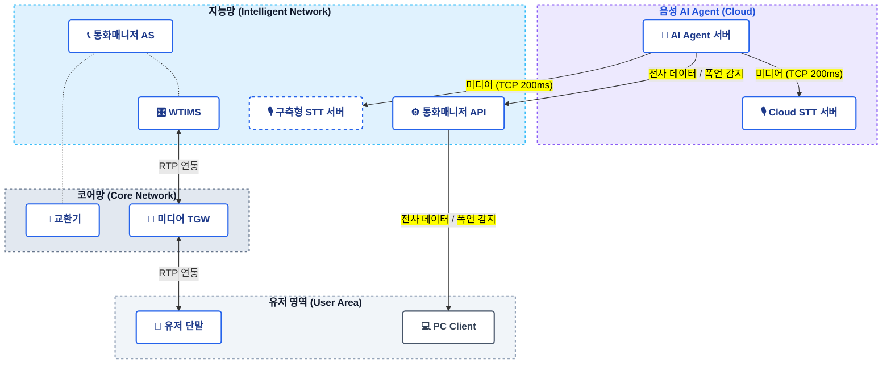

# 욕설/폭언 감지 실시간 STT 서버 구성 방안 (Cloud 및 구축형 STT)
욕설/폭언 감지 서비스를 위해 음성 AI Agent(Cloud) 내에 실시간 STT 서버를 구성하고 추후 구축형 STT를 추가로 구축 예정.

```mermaid
graph TD
    %% 스타일 정의 (블루 & 화이트 컨설팅 펌 테마)
    classDef default fill:#ffffff,stroke:#cbd5e1,stroke-width:1px,color:#334155,font-family:sans-serif;
    classDef layerBox fill:#f8fafc,stroke:#94a3b8,stroke-width:2px,stroke-dasharray: 4 4,color:#0f172a,font-weight:bold;
    classDef cloudBox fill:#eff6ff,stroke:#60a5fa,stroke-width:2px,stroke-dasharray: 4 4,color:#1d4ed8,font-weight:bold;
    classDef userLayer fill:#f1f5f9,stroke:#94a3b8,stroke-width:2px,stroke-dasharray: 4 4,color:#0f172a,font-weight:bold;
    classDef coreLayer fill:#e2e8f0,stroke:#64748b,stroke-width:2px,stroke-dasharray: 4 4,color:#0f172a,font-weight:bold;
    classDef intellLayer fill:#e0f2fe,stroke:#38bdf8,stroke-width:2px,stroke-dasharray: 4 4,color:#0f172a,font-weight:bold;
    classDef cloudLayer fill:#ede9fe,stroke:#8b5cf6,stroke-width:2px,stroke-dasharray: 4 4,color:#1d4ed8,font-weight:bold;
    classDef nodeBox fill:#ffffff,stroke:#2563eb,stroke-width:2px,color:#1e3a8a,font-weight:bold,rx:4px,ry:4px;
    classDef dashedNodeBox fill:#ffffff,stroke:#2563eb,stroke-width:2px,stroke-dasharray: 5 5,color:#1e3a8a,font-weight:bold,rx:4px,ry:4px;
    classDef clientBox fill:#ffffff,stroke:#475569,stroke-width:2px,color:#334155,font-weight:bold,rx:4px,ry:4px;

    %% 계층별 Subgraph (위에서 아래로 선언하여 레이아웃 고정)
    subgraph Cloud_Agent ["음성 AI Agent (Cloud)"]
        direction LR
        AIAgent["🧠 AI Agent 서버"]:::nodeBox
        CloudSTT["🎙️ Cloud STT 서버"]:::nodeBox
    end

    subgraph Intelligent_Network ["지능망 (Intelligent Network)"]
        direction LR
        CallManagerAS["📞 통화매니저 AS"]:::nodeBox
        WTIMS["🎛️ WTIMS"]:::nodeBox
        CallManagerAPI["⚙️ 통화매니저 API"]:::nodeBox
        STTServer["🎙️ 구축형 STT 서버"]:::dashedNodeBox
    end

    subgraph Core_Network ["코어망 (Core Network)"]
        direction LR
        Switch["🔀 교환기"]:::nodeBox
        MediaTGW["📡 미디어 TGW"]:::nodeBox
    end

    subgraph User_Area ["유저 영역 (User Area)"]
        direction LR
        UserTerminal["📱 유저 단말"]:::nodeBox
        PCClient["💻 PC Client"]:::clientBox
    end

    %% 핵심 연동선 및 RTP 연동
    AIAgent -->|"<mark>전사 데이터</mark> / <mark>폭언 감지</mark>"| CallManagerAPI
    AIAgent -->|"<mark>미디어 (TCP 200ms)</mark>"| CloudSTT
    AIAgent -->|"<mark>미디어 (TCP 200ms)</mark>"| STTServer
    CallManagerAPI -->|"<mark>전사 데이터</mark> / <mark>폭언 감지</mark>"| PCClient
    
    %% 제어 연동 (통화매니저AS)
    CallManagerAS -.- WTIMS
    CallManagerAS -.- Switch
    
    %% 미디어/RTP 연동
    WTIMS <-->|RTP 연동| MediaTGW
    MediaTGW <-->|RTP 연동| UserTerminal

    %% 서브그래프 스타일 적용
    class User_Area userLayer;
    class Core_Network coreLayer;
    class Intelligent_Network intellLayer;
    class Cloud_Agent cloudLayer;
```
