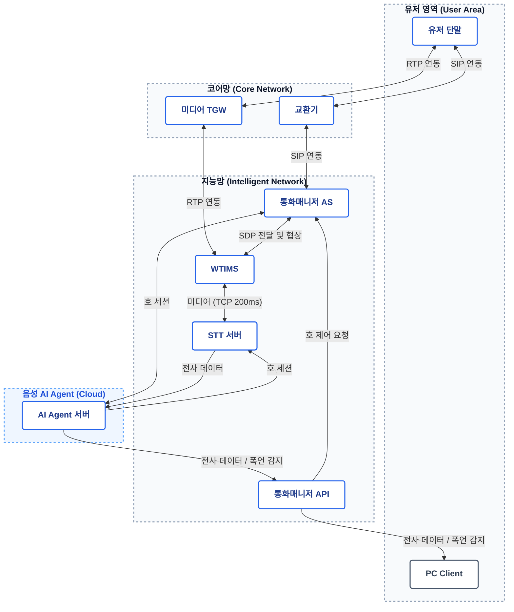

# 방안 2. 지능망 내 STT 구성 및 Cloud AI 서버 연동
지능망 내에 STT 서버를 두고 음성 AI Agent(Cloud)에는 AI 서버만 위치시키는 구조입니다.

```mermaid
graph TD
    %% 스타일 정의 (블루 & 화이트 컨설팅 펌 테마)
    classDef default fill:#ffffff,stroke:#cbd5e1,stroke-width:1px,color:#334155,font-family:sans-serif;
    classDef layerBox fill:#f8fafc,stroke:#94a3b8,stroke-width:2px,stroke-dasharray: 4 4,color:#0f172a,font-weight:bold;
    classDef cloudBox fill:#eff6ff,stroke:#60a5fa,stroke-width:2px,stroke-dasharray: 4 4,color:#1d4ed8,font-weight:bold;
    classDef nodeBox fill:#ffffff,stroke:#2563eb,stroke-width:2px,color:#1e3a8a,font-weight:bold,rx:4px,ry:4px;
    classDef clientBox fill:#ffffff,stroke:#475569,stroke-width:2px,color:#334155,font-weight:bold,rx:4px,ry:4px;

    %% 계층별 Subgraph
    subgraph User_Area ["유저 영역 (User Area)"]
        direction LR
        UserTerminal["유저 단말"]:::nodeBox
        PCClient["PC Client"]:::clientBox
    end

    subgraph Core_Network ["코어망 (Core Network)"]
        direction LR
        Switch["교환기"]:::nodeBox
        MediaTGW["미디어 TGW"]:::nodeBox
    end

    subgraph Intelligent_Network ["지능망 (Intelligent Network)"]
        direction LR
        CallManagerAS["통화매니저 AS"]:::nodeBox
        WTIMS["WTIMS"]:::nodeBox
        CallManagerAPI["통화매니저 API"]:::nodeBox
        STTServer["STT 서버"]:::nodeBox
    end

    subgraph Cloud_Agent ["음성 AI Agent (Cloud)"]
        direction LR
        AIAgent["AI Agent 서버"]:::nodeBox
    end

    %% 연결선 및 프로토콜 흐름
    UserTerminal <-->|SIP 연동| Switch
    UserTerminal <-->|RTP 연동| MediaTGW
    
    Switch <-->|SIP 연동| CallManagerAS
    MediaTGW <-->|RTP 연동| WTIMS
    
    CallManagerAS <-->|SDP 전달 및 협상| WTIMS
    
    CallManagerAS <-->|호 세션| AIAgent
    AIAgent -->|호 세션| STTServer
    WTIMS <-->|"미디어 (TCP 200ms)"| STTServer
    
    STTServer -->|전사 데이터| AIAgent
    
    AIAgent -->|전사 데이터 / 폭언 감지| CallManagerAPI
    CallManagerAPI -->|호 제어 요청| CallManagerAS
    CallManagerAPI -->|전사 데이터 / 폭언 감지| PCClient

    %% 서브그래프 스타일 적용
    class User_Area layerBox;
    class Core_Network layerBox;
    class Intelligent_Network layerBox;
    class Cloud_Agent cloudBox;
```
