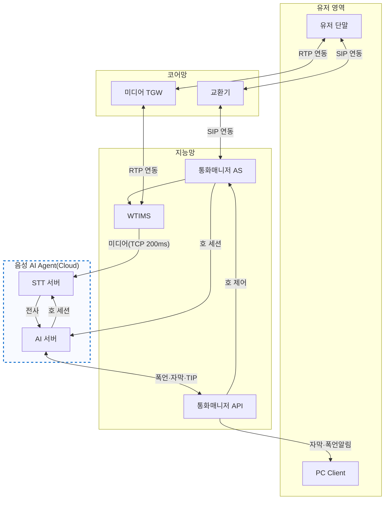
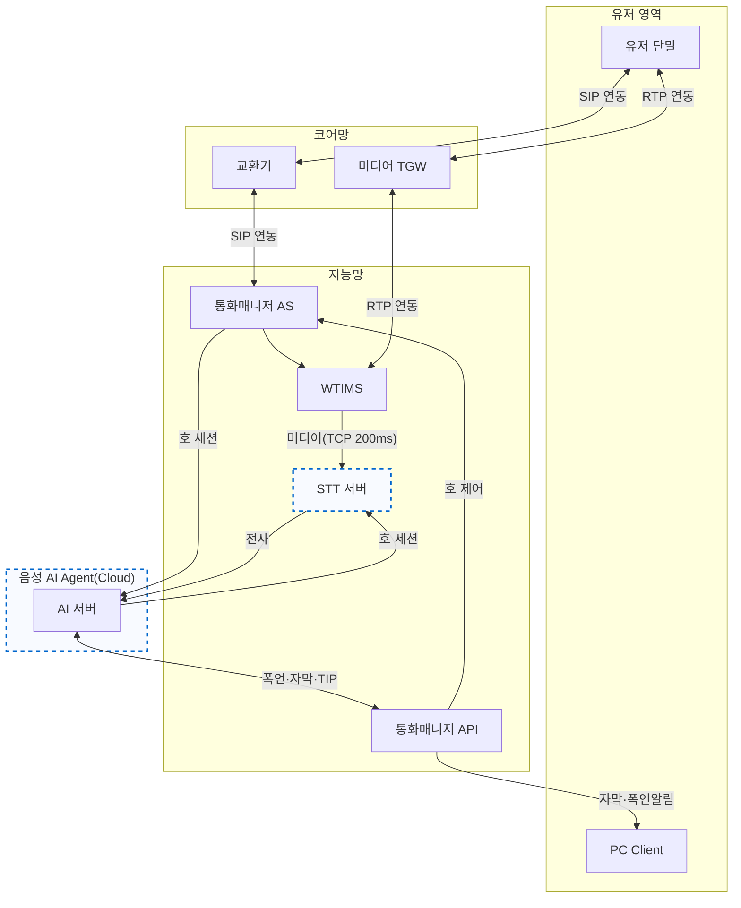

# STT와 Agent 연동 방안

## 방안 1. 음성 AI Agent(Cloud)에 STT/AI 서버 통합 구성
지능망 내 STT를 제거하고 음성 AI Agent(Cloud) 내에 STT 서버와 AI 서버를 모두 위치시키는 구조입니다.

## 방안 2. 지능망 내 STT 구성 및 Cloud AI 서버 연동
지능망 내에 STT 서버를 두고 음성 AI Agent(Cloud)에는 AI 서버만 위치시키는 구조입니다.

