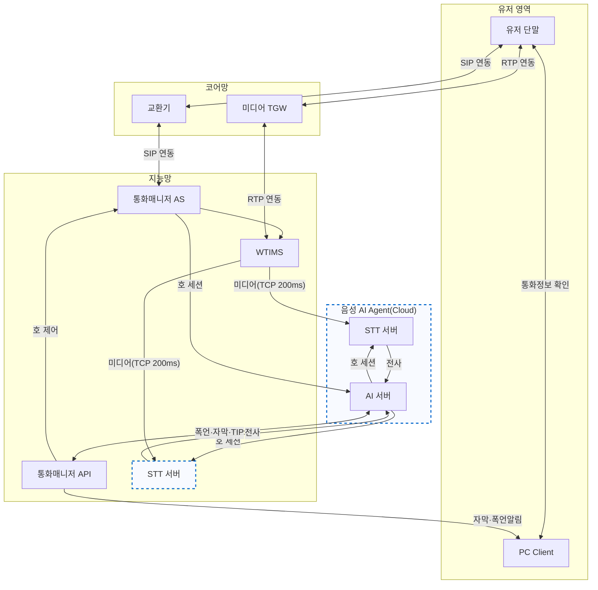

# STT와 Agent 연동 방안

```mermaid
flowchart TB
    subgraph USER_AREA["유저 영역"]
        USER[유저 단말]
        PC[PC Client]
    end

    subgraph CORE_NET["코어망"]
        EX[교환기]
        TGW[미디어 TGW]
    end

    subgraph CORE["지능망"]
        CM[통화매니저 AS]
        WT[WTIMS]
        CM_API[통화매니저 API]
        IN_STT[STT 서버]
    end
    %% 지능망 STT 서버는 향후 도입 예정이므로 점선으로 표시
    style IN_STT fill:#f8faff,stroke:#0066cc,stroke-width:2px,stroke-dasharray: 5 5

    subgraph NEW_STT["음성 AI Agent(Cloud)"]
        style NEW_STT fill:#f8faff,stroke:#0066cc,stroke-width:2px,stroke-dasharray: 5 5
        
        STT[STT 서버]
        RT[AI 서버]
    end

    EX <-->|SIP 연동| CM
    CM --> WT
    USER <-->|SIP 연동| EX
    USER <-->|RTP 연동| TGW
    TGW <-->|RTP 연동| WT
    USER <-->|통화정보 확인| PC

    %% 신규 연동 구간 (Cloud STT)
    CM -->|호 세션| RT
    RT -->|호 세션| STT
    WT -->|"미디어(TCP 200ms)"| STT
    STT -->|전사| RT

    %% 신규 연동 구간 (지능망 내 STT)
    RT -->|호 세션| IN_STT
    WT -->|"미디어(TCP 200ms)"| IN_STT
    IN_STT -->|전사| RT

    %% AI Agent 연동
    RT <-->|폭언·자막·TIP| CM_API
    CM_API -->|호 제어| CM
    CM_API -->|자막·폭언알림| PC
```
