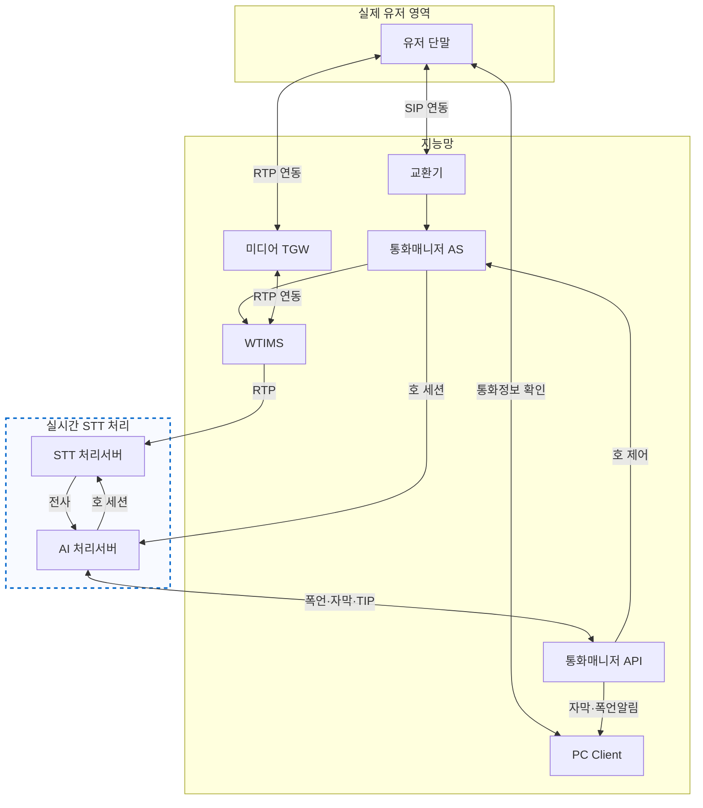

# STT와 Agent 연동 방안

## 지능망 시스템에 STT와 Agent를 두고 처리하는 방안

> 기존 다이어그램을 초안으로 복사했습니다. 향후 수정하여 완성할 예정입니다.

```mermaid
flowchart TB
    subgraph USER_AREA["실제 유저 영역"]
        USER[유저 단말]
    end

    subgraph CORE["지능망"]
        EX[교환기] --> CM[통화매니저 AS]
        CM --> WT[WTIMS]
        TGW[미디어 TGW]
        CM_API[통화매니저 API]
        PC[PC Client]
    end

    subgraph NEW_STT["실시간 STT 처리"]
        style NEW_STT fill:#f8faff,stroke:#0066cc,stroke-width:2px,stroke-dasharray: 5 5
        
        STT[STT 처리서버]
        RT[AI 처리서버]
    end

    USER <-->|SIP 연동| EX
    USER <-->|RTP 연동| TGW
    TGW <-->|RTP 연동| WT
    USER <-->|통화정보 확인| PC

    CM -->|호 세션| RT
    RT -->|호 세션| STT
    WT -->|RTP| STT
    STT -->|전사| RT
    RT <-->|폭언·자막·TIP| CM_API
    CM_API -->|호 제어| CM
    CM_API -->|자막·폭언알림| PC
```
