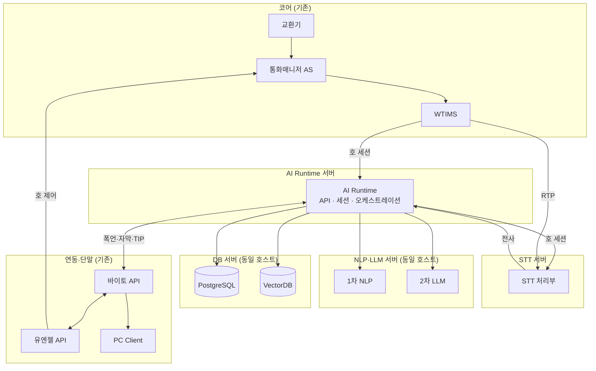
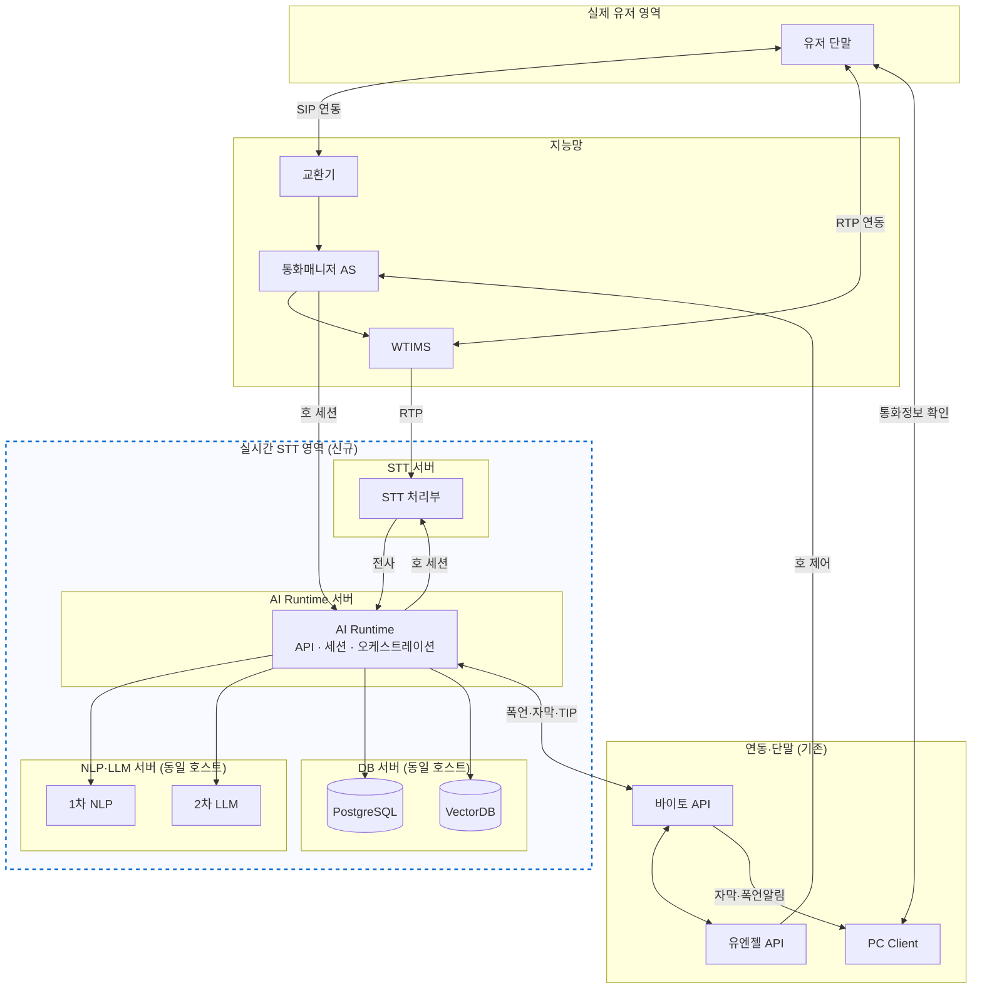

# STT와 Agent 연동 방안

## 1. 고객서비스플랫폼팀의 클라우드 STT와 Agent를 연동하는 방안

> 기존 다이어그램을 초안으로 복사했습니다. 향후 수정하여 완성할 예정입니다.

```mermaid
flowchart TB
    subgraph CORE["코어 (기존)"]
        EX[교환기] --> CM[통화매니저 AS]
        CM --> WT[WTIMS]
    end

    subgraph SRV_RT["AI Runtime 서버"]
        RT[AI Runtime<br/>API · 세션 · 오케스트레이션]
    end

    subgraph SRV_STT["STT 서버"]
        STT[STT 처리부]
    end

    subgraph SRV_ML["NLP·LLM 서버 (동일 호스트)"]
        NLP[1차 NLP]
        LLM[2차 LLM]
    end

    subgraph SRV_DB["DB 서버 (동일 호스트)"]
        DB[(PostgreSQL)]
        VDB[(VectorDB)]
    end

    subgraph EXT["연동·단말 (기존)"]
        B[바이토 API]
        U[유엔젤 API]
        PC[PC Client]
    end

    WT -->|호 세션| RT
    RT -->|호 세션| STT
    WT -->|RTP| STT
    STT -->|전사| RT
    RT --> NLP
    RT --> LLM
    RT --> DB
    RT --> VDB
    RT <-->|폭언·자막·TIP| B
    B <--> U
    U -->|호 제어| CM
    B --> PC
```

## 2. 지능망 시스템에 STT와 Agent를 두고 처리하는 방안

> 기존 다이어그램을 초안으로 복사했습니다. 향후 수정하여 완성할 예정입니다.

```mermaid
flowchart TB
    subgraph USER_AREA["실제 유저 영역"]
        USER[유저 단말]
    end

    subgraph CORE["지능망"]
        EX[교환기] --> CM[통화매니저 AS]
        CM --> WT[WTIMS]
    end

    subgraph NEW_STT["실시간 STT 영역 (신규)"]
        style NEW_STT fill:#f8faff,stroke:#0066cc,stroke-width:2px,stroke-dasharray: 5 5
        
        subgraph SRV_RT["AI Runtime 서버"]
            RT[AI Runtime<br/>API · 세션 · 오케스트레이션]
        end

        subgraph SRV_STT["STT 서버"]
            STT[STT 처리부]
        end

        subgraph SRV_ML["NLP·LLM 서버 (동일 호스트)"]
            NLP[1차 NLP]
            LLM[2차 LLM]
        end

        subgraph SRV_DB["DB 서버 (동일 호스트)"]
            DB[(PostgreSQL)]
            VDB[(VectorDB)]
        end
    end

    subgraph EXT["연동·단말 (기존)"]
        B[바이토 API]
        U[유엔젤 API]
        PC[PC Client]
    end

    USER <-->|SIP 연동| EX
    USER <-->|RTP 연동| WT
    USER <-->|통화정보 확인| PC

    CM -->|호 세션| RT
    RT -->|호 세션| STT
    WT -->|RTP| STT
    STT -->|전사| RT
    RT --> NLP
    RT --> LLM
    RT --> DB
    RT --> VDB
    RT <-->|폭언·자막·TIP| B
    B <--> U
    U -->|호 제어| CM
    B -->|자막·폭언알림| PC
```
