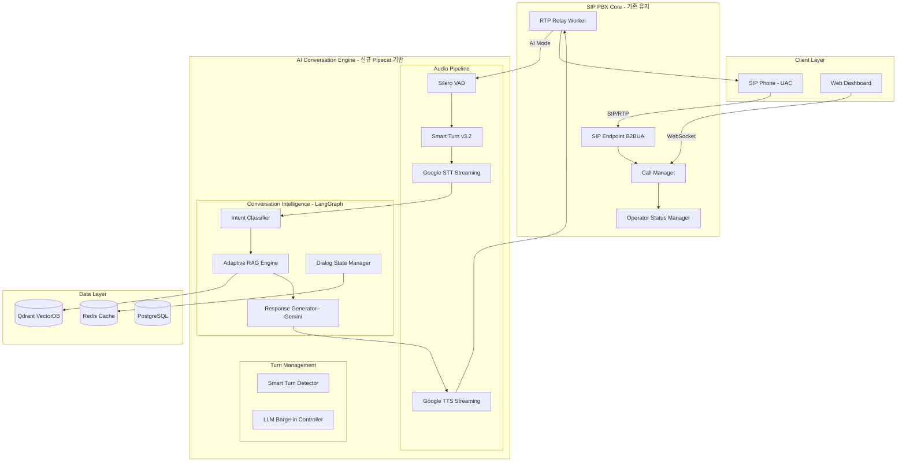
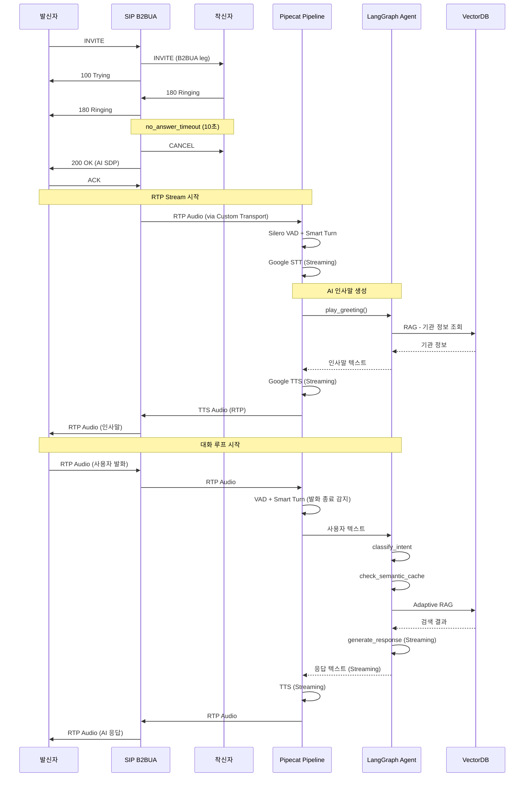
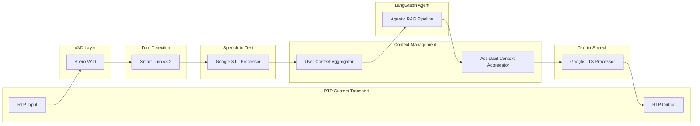
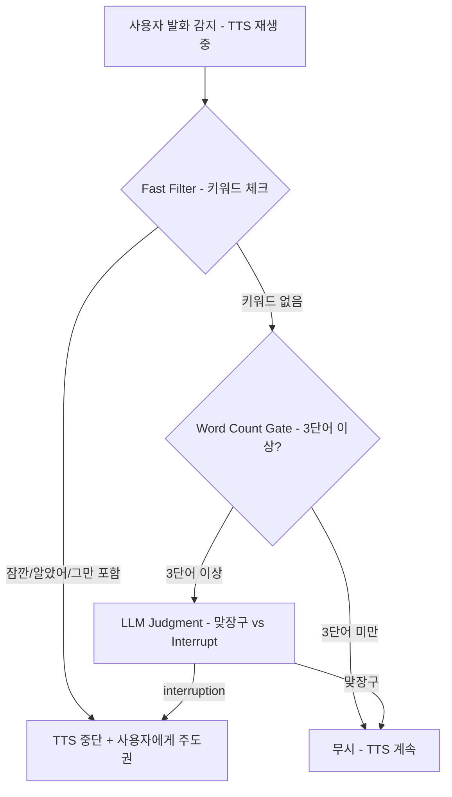
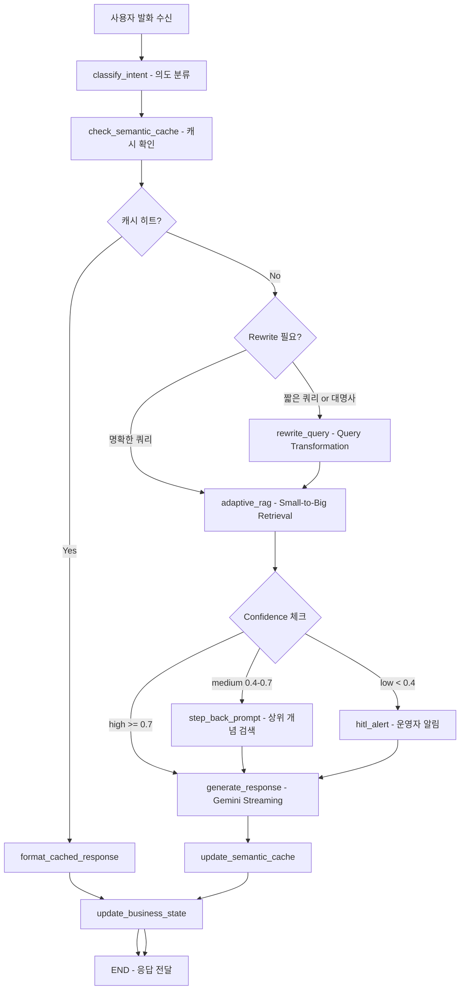

# SmartPBX AI v3.0 - Voice AI Conversation Engine 상세설계서

**문서 버전**: v1.0
**작성일**: 2026-02-12
**상태**: Design Complete

---

## 관련 문서

| 문서 | 설명 |
|------|------|
| [ai-voicebot-architecture.md](./ai-voicebot-architecture.md) | SIP PBX B2BUA + AI 전체 Backend 아키텍처 |
| [technical-architecture.md](./technical-architecture.md) | Technical Architecture (LangGraph, Qdrant, K8s) |
| [VOICE_AI_TURN_TAKING_REFERENCES.md](../VOICE_AI_TURN_TAKING_REFERENCES.md) | Voice AI Turn-Taking GitHub 참고 자료 |
| [AI_CALL_HANDLING_DESIGN.md](../AI_CALL_HANDLING_DESIGN.md) | AI 통화 응대 Phase 1 설계 |

---

## 목차

1. [Executive Summary](#1-executive-summary)
2. [System Architecture Overview](#2-system-architecture-overview)
3. [Pipecat Integration Architecture](#3-pipecat-integration-architecture)
4. [Smart Turn Detection](#4-smart-turn-detection)
5. [Turn-Taking / Barge-in Strategy](#5-turn-taking--barge-in-strategy)
6. [Agentic RAG with LangGraph](#6-agentic-rag-with-langgraph)
7. [Adaptive RAG Strategy](#7-adaptive-rag-strategy)
8. [Data Architecture](#8-data-architecture)
9. [Performance Targets](#9-performance-targets)
10. [Migration Strategy](#10-migration-strategy)
11. [Deployment / Security / Monitoring](#11-deployment--security--monitoring)

---

## 1. Executive Summary

### 1.1 배경

현재 시스템은 커스텀 Python asyncio 기반의 AI Orchestrator로 통화 응대를 처리하고 있다. WebRTC VAD + 2초 고정 침묵 감지, TTS 중 모든 발화 무시, 단순 RAG(query -> vector search -> LLM) 방식으로 동작한다. 이 접근은 MVP로는 충분하지만 자연스러운 대화 경험을 위해서는 근본적인 아키텍처 변경이 필요하다.

### 1.2 핵심 기술 선택

| # | 영역 | 선택 | 근거 |
|---|------|------|------|
| 1 | 발화 종료 감지 | **Smart Turn v3.2** (Pipecat) | 한국어 포함 23개 언어, CPU 10ms, Audio-native prosody 인식 |
| 2 | 대화 주도권 | **키워드 + 단어수 + LLM 판단** | 특정 키워드 즉시 interrupt, 3단어 이상이면 LLM이 맞장구/interrupt 판단 |
| 3 | 프레임워크 | **Pipecat 전체 통합** | Production-ready, Smart Turn 내장, 3500+ stars, BSD 라이선스 |
| 4 | 맥락 관리 | **Agentic RAG (LangGraph)** | 비즈니스 상태 트래킹, 조건부 분기, 자율 판단 |
| 5 | RAG 전략 | **Adaptive RAG** | Query Rewriting + Small-to-Big + Contextual Compression + Semantic Caching |

### 1.3 기존 시스템 대비 개선

| 항목 | AS-IS | TO-BE |
|------|-------|-------|
| 발화 종료 감지 | 2초 고정 침묵 | 200ms VAD + 10-100ms Smart Turn (문법/억양/속도 분석) |
| 대화 주도권 | TTS 중 모든 발화 무시 | 키워드 즉시 interrupt + LLM 맞장구 판단 |
| 응답 생성 | 단순 RAG -> LLM | Semantic Cache -> Adaptive RAG -> LangGraph Agent |
| 첫 응답 시작 | 약 2초 | 약 0.5초 (Streaming RAG + TTS) |
| 맥락 관리 | 최근 5턴 리스트 | LangGraph 상태 그래프 (의도/슬롯/비즈니스 상태) |

---

## 2. System Architecture Overview

### 2.1 전체 계층 구조



### 2.2 AI 모드 통화 흐름



### 2.3 컴포넌트 매핑 (기존 -> 신규)

| 기존 컴포넌트 | 신규 컴포넌트 | 변경 유형 |
|-------------|-------------|----------|
| `orchestrator.py` (AIOrchestrator) | Pipecat Pipeline + LangGraph Agent | 전면 교체 |
| `factory.py` (create_ai_orchestrator) | Pipecat Pipeline Builder | 전면 교체 |
| `audio_buffer.py` (AudioBuffer) | Pipecat Custom RTP Transport | 대체 |
| `vad_detector.py` (VADDetector) | Pipecat Silero VAD | 대체 |
| `barge_in_controller.py` | Custom InterruptionStrategy | 교체 |
| `stt_client.py` (STTClient) | Pipecat STT Processor 어댑터 | 래핑 |
| `tts_client.py` (TTSClient) | Pipecat TTS Processor 어댑터 | 래핑 |
| `llm_client.py` (LLMClient) | Pipecat LLM Processor + LangGraph | 래핑 |
| `rag_engine.py` (RAGEngine) | LangGraph adaptive_rag 노드 | 통합 |
| `knowledge_extractor.py` | 유지 (통화 후 처리) | 유지 |
| `chromadb_client.py` | Qdrant 마이그레이션 (향후) | 유지 후 교체 |
| `organization_info.py` | 유지 (기관 정보 관리) | 유지 |

---

## 3. Pipecat Integration Architecture

### 3.1 Pipecat Pipeline 구조



### 3.2 Custom RTP Transport

기존 `rtp_relay.py`의 AI 모드에서 Pipecat 파이프라인과 연결하는 어댑터를 구현한다.

```python
# src/ai_voicebot/pipecat/rtp_transport.py

class SIPPBXTransport(BaseTransport):
    """SIP PBX RTP Relay Worker와 Pipecat Pipeline을 연결하는 Transport"""

    def __init__(self, rtp_worker: RTPRelayWorker, params: TransportParams):
        super().__init__(params)
        self.rtp_worker = rtp_worker

    async def read_raw_audio_frames(self) -> AsyncGenerator[bytes, None]:
        """RTP Worker에서 수신한 caller 오디오를 Pipecat에 전달"""
        async for audio_data in self.rtp_worker.get_caller_audio_stream():
            yield audio_data

    async def write_raw_audio_frames(self, frames: bytes):
        """Pipecat에서 생성한 TTS 오디오를 RTP Worker를 통해 caller에게 전송"""
        await self.rtp_worker.send_audio_to_caller(frames)
```

### 3.3 Pipecat Pipeline Builder

```python
# src/ai_voicebot/pipecat/pipeline_builder.py

from pipecat.audio.vad.silero import SileroVADAnalyzer
from pipecat.audio.vad.vad_analyzer import VADParams
from pipecat.pipeline.pipeline import Pipeline
from pipecat.pipeline.task import PipelineTask, PipelineParams

class VoiceAIPipelineBuilder:
    """AI 통화 응대를 위한 Pipecat Pipeline 생성"""

    def __init__(self, config: dict):
        self.config = config

    def build(self, rtp_worker, call_context: dict) -> PipelineTask:
        # 1. Transport
        transport = SIPPBXTransport(rtp_worker, TransportParams())

        # 2. VAD
        vad = SileroVADAnalyzer(params=VADParams(
            confidence=0.7,
            start_secs=0.2,
            stop_secs=0.2,  # Smart Turn이 빠르게 분석하도록
            min_volume=0.6,
        ))

        # 3. Smart Turn
        turn_analyzer = LocalSmartTurnAnalyzerV3()

        # 4. STT/TTS/LLM Processors (기존 클라이언트 래핑)
        stt = GoogleSTTProcessor(self.config['google_cloud']['stt'])
        tts = GoogleTTSProcessor(self.config['google_cloud']['tts'])
        llm = LangGraphAgentProcessor(self.config, call_context)

        # 5. Context Aggregators
        context = ConversationContext(system_prompt=call_context['system_prompt'])
        user_agg, assistant_agg = LLMContextAggregatorPair(
            context,
            user_params=LLMUserAggregatorParams(
                vad_analyzer=vad,
                user_turn_strategies=UserTurnStrategies(
                    stop=[TurnAnalyzerUserTurnStopStrategy(
                        turn_analyzer=turn_analyzer
                    )]
                ),
            ),
        )

        # 6. Interruption Strategy
        interruption = SmartBargeInStrategy(
            min_words=3,
            keywords=["잠깐", "알았어", "그만", "멈춰", "잠시만"],
            llm_client=self.config.get('llm_client'),
        )

        # 7. Pipeline 조립
        pipeline = Pipeline([
            transport.input(),
            vad,
            stt,
            user_agg,
            llm,
            tts,
            transport.output(),
        ])

        return PipelineTask(
            pipeline,
            params=PipelineParams(
                allow_interruptions=True,
                interruption_strategies=[interruption],
            ),
        )
```

### 3.4 SIP Endpoint 연동

기존 `sip_endpoint.py`의 `_handle_no_answer_timeout`에서 AI Orchestrator 대신 Pipecat Pipeline을 생성하여 연결한다.

```python
# sip_endpoint.py (AI Takeover 부분)

async def _handle_no_answer_timeout(self, call_id: str):
    # ... 기존 CANCEL/200 OK 전송 로직 유지 ...

    # Pipecat Pipeline 생성 및 시작
    rtp_worker = self._rtp_workers.get(call_id)
    pipeline_builder = VoiceAIPipelineBuilder(self.ai_config)

    call_context = {
        'call_id': call_id,
        'caller': caller_username,
        'callee': callee_username,
        'system_prompt': org_manager.get_system_prompt(),
    }

    pipeline_task = pipeline_builder.build(rtp_worker, call_context)
    asyncio.create_task(pipeline_task.run())
```

---

## 4. Smart Turn Detection

### 4.1 설계 원칙

```
사용자 음성 입력
     |
Silero VAD (음성/묵음 감지, stop_secs=0.2)
     |
     ├── 음성 계속 → 대기
     |
     └── 0.2초 침묵 감지 → Smart Turn v3.2 실행
                              |
                              ├── "발화 완료" → STT 최종 결과 전달
                              |
                              └── "계속 말하는 중" → 대기 (추가 음성 대기)
```

### 4.2 Smart Turn v3.2 사양

| 항목 | 사양 |
|------|------|
| 지원 언어 | 23개 (한국어 포함) |
| 모델 아키텍처 | Whisper Tiny backbone + Linear Classifier (약 8M params) |
| CPU 버전 | 8MB (int8 quantized), 추론 10ms |
| GPU 버전 | 32MB (fp32), 추론 <100ms |
| 입력 | 16kHz mono PCM, 최대 8초 |
| 출력 | Binary (turn complete / turn incomplete) |
| 라이선스 | BSD 2-clause |

### 4.3 VAD 설정

```python
vad_params = VADParams(
    confidence=0.7,      # 음성 감지 최소 신뢰도
    start_secs=0.2,      # 음성 시작 확인까지 대기 시간
    stop_secs=0.2,       # Smart Turn 사용 시 낮은 값 (빠른 전환)
    min_volume=0.6,      # 최소 음량 임계치
)
```

### 4.4 Fallback 전략

Smart Turn이 "계속 말하는 중"으로 판단했으나 이후 3초 이상 추가 음성이 없으면 강제로 발화 완료 처리한다. 이는 네트워크 지연, 오디오 손실 등 예외 상황에 대한 안전장치이다.

---

## 5. Turn-Taking / Barge-in Strategy

### 5.1 3단계 필터 구조



### 5.2 Fast Filter (즉시, <1ms)

특정 키워드가 포함되면 LLM 판단 없이 즉시 interrupt 처리한다.

```python
INTERRUPT_KEYWORDS = [
    "잠깐", "잠깐만", "잠시만", "알았어", "알겠어",
    "그만", "멈춰", "됐어", "그만해", "중지",
]
```

### 5.3 LLM Judgment (200-500ms)

3단어 이상의 발화가 감지되면 LLM에 판단을 요청한다.

```python
BARGE_IN_PROMPT = """
AI가 고객에게 설명을 하고 있는 중에 고객이 아래와 같이 말했습니다.

AI가 말하고 있는 내용: "{ai_current_text}"
고객이 말한 내용: "{user_text}"

고객의 말이 다음 중 어디에 해당하는지 판단하세요:
1. "맞장구" - 듣고 있다는 표시 (예: "네", "음", "그렇군요", "아~")
2. "interruption" - 말을 끊고 새로운 요청/질문을 하려는 의도

답변: "맞장구" 또는 "interruption" 중 하나만 출력하세요.
"""
```

### 5.4 Custom InterruptionStrategy 구현

```python
# src/ai_voicebot/pipecat/barge_in_strategy.py

class SmartBargeInStrategy(BaseInterruptionStrategy):
    """키워드 + 단어 수 + LLM 기반 Barge-in 판단"""

    def __init__(self, min_words: int = 3, keywords: list = None, llm_client=None):
        self.min_words = min_words
        self.keywords = keywords or INTERRUPT_KEYWORDS
        self.llm_client = llm_client
        self.accumulated_text = ""

    async def append_text(self, text: str):
        self.accumulated_text += " " + text

    async def should_interrupt(self) -> bool:
        text = self.accumulated_text.strip()
        if not text:
            return False

        # Stage 1: 키워드 즉시 체크
        for keyword in self.keywords:
            if keyword in text:
                return True

        # Stage 2: 단어 수 체크
        word_count = len(text.split())
        if word_count < self.min_words:
            return False

        # Stage 3: LLM 판단
        if self.llm_client:
            result = await self.llm_client.judge_barge_in(text)
            return result == "interruption"

        return True  # LLM 없으면 단어 수만으로 판단

    async def reset(self):
        self.accumulated_text = ""
```

---

## 6. Agentic RAG with LangGraph

### 6.1 LangGraph State 정의

```python
# src/ai_voicebot/langgraph/state.py

from typing import TypedDict, Optional
from langgraph.graph import StateGraph, END

class ConversationState(TypedDict):
    # 대화 컨텍스트
    messages: list              # 전체 대화 기록 [{role, content, timestamp}]
    user_query: str             # 현재 사용자 발화
    turn_count: int             # 대화 턴 수

    # 의도 및 슬롯
    intent: str                 # 분류된 의도 (greeting, question, complaint, transfer, farewell)
    slots: dict                 # 추출된 슬롯 (예: {product: "A", date: "내일"})

    # RAG 결과
    rewritten_query: str        # Query Rewriting 결과
    rag_results: list           # RAG 검색 결과 문서들
    rag_cache_hit: bool         # Semantic Cache 히트 여부
    confidence: float           # 응답 신뢰도 (0.0 ~ 1.0)

    # 응답
    response: str               # 생성된 응답 텍스트
    response_chunks: list       # Streaming 응답 청크

    # 비즈니스 상태
    business_state: str         # 현재 비즈니스 상태 (initial, inquiry, resolution, closing)
    org_context: str            # 기관 정보 컨텍스트

    # HITL
    needs_human: bool           # 운영자 개입 필요 여부
    hitl_reason: str            # HITL 사유
```

### 6.2 LangGraph Workflow



### 6.3 LangGraph 노드 구현

```python
# src/ai_voicebot/langgraph/agent.py

from langgraph.graph import StateGraph, END

def build_conversation_agent(config: dict) -> StateGraph:
    workflow = StateGraph(ConversationState)

    # 노드 등록
    workflow.add_node("classify_intent", classify_intent_node)
    workflow.add_node("check_semantic_cache", check_cache_node)
    workflow.add_node("format_cached_response", format_cached_node)
    workflow.add_node("rewrite_query", rewrite_query_node)
    workflow.add_node("adaptive_rag", adaptive_rag_node)
    workflow.add_node("step_back_prompt", step_back_node)
    workflow.add_node("hitl_alert", hitl_alert_node)
    workflow.add_node("generate_response", generate_response_node)
    workflow.add_node("update_cache", update_cache_node)
    workflow.add_node("update_state", update_state_node)

    # 엣지 정의
    workflow.set_entry_point("classify_intent")
    workflow.add_edge("classify_intent", "check_semantic_cache")

    workflow.add_conditional_edges(
        "check_semantic_cache",
        lambda s: "cache_hit" if s["rag_cache_hit"] else "cache_miss",
        {
            "cache_hit": "format_cached_response",
            "cache_miss": "rewrite_query",
        }
    )

    workflow.add_edge("format_cached_response", "update_state")

    workflow.add_conditional_edges(
        "rewrite_query",
        lambda s: "needs_rewrite" if s.get("rewritten_query") else "skip",
        {
            "needs_rewrite": "adaptive_rag",
            "skip": "adaptive_rag",
        }
    )

    workflow.add_conditional_edges(
        "adaptive_rag",
        route_by_confidence,
        {
            "high": "generate_response",
            "medium": "step_back_prompt",
            "low": "hitl_alert",
        }
    )

    workflow.add_edge("step_back_prompt", "generate_response")
    workflow.add_edge("hitl_alert", "generate_response")
    workflow.add_edge("generate_response", "update_cache")
    workflow.add_edge("update_cache", "update_state")
    workflow.add_edge("update_state", END)

    return workflow.compile()


def route_by_confidence(state: ConversationState) -> str:
    confidence = state.get("confidence", 0.0)
    if confidence >= 0.7:
        return "high"
    elif confidence >= 0.4:
        return "medium"
    else:
        return "low"
```

### 6.4 비즈니스 상태 트래킹

LangGraph의 `update_state` 노드에서 대화 흐름에 따라 비즈니스 상태를 자동 추적한다.

```
initial  ->  inquiry  ->  resolution  ->  closing
   |            |              |
   +------>  complaint  ->  escalation (HITL)
   |
   +------>  transfer (담당자 연결 요청)
```

각 상태에 따라 LLM 프롬프트의 system instruction이 동적으로 변경된다:
- `initial`: 인사말 + 도움 제안
- `inquiry`: 정보 제공 모드
- `complaint`: 공감 + 해결 방안 제시
- `resolution`: 확인 + 추가 질문
- `closing`: 마무리 인사

---

## 7. Adaptive RAG Strategy

### 7.1 Query Transformation: Rewrite-Retrieve-Read

모든 쿼리에 Multi-query를 적용하지 않고, 다음 조건에 해당할 때만 Query Rewriting을 수행한다:
- 5단어 미만의 짧은 쿼리
- 대명사("이거", "그거", "저거", "뭐") 비율 > 30%
- 이전 턴 참조가 명확한 경우 ("아까 그거")

```python
# src/ai_voicebot/langgraph/nodes/rewrite_query.py

REWRITE_PROMPT = """
다음 고객의 구어체 발화를 검색에 적합한 문장으로 변환하세요.

대화 기록:
{conversation_history}

현재 발화: "{user_query}"

변환 규칙:
1. 대명사를 구체적인 명사로 대체
2. 구어체를 문어체로 변환
3. 핵심 의도를 명확하게 표현

변환된 검색 쿼리:
"""

async def rewrite_query_node(state: ConversationState) -> ConversationState:
    query = state["user_query"]
    words = query.split()

    # Rewrite 필요 여부 판단
    needs_rewrite = (
        len(words) < 5 or
        any(p in query for p in ["이거", "그거", "저거", "뭐", "아까"])
    )

    if needs_rewrite:
        history = format_recent_history(state["messages"], max_turns=3)
        rewritten = await llm.generate(
            REWRITE_PROMPT.format(
                conversation_history=history,
                user_query=query,
            ),
            max_tokens=100,
        )
        state["rewritten_query"] = rewritten.strip()
    else:
        state["rewritten_query"] = query

    return state
```

### 7.2 Small-to-Big Retrieval (Parent Document Retrieval)

검색 속도는 작은 단위(Sentence)로 유지하면서, LLM에 전달할 때는 더 큰 맥락(Paragraph)을 포함한다.

```
Vector DB 저장 구조:

Collection: knowledge_base
  Document 1 (Paragraph, parent):
    id: "doc_001"
    chunk_type: "paragraph"
    content: "기상청은 날씨 예보를 ... (500자)"

  Document 1-1 (Sentence, child):
    id: "doc_001_s1"
    chunk_type: "sentence"
    parent_id: "doc_001"
    content: "기상청은 날씨 예보를 제공합니다."

  Document 1-2 (Sentence, child):
    id: "doc_001_s2"
    chunk_type: "sentence"
    parent_id: "doc_001"
    content: "전화번호는 131입니다."
```

검색 흐름:
1. Sentence 레벨로 벡터 검색 (빠름, 정확)
2. 히트된 Sentence의 `parent_id`로 Paragraph 조회
3. Paragraph 전체를 LLM 컨텍스트로 전달

### 7.3 Contextual Compression

Cross-Encoder 리랭커 대신 경량 추출 방식을 사용한다.

```python
async def compress_context(query: str, documents: list) -> str:
    """검색된 문서에서 질문 관련 부분만 추출"""
    compressed = []
    query_keywords = extract_keywords(query)

    for doc in documents:
        sentences = doc.content.split(". ")
        relevant = [
            s for s in sentences
            if any(kw in s for kw in query_keywords)
            or semantic_similarity(query, s) > 0.6
        ]
        if relevant:
            compressed.append(". ".join(relevant))

    return "\n\n".join(compressed)
```

### 7.4 Semantic Caching

반복 질문에 대해 RAG 프로세스를 생략하고 캐시에서 즉시 응답한다.

```python
# src/ai_voicebot/langgraph/nodes/semantic_cache.py

CACHE_COLLECTION = "qa_cache"
SIMILARITY_THRESHOLD = 0.95

async def check_cache_node(state: ConversationState) -> ConversationState:
    query = state.get("rewritten_query") or state["user_query"]

    # 벡터 DB에서 유사 질문 검색
    results = await vector_db.search(
        collection=CACHE_COLLECTION,
        query=query,
        top_k=1,
        score_threshold=SIMILARITY_THRESHOLD,
    )

    if results and results[0].score >= SIMILARITY_THRESHOLD:
        cached = results[0]
        # TTL 체크
        if not is_expired(cached.metadata.get("cached_at"), cached.metadata.get("ttl")):
            state["rag_cache_hit"] = True
            state["response"] = cached.metadata["answer"]
            state["confidence"] = cached.metadata.get("confidence", 0.9)
            return state

    state["rag_cache_hit"] = False
    return state


async def update_cache_node(state: ConversationState) -> ConversationState:
    if state.get("rag_cache_hit"):
        return state  # 이미 캐시 히트면 업데이트 불필요

    # 새 응답 캐싱
    query = state.get("rewritten_query") or state["user_query"]
    is_faq = state.get("intent") in ("question", "greeting")
    ttl = 86400 if is_faq else 3600  # FAQ: 24h, 동적: 1h

    await vector_db.upsert(
        collection=CACHE_COLLECTION,
        document={
            "content": query,
            "metadata": {
                "answer": state["response"],
                "confidence": state["confidence"],
                "intent": state["intent"],
                "cached_at": datetime.now().isoformat(),
                "ttl": ttl,
            },
        },
    )
    return state
```

### 7.5 Step-back Prompting

RAG 결과 confidence가 낮을 때 (0.4 미만), 구체적 질문 대신 상위 개념으로 검색을 재시도한다.

```python
STEP_BACK_PROMPT = """
다음 질문에 대해 직접적인 답변을 찾을 수 없었습니다.
질문: "{original_query}"

이 질문의 배경이 되는 상위 개념이나 원칙에 대한 검색 쿼리를 생성하세요.
예시:
- "상품 A의 가격은?" -> "상품 A의 기본 정보와 가격 정책은?"
- "내일 비 올 확률?" -> "일기예보 조회 방법과 기상 정보 안내는?"

상위 개념 쿼리:
"""

async def step_back_node(state: ConversationState) -> ConversationState:
    step_back_query = await llm.generate(
        STEP_BACK_PROMPT.format(original_query=state["user_query"]),
        max_tokens=100,
    )

    # 상위 개념으로 재검색
    results = await rag_engine.search(step_back_query.strip(), top_k=3)

    state["rag_results"].extend(results)
    # Confidence 재계산
    if results:
        state["confidence"] = max(state["confidence"], 0.5)

    return state
```

### 7.6 Streaming RAG

LLM이 응답을 생성하는 동안 첫 번째 문장이 완성되는 즉시 TTS로 전송한다.

```python
async def generate_response_node(state: ConversationState) -> ConversationState:
    prompt = build_full_prompt(state)
    response_chunks = []
    current_sentence = ""

    async for chunk in llm.stream(prompt):
        current_sentence += chunk

        # 문장 단위 감지 (마침표, 물음표, 느낌표)
        if any(current_sentence.rstrip().endswith(p) for p in [".", "?", "!", "요.", "다."]):
            response_chunks.append(current_sentence.strip())
            current_sentence = ""

    # 남은 텍스트
    if current_sentence.strip():
        response_chunks.append(current_sentence.strip())

    state["response"] = " ".join(response_chunks)
    state["response_chunks"] = response_chunks
    return state
```

Pipecat의 LLM Processor에서 이 streaming 출력을 바로 TTS Processor로 전달하면, 전체 응답 완성 전에 첫 문장부터 발화를 시작할 수 있다.

---

## 8. Data Architecture

### 8.1 기존 스키마 유지

technical-architecture.md에 정의된 PostgreSQL, Qdrant, Redis 스키마를 기본으로 유지한다.

### 8.2 Qdrant 신규 컬렉션: qa_cache

```yaml
Collection: qa_cache
  Vectors:
    size: 768  # sentence-transformers 차원
    distance: Cosine
  Payload:
    answer: string
    confidence: float
    intent: string
    cached_at: datetime
    ttl: integer  # seconds
    hit_count: integer
```

### 8.3 knowledge_base 스키마 변경

기존 `knowledge_base` 컬렉션에 Small-to-Big Retrieval을 위한 필드를 추가한다.

```yaml
Collection: knowledge_base (변경)
  기존 필드 유지 +
  추가 필드:
    chunk_type: keyword  # "sentence" | "paragraph"
    parent_id: keyword   # sentence인 경우 parent paragraph의 ID
    sentence_index: integer  # paragraph 내 순서
```

### 8.4 Redis 추가 키

```
# LangGraph 대화 상태
dialog_state:{call_id}  ->  JSON (ConversationState)
TTL: 3600s (1시간)

# Semantic Cache 통계
cache_stats:{date}  ->  Hash {hits, misses, hit_rate}
```

---

## 9. Performance Targets

### 9.1 Latency 목표

| 단계 | 기존 목표 | 신규 목표 | 달성 방법 |
|------|----------|----------|----------|
| 발화 종료 감지 | 2초 (고정) | 200ms VAD + 10-100ms Smart Turn | Smart Turn v3.2 |
| 의도 분류 | 해당 없음 | < 100ms | Gemini Flash (캐시 활용) |
| Semantic Cache 조회 | 해당 없음 | < 10ms | 벡터 유사도 검색 |
| RAG 검색 | 100ms | 50ms (Sentence 레벨) | Small-to-Big |
| Query Rewriting | 해당 없음 | 200ms (필요 시만) | Gemini Flash |
| LLM 응답 생성 | 1초 | 첫 문장 0.3초 (Streaming) | Streaming RAG |
| TTS 합성 시작 | 300ms | 첫 음절 200ms (Streaming) | Streaming TTS |
| 전체 응답 (E2E) | 2초 | 0.5초 (캐시 히트) / 1.5초 (캐시 미스) | 전체 최적화 |

### 9.2 처리량 목표

| 항목 | 목표 |
|------|------|
| 동시 AI 통화 | 50 (인스턴스당) |
| Smart Turn 모델 로딩 | < 3초 (서버 시작 시 1회) |
| LangGraph 워크플로우 실행 | < 1초/턴 |
| Semantic Cache 히트율 | > 40% (FAQ 중심 시나리오) |

---

## 10. Migration Strategy

### Phase 1 (2주): Pipecat 기본 통합 + Smart Turn

**목표**: 기존 AI 응대를 Pipecat 파이프라인으로 전환하고 Smart Turn 적용

**작업 항목**:
1. `pipecat-ai` 패키지 설치 및 의존성 정리
2. `SIPPBXTransport` 구현 (RTP Relay Worker 연결)
3. `VoiceAIPipelineBuilder` 구현
4. 기존 STT/TTS 클라이언트를 Pipecat Processor로 래핑
5. Smart Turn v3.2 모델 통합 (기존 2초 고정 침묵 교체)
6. `sip_endpoint.py`에서 Pipecat Pipeline 연동

**검증**: 10초 no_answer 후 AI 인사말 → 사용자 발화 → AI 응답 사이클 동작 확인

### Phase 2 (2주): LangGraph Agentic RAG

**목표**: 단순 RAG를 LangGraph 기반 Agentic RAG로 교체

**작업 항목**:
1. `langgraph` 패키지 설치
2. `ConversationState` 및 `StateGraph` 구현
3. 각 노드 구현 (classify_intent, adaptive_rag, generate_response 등)
4. Semantic Caching 구현 (qa_cache 컬렉션)
5. Small-to-Big Retrieval을 위한 knowledge_base 스키마 변경
6. Query Rewriting 노드 구현
7. 기존 `rag_engine.py`를 LangGraph 노드로 통합

**검증**: 반복 질문 시 캐시 히트 확인, Query Rewriting 동작 확인

### Phase 3 (2주): 고급 기능

**목표**: 자연스러운 대화 경험을 위한 고급 기능 추가

**작업 항목**:
1. LLM 기반 Barge-in 판단 (`SmartBargeInStrategy`)
2. Step-back Prompting 노드 구현
3. Streaming RAG + TTS 연동 (첫 문장 즉시 발화)
4. Contextual Compression 구현
5. 비즈니스 상태 트래킹 (`update_state` 노드)
6. HITL 통합 (LangGraph hitl_alert 노드)

**검증**: Barge-in 정확도 테스트, Step-back 동작 확인, Streaming 레이턴시 측정

---

## 11. Deployment / Security / Monitoring

### 11.1 배포

기존 technical-architecture.md의 Kubernetes 배포 아키텍처를 유지한다.

추가 리소스 요구사항:
- Smart Turn v3.2 모델: 8MB (CPU) 또는 32MB (GPU) 추가 메모리
- LangGraph: 추가 CPU 오버헤드 미미 (Python asyncio 기반)
- Semantic Cache: Qdrant qa_cache 컬렉션 (예상 크기: ~100MB/10만 캐시)

### 11.2 보안

기존 JWT/RBAC/PII Masking 정책 유지. 추가 사항:
- LangGraph 상태에 PII가 포함될 수 있으므로 Redis TTL 준수 필수
- Semantic Cache에 민감 정보 캐싱 금지 (PII 필터 적용)

### 11.3 모니터링 메트릭 추가

```python
# Prometheus 메트릭 추가

# Smart Turn
smart_turn_inference_seconds = Histogram(
    'smartpbx_smart_turn_inference_seconds',
    'Smart Turn inference time',
    buckets=[0.005, 0.01, 0.02, 0.05, 0.1, 0.2]
)

smart_turn_decisions = Counter(
    'smartpbx_smart_turn_decisions_total',
    'Smart Turn decisions',
    ['decision']  # complete, incomplete
)

# Semantic Cache
cache_hit_rate = Gauge(
    'smartpbx_semantic_cache_hit_rate',
    'Semantic cache hit rate (percentage)'
)

cache_operations = Counter(
    'smartpbx_semantic_cache_operations_total',
    'Semantic cache operations',
    ['operation']  # hit, miss, update
)

# LangGraph
langgraph_node_seconds = Histogram(
    'smartpbx_langgraph_node_seconds',
    'LangGraph node execution time',
    ['node_name'],
    buckets=[0.01, 0.05, 0.1, 0.2, 0.5, 1.0, 2.0]
)

# Barge-in
barge_in_decisions = Counter(
    'smartpbx_barge_in_decisions_total',
    'Barge-in decisions',
    ['decision', 'stage']  # interrupt/ignore, keyword/wordcount/llm
)

# Streaming
first_token_latency_seconds = Histogram(
    'smartpbx_first_token_latency_seconds',
    'Time to first LLM token',
    buckets=[0.1, 0.2, 0.3, 0.5, 1.0]
)

first_speech_latency_seconds = Histogram(
    'smartpbx_first_speech_latency_seconds',
    'Time to first TTS speech output',
    buckets=[0.2, 0.3, 0.5, 0.8, 1.0, 1.5, 2.0]
)
```

---

## 부록 A: 신규 의존성

```
# requirements-ai.txt (추가)
pipecat-ai>=0.0.85
langgraph>=0.1.0
langchain-google-genai>=1.0.0
qdrant-client>=1.7.0
```

## 부록 B: 신규 파일 구조

```
src/ai_voicebot/
  pipecat/                      # Pipecat 통합 (신규)
    __init__.py
    rtp_transport.py            # Custom RTP Transport
    pipeline_builder.py         # Pipeline Builder
    processors/
      google_stt_processor.py   # STT 어댑터
      google_tts_processor.py   # TTS 어댑터
      langgraph_processor.py    # LangGraph Agent 어댑터
    barge_in_strategy.py        # Smart Barge-in Strategy

  langgraph/                    # LangGraph Agent (신규)
    __init__.py
    state.py                    # ConversationState 정의
    agent.py                    # StateGraph 구축
    nodes/
      __init__.py
      classify_intent.py        # 의도 분류
      semantic_cache.py         # Semantic Caching
      rewrite_query.py          # Query Transformation
      adaptive_rag.py           # Small-to-Big Retrieval
      step_back_prompt.py       # Step-back Prompting
      generate_response.py      # Streaming Response
      hitl_alert.py             # HITL 알림
      update_state.py           # 비즈니스 상태 업데이트

  ai_pipeline/                  # 기존 유지 (래핑)
    stt_client.py
    tts_client.py
    llm_client.py
    rag_engine.py

  knowledge/                    # 기존 유지
    chromadb_client.py
    embedder.py
    knowledge_extractor.py
    organization_info.py
```

## 부록 C: 기존 문서 관계

```
ai-voicebot-architecture.md (v2.0, 기존)
  - SIP PBX Core 설계
  - 기존 AI Pipeline 설계 (Phase 1)
  - HITL Workflow
  - Frontend Integration

technical-architecture.md (v1.0, 기존)
  - K8s 배포 아키텍처
  - PostgreSQL/Qdrant/Redis 스키마
  - API Specifications
  - Security/Monitoring

voice-ai-conversation-engine.md (v1.0, 본 문서)
  - Pipecat 통합 설계
  - Smart Turn + LLM Barge-in
  - LangGraph Agentic RAG
  - Adaptive RAG Strategy
  - Migration Strategy
```
