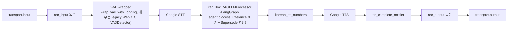
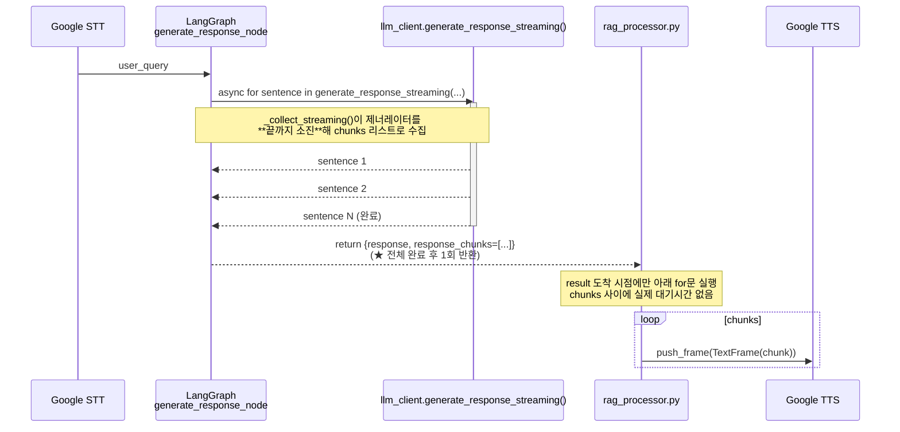
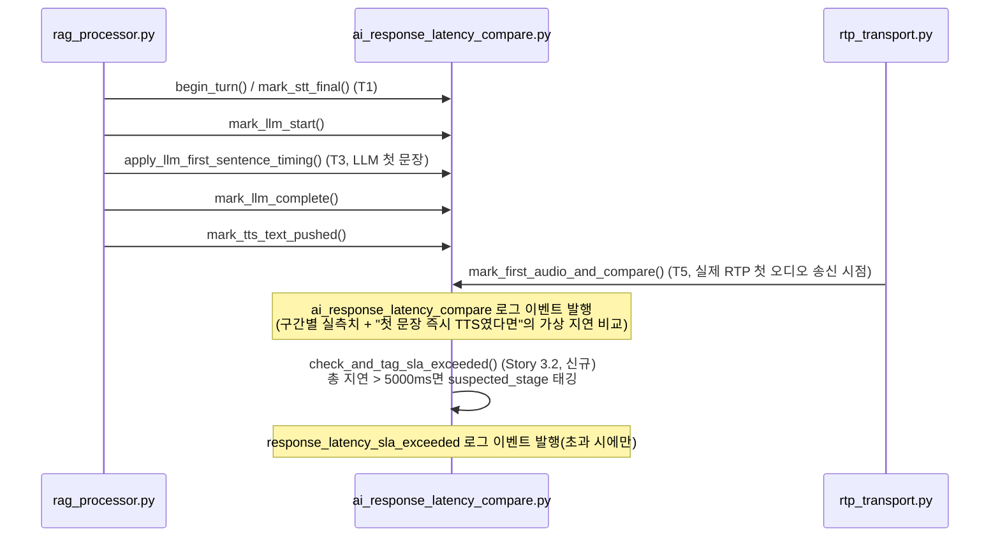
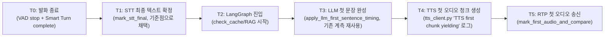

# 음성 AI 응답 지연 개선 및 스마트 턴테이킹 — Architecture

**작성일**: 2026-07-24
**버전**: 0.2 (2026-07-29 갱신 — Epic 7 신설: pipecat 기본값 Smart Turn v3.2 암묵 적용 발견 반영,
§1.4 정정, §2.4 신설)
**상태**: Epic 3~6 구현 완료(실통화 A/B 검증 일부 대기), Epic 7 착수(조사 단계)
**관련 문서**:
- [../product/voice-latency-turn-taking-prd.md](../product/voice-latency-turn-taking-prd.md) — 본 문서의 상위 PRD
- [voice-ai-conversation-engine.md](voice-ai-conversation-engine.md) — 기존 파이프라인 설계(이론치)
- [../design/TTS_RTP_STRUCTURE_REVIEW.md](../design/TTS_RTP_STRUCTURE_REVIEW.md)
- [coding-standards.md](coding-standards.md)

---

> ## 🔴 최우선 확인 필요 — 근본 원인 확정(2026-07-24)
>
> 신규 QA 하네스(`/api/ai-pipeline/test/converse`)로 chitchat 응답을 실측한 결과 6.8~9.6초 지연이
> 재현되었고, 노드별 breakdown상 그 시간이 **거의 전부 `generate_response` 노드(Gemini API 호출
> 자체)에 집중**되어 있었다. 원인을 추적한 결과 **`LLMClient._thinking_off()`가 Gemini 2.5 Flash의
> "thinking" 모드를 끄도록 설계되어 있으나, 설치된 SDK(`google-generativeai==0.8.6`, 이미 공식
> deprecated)에 `ThinkingConfig` 자체가 없어 이 비활성화가 단 한 번도 실제로 적용된 적이 없음을
> 확인했다**(`except (AttributeError, TypeError): pass`로 실패가 침묵됨). 즉 이 프로젝트의 응답
> 지연 문제 대부분은 아래 §1.2의 "TTFT 미도입" 문제보다 **더 근본적인 원인(thinking 상시 켜짐)**
> 일 가능성이 높다. 상세: [2026-07-24_root_cause_gemini_thinking_not_actually_disabled.md](../reports/2026-07/2026-07-24_root_cause_gemini_thinking_not_actually_disabled.md).
> Epic 4(TTFT) 착수 전 이 이슈의 해결 방침(SDK 마이그레이션 등)을 먼저 결정하는 것을 권장한다.

## 1. 현재 구조 (실측 기반, 2026-07-24 코드 조사)

### 1.1 파이프라인 조립 (`pipecat/pipeline_builder.py`, Story 5.1에서 실제 `Pipeline([...])` 리스트 기준으로 재확인)



> **정정(2026-07-24, Story 5.1)**: 최초 버전 다이어그램에 있던 `SmartTurnProcessor`, `user_agg`
> 컨텍스트 집계 노드는 **실제 `Pipeline([...])` 리스트(`pipeline_builder.py` L204~214)에 존재하지
> 않는다** — 실제 순서는 위 다이어그램과 같다(전체 10개 프로세서: transport.input → rec_input →
> vad_wrapped → stt → rag_llm → korean_tts_numbers → tts → tts_complete_notifier → rec_output →
> transport.output). 상세 근거는 §1.5 참고.

> `streaming_tts_processor.py`(TTFT 전용 게이트웨이로 보이는 프로세서)는 **이 조립 코드에 등장하지
> 않는다** — Epic 3/Story 3.4에서 실사용 여부를 확정해야 한다(추정 금지, 코드 검증 필요).

### 1.2 LLM → TTS 연결부의 실제 동작 (핵심 병목)



- **근거 코드**: `src/ai_voicebot/langgraph/nodes/generate_response.py`의 `_collect_streaming()` —
  `async for sentence in llm.generate_response_streaming(...)`를 전량 수집 후 `return {..., "response_chunks": chunks}`.
- **근거 코드**: `src/ai_voicebot/pipecat/processors/rag_processor.py` L1658 부근 — `result.get("response_chunks", [])`을
  꺼낸 뒤 L2097 부근에서 `if chunks and len(chunks) > 1: for chunk_text in chunks: push_frame(...)`.
  변수명 `_tts_mode_planned = "chunked_after_llm_complete"`가 **"LLM 완료 후 청크 전송"**임을 코드
  스스로 명시하고 있다.
- **결론**: 현재 "스트리밍"이라 주석 처리된 부분은 **TTS로 보내는 텍스트를 문장 단위로 나눈 것일
  뿐, 전송 시작 시점 자체는 LLM 전체 완료 시각과 동일**하다. 즉 TTFT(Time-To-First-Token이
  사용자에게 들리는 시각)는 "전체 응답 생성 시간"과 사실상 같다.

### 1.3 지연 계측 인프라 (Story 3.1·3.2 완료, 2026-07-24 — 이미 실전 배선되어 있었음)

초기 조사(브리프/PRD 작성 시점)에서는 `src/common/` 폴더를 전수 조사하지 않아 누락했으나, Story 3.1
착수 시 **`src/common/ai_response_latency_compare.py`가 이미 실제 파이프라인에 살아있는 턴 단위
지연 계측 모듈**임을 확인했다(죽은 코드 아님 — `rag_processor.py`/`rtp_transport.py`가 import하여 호출).



- **이미 계측되던 것(AC1~3 충족)**: STT 최종 확정 → LLM 시작 → LLM 첫 문장 → LLM 전체 완료 → TTS
  텍스트 전달 → 첫 RTP 오디오까지의 전 구간, 그리고 "첫 문장 즉시 TTS 전송이었다면"의 가상 지연
  비교(`ms_perceived_saving_if_early_tts`)까지 **Epic 4 의사결정에 바로 쓸 수 있는 데이터**가 이미
  쌓이고 있었다.
- **신규 추가(Story 3.2)**: `compute_sla_stage_breakdown_ms()`/`suspected_sla_stage()`/
  `check_and_tag_sla_exceeded()` 순수 함수를 추가하고, `mark_first_audio_and_compare()` 말미에서
  총 지연이 5000ms를 초과하면 `response_latency_sla_exceeded` 이벤트를 발행하도록 연동했다. 기존
  함수의 호출 시그니처는 변경하지 않아 회귀 위험을 최소화했다(NFR2).

### 1.4 턴테이킹 관련 실제 로직 (Story 5.1 완료, 2026-07-24 — 이전 서술 대폭 정정)

> **중요 정정**: 이전 버전(§1.5 최초 작성)은 `smart_turn_processor.py`/`barge_in_strategy.py`의
> 파일 내부 로직만 읽고 "이미 구현되어 있다"고 서술했으나, **`pipeline_builder.py`의 실제 조립
> 코드(`Pipeline([...])`)를 전수 확인한 결과 `SmartTurnProcessor`와 `SmartBargeInStrategy`/
> `SmartBargeInProcessor`는 어디에서도 import·인스턴스화되지 않는 죽은 코드로 확정되었다**
> (streaming_tts_processor.py와 동일한 패턴의 조사 실수 — 파일이 존재하고 잘 작성되어 있다고
> 해서 실제로 파이프라인에 연결되어 있다는 뜻은 아니다). 실제 턴테이킹은 아래 표의 컴포넌트들로
> 동작한다.

| 컴포넌트                                   | 파일                                                                                        | 실제 동작 (코드 검증 완료)                                                                                                                                                                                                                                                                                                                                                                                                                                                                                                                                     |
| ------------------------------------------ | ------------------------------------------------------------------------------------------- | -------------------------------------------------------------------------------------------------------------------------------------------------------------------------------------------------------------------------------------------------------------------------------------------------------------------------------------------------------------------------------------------------------------------------------------------------------------------------------------------------------------------------------------------------------------- |
| VAD(바지인용)                              | `vad_detector.py::VADDetector` + `pipecat/processors/vad_processor.py::PipecatVADProcessor` | **legacy WebRTC VAD**(`mode`/aggressiveness 기본 2, `frame_duration_ms=30`, `factory.py`에서 생성). `trigger_threshold=0.5`(speech_ratio 기준)로 `is_barge_in()` 판정 후 `StartInterruptionFrame` 발행. `pipeline_builder.py`가 `wrap_vad_with_logging()`으로 로깅만 추가해 파이프라인에 연결. **Pipecat 네이티브 Silero VAD(confidence/start_secs/stop_secs/min_volume 파라미터)는 코드 어디에도 인스턴스화되지 않음** — `voice-ai-conversation-engine.md`의 해당 서술은 설계 시점 계획이며 실제 구현과 다르다(별도 정정 필요, 본 문서 범위 밖이나 기록해둠). |
| 턴 완료 판단                               | Google STT 자체 엔드포인팅(`InputAudioRawFrame`→STT 서비스의 `is_final`)                    | `SmartTurnProcessor`(grammar/tone/pace 분석)는 **파이프라인에 연결되지 않은 죽은 코드**. 실제 "발화 종료" 판단은 Google STT의 스트리밍 엔드포인팅 결과(`TranscriptionFrame`, final)에 전적으로 의존한다.                                                                                                                                                                                                                                                                                                                                                       |
| 발화 시작 게이트("유의미한 발화" 1차 필터) | `pipeline_builder.py` `PipelineTask(..., user_turn_strategies=...)`                         | `MinWordsUserTurnStartStrategy(min_words=3)` — **실제로 활성화되어 있음**(`_USER_TURN_STRATEGIES_AVAILABLE` 가드, pipecat 버전에 따라 스킵 가능). 3단어 미만 발화는 barge-in(사용자 턴 시작)을 트리거하지 않는다.                                                                                                                                                                                                                                                                                                                                              |
| LLM 사고 중 추가 발화 처리(FR7)            | `rag_processor.py::RAGLLMProcessor._enqueue_user_text_to_worker_async()`                    | **실제로 활성화되어 있고, FR7 요구사항을 이미 충족한다.** "Supersede" 방식: LLM 처리 중 새 STT 최종 결과 도착 시 진행 중인 에이전트 턴 태스크를 `cancel()`하고, 이전 발화(`_utterance_in_flight`)와 새 발화를 `_merge_stt_user_text()`로 공백 결합해 병합 문장으로 재처리한다(`stt_turn_superseded` 로그). LLM 시작 전(워커 유휴 직전)이면 "Coalesce"로 큐 병합(`stt_pending_coalesce` 로그). **`barge_in_strategy.py`의 `accumulated_text`(죽은 코드)와는 무관한 별도의, 실제로 동작하는 메커니즘**이다.                                                      |
| 바지인(끼어들기) 판단                      | `PipelineParams(allow_interruptions=True)` + Pipecat 내장 인터럽션 처리                     | `barge_in_strategy.py`의 3단계 필터(키워드/3단어/LLM 판단)는 **죽은 코드** — 실제로는 Pipecat 프레임워크 내장 `allow_interruptions=True` + 위 VAD `trigger_threshold` + `MinWordsUserTurnStartStrategy`만으로 바지인이 동작한다. "맞장구 vs 실제 interruption을 LLM으로 재판단"하는 정교한 로직은 **현재 실행되지 않는다**.                                                                                                                                                                                                                                    |

**FR6("유의미한 발화" 판정 기준)에 대한 재평가**: 실제로 활성화된 필터는 (1) VAD `trigger_threshold=0.5`
(음성 비율 기준, 바지인 트리거 여부) (2) `MinWordsUserTurnStartStrategy(min_words=3)`(단어 수 기준,
사용자 턴 시작 여부) (3) Google STT 자체 엔드포인팅(무음 기준, 발화 종료 판단) 3가지뿐이다. 애초
계획했던 "Smart Turn의 grammar/tone/pace 분석"이나 "barge-in의 LLM 기반 맞장구 판별"은 코드가
존재함에도 **실행되지 않으므로 리서치 대상에서 제외**하고, 대신 이 3가지 실제 활성 필터의 임계값이
적절한지가 남은 과제다.

**Epic 5 범위 재조정 제안(PRD 갱신 필요)**: 원래 FR6~FR9(리서치로 "유의미한 발화" 기준 재정립,
LLM 사고 중 발화 합산 검증)의 상당 부분이 이번 조사로 이미 답이 나왔다 — FR7은 이미 만족(Supersede
메커니즘), FR6/FR8은 "이미 있는 정교한 로직을 검증"하는 문제가 아니라 "죽은 코드(Smart
Turn/barge-in LLM 판단)를 살릴지, 현재의 단순 필터(VAD 비율 + 단어 수)로 충분한지 결정"하는
문제로 바뀌었다. Story 5.2~5.4는 이 재조정된 전제로 다음 세션에서 재작성 필요.

> **🔴 중요 정정(2026-07-29, Epic 7 착수 전 재확인)**: 위 표의 "턴 완료 판단 = Google STT
> 엔드포인팅만" 서술은 **부정확했다.** `pipeline_builder.py`가 `UserTurnStrategies(start=[...])`를
> 생성할 때 `stop=`을 지정하지 않아, pipecat의 dataclass 기본값
> `stop=[TurnAnalyzerUserTurnStopStrategy(turn_analyzer=LocalSmartTurnAnalyzerV3())]`가
> **암묵적으로 적용되고 있음을 실제 파이썬 실행으로 확인**했다(`LocalSmartTurnAnalyzerV3`가
> ONNX 모델을 실제로 로드하는 로그까지 확인). 즉 Smart Turn v3.2(문법/억양/속도 기반 발화완료
> 모델)는 **죽은 코드가 아니라 이미 stop 판정에 실제로 관여하고 있다** — Story 5.1이 조사한
> "죽은 코드"는 우리 자체 커스텀 래퍼(`smart_turn_processor.py`)뿐이었고, pipecat 자체 내장
> 기본값은 조사 범위에서 누락됐다. `config.yaml`의 `smart_turn.*` 설정은 이 모델을 전혀
> 제어하지 못한다(코드에서 읽지 않음) — 설정과 실제 동작의 완전한 괴리. 상세 조사·개선은
> [Epic 7](../product/voice-latency-turn-taking-prd.md#epic-7--지능형-발화-종료턴-완료-판단-고도화-2026-07-29-신설)
> 참고.


---

## 2. 목표 구조

### 2.1 계측 포인트 (Epic 3 — Story 3.1·3.2 완료, §1.3 참고)

> **갱신(2026-07-24)**: 아래는 최초 설계 시점의 계획이며, §1.3에서 확인했듯 실제로는 T1(STT
> 확정)/T3(LLM 첫 문장)/T5(첫 RTP 오디오)에 해당하는 계측이 `ai_response_latency_compare.py`에
> 이미 있었다. T0(발화 종료)은 T1(STT 최종 확정)로 근사해도 실용상 차이가 미미해(STT 확정이
> 발화 종료 직후 수백 ms 내 발생) 별도 계측을 추가하지 않고 T1을 기준점으로 채택했다. T2/T4는
> 세분화 필요성이 낮아(§1.3의 5구간 분해로 충분히 원인 특정 가능) 별도 마크를 추가하지 않았다.



- **SLA 지표 = T5 − T1** (`ms_stt_final_to_first_audio_actual`, 5초 하드 리밋).
- 원인 태깅(Story 3.2, 구현 완료): `compute_sla_stage_breakdown_ms()`가 T1→LLM시작→T3→LLM전체완료→
  TTS전달→T5의 5개 구간을 계산하고, `suspected_sla_stage()`가 가장 큰 구간을 원인으로 태깅한다.
  머신러닝 분류 등 과설계 없이 단순 최댓값 비교로 시작했다(실측 데이터로 부정확하면 Story 3.3
  이후 개선).

### 2.2 TTFT 연결부 설계 대안 (Epic 4, Story 4.1에서 최종 결정)

**대안 A: `generate_response_node`가 첫 문장만 먼저 반환 + 나머지는 상태에 async 핸들 저장**
- 장점: LangGraph 노드 반환 시그니처 변화 최소화 가능.
- 단점: 나머지 문장을 어디서 계속 소비할지(노드 밖 백그라운드 태스크)가 애매하고, 체크포인터
  저장 시점과 충돌 가능성(state가 "확정"되기 전에 다음 노드로 넘어가면 안 됨) — LangGraph의 "한
  노드 = 한 번 반환" 모델과 근본적으로 상충.

**대안 B: `rag_processor.py`가 LangGraph 노드 완료를 기다리지 않고, `generate_response_streaming()`을
직접(또는 `call_context`를 통해) 구독하여 문장이 도착하는 즉시 `push_frame`** (권장안)
- 장점: LangGraph 그래프 자체(캐시/RAG/HITL 판단 등)는 지금처럼 완료 후 반환되는 구조를 유지하되,
  **"텍스트 생성"과 "TTS 전달"의 결합만 끊는다** — 회귀 위험이 가장 낮음(CR1 준수).
  `rag_processor.py`가 이미 `_collect_streaming` 유사 콜백을 받을 수 있는 지점(현재는 `generate_response_node`
  내부에 갇혀 있음)을 노드 인터페이스 변경 없이 `call_context`의 콜백/큐로 노출하는 방식.
- 단점: HITL/needs_follow_up 등 "응답 확정 후 후처리"가 필요한 로직과의 순서 보장을 설계해야 함
  (예: 첫 문장은 이미 TTS로 나갔는데 이후 needs_human 판정이 뒤집히는 경우가 없는지 확인 필요 —
  현재 코드 상 `needs_human`은 `generate_response_node` 반환값에 포함되므로, 전체 응답 완료 후에만
  확정 가능하다면 "첫 문장 조기 전송"과 상충될 수 있음. Story 4.1에서 이 케이스를 반드시 검증한다).

**대안 C: 기존 `streaming_tts_processor.py`를 파이프라인에 연결**
- Story 3.4에서 이 프로세서가 대안 B와 동일한 목적으로 이미 작성되어 있었는지 확인 후, 재사용
  가능하면 신규 구현보다 우선 검토한다(중복 구현 방지).

> **결정(Story 3.4 완료, 2026-07-24)**: `sip-pbx/src/**` 전수 grep 결과 `StreamingTTSGateway` 참조는
> 자기 자신의 정의부와 `tts_end_frame_forwarder.py`의 주석 1건뿐이며, `pipeline_builder.py`/
> `orchestrator/ai_orchestrator.py`/`factory.py` 어디에도 import되지 않는 **죽은 코드**로 확정했다.
> 따라서 **대안 C는 채택하지 않는다** — 이미 파이프라인에 없으므로 "재사용"이 아니라 "신규 도입"과
> 동일한 검증 부담(미검증 코드)을 지므로, Story 4.1은 **대안 B(rag_processor.py가 LLM 스트림을
> 직접 구독)를 우선 검토 대상**으로 진행한다. `streaming_tts_processor.py` 파일 자체의 삭제 여부는
> Epic 4 구현 완료 후 별도 판단한다(구현 참고용으로 당장은 보존).

#### 2.2.1 대안 B의 실제 충돌 시나리오 조사 결과 (Story 4.1 완료, 2026-07-24)

`generate_response_node`(`src/ai_voicebot/langgraph/nodes/generate_response.py`)의 `_collect_streaming()`
**이후** 실행되는 후처리 코드를 직접 읽어 확인한 결과, 첫 문장을 조기에 TTS로 보내면 안전하지 않은
구체적 충돌 케이스 3가지를 확인했다:

1. **HITL 오버라이드**: LangGraph 그래프 엣지는 `generate_response → hitl_alert → update_cache →
   update_state`(`agent.py` L349~355) — 즉 `hitl_alert_node`가 `generate_response_node` **이후에**
   실행되며, `needs_transfer`/`needs_follow_up`이면 `rag_processor.py`가 `response` 전체를 완전히
   다른 문구("담당 상담원에게 연결해 드리겠습니다...")로 덮어쓴다(`rag_processor.py` L1811~1821).
   첫 문장을 이미 TTS로 내보낸 뒤라면 이 오버라이드와 모순되는 오디오가 나갈 수 있다.
2. **아웃바운드 JSON 파싱**: `_is_outbound`이면 LLM 원시 출력이 JSON이며, `_parse_outbound_llm_json()`
   호출 후에야 `response`/`chunks`가 사람이 들을 수 있는 텍스트로 재생성된다(`_collect_streaming()`
   원본 청크는 JSON 파편이므로 그 자체로는 TTS 불가).
3. **오류/미상 응답 폴백**: `_is_llm_error_fallback()`/`_is_unknown_content_response()`가 참이면
   `response`/`chunks`가 완전히 다른 안내 문구로 교체된다(`generate_response.py` L410~440대).

**결정**: 대안 B를 채택하되, **Story 4.2 구현 범위를 안전한 서브셋으로 한정**한다 — 위 3가지
오버라이드 조건이 전혀 해당하지 않는 경로(비아웃바운드 + 정상 LLM 응답 + `needs_human=False`가
될 것이 이미 확실한 경우)에서만 첫 문장을 조기 전송하고, 그 외에는 **현행 배치 방식을 그대로
유지**한다(회귀 위험을 구조적으로 차단, NFR2). 이 하이브리드 전략은 self-service 트랙의 "베이스라인
확보 → 변경 → 재검증" 원칙과 마찬가지로, 전체 재작성 대신 **리스크가 낮은 구간부터 점진적으로
TTFT를 적용**하는 접근이다.

**`needs_human` 사전 확정 가능성 재확인(2026-07-24 추가 조사, `hitl_alert.py` 직접 확인)**:
`hitl_alert_node`가 참조하는 입력 중 `intent`(classify_intent_node에서 확정)와 `confidence`(RAG
검색 단계에서 확정)는 `generate_response_node` 호출 **이전**에 이미 계산되어 있다. 다만
`needs_follow_up`만은 `generate_response_node` 내부에서 응답 텍스트를 분석해 사후 결정되므로
원천적으로 사전 확정이 불가능하다. 그러나 실제 분기 로직상 `needs_follow_up`은 `intent`가
`chitchat`/`greeting`/`out_of_scope`(비도메인 잡담)인 경우 **항상 False로 고정**되고, 이 경우
`confidence`도 RAG를 타지 않아 통상 1.0에 가까워 `hitl_alert_node`의 저신뢰도 분기도 거의 발동하지
않는다. **따라서 Story 4.2의 실제 최초 구현 대상은 "intent ∈ {chitchat, greeting, out_of_scope} +
비아웃바운드" 조합으로 좁힐 수 있다** — 일반 지식 질의(`question`)·예약·셀프서비스 등
`needs_follow_up`이 실제 응답 내용에 의존하는 경로는 이번 범위에서 제외하고, Story 4.2 적용 후
안정성이 확인되면 단계적으로 확장한다.

### 2.3 턴테이킹 임계값 정리 방향 (Epic 5 — Story 5.1 완료로 아래 내용 갱신)

> Story 5.1 조사로 아래는 최초 계획에서 크게 수정되었다. 상세 근거는 §1.4 참고.

- **실제 활성 임계값 3개만 존재**: VAD `trigger_threshold=0.5`(barge-in 트리거 speech_ratio),
  `MinWordsUserTurnStartStrategy(min_words=3)`(사용자 턴 시작 게이트), Google STT 자체 엔드포인팅
  (발화 종료 판단, 코드상 커스터마이즈 지점 없음 — Google 서비스 내부 로직).
- **죽은 코드라 정리 대상에서 제외**: `smart_turn_processor.py`의 `max_hold_secs=2.0`/최소 분석
  길이 0.1초, `barge_in_strategy.py`의 3단계 필터·`accumulated_text` — 파이프라인에 연결되지 않아
  임계값 근거를 조사할 실익이 없다(Epic 5 범위 재조정, PRD 참고).
- "유의미한 발화" 판정 기준은 이제 (1) VAD speech_ratio (2) 단어 수 (3) STT 엔드포인팅, 이 3가지의
  조합으로 재정의해야 하며, Smart Turn(문법/톤/페이스)이나 barge-in의 LLM 기반 판단은 "부활 검토
  대상"으로 격하되었다 — Story 5.2에서 이 재정의된 전제로 리서치를 진행한다.

### 2.3.1 Smart Turn / Barge-in 부활 상세 설계 (2026-07-27, 사용자 결정: 부활 확정)

> **결정**: 사용자가 죽은 코드(`smart_turn_processor.py`, `barge_in_strategy.py`)를 삭제가 아니라
> **부활**하기로 결정했다. 아래는 실제 파이프라인 연결 지점·기존 활성 필터와의 관계·리스크를
> 코드 조사 기반으로 정리한 상세 설계 및 권고안이다(Story 5.2 산출물, **구현은 Story 5.4에서
> 별도 착수** — 이 절은 설계 문서일 뿐 코드 변경을 포함하지 않는다).

#### (1) 현재 파이프라인과 삽입 지점

```
transport.input() → rec_input → vad_wrapped → stt → rag_llm → korean_tts_numbers → tts → tts_complete_notifier → rec_output → transport.output()
```

- **`SmartTurnProcessor` 삽입 지점**: `vad_wrapped`와 `stt` 사이. `UserStoppedSpeakingFrame`을
  가로채 Smart Turn 모델로 "진짜 발화 종료인지"를 재판단하고, 미완이면 프레임을 보류(hold)한 뒤
  추가 오디오가 오거나 `max_hold_secs` 초과 시 통과시킨다 — VAD의 "0.5초 침묵" 판정을 보강하는
  역할이라 `stt` **앞**에 있어야 한다(STT가 최종 결과를 만들기 전에 개입).
- **`SmartBargeInProcessor` 삽입 지점**: `stt`와 `rag_llm` 사이(원 설계 의도) 또는 파이프라인
  삽입 대신 **`PipelineTask`의 `user_turn_strategies`로 통합**(아래 (3) 권고안 참고) — TTS 발화
  중 STT의 중간/최종 결과(`InterimTranscriptionFrame`/`TranscriptionFrame`)를 보고 `interrupt`
  여부를 판단해야 하므로 STT 이후에 위치해야 한다.

#### (2) 기존 활성 필터와의 관계 (충돌 지점 식별)

| 기존 활성 필터                               | 위치                                     | 부활 시 관계                                                                                                                                                                                                                                                                                                                                                                                              |
| -------------------------------------------- | ---------------------------------------- | --------------------------------------------------------------------------------------------------------------------------------------------------------------------------------------------------------------------------------------------------------------------------------------------------------------------------------------------------------------------------------------------------------- |
| VAD `trigger_threshold=0.5`                  | `vad_wrapped`(SileroVAD 래퍼)            | 변경 없음 — `SmartTurnProcessor`는 VAD 이후 단계이므로 VAD 임계값 자체는 그대로 두고, VAD가 "침묵"으로 판단한 시점을 Smart Turn이 "정말 끝났는지" 2차 검증하는 구조. **VAD가 너무 일찍 자르면 Smart Turn 버퍼에 들어오는 오디오 자체가 짧아 오분류 위험** — Story 5.4에서 함께 튜닝 검토.                                                                                                                 |
| `MinWordsUserTurnStartStrategy(min_words=3)` | `PipelineTask(user_turn_strategies=...)` | **직접 충돌 가능성 있음**: `SmartBargeInStrategy`도 자체 `min_words=3` Stage 2 게이트를 갖고 있어 **동일 판단을 이중으로 수행**하게 된다. pipecat 프레임워크 레벨 게이트(`MinWordsUserTurnStartStrategy`)가 3단어 미만 발화는 애초에 "사용자 턴 시작" 자체로 인정하지 않을 가능성이 높아, 이 경우 `SmartBargeInProcessor`에 프레임이 도달하기 전에 이미 걸러진다 — **Stage 2를 이중 구현할 필요가 없다.** |
| `PipelineParams(allow_interruptions=True)`   | `PipelineTask`                           | 그대로 유지. `SmartBargeInProcessor`는 이 설정 위에서 "언제 실제로 끊을지"를 더 정교하게 판단하는 계층으로 추가되는 것이지 대체하는 것이 아니다.                                                                                                                                                                                                                                                          |
| Google STT 엔드포인팅                        | STT 서비스 내부(커스터마이즈 불가)       | 무관 — 이건 "인식 결과를 언제 final로 확정하는가"이고, Smart Turn은 "받은 오디오가 의미상 끝난 발화인가"라 레이어가 다르다.                                                                                                                                                                                                                                                                               |

**권고 1**: `SmartBargeInStrategy.__init__`의 `min_words` 파라미터는 프레임워크 레벨 게이트와 중복이므로,
부활 시 **`min_words=0`(비활성) 또는 파라미터 자체를 제거**하고 Stage 1(키워드)·Stage 3(LLM 판단)
2단계 구조로 단순화할 것을 권고한다(불필요한 로직 중복 제거, coding-standards.md 과설계 지양 원칙).

#### (3) 통합 방식 — 프레임 프로세서 vs `user_turn_strategies` API

`barge_in_strategy.py`는 두 가지 클래스를 제공한다: 순수 로직(`SmartBargeInStrategy`)과 Pipecat
`FrameProcessor` 래퍼(`SmartBargeInProcessor`). pipecat 최신 API는 이미 `PipelineTask(user_turn_strategies=...)`
방식(`MinWordsUserTurnStartStrategy`)으로 전환되어 있으므로, **`SmartBargeInProcessor`를 파이프라인에
직접 삽입하는 대신 `SmartBargeInStrategy`의 판단 로직만 재사용해 커스텀 `UserTurnStrategy`(pipecat
API)로 감싸는 것을 권고**한다(§(2)의 프레임워크 레벨 게이트와 동일한 통합 지점을 사용해 이중 계층을
피함). `SmartBargeInProcessor`(구형 프레임 후킹 방식)는 pipecat 버전업으로 `LLMFullResponseStartFrame`
등 프레임 API가 바뀌었을 가능성이 있어 **그대로 재사용하지 말고, 실제 설치된 pipecat 버전에서
해당 프레임들이 여전히 유효한지 Story 5.4 착수 시 반드시 먼저 확인**해야 한다(추측 금지 원칙).

#### (4) FR6~FR9/FR12 충족 매핑

| 요구사항                          | 부활 대상                                                                                                            | 비고                                                                                          |
| --------------------------------- | -------------------------------------------------------------------------------------------------------------------- | --------------------------------------------------------------------------------------------- |
| FR6(잡음/짧은 발화 무시)          | `SmartTurnProcessor`의 최소 길이 체크(0.1초 미만은 완료로 간주) + `SmartBargeInStrategy` Stage 1(키워드)/맞장구 필터 | 기존 VAD만으로는 "말은 했지만 의미 없는 잡음"을 구분 못 함 — Smart Turn 모델이 이 공백을 메움 |
| FR7(LLM 사고 중 발화 합산 재판단) | 이미 `rag_processor.py`의 Supersede/Coalesce로 충족(Story 5.3에서 검증만)                                            | 부활과 무관, 별도 트랙                                                                        |
| FR8(임계값 조정)                  | VAD `trigger_threshold`, `SmartTurnProcessor.max_hold_secs`, Smart Turn 모델 자체 판단 임계값                        | Story 5.4에서 베이스라인 확보 후 조정                                                         |
| FR9                               | (PRD 원문 확인 필요 — Story 5.2 착수 시 정확한 FR9 문구를 PRD에서 재확인할 것)                                       |                                                                                               |
| FR12(임계값 A/B 검증)             | 전체                                                                                                                 | 실통화 영향 변경이므로 사용자 승인 필수(기존 원칙 유지)                                       |

#### (5) 리스크 및 검증 필요 사항 (구현 전 확인 목록)

1. **지연 추가 위험(Epic 4/6 성과 훼손 가능성)**: `SmartTurnProcessor`가 발화 종료마다 로컬 모델
   추론을 1회 추가한다 — Epic 6로 LLM 응답 자체는 빨라졌지만, **Smart Turn 모델 추론 시간이 새로운
   지연 원인이 될 수 있다.** 부활 전 `LocalSmartTurnAnalyzerV3`의 실제 추론 시간을 로컬에서
   실측해야 한다(모델 로드 비용 포함, cold-start 여부 확인).
2. **`SmartBargeInStrategy.judge_barge_in()` 의존**: `LLMClient.judge_barge_in()`(Story 6.1에서
   이미 `google-genai`로 전환 완료, thinking 비활성화 적용됨)을 그대로 재사용 가능 — 이 부분은
   추가 마이그레이션 불필요.
3. **pipecat 프레임 API 호환성**: `SmartBargeInProcessor`가 참조하는 `LLMFullResponseStartFrame`/
   `LLMFullResponseEndFrame`/`TextFrame`이 현재 `pipecat-ai` 고정 버전에서 여전히 동일 의미로
   쓰이는지 확인 필요(§(3) 권고에 따라 이 클래스 자체는 재사용하지 않을 가능성이 높지만, 프레임
   타입 존재 여부는 어떤 통합 방식을 택하든 확인해야 함).
4. **점진적 롤아웃 필수**: self-service Story 2.6 패턴(베이스라인 확보 → 변경 → 재검증 → 저하 시
   롤백)을 그대로 적용하고, `config.yaml`에 feature flag(예: `turn_taking.smart_turn_enabled`)를
   두어 문제 발생 시 즉시 현재(VAD+MinWords) 방식으로 되돌릴 수 있게 한다.

#### (6) 실제 구현 결과 (Story 5.4, 2026-07-29)

위 (3) 권고안대로 구현했다 — `SmartBargeInProcessor`(FrameProcessor)는 되살리지 않고,
`SmartBargeInStrategy`의 판단 로직(Stage 1 키워드/Stage 2 단어수·맞장구/Stage 3 LLM 판단)만
추출해 신규 `SmartBargeInUserTurnStartStrategy(BaseUserTurnStartStrategy)`
(`src/ai_voicebot/pipecat/smart_barge_in_turn_strategy.py`)로 재구현했다.

- **(1) 권고 반영**: `min_words` Stage 2 게이트를 제거하지 않고 유지하되(설정 가능),
  `MinWordsUserTurnStartStrategy`와 **동시에 등록하지 않고 교체**하는 방식을 택했다 — pipecat의
  `UserTurnStrategies(start=[...])`가 리스트 내 각 전략을 독립적으로 평가해 OR로 동작함을
  코드로 직접 확인했기 때문에(§(2) 예상과 달리 "이중 게이트로 자동 필터링"되지 않고 오히려 더
  민감해짐), 반드시 하나만 등록해야 한다는 점을 실제 구현 중 재확인했다.
- **(3) 권고 반영**: 통합 지점을 `PipelineTask(user_turn_strategies=...)`로 그대로 사용, 프레임
  타입은 `BotStartedSpeakingFrame`/`BotStoppedSpeakingFrame`/`TranscriptionFrame`/
  `InterimTranscriptionFrame`만 사용(모두 현재 설치된 `pipecat-ai`에서 유효함을 임포트 테스트로
  확인).
- **옵트인 스위치**: `config.yaml`의 `ai_voicebot.barge_in.smart_judge_enabled`(기본 `false`) —
  `pipeline_builder.py`가 이 값을 읽어 `false`면 기존 `MinWordsUserTurnStartStrategy`, `true`면
  신규 전략으로 교체한다. 기본값이 `false`이므로 이번 구현은 **배포되어도 기존 동작에 영향을
  주지 않는다.**
- **미해결 리스크(위 1번)**: `judge_barge_in()`(LLM 판단)의 실제 지연 실측은 아직 수행하지
  않았다 — `smart_judge_enabled=true` 활성화 시점(Task 5)에 함께 측정 필요.
- 단위 테스트 10건(`test_smart_barge_in_turn_strategy.py`)으로 3단계 필터 각각과 LLM 오류 시
  fail-safe(=interrupt) 동작을 검증했다. 실통화 A/B 검증은 미착수(Story 5.4 Task 5).

### 2.4 Epic 7 — 지능형 발화 종료(턴 완료) 판단 고도화 (2026-07-29 착수)

> **Story 7.1 착수 전 확정된 사실(설계 전제)**: §1.4 정정 사항 참고 — pipecat 기본값으로
> `TurnAnalyzerUserTurnStopStrategy(LocalSmartTurnAnalyzerV3())`가 이미 stop 판정에 관여 중임을
> 실행으로 확인했다. 즉 Epic 7은 "신규 모델 도입"이 아니라 "이미 있는 모델의 관측성 확보 →
> 필요 시 튜닝/보강"이 출발점이다.

#### (1) 조사 계획 (Story 7.1)

- **관측 로깅 추가 지점**: `SmartBargeInUserTurnStartStrategy`(Story 5.4)와 동일한 패턴으로,
  `stop` 전략의 판정 결과(발화 완료/미완료, 판정 근거 점수 있으면 함께)를 `call_data_record`에
  남기는 관측용 래퍼를 검토한다. `TurnAnalyzerUserTurnStopStrategy` 자체를 상속/래핑하거나,
  pipecat이 노출하는 이벤트 훅(`on_push_frame` 등)을 관찰하는 방식 중 침습이 적은 쪽을 Story 7.1
  착수 시 코드로 확인 후 선택한다.
- **리서치 대상**(`docs/VOICE_AI_TURN_TAKING_REFERENCES.md`에 이미 정리된 자료 재사용):
  - **Smart Turn v3.2**(현재 기본 적용 중) — 파라미터 노출 여부, 한국어 필러("음", "그러니까")
    인식 정확도 확인.
  - **Vogent Turn**(멀티모달, 오디오+텍스트 컨텍스트) — Smart Turn보다 무겁지만 대화 맥락을 함께
    보므로 "쉬었다가 다시 말하는" 케이스에 더 강할 가능성. 도입 비용 대비 효과는 Story 7.1 관측
    데이터로 판단.
  - **LLM 기반 보조 판단**(신규 검토 옵션) — STT 중간 결과가 문장으로서 불완전(접속사로 끝남 등)
    할 때만 짧은 대기를 추가로 주는 경량 휴리스틱, 또는 `judge_barge_in()`과 유사하게 LLM에
    "이 발화가 끝난 것 같은가"를 짧게 묻는 방식(NFR8의 지연 제약 때문에 상시 호출은 지양,
    애매한 경우에만 보조적으로 트리거하는 방향 검토).

#### (2) 설계 원칙 (Story 7.2에서 확정)

- Story 5.4와 동일한 안전 패턴 준수: **관측(Story 7.1) → 설계(Story 7.2) → feature flag 구현
  (Story 7.3) → 실통화 A/B(Story 7.4)** 순서를 반드시 지킨다.
- `config.yaml`의 `smart_turn.*` 설정과 실제 코드 연동 여부를 이번 기회에 명확히 정리한다(FR15) —
  연동하거나, 코드에서 전혀 안 쓰는 설정임을 문서에 명시해 향후 동일한 혼란을 방지한다.


## 3. 리스크 및 완화

| 리스크                                                                       | 완화 방안                                                                                                                                           |
| ---------------------------------------------------------------------------- | --------------------------------------------------------------------------------------------------------------------------------------------------- |
| `rag_processor.py`(2000줄+) 변경 시 HITL/아웃바운드/템플릿 회귀              | 변경 범위를 LLM→TTS 연결부로 한정, 기존 분기 로직 미변경(NFR2)                                                                                      |
| TTFT 전환 후 `needs_human` 등 "응답 확정 후 판단" 로직과 조기 전송 순서 충돌 | Story 4.1에서 케이스별 시나리오 표로 정리 후 구현                                                                                                   |
| 턴테이킹 임계값 조정이 실통화에 영향                                         | 베이스라인 확보 → 변경 → 재검증 → 저하 시 롤백(NFR5, self-service Story 2.6 절차 재사용)                                                            |
| 계측 추가로 인한 지연 유발                                                   | 기존 로깅 인프라(structlog, `call_data_record`) 재사용, Story 3.2 신규 코드는 순수 함수 + 임계값 초과 시에만 추가 로그(정상 케이스는 오버헤드 없음) |

---

*최종 업데이트: 2026-07-24*
