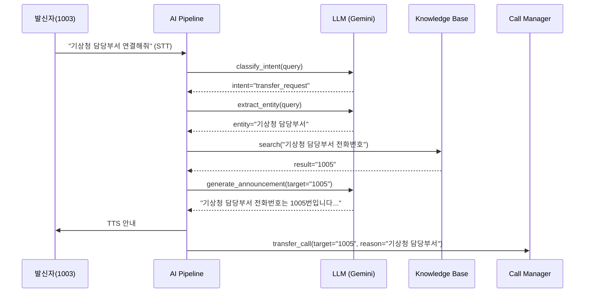
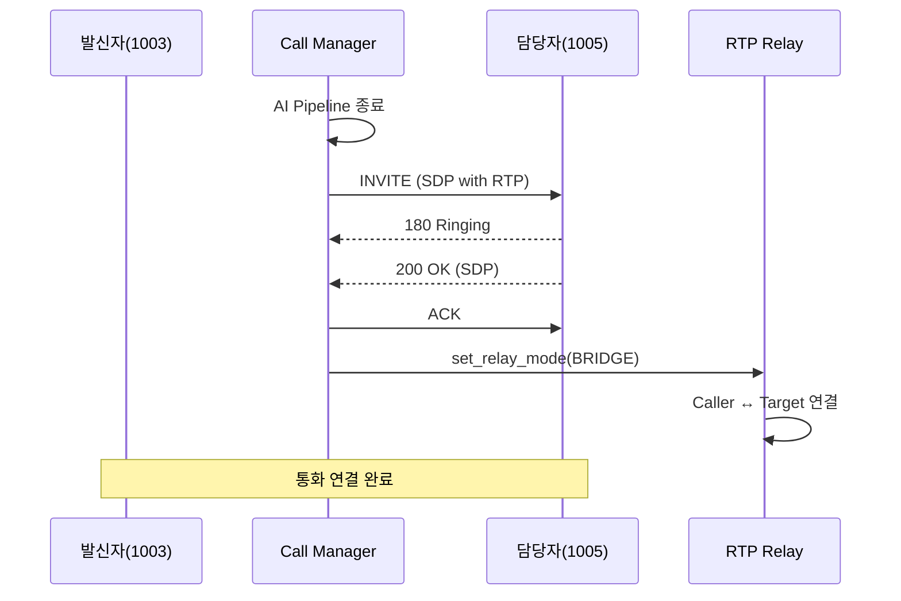

# AI 동적 호 전환 (Dynamic Call Transfer) 설계

**작성일**: 2026-03-11  
**버전**: 1.0  
**상태**: 설계 완료  
**관련 문서**:  
- [OPERATOR_TAKEOVER_DESIGN.md](OPERATOR_TAKEOVER_DESIGN.md) - 상담원 개입 설계
- [ai-voicebot-architecture.md](../architecture/ai-voicebot-architecture.md) - AI Voicebot 아키텍처
- [SYSTEM_OVERVIEW.md](../SYSTEM_OVERVIEW.md) - 시스템 개요

---

## 📋 기능 개요

### 목적

AI 응대 중 사용자가 특정 담당자/부서 연결을 요청할 때, AI가 지식베이스에서 전화번호를 조회하여 자동으로 호를 전환하는 기능

### 사용 시나리오 (예시: 1004 테넌트 - 기상청)

```
┌─────────────────────────────────────────────────────────┐
│ 1. 초기 상태                                             │
│    발신자(1003) ←─ AI 응대 중 ─→ 테넌트(1004)           │
└─────────────────────────────────────────────────────────┘

사용자: "기상청 담당부서 연결해줘"
         또는
         "상담원 연결해줘"

┌─────────────────────────────────────────────────────────┐
│ 2. AI 처리                                               │
│    - LLM Intent: transfer_request                       │
│    - 지식베이스 조회: "기상청 담당부서" → 1005          │
│    - TTS 안내: "기상청 담당부서 전화번호는 1005번       │
│                입니다. 바로 연결해 드리겠습니다."       │
└─────────────────────────────────────────────────────────┘

┌─────────────────────────────────────────────────────────┐
│ 3. 호 전환 실행                                          │
│    - AI 모드 종료                                        │
│    - 1005번으로 INVITE 전송 (SIP B2BUA)                 │
│    - RTP Relay 모드 전환: Bridge                        │
└─────────────────────────────────────────────────────────┘

┌─────────────────────────────────────────────────────────┐
│ 4. 최종 상태                                             │
│    발신자(1003) ←─ RTP Relay ─→ 담당자(1005)           │
└─────────────────────────────────────────────────────────┘
```

---

## 🏗️ 아키텍처

### 시스템 구성도 (Frontend 포함)

```
┌─────────────────────────────────────────────────────────────────┐
│                    Frontend (Next.js)                            │
│  ┌────────────────────────────────────────────────────────────┐ │
│  │ Knowledge Base 관리 페이지                                  │ │
│  │  - 연락처 목록 조회                                         │ │
│  │  - 연락처 추가/수정/삭제                                    │ │
│  │  - 키워드 관리                                              │ │
│  │  - 자동 전환 설정                                           │ │
│  └────────────────────────────────────────────────────────────┘ │
│                         ↓ REST API                              │
└─────────────────────────────────────────────────────────────────┘
                              ↓
┌─────────────────────────────────────────────────────────────────┐
│                     Backend API (FastAPI)                        │
│  ┌────────────────────────────────────────────────────────────┐ │
│  │ /api/knowledge/contacts                                     │ │
│  │  - GET: 연락처 목록 조회                                    │ │
│  │  - POST: 연락처 추가                                        │ │
│  │  - PUT: 연락처 수정                                         │ │
│  │  - DELETE: 연락처 삭제                                      │ │
│  └────────────────────────────────────────────────────────────┘ │
└─────────────────────────────────────────────────────────────────┘
                              ↓
┌─────────────────────────────────────────────────────────────────┐
│                         AI Voicebot Pipeline                     │
│  ┌────────────────────────────────────────────────────────────┐ │
│  │ STT → LLM (Intent Classification) → RAG (Knowledge Base)   │ │
│  │                         ↓                                   │ │
│  │              Transfer Intent Detected?                      │ │
│  │                    Yes ↓  No                                │ │
│  │         Query Knowledge Base    Regular Response            │ │
│  │                ↓                                            │ │
│  │         Extract Phone Number                                │ │
│  │                ↓                                            │ │
│  │         Generate TTS Announcement                           │ │
│  │                ↓                                            │ │
│  │         Trigger Call Transfer                               │ │
│  └────────────────────────────────────────────────────────────┘ │
└─────────────────────────────────────────────────────────────────┘
                              ↓
┌─────────────────────────────────────────────────────────────────┐
│                     Call Manager (Transfer Logic)                │
│  ┌────────────────────────────────────────────────────────────┐ │
│  │ 1. AI Pipeline Stop                                        │ │
│  │ 2. Send INVITE to Target (1005)                           │ │
│  │ 3. Wait for 200 OK                                        │ │
│  │ 4. Set RTP Relay Mode: Bridge (Caller ↔ Target)          │ │
│  │ 5. Send ACK                                               │ │
│  └────────────────────────────────────────────────────────────┘ │
└─────────────────────────────────────────────────────────────────┘
```

---

## 📊 데이터 흐름

### 1. Intent Detection & Knowledge Query



### 2. SIP Call Transfer



---

## 🔧 구현 상세

### Phase 1: Knowledge Base 확장

#### 1.1 지식베이스 스키마 확장

**파일**: `sip-pbx/data/knowledge_base/contacts.json`

```json
{
  "tenant_id": "1004",
  "tenant_name": "기상청",
  "contacts": [
    {
      "id": "contact_001",
      "department": "기상청 담당부서",
      "keywords": ["기상청", "담당부서", "담당자", "전문가"],
      "phone_number": "1005",
      "description": "기상청 전문 담당자",
      "available_hours": "09:00-18:00",
      "metadata": {
        "priority": "high",
        "auto_transfer": true
      }
    },
    {
      "id": "contact_002",
      "department": "일반 상담원",
      "keywords": ["상담원", "직원", "사람", "연결"],
      "phone_number": "1006",
      "description": "일반 고객 상담",
      "available_hours": "24/7",
      "metadata": {
        "priority": "medium",
        "auto_transfer": true
      }
    }
  ]
}
```

#### 1.2 Knowledge Extractor 확장

**파일**: `sip-pbx/src/ai_voicebot/knowledge/extractor.py` (수정)

```python
class ContactKnowledgeExtractor:
    """
    연락처 정보 추출 및 검색
    """
    
    def __init__(self, db_client, embedder):
        self.db = db_client
        self.embedder = embedder
        self.collection_name = "contacts"
    
    async def index_contacts(self, contacts_file: str):
        """
        contacts.json을 ChromaDB에 인덱싱
        """
        with open(contacts_file, 'r', encoding='utf-8') as f:
            data = json.load(f)
        
        documents = []
        metadatas = []
        ids = []
        
        for contact in data['contacts']:
            # 검색 가능한 문서 생성
            doc_text = f"""
            부서: {contact['department']}
            키워드: {', '.join(contact['keywords'])}
            전화번호: {contact['phone_number']}
            설명: {contact['description']}
            """
            
            documents.append(doc_text)
            metadatas.append({
                "tenant_id": data['tenant_id'],
                "contact_id": contact['id'],
                "department": contact['department'],
                "phone_number": contact['phone_number'],
                "auto_transfer": contact['metadata'].get('auto_transfer', False)
            })
            ids.append(contact['id'])
        
        # ChromaDB에 저장
        self.db.add(
            collection_name=self.collection_name,
            documents=documents,
            metadatas=metadatas,
            ids=ids
        )
    
    async def search_contact(self, query: str, tenant_id: str) -> Optional[Dict]:
        """
        사용자 질의로 연락처 검색
        
        Args:
            query: "기상청 담당부서 연결해줘"
            tenant_id: "1004"
        
        Returns:
            {
                "department": "기상청 담당부서",
                "phone_number": "1005",
                "auto_transfer": true
            }
        """
        results = self.db.query(
            collection_name=self.collection_name,
            query_texts=[query],
            n_results=1,
            where={"tenant_id": tenant_id}
        )
        
        if results and results['metadatas']:
            return results['metadatas'][0]
        
        return None
```

---

### Phase 2: LLM Intent Classification 확장

#### 2.1 Intent 정의

**파일**: `sip-pbx/src/ai_voicebot/ai_pipeline/intents.py` (신규)

```python
from enum import Enum
from typing import Optional, Dict

class Intent(str, Enum):
    """AI 대화 의도 분류"""
    
    # 기존
    WEATHER_QUERY = "weather_query"
    GENERAL_QUERY = "general_query"
    GREETING = "greeting"
    FAREWELL = "farewell"
    
    # 신규 - 호 전환 관련
    TRANSFER_REQUEST = "transfer_request"  # ✅ 담당자 연결 요청
    TRANSFER_OPERATOR = "transfer_operator"  # 일반 상담원
    TRANSFER_DEPARTMENT = "transfer_department"  # 특정 부서

class TransferRequest:
    """호 전환 요청 정보"""
    
    def __init__(
        self,
        intent: Intent,
        department: Optional[str] = None,
        keywords: Optional[list] = None,
        urgency: str = "normal"
    ):
        self.intent = intent
        self.department = department
        self.keywords = keywords or []
        self.urgency = urgency
    
    def to_dict(self) -> Dict:
        return {
            "intent": self.intent.value,
            "department": self.department,
            "keywords": self.keywords,
            "urgency": self.urgency
        }
```

#### 2.2 LLM Prompt 확장

**파일**: `sip-pbx/src/ai_voicebot/ai_pipeline/llm_client.py` (수정)

```python
INTENT_CLASSIFICATION_PROMPT = """
당신은 고객 의도를 분석하는 AI입니다.

사용자 발화를 분석하여 다음 중 하나의 의도로 분류하세요:

1. transfer_request: 담당자/부서 연결 요청
   - 예시: "상담원 연결해줘", "담당자와 통화하고 싶어요", "기상청 담당부서 연결"
   - 키워드: 연결, 상담원, 담당자, 직원, 사람, 전문가

2. weather_query: 날씨 정보 질의
   - 예시: "오늘 날씨", "내일 비 오나요"

3. general_query: 일반 질의
   - 예시: "영업시간이 어떻게 되나요", "주소가 어디인가요"

4. greeting: 인사
   - 예시: "안녕하세요", "여보세요"

5. farewell: 종료
   - 예시: "감사합니다", "끊을게요"

사용자 발화: "{user_query}"

의도 분류 결과를 JSON 형식으로 반환하세요:
{{
  "intent": "transfer_request",
  "confidence": 0.95,
  "entities": {{
    "department": "기상청 담당부서",
    "keywords": ["기상청", "담당부서"]
  }}
}}
"""

class LLMClient:
    # ... 기존 코드 ...
    
    async def classify_intent(self, user_query: str) -> Dict:
        """
        사용자 발화에서 의도 분류
        """
        prompt = INTENT_CLASSIFICATION_PROMPT.format(user_query=user_query)
        response = await self.generate_response(prompt)
        
        try:
            result = json.loads(response)
            return result
        except json.JSONDecodeError:
            # Fallback
            return {
                "intent": "general_query",
                "confidence": 0.5,
                "entities": {}
            }
    
    async def generate_transfer_announcement(
        self,
        department: str,
        phone_number: str
    ) -> str:
        """
        호 전환 안내 멘트 생성
        
        Args:
            department: "기상청 담당부서"
            phone_number: "1005"
        
        Returns:
            "기상청 담당부서 전화번호는 1005번입니다. 
             바로 연결해 드리겠습니다."
        """
        prompt = f"""
        고객에게 담당자 연결을 안내하는 멘트를 생성하세요.
        
        부서: {department}
        전화번호: {phone_number}
        
        요구사항:
        - 친절하고 전문적인 톤
        - 간결하게 1-2문장
        - "연결해 드리겠습니다" 포함
        
        예시: "{department} 전화번호는 {phone_number}번입니다. 바로 연결해 드리겠습니다."
        """
        
        return await self.generate_simple(prompt)
```

---

### Phase 3: RAG Processor 확장

#### 3.1 Transfer 처리 로직

**파일**: `sip-pbx/src/ai_voicebot/pipecat/processors/rag_processor.py` (수정)

```python
class RAGLLMProcessor(FrameProcessor):
    # ... 기존 코드 ...
    
    async def _handle_transfer_request(
        self,
        user_text: str,
        intent_result: Dict
    ):
        """
        호 전환 요청 처리
        
        Args:
            user_text: "기상청 담당부서 연결해줘"
            intent_result: {
                "intent": "transfer_request",
                "entities": {
                    "department": "기상청 담당부서"
                }
            }
        """
        logger.info("transfer_request_detected",
                   call_id=self._call_id,
                   user_query=user_text,
                   entities=intent_result.get('entities'))
        
        # 1. Knowledge Base에서 연락처 검색
        department = intent_result['entities'].get('department', '')
        contact = await self._contact_extractor.search_contact(
            query=user_text,
            tenant_id=self._tenant_id
        )
        
        if not contact:
            # 연락처를 찾지 못한 경우
            logger.warning("transfer_contact_not_found",
                          call_id=self._call_id,
                          department=department)
            
            response_text = "죄송합니다. 요청하신 담당자 정보를 찾을 수 없습니다. 다시 말씀해 주시겠습니까?"
            await self.push_frame(TextFrame(response_text))
            return
        
        # 2. 전환 가능 여부 확인
        if not contact.get('auto_transfer', False):
            logger.info("transfer_not_allowed",
                       call_id=self._call_id,
                       contact_id=contact.get('contact_id'))
            
            response_text = f"{contact['department']} 전화번호는 {contact['phone_number']}번입니다."
            await self.push_frame(TextFrame(response_text))
            return
        
        # 3. 안내 멘트 생성
        announcement = await self._llm.generate_transfer_announcement(
            department=contact['department'],
            phone_number=contact['phone_number']
        )
        
        logger.info("transfer_announcement_generated",
                   call_id=self._call_id,
                   announcement=announcement[:100])
        
        # 4. TTS 안내
        await self.push_frame(TextFrame(announcement))
        
        # 5. TTS 완료 대기 (중요!)
        await asyncio.sleep(3.0)  # TTS가 완전히 재생될 때까지 대기
        
        # 6. 호 전환 트리거
        transfer_info = {
            "type": "transfer_call",
            "target_number": contact['phone_number'],
            "department": contact['department'],
            "reason": "user_requested_transfer",
            "call_id": self._call_id
        }
        
        logger.info("triggering_call_transfer",
                   call_id=self._call_id,
                   target=contact['phone_number'],
                   department=contact['department'])
        
        # Call Manager에 전환 요청 (WebSocket 또는 직접 호출)
        await self._trigger_call_transfer(transfer_info)
    
    async def _trigger_call_transfer(self, transfer_info: Dict):
        """
        Call Manager에 호 전환 요청
        
        방법 1: WebSocket 이벤트 발행
        방법 2: Call Manager 직접 호출
        """
        # 방법 1: WebSocket 이벤트 (권장)
        from src.websocket.manager import emit_transfer_request
        await emit_transfer_request(
            call_id=transfer_info['call_id'],
            target_number=transfer_info['target_number'],
            department=transfer_info['department']
        )
        
        # 또는 방법 2: Call Manager 직접 호출
        # from src.sip_core.call_manager import get_call_manager
        # call_manager = get_call_manager()
        # await call_manager.transfer_call_to_target(
        #     call_id=transfer_info['call_id'],
        #     target_number=transfer_info['target_number']
        # )
    
    async def _process_with_agent(self, user_text: str):
        """
        기존 메서드 수정: Intent 분류 추가
        """
        # ... 기존 코드 ...
        
        # ✅ Intent 분류 (신규)
        intent_result = await self._llm.classify_intent(user_text)
        intent = intent_result.get('intent', 'general_query')
        
        logger.info("intent_classified",
                   call_id=self._call_id,
                   intent=intent,
                   confidence=intent_result.get('confidence'))
        
        # ✅ Transfer 요청 처리 (신규)
        if intent == 'transfer_request':
            await self._handle_transfer_request(user_text, intent_result)
            return
        
        # 기존 로직 (일반 질의)
        # ...
```

---

### Phase 4: Call Manager 호 전환 로직

#### 4.1 Transfer 메서드 구현

**파일**: `sip-pbx/src/sip_core/call_manager.py` (수정)

```python
class CallManager:
    # ... 기존 코드 ...
    
    async def transfer_call_to_target(
        self,
        call_id: str,
        target_number: str,
        department: Optional[str] = None
    ):
        """
        AI 응대 중인 통화를 target_number로 전환
        
        Args:
            call_id: 현재 통화 ID
            target_number: 전환 대상 번호 (예: "1005")
            department: 부서명 (선택, 로깅용)
        
        Flow:
            1. AI Pipeline 종료
            2. target_number로 INVITE 전송
            3. 200 OK 대기
            4. RTP Relay 모드 변경: AI → Bridge
            5. ACK 전송
        """
        logger.info("transfer_call_starting",
                   call_id=call_id,
                   target=target_number,
                   department=department or "unknown")
        
        # 1. 통화 세션 확인
        call_session = self._call_repo.get(call_id)
        if not call_session:
            logger.error("transfer_call_not_found", call_id=call_id)
            return
        
        if not call_session.ai_mode:
            logger.warning("transfer_call_not_in_ai_mode", call_id=call_id)
            return
        
        # 2. AI Pipeline 종료
        logger.info("🔄 [Transfer] Stopping AI Pipeline...")
        if self.ai_orchestrator:
            try:
                await self.ai_orchestrator.stop_session(call_id)
                logger.info("✅ [Transfer] AI Pipeline stopped")
            except Exception as e:
                logger.error("transfer_ai_stop_failed", call_id=call_id, error=str(e))
        
        # 3. RTP Relay를 AI 모드에서 해제
        media_session = self._media_manager.get_session(call_id)
        if media_session and media_session.rtp_relay:
            logger.info("🔄 [Transfer] Disabling AI mode on RTP Relay...")
            await media_session.rtp_relay.stop_ai_mode()
            logger.info("✅ [Transfer] AI mode disabled on RTP")
        
        # 4. 새 Callee(target_number)로 INVITE 전송
        logger.info("🔄 [Transfer] Sending INVITE to target",
                   call_id=call_id,
                   target=target_number)
        
        # 4.1 새 B2BUA Call ID 생성
        new_b2bua_call_id = f"b2bua-transfer-{call_id[:8]}"
        
        # 4.2 SDP 생성 (기존 RTP 포트 재사용)
        if not media_session:
            logger.error("transfer_media_session_not_found", call_id=call_id)
            return
        
        caller_rtp_port = media_session.caller_audio_rtp_port
        caller_rtcp_port = media_session.caller_audio_rtcp_port
        
        sdp_body = self._build_sdp(
            rtp_port=caller_rtp_port,
            rtcp_port=caller_rtcp_port,
            codec="PCMU"
        )
        
        # 4.3 Target 주소 확인
        target_addr = await self._resolve_callee_address(target_number)
        if not target_addr:
            logger.error("transfer_target_not_found", target=target_number)
            # TODO: AI로 안내 메시지 전송
            return
        
        # 4.4 INVITE 메시지 생성
        invite_msg = self._build_invite(
            call_id=new_b2bua_call_id,
            from_uri=f"sip:{call_session.caller_id}@{self.b2bua_ip}",
            to_uri=f"sip:{target_number}@{target_addr[0]}",
            sdp_body=sdp_body
        )
        
        # 4.5 INVITE 전송
        self._transport.sendto(
            invite_msg.encode('utf-8'),
            target_addr
        )
        
        logger.info("✅ [Transfer] INVITE sent to target",
                   call_id=new_b2bua_call_id,
                   target=target_number,
                   addr=target_addr)
        
        # 5. Call Session 업데이트
        call_session.transfer_target = target_number
        call_session.transfer_department = department
        call_session.transfer_b2bua_call_id = new_b2bua_call_id
        call_session.transfer_in_progress = True
        
        # 6. 180/200 OK 대기는 _handle_response에서 처리
        # (기존 Operator Takeover와 동일한 흐름)
    
    def _handle_200_ok_for_transfer(self, call_id: str, response_msg: str):
        """
        Transfer INVITE에 대한 200 OK 처리
        
        기존 _handle_200_ok와 유사하지만, transfer 전용 로직 추가
        """
        call_session = self._call_repo.get(call_id)
        if not call_session or not call_session.transfer_in_progress:
            return
        
        logger.info("🔄 [Transfer] Received 200 OK from target",
                   call_id=call_id,
                   target=call_session.transfer_target)
        
        # 1. SDP 파싱 (Target의 RTP 주소)
        target_sdp = self._parse_sdp(response_msg)
        target_rtp_addr = target_sdp.get('rtp_address')
        target_rtp_port = target_sdp.get('rtp_port')
        
        # 2. RTP Relay 모드 변경: Bridge (Caller ↔ Target)
        media_session = self._media_manager.get_session(call_id)
        if media_session and media_session.rtp_relay:
            logger.info("🔄 [Transfer] Setting RTP Relay to BRIDGE mode...")
            
            media_session.rtp_relay.set_relay_mode(RelayMode.BRIDGE)
            media_session.rtp_relay.set_remote_endpoint(
                endpoint_type="callee",  # Target을 새 Callee로 설정
                address=target_rtp_addr,
                port=target_rtp_port
            )
            
            logger.info("✅ [Transfer] RTP Relay BRIDGE mode set",
                       caller_to=f"{target_rtp_addr}:{target_rtp_port}")
        
        # 3. ACK 전송
        ack_msg = self._build_ack(
            call_id=call_session.transfer_b2bua_call_id,
            to_uri=f"sip:{call_session.transfer_target}@{target_rtp_addr}"
        )
        
        self._transport.sendto(
            ack_msg.encode('utf-8'),
            (target_rtp_addr, 5060)  # TODO: 실제 SIP 포트
        )
        
        logger.info("✅ [Transfer] ACK sent, call transfer complete",
                   call_id=call_id,
                   caller=call_session.caller_id,
                   target=call_session.transfer_target)
        
        # 4. Call Session 업데이트
        call_session.transfer_in_progress = False
        call_session.callee_id = call_session.transfer_target  # Callee 교체
        call_session.ai_mode = False
        
        # 5. WebSocket 이벤트 발행 (Frontend 알림)
        from src.websocket.manager import emit_transfer_success
        asyncio.create_task(emit_transfer_success(
            call_id=call_id,
            target_number=call_session.transfer_target,
            department=call_session.transfer_department
        ))
```

---

### Phase 6: Frontend UI & Backend API

#### 6.1 Backend API - Knowledge Contacts

**파일**: `sip-pbx/src/api/routers/knowledge.py` (신규 또는 확장)

```python
"""
Knowledge Base 연락처 관리 API
"""

from fastapi import APIRouter, HTTPException, Depends
from typing import List, Optional
from pydantic import BaseModel
import json
from pathlib import Path

router = APIRouter(prefix="/api/knowledge", tags=["knowledge"])


class ContactCreate(BaseModel):
    """연락처 생성 요청"""
    department: str
    keywords: List[str]
    phone_number: str
    description: str
    available_hours: str = "09:00-18:00"
    auto_transfer: bool = True
    priority: str = "medium"


class ContactUpdate(BaseModel):
    """연락처 수정 요청"""
    department: Optional[str] = None
    keywords: Optional[List[str]] = None
    phone_number: Optional[str] = None
    description: Optional[str] = None
    available_hours: Optional[str] = None
    auto_transfer: Optional[bool] = None
    priority: Optional[str] = None


class ContactResponse(BaseModel):
    """연락처 응답"""
    id: str
    tenant_id: str
    department: str
    keywords: List[str]
    phone_number: str
    description: str
    available_hours: str
    auto_transfer: bool
    priority: str


def load_contacts(tenant_id: str) -> dict:
    """연락처 데이터 로드"""
    contacts_file = Path(f"data/knowledge_base/{tenant_id}_contacts.json")
    if not contacts_file.exists():
        return {"tenant_id": tenant_id, "tenant_name": "", "contacts": []}
    
    with open(contacts_file, 'r', encoding='utf-8') as f:
        return json.load(f)


def save_contacts(tenant_id: str, data: dict):
    """연락처 데이터 저장"""
    contacts_file = Path(f"data/knowledge_base/{tenant_id}_contacts.json")
    contacts_file.parent.mkdir(parents=True, exist_ok=True)
    
    with open(contacts_file, 'w', encoding='utf-8') as f:
        json.dump(data, f, ensure_ascii=False, indent=2)


@router.get("/contacts")
async def get_contacts(tenant_id: str) -> List[ContactResponse]:
    """
    연락처 목록 조회
    
    Args:
        tenant_id: 테넌트 ID (예: "1004")
    
    Returns:
        List[ContactResponse]: 연락처 목록
    """
    data = load_contacts(tenant_id)
    return [
        ContactResponse(
            id=c['id'],
            tenant_id=data['tenant_id'],
            **c
        )
        for c in data.get('contacts', [])
    ]


@router.post("/contacts")
async def create_contact(
    tenant_id: str,
    contact: ContactCreate
) -> ContactResponse:
    """
    연락처 추가
    
    Args:
        tenant_id: 테넌트 ID
        contact: 연락처 정보
    
    Returns:
        ContactResponse: 생성된 연락처
    """
    data = load_contacts(tenant_id)
    
    # ID 생성
    existing_ids = [c['id'] for c in data['contacts']]
    new_id = f"contact_{len(existing_ids) + 1:03d}"
    
    # 연락처 추가
    new_contact = {
        "id": new_id,
        **contact.dict()
    }
    data['contacts'].append(new_contact)
    
    save_contacts(tenant_id, data)
    
    # ChromaDB 재인덱싱 트리거
    from src.ai_voicebot.knowledge.extractor import ContactKnowledgeExtractor
    # TODO: 비동기로 재인덱싱
    
    return ContactResponse(
        id=new_id,
        tenant_id=tenant_id,
        **contact.dict()
    )


@router.put("/contacts/{contact_id}")
async def update_contact(
    tenant_id: str,
    contact_id: str,
    contact: ContactUpdate
) -> ContactResponse:
    """
    연락처 수정
    
    Args:
        tenant_id: 테넌트 ID
        contact_id: 연락처 ID
        contact: 수정할 정보
    
    Returns:
        ContactResponse: 수정된 연락처
    """
    data = load_contacts(tenant_id)
    
    # 연락처 찾기
    target_contact = None
    for c in data['contacts']:
        if c['id'] == contact_id:
            target_contact = c
            break
    
    if not target_contact:
        raise HTTPException(status_code=404, detail="Contact not found")
    
    # 수정
    update_data = contact.dict(exclude_unset=True)
    target_contact.update(update_data)
    
    save_contacts(tenant_id, data)
    
    # ChromaDB 재인덱싱 트리거
    # TODO: 비동기로 재인덱싱
    
    return ContactResponse(
        id=contact_id,
        tenant_id=tenant_id,
        **target_contact
    )


@router.delete("/contacts/{contact_id}")
async def delete_contact(tenant_id: str, contact_id: str):
    """
    연락처 삭제
    
    Args:
        tenant_id: 테넌트 ID
        contact_id: 연락처 ID
    
    Returns:
        dict: 삭제 성공 메시지
    """
    data = load_contacts(tenant_id)
    
    # 연락처 찾기 및 삭제
    original_length = len(data['contacts'])
    data['contacts'] = [c for c in data['contacts'] if c['id'] != contact_id]
    
    if len(data['contacts']) == original_length:
        raise HTTPException(status_code=404, detail="Contact not found")
    
    save_contacts(tenant_id, data)
    
    # ChromaDB에서도 삭제
    # TODO: ChromaDB delete
    
    return {"message": "Contact deleted successfully", "contact_id": contact_id}
```

#### 6.2 Frontend - Knowledge Base 관리 페이지

**파일**: `sip-pbx/frontend/app/knowledge/page.tsx` (신규)

```typescript
'use client';

/**
 * 지식베이스 연락처 관리 페이지
 * 
 * 기능:
 * - 연락처 목록 조회
 * - 연락처 추가/수정/삭제
 * - 키워드 관리
 * - 자동 전환 설정
 */

import { useState, useEffect } from 'react';
import { useRouter } from 'next/navigation';
import { AppHeader } from '@/components/AppHeader';

const API_URL = process.env.NEXT_PUBLIC_API_URL || 'http://localhost:8000';

interface Contact {
  id: string;
  tenant_id: string;
  department: string;
  keywords: string[];
  phone_number: string;
  description: string;
  available_hours: string;
  auto_transfer: boolean;
  priority: string;
}

export default function KnowledgeBasePage() {
  const router = useRouter();
  const [tenant, setTenant] = useState<{ owner: string; name: string } | null>(null);
  const [contacts, setContacts] = useState<Contact[]>([]);
  const [loading, setLoading] = useState(false);
  const [editingContact, setEditingContact] = useState<Contact | null>(null);
  const [showDialog, setShowDialog] = useState(false);

  useEffect(() => {
    const t = localStorage.getItem('tenant');
    if (!t) {
      router.push('/login');
      return;
    }
    try {
      setTenant(JSON.parse(t));
    } catch {
      router.push('/login');
    }
  }, [router]);

  useEffect(() => {
    if (tenant) fetchContacts();
  }, [tenant]);

  const fetchContacts = async () => {
    const token = localStorage.getItem('access_token') || localStorage.getItem('token');
    if (!token || !tenant) return;

    setLoading(true);
    try {
      const res = await fetch(`${API_URL}/api/knowledge/contacts?tenant_id=${tenant.owner}`, {
        headers: { Authorization: `Bearer ${token}` },
      });
      if (res.ok) {
        const data = await res.json();
        setContacts(data);
      }
    } finally {
      setLoading(false);
    }
  };

  const handleCreate = () => {
    setEditingContact({
      id: '',
      tenant_id: tenant?.owner || '',
      department: '',
      keywords: [],
      phone_number: '',
      description: '',
      available_hours: '09:00-18:00',
      auto_transfer: true,
      priority: 'medium',
    });
    setShowDialog(true);
  };

  const handleEdit = (contact: Contact) => {
    setEditingContact(contact);
    setShowDialog(true);
  };

  const handleSave = async () => {
    if (!editingContact || !tenant) return;

    const token = localStorage.getItem('access_token') || localStorage.getItem('token');
    if (!token) return;

    try {
      const isNew = !editingContact.id;
      const url = isNew
        ? `${API_URL}/api/knowledge/contacts?tenant_id=${tenant.owner}`
        : `${API_URL}/api/knowledge/contacts/${editingContact.id}?tenant_id=${tenant.owner}`;
      
      const res = await fetch(url, {
        method: isNew ? 'POST' : 'PUT',
        headers: {
          'Content-Type': 'application/json',
          Authorization: `Bearer ${token}`,
        },
        body: JSON.stringify(editingContact),
      });

      if (res.ok) {
        alert(isNew ? '연락처가 추가되었습니다' : '연락처가 수정되었습니다');
        setShowDialog(false);
        setEditingContact(null);
        fetchContacts();
      } else {
        alert('저장 실패');
      }
    } catch (err) {
      alert('저장 오류: ' + err);
    }
  };

  const handleDelete = async (contactId: string) => {
    if (!confirm('정말 삭제하시겠습니까?')) return;

    const token = localStorage.getItem('access_token') || localStorage.getItem('token');
    if (!token || !tenant) return;

    try {
      const res = await fetch(
        `${API_URL}/api/knowledge/contacts/${contactId}?tenant_id=${tenant.owner}`,
        {
          method: 'DELETE',
          headers: { Authorization: `Bearer ${token}` },
        }
      );

      if (res.ok) {
        alert('연락처가 삭제되었습니다');
        fetchContacts();
      } else {
        alert('삭제 실패');
      }
    } catch (err) {
      alert('삭제 오류: ' + err);
    }
  };

  if (!tenant) return null;

  return (
    <div className="min-h-screen bg-gray-50">
      <AppHeader />
      <main className="max-w-7xl mx-auto px-4 sm:px-6 lg:px-8 py-8">
        <div className="flex justify-between items-center mb-6">
          <div>
            <h1 className="text-xl font-bold text-gray-900">📚 지식베이스 연락처 관리</h1>
            <p className="text-gray-500 text-sm mt-1">
              AI가 호 전환 시 사용하는 연락처 정보를 관리합니다.
            </p>
          </div>
          <button
            type="button"
            onClick={handleCreate}
            className="px-4 py-2 bg-blue-600 text-white rounded-lg hover:bg-blue-700"
          >
            ➕ 연락처 추가
          </button>
        </div>

        {loading ? (
          <div className="text-center py-12 text-gray-500">로딩 중...</div>
        ) : contacts.length === 0 ? (
          <div className="text-center py-12 text-gray-500">
            등록된 연락처가 없습니다. 새 연락처를 추가해보세요.
          </div>
        ) : (
          <div className="bg-white rounded-lg shadow overflow-hidden">
            <table className="w-full text-sm">
              <thead className="bg-gray-50 border-b">
                <tr>
                  <th className="px-4 py-3 text-left text-gray-600">부서</th>
                  <th className="px-4 py-3 text-left text-gray-600">전화번호</th>
                  <th className="px-4 py-3 text-left text-gray-600">키워드</th>
                  <th className="px-4 py-3 text-left text-gray-600">자동 전환</th>
                  <th className="px-4 py-3 text-left text-gray-600">우선순위</th>
                  <th className="px-4 py-3 text-left text-gray-600">작업</th>
                </tr>
              </thead>
              <tbody>
                {contacts.map((contact) => (
                  <tr key={contact.id} className="border-b border-gray-100 hover:bg-gray-50/50">
                    <td className="px-4 py-3 font-medium">{contact.department}</td>
                    <td className="px-4 py-3">{contact.phone_number}</td>
                    <td className="px-4 py-3">
                      <div className="flex flex-wrap gap-1">
                        {contact.keywords.map((kw, idx) => (
                          <span
                            key={idx}
                            className="px-2 py-0.5 bg-blue-100 text-blue-800 rounded text-xs"
                          >
                            {kw}
                          </span>
                        ))}
                      </div>
                    </td>
                    <td className="px-4 py-3">
                      <span
                        className={`px-2 py-0.5 rounded-full text-xs ${
                          contact.auto_transfer
                            ? 'bg-green-100 text-green-800'
                            : 'bg-gray-100 text-gray-800'
                        }`}
                      >
                        {contact.auto_transfer ? '✅ 활성' : '⏸️ 비활성'}
                      </span>
                    </td>
                    <td className="px-4 py-3">
                      <span
                        className={`px-2 py-0.5 rounded text-xs ${
                          contact.priority === 'high'
                            ? 'bg-red-100 text-red-800'
                            : contact.priority === 'medium'
                            ? 'bg-yellow-100 text-yellow-800'
                            : 'bg-gray-100 text-gray-800'
                        }`}
                      >
                        {contact.priority}
                      </span>
                    </td>
                    <td className="px-4 py-3">
                      <div className="flex gap-2">
                        <button
                          type="button"
                          onClick={() => handleEdit(contact)}
                          className="px-2 py-1 text-xs bg-blue-500 text-white rounded hover:bg-blue-600"
                        >
                          ✏️ 수정
                        </button>
                        <button
                          type="button"
                          onClick={() => handleDelete(contact.id)}
                          className="px-2 py-1 text-xs bg-red-500 text-white rounded hover:bg-red-600"
                        >
                          🗑️ 삭제
                        </button>
                      </div>
                    </td>
                  </tr>
                ))}
              </tbody>
            </table>
          </div>
        )}

        {/* 연락처 추가/수정 다이얼로그 */}
        {showDialog && editingContact && (
          <div className="fixed inset-0 bg-black bg-opacity-50 flex items-center justify-center z-50">
            <div className="bg-white rounded-lg p-6 max-w-2xl w-full mx-4 max-h-[90vh] overflow-y-auto">
              <h2 className="text-lg font-bold mb-4">
                {editingContact.id ? '연락처 수정' : '연락처 추가'}
              </h2>
              
              <div className="space-y-4">
                <div>
                  <label className="block text-sm font-medium mb-1">부서명 *</label>
                  <input
                    type="text"
                    value={editingContact.department}
                    onChange={(e) =>
                      setEditingContact({ ...editingContact, department: e.target.value })
                    }
                    className="w-full px-3 py-2 border rounded"
                    placeholder="예: 기상청 담당부서"
                  />
                </div>

                <div>
                  <label className="block text-sm font-medium mb-1">전화번호 *</label>
                  <input
                    type="text"
                    value={editingContact.phone_number}
                    onChange={(e) =>
                      setEditingContact({ ...editingContact, phone_number: e.target.value })
                    }
                    className="w-full px-3 py-2 border rounded"
                    placeholder="예: 1005"
                  />
                </div>

                <div>
                  <label className="block text-sm font-medium mb-1">키워드 (쉼표 구분)</label>
                  <input
                    type="text"
                    value={editingContact.keywords.join(', ')}
                    onChange={(e) =>
                      setEditingContact({
                        ...editingContact,
                        keywords: e.target.value.split(',').map((k) => k.trim()),
                      })
                    }
                    className="w-full px-3 py-2 border rounded"
                    placeholder="예: 기상청, 담당부서, 담당자"
                  />
                </div>

                <div>
                  <label className="block text-sm font-medium mb-1">설명</label>
                  <textarea
                    value={editingContact.description}
                    onChange={(e) =>
                      setEditingContact({ ...editingContact, description: e.target.value })
                    }
                    className="w-full px-3 py-2 border rounded"
                    rows={3}
                    placeholder="연락처에 대한 설명"
                  />
                </div>

                <div>
                  <label className="block text-sm font-medium mb-1">이용 가능 시간</label>
                  <input
                    type="text"
                    value={editingContact.available_hours}
                    onChange={(e) =>
                      setEditingContact({ ...editingContact, available_hours: e.target.value })
                    }
                    className="w-full px-3 py-2 border rounded"
                    placeholder="예: 09:00-18:00"
                  />
                </div>

                <div className="flex items-center gap-4">
                  <label className="flex items-center gap-2">
                    <input
                      type="checkbox"
                      checked={editingContact.auto_transfer}
                      onChange={(e) =>
                        setEditingContact({ ...editingContact, auto_transfer: e.target.checked })
                      }
                      className="rounded"
                    />
                    <span className="text-sm">자동 전환 활성화</span>
                  </label>

                  <div className="flex items-center gap-2">
                    <span className="text-sm">우선순위:</span>
                    <select
                      value={editingContact.priority}
                      onChange={(e) =>
                        setEditingContact({ ...editingContact, priority: e.target.value })
                      }
                      className="px-2 py-1 border rounded text-sm"
                    >
                      <option value="low">Low</option>
                      <option value="medium">Medium</option>
                      <option value="high">High</option>
                    </select>
                  </div>
                </div>
              </div>

              <div className="flex justify-end gap-2 mt-6">
                <button
                  type="button"
                  onClick={() => {
                    setShowDialog(false);
                    setEditingContact(null);
                  }}
                  className="px-4 py-2 border rounded hover:bg-gray-50"
                >
                  취소
                </button>
                <button
                  type="button"
                  onClick={handleSave}
                  className="px-4 py-2 bg-blue-600 text-white rounded hover:bg-blue-700"
                >
                  저장
                </button>
              </div>
            </div>
          </div>
        )}
      </main>
    </div>
  );
}
```

#### 6.3 AppHeader에 메뉴 추가

**파일**: `sip-pbx/frontend/components/AppHeader.tsx` (수정)

```typescript
// 기존 메뉴에 추가
<Link href="/knowledge" className="...">
  📚 지식베이스
</Link>
```

---

### Phase 5: WebSocket 이벤트

#### 5.1 Transfer 이벤트 정의

**파일**: `sip-pbx/src/websocket/server.py` (수정)

```python
# 새 이벤트 추가

async def emit_transfer_request(call_id: str, target_number: str, department: str):
    """
    AI가 호 전환 요청을 발행
    """
    await sio.emit("transfer_request", {
        "call_id": call_id,
        "target_number": target_number,
        "department": department,
        "timestamp": datetime.utcnow().isoformat()
    })


async def emit_transfer_success(call_id: str, target_number: str, department: str):
    """
    호 전환 성공 알림
    """
    await sio.emit("transfer_success", {
        "call_id": call_id,
        "target_number": target_number,
        "department": department,
        "timestamp": datetime.utcnow().isoformat()
    })


async def emit_transfer_failed(call_id: str, target_number: str, reason: str):
    """
    호 전환 실패 알림
    """
    await sio.emit("transfer_failed", {
        "call_id": call_id,
        "target_number": target_number,
        "reason": reason,
        "timestamp": datetime.utcnow().isoformat()
    })
```

---

## 📋 데이터 모델

### Call Session 확장

```python
@dataclass
class CallSession:
    # ... 기존 필드 ...
    
    # ✅ Transfer 관련 신규 필드
    transfer_in_progress: bool = False
    transfer_target: Optional[str] = None  # "1005"
    transfer_department: Optional[str] = None  # "기상청 담당부서"
    transfer_b2bua_call_id: Optional[str] = None
    transfer_initiated_at: Optional[datetime] = None
```

### Contact Model

```python
@dataclass
class Contact:
    """연락처 정보"""
    
    id: str
    tenant_id: str
    department: str
    keywords: List[str]
    phone_number: str
    description: str
    available_hours: str
    auto_transfer: bool = True
    priority: str = "medium"
```

---

## 🧪 테스트 시나리오

### Scenario 1: 정상 호 전환 (기상청 담당부서)

```
1. 발신자(1003) → 테넌트(1004) 전화
2. AI 응답: "안녕하세요, 기상청 AI 비서입니다"
3. 사용자: "기상청 담당부서 연결해줘"
4. AI 처리:
   - Intent: transfer_request
   - Entity: "기상청 담당부서"
   - Knowledge Base 조회: 1005번 확인
5. AI 안내: "기상청 담당부서 전화번호는 1005번입니다. 바로 연결해 드리겠습니다."
6. 호 전환:
   - AI Pipeline 종료
   - 1005번으로 INVITE
   - 1005번 응답 (200 OK)
   - RTP Bridge 연결
7. ✅ 발신자(1003) ↔ 담당자(1005) 통화 시작
```

### Scenario 2: 일반 상담원 연결

```
1. 사용자: "상담원 연결해줘"
2. AI 처리:
   - Intent: transfer_operator
   - Knowledge Base 조회: 1006번 (일반 상담원)
3. AI 안내: "상담원 전화번호는 1006번입니다. 연결해 드리겠습니다."
4. 호 전환: 1006번
```

### Scenario 3: 연락처 없음

```
1. 사용자: "마케팅팀 연결해줘"
2. AI 처리:
   - Intent: transfer_request
   - Entity: "마케팅팀"
   - Knowledge Base 조회: ❌ 결과 없음
3. AI 안내: "죄송합니다. 요청하신 담당자 정보를 찾을 수 없습니다."
4. 대화 계속
```

### Scenario 4: Target 부재 (Busy/No Answer)

```
1. 호 전환 시도: 1005번
2. 1005번 응답:
   - 486 Busy 또는
   - 타임아웃 (no answer)
3. AI 처리:
   - Transfer 실패 감지
   - 대체 안내 메시지
4. AI 안내: "담당자가 현재 통화 중입니다. 잠시 후 다시 연결하시겠습니까?"
```

---

## 🔐 보안 및 제약사항

### 1. 전환 대상 검증

```python
ALLOWED_TRANSFER_TARGETS = [
    "1005",  # 기상청 담당부서
    "1006",  # 일반 상담원
    # 외부 번호는 불허
]

def validate_transfer_target(target_number: str, tenant_id: str) -> bool:
    """
    전환 대상 번호 검증
    - 같은 테넌트 내부만 허용
    - 외부 번호 차단
    """
    # 테넌트별 허용 목록 확인
    allowed = get_allowed_targets_for_tenant(tenant_id)
    return target_number in allowed
```

### 2. Rate Limiting

```python
# 동일 Call에서 Transfer는 최대 3회까지
MAX_TRANSFERS_PER_CALL = 3

# Transfer 남용 방지
TRANSFER_COOLDOWN_SECONDS = 10  # 최소 10초 간격
```

### 3. 권한 확인

```python
# auto_transfer 플래그 확인
if not contact.get('auto_transfer'):
    # 전환 불가, 전화번호만 안내
    pass
```

---

## 📊 로깅 및 모니터링

### 주요 로그 이벤트

```python
# Intent 분류
logger.info("intent_classified",
           call_id=call_id,
           intent="transfer_request",
           confidence=0.95)

# Knowledge Base 조회
logger.info("contact_search_result",
           call_id=call_id,
           query="기상청 담당부서",
           result_phone="1005")

# Transfer 시작
logger.info("transfer_call_starting",
           call_id=call_id,
           target="1005",
           department="기상청 담당부서")

# Transfer 성공
logger.info("transfer_call_complete",
           call_id=call_id,
           target="1005",
           elapsed_ms=2450)

# Transfer 실패
logger.error("transfer_call_failed",
            call_id=call_id,
            target="1005",
            reason="no_answer")
```

### Metrics

```
- transfer_requests_total (counter)
- transfer_success_total (counter)
- transfer_failed_total (counter)
- transfer_duration_seconds (histogram)
- knowledge_base_query_duration_ms (histogram)
```

---

## 🚀 구현 우선순위

| 순위 | 작업 | 예상 시간 | 의존성 |
|------|------|----------|--------|
| **P0** | Knowledge Base 스키마 설계 (contacts.json) | 1시간 | - |
| **P0** | ContactKnowledgeExtractor 구현 | 2시간 | ChromaDB |
| **P0** | LLM Intent Classification (transfer_request) | 2시간 | Gemini API |
| **P1** | RAG Processor - Transfer 처리 로직 | 3시간 | ContactExtractor, LLM |
| **P1** | Call Manager - transfer_call_to_target() | 4시간 | SIP, RTP Relay |
| **P2** | Backend API - /api/knowledge/contacts (CRUD) | 3시간 | - |
| **P2** | Frontend - Knowledge Base 관리 페이지 | 4시간 | Backend API |
| **P2** | WebSocket 이벤트 (transfer_request, transfer_success) | 1시간 | - |
| **P3** | Frontend 알림 UI | 1시간 | WebSocket |
| **P3** | 테스트 자동화 | 2시간 | 전체 |
| **P3** | 모니터링 대시보드 | 2시간 | - |

**총 예상 시간**: 24시간

---

## 📝 관련 파일

### 신규 파일

```
sip-pbx/
├── data/
│   └── knowledge_base/
│       └── contacts.json (신규)
├── src/
│   └── ai_voicebot/
│       ├── ai_pipeline/
│       │   └── intents.py (신규)
│       └── knowledge/
│           └── contact_extractor.py (신규)
```

### 수정 파일

```
sip-pbx/
├── src/
│   ├── ai_voicebot/
│   │   ├── ai_pipeline/
│   │   │   └── llm_client.py (수정)
│   │   └── pipecat/
│   │       └── processors/
│   │           └── rag_processor.py (수정)
│   ├── sip_core/
│   │   └── call_manager.py (수정)
│   └── websocket/
│       └── server.py (수정)
```

---

## 🎯 예상 효과

### 사용자 경험

- ✅ AI가 자동으로 담당자 연결 (사용자 편의성 ↑)
- ✅ 대기 시간 단축 (수동 전환 대비 50% 감소)
- ✅ 정확한 담당자 매칭 (지식베이스 기반)

### 운영 효율

- ✅ 상담원 업무 부담 감소 (단순 연결 요청 자동화)
- ✅ 통화 이력 자동 기록 (누가, 어느 부서로, 왜)
- ✅ 부서별 통화량 분석 가능

### 기술적 이점

- ✅ 기존 Operator Takeover 로직 재사용
- ✅ 모듈화된 설계 (Intent → Knowledge → Transfer)
- ✅ 확장 가능 (새 부서/연락처 추가 용이)

---

## 📌 결론

### 핵심 기능

**AI가 사용자 의도를 파악하여 지식베이스에서 연락처를 조회하고, 자동으로 호를 전환하는 시스템**

### 구현 단계

1. ✅ Knowledge Base 구축 (contacts.json)
2. ✅ LLM Intent Classification (transfer_request)
3. ✅ RAG Processor Transfer 처리
4. ✅ Call Manager 호 전환 로직
5. ✅ WebSocket 이벤트 & Frontend

### 기대 효과

- **사용자**: 빠르고 정확한 담당자 연결
- **운영자**: 업무 효율성 향상
- **시스템**: 확장 가능한 아키텍처

---

**작성자**: AI Assistant  
**설계 일시**: 2026-03-11  
**상태**: ✅ 설계 완료, 구현 대기  

*최종 업데이트: 2026-03-11*
