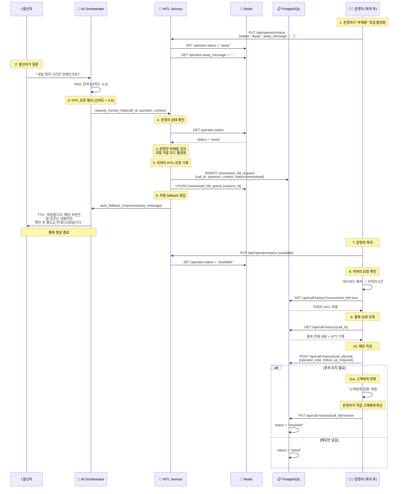

# 운영자 부재중 모드 설계 문서

## 📋 문서 정보

|| 항목 | 내용 |
||------|------|
|| **문서 버전** | v1.0 |
|| **작성일** | 2026-01-06 |
|| **작성자** | Winston (Architect) |
|| **프로젝트** | AI Voicebot - 운영자 부재중 모드 |
|| **상태** | Design Complete - Ready for Implementation |

---

## 1. 개요

### 1.1 배경

현재 HITL (Human-in-the-Loop) 시스템은 AI가 모르는 질문에 대해 **운영자가 항상 대기 중**이라는 가정 하에 설계되어 있습니다. 하지만 실제 운영 환경에서는 운영자가 부재중일 수 있으며, 이 경우 적절한 처리가 필요합니다.

### 1.2 목표

**운영자 부재중 모드**를 구현하여:
1. 운영자가 부재중일 때 HITL 요청을 자동으로 거절
2. 적절한 안내 멘트로 고객에게 응답
3. 미처리 HITL 요청을 통화 이력에 기록
4. 운영자 복귀 후 미처리 요청을 확인하고 후속 조치 가능

---

## 2. 시스템 아키텍처

### 2.1 운영자 상태 관리

#### 운영자 상태 정의

```python
class OperatorStatus(str, Enum):
    AVAILABLE = "available"   # 대기 중 - HITL 요청 즉시 처리
    AWAY = "away"            # 부재중 - HITL 자동 거절 + 통화 이력 기록
    BUSY = "busy"            # 통화 중 - HITL 대기열 추가
    OFFLINE = "offline"      # 오프라인
```

#### HITL 동작 모드 비교

| 운영자 상태 | HITL 요청 발생 시 동작 | AI 응답 멘트 |
|------------|---------------------|-------------|
| **AVAILABLE** | Frontend 알림 + 대기 음악 | "잠시만 기다려 주세요. 확인해 드리겠습니다." |
| **AWAY** ⭐ | 통화 이력 기록 + 자동 거절 | "죄송합니다. 해당 부분은 잘 모르는 내용이라 확인 후 별도로 안내드리겠습니다." |
| **BUSY** | 대기열 추가 (타임아웃 적용) | "잠시만 기다려 주세요." |
| **OFFLINE** | 통화 이력 기록 + 자동 거절 | "확인 후 별도로 안내드리겠습니다." |

### 2.2 데이터 저장소

#### Redis (실시간 상태)

```redis
# 운영자 상태
operator:{operator_id}:status = "available" | "away" | "busy" | "offline"
operator:{operator_id}:away_message = "커스텀 부재중 메시지"
operator:{operator_id}:status_changed_at = "2026-01-06T10:00:00Z"

# 미처리 HITL 큐
unresolved_hitl_queue = [request_id1, request_id2, ...]
```

#### PostgreSQL (영구 저장)

```sql
CREATE TABLE unresolved_hitl_requests (
    request_id UUID PRIMARY KEY,
    call_id VARCHAR(255) NOT NULL,
    caller_id VARCHAR(100),
    callee_id VARCHAR(100),
    
    -- HITL 요청 정보
    user_question TEXT NOT NULL,
    conversation_history JSONB,
    rag_results JSONB,
    ai_confidence FLOAT,
    
    -- 상태 관리
    timestamp TIMESTAMP NOT NULL,
    status VARCHAR(20) DEFAULT 'unresolved',
    -- status: unresolved | noted | resolved | contacted
    
    -- 운영자 처리
    operator_note TEXT,
    follow_up_required BOOLEAN DEFAULT FALSE,
    follow_up_phone VARCHAR(20),
    
    -- 처리 완료 정보
    noted_at TIMESTAMP,
    noted_by VARCHAR(100),
    resolved_at TIMESTAMP,
    resolved_by VARCHAR(100),
    
    INDEX idx_status (status),
    INDEX idx_timestamp (timestamp),
    INDEX idx_call_id (call_id)
);
```

---

## 3. 시퀀스 다이어그램

### 3.1 운영자 부재중 시 HITL 처리 흐름



---

## 4. API 설계

### 4.1 운영자 상태 관리 API

#### PUT /api/operator/status

**Request:**
```json
{
  "status": "away",
  "away_message": "죄송합니다. 확인 후 별도로 안내드리겠습니다."
}
```

**Response:**
```json
{
  "operator_id": "op_123",
  "status": "away",
  "away_message": "죄송합니다. 확인 후 별도로 안내드리겠습니다.",
  "status_changed_at": "2026-01-06T10:00:00Z",
  "unresolved_hitl_count": 5
}
```

#### GET /api/operator/status

**Response:**
```json
{
  "operator_id": "op_123",
  "status": "available",
  "away_message": "...",
  "status_changed_at": "2026-01-06T10:00:00Z",
  "unresolved_hitl_count": 0
}
```

### 4.2 통화 이력 및 미처리 HITL API

#### GET /api/call-history

**Query Parameters:**
- `page`: 페이지 번호 (default: 1)
- `limit`: 페이지당 항목 수 (default: 50)
- `unresolved_hitl`: `all` | `unresolved` | `noted` | `resolved` | `contacted`
- `date_from`: 시작 날짜 (ISO 8601)
- `date_to`: 종료 날짜 (ISO 8601)

**Example:**
```
GET /api/call-history?unresolved_hitl=unresolved&page=1&limit=20
```

**Response:**
```json
{
  "items": [
    {
      "call_id": "call_456",
      "caller_id": "010-1234-5678",
      "callee_id": "1000",
      "start_time": "2026-01-06T09:30:00Z",
      "end_time": "2026-01-06T09:35:00Z",
      "hitl_status": "unresolved",
      "user_question": "내일 회의 시간은 언제인가요?",
      "ai_confidence": 0.4,
      "timestamp": "2026-01-06T09:32:00Z"
    }
  ],
  "total": 5,
  "page": 1,
  "limit": 20
}
```

#### GET /api/call-history/{call_id}

**Response:**
```json
{
  "call_info": {
    "call_id": "call_456",
    "caller_id": "010-1234-5678",
    "callee_id": "1000",
    "start_time": "2026-01-06T09:30:00Z",
    "end_time": "2026-01-06T09:35:00Z"
  },
  "transcripts": [
    {
      "speaker": "user",
      "text": "여보세요?",
      "timestamp": "2026-01-06T09:30:05Z"
    },
    {
      "speaker": "ai",
      "text": "안녕하세요, AI 비서입니다.",
      "timestamp": "2026-01-06T09:30:07Z"
    }
  ],
  "hitl_request": {
    "user_question": "내일 회의 시간은 언제인가요?",
    "ai_confidence": 0.4,
    "rag_results": [...],
    "conversation_history": [...],
    "status": "unresolved"
  }
}
```

#### POST /api/call-history/{call_id}/note

**Request:**
```json
{
  "operator_note": "고객에게 전화 드려서 회의 시간 안내 완료",
  "follow_up_required": true,
  "follow_up_phone": "010-1234-5678"
}
```

**Response:**
```json
{
  "call_id": "call_456",
  "operator_note": "고객에게 전화 드려서 회의 시간 안내 완료",
  "follow_up_required": true,
  "status": "noted"
}
```

#### PUT /api/call-history/{call_id}/resolve

**Response:**
```json
{
  "call_id": "call_456",
  "status": "resolved",
  "resolved_at": "2026-01-06T10:15:00Z"
}
```

---

## 5. Frontend UI 설계

### 5.1 Dashboard - 운영자 상태 토글

```tsx
<Card className="col-span-12">
  <CardContent className="flex items-center justify-between p-4">
    {/* 왼쪽: 상태 토글 */}
    <div className="flex items-center gap-4">
      <span className="text-sm font-medium">운영자 상태:</span>
      <Badge variant={status === 'available' ? 'success' : 'secondary'}>
        {status === 'available' ? '🟢 대기중' : '🔴 부재중'}
      </Badge>
      <Switch
        checked={status === 'available'}
        onCheckedChange={(checked) => {
          updateOperatorStatus(checked ? 'available' : 'away');
        }}
      />
      {status === 'away' && (
        <Button variant="ghost" size="sm" onClick={() => setShowAwayMessageDialog(true)}>
          ✏️ 메시지 수정
        </Button>
      )}
    </div>
    
    {/* 오른쪽: 미처리 HITL 알림 */}
    {unresolvedHITLCount > 0 && (
      <Alert variant="warning" className="flex-1 ml-4">
        <AlertTriangle className="h-4 w-4" />
        <AlertTitle>미처리 HITL 요청 {unresolvedHITLCount}건</AlertTitle>
        <AlertDescription>
          부재중에 발생한 HITL 요청이 있습니다.{' '}
          <Button variant="link" onClick={() => router.push('/call-history?filter=unresolved')}>
            확인하기 →
          </Button>
        </AlertDescription>
      </Alert>
    )}
  </CardContent>
</Card>
```

### 5.2 통화 이력 페이지 - 미처리 HITL 필터

```tsx
<Tabs defaultValue="all" onValueChange={setActiveTab}>
  <TabsList>
    <TabsTrigger value="all">전체 통화</TabsTrigger>
    <TabsTrigger value="unresolved">
      미처리 HITL
      {unresolvedCount > 0 && (
        <Badge variant="destructive" className="ml-2">
          {unresolvedCount}
        </Badge>
      )}
    </TabsTrigger>
    <TabsTrigger value="noted">메모 작성됨</TabsTrigger>
    <TabsTrigger value="resolved">처리 완료</TabsTrigger>
  </TabsList>
  
  <TabsContent value="unresolved">
    <DataTable
      columns={[
        { header: "통화 시각", accessor: "timestamp" },
        { header: "발신자", accessor: "caller_id" },
        { header: "질문", accessor: "user_question" },
        { header: "AI 신뢰도", accessor: "ai_confidence" },
        { header: "액션", cell: (row) => (
          <Button size="sm" onClick={() => showCallDetail(row.call_id)}>
            상세 보기
          </Button>
        )}
      ]}
      data={unresolvedHITLRequests}
    />
  </TabsContent>
</Tabs>
```

### 5.3 통화 상세 다이얼로그 - 메모 작성

```tsx
<Dialog open={showCallDetail} onOpenChange={setShowCallDetail}>
  <DialogContent className="max-w-4xl">
    <DialogHeader>
      <DialogTitle>통화 상세 - {selectedCall?.call_id}</DialogTitle>
      <DialogDescription>
        발신자: {selectedCall?.caller_id} | 시각: {selectedCall?.timestamp}
      </DialogDescription>
    </DialogHeader>
    
    <div className="grid grid-cols-2 gap-4">
      {/* 왼쪽: HITL 요청 정보 */}
      <div>
        <h3 className="font-semibold mb-2">사용자 질문</h3>
        <p className="bg-gray-100 p-3 rounded">{selectedCall?.user_question}</p>
        
        <h3 className="font-semibold mt-4 mb-2">AI 신뢰도</h3>
        <Badge variant={selectedCall?.ai_confidence < 0.5 ? 'destructive' : 'warning'}>
          {(selectedCall?.ai_confidence * 100).toFixed(0)}%
        </Badge>
        
        <h3 className="font-semibold mt-4 mb-2">RAG 검색 결과</h3>
        <ul className="text-sm space-y-1">
          {selectedCall?.rag_results.map((r, i) => (
            <li key={i} className="border-l-2 pl-2">{r.content}</li>
          ))}
        </ul>
      </div>
      
      {/* 오른쪽: 통화 전체 내용 */}
      <div>
        <h3 className="font-semibold mb-2">통화 전체 내용 (STT)</h3>
        <ScrollArea className="h-64 border rounded p-2">
          {selectedCall?.transcripts.map((t, i) => (
            <div key={i} className={`mb-2 ${t.speaker === 'user' ? 'text-right' : ''}`}>
              <span className={`inline-block p-2 rounded ${
                t.speaker === 'user' ? 'bg-blue-100' : 'bg-gray-100'
              }`}>
                {t.speaker === 'user' ? '발신자' : 'AI'}: {t.text}
              </span>
            </div>
          ))}
        </ScrollArea>
      </div>
    </div>
    
    {/* 하단: 메모 작성 */}
    <div className="mt-4">
      <Label htmlFor="operator-note">운영자 메모</Label>
      <Textarea
        id="operator-note"
        value={operatorNote}
        onChange={(e) => setOperatorNote(e.target.value)}
        placeholder="이 통화에 대한 메모를 작성하세요..."
        rows={3}
      />
      
      <div className="flex items-center gap-2 mt-2">
        <Checkbox
          id="follow-up"
          checked={followUpRequired}
          onCheckedChange={setFollowUpRequired}
        />
        <Label htmlFor="follow-up">후속 조치 필요 (고객에게 전화)</Label>
      </div>
    </div>
    
    <DialogFooter>
      <Button variant="outline" onClick={() => setShowCallDetail(false)}>
        취소
      </Button>
      <Button onClick={handleSaveNote}>
        메모 저장
      </Button>
      {followUpRequired && (
        <Button variant="default" onClick={handleResolve}>
          처리 완료
        </Button>
      )}
    </DialogFooter>
  </DialogContent>
</Dialog>
```

---

## 6. Backend 구현 가이드

### 6.1 HITLService 수정

**파일**: `src/services/hitl.py`

```python
async def request_human_help(
    self,
    call_id: str,
    question: str,
    context: Dict[str, Any],
    urgency: str = 'medium',
    timeout_seconds: int = 300
) -> bool:
    """
    HITL 요청 생성 (운영자 상태 확인 추가)
    
    Returns:
        True: HITL 요청 성공 (운영자 대기 중)
        False: HITL 요청 거절 (운영자 부재중/오프라인)
    """
    # 1. 운영자 상태 확인 (신규)
    operator_status = await self.redis_client.get("operator:status")
    
    if operator_status in ['away', 'offline']:
        logger.warning("Operator is away/offline - auto fallback",
                      call_id=call_id,
                      operator_status=operator_status)
        
        # 2. 미처리 HITL 요청 기록
        await self._save_unresolved_hitl_request(
            call_id=call_id,
            question=question,
            context=context
        )
        
        # 3. 자동 fallback 응답 (AI Orchestrator에 전달)
        # AI Orchestrator는 이 신호를 받아 적절한 멘트 출력
        return False
    
    # 4. 운영자 대기 중 - 기존 로직 실행
    # ... (기존 코드 유지: HITL 요청 생성, WebSocket 알림 등)
    return True


async def _save_unresolved_hitl_request(
    self,
    call_id: str,
    question: str,
    context: Dict[str, Any]
) -> str:
    """미처리 HITL 요청을 DB에 저장"""
    request_id = str(uuid4())
    
    unresolved_request = {
        "request_id": request_id,
        "call_id": call_id,
        "caller_id": context.get('caller_id'),
        "callee_id": context.get('callee_id'),
        "user_question": question,
        "conversation_history": json.dumps(context.get('conversation_history', [])),
        "rag_results": json.dumps(context.get('rag_results', [])),
        "ai_confidence": context.get('ai_confidence', 0.0),
        "timestamp": datetime.now(),
        "status": "unresolved"
    }
    
    # PostgreSQL에 저장
    await self.db.execute(
        """
        INSERT INTO unresolved_hitl_requests
        (request_id, call_id, caller_id, callee_id, user_question,
         conversation_history, rag_results, ai_confidence, timestamp, status)
        VALUES (:request_id, :call_id, :caller_id, :callee_id, :user_question,
                :conversation_history, :rag_results, :ai_confidence, :timestamp, :status)
        """,
        unresolved_request
    )
    
    # Redis 큐에 추가
    await self.redis_client.lpush("unresolved_hitl_queue", request_id)
    
    logger.info("Unresolved HITL request saved", request_id=request_id)
    return request_id
```

### 6.2 AI Orchestrator 수정

**파일**: `src/ai_voicebot/orchestrator.py`

```python
async def _handle_hitl_request(
    self,
    user_text: str,
    rag_results: List[Dict],
    conversation_history: List[Dict]
) -> str:
    """HITL 요청 처리 (운영자 상태 확인 추가)"""
    
    # HITL 요청 컨텍스트
    context = {
        "caller_id": self.caller,
        "callee_id": self.callee,
        "conversation_history": conversation_history,
        "rag_results": rag_results,
        "ai_confidence": self.last_confidence
    }
    
    # HITLService에 요청
    hitl_accepted = await self.hitl_service.request_human_help(
        call_id=self.call_id,
        question=user_text,
        context=context,
        urgency='medium',
        timeout_seconds=300
    )
    
    if not hitl_accepted:
        # 운영자 부재중 - 자동 fallback 응답
        logger.info("HITL rejected - operator away, using fallback message")
        
        # Redis에서 커스텀 메시지 조회
        away_message = await self.redis.get("operator:away_message") or \
                      "죄송합니다. 해당 부분은 잘 모르는 내용이라 확인 후 별도로 안내드리겠습니다."
        
        # 즉시 응답 (대기 음악 없음)
        return away_message
    
    # 운영자 대기 중 - 기존 로직
    # ... (기존 코드: 대기 음악, 운영자 응답 대기 등)
```

---

## 7. 구현 체크리스트

### 7.1 Backend

- [ ] **Database Schema**
  - [ ] `unresolved_hitl_requests` 테이블 생성
  - [ ] 인덱스 추가 (status, timestamp, call_id)

- [ ] **HITLService 수정** (`src/services/hitl.py`)
  - [ ] `request_human_help()` 메서드에 운영자 상태 확인 로직 추가
  - [ ] `_save_unresolved_hitl_request()` 메서드 구현
  - [ ] Redis 큐 관리 (`unresolved_hitl_queue`)

- [ ] **AI Orchestrator 수정** (`src/ai_voicebot/orchestrator.py`)
  - [ ] `_handle_hitl_request()` 메서드에 fallback 로직 추가
  - [ ] 운영자 부재중 시 즉시 응답 (대기 음악 없음)

- [ ] **API Endpoints** (`src/api/routers/`)
  - [ ] `PUT /api/operator/status` - 운영자 상태 변경
  - [ ] `GET /api/operator/status` - 운영자 상태 조회
  - [ ] `GET /api/call-history` - 통화 이력 조회 (미처리 HITL 필터)
  - [ ] `GET /api/call-history/{call_id}` - 통화 상세 조회
  - [ ] `POST /api/call-history/{call_id}/note` - 메모 추가
  - [ ] `PUT /api/call-history/{call_id}/resolve` - HITL 요청 해결

### 7.2 Frontend

- [ ] **Dashboard 수정** (`frontend/app/dashboard/page.tsx`)
  - [ ] 운영자 상태 토글 컴포넌트 추가
  - [ ] 미처리 HITL 알림 배지 추가
  - [ ] 상태 변경 API 연동

- [ ] **통화 이력 페이지** (`frontend/app/call-history/page.tsx`)
  - [ ] 미처리 HITL 필터 탭 추가
  - [ ] 통화 목록 테이블 구현
  - [ ] 통화 상세 다이얼로그 구현

- [ ] **Zustand Store** (`frontend/store/useOperatorStore.ts`)
  - [ ] 운영자 상태 관리
  - [ ] 미처리 HITL 카운트 관리
  - [ ] API 연동

### 7.3 Configuration

- [ ] **config.yaml** - 부재중 메시지 기본값 설정
  ```yaml
  ai_voicebot:
    hitl:
      enabled: true
      default_away_message: "죄송합니다. 해당 부분은 잘 모르는 내용이라 확인 후 별도로 안내드리겠습니다."
      confidence_threshold: 0.6
      timeout_seconds: 300
  ```

### 7.4 Testing

- [ ] **Unit Tests**
  - [ ] HITLService.request_human_help() (운영자 away 시나리오)
  - [ ] HITLService._save_unresolved_hitl_request()
  - [ ] API Endpoints (status, call-history)

- [ ] **Integration Tests**
  - [ ] 운영자 부재중 전체 흐름 테스트
  - [ ] 운영자 복귀 후 미처리 요청 조회 테스트

- [ ] **E2E Tests**
  - [ ] Frontend 상태 토글 → Backend 반영 확인
  - [ ] 미처리 HITL 알림 → 통화 이력 페이지 이동
  - [ ] 메모 작성 → DB 저장 확인

---

## 8. 예상 일정

| 단계 | 작업 | 예상 시간 |
|------|------|----------|
| **Phase 1** | DB Schema 생성 + Migration | 1시간 |
| **Phase 2** | Backend HITLService 수정 | 2시간 |
| **Phase 3** | Backend AI Orchestrator 수정 | 2시간 |
| **Phase 4** | Backend API Endpoints 구현 | 3시간 |
| **Phase 5** | Frontend 운영자 상태 토글 | 2시간 |
| **Phase 6** | Frontend 통화 이력 페이지 | 4시간 |
| **Phase 7** | Testing (Unit + Integration) | 3시간 |
| **Phase 8** | E2E Testing & Bug Fix | 2시간 |

**총 예상 시간**: **19시간** (약 2.5 작업일)

---

## 9. 향후 고도화 방안

### 9.1 자동 부재중 전환
- N분간 사용자 활동 없으면 자동으로 "부재중"으로 전환
- `config.yaml`에서 설정 가능:
  ```yaml
  hitl:
    auto_away_minutes: 30  # 30분 무활동 시 자동 부재중
  ```

### 9.2 부재중 메시지 템플릿
- 시간대별 다른 메시지
  - 업무 시간: "확인 후 안내드리겠습니다"
  - 업무 외 시간: "업무 시간(9-18시)에 다시 전화 주시기 바랍니다"
- 카테고리별 메시지
  - 일반 문의 vs 긴급 문의

### 9.3 미처리 HITL 우선순위 관리
- 긴급도에 따른 정렬
- 대기 시간이 긴 요청 우선 표시
- 특정 발신자 VIP 처리

### 9.4 알림 강화
- 운영자 복귀 시 브라우저 푸시 알림
- 이메일/SMS 알림 (미처리 요청 N건 이상)
- Slack/Teams 연동

---

## 10. 관련 문서

- 📄 **[AI Voicebot Architecture](ai-voicebot-architecture.md)** - 전체 시스템 아키텍처
- 📄 **[Frontend Architecture](frontend-architecture.md)** - Frontend 상세 설계
- 📄 **[HITL Workflow](frontend-architecture.md#3-human-in-the-loop-hitl-architecture)** - HITL 상세 워크플로우

---

**설계 완료 - 구현 준비 완료** ✅

이 문서는 "운영자 부재중 모드" 기능의 완전한 설계 청사진입니다. 구현 시 이 문서를 참조하여 진행하시면 됩니다.

**질문이나 추가 설명이 필요한 부분이 있으면 말씀해주세요!** 🏗️

