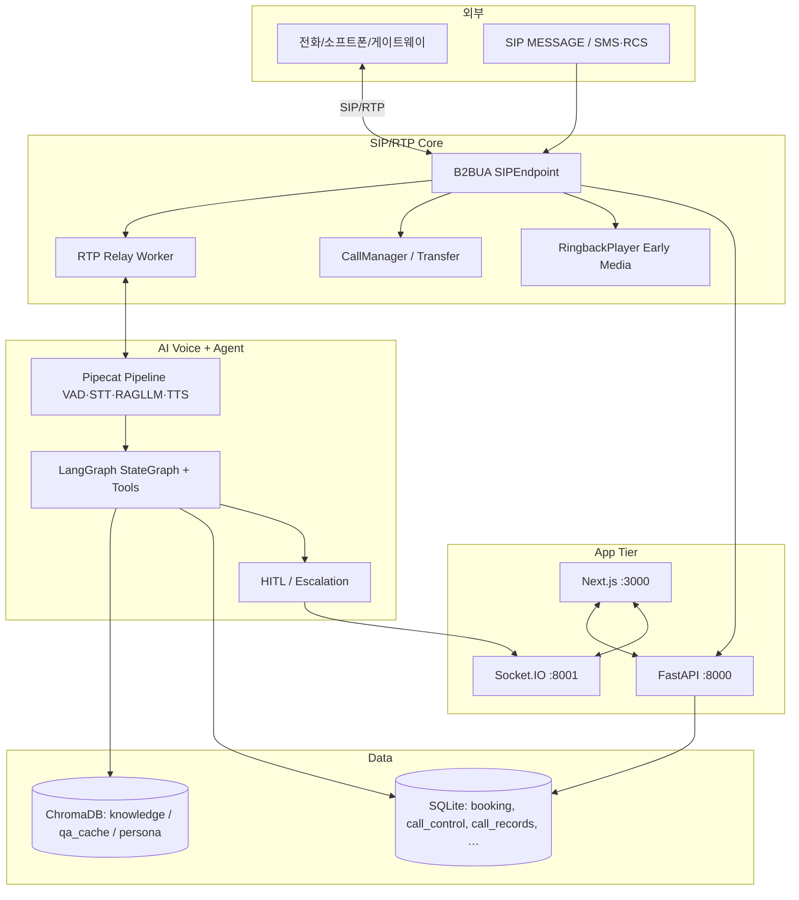

# 01 논리 아키텍처 (§3.1)

`SYSTEM_OVERVIEW`용. PNG는 [README](README.md)의 `mermaid-cli` 명령으로 생성한다.

```mermaid
%% AI SIP PBX — 3.1 논리 구성 (SYSTEM_OVERVIEW)
flowchart TB
  subgraph ext [외부]
    U[전화/소프트폰/게이트웨이]
    MSG[SIP MESSAGE / SMS·RCS]
  end

  subgraph pbx [SIP/RTP Core]
    B2BUA[B2BUA SIPEndpoint]
    CM[CallManager / Transfer]
    RR[RTP Relay Worker]
    RB[RingbackPlayer Early Media]
  end

  subgraph ai [AI Voice + Agent]
    PC[Pipecat Pipeline VAD·STT·RAGLLM·TTS]
    LG[LangGraph StateGraph + Tools]
    HITL[HITL / Escalation]
  end

  subgraph data [Data]
    CH[(ChromaDB: knowledge / qa_cache / persona)]
    SQL[(SQLite: booking, call_control, call_records, …)]
  end

  subgraph app [App Tier]
    API[FastAPI :8000]
    WS[Socket.IO :8001]
    FE[Next.js :3000]
  end

  U <-->|SIP/RTP| B2BUA
  B2BUA --> RR
  B2BUA --> CM
  B2BUA --> RB
  RR <--> PC
  PC --> LG
  LG --> CH
  LG --> SQL
  LG --> HITL
  HITL --> WS
  MSG --> B2BUA
  B2BUA --> API
  API --> SQL
  FE <--> API
  FE <--> WS
```
