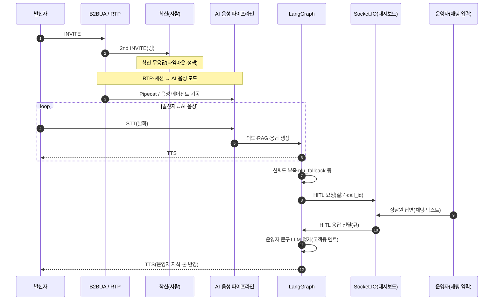

# 02 복잡 음성 루프: 무응답·AI·HITL (§3.3)

인입 통화에서 **착신 사람이 응답하지 않은 뒤 AI가 먼저 응대**하고, **답이 어려울 때 HITL**로 **운영자가 대시보드에 채팅으로 답한 내용**을 **AI가 가공해 TTS**로 전달하는 흐름(발표·온보딩용). PNG는 [README](README.md)의 `mermaid-cli` 명령으로 생성한다.

