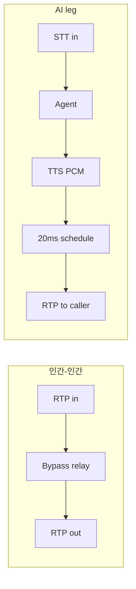

# 03 RTP — Bypass vs AI (§4.2)

`SYSTEM_OVERVIEW`용. PNG는 [README](README.md)의 `mermaid-cli` 명령으로 생성한다.

```mermaid
%% 4.2 RTP 처리 — Bypass vs AI leg
flowchart LR
  subgraph userleg [인간-인간]
    A[RTP in] --> B[Bypass relay]
    B --> C[RTP out]
  end
  subgraph aileg [AI leg]
    D[STT in] --> E[Agent]
    E --> F[TTS PCM]
    F --> G[20ms schedule]
    G --> H[RTP to caller]
  end
```
