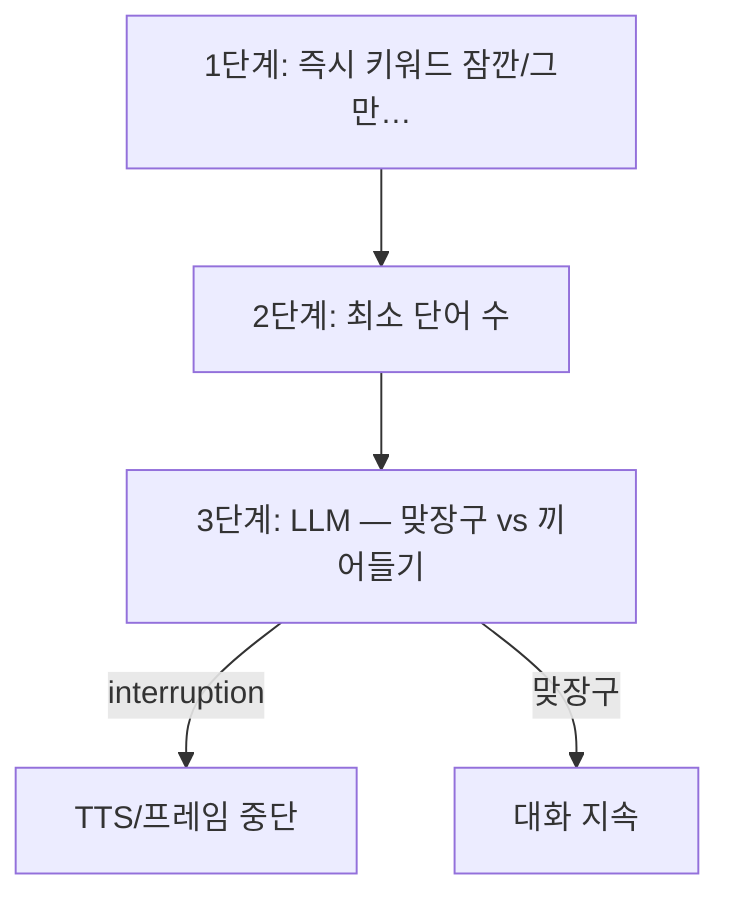

# 04 스마트 Barge-in (§4.3)

`SYSTEM_OVERVIEW`용. PNG는 [README](README.md)의 `mermaid-cli` 명령으로 생성한다.

```mermaid
%% 4.3 스마트 Barge-in 3단계
flowchart TD
  S1[1단계: 즉시 키워드 잠깐/그만…] --> S2[2단계: 최소 단어 수]
  S2 --> S3[3단계: LLM — 맞장구 vs 끼어들기]
  S3 -->|interruption| X[TTS/프레임 중단]
  S3 -->|맞장구| K[대화 지속]
```
