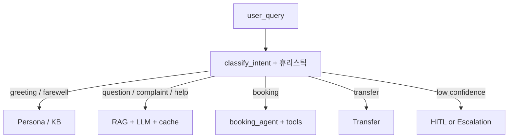

# 05 의도라우팅 (§4.4)

`SYSTEM_OVERVIEW`용. PNG는 [README](README.md)의 `mermaid-cli` 명령으로 생성한다.

```mermaid
%% 4.4 LangGraph 의도 → 처리 경로
flowchart TB
  Q[user_query] --> C[classify_intent + 휴리스틱]
  C -->|greeting / farewell| P[Persona / KB]
  C -->|question / complaint / help| R[RAG + LLM + cache]
  C -->|booking| B[booking_agent + tools]
  C -->|transfer| T[Transfer]
  C -->|low confidence| H[HITL or Escalation]
```
