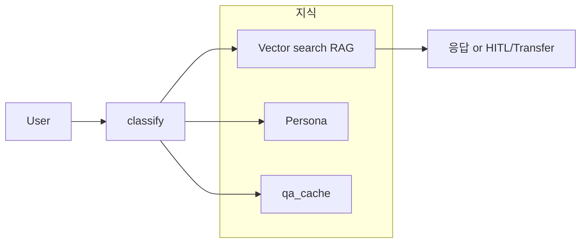

# 06 지식 흐름 (§4.5)

`SYSTEM_OVERVIEW`용. PNG는 [README](README.md)의 `mermaid-cli` 명령으로 생성한다.

```mermaid
%% 4.5 지식 베이스 흐름
flowchart LR
  subgraph kb [지식]
    RAG[Vector search RAG]
    PC2[Persona]
    QC[qa_cache]
  end
  U2[User] --> CL[classify]
  CL --> RAG
  CL --> PC2
  CL --> QC
  RAG --> ANS[응답 or HITL/Transfer]
```
