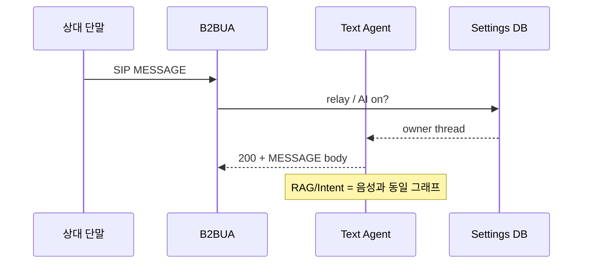

# 08 SIP MESSAGE 시퀀스 (§4.7)

`SYSTEM_OVERVIEW`용. PNG는 [README](README.md)의 `mermaid-cli` 명령으로 생성한다.

```mermaid
%% 4.7 SIP MESSAGE → Text Agent
sequenceDiagram
  participant Peer as 상대 단말
  participant P as B2BUA
  participant A as Text Agent
  participant S as Settings DB
  Peer->>P: SIP MESSAGE
  P->>S: relay / AI on?
  S-->>A: owner thread
  A-->>P: 200 + MESSAGE body
  Note over A: RAG/Intent = 음성과 동일 그래프
```
