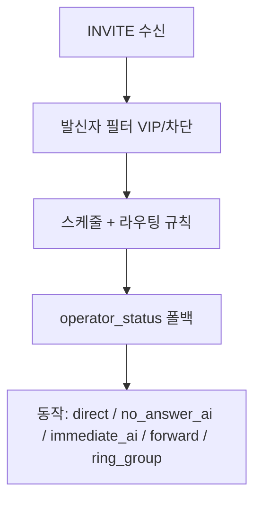

# 10 착신 제어 평가 (§4.10)

`SYSTEM_OVERVIEW`용. PNG는 [README](README.md)의 `mermaid-cli` 명령으로 생성한다.

```mermaid
%% 4.10 착신 제어 — 평가 순서 (요지)
flowchart TD
  INV[INVITE 수신] --> CF[발신자 필터 VIP/차단]
  CF --> SCH[스케줄 + 라우팅 규칙]
  SCH --> OP[operator_status 폴백]
  OP --> ACT[동작: direct / no_answer_ai / immediate_ai / forward / ring_group]
```
