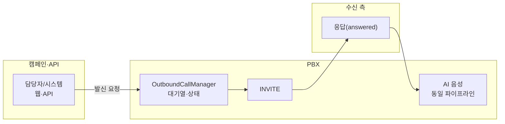

```mermaid
flowchart LR
  subgraph A["캠페인·API"]
    U["담당자/시스템\n웹·API"]
  end
  subgraph B["PBX"]
    O["OutboundCallManager\n대기열·상태"]
    I["INVITE"]
    AIV["AI 음성\n동일 파이프라인"]
  end
  subgraph C["수신 측"]
    R["응답(answered)"]
  end
  U -->|발신 요청| O
  O --> I
  I --> R
  R --> AIV
```
