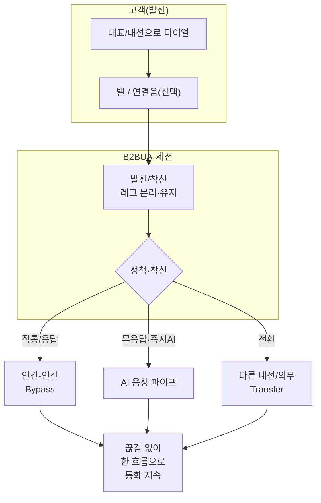

```mermaid
flowchart TB
  subgraph C["고객(발신)"]
    A["대표/내선으로 다이얼"] --> B["벨 / 연결음(선택)"]
  end
  subgraph B2B["B2BUA·세션"]
    B --> D["발신/착신\n레그 분리·유지"]
    D --> E{"정책·착신"}
  end
  E -->|직통/응답| F["인간-인간\nBypass"]
  E -->|무응답·즉시AI| G["AI 음성 파이프"]
  E -->|전환| H["다른 내선/외부\nTransfer"]
  F --> I["끊김 없이\n한 흐름으로\n통화 지속"]
  G --> I
  H --> I
```
