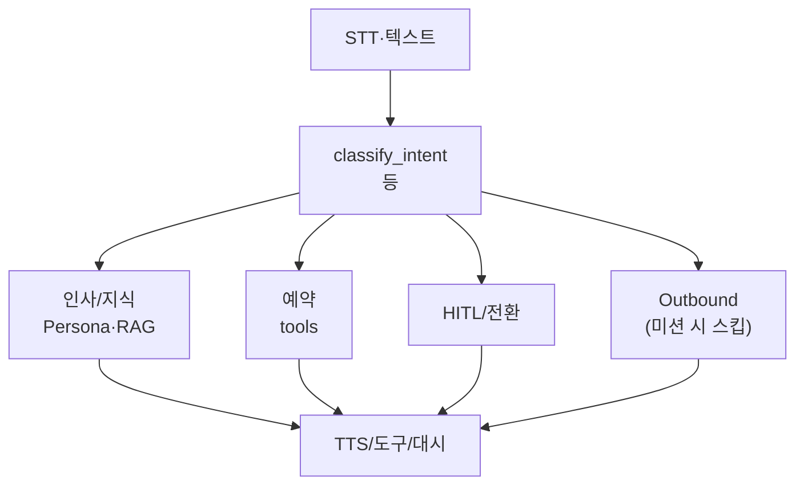

```mermaid
flowchart TB
  T["STT·텍스트"] --> C["classify_intent\n등"]
  C --> R1["인사/지식\nPersona·RAG"]
  C --> R2["예약\ntools"]
  C --> R3["HITL/전환"]
  C --> R4["Outbound\n(미션 시 스킵)"]
  R1 --> OUT["TTS/도구/대시"]
  R2 --> OUT
  R3 --> OUT
  R4 --> OUT
```
